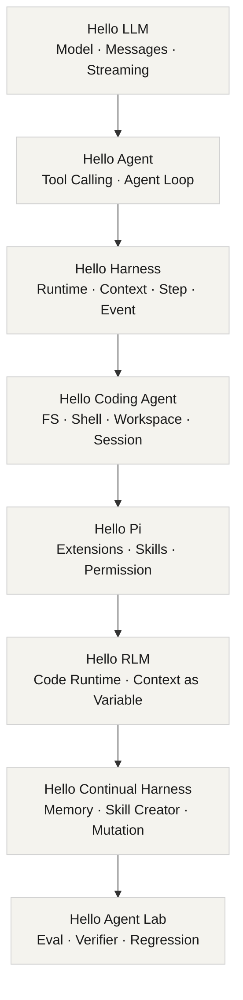

# Hello Harness

从 0 到 1 构建一个现代 Coding Agent Harness，并理解它如何从简单的 Tool Calling，逐步演进为 Runtime-oriented、Recursive、Continual 与 Self-Improving Harness。

> 不是教你调用某个 Agent Framework；而是亲手拆解一个现代 Agent Harness 怎样一步一步生长出来。

## 演进路线



## 开始学习

选择你的学习入口。课程分为教程、概览与资源三个部分。

<div class="card-grid">
  <a href="./tutorials/" class="card">
    <h3>教程</h3>
    <p>8 个 Stage、81 篇章节、每章一个可检出的 Git Tag，从第一个模型调用写到 Self-Improving Harness。</p>
  </a>
  <a href="./overview/" class="card">
    <h3>概览</h3>
    <p>项目定位、三代 Harness 演进路线与 6 个贯穿全程的真实案例。</p>
  </a>
  <a href="./resources/" class="card">
    <h3>资源</h3>
    <p>参考资料、术语约定与开发命令，可直接复制使用。</p>
  </a>
</div>

## 四次认知升级

<ul class="index-list">
  <li><code>LLM = Chatbot</code> → <code>LLM + Loop + Tool = Agent</code></li>
  <li><code>Agent = 一堆代码</code> → <code>Harness = Runtime System</code></li>
  <li><code>LLM chooses tools</code> → <code>LLM programs capabilities</code></li>
  <li><code>Developer improves agent</code> → <code>Agent proposes improvements</code></li>
</ul>

## 三个控制哲学

```text
Developer decides capabilities → Model chooses tools    （Tool-oriented）
Developer provides runtime     → Model programs capabilities （Runtime-oriented）
Developer provides boundaries  → Agent evolves harness   （Continual Harness）
```

## 教程如何使用

项目正处于初始化阶段。后续每一章会对应一份最小实现、一个可运行示例和一个 Git Tag。完成后你可以直接检出某个里程碑来阅读该章的最终状态：

```bash
git checkout v08-agent-loop
git checkout v40-pi-style
git checkout v56-rlm
git checkout v70-continual-harness
```

## 架构原则

- Model 层不依赖 Agent；Tool 层不依赖 Agent。
- Runtime 不绑定任何单一模型 Provider。
- 核心代码保持小、透明、可跟读（Core 目标 < 2000 LOC）。
- 自我改进的对象是可版本化 Harness State，而不是不可控地修改 Core。
- 每一个改进都必须经过验证、评测和回归检查，并支持回滚。

## 愿景

最终的 `Hello Harness` 应仍然是一个足够小的教育性核心，让读者能理解其中每一层：

```text
Task → Agent → Trajectory → Evaluation → Improvement Proposal
     → Validated Harness State → Next Run
```

目标不是让 Harness “看起来会自我进化”，而是让每一次改进都可观察、可验证、可回滚。
