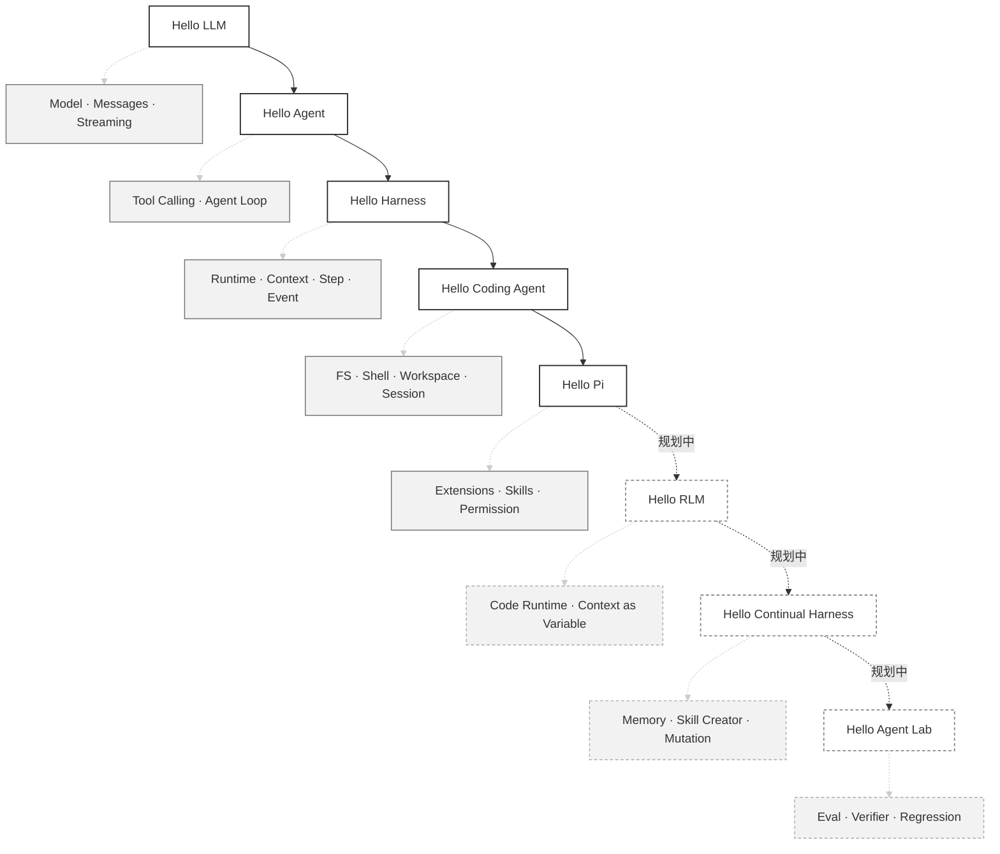

## 演进路线



> Stage 0–4（40 篇）已落地；Stage 5–7 为规划中的长期演进路线，文中以虚线标注。

## 四次认知升级

<ul class="index-list">
  <li><code>LLM = Chatbot</code> → <code>LLM + Loop + Tool = Agent</code></li>
  <li><code>Agent = 一堆代码</code> → <code>Harness = Runtime System</code></li>
  <li><code>LLM chooses tools</code> → <code>LLM programs capabilities</code></li>
  <li><code>Developer improves agent</code> → <code>Agent proposes improvements</code></li>
</ul>

## 三个控制哲学

```text
Developer decides capabilities → Model chooses tools    （Tool-oriented）
Developer provides runtime     → Model programs capabilities （Runtime-oriented）
Developer provides boundaries  → Agent evolves harness   （Continual Harness）
```

## 教程如何使用

目前 Stage 0–4 已落地，每章对应一个 Git Tag。你可以直接检出该章节的最终状态来对照阅读：

```bash
git checkout v08-agent-loop
git checkout v40-pi-style
```

Stage 5–7 的 Tag（如 `v56-rlm`、`v70-continual-harness`）属于规划中的后续路线，正文撰写完成后会陆续补齐。

## 架构原则

- Model 层不依赖 Agent；Tool 层不依赖 Agent。
- Runtime 不绑定任何单一模型 Provider。
- 核心代码保持小、透明、可跟读（Core 目标 < 2000 LOC）。
- 自我改进的对象是可版本化 Harness State，而不是不可控地修改 Core。
- 每一个改进都必须经过验证、评测和回归检查，并支持回滚。

## 愿景

最终的 `Hello Harness` 应仍然是一个足够小的教育性核心，让读者能理解其中每一层：

```text
Task → Agent → Trajectory → Evaluation → Improvement Proposal
     → Validated Harness State → Next Run
```

目标不是让 Harness “看起来会自我进化”，而是让每一次改进都可观察、可验证、可回滚。
