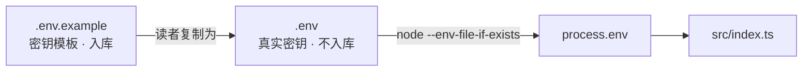

# 00 · 项目初始化

> <span class="stage-badge">Stage Hello LLM</span> · <span class="tag-badge">v00-empty</span>

一般来讲，想要从零造一个 Coding Agent Harness 的小伙伴，第一步脑子里想的都是「怎么把模型调起来」。但讲真，上来就怼模型调用，绝对是给自己挖坑——工程都跑不起来，后面每一章的「读一章、跑一章」就成了空谈。

这篇咱们不聊模型，先把「工程能跑」这层地基老老实实打牢。跟着做完，你就能用一句 `pnpm dev` 把项目跑起来，并且知道密钥该放哪、怎么保证它不进仓库。

<!-- more -->

## 一、上一版存在什么问题？

仓库刚刚初始化时，里面只有两样东西：`docs/`（文档站点）和 `plan/`（构思）。


它还不能跑任何教程代码。小伙伴如果此时想「读一章、跑一章」，会直接卡住，因为：

- 没有 `src/`，没有可执行入口；
- 没有 TypeScript 配置，写出来的代码没有类型检查；
- 没有密钥约定，不知道模型 Key 该放哪、会不会被意外提交；
- 没有一份统一的开发命令。

> 第一步不是写模型调用，而是先把「工程能跑」这层地基打牢。

那么问题来了——地基到底长啥样才算合格？接下来咱们就把它一件件补齐。

## 二、本篇解决什么问题？

建立最小、可运行、可验证的工程骨架：

1. 确定技术栈：**TypeScript + Node.js + pnpm**；
2. 建立最小工程结构：`package.json` / `tsconfig.json` / `src/`；
3. 约定唯一开发命令：**`pnpm dev`**；
4. 约定环境变量：`.env.example` 为模板、`.env` 不入库、启动时自动加载。

简单来讲，这一章只做一件事：**让工程「能跑、能查、不泄密」**。其他花里胡哨的，统统留到后面。

## 三、先看最终效果

上手前，先给大家看一眼跑起来的样子，心里有个底：

```bash
$ PS D:\Workspace\hui\project\hello-harness> pnpm dev

> hello-harness@0.1.0 dev D:\Workspace\hui\project\hello-harness
> node --import tsx --env-file-if-exists=.env src/index.ts

Hello, Harness!
  node         v25.6.1
  cwd          D:\Workspace\hui\project\hello-harness
  OPENAI_API_KEY  已配置
```

复制 `.env.example` 为 `.env` 并填入 Key 后，程序会显示 `已配置`；

没填也能正常启动，只是给出提示。整条命令只有一句：**`pnpm dev`**。对应的提醒如下


**请注意**：这里没填 Key 也能跑，不是 Bug，而是故意设计的——环境信息打印和环境变量加载，两件事要能分开验证。这个细节，后面会反复用到。

## 四、架构变化

这一章没有「架构」，只有「地基」。目录从空仓库变成：

```text
hello-harness/
├── src/
│   └── index.ts        # 最小可运行入口
├── .env.example        # 密钥模板（入库）
├── .env                # 真实密钥（不入库，由读者自己创建）
├── .gitignore
├── package.json
├── tsconfig.json
└── README.md
```

技术选型为什么是这三个？不少小伙伴可能会问「为啥不用 xxx」，下面这张表说清楚：

| 选择 | 理由 |
| --- | --- |
| TypeScript | 后续每一章都要表达类型化抽象（`Message`、`ToolCall`、`AgentStep`……），TS 是教材语言 |
| Node.js + pnpm | 无需构建服务器的纯 JS 生态，`pnpm dev` 一步到位；pnpm 的 `packageManager` 字段把包管理器版本也固化下来 |
| Node 内置 `--env-file-if-exists` | 加载 `.env` 不需要 `dotenv` 依赖，保持「先最小」 |

根 `package.json` 同时承载两类脚本：教程代码（`dev` / `typecheck`）与文档站点（`docs:*`）。文档站点是 `docs/` 下的工具，教程的核心演进发生在 `src/`。

> 作为一个有思考的小青年，你可能会嘀咕：一个 `.env` 加载都要专门设计？别急，等后面讲到「密钥不能进仓库」这种事故，你就知道这层地基有多值了。

## 五、核心抽象

只有三个约定，没有任何机动构造。重点关注下面这三点，后面每章都建立在它们之上：

**约定一：入口与命令。** `package.json` 中登记 `packageManager: "pnpm@10.31.0"`，并定义：

```jsonc
"scripts": {
  "dev": "node --import tsx --env-file-if-exists=.env src/index.ts",
  "typecheck": "tsc --noEmit"
}
```

`node --import tsx` 让 Node 直接加载 TypeScript（tsx 只做转译，不引入框架）；`--env-file-if-exists=.env` 由 Node 自己完成环境变量加载，`.env` 不存在时安静跳过。

**约定二：环境变量只有一张图。** 下面这个关系，是整个密钥约定的核心，请务必看一眼：



**约定三：类型检查独立于运行。** `tsconfig.json` 全量开启 `strict`，`pnpm typecheck` 只负责查错，不参与运行，保证“能跑”和“类型对”是可分开验证的两件事。

## 六、实现代码

接下来进入正题，下面给出这一章涉及的几个文件。代码都很短，但每一行都有它的存在理由。

**`src/index.ts`** —— 只验证两件事：TypeScript 能跑、环境变量约定生效：

```ts
function main() {
  console.log("Hello, Harness!");

  console.log(`  node         ${process.version}`);
  console.log(`  cwd          ${process.cwd()}`);

  const apiKey = process.env.OPENAI_API_KEY;
  if (apiKey) {
    console.log("  OPENAI_API_KEY  已配置");
  } else {
    console.warn("  OPENAI_API_KEY  未配置（复制 .env.example 为 .env 后填入）");
  }
}

main();
```

**`tsconfig.json`** 的关键几项（NodeNext 之前的常用组合，bundler 解析让教程里的 import 不带 `.js` 后缀）：

```jsonc
{
  "compilerOptions": {
    "target": "ES2022",
    "module": "ESNext",
    "moduleResolution": "Bundler",
    "strict": true,
    "noEmit": true
  },
  "include": ["src"]
}
```

**`.env.example`**：

```bash
# 复制本文件为 .env 并填入真实值。
# .env 已被 .gitignore 忽略，不会提交到仓库。

# Stage 0 之后章节使用的模型 Provider 密钥
OPENAI_API_KEY=
```

**`.gitignore`** 中与密钥相关的一行，保证 `.env` 永远不会进仓库，但 `.env.example` 保留：

```gitignore
.env
.env.*
!.env.example
```

> 关于把密钥提交到仓库这种鬼畜行为，踩过坑的小伙伴应该都懂那种原地爆炸的感觉。所以这一行 `.gitignore` 不是可选项，是保命项，绝对不能省。

## 七、运行 Demo

正确的使用姿势如下，三步走：

```bash
pnpm install            # 安装依赖（首次）
pnpm dev                # 运行 src/index.ts
pnpm typecheck          # 类型检查，应无报错
```

试一下未配置与已配置两种情况：

```bash
cp .env.example .env    # 然后填入一个假 Key 也能看到 "已配置"
pnpm dev
```

看到 `Hello, Harness!` 和 `OPENAI_API_KEY  已配置`（或 `未配置` 提示，都不会报错），就说明地基打好了。然后就可以愉快地玩耍接下来的章节了。

## 八、新架构解决了什么？

- **可运行**：`pnpm dev` 是最小验证，任何机器装好 Node + pnpm 都能跑；
- **可验证**：类型检查独立于运行，后续每章代码都有最低质量门槛；
- **安全**：密钥只存在于 `.env`，结构上不可能被提交；
- **可持续**：后续章节只需在 `src/` 里加文件，模型调用的接入点已经就位。

## 九、它又引入了什么问题？

地基打好了，但一切真正的能力仍是空白：

- `OpenAI` SDK 怎么接？用哪个端点和模型？
- Key 现在只是被读进来，**还没有任何一个请求真的发出**；
- 网络错误、超时、密钥失效怎么办？——现在还完全没有错误模型；
- 更根本的：`OPENAI_API_KEY` 是写死在环境变量名里的，**Model 与 Provider 是耦合的**，这违反了我们后续要建立的架构边界。

最大的矛盾：现在 `src/index.ts` 只打印环境信息，**距离一行模型调用还差一个完整的设计决策**。这正是下一章要跨过的坎。

## 十、下一章

**01 · 第一次调用模型**——《Hello Harness 01：建立一个有输出的调用》。我们将选定 OpenAI 的接口风格，完成 Node 中的一次真实模型对话，看清整条链路真正的最小形态：

```text
Input  →  Model  →  Output
```

那么问题来了——Provider 该怎么选？请求失败时要不要重试？Key 失效时怎么给模型一个清晰的错误？Model 和 Provider 的耦合又该怎么解？

以上这些问题，留在下一篇逐一介绍。看到这里的小伙伴，如果觉得这地基打得还算踏实，不妨点个赞，顺手关注下公众号「一灰灰Blog」，咱们下一章接着上菜 😊

---

微信公众号: 一灰灰Blog
