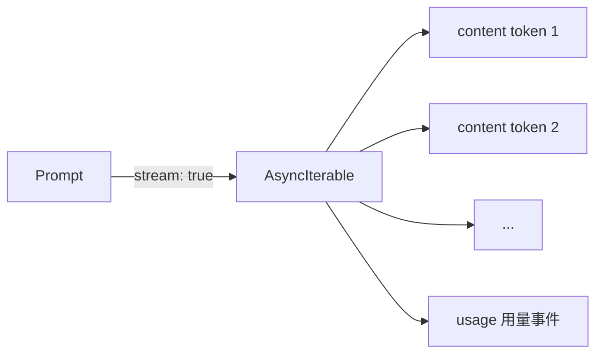

# 03 · Streaming

> <span class="stage-badge">Stage Hello LLM</span> · <span class="tag-badge">v03-stream</span>


上一章的代码跑通的那一刻，小伙伴有没有一种奇怪的感觉：请求发出去，然后**屏幕静止**，等了好几秒，模型的话「啪」地一下整段蹦出来——像憋了很久的一口气终于吐完。

现实里我们实际体验的Agent好像都不是这样的，模型是一个字一个字往外蹦的，向打字机的效果一样，逐渐的返回给用户，通常第一个字几十毫秒就到了。**把这种「边生成边到达」接进来，就是这一章的全部内容。**

<!-- more -->

## 一、上一版存在什么问题？

02 章的 `chat()` 是这样的：

```ts
const completion = await client.chat.completions.create({
  model,
  messages: ...,
});
```

一个 `await`，拿到一个**完整的**答案。模型内部其实早就开始吐字了，但我们非要等它全部结束才接收。这带来两个硬伤：

1. **慢（感知层面）**：用户看到的延迟 = 完整生成时间。首个 token 明明 200ms 就到了，用户却要等 3 秒；
2. **无反馈**：请求越长，用户越像在拨号上网。遇到生成 30 秒的长文，体验就是「这程序是不是卡死了？」。

> 换句话说：上一版的模型是一个「囤货的批发商」，而我们要的是「边炒边端上桌的厨师」。

## 二、本篇解决什么问题？

1. 用 `stream: true` 打开流式，让 token **边生成边到达**；
2. 引入统一的流式输出形状：**`AsyncIterable<ModelEvent>`**；
3. 可观察性升级：记下**首个 token 延迟**、总耗时与 token 用量，把「快」变成看得见的数据。

## 三、先看最终效果


```bash
PS D:\Workspace\hui\project\hello-harness> pnpm dev -- "用一句话介绍你自己"

> hello-harness@0.1.0 dev D:\Workspace\hui\project\hello-harness
> node --import tsx --env-file-if-exists=.env src/index.ts "用一句话介绍你自己"

Output : 我是简洁、直接的中文助手，随时准备帮你解决问题。
Model  : deepseek-ai/DeepSeek-V4-Flash · 1537ms（首 token 1377ms）· 96 in / 46 out
```

注意第一行：`Output :` 后面的文字是**一个字一个字冒出来的**（打字机效果，从上面的GIF图可以更明显的看出这个效果）。而 `Model` 那行透露了两个关键数字：

| 数字 | 含义 | 为什么重要 |
| --- | --- | --- |
| 首 token `1377ms` | 第一个字到达的时间 | **这才是用户真正感知到的延迟** |
| 总耗时 `1537ms` | 全部生成完毕的时间 | 生成内容有多长 |

流式最大的价值，就是把「用户等待」从 `1537ms` 降到 `1377ms`——特别的，当一次完整的响应耗时越久，这个感知体验的效果就明显。（不妨想一想这个场景，一个需要执行几十分钟的CodingAgent，如果没有这个流式的过程，而是一直阻塞，得等到几十分钟后直出结果，这个漫长等待过程中，你会不会想骂人🤭）

## 四、架构变化

`src/` 里多了一个文件，职责进一步分化：

```text
src/
├── messages.ts      # 输入：消息序列
├── events.ts        # 新增：输出的事件形状（ModelEvent）
└── index.ts         # 改造：chat() → streamChat() 生成器
```

| 文件 | 职责 |
| --- | --- |
| `messages.ts` | 定义**送进去**的东西 |
| `events.ts` | 定义**流回来**的东西 |
| `index.ts` | 负责把流接到用户眼前 |

这是「输入模型」与「输出模型」第一次分开建模——它们注定要各自演化，后面会证明这个划分有多重要。

## 五、核心抽象

这一章的核心，就是**把模型的输出从「一个 Promise」换成「一个异步迭代器」**：

```text
Promise<字符串>        →  模型一次性憋完，再给你整段内容返回
AsyncIterable<Event>  →  模型吐一个，你收一个，边吐边收
```



**重点关注**：`ModelEvent` 是最小的事件判别联合：

```ts
type ModelEvent =
  | { type: "content"; text: string }        // 一个内容增量
  | { type: "usage"; inputTokens: number; outputTokens: number };  // 结束时的用量
```

两个设计要点：

1. **`content` 是「增量」不是「整段」**：每来一个事件，你就往屏幕上追加一段，这就是打字机效果的来源；
2. **`usage` 是独立事件**：它是流的「收尾哨兵」，消费方可以选在最后统一处理。

> 作为一个勤于思考的小同学，你可能会问：这 ModelEvent 不就是将来 Event System 的雏形吗？——对，这就是第 15 章那个完整事件系统的**最小种子**。

## 六、实现代码

**`src/events.ts`** —— 全部就这些：

```ts
export type ModelEvent =
  | { type: "content"; text: string }
  | { type: "usage"; inputTokens: number; outputTokens: number };
```

**`src/index.ts`** 里，`chat()` 从「返回 Promise」变成「返回异步生成器」

我们可以重点看一下这个实现的对比效果，如下图：


关键的实现代码如下：


```ts
async function* streamChat(messages: Message[]): AsyncIterable<ModelEvent> {
  const stream = await client.chat.completions.create({
    model,
    messages: messages.map((m) => ({ role: m.role, content: m.content })),
    stream: true,                                // 关键：打开流式
    stream_options: { include_usage: true },     // 请求把用量放进最后一个 chunk
  });

  for await (const chunk of stream) {
    const delta = chunk.choices[0]?.delta?.content;
    if (delta) {
      yield { type: "content", text: delta };    // 内容增量 → content 事件
    }
    if (chunk.usage) {
      yield {
        type: "usage",
        inputTokens: chunk.usage.prompt_tokens,
        outputTokens: chunk.usage.completion_tokens,
      };
    }
  }
}
```

消费端随之变成「事件驱动」：

```ts
for await (const event of streamChat(history)) {
  if (event.type === "content") {
    if (firstTokenAt === undefined) firstTokenAt = Date.now();
    process.stdout.write(event.text);            // 边到边打
  } else if (event.type === "usage") {
    inputTokens = event.inputTokens;
    outputTokens = event.outputTokens;
  }
}
```

`firstTokenAt` 记下第一个字到达的时刻——首 token 延迟就是这么算出来的。整个过程没有任何魔法：**SDK 负责把 SSE 解析成 chunk，我们负责把 chunk 映射成事件**。

## 七、运行 Demo

接下来进入正题，正确的使用姿势如下：

```bash
pnpm dev                      # 观看打字机效果
pnpm dev -- "写一首 4 行的小诗"  # 换一个生成更长的问题，对比首 token 与总耗时
```


建议感兴趣的小伙伴观察上面GIF示意图中的两件事：

1. **打字机效果**：`Output :` 后的文字是逐字出现的，不是整段蹦出；
2. **两个时间**：生成越长的内容，「首 token」与「总耗时」的差距越大——这说明延迟感知已经被流式解耦了。

网络受限时照旧配置 `HTTPS_PROXY`：

```bash
$env:HTTPS_PROXY = "http://127.0.0.1:端口"
```

> 提示：DeepSeek / 通义 / Ollama 等兼容端点同样支持流式；个别 Provider 若不返回 `usage` chunk，代码会静默跳过——程序依然正常跑，只是少了用量那行。

## 八、新架构解决了什么？

- **感知延迟骤降**：用户等待从「总生成时间」降为「首 token 时间」；
- **可观察性升级**：首 token、总耗时、token 用量，全部量化可见；
- **统一输出形状**：`AsyncIterable<ModelEvent>` 让「模型输出」第一次有了**稳定的数据结构**，而非一段字符串；
- **埋下事件系统的种子**：`content / usage` 这个判别联合，后面会长成完整的 Event System；
- **为下一章铺路**：`streamChat()` 的形状已经足够「通用」，只差最后一步——把它收进一个接口。

## 九、它又引入了什么问题？

那么问题来了——流式这么香，它又悄悄把哪些坑埋进来了？流式让体验起飞，也让复杂性落地：

- **消费方要自己判别事件**：`content` 和 `usage` 挤在同一个流里，每个调用方都得写一遍 `if (event.type === ...)`；
- **错误处理变复杂**：`await` 一次返回时，失败就是「整个失败」；流式时，可能吐了一半 token 然后断流——**半截输出算谁的？** 现在没有答案；
- **连接依然绑在 OpenAI 形状上**：chunk → 事件的映射是我们写的，但「连接建立、SSE 解析」仍在 SDK 里，模型名、端点也还是散装环境变量；
- **ModelEvent 类型会长大**：现在只有 `content / usage` 两种，后面必然要加 `tool_call`、`error`……类型膨胀要靠什么约束住？

最大的矛盾：**`AsyncIterable<ModelEvent>` 已经是「模型输出」的理想形状，却还没有一个东西把它和 OpenAI 解耦**。现在 `streamChat` 只是 `index.ts` 里的一个自由函数——它不是「模型」，它只是「OpenAI 的流式」。

## 十、下一章

**04 · Model Provider 抽象**——《Hello Harness 04：Agent 不该知道 OpenAI 是谁》。我们要做的，就是把散装的调用收拢成一个接口：

```ts
interface Model {
  generate(request: ModelRequest): Promise<ModelResponse>;
}
```

并且长出 `src/model/` 目录。到那时，`streamChat` 会改名易主——它不再是「OpenAI 的流式」，而是「**这个模型**的流式」。换 Provider，从此只换一个实现文件。

那么问题来了——这个 `Model` 接口到底该暴露哪些方法？流式要不要也一并收进去？`generate` 返回的 `ModelResponse` 又该长什么样？换 Provider 时，历史消息和工具调用怎么保证不串味？

以上这些问题，留在下一篇逐一介绍。好了，本章就到这里。看到 token 一个字一个字冒出来，你应该已经隐约感觉到：**Agent 体验的底子，就是这一个个及时到达的 token**。欢迎点赞、关注公众号「一灰灰Blog」，咱们下一章接着上菜 😊

---

微信公众号: 一灰灰Blog