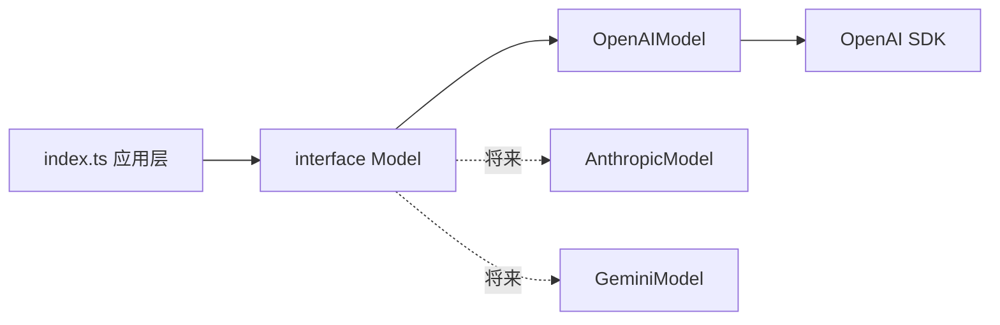
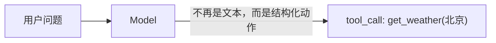

# 04 · Model Provider 抽象

> <span class="stage-badge">Stage Hello LLM</span> · <span class="tag-badge">v04-provider</span>

前三章，小伙伴一直在「调 API」。模型名是环境变量，端点是环境变量，Key 是环境变量，连调用姿势都是 OpenAI 的形状。这一章，我们要做整个项目**第一次真正的架构抽象**：

> Agent 不应该知道 OpenAI / Anthropic / Gemini 的区别。

<!-- more -->

## 一、上一版存在什么问题？

第三章结束时的 `src/index.ts`，还是一个「拿着 SDK 直接打电话」的状态：

```text
src/
├── messages.ts   # 输入形状
├── events.ts     # 输出形状
└── index.ts      # 直接 new OpenAI(...) + chat.completions.create(...)
```

问题摆在桌面上：

1. **调用方式散落各处**：`getApiKey()`、`client`、`model`、`streamChat()` 全是 `index.ts` 里的自由代码——**应用逻辑和 Provider 细节长在一起**；
2. **换服务商 = 改代码**：假设哪天想从 DeepSeek 换到 Gemini，`index.ts` 里每一处 `chat.completions` 都要改，还要重新学对方 SDK 的API surface 调用约定；
3. **「模型」不是一个东西**：没有类型、没有接口，`Model` 只是两个散装环境变量（`OPENAI_MODEL` + `OPENAI_BASE_URL`）的合称。

> 换句话说：我们口中说着「Hello LLM」，但 LLM 在代码里根本没有姓名——它只是散落在 main 函数里的三四个环境变量。

## 二、本篇解决什么问题？

1. 定义一个**与 Provider 无关**的 `Model` 接口，把「模型能干什么」讲清楚；
2. 把 OpenAI 的实现收进 `src/model/openai.ts`，**应用层不再 import OpenAI SDK**；
3. 换服务商，从「改代码」降级为「换一个实现文件」。

解决完上面三件事，咱们回过头把这条线串一下：**上一章留下的「模型没姓名、调用散一地、换商服得改代码」这些遗留问题 → 这一章用「接口 + 实现 + 工厂」解决掉 → 接下来看看我们到底得到了什么收获。**

### 解决之后，我们收获了什么？

- **换 Provider 的成本从「改一堆代码」塌成「换一个文件」**：风险与回归范围都收口了。哪天老板一句「切到 Gemini」，你只动 `openai.ts` 那一处，应用层纹丝不动；
- **应用层变干净，业务逻辑一眼可读**：`index.ts` 里再也搜不到 `OpenAI` 这个词，新来的小伙伴读代码不会被 SDK 细节劝退；
- **可测试性被解锁**：因为只依赖 `Model` 接口，写一个返回固定文本的 `FakeModel` 就能不连网络、不填 Key 跑通应用层——「每章可验证」不再是口号；
- **给 Stage 1 铺好了底座**：下一章的 Agent Loop、Function Calling 全都挂在 `Model` 接口上长出来，抽象让后续能力「即插即用」。

> 一句话收个尾：遗留的耦合问题被这一章的抽象解决掉，换来的则是「可换、可读、可测、可演进」四笔实实在在的收获——这就是「遗留问题 → 解决问题 → 得到收获」的闭环。

## 三、先看最终效果

代码结构变成了这样：

```text
src/
├── messages.ts
├── events.ts
├── index.ts           # 只关心 Model 接口，不认识 OpenAI
└── model/
    ├── model.ts       # interface Model
    ├── types.ts       # ModelRequest / ModelResponse
    └── openai.ts      # OpenAIModel 实现 + 工厂
```

运行结果和第三章一模一样（毕竟功能没变），但这次它走的是 `model.stream(...)` / `model.generate(...)`：

```bash
PS D:\Workspace\hui\project\hello-harness> pnpm dev -- "用一句话介绍你自己"

> hello-harness@0.1.0 dev D:\Workspace\hui\project\hello-harness
> node --import tsx --env-file-if-exists=.env src/index.ts "用一句话介绍你自己"

Output : 我是DeepSeek，一个由深度求索公司开发的AI助手，乐于为你提供简洁直接的帮助。
Model  : deepseek-ai/DeepSeek-V4-Flash · 2819ms（首 token 2512ms）· 96 in / 128 out


PS D:\Workspace\hui\project\hello-harness> pnpm dev -- --full "用一句话介绍你自己"

> hello-harness@0.1.0 dev D:\Workspace\hui\project\hello-harness
> node --import tsx --env-file-if-exists=.env src/index.ts "--full" "用一句话介绍你自己"

Output : 我是一个简洁、直接的中文AI助手。
Model  : deepseek-ai/DeepSeek-V4-Flash · 1915ms（一次性）· 96 in / 48 out
```

同样的接口，两种姿势：**`stream` 带自己输出，`generate` 等整段返回**。调用方只写一次，换 Provider 时无需改动。

## 四、架构变化




 成功代码的组织结构来看，我们新增了一层`model`目录，下面定义的model的抽象与实现，这一步，可以说是我们向最终的完全体迈出的结构分层的第一步

| 文件 | 职责 |
| --- | --- |
| `model/types.ts` | `ModelRequest` / `ModelResponse`：一次请求与一次响应的数据形状 |
| `model/model.ts` | `interface Model`：**能力的契约**，与任何厂商无关 |
| `model/openai.ts` | `OpenAIModel`：对契约的 OpenAI 实现 + `createOpenAIModel()` 工厂 |
| `index.ts` | 只知道 `Model`，不知道 `OpenAI` |


## 五、核心抽象

### 接口：把「模型能干什么」讲清楚

```ts
interface Model {
  readonly modelName: string;

  generate(request: ModelRequest): Promise<ModelResponse>;      // 等整段，一次返回
  stream(request: ModelRequest): AsyncIterable<ModelEvent>;     // 打字机，流式返回
}
```

接口只回答三个问题：**你是谁（modelName）、怎么要整段（generate）、怎么要流水（stream）**。至于你是 OpenAI 还是别的谁——接口不关心，也不想关心。

### 请求与响应：交换的数据要有形状

```ts
interface ModelRequest {
  messages: Message[];      // 复用 02 章的消息类型
}

interface ModelResponse {
  content: string;          // 整段文本
  inputTokens: number;      // 用量，接口层就给出，而不是藏在 SDK 里
  outputTokens: number;
}
```

> 注意：`ModelRequest` 里直接复用 `messages.ts` 的 `Message`——02 章那次「输入形状独立建模」，在这里兑现了价值：**请求形状稳定，接口才能稳定**。

### 实现与工厂：SDK 只活在实现文件里

`openai.ts` 是**唯一** import `openai` 的地方。对外暴露一个普通工厂函数：

```ts
export function createOpenAIModel(): Model {
  const apiKey = process.env.OPENAI_API_KEY;
  if (!apiKey) throw new Error("缺少 OPENAI_API_KEY：请复制 .env.example 为 .env 后填入真实 Key");

  const client = new OpenAI({ apiKey, baseURL: process.env.OPENAI_BASE_URL });
  return new OpenAIModel(client, process.env.OPENAI_MODEL ?? "gpt-4o-mini");
}
```

工厂把「环境变量 + SDK 客户端」这件脏活锁在实现文件内部，外面拿到的只是一个干净的 `Model`。


> 同样的，当我们想接入 Anthropic 的Claude模型时，也只需要新建一个 anthropic.ts 文件，将Claude的相关交互锁在这个文件内即可

## 六、实现代码

### 请求与响应的统一结构定义实现

**`src/model/types.ts`**：

```ts
import type { Message } from "../messages";

export interface ModelRequest {
  messages: Message[];
}

export interface ModelResponse {
  content: string;
  inputTokens: number;
  outputTokens: number;
}
```

### 抽象模型的定义实现

**`src/model/model.ts`**：

```ts
import type { ModelRequest, ModelResponse } from "./types";
import type { ModelEvent } from "../events";

export interface Model {
  readonly modelName: string;

  generate(request: ModelRequest): Promise<ModelResponse>;

  stream(request: ModelRequest): AsyncIterable<ModelEvent>;
}
```

### OpenAI接口风格大模型交互的Provider实现

**`src/model/openai.ts`**——`generate` 与 `stream` 两个实现，就是把第三章那坨自由代码搬进来、收成类：

```ts
export class OpenAIModel implements Model {
  readonly modelName: string;

  constructor(
    private readonly client: OpenAI,
    modelName: string,
  ) {
    this.modelName = modelName;
  }

  async generate(request: ModelRequest): Promise<ModelResponse> {
    const completion = await this.client.chat.completions.create({
      model: this.modelName,
      messages: toWireMessages(request.messages),
    });

    return {
      content: completion.choices[0]?.message?.content ?? "",
      inputTokens: completion.usage?.prompt_tokens ?? 0,
      outputTokens: completion.usage?.completion_tokens ?? 0,
    };
  }

  async *stream(request: ModelRequest): AsyncIterable<ModelEvent> {
    const stream = await this.client.chat.completions.create({
      model: this.modelName,
      messages: toWireMessages(request.messages),
      stream: true,
      stream_options: { include_usage: true },
    });

    for await (const chunk of stream) {
      const delta = chunk.choices[0]?.delta?.content;
      if (delta) {
        yield { type: "content", text: delta };
      }
      if (chunk.usage) {
        yield {
          type: "usage",
          inputTokens: chunk.usage.prompt_tokens,
          outputTokens: chunk.usage.completion_tokens,
        };
      }
    }
  }
}
```

注意 `toWireMessages` 把我们的 `Message[]` 翻译成 SDK 要的「线格式」——**这是实现文件内部的事**，接口层完全看不见：

```ts
function toWireMessages(messages: Message[]): ChatCompletionMessageParam[] {
  return messages.map((m) => ({ role: m.role, content: m.content }));
}
```

最后再暴露一个创建Model的普通工厂实现，从而构成 `openai.ts` 这个Provider的完整实现

```ts
export function createOpenAIModel(): Model {
  const apiKey = process.env.OPENAI_API_KEY;
  if (!apiKey) {
    throw new Error("缺少 OPENAI_API_KEY：请复制 .env.example 为 .env 后填入真实 Key");
  }

  const client = new OpenAI({
    apiKey,
    baseURL: process.env.OPENAI_BASE_URL,
  });

  return new OpenAIModel(client, process.env.OPENAI_MODEL ?? "gpt-4o-mini");
}
```

### 应用层适配

最后就是我们的应用层，将之前的那一坨OpenAI交互移走，只留下与Model的交互

**`src/index.ts`**——应用层如今干净得只剩逻辑：

```ts
const model = createOpenAIModel();        // 不认识 OpenAI，只拿到一个 Model

for await (const event of model.stream(request)) { ... }   // 流式
// 或
const response = await model.generate(request);            // 一次性
```


接下来我们看一下真实的应用层示例，根据传参 `--full` 来决定是同步调用还是流式调用

```ts
import { createOpenAIModel } from "./model/openai";
import { systemMessage, userMessage } from "./messages";
import type { Model } from "./model/model";
import type { ModelRequest } from "./model/types";

async function runStream(model: Model, request: ModelRequest) {
  const startedAt = Date.now();
  let firstTokenAt: number | undefined;
  let inputTokens = 0;
  let outputTokens = 0;

  process.stdout.write("Output : ");
  for await (const event of model.stream(request)) {
    if (event.type === "content") {
      if (firstTokenAt === undefined) firstTokenAt = Date.now();
      process.stdout.write(event.text);
    } else if (event.type === "usage") {
      inputTokens = event.inputTokens;
      outputTokens = event.outputTokens;
    }
  }

  const elapsedMs = Date.now() - startedAt;
  const firstTokenMs = firstTokenAt === undefined ? 0 : firstTokenAt - startedAt;
  console.log("");
  console.log(`Model  : ${model.modelName} · ${elapsedMs}ms（首 token ${firstTokenMs}ms）· ${inputTokens} in / ${outputTokens} out`);
}

async function runGenerate(model: Model, request: ModelRequest) {
  const startedAt = Date.now();
  const response = await model.generate(request);
  const elapsedMs = Date.now() - startedAt;

  console.log(`Output : ${response.content}`);
  console.log(`Model  : ${model.modelName} · ${elapsedMs}ms（一次性）· ${response.inputTokens} in / ${response.outputTokens} out`);
}

async function main() {
  const args = process.argv.slice(2);
  const fullMode = args[0] === "--full";
  const question = fullMode ? args[1] : args[0];
  const prompt = question ?? "用一句话介绍你自己";

  const request: ModelRequest = {
    messages: [systemMessage("你是一个简洁、直接的中文助手。"), userMessage(prompt)],
  };

  const model = createOpenAIModel();
  if (fullMode) {
    await runGenerate(model, request);
  } else {
    await runStream(model, request);
  }
}

main().catch((error) => {
  console.error("调用失败：", error instanceof Error ? error.message : String(error));
  process.exit(1);
});
```

## 七、运行 Demo

接下来我们再来试试，对话的效果如何

```bash
pnpm dev  "写一首现代诗"         # 流式：打字机效果
pnpm dev -- --full "写一首 4 行的小诗"
```


两次调用的结果一致，只是到达方式不同。**建议小伙伴试着把 `OPENAI_BASE_URL` 从 DeepSeek 换到通义、再换回 OpenAI——代码一行都不用改**，改的只是 `.env`。

> 提示：网络受限时配置 `$env:HTTPS_PROXY = "http://127.0.0.1:端口"`。本地起一个 OpenAI 兼容 mock 也能验证（返回内容不同、形状相同即可）。

## 八、新架构解决了什么？

- **依赖方向反转**：应用只依赖 `Model` 接口，`openai` 只出现在一个文件里，删掉 SDK 换实现时，`index.ts` 零改动；
- **能力契约化**：「模型能干什么」第一次有了类型化的描述，`generate` / `stream` 成为稳定 API；
- **换 Provider 成本塌方**：从「改整个应用的调用姿势」降到「写一个实现类 + 一行工厂」；
- **SDK 形状被关进笼子**：`chunk`、`delta`、`ChatCompletionMessageParam` 这些外来词汇全部退居 `openai.ts`；
- **为 Agent Loop 铺路**：下一章开始，循环调用的是 `model.generate(...)`，而不是某家 SDK 的方法；
- **可测试性解锁**：因为应用只依赖 `Model` 接口，你可以写一个返回固定文本的 `FakeModel`，不连网络、不填 Key 就能跑通整个应用层——这是抽象带来的、最容易被忽略的红利。

## 九、它又引入了什么问题？

那么问题来了——抽象这么香，代价到底藏哪了？抽象解决了「怎么换」，也暴露出新的代价：

- **每一个 Provider 都要写一遍实现**：接口合同很舒服，但实现 `toWireMessages`、`generate`、`stream` 的样板代码，Anthropic 一份、Gemini 一份……**抽象让「新增实现」变贵了**；
- **接口只有这一个实现**：目前 `OpenAIModel` 是唯一实现，「接口」还像装样子——真正的说服力要等第二、第三个实现出现；
- **错误还是裸的**：`model.generate` 抛出的还是 SDK 的原始异常，没有统一错误类型，后面 Agent 循环里对错误的判断会很难受；
- **没有调用上下文**：模型还是「有问必答」，不记得你是谁、你在做什么任务——**下一个跃迁，不是怎么调用，而是让它停下来、按照你的节奏干活**。

## 十、下一章

**05 · Function Calling**——Stage 0 的「Hello LLM」到这里画上句号，**Stage 1 · Hello Agent** 正式开张。

第五章的核心，是让模型的输出不再是「一段文本」，而是**结构化的动作指令**：模型告诉你「我想调用 `get_weather`，参数是 `北京`」。



模型第一次**动手**，而不再只是**动口**——从这一刻起，它离「Agent」就只剩一个循环的距离了。

那么问题来了——模型吐出的 `tool_call` 该由谁来执行？执行完的结果又怎么塞回对话、让模型接着干下一步？结构化动作一旦出错，谁来兜底？

以上这些问题，留在下一篇逐一介绍。好了，本章就到这里。接口、实现、工厂——这三样东西会贯穿后面几十章，请务必亲手跑一遍 `--full` 和流式两个命令，感受「同接口、两姿势」。欢迎点赞、关注公众号「一灰灰Blog」，Stage 1 我们见真章 😊

---

微信公众号: 一灰灰Blog