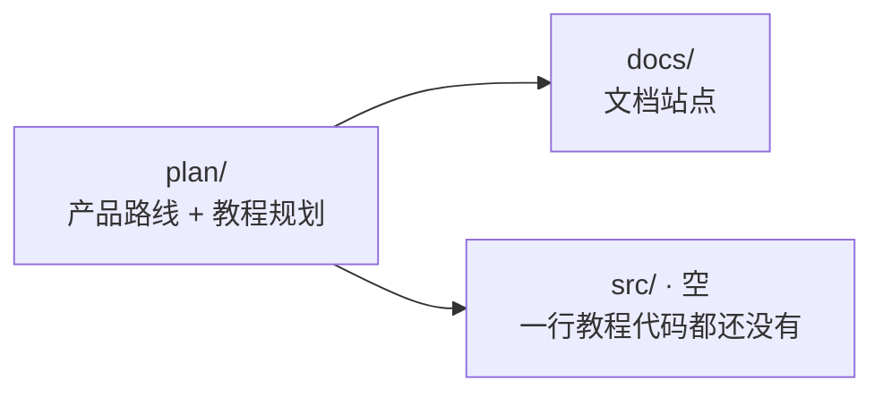
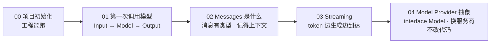

# Stage 0 · Hello LLM

> <span class="stage-badge">Stage 0</span> · Git Tag 范围：<span class="tag-badge">v00-empty</span> ~ <span class="tag-badge">v04-provider</span>

这是整套教程的第一站，也是整个 Harness 的第一块地基。从这一篇开始，咱们先把「模型调用」这一件事彻底做干净。

如果你刚翻开教程地图，心里可能正带着一个疑问走进这一篇：

> **Hello Harness 不是要一步步造出 Coding Agent 吗？怎么第一站不聊 Agent，反而聊起了 LLM？**

接下来，这一篇就是 Stage 0 的开篇总览，回答三件事：

1. 为什么要先拿掉一切 Agent 概念，只做最干净的 Model Layer？
2. 这五章各自在解决什么问题？
3. 这一 Stage 完成之后，我们会得到一个怎样的「Hello LLM」？

<!-- more -->

## 一、先复习：我们的起点是什么

打开仓库，里面只有两份东西：`docs/`（文档站点）和 `plan/`（产品路线与教程规划）。



此时此刻，教程代码一行都还没有：没有 `src/`、没有 TypeScript 配置、没有密钥约定、没有统一开发命令。你想「读一章、跑一章」，第一件事就得先把**工程能跑**这层地基打牢。

> 换句话说：第一步不是写模型调用，而是先把「能跑、能查、不泄密」的地基打好——这也是为什么 Stage 0 的第一章是「项目初始化」。

## 二、为什么第一站只做最干净的 Model Layer？

回想教程的总目标：从 Agent Loop 一路演进到 Self-Improving Harness。任何一个后续阶段——Tool Calling、Harness、Coding Agent、RLM、Continual——都建立在同一件事上：**把话送进模型、把答案从模型里拿出来**。

如果第一步就急着引入 Agent、Tool、Memory、Skill、MCP、Planner，那这些概念会互相纠缠，你根本分不清「哪一块是模型本身的能力，哪一块是我们造出来的基础设施」。

所以 Stage 0 立一条铁律：

> **先把一切 Agent 概念拿掉，只理解模型调用。**

| 这个 Stage 不做 | 为什么 |
| --- | --- |
| Agent | 还没有循环，只有一次调用 |
| Tool / Function Calling | 输出还只是文本，不碰结构化动作 |
| Memory / Skill / MCP / Planner | 全是「未来的上层建筑」，现在引入只会添乱 |

这一 Stage 结束，你会得到一个**与 Provider 无关、能流式输出、类型安全**的 `Model` 接口——它不知道 Agent 是谁，也永远不会依赖 Agent。这正是 AGENTS.md 里「Model 不知道 Agent」这条架构边界的起点。

## 三、它如何成长为一个干净的 Model Layer？

成长不是一步到位，而是**一层一层垫高**——每一章都只解决上一章留下的一个具体矛盾：



| 阶段 | 章节 | 补上的能力 | 对应成长 |
| --- | --- | --- | --- |
| **打地基** | 00 | `pnpm dev` / `typecheck` / `.env` 密钥约定 | 从「空仓库」变成「能跑、能查、不泄密」 |
| **通链路** | 01 | 一次真实模型调用：`Input → Model → Output` | 从「管道没水」变成「真的有水在流」 |
| **上类型** | 02 | `system / user / assistant` 三种消息 + 多轮对话 | 从「裸字符串数组」变成「记得上下文的对话」 |
| **看流水** | 03 | `AsyncIterable<ModelEvent>`：首 token 延迟可见 | 从「憋一口气全吐」变成「边生成边到达」 |
| **做抽象** | 04 | `interface Model` + `model/openai.ts` + 工厂 | 从「散装环境变量」变成「Agent 不该知道 OpenAI 是谁」 |

对照着看，每一步都踩在前一步的肩膀上：

- 没有 00 的地基，01 的模型调用连跑的地方都没有；
- 没有 01 的调用，02 的消息类型就没有「实验对象」；
- 没有 02 的结构，03 的流式事件就没有可以挂在上面的形状；
- 没有 03 的 `AsyncIterable<ModelEvent>`，04 的 `interface Model` 就缺了 `stream` 这条腿。

> **这就是演进叙事：不是每次加一个独立新功能，而是让 Model Layer 一环扣一环地长大。**

## 四、这一 Stage 完成之后，我们会得到一个怎样的 Hello LLM？

毕业作品叫 **CLI Chat**——一条命令，就能把一句话送进任意 OpenAI 兼容服务商，并看到打字机般的流式回答。

先看它长成什么样：

```mermaid
flowchart LR
  U[pnpm dev -- "用一句话介绍你自己"] --> M[model.stream / model.generate]
  M --> O[Output 打字机输出]
  O --> T[Model 耗时 · 首 token · token 用量]
  P[换服务商 = 改 .env] -.不用改代码.-> M
```

跑起来长这样：

```bash
$ pnpm dev -- "用一句话介绍你自己"
Output : 我是简洁、直接的中文助手，随时准备帮你解决问题。
Model  : deepseek-ai/DeepSeek-V4-Flash · 1537ms（首 token 1377ms）· 96 in / 46 out
```

对比这一阶段的前后，能力的增长一目了然：

| 维度 | 00 之前 | Stage 0 结束 |
| --- | --- | --- |
| 工程 | 空仓库，跑不了 | `pnpm dev` 一步到位，密钥不入库 |
| 调用 | 无 | 一次真实的 `Input → Model → Output` |
| 输入 | 裸字符串 | 类型安全的 `Message[]`，多轮记忆 |
| 输出 | 憋一口整段 | `AsyncIterable<ModelEvent>` 流式可见 |
| 抽象 | 散装环境变量 | `interface Model`，换服务商改 `.env` |

> 一句话概括 Stage 0 的目标：
> **先把一切 Agent 概念拿掉，只做最干净的 Model Layer——它是后面所有阶段的地基。**

## 五、章节清单

| # | 章节 | Git Tag | 状态 |
| --- | --- | --- | --- |
| 00 | [项目初始化](00-project-setup) | v00-empty | 已完成 |
| 01 | [第一次调用模型](01-first-model-call) | v01-model | 已完成 |
| 02 | [Messages 是什么](02-messages) | v02-messages | 已完成 |
| 03 | [Streaming](03-streaming) | v03-stream | 已完成 |
| 04 | [Model Provider 抽象](04-provider-abstraction) | v04-provider | 已完成 |

## 阶段结尾

这一阶段结束：**CLI Chat**——你有了一个与 Provider 无关、能流式输出、类型安全的最干净 Model Layer。它不会干活，但它是一切「干活」能力的地基。

> **记住这一 Stage 的灵魂一句：**
> **Model 不知道 Agent——先把手里的模型调用做到极致，再把上层能力一层层长出来。**

下一阶段，我们给模型加上「手」——让它的输出从文本变成结构化的动作指令，正式进入 **Tool Calling Agent** 的世界。
