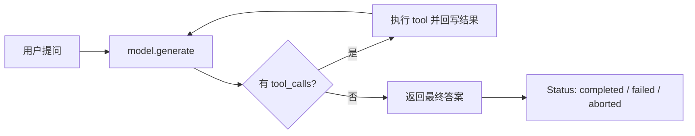

# Stage 1 · Hello Agent

> <span class="stage-badge">Stage 1</span> · Git Tag 范围：<span class="tag-badge">v05-tool-call</span> ~ <span class="tag-badge">v09-stop-condition</span>

Stage 0 结束，小伙伴收获了一个会说、会写（流式）、还能随时换服务商的 Model Layer。但严格来说，它还是个**加强版翻译器**：你问一句，它答一句。

从这一篇开始，我们要做整套教程**最关键的第一跃迁**——让模型不只「动口」，还要「动手」，把它升级成一个真正的 **Agent**。

如果你刚读完 `04-provider-abstraction`，心里可能正带着一个疑问走进这一篇：

> **模型已经能说话了，Agent 又是什么？它和「一次模型调用」到底差在哪？**

接下来，这一篇就是 Stage 1 的开篇总览，回答三件事：

1. 什么是 Agent？
2. 它和 Stage 0 的 Model Layer 有什么区别？
3. 这一 Stage 完成之后，我们会得到一个怎样的 Agent？

<!-- more -->

## 一、先复习：Stage 0 给了我们什么

Stage 0 攒下的东西，可以浓缩成一张图：

```mermaid
flowchart LR
  S0[Stage 0 · Model Layer] --> M[interface Model<br/>generate / stream]
  M --> MSG[类型安全 Message[]<br/>system / user / assistant]
  M --> EV[AsyncIterable ModelEvent<br/>content / usage]
  M --> P[换 Provider = 换一个实现文件]
```

**它把「模型调用」这件事做到了极致**：输入是类型安全的消息序列，输出是流式事件，背后是哪个服务商根本不重要。

但如果你仔细观察，会发现它还缺一样东西——**动作**：

- 问它「北京今天天气怎么样」，它只会一本正经地**编一个**（幻觉）；
- 让它算 `17 × 38`，它可能算错，还说得很自信；
- 它永远只会回答「一句话」，永远没法「做一件事」。

> 换句话说：Stage 0 的模型是个**只会表达、不会行动的绅士**。你让它买杯咖啡，它能写一篇关于咖啡的散文，但杯子不会自己出现在桌上。

## 二、什么是 Agent？

先把神秘滤镜拆掉：

| 我们以为的 Agent | 实际上的 Agent |
| --- | --- |
| 一个会思考的实体 | 一个 `while(true)` 循环 |
| 有「意识」做决定 | 决定权交给了模型的 `tool_calls` |
| 神秘的行为系统 | 观察 → 行动 → 观察……直到停止 |

中文直译「代理」。上一匹马（模型）只有嘴，只会说；Agent 给它装上了**手**——让它的输出从「一段文本」变成「结构化的动作指令」，并且这些指令能被真实执行、结果再喂回给模型。

一句话记住它与 Stage 0 的分工：

> **Model 负责「说」，Agent 负责「干」——把「你会说话」升级成「你会干活」。**

这一 Stage 的毕业作品叫 **Tool Calling Agent**，核心就一个字：**循环**。调模型 → 有工具调用就执行并回传 → 再调模型 → 直到不再调用工具 → 返回答案。整个 Stage 1 的五章，都是在把这个循环一点点磨出来。

## 三、它如何成长为一个会干活的 Tool Calling Agent？

这是这一 Stage 最重要的一条叙事线。成长不是「推翻重来」，而是**一层一层补上**——每一章都只解决上一章暴露的一个具体矛盾：

```mermaid
flowchart LR
  T1[05 Function Calling<br/>输出变成结构化动作] --> T2[06 第一个 Tool<br/>声明与执行合体]
  T2 --> T3[07 Tool Result<br/>结果回写 完整闭环]
  T3 --> T4[08 第一个 Agent Loop<br/>while(true) 循环]
  T4 --> T5[09 停止条件<br/>为什么停 有据可查]
```

| 阶段 | 章节 | 补上的能力 | 对应成长 |
| --- | --- | --- | --- |
| **学会动作** | 05 | `ToolCall` / `ToolDefinition`：输出从文本变动作 | 从「只会说」变成「会提议做」——但只有说明书，没有执行者 |
| **装上身体** | 06 | `interface Tool` + `calculator`：声明与执行合体 | 从「只会点菜」变成「后厨真的开火」——第一次摸到真实世界 |
| **闭环回传** | 07 | `tool` 消息回写历史，带着结果再问一次 | 从「结果烂在手里」变成「模型看见真实结果」——多步推理的土壤出现 |
| **循环转起** | 08 | `runAgent()`：`while(true)` 干到完，30~50 行 | 从「问答程序」变成「会自己决定干几轮的 Agent」 |
| **装上仪表盘** | 09 | `maxSteps / timeout / abort / finished / failed` | 从「超限就爆炸」变成「为什么停有据可查」 |

对照着看，每一步都踩在前一步的肩膀上：

- 没有 05 的 ToolCall，06 的 Tool 就没有「说明书」可执行；
- 没有 06 的执行，07 的 Tool Result 就没有结果可回传；
- 没有 07 的闭环，08 的循环就没有「转一圈再转一圈」的动力；
- 没有 08 的循环，09 的停止协议就不知道「什么时候该喊停」。

> **这就是演进叙事：不是每次加一个独立新功能，而是让 Agent 的能力环环相扣地长大。**

## 四、这一 Stage 完成之后，我们会得到一个怎样的 Agent？

毕业作品叫 **Tool Calling Agent**——一个能把任务一直干到完、并且每次停下都有清晰诊断的最小 Agent。

先看它长成什么样：



对比两个 Stage 的毕业作品，能力一目了然：

| 维度 | Stage 0 · Model Layer | Stage 1 · Agent |
| --- | --- | --- |
| 输出 | 一段文本 | 结构化 `ToolCall` |
| 动作 | 无 | `calculator`：模型提议，应用层执行 |
| 闭环 | 一次性问答 | 提议 → 执行 → 回传 → 再问 |
| 循环 | 无 | `while(true)`，模型自己决定干几轮 |
| 停止 | 无 | `finished / maxSteps / timeout / aborted / failed` |
| 核心心智 | 一次模型调用 | **一个循环** |

> 一句话概括 Stage 1 的目标：
> **把「会说会写的 Model Layer」，升级成「会干活、能叫停的 Tool Calling Agent」。**

## 五、章节清单

| # | 章节 | Git Tag | 状态 |
| --- | --- | --- | --- |
| 05 | [Function Calling](05-function-calling) | v05-tool-call | 已完成 |
| 06 | [第一个 Tool](06-first-tool) | v06-tool | 已完成 |
| 07 | [Tool Result](07-tool-result) | v07-tool-result | 已完成 |
| 08 | [第一个 Agent Loop](08-first-agent-loop) | v08-agent-loop | 已完成 |
| 09 | [Agent 的停止条件](09-stop-condition) | v09-stop-condition | 已完成 |

## 阶段结尾

这一阶段结束：**Tool Calling Agent**——输入一句话，它能连环调用工具、基于真实结果作答，并且每次停下都有 `status / stopReason / error` 三件套讲清楚「为什么停」。

> **记住这一 Stage 的灵魂一句：**
> **Agent 本质不是一个神秘对象，而是一个循环。**

下一阶段，我们给这个循环配上「马具」——Tool Registry、Agent Context、AgentRuntime、AgentStep、AgentEvent……把「一个能工作的 Agent」，演进成「一个可以维护的 Harness」。