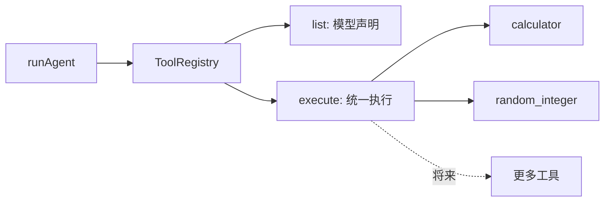

# 10 · Tool Registry

> <span class="stage-badge">Stage Hello Harness</span> · <span class="tag-badge">v10-tool-registry</span>


本文作为 Stage 2 Harness 的开篇，我们在[章节续篇](./index) 里介绍了一个最小单元 Harness 的组成；接下来，咱们把目光拉回前面九章攒下的那个「能干活、能叫停」的 Agent——它正面临一个非常现实的问题：

**工具越来越多，怎么办？**

上一章结束的时候，`tools` 还是一个手写的 `Record<string, Tool>`。

今天，我们需要把它换成第一个「类基建」的东西——`ToolRegistry`。

<!-- more -->

## 一、上一版存在什么问题？

回看 09 章的 `runAgent` 签名：

```ts
async function runAgent(model, request, tools: Record<string, Tool>, options) { ... }
```

工具只有几个（`calculator`）时，`Record` 手写没问题。但当工具长到十个、二十个，散装 `Record` 的麻烦接踵而至：

1. **声明靠手抄**：`Object.values(tools)` 手动把工具声明塞给模型，每加一个工具要记得改两处（注册 + 声明）；
2. **重名没人拦**：两个工具都叫 `calculator`，`Record` 静默覆盖，上一个工具**无声蒸发**；
3. **执行逻辑散落**：`tools[call.name]` 找不到、`tool.execute` 抛异常……这些判断散在 `runAgent` 里，每多一个消费方就要抄一遍；
4. **结果没有标准脸**：工具返回 `{ value }`、`{ error }` 长得随心所欲，程序要「读懂」成功与失败全靠自觉——这正是 [06 章](../stage-1-hello-agent/06-first-tool)埋下的债（「要不要统一结果类型，以后再说」），今天到了还债的时候。

> 换句话说：上一版的工具们是**各自为政的散兵**——单兵作战没问题，一旦成建制成体系，就急需一个「司令部下发的花名册」。

## 二、本篇解决什么问题？

1. 引入 **`ToolRegistry`**：注册、查找、列出声明、统一执行，四个动作管住所有工具；
2. 引入统一结果形状 **`ToolResult`**：`{ ok: true, value }` / `{ ok: false, error }`，程序从此能稳定识别成败；
3. `runAgent` 从「吃一个 `Record`」升级为「吃一个 Registry」——新增工具只需 `register` 一行。

解决完上面三件事，咱们回过头把这条线串一下：**上一章留下的「工具靠手写 Record、重名静默覆盖、执行逻辑散落、结果没标准脸」这些遗留问题 → 这一章用「ToolRegistry + ToolResult」解决掉 → 接下来看看我们到底得到了什么收获。**

### 解决之后，我们收获了什么？

- **工具可规模化**：加工具 = `register` 一行，声明、查找、执行全自动跟上；
- **结果标准化**：`ToolResult` 让成功/失败/兜底一眼可辨，Agent 循环不再到处判断；
- **兜底集中化**：未知工具、工具异常全在 `execute` 一处收口，逻辑不再散落；
- **循环解耦**：`runAgent` 只认 `list()` / `execute(call)` 两个门面，与具体工具体积无关。

> 一句话收个尾：遗留的「手写 Record、会覆盖、逻辑散、脸不统一」问题被这一章的 Registry 解决掉，换来的则是「可规模、有标准、兜底集中、循环解耦」四笔实实在在的收获

## 三、先看最终效果

注册两个工具（`calculator` + 新的 `random_integer`），同一个 `--tools` 命令，模型自己挑合适的用：


```bash
$ pnpm dev -- --tools "17 乘以 38 等于多少？"

> hello-harness@0.1.0 dev D:\Workspace\hui\project\hello-harness
> node --import tsx --env-file-if-exists=.env src/index.ts "--tools" "17 乘以 38 等于多少？"

ToolCall : calculator({"expression":"17 * 38"})
Result  : {"ok":true,"value":646}
Answer  : 17 乘以 38 等于 **646**。
Steps   : 2 轮 · 5 条消息 · 10246ms
Status  : completed (finished)


$ pnpm dev -- --tools "给我一个 1 到 100 的随机整数"

> hello-harness@0.1.0 dev D:\Workspace\hui\project\hello-harness
> node --import tsx --env-file-if-exists=.env src/index.ts "--tools" "给我一个 1 到 100 的随机整数"

ToolCall : random_integer({"max":100})
Result  : {"ok":true,"value":25}
Answer  : 随机整数是：**25**
Steps   : 2 轮 · 5 条消息 · 3335ms
Status  : completed (finished)
```

注意 `Result` 那一行的**标准脸**：`{"ok":true,"value":...}`。成功、失败、未知工具、工具崩溃——全部长一个样，程序一律看得懂：

```bash
$ pnpm dev -- --tools "帮我算一下 1/0 的结果"

> hello-harness@0.1.0 dev D:\Workspace\hui\project\hello-harness
> node --import tsx --env-file-if-exists=.env src/index.ts "--tools" "帮我算一下 1/0 的结果"

ToolCall : calculator({"expression":"1/0"})
Result  : {"ok":false,"error":"表达式无法计算为数值：1/0"}
Answer  : 1/0 在数学中是**未定义的**（不能除以零）。任何数除以零都没有意义，因为不存在一个数乘以零等于 1。
Steps   : 2 轮 · 5 条消息 · 3939ms
Status  : completed (finished)
```

再来看一下上面这种执行异常的情况，工具执行后的返回结构都是一致的

## 四、架构变化

在这一章节，我们主要的架构变化集中在tool层，新增 `ToolRegistry` 实现工具注册、执行的统一管理

```text
src/tool/
├── tool.ts        # 升级：新增 ToolResult 类型
├── calculator.ts  # 升级：execute 返回 ToolResult
├── random.ts      # 新增：第二个工具 random_integer
└── registry.ts    # 新增：ToolRegistry

src/agent.ts       # runAgent 参数：Record<string, Tool> → ToolRegistry
```




`runAgent` 只认 Registry 的两个门面：`list()`（给模型声明）和 `execute(call)`（替模型干活）。工具再多，循环代码一行不用改。

## 五、核心抽象

### ToolResult：给结果一张标准脸

```ts
export type ToolResult =
  | { ok: true; value: unknown }    // 成功：带上交付物
  | { ok: false; error: string };   // 失败：带上理由

export interface Tool extends ToolDefinition {
  execute(input: unknown): Promise<ToolResult>;
}
```

`Tool.execute` 从此不再返回随心所欲的 `unknown`，而是 `Promise<ToolResult>`。


**重点关注**：这不是约束工具的自由，而是**给调用方（Agent、未来的 UI、测试）一个稳定的判断入口**：`result.ok` 一行就能分流。这里体现的是一个结构化工程的设计考量，通过定义一套标准契约，从而达到实现层的统一编码约束，减少自由随性带来的混乱行为

### Registry 的四件套

| 方法 | 一句话职责 |
| --- | --- |
| `register(tool)` | 登记：**重名直接抛错**，防止静默覆盖 |
| `get(name)` | 查找：按名取工具 |
| `list()` | 声明：把全部工具声明交给模型 |
| `execute(call)` | 执行：查名 → 调 execute → 兜底未知与异常 → 统一成 `ToolResult` |

`execute` 是 Registry 的**责任集中点**：

- 这个方法内部实现了AI要求的工具调用的完整执行过程

```ts
async execute(call: ToolCall): Promise<ToolResult> {
  const tool = this.tools.get(call.name);
  if (!tool) {
    return { ok: false, error: `未知工具：${call.name}` };   // 模型编造工具名
  }
  try {
    return await tool.execute(call.arguments);
  } catch (error) {
    return { ok: false, error: error instanceof Error ? error.message : String(error) };
  }
}
```

通过`ToolRegistry`，将三个原本散落各处的兜底（**找不到、抛异常、格式**）在这里**一次性收编**。从此 Agent 循环里不再有任何 `if (!tool)`。

### Registry = 单点事实源

「工具清单」只有一处维护。加工具、查工具、列声明、执行，全走同一个对象

> **改一处，处处生效**。 这就是它比散装 `Record` 高级的地方。

## 六、实现代码

### Registry实现

**`src/tool/registry.ts`**——完整实现：

```ts
export class ToolRegistry {
  private readonly tools = new Map<string, Tool>();

  register(tool: Tool): void {
    if (this.tools.has(tool.name)) {
      throw new Error(`工具 ${tool.name} 已注册`);
    }
    this.tools.set(tool.name, tool);
  }

  get(name: string): Tool | undefined {
    return this.tools.get(name);
  }

  list(): ToolDefinition[] {
    return [...this.tools.values()];
  }

  async execute(call: ToolCall): Promise<ToolResult> {
    const tool = this.tools.get(call.name);
    if (!tool) {
      return { ok: false, error: `未知工具：${call.name}` };
    }

    try {
      return await tool.execute(call.arguments);
    } catch (error) {
      return { ok: false, error: error instanceof Error ? error.message : String(error) };
    }
  }
}
```

### 示例工具

**`src/tool/random.ts`**——新工具示范（注册即用）：

```ts
export const randomInteger: Tool = {
  name: "random_integer",
  description: "生成一个 0 到 max（不含 max）之间的随机整数",
  parameters: {
    type: "object",
    properties: {
      max: { type: "integer", description: "上界（不含），例如 100 表示 0~99" },
    },
    required: ["max"],
  },
  async execute(input: unknown): Promise<ToolResult> {
    const { max } = input as { max?: unknown };
    if (typeof max !== "number" || !Number.isFinite(max) || max <= 0) {
      return { ok: false, error: "参数 max 必须是正数" };
    }
    return { ok: true, value: Math.floor(Math.random() * max) };
  },
};
```

### Agent层工具实现改造

**`src/agent.ts`**——循环瘦身（`Record` → Registry）：


```ts
const response = await model.generate({ messages: history, tools: registry.list() });
// ...
const result = await registry.execute(call);           // 兜底都在 Registry 里了
history.push(toolMessage(call.id, JSON.stringify(result) ?? ""));
```

### 应用层工具注册改造

**`src/index.ts`**——新增工具只花一行：

```ts
const registry = new ToolRegistry();
registry.register(calculator);
registry.register(randomInteger);
```

## 七、运行 Demo

接下来进入正题，正确的使用姿势如下：

```bash
pnpm dev -- --tools "17 乘以 38 等于多少？"      # calculator
pnpm dev -- --tools "给我一个 1 到 100 的随机整数"  # random_integer
```


再直观看看异常的情况 以及 Registry 的「花名册」和「重名保护」：

```bash
pnpm dev -- --tools "帮我算一下 1/0 的结果"           # 看统一拒绝：ok:false

node --import tsx -e "import { ToolRegistry } from './src/tool/registry.ts';
import { calculator } from './src/tool/calculator.ts';
const r = new ToolRegistry();
r.register(calculator);
console.log(r.list().map((t) => t.name));      // → [ 'calculator' ]
try { r.register(calculator); } catch (e) { console.log(e.message); }  // → 工具 calculator 已注册
"
```


> 提示：感兴趣的小伙伴，`random_integer` 的 `value` 每次运行都不同（这才是随机）。同样网络受限的小伙伴可以用 mock 或 `$env:HTTPS_PROXY` 开启代理。

## 八、新架构解决了什么？

- **工具可规模化**：加工具 = `register` 一行，声明、查找、执行全自动跟上；
- **结果标准化**：`ToolResult` 让成功/失败/兜底一眼可辨，Agent 循环不再需要到处判断；
- **兜底集中化**：未知工具、工具异常，全在 `execute` 一处收口，逻辑不再散落；
- **重名可见化**：注册重名直接抛错，杜绝「工具被静默覆盖」的隐形事故；
- **循环解耦**：`runAgent` 只认 `list()` / `execute(call)` 两个门面，与具体工具体积无关。

## 九、它又引入了什么问题？

Registry 都把工具管得服服帖帖了，还会有啥问题呢？ Registry 虽然管住了工具，但新边界也露出来了：

- **重名抛错太硬**：注册时冲突出错是「一次性灾难」，但「热更新/覆盖注册」的场景没有退路——冲突策略（拒绝/覆盖/版本）还没设计；
- **ToolResult 还太薄**：`{ ok, value/error }` 没有耗时、没有调用次数、没有副作用标记——**工具的「元信息」缺席**，将来审计和权限都要靠它；
- **无权限概念**：`execute` 来者不拒，任何调用都放行——AGENTS.md 反复强调的「Permission Gate」还是零；
- **无参数校验**：每个工具自己写 `typeof` 判断，明明 `parameters` 就是 JSON Schema——**用 Schema 自动校验**的工具还没出现；
- **`history` 还是裸数组**：Agent 的「所见世界」只是一个 `Message[]`，快照、回滚、会话隔离都无从谈起。

## 十、下一章

> **本章小结**：这一章给散兵游勇的工具们发了「花名册」——`ToolRegistry` 统一管住注册、查找、声明与执行四件事，`ToolResult` 给所有结果一张标准脸（`{ok, value}` / `{ok:false, error}`），从此加工具只需一行 `register`、各类兜底全部收口在 `execute`。工具，正式从「散装」走向「成体系」。

本章到这里就暂时告一段落，不过对于阅读到这里的小伙伴，有个小小的建议，不妨亲手加一个自己的工具进 `registry`，感受「注册一行、全链路自动生效」的爽快。 从这一章开始，还没上车的小伙伴抓紧咯，Hello Harness，正式开始盖楼啦


### 下篇预告

**11 · Context**——把裸数组升级成「Agent 当前可见世界」：

```ts
class AgentContext {
  messages: Message[];

  add()        // 追加
  snapshot()   // 快照
  restore()    // 回滚
}
```

记住一句话，它是下一章的灵魂：

> **Context 是 Agent 当前可见世界。**

工具有了花名册，接下来要让 Agent 的「记忆」也有一个管家——快照、回滚、隔离，一个都不能少。

下章预告：`AgentContext` 的 `snapshot` / `restore` 该怎么实现才不丢消息？多个会话之间怎么隔离，才不会串台？记忆要是想持久化落盘，又该从哪条边界切？

以上这些问题，留在下一篇逐一介绍。欢迎点赞、关注公众号「一灰灰Blog」，下一章我们给 Agent 装上看世界的眼睛 😊
---

微信公众号: 一灰灰Blog