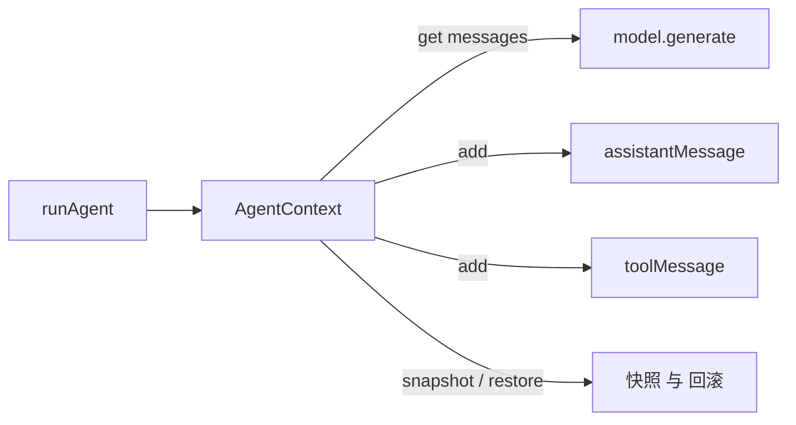

# 11 · Context

> <span class="stage-badge">Stage Hello Harness</span> · <span class="tag-badge">v11-context</span>

兄弟们上一章我们给工具配上了「花名册」（`ToolRegistry`）。这一章，轮到 Agent 的「记忆」了——准确地说，是它的**当前可见世界**。

上一版里，Agent 的所见世界只是一根光秃秃的数组：

```ts
const history = [...request.messages];   // 散装数组，谁都碰得到
```

今天，我们把它装进一个叫 `AgentContext` 的盒子里。

<!-- more -->

## 一、上一版存在什么问题？

09 章到 10 章，`runAgent` 里跟历史打交道的代码长这样：

```ts
const history = [...request.messages];
// ...
history.push(assistantMessage(...));
// ...
history.push(toolMessage(...));
```

数组本身没错，但把它当「Agent 的所见世界」用，有三个隐患：

1. **没有主人**：`history` 只是函数里的一个局部变量，谁拿到引用都能 `push` 一脚——工具的代码、外部的调用方、未来的 UI，都能改它，改完 Agent 就「看到了」不属于它的东西；
2. **没有边界**：变量名是 `history`，语义是「Agent 当前能看到什么」，但这两者之间没有任何约束——**名字和职责全靠自觉**；
3. **没有退路**：想「撤回某一步」？想「在同一轮对话里试两条不同的工具路线，再择优回滚」？数组只有一个，**连时间倒流的把手都没有**。

> 说白了：现在 Agent 的记忆是**一块暴露在风里的黑板**——谁都能写，改错了还没法擦。

## 二、本篇解决什么问题？

1. 引入 **`AgentContext`**：给「Agent 的所见世界」一个**明确的主人**；
2. 引入 **`snapshot()` / `restore()`**：给这个世界装上**快照与回滚**的能力；
3. 防御性拷贝：外面的人拿到 `context.messages` 也只能「看」，**改不动里面**。

同时，这一章立住一个贯穿整个 Stage 2 的**心智模型**：

> **Context 是 Agent 当前可见世界。**

解决完上面三件事，咱们回过头把这条线串一下：**上一章顺手暴露的「记忆是块风里的黑板、谁都能写、改错没法擦」这个遗留问题 → 这一章用「AgentContext + 快照回滚 + 防御性拷贝」解决掉 → 接下来看看我们到底得到了什么收获。**

### 解决之后，我们收获了什么？

- **世界有了明确的主人**：所有「看 / 写世界」都只经 `AgentContext` 一个对象，散装数组那种「谁拿到引用都能 `push` 一脚」的失控彻底消失；
- **时间第一次可以倒流**：`snapshot` / `restore` 让「试错后回滚」成为可能——这是将来重试、分支、子 Agent 的**地基**；
- **外部改不动 = 更安全**：防御性拷贝保证外面拿到数组也只能「看」，Agent 的世界不会被外人偷偷改写；
- **给 Runtime 铺好了底座**：循环从此只跟 `context` 打交道，下一章把循环请出 `runAgent` 时，Context 已经 ready 好接管。

> 一句话收个尾：遗留的「裸数组失控」问题被这一章的抽象解决掉，换来的则是「有主、可回滚、安全、可演进」四笔实实在在的收获，。

## 三、先看最终效果

Agent 的循环照常工作，但内部不再碰裸数组：

```bash
$ pnpm dev -- --tools "6 乘 7 再加上 19 等于多少？"

> hello-harness@0.1.0 dev D:\Workspace\hui\project\hello-harness
> node --import tsx --env-file-if-exists=.env src/index.ts "--tools" "6 乘 7 再加上 19 等于多少？"

ToolCall : calculator({"expression":"6 * 7"})
Result  : {"ok":true,"value":42}
ToolCall : calculator({"expression":"42 + 19"})
Result  : {"ok":true,"value":61}
Answer  : 6 乘 7 等于 42，再加上 19 等于 **61**。
Steps   : 3 轮 · 7 条消息 · 6630ms
Status  : completed (finished)
```

而新世界最炫的能力是「**时间倒流**」——快照、回滚、防篡改，一个命令全看明白：

```bash
$ node --import tsx -e "
import { AgentContext } from './src/context.ts';
import { userMessage, assistantMessage } from './src/messages.ts';

const ctx = new AgentContext();
ctx.add(userMessage('你好'));
const snap = ctx.snapshot();          // 拍照：现在只有 1 条
ctx.add(assistantMessage('世界'));    // 继续聊，变 2 条
console.log(ctx.messages.length);     // → 2
ctx.restore(snap);                    // 时光倒流回到拍照那一刻
console.log(ctx.messages.length);     // → 1

const stolen = ctx.messages;
stolen.push(assistantMessage('外部篡改'));  // 偷出去改，行不行？
console.log(ctx.messages.length);     // → 1（依然 1，改不动内部）
"
```

最后一行是重点：**外面的人拿到数组也只能「看」，推不进去**——这就是防御性拷贝的价值。

## 四、架构变化

```text
src/
├── context.ts     # 新增：AgentContext + ContextSnapshot
├── agent.ts       # 内部：裸数组 history → AgentContext
├── messages.ts    # 不变
├── model/         # 不变
└── tool/          # 不变（上一章的 ToolRegistry 继续用）
```




`runAgent` 不再直接 `push` 数组，而是向 `context` 发号施令：`context.messages` 给它看世界、`context.add` 给它记见闻。**世界有了唯一主人**。

老架构和新架构，小伙伴可以对照着看——别看就多了个盒子，差的可不是一星半点：

| 维度 | 上一版：裸数组 `history` | 这一版：`AgentContext` |
| --- | --- | --- |
| 世界归谁 | 谁拿到引用谁说了算，只是 `runAgent` 里一个局部变量 | `AgentContext` 一个对象独享，唯一主人 |
| 怎么写进去 | 任意角落都能 `history.push(...)` | 只有 `context.add(...)` 一条通道 |
| 外面改得动吗 | 改得动，引用是共享的 | 改不动，拿出去的是拷贝 |
| 能后悔吗 | 不能，push 了就泼出去的水 | 能，`snapshot` / `restore` 一键时光倒流 |
| 名实相符吗 | 叫 `history`，干的却是「当前所见」 | 就叫 Context，职责写脸上：当前可见世界 |

一句话：以前是「一块谁都能往上乱写的黑板」，现在是「一个有门禁、能回放、只认一个管家的房间」。

## 五、核心抽象

在甩类型定义之前，先把「怎么想到这么设计」摊开讲讲，不然直接看代码小伙伴容易一脸懵。我们的思考方式，其实是「先钉需求、再拆角色、最后克制边界」三步：

1. **钉需求**：第二节立的 flag 就一句话——给「Agent 的所见世界」一个**唯一主人**，并且能**回滚**。需求就这俩，不多要；
2. **拆角色**：「世界本身」和「世界某一刻的样子」是两件事。前者要能看、能写、能管；后者只是张只读照片，用来以后恢复。于是很自然拆成 `AgentContext`（管家）和 `ContextSnapshot`（照片）两个角色；
3. **克制边界**：照片是 `readonly`、出去的数组是拷贝、写入口只留 `add` 一个——每一步都在回答同一个问题：「怎么让外面的人**最不容易搞破坏**」。能不开放的能力就不开放，这比事后打补丁省心一百倍。

> **出发点小结**：我们不是「为了封装而封装」，而是被「谁都能乱写、改错没法擦、想回滚没把手」这三个真实痛点逼出来的。先教学、后抽象——`AgentContext` 是这一章的「最小够用」，Memory 那种大词留到 Continual 阶段再背。

下面把这两个角色摊开看。

### ContextSnapshot：一张照片

```ts
export interface ContextSnapshot {
  readonly messages: readonly Message[];
}
```

快照就是**把当前世界的完整状态拷贝一份**。`readonly` 提醒我们：照片是给「以后恢复」用的，不是给谁改着玩的。

### AgentContext：世界的管家

```ts
export class AgentContext {
  private _messages: Message[];

  constructor(messages: Message[] = []) {
    this._messages = [...messages];   // 进来先拷贝：不欠外部人情
  }

  get messages(): Message[] {
    return [...this._messages];       // 出去也拷贝：外面只能看
  }

  add(message: Message): void {
    this._messages.push(message);     // 唯一入口：写世界的路只有这一条
  }

  snapshot(): ContextSnapshot {
    return { messages: [...this._messages] };
  }

  restore(snapshot: ContextSnapshot): void {
    this._messages = [...snapshot.messages];
  }
}
```

四个方法，一张表看懂：

| 方法 | 一句话职责 |
| --- | --- |
| `messages` | **读**：交出世界的一份拷贝，外面随便看、改不动内部 |
| `add` | **写**：往世界追加一条消息，唯一的写入通道 |
| `snapshot` | **拍**：拷贝当前完整状态，留作以后恢复 |
| `restore` | **倒**：把世界恢复成某次快照的样子 |

### 为什么叫 Context，不叫 Memory？

**重点关注**：这是规划里的明确决定，值得展开：

- **Context** = Agent **这一次运行中**当前能看到的一切（对话消息、未来的工具结果、运行时信息）——**会变、有快照、可回滚**；
- **Memory** = Agent **跨运行、跨会话**的长期记忆（要持久化、要检索、要有生命周期）——那是很后面的事。

现在把两者混在一起叫 Memory，等于给一个还在学走路的婴儿背上「终身档案」的包袱。**先教学，后抽象**：先立住「当前可见世界」这个最小的概念，Memory 等到了 Continual 阶段再登场。

### Context 进入 runAgent

`runAgent` 把裸数组换成了盒子，循环代码几乎不变——这才是抽象该有的样子：**换内核，不换脸**：

```ts
const context = new AgentContext(request.messages);

// 交给模型看世界
response = await model.generate({ messages: context.messages, tools: registry.list() });
// 记下见闻
context.add(assistantMessage(response.content, response.toolCalls));
// ...
context.add(toolMessage(call.id, JSON.stringify(result) ?? ""));
```

## 六、实现代码

### Context实现

**`src/context.ts`** 完整实现：

```ts
import type { Message } from "./messages";

export interface ContextSnapshot {
  readonly messages: readonly Message[];
}

export class AgentContext {
  private _messages: Message[];

  constructor(messages: Message[] = []) {
    this._messages = [...messages];
  }

  get messages(): Message[] {
    return [...this._messages];
  }

  add(message: Message): void {
    this._messages.push(message);
  }

  snapshot(): ContextSnapshot {
    return { messages: [...this._messages] };
  }

  restore(snapshot: ContextSnapshot): void {
    this._messages = [...snapshot.messages];
  }
}
```

### Agent适配

**`src/agent.ts`** 差异（换芯不改脸）：


```ts
// 之前：
const history = [...request.messages];
// ...
history.push(assistantMessage(...));
history.push(toolMessage(...));

// 现在：
const context = new AgentContext(request.messages);
// ...
context.add(assistantMessage(...));
context.add(toolMessage(...));
// 结束时返回 context.messages 即可，AgentResult.history 类型不变
```

## 七、运行 Demo

接下来进入正题，正确的使用姿势如下，小伙伴跟着跑两遍就懂了：

```bash
# 1. Agent 照常工作，内部已跑在 Context 上
pnpm dev -- --tools "6 乘 7 再加上 19 等于多少？"

# 2. 感受「时间倒流」与「防篡改」
node --import tsx -e "
import { AgentContext } from './src/context.ts';
import { userMessage, assistantMessage } from './src/messages.ts';
const ctx = new AgentContext();
ctx.add(userMessage('你好'));
const snap = ctx.snapshot();
ctx.add(assistantMessage('世界'));
console.log('两条了？', ctx.messages.length);          // 2
ctx.restore(snap);
console.log('倒流到 1 条', ctx.messages.length);       // 1
"
```


## 八、新架构解决了什么？

最后我们引入了Context之后，看看到底有什么收获：

- **世界有了主人**：所有「看世界 / 写世界」都经 `AgentContext` 一个对象，散装数组的失控没了；
- **想撤回就撤回**：`snapshot` / `restore` 让「试错后回滚」成为可能——这是将来重试、分支、子 Agent 的**地基**；
- **改不动 = 更安全**：防御性拷贝保证外部拿到数组也只能读，**Agent 的世界不会被外人偷偷改写**；
- **名字配得上职责**：`Context` 这个名字直接表达「当前可见世界」，语义和代码对上了。

## 九、它又引入了什么问题？

`AgentContext` 把 Agent 的所见世界管得有主、可回滚、防篡改了，那它又悄悄把哪些新坑埋进来了？

- **Context 还是「一根筋」**：只有一条时间线，`restore` 会丢掉快照之后的所有分支——**分支与合并**（一棵树）还没设计；
- **snapshot 是浅拷贝**：快照复制的是消息数组，消息对象本身还是共享引用——消息不可变时没事，一旦消息可变就会「拍出会动的照片」；
- **Context 里只有消息**：当前世界只有对话，工具结果、token、时间等运行信息还没进 Context——那是 `Run` / `Event` 的活；
- **runAgent 的循环还在裸奔**：循环条件、停止判断、`try/catch` 依然写死在 `runAgent` 里——一个函数同时干着「循环」「判断」「执行」的活，**Runtime 与 Step 的拆分**就是下一章的引子。

## 十、下一章

> **本章小结**：这一章给 Agent 的所见世界请了个「管家」——`AgentContext` 让世界有了唯一主人，`snapshot` / `restore` 第一次让时间可以倒流，防御性拷贝保证外部只能看、改不动。更重要的是，我们立住了贯穿 Stage 2 的心智模型：**Context 是 Agent 当前可见世界**（先别急着叫 Memory）。从此，Agent 的「记忆」从暴露在风里的黑板，变成了有主、可控、可回滚的盒子。

看到这里的小伙伴，不妨亲手跑一遍上面的「时间倒流」demo，感受一下 Agent 的所见世界有了管家之后的安全感

### 下章预告

**12 · Agent Runtime**——把「会干活的循环」从 `runAgent` 里请出来，变成一级公民：

```ts
class AgentRuntime {
  async run(request: ModelRequest): Promise<AgentRun> { ... }
}
```

现在的 `runAgent` 是一个**函数**；下一章的 `AgentRuntime` 是一个**对象**——它管着 Context、Registry，手里握着停止条件，呼之即来、挥之即去。记住一句话：

> **Agent 是一个循环，Runtime 是让这个循环可以被创建、被控制、被观察的系统。**

那么问题来了——`runAgent` 的循环、判断、执行还挤在一个函数里「裸奔」，怎么把它升级成可以被创建、被控制、被观察的「运行时」？，下一章，咱们给它配一个真正的 Runtime 😊

---

微信公众号: 一灰灰Blog