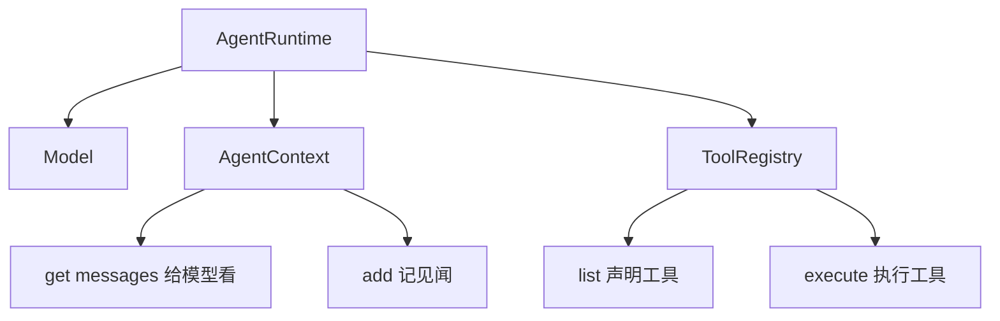

# 12 · Agent Runtime

> <span class="stage-badge">Stage Hello Harness</span> · <span class="tag-badge">v12-runtime</span>

前面我们把「会干活的循环」写在一个函数里：`runAgent`。它从第一章干到现在，很卖力，但这一章我们决定给它**升职**——从**函数**变成**类**，改名 `AgentRuntime`。

> 这一章很重要。

Agent 的循环不再是散落的一段代码，而是一个有名字、有依赖、可以被创建和控制的**一等公民**。

<!-- more -->

## 一、上一版存在什么问题？

回看上一章的 `runAgent`，它的「活法」是这样的：

```ts
const result = await runAgent(model, request, registry, { maxSteps: 20, timeoutMs: 60_000 });
```

函数本身没问题，但作为一个「会干活的系统」，它有三个尴尬：

1. **依赖靠搬运**：`model`、`registry`、停止选项……每次调用都要把整副家当**重新搬一遍**。想连续跑三个任务？三遍 `runAgent(model, request, ...)`，参数抄三遍；
2. **状态无处安放**：循环是函数内部的一段 `while(true)`，停止条件、计时、迭代次数全是函数里的局部变量——**这个「循环」没有身份**，你没法说「我手里的这个运行时」；
3. **没法扩展**：想给循环挂个日志？换个停止策略？加个前置步骤？都得改函数签名或往函数体里塞 `if`——**函数的骨架是焊死的**。

> 一句话：`runAgent` 是「一次性的、装好就走的施工队」——干一次活可以，但你要的是一位「常驻工地的包工头」，他能**反复接单**，还能被你**提前定好规矩**。

## 二、本篇解决什么问题？

1. 把函数升级成 **`AgentRuntime` 类**——一个**对象**，而不是一段过程；
2. 依赖注入进**构造函数**：`new AgentRuntime(model, registry, options)`，一次构造，**多次 `run()`**；
3. 每次 `run()` 自带一个全新 `AgentContext`——**任务之间互不串门**。

同时立住贯穿 Stage 2 的心智模型：

> **Agent 是一个循环，Runtime 是让这个循环可以被创建、被控制、被观察的系统。**

解决完上面三件事，咱们回过头把这条线串一下：**上一节留下的「循环没身份、依赖靠搬运、想扩展得改签名」这些遗留问题 → 这一章用「类 + 构造注入 + 每次 run 新 Context」解决掉 → 接下来看看我们到底得到了什么收获。**

### 解决之后，我们收获了什么？

- **依赖有了家**：构造一次、运行多次，`model` / `registry` / 停止规矩不用每次重搬；
- **循环有了身份**：`AgentRuntime` 是可以被持有、被传入、被组合的对象——不再是函数里的一段匿名 `while`；
- **任务有了隔离**：每次 `run` 自带全新 `AgentContext`，多次任务天然互不串门；
- **扩展有了落脚点**：想换模型、换工具集、换停止策略——只换构造参数，`run` 一行不用动。

> 一句话收个尾：遗留的「函数散装」问题被这一章的抽象解决掉，换来的则是「依赖有家、循环有身份、任务有隔离、扩展有落点」四笔实实在在的收获

## 三、先看最终效果

CLI 行为不变（变的是内里），`runAgent` 的活由 `runtime.run()` 接棒：

```bash
$ pnpm dev -- --tools "6 乘 7 再加上 19 等于多少？"

> hello-harness@0.1.0 dev D:\Workspace\hui\project\hello-harness
> node --import tsx --env-file-if-exists=.env src/index.ts "--tools" "6 乘 7 再加上 19 等于多少？"

ToolCall : calculator({"expression":"6 * 7 + 19"})
Result  : {"ok":true,"value":61}
Answer  : 6 × 7 + 19 = 61。
Steps   : 2 轮 · 5 条消息 · 4421ms
Status  : completed (finished)
```

真正的变化在于「**一个运行时，两个任务**」——构造一次，反复接单：

```bash
$ node --env-file-if-exists=.env --import tsx -e "
import { createOpenAIModel } from './src/model/openai.ts';
import { ToolRegistry } from './src/tool/registry.ts';
import { calculator } from './src/tool/calculator.ts';
import { randomInteger } from './src/tool/random.ts';
import { AgentRuntime } from './src/runtime.ts';
import { systemMessage, userMessage } from './src/messages.ts';

const registry = new ToolRegistry();
registry.register(calculator);
registry.register(randomInteger);

const runtime = new AgentRuntime(createOpenAIModel(), registry);

const base = { messages: [systemMessage('你是一个简洁、直接的中文助手，工具可以使用时必须调用工具；对于复杂的数学计算，你应该拆分成多个简单的表达式，进行多次的工具调用'), userMessage('6 乘 7 再加上 19 等于多少？')] };
const r1 = await runtime.run({ messages: [...base.messages] });
console.log('任务1:', r1.status, r1.iterations, '轮');

const r2 = await runtime.run({ messages: [...base.messages] });
console.log('任务2:', r2.status, r2.iterations, '轮');
console.log('两次任务互相独立:', r2.history.length === 5);
"
```

预期的输出结果如下：

```
任务1: completed 2 轮
任务2: completed 2 轮
两次任务互相独立: true
```

> 注意命令开头的 `--env-file-if-exists=.env`：它和 `pnpm dev` 一样从项目根加载 `.env`，否则 `createOpenAIModel()` 会因缺少 `OPENAI_API_KEY` 直接抛错。你的 `.env` 里填的就是上一篇配置好的真实 Key。

注意 `r2` 的历史从 `[system, user]` 干净开始——**它看不到 `r1` 说过什么**。这就是「每次 run 自带新 Context」的隔离性。

## 四、架构变化

```text
src/
├── agent.ts      # 删除：runAgent() 函数退役
├── runtime.ts    # 新增：AgentRuntime 类（RunStatus/StopReason/AgentResult 一并迁入）
├── context.ts    # 不变
├── tool/         # 不变
└── index.ts      # runAgent(model, request, registry) → new AgentRuntime(model, registry).run(request)
```

`AgentRuntime` 的依赖关系，正是规划里那张图：



`runAgent` 时代依赖靠**参数传**；`AgentRuntime` 时代依赖靠**构造注入**。

老架构和新架构，小伙伴可以对照着看——同样是「让 Agent 干一次活」，写法差得可不止一点半点：

| 维度 | 上一版：`runAgent()` 函数 | 这一版：`AgentRuntime` 类 |
| --- | --- | --- |
| 怎么调用 | 每次都把 `model` / `registry` / `options` 当参数重搬一遍 | 构造一次，之后只 `.run(request)` |
| 有身份吗 | 没，函数调完就散了，抓不住「这个循环」 | 有，`new` 出来的对象能被持有、传入、组合 |
| 依赖哪来 | 参数传，调用方每次都得操心 | 构造注入，规矩「入职」时就定好 |
| 任务隔离 | 靠调用方自觉传干净 `messages` | 每次 `run` 自带新 `Context`，天然互不串门 |
| 想扩展 | 改函数签名 / 往里塞 `if` | 换构造参数即可，`run` 一行不用动 |

一句话：以前是「每次开工都得把整副家当重新扛到现场」，现在是「工地常驻一位包工头，规矩定好，来单就干」。

> 注：`AgentRuntime` 的依赖关系正是规划里那张图——`Runtime → Model / Context / ToolRegistry`，循环与三个核心抽象正式「并网」。

## 五、核心抽象

在甩代码之前，依然先讲我们这么设计的思考点拆解一下，避免大家直接看代码一脸懵，核心依然是「先钉需求、再拆角色、最后克制边界」三步：

1. **钉需求**：回顾下本文开始我们提到的痛点——循环要成为**一等公民**，能被创建、被控制、被观察。具体就是干掉「依赖靠搬运、循环没身份、没法扩展」三件事；
2. **拆角色**：复习一下 11 章的「拥有 vs 创建」——`model` / `registry` / 停止规矩是**常驻的家当**（构造注入），`AgentContext` 是**一次性的世界**（每次 `run` 现 new）。这个拆分是整个 Runtime 设计的龙骨；
3. **克制边界**：停止规矩在构造时一次性定死（`maxSteps` / `timeout` / `signal`），`run()` 内部不再「临场翻兜」；循环逻辑从 `runAgent` 原样迁入，`run()` 只换归属、不换脸。

> **出发点小结**：我们不是「为了面向对象而面向对象」，而是被「依赖靠搬运、循环没身份、没法扩展」三个真实痛点逼出来的。
> 先把循环收进一个有名字、有依赖的类，Step 的拆分等 13 章再说。

下面把这几个核心角色摊开看。

### 依赖注入：构造一次，运行多次

```ts
export class AgentRuntime {
  constructor(
    private readonly model: Model,        // 注入：说话的大脑
    private readonly registry: ToolRegistry, // 注入：工具的花名册
    options: AgentRuntimeOptions = {},    // 注入：停止规矩
  ) { ... }

  async run(request: ModelRequest): Promise<AgentResult> { ... }
}
```

`model`、`registry`、停止条件——**三样家当在构造时一次性搬进工地**，之后每次 `run()` 只需给一个 `request`。

### 拥有的 vs 创建的

`AgentRuntime` 要分清楚两类东西：

| 类别 | 成员 | 生命周期 |
| --- | --- | --- |
| **拥有**（构造注入） | `model`、`registry`、停止选项 | 与 Runtime 同生共死，常驻 |
| **创建**（每次 run） | `AgentContext` | 每次任务一个，跑完即弃 |

**重点关注**：关键在这——**Context 是「这一次任务」的世界**，所以它必须在 `run()` 内部 `new`——**不能**被两个任务共享，否则任务 2 就会「看到」任务 1 的私聊记录。

```ts
async run(request: ModelRequest): Promise<AgentResult> {
  const context = new AgentContext(request.messages);  // 每次全新
  // ...循环照旧，只是 history → context
}
```

### 循环搬家

整个 `while(true)` 从函数体搬进 `run()` 方法，一行逻辑没变——**变的是它现在属于谁**。停止条件从参数 `options` 摊进构造器：

```ts
this.maxSteps = options.maxSteps ?? 20;
this.timeoutMs = options.timeoutMs ?? 120_000;
this.signal = options.signal;
```

从此 `run()` 里不再出现 `options.maxSteps` 这种「临场翻兜」，规矩**在入职时就定好了**。

## 六、实现代码

### AgentRuntime实现

**`src/runtime.ts`** 骨架：

```ts
export type RunStatus = "running" | "completed" | "failed" | "aborted";
export type StopReason = "finished" | "maxSteps" | "timeout" | "aborted" | "failed";

export interface AgentResult {
  status: RunStatus;
  stopReason: StopReason;
  answer: string;
  history: Message[];
  iterations: number;
  error?: string;
}

export interface AgentRuntimeOptions {
  maxSteps?: number;
  timeoutMs?: number;
  signal?: AbortSignal;
}

export class AgentRuntime {
  private readonly maxSteps: number;
  private readonly timeoutMs: number;
  private readonly signal?: AbortSignal;

  constructor(
    private readonly model: Model,
    private readonly registry: ToolRegistry,
    options: AgentRuntimeOptions = {},
  ) {
    this.maxSteps = options.maxSteps ?? 20;
    this.timeoutMs = options.timeoutMs ?? 120_000;
    this.signal = options.signal;
  }

  async run(request: ModelRequest): Promise<AgentResult> {
    const context = new AgentContext(request.messages);
    // ... 循环与停止判断：从 runAgent 原样迁入（history → context）
  }
}
```

### 应用层适配

**`src/index.ts`** 的接棒：

```ts
// 之前：
const result = await runAgent(model, request, registry, options);
// 现在：
const runtime = new AgentRuntime(model, registry, options);
const result = await runtime.run(request);
```

> 说明：`RunStatus` / `StopReason` / `AgentResult` 三个类型随循环一起迁入 `runtime.ts`。`agent.ts` 退役删除——被取代的抽象不留两套并行的活法。

## 七、运行 Demo

接下来进入正题，正确的使用姿势如下，小伙伴跟着跑两遍就懂了：

```bash
# 1. CLI 照常（内部已是 runtime.run）
pnpm dev -- --tools "6 乘 7 等于多少？"

# 2. 一个运行时，两个任务，互不串门
node --env-file-if-exists=.env --import tsx -e "
import { createOpenAIModel } from './src/model/openai.ts';
import { ToolRegistry } from './src/tool/registry.ts';
import { calculator } from './src/tool/calculator.ts';
import { randomInteger } from './src/tool/random.ts';
import { AgentRuntime } from './src/runtime.ts';
import { systemMessage, userMessage } from './src/messages.ts';
const registry = new ToolRegistry();
registry.register(calculator);
registry.register(randomInteger);
const runtime = new AgentRuntime(createOpenAIModel(), registry);
const base = { messages: [systemMessage('你是一个简洁、直接的中文助手，工具可以使用时必须调用工具；对于复杂的数学计算，你应该拆分成多个简单的表达式，进行多次的工具调用'), userMessage('6 乘 7 再加上 19 等于多少？')] };
for (let i = 1; i <= 2; i++) {
  const r = await runtime.run({ messages: [...base.messages] });
  console.log('任务' + i + ':', r.status, '|', r.iterations, '轮 |', r.history.length, '条消息');
}
"
```


## 八、新架构解决了什么？

- **依赖有了家**：构造一次、运行多次，`model` / `registry` / 停止规矩不用每次重搬；
- **循环有了身份**：`AgentRuntime` 是可以被持有、被传入、被组合的对象——不再是函数里的一段匿名 `while`；
- **任务有了隔离**：每次 `run` 自带全新 `AgentContext`，多次任务互不污染；
- **扩展有了落脚点**：想换模型、换工具集、换停止策略——**换构造参数即可**，`run` 一行不用动；
- **为拆步铺路**：循环被收进一个类之后，「每一步做了什么」才有了下一步拆分的切入点（正是 13 章的事）。

## 九、它又引入了什么问题？

`AgentRuntime` 把循环收编成了有身份、可复用的一等公民，那它又悄悄把哪些新边界、新坑暴露出来了？

Runtime 把循环「收了编」，但新边界随之露出：

- **Context 每次归零**：任务与任务之间老死不相往来——「**接着上次聊**」（会话/续聊）完全不存在，session 概念缺席；
- **循环还是一坨**：`run()` 里 `while` + 停止判断 + `try/catch` + 工具执行仍挤在一起——**Step 还没有名字**，每一步的边界模糊；
- **停止规矩焊死在构造器**：maxSteps / timeout / signal 成了 Runtime 的固定三件套——**策略**与 **执行**没有分开；
- **运行过程不可观察**：只有结束时拿到 `AgentResult`，**进行中**发生了什么依然两眼一抹黑——Event 还没诞生；
- **结果没有身份**：返回的是「一次结果」，但「**一次运行**」本身没有对象——没有 `Run`，就无法记录、审计、重放。

## 十、下一章

> **本章小结**：这一章把「会干活的循环」从函数升职成了类——`AgentRuntime` 用构造函数一次性注入 `model` / `registry` / 停止规矩，之后 `run()` 只认 `request`；每次 `run` 自带一个全新 `AgentContext`，任务之间互不串门。我们立住了贯穿 Stage 2 的心智模型：**Agent 是一个循环，Runtime 是让循环可以被创建、被控制、被观察的系统**。从此，循环从「散落的一段代码」变成了「可被持有、传入、组合的一等公民」。

### 下章预告

**13 · Agent Step**——给循环里的「每一轮」起名字：

```ts
class AgentStep {
  run(context: AgentContext): Promise<StepResult> { ... }
}
```

Runtime 不再亲手写 `while(true)`，而是变成 **Step 的编排者**：

> **Runtime 负责「什么时候转」和「转到哪停」，Step 负责「转一圈时都干些什么」。**

那么问题来了——`run()` 里 `while` + 停止判断 + 工具执行还挤在一坨，每一步的边界模糊、运行过程还两眼一抹黑，怎么把「一轮」拆成可命名、可观察、可重放的「标准施工工序」？

下一章，咱们给这台「常驻工地」的运行时装上标准的「施工工序」😊

---

微信公众号: 一灰灰Blog