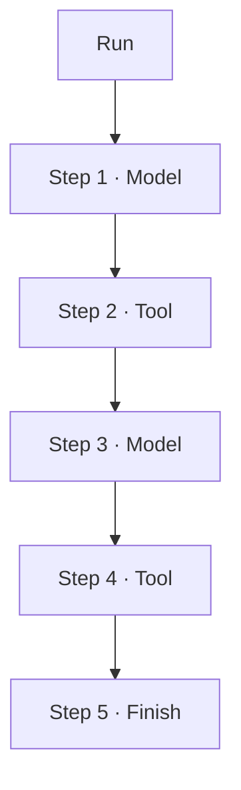

# 13 · Agent Step

> <span class="stage-badge">Stage Hello Harness</span> · <span class="tag-badge">v13-step</span>


上一章我们把循环升职成了 `AgentRuntime`——但循环转起来之后，**它每一步都干了什么，依然还没人记录**。

这一章，我们给循环里的每一步**起名字、留脚印**：

```ts
type AgentStep = ModelStep | ToolStep | FinishStep | ErrorStep;
```

别小看这一步——它是将来 **Trace、Replay、UI、Eval、Checkpoint** 的**地基**。

<!-- more -->

## 一、上一版存在什么问题？

12 章的 `run()` 能跑，但跑完之后，你只有一张「成绩单」：

```ts
{
  status: "completed",
  stopReason: "finished",
  answer: "42",
  history: [...],     // 一堆消息
  iterations: 2,
}
```

「2 轮」「5 条消息」——太笼统了。你想回答的问题，这张成绩单一个都答不上：

1. **这 2 轮里，模型分别调了哪些工具？参数是什么？**——`history` 里有，但要你自己翻；
2. **工具调用的结果依次是什么？**——也在 `history` 里，格式还是 JSON 字符串；
3. **第几步是模型、第几步是工具、第几步结束的？**——没有答案，循环内部是**一锅粥**；
4. **每一步耗时多少、花了多少 token？**——完全没有，步骤连「身份」都没有。

> 一句话：循环在**闷头干活**，但对这个世界来说，它干完就**失忆了**。想重放、想评测、想可视化——**没有脚印可循**。

## 二、本篇解决什么问题？

1. 引入 **`AgentStep`**：给循环里的每一步一个**类型**和**名字**；
2. `AgentRuntime` 变成「**跑一步，记一步**」——把每一步的输入、输出如实写进 `steps` 追踪记录；
3. `AgentResult` 从此多一张 **`steps` 清单**：一次运行 = 一条可逐格回放的时间线。

**下一步的地基已经打好了**——有了步骤，才有 Trace / Replay / UI / Eval / Checkpoint 的原料。

解决完上面三件事，咱们回过头把这条线串一下：**上面提到的「循环闷头干活、干完就失忆、没有脚印」这个遗留问题 → 这一章用「AgentStep 命名 + Runtime 跑一步记一步 + AgentResult.steps 时间线」解决掉 → 接下来看看我们到底得到了什么收获。**

### 解决之后，我们收获了什么？

- **过程可观察**：每一步有类型、有输入、有输出，循环不再是黑盒；
- **时间线可重放**：`ModelStep` 自带完整 `request`，拿 `steps` 就能一比一还原现场；
- **评估/可视化有抓手**：Eval 想打分、UI 想画图，直接遍历 `steps` 即可，不用再翻 `history`；
- **给 Run / Checkpoint 铺好地基**：有了「步骤」这个最小原料，后续一切消费者才接得上。

> 一句话收个尾：遗留的「循环失忆」问题被这一章的抽象解决掉，换来的则是「可观察、可重放、可评估、可延展」四笔实实在在的收获

## 三、先看最终效果

CLI 不再只给「成绩单」，而是给出**逐格时间线**：

```bash
$ pnpm dev -- --tools "6 乘 7 再加上 五 等于多少？"

> hello-harness@0.1.0 dev D:\Workspace\hui\project\hello-harness
> node --import tsx --env-file-if-exists=.env src/index.ts "--tools" "6 乘 7 再加上 五 等于多少？"

Step 1 · model  → 调用工具：calculator
Step 2 · tool   → calculator({"expression":"6 * 7 + 5"}) = {"ok":true,"value":47}
Step 3 · model  → 完成回答
Step 4 · finish → finished
Answer  : 6 × 7 + 5 = 47。
Steps   : 2 轮 · 5 条消息 · 4 步 · 4165ms
Status  : completed (finished)
```

注意最后一行新增的「**4 步**」——`steps` 就是那条时间线。出了错，时间线也照记：

```bash
$ pnpm dev -- --tools "给我算一下这个"    # 模拟网络故障
Step 1 · error  → failed Connection error.
Status  : failed (failed) · Connection error.
```

失败不再是一句「Error」，而是一行**有类型、有原因**的 `ErrorStep`。

## 四、架构变化

```text
src/
├── step.ts       # 新增：AgentStep（ModelStep / ToolStep / FinishStep / ErrorStep）
├── runtime.ts    # run() 每步落账：steps 数组 + AgentResult.steps
├── context.ts    # 不变
├── tool/         # 不变
└── index.ts      # CLI 改打 steps 时间线（替换旧的 history 打点）
```

一次运行的完整样子，正是规划里那张图：




**循环与记录**从这一刻起不再分家：跑一步、记一步，跑完即得完整时间线。

老架构和新架构，小伙伴可以对照着看——同样跑完一圈，你能拿到手的东西差出一条街：

| 维度 | 上一版：循环黑盒 | 这一版：步骤时间线 |
| --- | --- | --- |
| 跑完拿到什么 | 一张成绩单（`status` / `answer` / `history`） | 成绩单 + 一条 `steps` 时间线 |
| 能回放吗 | 不能，得靠猜 | 能，`ModelStep` 自带 `request` 原样重放 |
| 哪步调了啥工具 | 在 `history` 里自己翻 JSON | `steps` 一眼分清 model / tool / finish / error |
| 出错怎么记 | 一句笼统的 "Error" | 有类型有原因的 `ErrorStep` |
| 能评测/可视化吗 | 原料不够，得二次解析 | `steps` 直接遍历打分、画图 |

一句话：以前是「干完活卷铺盖走人，留你对着一坨消息猜它干了啥」；现在是「每一步都打卡留痕，想重放、想打分、想画图都有现成数据」。

> 注：`steps` 串起来正好对应规划里那张图——`Run → Model → Tool → Model → ... → Finish`，循环与记录正式「并网」。

## 五、核心抽象

在甩类型定义之前，先把「怎么想到这么设计」摊开讲讲，我们的思考方式，还是「先钉需求、再拆角色、最后克制边界」三步：

1. **钉需求**：12 章埋下的坑——循环闷头干活、干完失忆，想重放/评测/可视化都没脚印。需求就一句：「让每一步都有身份、可被记录、可被回放」；
2. **拆角色**：把「一轮循环」切成四种命名步骤——`ModelStep`（调模型）、`ToolStep`（跑工具）、`FinishStep`（正常收尾）、`ErrorStep`（异常终止），用判别联合串起来；终局单独成类，保证时间线收得住尾；
3. **克制边界**：每步只记「必要且自洽」的信息——`ModelStep` 把 `request` 也带上是关键（否则没法重放），但不偷偷依赖全局状态；Runtime 只负责「跑一步、记一步」，不抢步骤自身的语义。

> **出发点小结**：我们不是「为了打日志而打日志」，而是被「循环失忆、没法重放、没法评测」三个真实痛点逼出来的。 同样遵循先教学、后抽象——先把「步骤」这个最小原料立住，Trace / Replay / Eval 那些大词后面几章再长出来。

下面把这几个角色摊开看看

### AgentStep：一个判别联合

```ts
export type AgentStep = ModelStep | ToolStep | FinishStep | ErrorStep;
```

| 步骤 | 含义 | 记下什么 |
| --- | --- | --- |
| `ModelStep` | 调了一次模型 | 完整的 `request`（发了什么）+ `response`（回了什么） |
| `ToolStep` | 执行了一次工具 | 工具调用 `call` + 统一结果 `result` |
| `FinishStep` | 正常收尾 | `stopReason` + 最终 `answer` |
| `ErrorStep` | 出错终止 | `stopReason` + `message` |

**重点关注**：关键设计在——**ModelStep 是自包含的**：

```ts
export interface ModelStep {
  type: "model";
  request: ModelRequest;     // 这次到底发了什么（含当时的完整 messages）
  response: ModelResponse;   // 模型回了什么（含 toolCalls / token）
}
```

带着 `request`，这步就能**原样重放**——不用靠猜。

### 终局步骤：为什么停下来，也要被记录

循环停止的四种原因，分别归入两类终局步骤：

```ts
// 正常收尾：任务完成 / 达到步数上限
{ type: "finish", stopReason: "finished" | "maxSteps", answer }
// 异常终止：模型报错 / 超时 / 被取消
{ type: "error", stopReason: "failed" | "timeout" | "aborted", message }
```

时间线的**最后一步永远是终局步骤**——读取 `steps.at(-1)` 就能知道「这次是怎么结束的」。

### Runtime 的职责升级

12 章的 Runtime：「**跑循环，给成绩单**」；这一章的 Runtime：「**跑一步，记一步，再给成绩单**」。核心就一句话：

```ts
steps.push({ type: "model", request, response });   // 调完模型，落账
steps.push({ type: "tool", call, result });          // 跑完工具，落账
steps.push({ type: "finish", stopReason, answer });  // 收尾，落账
```

## 六、实现代码

#### Step定义

**`src/step.ts`**——四种步骤 + 联合类型：

```ts
import type { ModelRequest, ModelResponse, ToolCall } from "./model/types";
import type { ToolResult } from "./tool/tool";
import type { StopReason } from "./runtime";

export type AgentStep = ModelStep | ToolStep | FinishStep | ErrorStep;

export interface ModelStep {
  type: "model";
  request: ModelRequest;
  response: ModelResponse;
}

export interface ToolStep {
  type: "tool";
  call: ToolCall;
  result: ToolResult;
}

export interface FinishStep {
  type: "finish";
  stopReason: StopReason;
  answer: string;
}

export interface ErrorStep {
  type: "error";
  stopReason: StopReason;
  message: string;
}
```

### AgentRuntime 记录执行步骤


**`src/runtime.ts`**——`run()` 里三处落账：


```ts
const steps: AgentStep[] = [];

// 1) 调完模型，把 request + response 原样记下
steps.push({ type: "model", request: { messages: context.messages, tools }, response });
// 2) 跑完工具，把 call + result 记下
steps.push({ type: "tool", call, result });
// 3) 收尾时，终局步骤进时间线
if (stopReason === "finished" || stopReason === "maxSteps") {
  steps.push({ type: "finish", stopReason, answer });
} else {
  steps.push({ type: "error", stopReason, message: error ?? "" });
}
```

`AgentResult` 增加一个字段：

```ts
export interface AgentResult {
  status: RunStatus;
  stopReason: StopReason;
  answer: string;
  history: Message[];
  steps: AgentStep[];   // 新增：完整时间线
  iterations: number;
  error?: string;
}
```

## 七、运行 Demo

接下来进入正题，正确的使用姿势如下，小伙伴跟着跑两遍就懂了：

```bash
# 1. 时间线 CLI：模型 / 工具 / 收尾 / 出错，逐格打点
pnpm dev -- --tools "6 乘 7 等于多少？"

# 2. 直接看 steps 数组（一次运行 = 一条可重放的时间线）
node --env-file-if-exists=.env --import tsx -e "
import { AgentRuntime } from './src/runtime.ts';
import { createOpenAIModel } from './src/model/openai.ts';
import { ToolRegistry } from './src/tool/registry.ts';
import { calculator } from './src/tool/calculator.ts';
import { randomInteger } from './src/tool/random.ts';
import { systemMessage, userMessage } from './src/messages.ts';

const registry = new ToolRegistry();
registry.register(calculator);
registry.register(randomInteger);
const runtime = new AgentRuntime(createOpenAIModel(), registry);

const result = await runtime.run({
  messages: [systemMessage('你是一个中文助手，工具可以使用时必须调用工具；'), userMessage('6 乘 7 再加上 五 等于多少？')],
});
for (const step of result.steps) {
  console.log(JSON.stringify(step).slice(0, 120));
}
"
```


输出的步骤如下：

```text
{"type":"model","request":{"messages":[{"role":"system","content":"你是一个中文助手，工具可以使用时必须调用工具；"},{"role":"user","content":"6
{"type":"tool","call":{"id":"019ffe5a66e9529b3f6e77582107983c","name":"calculator","arguments":{"expression":"6 * 7 + 5"
{"type":"model","request":{"messages":[{"role":"system","content":"你是一个中文助手，工具可以使用时必须调用工具；"},{"role":"user","content":"6
{"type":"finish","stopReason":"finished","answer":"6 乘 7 等于 42，再加上 5 等于 **47**。"}
```

## 八、新架构解决了什么？

- **过程可观察**：每一步有类型、有输入、有输出，循环不再是黑盒；
- **时间线可重放**：ModelStep 自带完整 `request`，拿 `steps` 就能一比一还原现场；
- **评估有抓手**：Eval 想给「第几步调用了什么工具」打分，直接遍历 `steps` 即可；
- **可视化有原料**：UI / TUI 想画「Agent 怎么一步步干活的」，`steps` 就是现成的数据；
- **检查点有位置**：Checkpoint 想在某一步之后存档，`steps` 的索引就是天然的书签。

一句话：**Trace / Replay / UI / Eval / Checkpoint，全是「步骤」的消费者。**

## 九、它又引入了什么问题？

`AgentStep` 给循环每一步都打了卡、留了痕，可这一套「逐格记帐」本身，又悄悄埋下了哪些新坑？

- **时间线很「胖」**：ModelStep 里带着当时的完整 `messages`，一轮比一轮大——**又重又冗余**；
- **双份记录**：同一条消息在 `history` 和 `steps` 里各存一份，**数据开始重复**；
- **步骤没有时间与开销**：每步耗时、token 消耗**缺席**——想按步骤计费/分析，原料还不够；
- **运行没有身份**：`steps` 是 `AgentResult` 的一部分，但**「这一次运行」本身还不是一个对象**——没有 `Run`，就无法给它起名、持久化、跨进程传递；
- **错误只有两种记法**：运行中「某工具失败」其实是 `ToolResult.ok=false`（被当作正常回传），只有模型调用炸了才记 `ErrorStep`——**错误模型**还没成型。

## 十、下一章

> **本章小结**：这一章给循环里的每一步「起名字、留脚印」——`AgentStep` 用判别联合把 Model / Tool / Finish / Error 四种步骤说清楚，Runtime 改成「跑一步、记一步」，`AgentResult` 从此多了一张 `steps` 时间线。最大的彩蛋是 `ModelStep` 自带完整 `request`，让「原样重放」第一次成为可能。从此，循环干完活不再失忆，Trace / Replay / UI / Eval / Checkpoint 全都有了原料。

**14 · Run**——把「一次运行」本身变成一个一等公民：

```ts
class AgentRun {
  id: string;
  request: ModelRequest;
  steps: AgentStep[];
  result: AgentResult;
  startedAt: number;
}
```

`steps` 是时间线，而 `Run` 是**装了这条时间线的相册**——有身份、可持久化、可传递。记住一句话：

> **Agent 跑一圈，Run 就是这一圈留下的一切。**

那么问题来了——`steps` 虽然是一条时间线，但「这一次运行」本身还不是一个对象，没法起名、没法持久化、没法跨进程传递，怎么把这一圈留下的一切打包成一张可携带的「身份证」？

欢迎点赞、关注公众号「一灰灰Blog」，下一章，咱们给每一次运行发一张身份证 😊

---

微信公众号: 一灰灰Blog