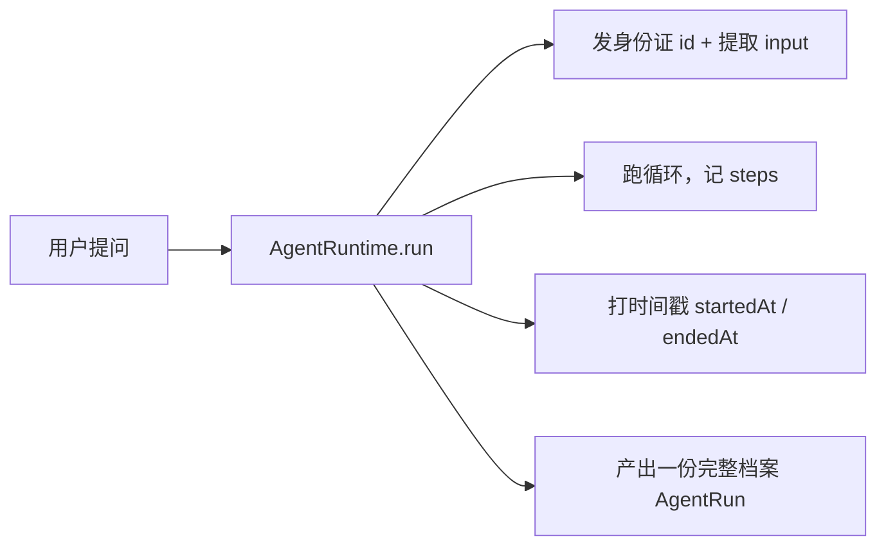

# 14 · Run

> <span class="stage-badge">Stage Hello Harness</span> · <span class="tag-badge">v14-run</span>


上一章我们有了 `AgentStep`——循环里每一步的时间线。但它还**没有相册**：`steps` 只是 `run()` 返回值里的一个字段，而「**这一次运行**」本身，依然是一个无名的瞬间。

这一章，给每一次运行发一张**身份证**：

```ts
export interface AgentRun {
  id: string;          // 身份证号
  input: string;       // 用户说了什么
  status: RunStatus;   // 结局：完成 / 失败 / 取消
  answer: string;      // 最终回答
  history: Message[];  // 对话历史
  steps: AgentStep[];  // 时间线
  startedAt: number;   // 几点开工
  endedAt: number;     // 几点收工
}
```

<!-- more -->

## 一、上一版存在什么问题？

12、13 章的 `run()` 返回的是 `AgentResult`——一张**没有名字的成绩单**：

```ts
{
  status: "completed",
  stopReason: "finished",
  answer: "42",
  history: [...],
  steps: [...],
  iterations: 2,
}
```

作为「一次运行的完整记录」，它有三处硬伤：

1. **没有身份**：它没有 `id`——想引用「昨天那次失败的运行」？没有名字可叫，只能把整个对象端在手里；
2. **没有来路**：它没有 `input`——运行结束，**用户当初问的是什么，只存在于调用方**的记忆里，run 自己说不清；
3. **没有时间**：没有 `startedAt` / `endedAt`——「这次跑了多久、几点跑的」无从谈起，审计和排障都缺时间轴。

> 一句话：`AgentResult` 是**现场的散落证据**，而我们要的是一份**装订成册、编好号、盖上时间戳的档案**。

## 二、本篇解决什么问题？

1. 引入 **`AgentRun`**：一次运行的**完整档案**，取代 `AgentResult`；
2. 给每次运行发 **`id`**（UUID）——可被引用、审计、持久化；
3. 记录 **`input`**（用户说了什么）与 **`startedAt` / `endedAt`**（什么时候干完的）。

至此，「一次运行」从一个**无名瞬间**，升格为一个**有身份的档案对象**。

解决完上面三件事，咱们回过头把这条线串一下：**上一章留下的「运行是无名瞬间、没法引用、说不清来路、没时间轴」这些遗留问题 → 这一章用「AgentRun 档案 + 系统发 id + 自带 input 与时间戳」解决掉 → 接下来看看我们到底得到了什么收获。**

### 解决之后，我们收获了什么？

- **运行可被引用**：`id` 让「昨天那次失败」有了称呼，审计、排查、后续修复都点得到名；
- **来路可追溯**：`input` 让档案自带「用户当初问的什么」，不用回头再问调用方；
- **时间可测量**：`startedAt` / `endedAt` 让耗时、时序成为档案的一部分；
- **身份、过程、结局一体**：一个 `AgentRun` 装下整段运行，持久化、跨进程传递、重放都只需这一个对象。

> 一句话收个尾：遗留的「无名瞬间」问题被这一章的抽象解决掉，换来的则是「可引用、可追溯、可测量、可携带」四笔实实在在的收获

## 三、先看最终效果

CLI 输出现在以一张「档案封面」开头：

```bash
$ pnpm dev -- --tools "6 乘 7 等于多少？"

> hello-harness@0.1.0 dev D:\Workspace\hui\project\hello-harness
> node --import tsx --env-file-if-exists=.env src/index.ts "--tools" "6 乘 7 等于多少？"

Run ID  : aa15f085-e56d-4470-80ce-49425aabaf09
Input   : 6 乘 7 等于多少？
Step 1 · model  → 完成回答
Step 2 · finish → finished
Answer  : 6 × 7 = 42。
Steps   : 1 轮 · 3 条消息 · 2 步 · 4040ms
Status  : completed (finished)
```

两次运行，**两张不同的身份证**：

```bash
$ node --env-file-if-exists=.env --import tsx -e "
import { AgentRuntime } from './src/runtime.ts';
import { createOpenAIModel } from './src/model/openai.ts';
import { ToolRegistry } from './src/tool/registry.ts';
import { calculator } from './src/tool/calculator.ts';
import { systemMessage, userMessage } from './src/messages.ts';

const registry = new ToolRegistry();
registry.register(calculator);
const runtime = new AgentRuntime(createOpenAIModel(), registry);

const a = await runtime.run({ messages: [systemMessage('你是助手'), userMessage('6 乘 7 等于多少？')] });
const b = await runtime.run({ messages: [systemMessage('你是助手'), userMessage('8 乘 8 等于多少？')] });
console.log('id 不同:', a.id !== b.id);          // → true
console.log('a 的问话:', a.input);                // → 6 乘 7 等于多少？
console.log('b 的问话:', b.input);                // → 8 乘 8 等于多少？
console.log('时间合理:', a.endedAt >= a.startedAt); // → true
"
```

注意：`run()` **不需要你传 id 和 input**——`id` 由 UUID 生成，`input` 从请求里自动提取。调用方只管提问，档案由系统来立。

## 四、架构变化

```text
src/
├── runtime.ts    # AgentResult → AgentRun（id/input/startedAt/endedAt 新增）
├── step.ts       # 不变
├── context.ts    # 不变
└── index.ts      # CLI：打印 Run ID / Input，耗时改用 run 自带时间戳
```




`run()` 的返回值从「成绩单」变成「档案」——**身份、来路、过程、结局、时间，一次配齐**。

老架构和新架构，小伙伴可以对照着看——同样跑完一圈，拿到的东西差出一套档案柜：

| 维度 | 上一版：`AgentResult` 成绩单 | 这一版：`AgentRun` 档案 |
| --- | --- | --- |
| 有名字吗 | 没有 `id`，想引用只能端着整个对象 | 有 UUID，可点名、可审计 |
| 来路清吗 | `input` 不存在，用户问啥只存在调用方记忆里 | `input` 自带，档案说清初衷 |
| 有时间轴吗 | 没有 `startedAt` / `endedAt` | 有，耗时时序可排障 |
| 能持久化/传递吗 | 散落的返回值，难归档 | 一个 `AgentRun` 对象，可存可取可重放 |
| 说法统一吗 | 还并存一份 `AgentResult` | `AgentResult` 并入，一套说法 |

一句话：以前是「现场散落的物证」，现在是「装订成册、编好号、盖时间戳的档案」。

> 注：`run()` 内部「发身份证 → 跑循环 → 打时间戳 → 产出档案」的顺序，正是规划里那张图——用户提问经 Runtime 变成一份完整 `AgentRun`。

## 五、核心抽象

在正式开始之前，我们依然先讲一下我们的思考过程，思考方式，同样是「先钉需求、再拆角色、最后克制边界」三步：

1. **钉需求**：12、13 章的 `AgentResult` 是张没名字的成绩单——不能引用、说不清来路、没时间轴。需求就一句：「给一次运行一个身份，让它能被人点名、能被归档」；
2. **拆角色**：把「运行」本身从返回值升级成对象 `AgentRun`；身份（`id`）、来路（`input`）、时间（`startedAt` / `endedAt`）这三样由**系统生成**，业务方完全不用操心；
3. **克制边界**：`id` 用标准 UUID 而非业务自编，`input` 从请求自动提取而非调用方传，**身份与来路在开工时就定下**——绝不跑完才补，否则来路就丢了、`id` 也没法在运行过程中被引用。

> **出发点小结**：我们不是「为加字段而加字段」，而是被「无名瞬间、无法引用、来路丢失、没有时间轴」四个真实痛点逼出来的。先教学、后抽象——先把「一次运行」这个档案对象立住，存储 / Session 那些大词后面再接。

下面把这份档案摊开看。

### AgentRun：一次运行的完整档案

| 字段 | 含义 | 谁来填 |
| --- | --- | --- |
| `id` | 唯一身份（UUID） | `run()` 自动生成 |
| `input` | 用户问了什么 | `run()` 从请求提取最后一条 user 消息 |
| `status` / `stopReason` | 结局与原因 | `run()` 收尾时填 |
| `answer` | 最终回答 | `run()` 收尾时填 |
| `history` | 对话历史 | `AgentContext` |
| `steps` | 时间线 | 每步落账 |
| `startedAt` / `endedAt` | 开工 / 收工 | `run()` 首尾各打一次 |

**重点关注**：**`id` 不是业务自己想的**，而是用 Node 自带的 UUID：

```ts
import { randomUUID } from "node:crypto";
const id = randomUUID();
```

**`input` 也不是调用方传的**，而是从请求里挖出来的——`run()` 自己认得出「哪条是用户的问题」：

```ts
const input = [...request.messages].reverse().find((m) => m.role === "user")?.content ?? "";
```

### run()：先立档案，再跑活

`run()` 的顺序很讲究——**身份与来路在开工时就定下**，而不是跑完才补：

```ts
async run(request: ModelRequest): Promise<AgentRun> {
  const context = new AgentContext(request.messages);
  const steps: AgentStep[] = [];
  const id = randomUUID();                              // 身份证，开工即发
  const input = /* 提取最后一条 user 消息 */;           // 来路，开工即记
  const startedAt = Date.now();                         // 打上班卡

  // ...循环照旧，跑一步记一步...

  return {
    id, input, /* ... */,
    startedAt,
    endedAt: Date.now(),                                // 收工前打下班卡
  };
}
```

`AgentResult` 退役：它的字段全部并入 `AgentRun`。**一份档案，不再有第二份并行的成绩单。**

## 六、实现代码

### AgentRun实现

**`src/runtime.ts`**——新类型与 run() 的变化：

```ts
import { randomUUID } from "node:crypto";
// ...

export interface AgentRun {
  id: string;
  input: string;
  status: RunStatus;
  stopReason: StopReason;
  answer: string;
  history: Message[];
  steps: AgentStep[];
  iterations: number;
  error?: string;
  startedAt: number;
  endedAt: number;
}

export class AgentRuntime {
  private readonly maxSteps: number;
  private readonly timeoutMs: number;
  private readonly signal?: AbortSignal;

  constructor(
    private readonly model: Model,
    private readonly registry: ToolRegistry,
    options: AgentRuntimeOptions = {},
  ) {
    this.maxSteps = options.maxSteps ?? 20;
    this.timeoutMs = options.timeoutMs ?? 120_000;
    this.signal = options.signal;
  }

  async run(request: ModelRequest): Promise<AgentRun> {
    const context = new AgentContext(request.messages);
    const steps: AgentStep[] = [];
    const id = randomUUID();
    const input = [...request.messages].reverse().find((m) => m.role === "user")?.content ?? "";
    const startedAt = Date.now();
    let iterations = 0;
    let lastText = "";

    const finish = (
      status: Exclude<RunStatus, "running">,
      stopReason: StopReason,
      extra: { answer?: string; error?: string } = {},
    ): AgentRun => {
      const answer = extra.answer ?? lastText;
      const error = extra.error;
      if (stopReason === "finished" || stopReason === "maxSteps") {
        steps.push({ type: "finish", stopReason, answer });
      } else {
        steps.push({ type: "error", stopReason, message: error ?? "" });
      }
      return {
        id,
        input,
        status,
        stopReason,
        answer,
        history: context.messages,
        steps,
        iterations,
        startedAt,
        endedAt: Date.now(),
        ...(error ? { error } : {}),
      };
    };

    while (true) {
      // 省略Agent循环，这块没有变更
    }
  }
}
```

### 应用侧适配

**`src/index.ts`**——CLI 认领档案：

```ts
const run = await runtime.run(request);
const elapsedMs = run.endedAt - run.startedAt;
console.log(`Run ID  : ${run.id}`);
console.log(`Input   : ${run.input}`);
// ...按 run.steps 打时间线...
```

## 七、运行 Demo

接下来进入正题，正确的使用姿势如下，小伙伴跟着跑两遍就懂了：

```bash
# 1. 看档案封面：Run ID + Input + 时间线
pnpm dev -- --tools "6 乘 7 等于多少？"

# 2. 两次运行，两张身份证，问话各自留底
node --env-file-if-exists=.env --import tsx -e "
import { AgentRuntime } from './src/runtime.ts';
import { createOpenAIModel } from './src/model/openai.ts';
import { ToolRegistry } from './src/tool/registry.ts';
import { calculator } from './src/tool/calculator.ts';
import { systemMessage, userMessage } from './src/messages.ts';
const registry = new ToolRegistry();
registry.register(calculator);
const runtime = new AgentRuntime(createOpenAIModel(), registry);
const a = await runtime.run({ messages: [systemMessage('你是助手'), userMessage('6 乘 7 等于多少？')] });
const b = await runtime.run({ messages: [systemMessage('你是助手'), userMessage('8 乘 8 等于多少？')] });
console.log('a:', a.id, a.input, a.answer.slice(0, 20));
console.log('b:', b.id, b.input, b.answer.slice(0, 20));
"
```


## 八、新架构解决了什么？

- **运行可被引用**：`id` 让「昨天那次失败」有了称呼——审计、排查、后续修复都点得到名；
- **来路可追溯**：`input` 让档案自带「用户当初问的什么」，不用再问调用方；
- **时间可测量**：`startedAt` / `endedAt` 让耗时、时序成为档案的一部分；
- **身份、过程、结局一体**：一个 `AgentRun` 装下整段运行，**持久化、跨进程传递、重放**都只需要这一个对象；
- **API 归一**：`AgentResult` 并入 `AgentRun`，不再有「成绩单」与「档案」两套说法。

## 九、它又引入了什么问题？

`AgentRun` 给每一次运行都发了身份证、盖了时间戳，可这份「档案」本身，又悄悄留下了哪些新坑？

- **档案只在内存里**：跑完 `AgentRun` 就丢进变量，**没有存储**——想事后翻旧档，门都没有；
- **input 只记最后一句**：多轮对话时只提取最后一条 user 消息，**完整来路**不忠实；
- **没有会话归属**：`AgentRun` 是孤儿，没挂在「谁发起、哪次会话」之下——**Session 还没登场**；
- **过程不可实时观察**：档案是**事后**才有的，运行**进行中**的每一步依然只能干等——Event 系统就在下一章；
- **没有事件与耗时细分**：每步 `steps` 里没有单独耗时/token，运行总时长有了、**分步开销**还是空白。

## 十、下一章

> **本章小结**：这一章给每一次运行发了一张身份证——`AgentRun` 取代 `AgentResult`，系统自动生成 `id`（UUID）、提取 `input`、打上 `startedAt` / `endedAt`，把身份、来路、过程、结局、时间一次配齐。`AgentResult` 退役并入，从此「一次运行」不再是无名瞬间，而是一个可引用、可追溯、可持久化、可重放的档案对象。

### 下章预告

**15 · Event System**——让运行过程从「事后翻档案」变成「**实时看直播**」：

```ts
runtime.on("model:start", ...);
runtime.on("model:end", ...);
runtime.on("tool:start", ...);
runtime.on("tool:end", ...);
runtime.on("step", ...);
```

记住一句话：

> **`AgentRun` 是运行结束后留下的档案，`AgentEvent` 是运行过程中发出的直播流。**

那么问题来了——`AgentRun` 是跑完才有的「事后档案」，可运行**进行中**的每一步还是只能干等，没法实时看见、也没法在出问题时立刻喊停，怎么把「事后翻档」升级成「实时看直播」？

欢迎点赞、关注公众号「一灰灰Blog」，下一章，咱们给 Runtime 装上广播能力 😊

---

微信公众号: 一灰灰Blog