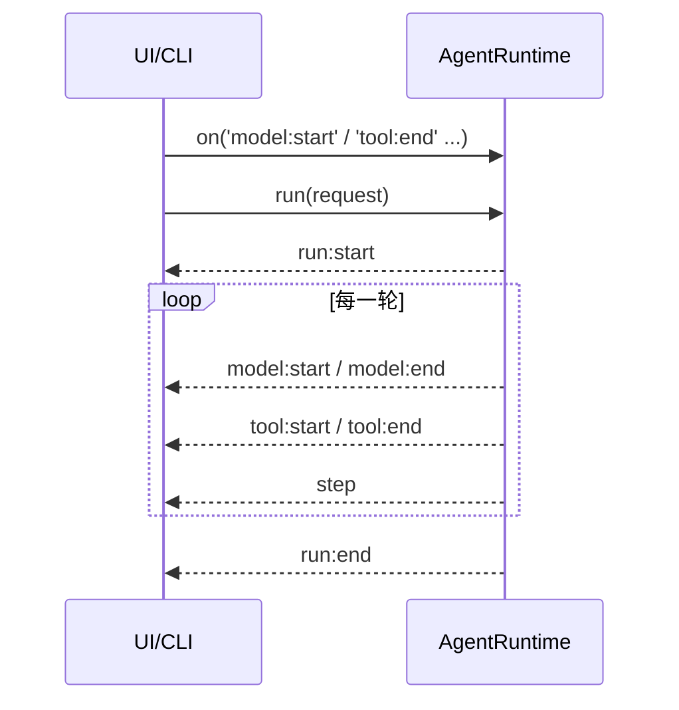

# 15 · Event System

> <span class="stage-badge">Stage Hello Harness</span> · <span class="tag-badge">v15-events</span>

上一章我们有了 `AgentRun`——运行结束后的一份完整档案。但档案有个天生的毛病：

**它是「事后」才有的。**

运行正在进行时，谁想看直播？没人。模型在思考的那几秒里，UI 只能干等。这一章，我们给 Runtime 装上一个**广播喇叭**：

```ts
runtime.on("run:start",  ...);   // 开工了
runtime.on("model:start", ...);  // 开始思考
runtime.on("model:end",   ...);  // 思考完了
runtime.on("tool:start",  ...);  // 开始动手
runtime.on("tool:end",    ...);  // 动手完毕
runtime.on("step",        ...);  // 又记了一步
runtime.on("run:end",     ...);  // 收工了
```

<!-- more -->

## 一、上一版存在什么问题？

13 章、14 章之后，CLI 是这么干活的：

```ts
const run = await runtime.run(request);   // 全程静默，跑完才返回
for (const step of run.steps) { ... }     // 然后才逐行打印
```

问题就藏在这两行之间：

1. **Runtime 和 UI 长在一起**：`run()` 只管闷头跑，UI 想要进度只能**等它回来翻档案**——运行期间屏幕一动不动；
2. **UI 想看过程 = 读完档再画**：所有 `steps` 是运行结束后才有，想「边跑边显示」根本做不到；
3. **Runtime 不知道谁在看它**：打印的职责其实混在调用方里，Runtime 对「有没有人观察我」一无所知——**它和观众是绑死的**；
4. **想加第二个观众**（比如一边打印、一边计 token、一边写日志）就得**再循环一遍 steps**——观众一多，代码就要复制。

> 一句话：现在的模型是 **「哑巴演出」**——演员（Runtime）台上演完，台下观众（UI）只能等散场后看录像。

## 二、本篇解决什么问题？

1. 定义一套 **`AgentEvent`**：运行全生命周期的广播消息；
2. 给 `AgentRuntime` 装上一个**小型事件发射器**：`on()` 订阅、`emit()` 广播；
3. 让 **Runtime 与 UI 彻底解耦**：Runtime 只负责「发出发生了什么」，观众（UI / 日志 / 监控）各订各的。

核心心智模型：

> **`AgentRun` 是运行结束后的档案，`AgentEvent` 是运行过程中的直播流。**

解决完上面三件事，咱们回过头把这条线串一下：**上一章留下的「运行进行中屏幕不动、Runtime 和 UI 绑死、加观众得复制代码」这些遗留问题 → 这一章用「AgentEvent 广播 + AgentEventEmitter 订阅 + Runtime 只喊不打印」解决掉 → 接下来看看我们到底得到了什么收获。**

### 解决之后，我们收获了什么？

- **运行可实时观察**：UI 能边跑边渲染，直播取代了录像回放；
- **Runtime 与 UI 解耦**：Runtime 一行打印代码都没有，加日志、加监控、加计费全是新增订阅者，不用改 Runtime；
- **一套事件无限观众**：同一个 `step` 事件，CLI 渲染、Eval 打分、审计记录各听各的，互不干扰；
- **类型安全的订阅**：订哪个事件，回调参数就自动收窄到那一支，不会拿到牛头不对马嘴的数据。

> 一句话收个尾：遗留的「哑巴演出」问题被这一章的抽象解决掉，换来的则是「实时、解耦、可扩展、类型安全」四笔实实在在的收获

## 三、先看最终效果

CLI 现在**边跑边打**——每个字都是事件实时驱动的：

```bash
$ pnpm dev -- --tools "6 乘 7 等于多少？"

> hello-harness@0.1.0 dev D:\Workspace\hui\project\hello-harness
> node --import tsx --env-file-if-exists=.env src/index.ts "--tools" "6 乘 7 等于多少？"

Run ID  : ab876c96-5343-4567-863e-92f7f867870b
Input   : 6 乘 7 等于多少？
Step 1 · model  → 调用工具：calculator
Step 2 · tool   → calculator({"expression":"6 * 7"}) = {"ok":true,"value":42}
Step 3 · model  → 完成回答
Step 4 · finish → finished
Answer  : 6 乘 7 等于 42。
Steps   : 2 轮 · 5 条消息 · 4 步 · 4976ms
Status  : completed (finished)
```

而你想听完整场「直播」？挂上全类型监听器：

```bash
$ node --env-file-if-exists=.env --import tsx -e "
import { AgentRuntime } from './src/runtime.ts';
import { createOpenAIModel } from './src/model/openai.ts';
import { ToolRegistry } from './src/tool/registry.ts';
import { calculator } from './src/tool/calculator.ts';
import { systemMessage, userMessage } from './src/messages.ts';

const registry = new ToolRegistry();
registry.register(calculator);
const runtime = new AgentRuntime(createOpenAIModel(), registry);

runtime.on('run:start', (e) => console.log('[run:start]', e.input));
runtime.on('model:start', () => console.log('[model:start] 思考中'));
runtime.on('model:end', (e) => console.log('[model:end]', e.durationMs + 'ms'));
runtime.on('tool:start', (e) => console.log('[tool:start]', e.call.name));
runtime.on('tool:end', (e) => console.log('[tool:end]', e.call.name, '=', JSON.stringify(e.result)));
runtime.on('run:end', (e) => console.log('[run:end]', e.status, e.stopReason));

await runtime.run({ messages: [systemMessage('你是助手'), userMessage('6 乘 7 等于多少？')] });
"
```

输出是一串**按真实时序滚动**的事件：

```text
[run:start] 6 乘 7 等于多少？
[model:start] 思考中
[model:end] 60ms
[tool:start] calculator
[tool:end] calculator = {"ok":true,"value":42}
[model:start] 思考中
[model:end] 6ms
[run:end] completed finished
```

Runtime 一行 `console.log` 都没有——**它只负责喊，听不听、怎么听，全在观众。**

## 四、架构变化

```text
src/
├── events.ts     # 扩展：AgentEvent 联合 + AgentEventEmitter（on/off/emit）
├── runtime.ts    # run() 每个节点发事件；暴露 on/off
├── step.ts       # 不变
└── index.ts      # CLI 改为订阅事件渲染（不再事后翻 steps）
```




**Runtime 不认识 UI，UI 也不认识 Runtime 的实现——它们只认识事件。**

老架构和新架构，小伙伴可以对照着看——同样是「让外面看见运行过程」，写法差出一套广播系统：

| 维度 | 上一版：哑巴演出 | 这一版：广播直播 |
| --- | --- | --- |
| 运行看得见吗 | 全程静默，跑完才翻档 | 边跑边广播，实时直播 |
| Runtime 与 UI | 绑死，打印混在调用方 | 解耦，Runtime 只喊、观众各订 |
| 加第二个观众 | 再循环一遍 `steps`，复制代码 | 多挂一个 `on`，不动 Runtime |
| 多任务串台吗 | 单 run 还好，多 run 难分 | 每条事件带 `runId`，分得清 |
| 订阅类型安全吗 | 拿到事件自己 `if` 判别 | `on` 按类型自动收窄 |

一句话：以前是「演员台上闷头演，观众散场看录像」；现在是「装了喇叭，谁想听自己订，还带字幕（类型）」。

> 注：Runtime 与观众之间只靠事件通信，正是规划里那张图——UI 订阅事件渲染、Runtime 只管 `emit`，双方互不知晓实现。

## 五、核心抽象

在看具体的设计实现之前，先把「怎么想到这么设计」摊开讲讲，我们的思考方式，还是「先钉需求、再拆角色、最后克制边界」三步：

1. **钉需求**：14 章的 `AgentRun` 是事后档案，运行进行中屏幕一动不动；Runtime 和 UI 绑死，想加第二个观众（日志、监控、计费）就得再循环一遍 `steps` 复制代码。需求就一句：「让运行过程能被实时观察，且 Runtime 不认识观众」；
2. **拆角色**：把「发生了什么」抽象成一套 `AgentEvent` 联合（全生命周期的广播消息）；用一个 `AgentEventEmitter`（`on` / `off` / `emit`）做类型安全的喇叭；Runtime 只负责 `emit`，观众只负责 `on`；
3. **克制边界**：不依赖 Node 自带 `EventEmitter`，自己写最小且类型安全的实现；每条事件都带 `runId` 以便多 run 分流；Runtime 内部零打印，观察职责完全外移给订阅者。

> **出发点小结**：我们不是「为解耦而解耦」，而是被「哑巴演出、观众绑死、加人复制代码」三个真实痛点逼出来的。
> 
> 依然沿用先教学、后抽象扩展的思路——这一章，我们先把「事件」这套广播机制立住，错误模型、事件总线那些大词后面再讲。

下面把这套广播机制摊开，瞅一瞅

### AgentEvent：一套广播消息

```ts
export type AgentEvent =
  | { type: "run:start";  runId: string; input: string }
  | { type: "model:start"; runId: string; request: ModelRequest }
  | { type: "model:end";   runId: string; response: ModelResponse; durationMs: number }
  | { type: "tool:start";  runId: string; call: ToolCall }
  | { type: "tool:end";    runId: string; call: ToolCall; result: ToolResult; durationMs: number }
  | { type: "step";        runId: string; step: AgentStep }
  | { type: "run:end";     runId: string; status: RunStatus; stopReason: StopReason; answer: string; durationMs: number };
```

| 事件 | 含义 | 典型观众 |
| --- | --- | --- |
| `run:start` | 开工，附来路 | CLI 打标题 |
| `model:start` / `model:end` | 思考开始/结束，附耗时 | 转圈动画 / 计费 |
| `tool:start` / `tool:end` | 动手开始/结束，附结果与耗时 | 进度条 / 审计 |
| `step` | 又记了一步（时间线） | 时间线渲染 / Eval |
| `run:end` | 收工，附结局 | 汇总统计 |

每条事件都带 `runId`——**一个 Runtime 同时跑多个 run，观众也能分清谁是谁**。

### AgentEventEmitter：一个会分类的小喇叭

不依赖 Node 的 EventEmitter，我们写一个**类型安全**的最小实现：

```ts
export class AgentEventEmitter {
  private readonly listeners = new Map<AgentEvent["type"], Listener[]>();

  on(type, listener) { /* 按类型登记观众 */ }
  off(type, listener) { /* 取消登记 */ }
  emit(event) { /* 按 event.type 喊一嗓子 */ }
}
```

**重点关注**：亮点在 `on` 的签名——**按类型自动收窄**：

```ts
runtime.on("tool:end", (e) => {
  // 这里 e 已经被收窄成 ToolEndEvent，直接用 e.call / e.result / e.durationMs
});
```

订阅 `"tool:end"`，回调里的 `e` 就**自动**是 `tool:end` 那一支，不用手动 `if` 判别。

### Runtime：装喇叭 + 主动喊

```ts
export class AgentRuntime {
  private readonly events = new AgentEventEmitter();

  on(type, listener) { this.events.on(type, listener); }
  off(type, listener) { this.events.off(type, listener); }

  async run(request) {
    this.events.emit({ type: "run:start", runId: id, input });
    // ...
    this.events.emit({ type: "model:start", runId: id, request });
    response = await this.model.generate(request);
    this.events.emit({ type: "model:end", runId: id, response, durationMs });
    // ...
    this.events.emit({ type: "tool:start", runId: id, call });
    result = await this.registry.execute(call);
    this.events.emit({ type: "tool:end", runId: id, call, result, durationMs });
    // ...
    this.events.emit({ type: "run:end", runId: id, status, stopReason, answer, durationMs });
  }
}
```

`run()` 的骨架没变——只是**在每个节点多喊一嗓子** 抛个事件出去。

## 六、实现代码

### Event事件定义

**`src/events.ts`**——事件联合 + 发射器：

```ts
import type { ModelRequest, ModelResponse, ToolCall } from "./model/types";
import type { ToolResult } from "./tool/tool";
import type { AgentStep } from "./step";
import type { RunStatus, StopReason } from "./runtime";

export type ModelEvent =
  | { type: "content"; text: string }
  | { type: "usage"; inputTokens: number; outputTokens: number };

export type AgentEvent =
  | { type: "run:start"; runId: string; input: string }
  | { type: "model:start"; runId: string; request: ModelRequest }
  | { type: "model:end"; runId: string; response: ModelResponse; durationMs: number }
  | { type: "tool:start"; runId: string; call: ToolCall }
  | { type: "tool:end"; runId: string; call: ToolCall; result: ToolResult; durationMs: number }
  | { type: "step"; runId: string; step: AgentStep }
  | { type: "run:end"; runId: string; status: RunStatus; stopReason: StopReason; answer: string; durationMs: number };

export type AgentEventListener = (event: AgentEvent) => void;

export class AgentEventEmitter {
  private readonly listeners = new Map<AgentEvent["type"], AgentEventListener[]>();

  on<T extends AgentEvent["type"]>(type: T, listener: (event: Extract<AgentEvent, { type: T }>) => void): void {
    const list = this.listeners.get(type) ?? [];
    list.push(listener as AgentEventListener);
    this.listeners.set(type, list);
  }

  off<T extends AgentEvent["type"]>(type: T, listener: (event: Extract<AgentEvent, { type: T }>) => void): void {
    const list = this.listeners.get(type);
    if (!list) return;
    this.listeners.set(type, list.filter((l) => l !== listener));
  }

  emit(event: AgentEvent): void {
    for (const listener of [...(this.listeners.get(event.type) ?? [])]) {
      listener(event);
    }
  }
}
```

> `on` 用 `Extract<AgentEvent, { type: T }>` 收窄回调参数类型，`emit` 时再 `as` 还原成 `AgentEventListener` 存库——**对外类型安全，对内统一处理**。

### AgentRuntime实现Event上报

**`src/runtime.ts`**——装喇叭 + 各节点喊话（节选）：


```ts
export class AgentRuntime {
  private readonly events = new AgentEventEmitter();

  on<T extends AgentEvent["type"]>(...) { this.events.on(type, listener); }
  off<T extends AgentEvent["type"]>(...) { this.events.off(type, listener); }

  async run(request) {
    this.events.emit({ type: "run:start", runId: id, input });
    // 模型前后
    this.events.emit({ type: "model:start", runId: id, request: modelRequest });
    response = await this.model.generate(modelRequest);
    this.events.emit({ type: "model:end", runId: id, response, durationMs });
    // 工具前后
    this.events.emit({ type: "tool:start", runId: id, call });
    result = await this.registry.execute(call);
    this.events.emit({ type: "tool:end", runId: id, call, result, durationMs });
    // 收尾
    this.events.emit({ type: "run:end", runId: id, status, stopReason, answer, durationMs });
  }
}
```

### 应用层适配

**`src/index.ts`**——CLI 从「翻档案」改为「听直播」：

```ts
async function runAgentDemo(model: Model, request: ModelRequest, options: { maxSteps?: number; timeoutMs?: number }) {
  const runtime = new AgentRuntime(model, registry, options);
  let stepCount = 0;

  // 1. 注册事件监听器
  runtime.on("run:start", (e) => {
    console.log(`Run ID  : ${e.runId}`);
    console.log(`Input   : ${e.input}`);
  });
  runtime.on("step", (e) => {
    stepCount += 1;
    const n = stepCount;
    const s = e.step;
    if (s.type === "model") {
      console.log(
        s.response.toolCalls.length > 0
          ? `Step ${n} · model  → 调用工具：${s.response.toolCalls.map((c) => c.name).join(", ")}`
          : `Step ${n} · model  → 完成回答`,
      );
    } else if (s.type === "tool") {
      console.log(`Step ${n} · tool   → ${s.call.name}(${JSON.stringify(s.call.arguments)}) = ${JSON.stringify(s.result)}`);
    } else if (s.type === "finish") {
      console.log(`Step ${n} · finish → ${s.stopReason}`);
    } else {
      console.log(`Step ${n} · error  → ${s.stopReason} ${s.message}`);
    }
  });

  // 开始agent执行调用
  const run = await runtime.run(request);

  // 结尾汇总仍可用 run 档案
  const elapsedMs = run.endedAt - run.startedAt;

  console.log(`Answer  : ${run.answer}`);
  console.log(`Steps   : ${run.iterations} 轮 · ${run.history.length} 条消息 · ${stepCount} 步 · ${elapsedMs}ms`);
  console.log(`Status  : ${run.status} (${run.stopReason})${run.error ? ` · ${run.error}` : ""}`);
}
```

## 七、运行 Demo

接下来进入正题，正确的使用姿势如下，小伙伴跟着跑两遍就懂了：

```bash
# 1. 事件驱动的实时 CLI
pnpm dev -- --tools "6 乘 7 等于多少？"
```


我们也可以直接写个demo，来验证下按需订阅事件

```bash
# 2. 全类型监听器直播一场运行
node --env-file-if-exists=.env --import tsx -e "
import { AgentRuntime } from './src/runtime.ts';
import { createOpenAIModel } from './src/model/openai.ts';
import { ToolRegistry } from './src/tool/registry.ts';
import { calculator } from './src/tool/calculator.ts';
import { systemMessage, userMessage } from './src/messages.ts';
const registry = new ToolRegistry();
registry.register(calculator);
const runtime = new AgentRuntime(createOpenAIModel(), registry);
runtime.on('model:start', () => process.stdout.write('\n ModelStart…'));
runtime.on('tool:end', (e) => console.log('\n ToolEnd: ' + e.call.name, '=', JSON.stringify(e.result)));
runtime.on('run:end', (e) => console.log('\n TotalEnd: ' + e.status, e.stopReason, e.durationMs + 'ms'));
await runtime.run({ messages: [systemMessage('你是一个简洁、直接的中文助手，工具可以使用时必须调用工具；'), userMessage('6 乘 七 再加上五等于多少？')] });
console.log('已经结束啦');
"
```


## 八、新架构解决了什么？

- **运行可实时观察**：UI 能边跑边渲染，思考时画转圈、工具时打进度——直播取代了录像回放；
- **Runtime 与 UI 解耦**：Runtime 一行打印代码都没有，观众再多也不改 Runtime——**加日志、加监控、加计费，全是新增订阅者**；
- **一套事件，无限观众**：同一个 `step` 事件，CLI 渲染、Eval 打分、审计记录各听各的，互不干扰；
- **按类型收窄的类型安全**：订阅哪个事件，回调参数就自动是哪一支，**不会拿到牛头不对马嘴的数据**；
- **runId 分流**：一个 Runtime 并发跑多个任务，事件流也不会串台。

## 九、它又引入了什么问题？

`AgentEvent` 给运行过程装上了实时直播，可这套「广播」本身，又悄悄埋下了哪些新坑？

- **事件有重复信息**：`model:end` 和 `step(model)` 都带着模型响应，`tool:end` 和 `step(tool)` 同理——**同一件事喊了两遍**；
- **谁在监听，Runtime 不知道**：观众订阅了但一直没 `off`，长期运行会**监听器越积越多**（内存隐患）；
- **广播是同步的**：`emit` 是同步 for 循环，一个监听器抛异常会**打断整条事件链**——错误隔离还没做；
- **没有事件总线**：事件只在 Runtime 内部广播，跨进程、跨模块（比如从工具层发事件）还做不到——**事件该属于谁**这个问题没解决；
- **事件与错误还没挂钩**：出错时只发 `run:end`，**错误本身的模型**（类型、可重试性）依然缺席——正是下一章。

## 十、下一章

> **本章小结**：这一章给 Runtime 装上了广播喇叭——`AgentEvent` 把「发生了什么」抽象成全生命周期的广播消息，`AgentEventEmitter` 提供类型安全的 `on` / `off` / `emit`，Runtime 从此只管「发出发生了什么」、零打印，观众（UI / 日志 / 监控）各订各的。我们立住了贯穿本章的心智模型：**AgentRun 是事后档案，AgentEvent 是实时直播流**。从此，运行过程从「哑巴演出」变成了「谁想听谁订阅」的解耦直播。

### 下章预告

**16 · Error Model**——给错误一个**类型与身份**，而不是一律 `throw`：

```ts
export type HarnessError =
  | ModelError | ToolError | RuntimeError | ContextError | PermissionError;
```

记住一句话：

> **错误不是「什么都没发生」，错误是一种有类型、有边界、可处理的正常状态。**

那么问题来了——事件让我们「看得见」运行过程了，可一旦出错，现在还只丢一句笼统的 `run:end`，错误本身既没有类型、也没有边界、更分不清能不能重试，怎么把「看得见」升级成「分得清」？

欢迎点赞、关注公众号「一灰灰Blog」，下一章，咱们给错误做一套完整的户籍制度 😊

---

微信公众号: 一灰灰Blog