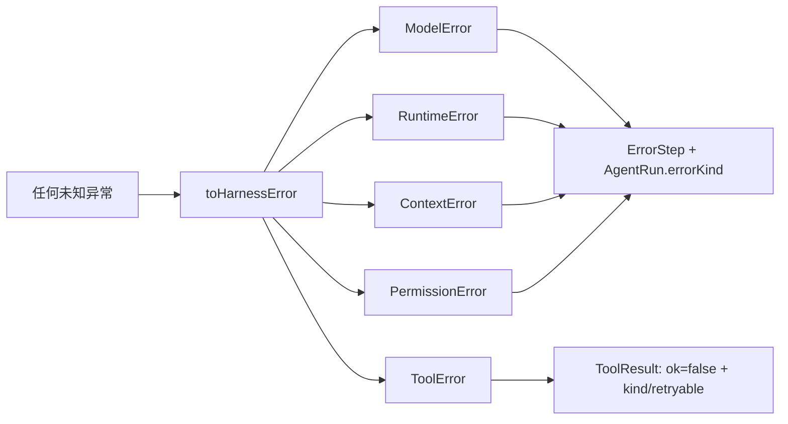

# 16 · Error Model

> <span class="stage-badge">Stage Hello Harness</span> · <span class="tag-badge">v16-errors</span>

前面十五章，我们一直在给 Agent「添砖加瓦」：工具、上下文、运行时、步骤、运行档案、事件直播……但有一个角落被我们一直当作「最后的稻草」——**错误**。

回想一下现在出错时是什么样：

```ts
catch (error) {
  return finish("failed", "failed", { error: errorMessage(error) });  // 一律 String(error)
}
```

一句「Connection error.」打天下。这一章，我们给错误做一套**户籍制度**：

```ts
export type HarnessError =
  | ModelError | ToolError | RuntimeError | ContextError | PermissionError;
```

<!-- more -->

## 一、上一版存在什么问题？

「不要直接 throw everything」——上一版恰恰在这么做。错误在系统里是**字符串泔水**：

1. **没有类型**：`AgentRun.error` 是一段 `string`，「Connection error.」和「超过超时上限」长得一样，程序**没法按类别处理**——想「遇到模型错误就重试」，代码只能去猜字符串；
2. **没有身份**：不知道它是 `instanceof` 什么，不知道它来自模型层还是运行时，**责任无从归属**；
3. **没有可重试性**：`Connection error.`（重试多半能好）和「表达式包含非法字符」（重试一百遍也一样），**没有字段区分**——重试策略无从谈起；
4. **没有边界**：工具抛的、模型抛的、超时触发的，全被 `try/catch` 拍成同一种 `errorMessage`——**连是谁闯的祸都分不清**。

> 一句话：错误是系统里**最有信息量的信号**，上一版却把它全部降维成了一段不知道从哪来的字符串。

## 二、本篇解决什么问题？

1. 定义 **`HarnessError`** 基类 + 五类错误：`ModelError` / `ToolError` / `RuntimeError` / `ContextError` / `PermissionError`；
2. 每个错误自带 **`kind`**（类别）与 **`retryable`**（是否值得重试）；
3. `AgentRuntime` 里所有 `String(error)` 换成**类型化包装**，错误带着「身份」进入 `ErrorStep` 和 `AgentRun`。

核心心智模型：

> **错误不是「什么都没发生」，错误是一种有类型、有边界、可处理的正常状态。**

解决完上面三件事，咱们回过头把这条线串一下：**上一章留下的「错误是字符串泔水、没类型、没身份、没法按类别处理」这些遗留问题 → 这一章用「HarnessError 基类 + 五类错误 + 自带 kind/retryable」解决掉 → 接下来我们展望一下，本文最终会得到了什么收获。**

### 解决之后，我们收获了什么？

- **错误可分类处理**：`kind` 让「模型错误重试、工具错误报警、权限错误提示」成为一行 `switch` 的事；
- **错误可重试判定**：`retryable` 直接喂给下一章的重试策略——能不能重试，错误自己说了算；
- **错误可追溯来源**：`instanceof ModelError` 一眼知道谁闯的祸，日志可分级；
- **错误可结构传输**：`ErrorStep.kind` + `AgentRun.errorKind` 让错误带着身份进入档案和事件流，Eval / UI / 监控都读得懂。

> 一句话收个尾：遗留的「错误降维成字符串」问题被这一章的抽象解决掉，换来的则是「可分类、可重试、可追溯、可传输」四笔实实在在的收获。

## 三、先看最终效果

模型调用失败时，错误有了**户籍**：

```bash
$ pnpm dev -- --tools "帮我算一下"        # 模拟网络故障

> hello-harness@0.1.0 dev D:\Workspace\hui\project\hello-harness
> node --import tsx --env-file-if-exists=.env src/index.ts "--tools" "帮我算一下"

Run ID  : 61f8aed8-bae2-4feb-a3df-a6e8a0c063fa
Input   : 帮我算一下
Step 1 · error  → model (failed) Request timed out.
Answer  :
Steps   : 1 轮 · 2 条消息 · 1 步 · 33691ms
Status  : failed (failed) · [model] Request timed out.
```

不开代理，直接访问OpenAI的大模型，我们必然就得到一个超时的异常；再比如我们把模型的ApiKey随便写，看看返回会是什么

```bash
$ pnpm dev -- --tools "帮我算一下"

> hello-harness@0.1.0 dev D:\Workspace\hui\project\hello-harness
> node --import tsx --env-file-if-exists=.env src/index.ts "--tools" "帮我算一下"

Run ID  : 180410be-5b7c-46f5-9004-42ad2f606387
Input   : 帮我算一下
Step 1 · error  → model (failed) 401 status code (no body)
Answer  :
Steps   : 1 轮 · 2 条消息 · 1 步 · 288ms
Status  : failed (failed) · [model] 401 status code (no body)
```


注意上面的 `Step 1 · error → **model** (failed) ...` 和结尾 `· [model] Request timed out.`——**类别跟着错误走**，基于这些清晰的异常响应，程序员或者CodingAgent可以更好的进行问题定位。


## 四、架构变化

```text
src/
├── errors.ts    # 新增：HarnessError 基类 + 5 类错误 + toHarnessError / errorMessage
├── runtime.ts   # finish 收 HarnessError；模型/超时/取消全部类型化包装
├── step.ts      # ErrorStep 增加 kind / retryable
├── tool/
│   ├── tool.ts      # ToolResult 失败分支携带 kind / retryable
│   └── registry.ts  # 工具抛异常 → toHarnessError(..., "tool") 收编
└── index.ts     # CLI 打印 errorKind；AgentRun.errorKind
```




**错误从「字符串」升格为「对象」**——系统从此对错误能 `instanceof`、能 `switch kind`、能看 `retryable`。

老架构和新架构，小伙伴可以对照着看看没，同样是「运行中出错」，系统拿到手的东西差出一套户籍：

| 维度 | 上一版：字符串泔水 | 这一版：户籍对象 |
| --- | --- | --- |
| 有类型吗 | 一段 `string`，`Connection error` 和超时长得一样 | `HarnessError`，`instanceof` / `switch kind` 分得清 |
| 能重试吗 | 只能猜字符串 | `retryable` 字段，错误自己说了算 |
| 责任归谁 | 不知道从哪来 | `instanceof` 知来源，日志可分级 |
| 能进档案/事件吗 | 只能塞 `message` 字符串 | `kind` / `retryable` 带身份进 `ErrorStep` 与 `AgentRun` |
| 外来异常 | 直接 `String(error)` 拍扁 | `toHarnessError` 按层收编，不二次套娃 |

一句话：以前是「所有错误一起降维成泔水字符串」，现在是「每种错误都有户口、带 `retryable`、能进档案」。

> 注：任何未知异常经 `toHarnessError` 收编成五类之一，再流向 `ErrorStep` 与 `AgentRun`

## 五、核心抽象

老规矩，先看为什么这么抽象设计，依据依然是「先钉需求、再拆角色、最后克制边界」三步：

1. **钉需求**：前面十五章的错误是字符串泔水——没类型、没身份、没可重试性、没边界，程序只能去猜。需求就一句：「让错误成为有类型、有边界、可处理的正常状态」；
2. **拆角色**：抽象一个 `HarnessError` 基类，派生出 `ModelError` / `ToolError` / `RuntimeError` / `ContextError` / `PermissionError` 五类；每个自带 `kind`（谁闯的祸）与 `retryable`（值不值得重试）；再用 `toHarnessError` 把外来的未知异常按层收编；
3. **克制边界**：不重写整条错误链，只给错误发「户口」；自己抛的 `HarnessError` 不二次套娃；`kind` 用受限联合，不随便加字段——先把分类立住，恢复动作留给下一章。

> **出发点小结**：我们不是「为造类型而造类型」，而是被「错误是系统里最有信息量的信号，却被一律降维成字符串」这个真实痛点逼出来的。这一章，我们先把错误的「户籍」立住，至于重试、退避这些高阶玩法，下一章再来。

下面把这套户籍制度摊开让你看个透彻

### HarnessError：错误的户口本

```ts
export type ErrorKind = "model" | "tool" | "runtime" | "context" | "permission";

export abstract class HarnessError extends Error {
  abstract readonly kind: ErrorKind;        // 类别：谁闯的祸
  abstract readonly retryable: boolean;     // 是否值得重试
}
```

| 错误 | 含义 | 谁产生的 | retryable |
| --- | --- | --- | --- |
| `ModelError` | 模型调用失败（网络、超时、坏格式） | `model.generate` 抛异常 | ✅ 网络抖一抖能好 |
| `ToolError` | 工具执行失败（未知工具、参数非法） | 工具逻辑 / Registry | ❌ 重试也白搭 |
| `RuntimeError` | 运行时失控（超时、步数爆炸、被取消） | `AgentRuntime` | ⚠️ 依情况 |
| `ContextError` | 上下文损坏（快照恢复失败等） | `AgentContext` | ❌ |
| `PermissionError` | 权限被拒（危险操作被 Gate 拦下） | Permission Gate | ❌ |

### toHarnessError：把散兵收编

运行时不知道外部会抛什么——**通通收编**：

```ts
export function toHarnessError(error: unknown, fallbackKind: ErrorKind = "runtime"): HarnessError {
  if (error instanceof HarnessError) return error;           // 已经是户籍内，直接放行
  const message = error instanceof Error ? error.message : String(error);
  switch (fallbackKind) {
    case "model":      return new ModelError(message);       // 在模型层接住 → 户口归 model
    case "tool":       return new ToolError(message);
    // ...
    default:           return new RuntimeError(message);
  }
}
```

**重点关注**：**关键的宽容**：已是我们自己抛的 `HarnessError`，原样返回，不再二次套娃。

### Runtime 的用法：各层各报各的户口

```ts
// 模型层：一律归 model
catch (error) {
  return finish("failed", "failed", { error: toHarnessError(error, "model") });
}
// 超时 / 取消：Runtime 自己直接造 RuntimeError
if (Date.now() - startedAt > this.timeoutMs) {
  return finish("failed", "timeout", { error: new RuntimeError(`超过超时上限 ${this.timeoutMs}ms`) });
}
```

`finish()` 把错误的 `kind` / `retryable` / `message` 落进 `ErrorStep`，并把 `errorKind` 写进 `AgentRun`：

```ts
type: "error", stopReason, kind: error.kind, retryable: error.retryable, message: error.message
// ...
error: error.message, errorKind: error.kind
```

### ToolRegistry 的用法：工具错误也上户口

`ToolError` 不是摆设——它接在**最容易被忽略的入口**：工具执行。工具抛的异常、以及「未知工具」这类 Registry 级错误，全部收编成 `ToolError` 并挂进 `ToolResult`：

```ts
async execute(call: ToolCall): Promise<ToolResult> {
  const tool = this.tools.get(call.name);
  if (!tool) {
    return { ok: false, error: `未知工具：${call.name}`, kind: "tool", retryable: false };
  }
  try {
    return await tool.execute(call.arguments);
  } catch (error) {
    const wrapped = toHarnessError(error, "tool");
    return { ok: false, error: wrapped.message, kind: wrapped.kind, retryable: wrapped.retryable };
  }
}
```

连工具自己「业务性地拒绝」（比如计算器算不了 `1+`）也要自报家门：

```ts
return { ok: false, error: `表达式非法：${expression}`, kind: "tool" as const, retryable: false };
```

> **为什么工具错误进 `ToolResult` 而不是 `ErrorStep`？** 工具出错通常是**可恢复的**——模型看到 `ok:false` 换个表达式再来一轮即可。所以工具错误走「结果级」通道（`ToolResult.ok=false`），不进终局 `ErrorStep`；只有模型/运行时这种**致命错误**才会终止整场运行。一个错误是「正常状态」还是「事故」，由它对流程的**影响**决定，这正是户籍制度的意义。

## 六、实现代码

### 异常定义

**`src/errors.ts`**：

```ts
export type ErrorKind = "model" | "tool" | "runtime" | "context" | "permission";

export abstract class HarnessError extends Error {
  abstract readonly kind: ErrorKind;
  abstract readonly retryable: boolean;

  constructor(message: string) {
    super(message);
    this.name = new.target.name;   // 让 Error.name 显示成 ModelError 而不是 Error
  }
}

export class ModelError extends HarnessError {
  readonly kind: ErrorKind = "model";
  readonly retryable: boolean = true;
}
export class ToolError extends HarnessError {
  readonly kind: ErrorKind = "tool";
  readonly retryable: boolean = false;
}
export class RuntimeError extends HarnessError {
  readonly kind: ErrorKind = "runtime";
  readonly retryable: boolean = true;
}
export class ContextError extends HarnessError {
  readonly kind: ErrorKind = "context";
  readonly retryable: boolean = false;
}
export class PermissionError extends HarnessError {
  readonly kind: ErrorKind = "permission";
  readonly retryable: boolean = false;
}

export function toHarnessError(error: unknown, fallbackKind: ErrorKind = "runtime"): HarnessError {
  if (error instanceof HarnessError) return error;
  const message = error instanceof Error ? error.message : String(error);
  switch (fallbackKind) {
    case "model":      return new ModelError(message);
    case "tool":       return new ToolError(message);
    case "context":    return new ContextError(message);
    case "permission": return new PermissionError(message);
    default:           return new RuntimeError(message);
  }
}
```

> 小细节：`new.target.name` 让 `ModelError.name === "ModelError"`，`console.log` 与日志里一眼认出户口。

### ErrorStep扩展

**`src/step.ts`**——`ErrorStep` 上户口：

```ts
export interface ErrorStep {
  type: "error";
  stopReason: StopReason;
  kind: ErrorKind;        // 新增
  retryable: boolean;     // 新增
  message: string;
}
```

### AgentRuntime集成异常

**`src/runtime.ts`**——三处类型化：

```ts
async run(request: ModelRequest): Promise<AgentRun> {
    const context = new AgentContext(request.messages);
    const steps: AgentStep[] = [];
    const id = randomUUID();
    const input = [...request.messages].reverse().find((m) => m.role === "user")?.content ?? "";
    const startedAt = Date.now();
    let iterations = 0;
    let lastText = "";

    const finish = (
      status: Exclude<RunStatus, "running">,
      stopReason: StopReason,
      extra: { answer?: string; error?: HarnessError } = {},
    ): AgentRun => {
      const answer = extra.answer ?? lastText;
      const error = extra.error;
      const terminal: AgentStep =
        stopReason === "finished" || stopReason === "maxSteps"
          ? { type: "finish", stopReason, answer }
          : {
              type: "error",
              stopReason,
              kind: error?.kind ?? "runtime",
              retryable: error?.retryable ?? false,
              message: error?.message ?? "",
            };
      steps.push(terminal);
      this.events.emit({ type: "step", runId: id, step: terminal });
      const endedAt = Date.now();
      this.events.emit({ type: "run:end", runId: id, status, stopReason, answer, durationMs: endedAt - startedAt });
      return {
        id,
        input,
        status,
        stopReason,
        answer,
        history: context.messages,
        steps,
        iterations,
        startedAt,
        endedAt,
        ...(error ? { error: error.message, errorKind: error.kind } : {}),
      };
    };

    this.events.emit({ type: "run:start", runId: id, input });

    while (true) {
      iterations += 1;

      if (this.signal?.aborted) {
        return finish("aborted", "aborted", { error: new RuntimeError("任务已被取消") });
      }
      if (iterations > this.maxSteps) {
        return finish("completed", "maxSteps");
      }
      if (Date.now() - startedAt > this.timeoutMs) {
        return finish("failed", "timeout", { error: new RuntimeError(`超过超时上限 ${this.timeoutMs}ms`) });
      }

      let response: ModelResponse;
      const tools = this.registry.list();
      const modelRequest = { messages: context.messages, tools };
      this.events.emit({ type: "model:start", runId: id, request: modelRequest });
      const modelStartedAt = Date.now();
      try {
        response = await this.model.generate(modelRequest);
      } catch (error) {
        return finish("failed", "failed", { error: toHarnessError(error, "model") });
      }
      // ... 省略工具执行
    }
  }

```

虽然上面的代码较长，但核心的其实就下面三行

```ts
// 取消 / 超时 / 模型失败，全走 HarnessError
{ error: new RuntimeError("任务已被取消") }
{ error: new RuntimeError(`超过超时上限 ${this.timeoutMs}ms`) }
{ error: toHarnessError(error, "model") }
```

### ToolRegistry集成工具错误

**`src/tool/tool.ts`**——`ToolResult` 失败分支带户口：

```ts
export type ToolResult =
  | { ok: true; value: unknown }
  | { ok: false; error: string; kind: ErrorKind; retryable: boolean };
```

**`src/tool/registry.ts`**——抛异常的按 `tool` 层收编，未知工具直接给户口：

```ts
async execute(call: ToolCall): Promise<ToolResult> {
  const tool = this.tools.get(call.name);
  if (!tool) {
    return { ok: false, error: `未知工具：${call.name}`, kind: "tool", retryable: false };
  }
  try {
    return await tool.execute(call.arguments);
  } catch (error) {
    const wrapped = toHarnessError(error, "tool");
    return { ok: false, error: wrapped.message, kind: wrapped.kind, retryable: wrapped.retryable };
  }
}
```

**`src/tool/calculator.ts`**——业务性拒绝也自报家门：

```ts
if (typeof expression !== "string" || expression.trim() === "") {
  return { ok: false, error: "参数 expression 必须是字符串", kind: "tool" as const, retryable: false };
}
```

## 七、运行 Demo

接下来进入正题，正确的使用姿势如下，小伙伴跟着跑两遍就懂了：

```bash
# 1. 看「有户口的错误」长什么样（模拟网络故障时）
pnpm dev -- --tools "帮我算一下"          # Step 1 · error → model ...
```


```bash
# 2. 看工具错误上户口（未知工具 / 表达式非法）
pnpm dev -- --tools "算 1/0"       # Step 2 · tool → 工具执行异常
pnpm dev -- --timeout 5 --tools "算 1/2"              # Step 3 · tool → 工具虽然执行成功，但是整个响应超时
```


```bash
# 3. 看抛异常的工具被 Registry 收编成 ToolError
node --import tsx -e "
import { ToolRegistry } from './src/tool/registry.ts';
const registry = new ToolRegistry();
registry.register({
  name: 'boom', description: '必炸',
  parameters: { type: 'object', properties: {}, required: [] },
  execute: async () => { throw new Error('工具内部炸了'); },
});
const result = await registry.execute({ id: '1', name: 'boom', arguments: {} });
console.log(result);                       // { ok: false, error: '工具内部炸了', kind: 'tool', retryable: false }
"

# 4. 户口本总览
node --import tsx -e "
import { ModelError, ToolError, RuntimeError, ContextError, PermissionError, toHarnessError, HarnessError } from './src/errors.ts';
const all = [new ModelError('网络超时'), new ToolError('非法参数'), new RuntimeError('超时'), new ContextError('快照损坏'), new PermissionError('权限不足')];
for (const e of all) console.log(e.name.padEnd(14), e.kind.padEnd(10), 'retryable=' + e.retryable, '|', e.message);
"
```

## 八、新架构解决了什么？

- **错误可分类处理**：`kind` 让「模型错误重试、工具错误报警、权限错误提示用户」成为一行 `switch` 的事；
- **错误可重试判定**：`retryable` 直接喂给下一章的重试策略——**能不能重试，错误自己说了算**；
- **错误可追溯来源**：`instanceof ModelError` 一眼知道谁闯的祸，日志可分级；
- **错误可结构传输**：`ErrorStep.kind` + `AgentRun.errorKind` + `ToolResult.kind` 让错误**带着身份进入档案、结果和事件流**，Eval / UI / 监控都能读懂；
- **宽容的包装边界**：已是我们自己的 `HarnessError` 不二次套娃，外来异常按层归口；
- **工具错误不再裸奔**：工具抛异常被 `toHarnessError(..., "tool")` 收编进 `ToolResult`，连计算器这种业务性拒绝也自报 `kind`——工具层错误从此有户口。

## 九、它又引入了什么问题？

`HarnessError` 给每种错误都发了户口本、标了 `retryable`，可这套「户籍制度」本身，又悄悄留下了哪些新坑？

- **错误还只是「状态标签」**：`kind` 是字符串，没挂上**恢复动作**——「遇到 ModelError 重试几次」的逻辑还没写（17 章的事）；
- **PermissionError 还是空壳**：AGENTS.md 反复强调的 Permission Gate **一个都没实现**，PermissionError 只是先立了个户口；
- **ContextError 同样没触发点**：快照恢复这类操作还没有真正可能失败的地方，ContextError 有户无人；
- **工具错误仍是「结果级」**：工具出问题只进 `ToolResult.ok=false`，**不中断循环、不产生 `ErrorStep`**——「工具连续失败该怎么收场」还没想清楚，重试/上限要下一章补；
- **没有错误码与重试预算**：没有稳定的 `code`（如 `MODEL_TIMEOUT`），重试次数、退避策略也未定义——错误模型还差「下半身」。

## 十、下一章

> **本章小结**：这一章给错误做了一套户籍制度——`HarnessError` 基类派生出 `ModelError` / `ToolError` / `RuntimeError` / `ContextError` / `PermissionError` 五类，每个自带 `kind`（谁闯的祸）与 `retryable`（值不值得重试）；`toHarnessError` 把外来的未知异常按层收编、且对自己人不再二次套娃。我们立住了贯穿本章的心智模型：**错误是一种有类型、有边界、可处理的正常状态**。从此，错误从「统统 `String(error)` 的泔水」变成了带着身份、能进档案、能喂给重试策略的结构化对象。

### 下章预告

**17 · Abort / Timeout / Retry**——把「停止三件套」系统化，接上 `retryable`：

```ts
runtime.on("abort", ...)      // 用户喊停
runtime.on("retry", ...)      // 自动重试
// Step timeout / Model retry / Tool timeout 齐上场
```

记住一句话：

> **错误模型负责「分类」，停止与重试负责「对策」。**

那么问题来了——错误虽然有了户口本、也标了 `retryable`，可「遇到重试一百遍也没用的工具错误就别重试」「用户喊停要立刻止住」「超过多久算超时」这些**对策本身**还没写，怎么把「分得清」升级成「治得好」？

下一章，咱们把 09 章那个「只能等一轮结束的取消」彻底治好 😊 ，欢迎点赞、关注公众号「一灰灰Blog」

---

微信公众号: 一灰灰Blog