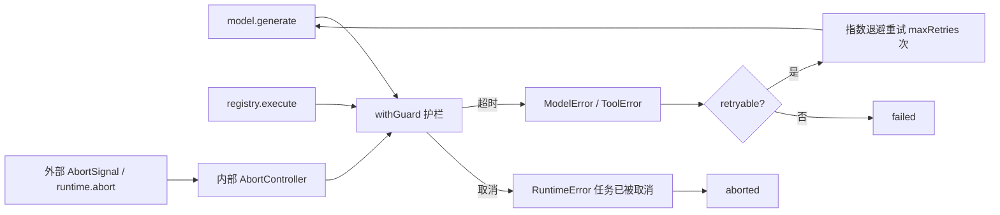

# 17 · Abort / Timeout / Retry

> <span class="stage-badge">Stage Hello Harness</span> · <span class="tag-badge">v17-abort</span>


上一章我们给错误发了户口本——`HarnessError` 五类、每个都带 `kind` 和 `retryable`。可光有户口本有什么用？**错误是「分类」了，可「对策」还没写。**

回顾一下现在的运行时：你叫一个 `AgentRuntime.run()`，它就开始一轮一轮地转——模型生成、调用工具、把结果喂回去……可这期间：

- 你想**中途喊停**？只有循环顶上一个 `signal?.aborted` 检查——可**正在执行的模型调用根本停不下来**，必须等这一轮整个跑完；
- 模型**一直挂着不返回**？整个 run 就这么无限等下去，没有单次调用的超时；
- 模型**抖一下**（网络波动）？`retryable=true` 的 `ModelError` 直接整场失败，明明重试一次就能好。

这一章，把「停止三件套」一次补齐：**Abort（中途打断）+ Timeout（单步护栏）+ Retry（自动重试）**。

<!-- more -->

## 一、上一版存在什么问题？

把 09 章的取消拉出来再看看，它长这样：

```ts
if (this.signal?.aborted) {
  return finish("aborted", "aborted", { error: new RuntimeError("任务已被取消") });
}
```

这是**循环顶上的事后检查**——问题很直接：

1. **取消是「轮询」不是「打断」**：一个循环里模型要算 30 秒、工具要跑 10 秒，这期间你 `abort()` 了，运行时**毫不知情**，直到整轮结束、下一轮开头才看到 `signal.aborted`。用户的感觉是「我按了取消，它还要跑完才停」；
2. **正在执行的调用无法打断**：`model.generate()` 和 `registry.execute()` 拿到手就是一个 Promise，外部没有任何机制能让它中途返回；
3. **没有单步超时**：整个 run 只有一个 `timeoutMs`（120s 总量），可**单个模型调用挂 5 分钟**，总量超时也拦不住——因为 `run()` 卡在 `await this.model.generate()` 里出不来；
4. **没有重试**：`ModelError` 标了 `retryable=true`，可 `run()` 一看到它就直接 `finish("failed", ...)`——「重试」这个 `retryable` 存在的意义，根本没用上；
5. **工具也没有超时**：工具是外部世界，网络、磁盘都可能挂起，可它和模型一样没有护栏。

> 一句话：**错误分类做完了，可系统对「正在发生的坏事」没有任何即时反应能力**——要么干等，要么整场报废。

## 二、本篇解决什么问题？

1. **AbortController 接管取消**：Runtime 内置 `AbortController`，对外暴露 `abort()`；外部传入的 `AbortSignal` 与内部控制器联动——**取消信号一到，正在执行的调用立刻被打断**；
2. **withGuard：单步护栏**：给每次模型调用、每次工具调用各套一个 `withGuard`（超时 + 取消的竞速封装）——**超时到点就拒绝，取消信号一到就拒绝**；
3. **模型自动重试**：接上 [ch16](./16-error-model) 的 `retryable`——模型错误可重试就指数退避重试 `maxRetries` 次，不可重试（或重试耗尽）才判失败；
4. **工具超时转结果**：工具超时不是把整场 run 打死，而是转成 `ToolResult.ok=false` 喂回给模型，让模型自己决定怎么办。

核心心智模型：

> **「停止」是一种需要主动守护的正常状态**——靠轮询永远追不上正在发生的坏事，要靠信号 + 护栏，让取消和超时能**主动打断**正在执行的 Promise。

解决完上面四件事，咱们回过头把这条线串一下：**上一章留下的「retryable 只是标签、取消只能轮询、无单步超时、模型抖动整场失败」这些遗留问题 → 这一章用「AbortController 即时打断 + withGuard 单步护栏 + 重试循环 + 工具超时降级」解决掉 → 接下来看看我们到底得到了什么收获。**

### 解决之后，我们收获了什么？

- **取消是即时打断**：`abort()` 一按，正在执行的模型/工具调用立刻被 `RuntimeError` 打断，不再干等本轮跑完；
- **单步有护栏**：模型、工具各套 `withGuard` 超时，一个挂起不再卡死全场；
- **`retryable` 第一次有用**：模型抖一下指数退避自动重试，用户几乎无感；
- **工具超时不连坐**：超时只是 `ToolResult.ok=false` 喂回模型，局部失败不引爆全局。

> 一句话收个尾：遗留的「对正在发生的坏事毫无反应」问题被这一章的抽象解决掉，换来的则是「可即时打断、可单步护栏、可自动重试、可局部降级」四笔实实在在的收获。

## 三、先看最终效果

三个场景，一个演示脚本全部跑给你看：

```bash
$ node --import tsx examples/stage-2/17-abort-timeout-retry/demo.mts

=== 1. 模型重试：第一次抛 ModelError，第二次成功 ===
  [model:retry] 第 1 次重试：网络抖了一下
  status=completed (finished) answer=重试后成功

=== 2. 工具超时：工具睡 200ms，toolTimeoutMs=50 ===
  status=completed (finished) tool={"ok":false,"error":"工具 slow 执行超时（50ms）","kind":"tool","retryable":false}

=== 3. 中途取消：工具永不返回，100ms 后 abort() ===
  status=aborted (aborted) error=任务已被取消 elapsed=108ms
```

- 场景 1：模型第一次调用抛 `ModelError`，**自动重试**一次后成功，全程 `[model:retry]` 事件直播；
- 场景 2：工具睡 200ms 但 `toolTimeoutMs=50`，50ms 一到立即被判超时，转成 `[tool]` 结果——**run 没死，继续跑完**；
- 场景 3：工具永不返回，但 100ms 后 `abort()`——**107ms 内整场 run 干净结束**，没有等那个永不返回的工具。

## 四、架构变化

```text
src/
├── runtime.ts   # + withGuard（超时/取消护栏）、generate() 重试循环、abort()、模型/工具单步超时
├── events.ts    # AgentEvent + model:retry
└── index.ts     # SIGINT → runtime.abort()；打印 model:retry；新增 --model-timeout/--tool-timeout/--retries

examples/
└── stage-2/17-abort-timeout-retry/demo.mts   # 三场景演示
```




关键变化一句话：**取消从「循环顶上的轮询」变成了「信号驱动的即时打断」；超时从「整场总量」细化到了「每一步的单次护栏」；`retryable` 从「标签」变成了「真的会重试的循环」**。

老架构和新架构，小伙伴可以对照着看——同样是「运行中出了坏事」，系统的反应速度差出一条街：

| 维度 | 上一版：干等或整场报废 | 这一版：即时打断 + 护栏 |
| --- | --- | --- |
| 中途喊停 | 只能等本轮跑完（循环顶轮询） | `abort()` 立刻打断正在执行的调用 |
| 单步挂起 | 无单步超时，一个挂起卡死全场 | 模型/工具各有 `withGuard` 护栏 |
| 模型抖动 | `retryable` 标了却整场失败 | 指数退避自动重试 |
| 工具超时 | 无护栏 | 转 `ToolResult.ok=false`，不连坐 |
| 错误分得清吗 | 取消与超时混为一谈 | 不同错误类型，分得清「它不行」还是「我喊停」 |

一句话：以前是「要么干等、要么整场报废」；现在是「信号即时打断、单步有护栏、抖动能自愈」。

> 注：取消信号经内部 `AbortController` 联动所有 `withGuard`，再按 `retryable` 决定重试还是失败，正是上面这张「信号 → 护栏 → 重试/失败」的图。

## 五、核心抽象

按照老规矩，要想实现上面的设计我们应该怎么做。

首先还是按照「先钉需求、再拆角色、最后克制边界」进行任务拆解：

1. **钉需求**：16 章的 `retryable` 只是个标签、09 章的取消只能轮询、整场没有单步超时、模型抖一下就整场失败。需求就一句：「让系统对正在发生的坏事有即时反应能力」；
2. **拆角色**：用 `AbortController` 做唯一权威信号源；用 `withGuard` 做「正常 / 超时 / 取消」三路竞速护栏；把 `generate()` 包成重试循环，让 `retryable` 第一次真正生效；工具超时则降级成结果而非整场失败；
3. **克制边界**：不动 `model` 接口也能加护栏（只是「不等它了」）；**取消绝不重试**、`retryable` 为假绝不重试、退避指数增长——三条铁律把「什么时候该再试一次」钉死，避免重试风暴踩死脆弱服务。

> **出发点小结**：我们不是「为加能力而加能力」，而是被「干等、整场报废、抖动即失败」三个真实痛点逼出来的。先教学、后抽象——先把「停止三件套」这套对策立住，并发运行那些大词后面再接。

下面把这套护栏机制摊开看。

### withGuard：单步护栏（超时 + 取消竞速）

一次模型调用、一次工具调用，本质都是「拿一个 Promise，等它出结果」。护栏就是**同时盯三件事**：正常返回、超时到点、取消信号。谁先来，谁生效：

```ts
export function withGuard<T>(
  promise: Promise<T>,
  timeoutMs: number,
  signal: AbortSignal,
  makeTimeoutError: () => HarnessError,
): Promise<T> {
  return new Promise<T>((resolve, reject) => {
    if (signal.aborted) {
      reject(new RuntimeError("任务已被取消"));
      return;
    }
    let settled = false;                       // 三路竞速，只允许一个赢家
    const onAbort = () => {                    // 取消 → 立即拒绝
      if (settled) return;
      settled = true;
      clearTimeout(timer);
      reject(new RuntimeError("任务已被取消"));
    };
    const timer = setTimeout(() => {           // 超时 → 按调用方给的错误拒绝
      if (settled) return;
      settled = true;
      signal.removeEventListener("abort", onAbort);
      reject(makeTimeoutError());
    }, timeoutMs);
    signal.addEventListener("abort", onAbort, { once: true });
    promise.then(
      (value) => { /* 正常返回：清掉计时器与监听，放行 */ },
      (error) => { /* 原样透传下层错误 */ },
    );
  });
}
```

**两个细节值得记住**：`settled` 保证三路竞速**只有一个赢家**（底层 Promise 可能慢半拍，不能让它再打扰上层）；超时与取消用**不同的错误类型**（`ModelError`/`ToolError` vs `RuntimeError("任务已被取消")`），让上层能区分「它不行了」和「我喊停了」。

### Runtime：一个控制器，多个护栏入口

```ts
private readonly controller = new AbortController();
private readonly signal = this.controller.signal;

constructor(...) {
  options.signal?.addEventListener("abort", () => this.abort(), { once: true });  // 外部信号联动内部
}

abort(): void { this.controller.abort(); }     // 对外喊停入口
```

- 内部 `controller` 是**唯一的权威信号源**；外部 `AbortSignal`（比如 CLI 的 SIGINT）只是**把它也按下去**；
- 所有 `withGuard` 共用同一个 `this.signal`——**喊一次停，模型和工具一起被中断**。

### generate()：重试循环

模型调用被包成一个「失败就重试」的循环，`retryable` 在这里第一次有了用武之地：

```ts
private async generate(request: ModelRequest): Promise<ModelResponse> {
  let attempt = 0;
  for (;;) {
    attempt += 1;
    try {
      return await withGuard(this.model.generate(request), this.modelTimeoutMs, this.signal,
        () => new ModelError(`模型调用超时（${this.modelTimeoutMs}ms）`));
    } catch (error) {
      if (this.signal.aborted) throw new RuntimeError("任务已被取消");   // 取消绝不重试
      const wrapped = toHarnessError(error, "model");
      if (wrapped.retryable && attempt <= this.maxRetries) {
        const delay = this.retryBaseMs * 2 ** (attempt - 1);            // 指数退避
        this.events.emit({ type: "model:retry", runId: ..., attempt, error: wrapped.message });
        await new Promise((resolve) => setTimeout(resolve, delay));
        continue;
      }
      throw wrapped;
    }
  }
}
```

**重点关注** **三条铁律**：

- 取消**绝不重试**（用户都喊停了还重试什么）；
- `retryable` 为false**绝不重试**（工具参数错了重试一百遍也一样）；
- 退避**指数增长**（`200ms → 400ms → 800ms`，别给已经喘不过气的服务火上浇油）。

## 六、实现代码

### 新增事件：model:retry

**`src/events.ts`**：

```ts
export type AgentEvent =
  | { type: "run:start"; runId: string; input: string }
  | { type: "model:start"; runId: string; request: ModelRequest }
  | { type: "model:end"; runId: string; response: ModelResponse; durationMs: number }
  | { type: "model:retry"; runId: string; attempt: number; error: string }   // 新增
  | { type: "tool:start"; runId: string; call: ToolCall }
  | { type: "tool:end"; runId: string; call: ToolCall; result: ToolResult; durationMs: number }
  | { type: "step"; runId: string; step: AgentStep }
  | { type: "run:end"; runId: string; status: RunStatus; stopReason: StopReason; answer: string; durationMs: number };
```

### 运行时：选项与护栏

**`src/runtime.ts`**——新选项：

```ts
export interface AgentRuntimeOptions {
  maxSteps?: number;
  timeoutMs?: number;          // 整场运行总量（已有）
  modelTimeoutMs?: number;     // 单次模型调用超时，默认 60_000
  toolTimeoutMs?: number;      // 单次工具调用超时，默认 30_000
  maxRetries?: number;         // 模型重试次数，默认 2
  retryBaseMs?: number;        // 重试退避基数，默认 200
  signal?: AbortSignal;        // 外部取消信号
}
```

构造函数与 `abort()`（见上文核心抽象）。

**`run()` 里的两个护栏接入点**——模型：

```ts
try {
  response = await this.generate(modelRequest);       // 内部自带重试
} catch (error) {
  if (this.signal.aborted) {
    return finish("aborted", "aborted", { error: new RuntimeError("任务已被取消") });
  }
  return finish("failed", "failed", { error: toHarnessError(error, "model") });
}
```

工具——超时转结果，不打死 run：

```ts
for (const call of response.toolCalls) {
  this.events.emit({ type: "tool:start", runId: id, call });
  const toolStartedAt = Date.now();
  let result: ToolResult;
  try {
    // 工具执行使用 withGuard 进行包装
    result = await withGuard(
      this.registry.execute(call),
      this.toolTimeoutMs,
      this.signal,
      () => new ToolError(`工具 ${call.name} 执行超时（${this.toolTimeoutMs}ms）`),
    );
  } catch (error) {
    if (this.signal.aborted) {
      return finish("aborted", "aborted", { error: new RuntimeError("任务已被取消") });
    }
    const wrapped = toHarnessError(error, "tool");
    result = { ok: false, error: wrapped.message, kind: wrapped.kind, retryable: wrapped.retryable };
  }
  this.events.emit({ type: "tool:end", runId: id, call, result, durationMs: Date.now() - toolStartedAt });
  const toolStep: AgentStep = { type: "tool", call, result };
  steps.push(toolStep);
  this.events.emit({ type: "step", runId: id, step: toolStep });
  context.add(toolMessage(call.id, JSON.stringify(result) ?? ""));
}
```

### CLI：Ctrl+C 真的能打断

**`src/index.ts`**——SIGINT 联动 `runtime.abort()`，订阅重试事件：

```ts
process.once("SIGINT", () => {
  console.log("收到 Ctrl+C，正在取消运行…");
  runtime.abort();
});

runtime.on("model:retry", (e) => {
  retryCount += 1;
  console.log(`Retry   : 第 ${e.attempt} 次重试（已重试 ${retryCount} 次）：${e.error}`);
});
```

## 七、运行 Demo

接下来进入正题，正确的使用姿势如下，小伙伴跟着跑两遍就懂了：

### 一跑：三场景演示（推荐）

```bash
node --import tsx examples/stage-2/17-abort-timeout-retry/demo.mts
```

### 二跑：CLI 真机体验

```bash
# 模型重试：把重试次数调成 3，网络波动时看 Retry 行
pnpm dev -- --tools --retries 3 "帮我算 17 * 38"

# 单步超时：把工具超时调小，慢工具会以 [tool] 超时结果喂回模型 （请根据实际情况调整这个超时时间用于效果模拟）
pnpm dev -- --tools --tool-timeout 100 "帮我算 17 * 38"
```


```bash
# Ctrl+C 中途打断：运行中按 Ctrl+C，观察「正在取消运行…」并立即 aborted
pnpm dev -- "我想从0到1搭建一个harness，请帮我设计一套完整的方案"
```


## 八、新架构解决了什么？

- **取消是即时打断，不是轮询**：`abort()` 一按，`withGuard` 里正在进行的模型/工具调用立刻被 `RuntimeError` 打断，107ms 就收场——09 章那个「只能等一轮结束的取消」彻底治好；
- **单步超时挡住单次挂起**：模型超时归 `ModelError`、工具超时归 `ToolError`，**每步都有护栏**，不再一个挂起卡死全场；
- **`retryable` 第一次有用了**：模型抖一下会指数退避自动重试，退避节奏是 `200ms → 400ms → 800ms`，用户无感；
- **工具超时不连坐**：工具超时只是 `ToolResult.ok=false`，模型看到还能换个姿势再试——**局部失败不引爆全局**；
- **重试可观测**：`model:retry` 事件把「第几次、什么错」直播出来，CLI 打印 `Retry   : 第 1 次重试 ...`；
- **一个信号源，处处联动**：`runtime.abort()` 与外部 `AbortSignal` 都通向同一个内部控制器，全链路同步打断。

## 九、它又引入了什么问题？

「停止三件套」让系统对正在发生的坏事有了即时反应，可这套「护栏 + 重试」本身，又悄悄留下了哪些新坑？

- **底层 Promise 没有真正取消**：`withGuard` 只是「不等它了」，被超时/取消判负的模型调用**还在后台继续跑**（资源悄悄漏着），真正取消要等 Model 层支持 `AbortSignal`——这需要动 `model/generate` 的接口；
- **重试只管模型，不管工具**：工具超时只转 `ok:false`，没有工具级自动重试——「读文件读到一半网络断了」这种场景，重试策略还是空的；
- **整场超时只在循环顶检查**：`timeoutMs` 是「轮与轮之间」的事后检查，真正的总量保护得靠每步护栏凑——若某步挂起刚好卡在护栏内，整场时间会超过 `timeoutMs`；
- **没有退避上限与抖动**：指数退避到 3 次就 `800ms`，再大就得加**上限 + 随机抖动**，否则重试风暴会踩死脆弱的服务；
- **没有 abort 事件**：取消只有结果（`run:end` with `aborted`），中途没有「已取消」事件，UI 要等 `run()` 返回才知道——对流式 UI 不够友好；
- **`model:retry` 的 runId 是「当前活动运行」**：`activeRunId` 字段保证同一时刻只有一个运行——一旦支持并发运行，这个共享字段就会串号（这正是 Stage 4 Recursive 要解决的问题）。

## 十、下一章

> **本章小结**：这一章把「停止三件套」一次补齐——`AbortController` 让取消从「循环顶轮询」变成「信号驱动的即时打断」，`withGuard` 给模型与工具各套上单步超时护栏，`retryable` 终于接上指数退避重试，工具超时则降级成 `ToolResult.ok=false` 喂回模型。我们立住了贯穿本章的心智模型：**「停止」是一种需要主动守护的正常状态**。从此，系统对「正在发生的坏事」有了即时反应——用户能立刻喊停、挂起能被拦下、抖动能自动恢复。

### 下章预告

**18 · Hello Harness v1.0**——阶段总结，把 Stage 2 的核心收敛成一个 `< 1000 LOC` 的 Minimal Agent Runtime：

```text
src/
├── model/
├── agent/
│   ├── runtime.ts
│   ├── run.ts
│   └── step.ts
├── tools/
├── context/
├── events/
└── cli/
```

记住这一章的一句话：

> **错误负责分类，停止与重试负责对策，事件负责让这一切被看见。**

那么问题来了——Stage 2 我们从「单个 LLM 调用」一路走到了「能重试、能超时、能中途取消的 Agent Runtime」，可它**还不够像一个「产品」**：没有稳定的目录结构、没有清晰的包边界、代码量也在悄悄膨胀。是时候回头做一次「收敛」了。

下一章，我们把它整理成 Hello Harness 的第一个版本，然后——该去解决**真正的代码任务**了 😊，欢迎点赞、关注公众号「一灰灰Blog」

---

微信公众号: 一灰灰Blog