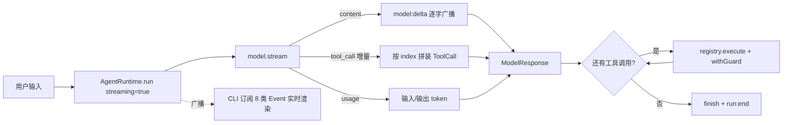

# 18 · Hello Harness v1.0

> <span class="stage-badge">Stage Hello Harness</span> · <span class="tag-badge">v18-minimal-harness</span>

十七章走下来，我们从「一个不会用工具的 LLM」一路长成了「能注册工具、有上下文、会记录步骤、会广播事件、错误有户籍、能重试能超时能中途取消的 Agent Runtime」。兄弟们，这一路走来可太不容易了，可到了收官这一章，回头看，它好像还只是一个玩具，**感觉还差一个东西才像一个「产品」**：

- Runtime 里模型调用还是**一次性**的——`await model.generate()` 一下等到底，用户的体验是「等了半天，然后整段文字啪地冒出来」；
- CLI 是**单轮**的——问一句答一句，问完就得重开进程；
- 事件体系建得漂漂亮亮（`run:start` / `model:*` / `tool:*` / `step` / `run:end`），可**没有一个入口把它们同时摆在眼前**。

这一章，我们把 Stage 2 收口成 **Hello Harness v1.0**：给 Runtime 装上**流式**能力，产出一个 **Minimal Harness CLI**——**流式多轮对话**，并且**每一类 Event 都实时显示**。

<!-- more -->

## 一、前面的实现还有什么不足？

1. **模型调用是「一次性」的**：Runtime 只走 `model.generate()`，拿到完整 `ModelResponse` 才继续。而 `Model` 接口里明明躺着 `stream()` 这个流式能力（03 章就写了！），**Runtime 却一次都没用过**——首字延迟、逐字吐字这些体验，用户全无感知；
2. **CLI 是单轮的**：`pnpm dev -- --tools "..."` 问完即走，想追问一句得重新跑一遍进程，更别提把上一轮的回答带进上下文；
3. **事件体系没有「总览入口」**：事件类型已经 8 种了，可 CLI 只挑了 `run:start` / `step` 来渲染，`model:start` / `model:end` / `tool:start` / `tool:end` / `run:end` 这些「过程事件」一直没被一屏展示过——**Event 体系空有类型，没有观众**；
4. **流式与工具是断的**：`OpenAIModel.stream()` 只会吐 `content` 文本和 `usage`，**工具调用的流式增量（tool_calls deltas）完全被丢弃**——一旦想流式，工具就没了。

> 一句话：**能力都齐了，但还停留在「库」的形态——没有用户体验、没有流式、没有一个能把所有 Event 看全的壳。**

## 二、本篇解决什么问题？

1. **Runtime 支持流式模型调用**：新增 `streaming` 选项——开着就走 `model.stream()`，逐块消费、逐块广播 `model:delta` 事件，同时把流式的工具调用增量也收进来，**流式不再丢工具**；
2. **流式补全工具调用增量**：`OpenAIModel.stream()` 增加 `tool_call` 事件，把 OpenAI 的 tool_calls delta 逐段吐出来，Runtime 按 `index` 拼装成完整 `ToolCall`；
3. **Minimal Harness CLI**：新增 `--chat` 交互模式——**流式多轮对话**（上下文跨轮保留，`exit` 退出，Ctrl+C 取消本轮）；
4. **全 Event 总览**：把 8 类 `AgentEvent` 全部渲染成一屏时间线——`[run:start]` / `[model:start]` / 流式 delta / `[model:end]` / `[tool:start]` / `[tool:end]` / `Step N` / `[run:end]`，加上一轮的 `Answer / Steps / Tokens / Status` 总结。

核心心智模型：

> **一个 Runtime 的价值，一半在「能干什么」，一半在「发生什么时能被看见」**——流式让过程可以被看见，Event 总览让每一步都有迹可循。

解决完上面四件事，咱们回过头把这条线串一下：**前面留下的「模型调用一次性、CLI 单轮、Event 空有类型没观众、流式丢工具」这些遗留问题 → 这一章用「streaming 选项 + streamOnce 拼装 + --chat 多轮 + 全 Event 总览」解决掉 → 接下来看看我们到底得到了什么收获。**

### 解决之后，我们收获了什么？

- **Runtime 有了流式**：`streaming: true` 走 `model.stream()`，逐 token 消费、逐 token 广播 `model:delta`——「等一整块」变成「边想边吐」；
- **流式不再丢工具**：`tool_call` 增量按 `index` 拼装，`--tools --stream` 能边流式边调工具；
- **CLI 是产品形态了**：`--chat` 流式多轮，上下文跨轮保留，`exit` 退出、Ctrl+C 取消本轮；
- **8 类 Event 全量可见**：从 `[run:start]` 到 `[run:end]` 一屏看全——调试、教学、排障都靠它。

> 一句话收个尾：遗留的「能力齐却不像产品」问题被这一章的收口解决掉，换来的则是「可流式、可多轮、不丢工具、全量可见」的Mini Harness Chat。

## 三、先看最终效果

### 一跑：流式多轮对话

```bash
$ pnpm dev -- --chat

> hello-harness@0.1.0 dev D:\Workspace\hui\project\hello-harness
> node --import tsx --env-file-if-exists=.env src/cli/index.ts "--chat"


Hello Harness v1.0 · 流式多轮对话（输入 exit 退出，Ctrl+C 取消本轮）
你 > 帮我算一下 16乘以20再加上八，结果是什么
[run:start ] Run ID : 8aca2406-f789-4470-a991-dbff8c66bfeb
[run:start ] Input  : 帮我算一下 16乘以20再加上八，结果是什么
[model:start] 思考中 …

[model:end ] 调用工具：calculator · 479 in / 93 out · 2252ms
Step 1 · model  → 调用工具：calculator
[tool:start] calculator({"expression":"16 * 20 + 8"})
[tool:end  ] → 328 · 1ms
Step 2 · tool   → calculator({"expression":"16 * 20 + 8"}) = 328
[model:start] 思考中 …
计算结果为 **328**。

计算步骤：
- 16 × 20 = 320
- 320 + 8 = 328

所以最终结果是 **328**。
[model:end ] 完成回答 · 553 in / 51 out · 7381ms
Step 3 · model  → 完成回答
Step 4 · finish → finished
[run:end   ] completed (finished) · 9636ms
Answer  : 计算结果为 **328**。

计算步骤：
- 16 × 20 = 320
- 320 + 8 = 328

所以最终结果是 **328**。
Steps   : 2 轮 · 4 条消息 · 4 步 · 9636ms
Tokens  : 884 in / 78 out
Status  : completed (finished)


# 下面是第二轮的对话
你 > 把上面的结果再加上100，等于多少？
[run:start ] Run ID : 65696304-6f95-4b8d-9921-b1baa1f7fa3a
[run:start ] Input  : 把上面的结果再加上100，等于多少？
[model:start] 思考中 …

[model:end ] 调用工具：calculator · 603 in / 60 out · 3175ms
Step 1 · model  → 调用工具：calculator
[tool:start] calculator({"expression":"328 + 100"})
[tool:end  ] → 428 · 1ms
Step 2 · tool   → calculator({"expression":"328 + 100"}) = 428
[model:start] 思考中 …
结果是 **428**。

计算过程：之前的 328 加上 100，等于 **428**。
[model:end ] 完成回答 · 674 in / 58 out · 2748ms
Step 3 · model  → 完成回答
Step 4 · finish → finished
[run:end   ] completed (finished) · 5924ms
Answer  : 结果是 **428**。

计算过程：之前的 328 加上 100，等于 **428**。
Steps   : 2 轮 · 8 条消息 · 4 步 · 5924ms
Tokens  : 1277 in / 118 out
Status  : completed (finished)
```

这一屏里，**8 类 Event 全部在场**：`run:start` → `model:start` → `tool:start`/`tool:end` → `model:start` → 流式 delta → `model:end` → `step`（4 次）→ `run:end`。

而且多轮对话完全没有问题，第二轮对话中输入中，要求引用第一轮对话的返回结果，最终的表现也没有任何问题

### 二跑：一次性流式（工具 + 流式同台）

```bash
$ pnpm dev -- --tools --stream "帮我算一下 1+1"
```

和 `--chat` 一样走流式，但跑完即走——适合脚本与测试。

## 四、架构变化

[ch17](./17-abort-timeout-retry) 这一章节的末尾说到了，现在的代码层，没有稳定的目录结构、没有清晰的包边界、代码量也在悄悄膨胀。 咱们这一张就来补齐这个短板，做一次「收敛」，下面就是调整后的项目结构

```text
src/
├── model/            # Model 层：provider 无关抽象 + OpenAI 实现
│   ├── model.ts      #   Model 接口
│   ├── types.ts      #   ModelRequest/ModelResponse/ModelEvent
│   ├── messages.ts   #   Message 构造助手
│   └── openai.ts     #   OpenAIModel：stream() 增加 tool_call 增量事件
├── agent/            # Agent 核心：循环、档案、轨迹
│   ├── runtime.ts    #   AgentRuntime + withGuard + streaming/streamOnce
│   ├── run.ts        #   AgentRun / RunStatus / StopReason
│   └── step.ts       #   AgentStep
├── tools/            # 工具层：input → environment → output
│   ├── tool.ts       #   Tool / ToolResult
│   ├── registry.ts
│   ├── calculator.ts
│   └── random.ts
├── context/          # 上下文：AgentContext
│   └── context.ts
├── events/           # 事件：AgentEvent + AgentEventEmitter
│   └── events.ts
├── errors/           # 错误：HarnessError 五类
│   └── errors.ts
└── cli/              # CLI 层：入口、多轮对话、Event 渲染
    ├── index.ts      #   入口 + 参数分发 + 一次性 demo
    ├── chat.ts       #   --chat 流式多轮
    └── render.ts     #   subscribeEvents 全 Event 总览 + printSummary
```

> 这就是我们Hello Harness的收官结构图（`model / agent / tools / context / events / cli`）的落地。每个目录一个职责、一条边界：**Model 不认识 Agent，Tool 不认识 Agent，Runtime 不绑定 Provider**——AGENTS.md 的架构红线在这一版开始有了「目录形态」。



一句话概括架构变化：**模型调用从「一次性」变成「流式」，事件从「有类型没观众」变成「Minimal Harness 全量展示」**。

老架构和新架构，小伙伴可以对照着看——同样是 Stage 2 这一整套能力，它「像不像一个产品」差出一条街：

| 维度 | 上一版：库形态 | 这一版：产品形态 |
| --- | --- | --- |
| 模型调用 | 一次性 `await generate` 等到底 | 流式 `model.stream` 逐 token |
| 流式丢工具吗 | `tool_calls` deltas 被丢 | `tool_call` 增量按 `index` 拼装，不丢 |
| CLI 形态 | 单轮，问完即走 | `--chat` 流式多轮，上下文跨轮保留 |
| Event 可见度 | 只渲染 `run:start` / `step`，过程事件没观众 | 8 类全量一屏看全 |
| 像产品吗 | 能力齐，但停在一个「库」 | 流式多轮对话壳 + 分层目录，约 1077 行收敛成最小 Harness |

一句话：以前是「能力都齐了，却只是个没人看的库」；现在是「流式多轮对话 + 全 Event 总览」的真正壳子。

> 注：模型调用经 `stream()` 吐增量、Runtime 按 `index` 拼装、CLI 订阅全部 8 类 Event 实时渲染，正是规划里那张「增量 → 拼装 → 广播 → 渲染」的图。

## 五、核心抽象

我们先来拆解一下这次改造的出发点，按照「先钉需求、再拆角色、最后克制边界」三步走：

1. **钉需求**：十七章能力都齐了，却还停在「库」形态——模型调用一次性、CLI 单轮、Event 空有类型没观众、流式还会丢工具。需求就一句：「把 Stage 2 收口成一个流式多轮、全 Event 可见的最小产品」；
2. **拆角色**：Runtime 用一个 `streaming` 选项分派 `generate` / `streamOnce`；`streamOnce` 把 `Model.stream()` 的增量按 `index` 拼回完整 `ModelResponse`；`OpenAIModel.stream` 补上 `tool_call` 增量事件；CLI 用 `subscribeEvents` 把 8 类 Event 统一接出来，`chat()` 持有一个持久 Runtime 跑多轮；
3. **克制边界**：流式产出与 `generate()` **同构**，上层循环逻辑一行不改（换内核不换脸）；只新增 `model:delta` / `tool_call` 两个事件，不破坏既有；CLI 只是把已有的 Event 「接出来」，不写新业务逻辑。

> **出发点小结**：我们不是「为加功能而加功能」，而是被「能力齐却不像产品、流式丢工具、Event 没观众」四个真实痛点逼出来的。先教学、后抽象——Stage 2 在此收敛成真正最小可运行的 Harness。

下面把这套收口机制摊开看。

### streamOnce：把流式吃进 Runtime

Runtime 开不开关流式，就一个 `streaming` 选项决定：

```ts
private callModel(request: ModelRequest): Promise<ModelResponse> {
  return this.streaming ? this.streamOnce(request) : this.model.generate(request);
}
```

`streamOnce` 是流式的消费核心——**一边逐 token 广播，一边把工具调用增量拼装回来**：

```ts
private async streamOnce(request: ModelRequest): Promise<ModelResponse> {
  let content = "";
  let inputTokens = 0, outputTokens = 0;
  const toolCalls = new Map<number, { id: string; name: string; args: string }>();

  for await (const event of this.model.stream(request)) {
    if (event.type === "content") {
      content += event.text;
      this.events.emit({ type: "model:delta", runId: ..., text: event.text });  // 逐字广播
    } else if (event.type === "usage") {
      inputTokens = event.inputTokens;
      outputTokens = event.outputTokens;
    } else if (event.type === "tool_call") {
      const current = toolCalls.get(event.index) ?? { id: "", name: "", args: "" };
      if (event.id) current.id += event.id;         // 增量按 index 拼装
      if (event.name) current.name += event.name;
      current.args += event.arguments;
      toolCalls.set(event.index, current);
    }
  }

  return {
    content,
    toolCalls: [...toolCalls.values()].filter((call) => call.name)
      .map((call) => ({ id: call.id, name: call.name, arguments: parseArguments(call.args) })),
    inputTokens,
    outputTokens,
  };
}
```

**重点关注**：关键点：`Model.stream()` 吐出来的是**增量**，工具调用按 `index` 分成多条流；`streamOnce` 用 `Map<index, {...}>` 把它们**拼成整块**，最终产出和 `generate()` 一模一样的 `ModelResponse`——**上层循环逻辑（工具、步骤、事件）一行不用改**。

### ModelEvent.tool_call：把增量吐给上游

`OpenAIModel.stream()` 之前只认 `content` 和 `usage`，OpenAI 的 tool_calls delta 被白白丢掉。现在补上：

```ts
// model/types.ts
export type ModelEvent =
  | { type: "content"; text: string }
  | { type: "tool_call"; index: number; id?: string; name?: string; arguments: string }  // 增量
  | { type: "usage"; inputTokens: number; outputTokens: number };

// openai.ts stream()
for (const call of delta?.tool_calls ?? []) {
  yield { type: "tool_call", index: call.index, id: call.id, name: call.function?.name, arguments: call.function?.arguments ?? "" };
}
```

### chat()：把 Event 变直播间

Minimal Harness 的核心不是新逻辑，而是**把已有的 8 类 Event 全部接出来**——`subscribeEvents()` 统一订阅，`chat()` 里一个持久化 Runtime 跑多轮，上下文靠 `history` 跨轮传递：

```ts
let history: Message[] = [];
for (;;) {
  const prompt = await ask();
  if (prompt === null || prompt === "exit") break;
  const request: ModelRequest = { messages: [...history, userMessage(prompt)] };
  const run = await runtime.run(request);   // streaming: true
  history = run.history;                    // 下一轮带着上下文继续
}
```

## 六、实现代码

### 事件扩展

**`src/events/events.ts`**——AgentEvent 加 `model:delta`（`ModelEvent` 属于模型契约，留在 `model/types.ts`）：

```ts
export type AgentEvent =
  | { type: "run:start"; runId: string; input: string }
  | { type: "model:start"; runId: string; request: ModelRequest }
  | { type: "model:delta"; runId: string; text: string }          // 新增：流式逐字
  | { type: "model:end"; runId: string; response: ModelResponse; durationMs: number }
  | { type: "model:retry"; runId: string; attempt: number; error: string }
  | { type: "tool:start"; runId: string; call: ToolCall }
  | { type: "tool:end"; runId: string; call: ToolCall; result: ToolResult; durationMs: number }
  | { type: "step"; runId: string; step: AgentStep }
  | { type: "run:end"; runId: string; status: RunStatus; stopReason: StopReason; answer: string; durationMs: number };
```

> 注意分层：`ModelEvent` 是 **Model 的流式契约**（`model/types.ts`），`AgentEvent` 是 **Harness 的可观测层**（`events/events.ts`）——Model 不再依赖 events 层，边界更干净。

### OpenAI 流式补全工具增量

**`src/model/openai.ts`**（`stream()` 内）：

```ts
for await (const chunk of stream) {
  const delta = chunk.choices[0]?.delta;
  if (delta?.content) yield { type: "content", text: delta.content };
  for (const call of delta?.tool_calls ?? []) {
    yield {
      type: "tool_call",
      index: call.index,
      id: call.id,
      name: call.function?.name,
      arguments: call.function?.arguments ?? "",
    };
  }
  if (chunk.usage) yield { type: "usage", inputTokens: chunk.usage.prompt_tokens, outputTokens: chunk.usage.completion_tokens };
}
```

### Runtime：streaming 选项 + streamOnce

**`src/agent/runtime.ts`**——选项加一行，构造函数落一个字段：

```ts
export interface AgentRuntimeOptions {
  // ...原有
  streaming?: boolean;    // 新增：true 走 model.stream() 流式
}
```

```ts
this.streaming = options.streaming ?? false;
```

**`src/agent/runtime.ts`**——`callModel` 分派 + `streamOnce`（见核心抽象）。`AgentRun` / `RunStatus` / `StopReason` 抽到 `src/agent/run.ts`，`AgentStep` 在 `src/agent/step.ts`——**一个文件一个职责，档案与轨迹从 Runtime 里拆出来**。

### CLI：subscribeEvents 全 Event 总览

**`src/cli/render.ts`**——把 8 类 Event 统一接出来（节选关键订阅）：

```ts
runtime.on("model:delta", (e) => process.stdout.write(e.text));   // 流式逐字
runtime.on("model:end", (e) => {
  const detail = e.response.toolCalls.length > 0 ? `调用工具：${...}` : "完成回答";
  console.log(`[model:end ] ${detail} · ${e.response.inputTokens} in / ${e.response.outputTokens} out · ${e.durationMs}ms`);
});
runtime.on("tool:start", (e) => console.log(`[tool:start] ${e.call.name}(${JSON.stringify(e.call.arguments)})`));
runtime.on("tool:end", (e) => console.log(`[tool:end  ] → ${...} · ${e.durationMs}ms`));
runtime.on("run:end", (e) => console.log(`[run:end   ] ${e.status} (${e.stopReason}) · ${e.durationMs}ms`));
```

### chat：流式多轮

**`src/cli/chat.ts`**——一个持久化 Runtime，`history` 跨轮传递，`exit`/EOF 退出：

```ts
async function chat(model: Model, registry: ToolRegistry, options: AgentRuntimeOptions) {
  const runtime = new AgentRuntime(model, registry, { ...options, streaming: true });
  process.on("SIGINT", () => { console.log("\n取消本轮运行…"); runtime.abort(); });
  subscribeEvents(runtime, state, true);

  const rl = readline.createInterface({ input: process.stdin, output: process.stdout });
  const ask = () => new Promise<string | null>((resolve) => {
    if (rl.closed) return resolve(null);
    rl.question("你 > ", (answer) => resolve(answer));
    rl.once("close", () => resolve(null));
  });

  let history: Message[] = [];
  for (;;) {
    const prompt = await ask();
    if (prompt === null || prompt.trim() === "" || prompt === "exit" || prompt === "quit") break;
    const request: ModelRequest = { messages: [...history, userMessage(prompt)] };
    const run = await runtime.run(request);
    printSummary(run, state);
    history = run.history;
  }
  rl.close();
}
```

## 七、运行 Demo

接下来进入正题，正确的使用姿势如下，小伙伴跟着跑两遍就懂了：

```bash
# 1. 流式多轮对话（minimal-harness 主入口）
pnpm dev -- --chat

# 2. 非交互验证：管道喂一句话，跑完自动退出
echo "帮我算一下 1+1" | pnpm dev -- --chat

# 3. 一次性流式（工具 + 流式同台，适合脚本）
pnpm dev -- --tools --stream "帮我算一下 1+1"

# 4. 老用法依然兼容（一次性/非流式）
pnpm dev -- --tools "帮我算一下 1+1"
pnpm dev -- --full "你好"
pnpm dev "你好"
```

## 八、新架构解决了什么？

- **Runtime 有了流式**：`streaming: true` 走 `model.stream()`，逐块消费、逐块广播 `model:delta`——「等待一整块」变成「边想边吐」；
- **流式不再丢工具**：`tool_call` 增量事件把 tool_calls deltas 逐段收进来，按 `index` 拼装，`--tools --stream` 能边流式边调工具；
- **CLI 是产品形态了**：`--chat` 流式多轮，上下文跨轮保留（上一轮的 `4 条消息` 就是证明），`exit` 退出、Ctrl+C 取消本轮；
- **8 类 Event 全量可见**：`[run:start]` → `[model:start]` → delta → `[model:end]` → `[tool:start]` → `[tool:end]` → `Step N` → `[run:end]` 一屏看全，调试、教学、排障都靠它；
- **一轮的 token 花销看得见**：`AgentRun` 聚合了整轮 `inputTokens / outputTokens`，每轮总结多出一行 `Tokens  : X in / Y out`——聊天模式也能一眼看到大模型的调用开销；
- **量级达标**：整个 `src/` 约 1077 行、按 `model / agent / tools / context / events / errors / cli` 分层，贴近「核心 < 1000 LOC」的目标——**Stage 2 收敛成了有稳定目录、清晰边界的 Minimal Harness**。

## 九、它又引入了什么问题？

那么问题来了——`Hello Harness v1.0` 把 Stage 2 收口成了一个流式多轮、全 Event 可见的最小产品，可这套「收口」本身，又悄悄留下了哪些新坑？

- **流式重试会「半截重播」**：流式模式下如果中途失败触发重试，已经吐给用户的 token 不会收回——**用户会看到半句话然后重来**（真正的方案要等 Model 层支持真正的流式取消，且重试只在「一个 token 都没吐」时发生）；
- **底层流无法真正打断**：`withGuard` 只是「不等它了」，`model.stream()` 的底层请求还在后台继续——**取消只停 UI，不停网络**；
- **多轮只活在一个进程里**：`history` 只存在内存，进程一关对话就没了——**没有持久化、没有「会话文件」**（下一阶段要补 Memory）；
- **EOF 管道只能单轮**：`echo ... | pnpm dev -- --chat` 因为 stdin 立刻 EOF，只能跑一轮——**真实的连续对话依赖 TTY 交互**；
- **tool_call 增量是 OpenAI 特有的**：`index`/`arguments` 增量拼装是针对 OpenAI 流式格式写的，换 Anthropic 的流式协议要重写 `streamOnce` 的拼装；
- **分层还只是「目录」不是「包」**：`model/ agent/ tools/` 只是逻辑边界，仍是同一个工程、同一份依赖——**AGENTS.md 里 `packages/*` 的 monorepo 拆包还没发生**（等代码量上来再拆，避免过早抽象）。

## 十、下一章

> **本章小结**：这一章把 Stage 2 收口成了 **Hello Harness v1.0**——`streaming` 选项让 Runtime 从「一次性生成」升级为「逐 token 流式」，并以 `tool_call` 增量按 `index` 拼装保住工具；`--chat` 让 CLI 变成流式多轮对话产品，`subscribeEvents` 把 8 类 Event 全量一屏看全；同时按规划把平铺的 `src/` 重构成 `model / agent / tools / context / events / errors / cli` 的分层目录，整份代码约 1077 行，收敛成有稳定结构、清晰边界的最小可运行 Harness。我们立住了贯穿本章的心智模型：**一个 Harness 的价值，一半在能力，一半在可见性**。从此，它从「会聊数学题的库」长成了「能流式、能多轮、每一步都看得见、目录有边界的最小产品」。

**Stage 3：Hello Coding Agent**——把这一整套 Harness，从「会聊天」升级成「会干活」：

```text
LLM → Tool-Calling Agent → Extensible Coding Harness   ← 我们在这里
                                    → Coding Agent（能读代码、改代码、跑测试）
```

Stage 2 我们把「最小可运行 Harness」立住了——流式、多轮、工具、事件、错误、停止，全套齐活。可它现在**只会聊数学题**。下一阶段，我们给它装上「代码的眼睛和手」：文件系统、Shell、Git……让 Agent 真正走进代码库去干活。

记住这一章的一句话：

> **流式让过程可被看见，Event 让每一步可被追溯——一个 Harness 的价值，一半在能力，一半在可见性。**

那么问题来了——对话再流畅，也只是「聊天机器人」；真正的 Coding Agent 要能**读你的代码、改你的代码、帮你跑测试**。下一阶段，我们从给 Harness 装上「文件与 Shell」这两个最基础的能力开始 😊

---

微信公众号: 一灰灰Blog