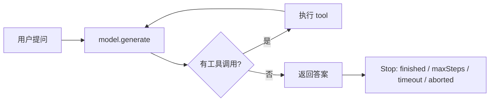
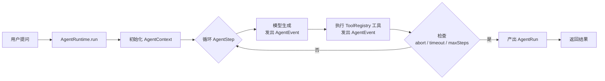

# Stage 2 · Hello Harness

> Stage 2 · Git Tag 范围：v10-tool-registry ~ v18-minimal-harness

Stage 0 和 Stage 1，小伙伴，我们收获了一个「能干活、能叫停」的 Agent。从这一篇开始，我们把它升级成 **Harness**。

如果你刚读完 `09-stop-condition`，心里可能正带着一个疑问走进这一篇——那么问题来了：

> **Agent 能干活了，Harness 又是谁？它和 Agent 到底有什么区别？**

接下来，这一篇就是 Stage 2 的开篇总览，回答三件事：

1. 什么是 Harness？
2. 它和 Agent 的区别是什么？
3. 这一 Stage 完成之后，我们会设计出一个怎样的 Harness Agent？

<!-- more -->

## 一、先复习：我们手上有一个什么样的 Agent

前面九章，小伙伴，我们攒下的东西可以浓缩成一张图：

一个 `while(true)` 循环：调模型 → 有工具调用就执行并回传 → 再调模型 → 直到不再调用工具 → 返回答案。这就是 **Agent**——**它会干活**。

但这个循环的「生活条件」还比较原始：

- 历史是一根裸 `Message[]`；
- 工具是一个散装 `Record<string, Tool>`；
- 出错靠 `try/catch`，取消只能等一轮循环结束；
- 每一步发生了什么，只能靠 `console.log` 事后考古。

> 换句话说：**Agent 解决了「能不能完成任务」，但还没解决「这个系统好不好维护」。**

## 二、什么是 Harness？

中文直译是「马具/缰绳」。想象一匹会干活的好马：它跑得再快、再听话，想让它可靠地跑长途，你得给它配上**缰绳、鞍具、铃铛**——马具。这些不直接「干活」，但让「驾驭马」这件事变得**可控、可观察、可持续**。

Agent 就是那匹马，**Harness 就是那套马具**。

放到工程里，Harness 指的是围绕 Agent 的一整套**基础设施**：

| 马具 | 基础设施 | 解决的工程问题 |
| --- | --- | --- |
| 缰绳 | Tool Registry | 工具多了怎么统一管理 |
| 鞍具 | Agent Context | Agent 的「记忆」怎么快照、回滚 |
| 铃铛 | Agent Event | 每一步发生了什么，如何被观察 |
| 换马 | Agent Runtime / Run | 一次任务如何被完整记录、重跑 |
| 制动 | Abort / Timeout / Retry | 系统故障了如何体面停止 |

**重点关注**：这一 Stage，我们要把这些「马具」一件一件做出来：注册、上下文、运行时、步骤、事件、错误模型、取消/超时/重试。

## 三、Harness 和 Agent 的区别

| 维度 | Agent | Harness |
| --- | --- | --- |
| 回答的问题 | 怎么完成一次任务 | 怎么让系统可靠、可观察、可维护 |
| 关注点 | 推理、工具调用、最终答案 | 注册、上下文、运行、事件、错误、取消 |
| 本质 | 一个**循环**（model → tool → model） | 一套**基础设施**（循环之外的一切） |
| 缺失时的症状 | 干不了活 | 能干活，但无法观察、无法回滚、无法控制 |

一句话记住两者的分工：

> **Agent 负责「干」，Harness 负责「管」——管住 Agent 怎么被可靠地干好活。**

之前的代码里，这两者是**揉在一起的**：`runAgent` 一个函数既在循环又在管历史、管工具、管停止。Stage 2 要做的，就是**把「干」和「管」拆开**，让每个「管」的部分都有自己的名字和职责。

## 四、这一 Stage 完成之后，我们会设计出一个怎样的 Harness Agent？

毕业作品叫 **Minimal Agent Runtime**——一个核心代码 < 1000 行、但五脏俱全的最小 Harness。

先看它将长成什么样：

对比现在的 `runAgent`，到 Stage 2 结束时，每个「马具」都有了独立的模块：

| 模块 | 现在 | Stage 2 结束 |
| --- | --- | --- |
| 工具 | 散装 `Record` | `ToolRegistry`：注册 / 查找 / 列表 / 执行 |
| 上下文 | 裸 `Message[]` | `AgentContext`：add / snapshot / restore |
| 循环 | `while(true)` 写死在 `runAgent` | `AgentRuntime` + `AgentStep` |
| 运行记录 | 无 | `AgentRun`：一次任务可审计的完整轨迹 |
| 可观察性 | `console.log` | `AgentEvent`：运行中每一步都发事件 |
| 错误 | 裸 `try/catch` | `AgentError`：结构化错误模型 |
| 停止 | 手写 `maxSteps / timeout / signal` | Abort / Timeout / Retry 系统化 |

> 一句话概括 Stage 2 的目标：
> **把「一个能工作的 Agent」，演进成「一个可以维护的 Harness」。**

## 五、章节清单

| # | 章节 | Git Tag | 状态 |
| --- | --- | --- | --- |
| 10 | [Tool Registry](10-tool-registry) | v10-tool-registry | 已完成 |
| 11 | [Context](11-context) | v11-context | 已完成 |
| 12 | [Agent Runtime](12-agent-runtime) | v12-runtime | 已完成 |
| 13 | [Agent Step](13-agent-step) | v13-step | 已完成 |
| 14 | [Run](14-run) | v14-run | 规划中 |
| 15 | [Event System](15-event-system) | v15-events | 规划中 |
| 16 | [Error Model](16-error-model) | v16-errors | 规划中 |
| 17 | [Abort / Timeout / Retry](17-abort-timeout-retry) | v17-abort | 规划中 |
| 18 | [Hello Harness v1.0](18-hello-minimal-harness) | v18-minimal-harness | 规划中 |

## 阶段结尾

这一阶段结束：**Hello Harness v1.0**，核心代码 < 1000 LOC。

接下来，从第 10 章起，我们开始给「马」配「马具」。下一阶段，这匹披甲戴鞍的马，就将正式成为一位能干活的 **Coding Agent**。

> **记住这一 Stage 的灵魂一句：**
> **Agent 负责「干」，Harness 负责「管」。**