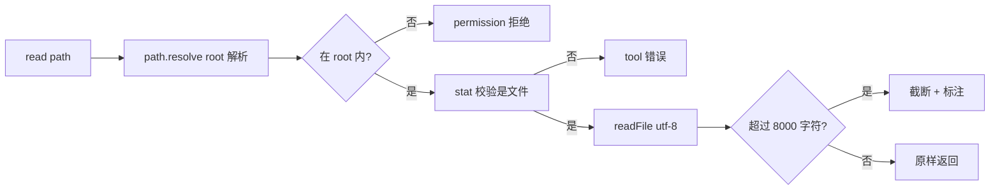

# 19 · Read Tool

> <span class="stage-badge">Stage Hello Coding Agent</span> · <span class="tag-badge">v19-read</span>

十八章走完，我们手里有一个**流式多轮、全 Event 可见**的 Minimal Harness。兄弟们，这套 Harness 收拾得漂漂亮亮，可它距离一个真正的CodingAgent还有些距离——不行你问问它「帮我修复这个项目」，看看它到底会干嘛。

那么问题又出在哪呢？

**它的手只能碰到计算器和随机数。**

这一章，我们给 Coding Agent 装上第一只「代码世界的眼睛」——**`read` 工具**：让它能走进 workspace、把文件内容读出来。读，是修 bug 的前提：不先看代码，就没有「修」这回事。

<!-- more -->

## 一、上一版存在什么问题？

1. **Agent 的世界里没有「代码」**：工具只有 `calculator` 和 `randomInteger`，参数只有 `expression` 和一个区间——它连「文件」是什么都不知道；
2. **它只能「猜」，不能「看」**：让模型直接回答代码问题，它要么瞎编文件内容，要么靠训练记忆蒙答案——而 AGENTS.md 的第一条安全铁律就是「文件能力默认限定在显式 workspace，禁止猜文件内容」；
3. **可观察、可流式、可重试，全都建立在「玩具工具」之上**：Harness 建得多漂亮，工具不接触真实世界，一切能力都悬空。

> 一句话：**Harness 把「能干」和「能管」都准备好了，但它还差一双能看见真实代码库的眼睛。**

## 二、本篇解决什么问题？

1. **给 Agent 装上 `read` 工具**：`read(path)` 读取 workspace 内的文本文件，把内容原样交回给模型；
2. **立住第一个安全边界——workspace 根目录**：文件操作被限定在一个显式的 `workspaceRoot` 内，**越界一律拒绝**；
3. **路径校验**：相对路径统一 `resolve` 到绝对路径再做「是否还在 root 内」的判断，`../` 穿越、绝对路径指向外部，全都拦下；
4. **文本截断**：文件太大时只返回前 `MAX_READ_CHARS` 字符并明确标注，**不让长文件撑爆模型上下文**。

核心心智模型：

> **Tool 是 Agent 与真实世界的唯一接口；而 read 是 Coding Agent 踏进代码库的第一块敲门砖。**

解决完上面四件事，咱们回过头把这条线串一下：**Stage 2 留给我们的「工具不接触真实世界」→ 这一章用「带 workspace 边界、带路径校验、带文本截断的 read 工具」解决掉 → 接下来看看 Agent 第一次看见代码是什么样。**

### 解决之后，我们收获了什么？

Agent 第一次把「眼睛」睁开在真实的代码库上：能读文件、能拿到源码文本、能在此基础上回答「这个文件在干什么」。

而且这份「看」是**有边界、可验证、受控**的——读不到 workspace 之外的东西，读多长也有上限。

## 三、先看最终效果

这一章我们不跑真模型，直接驱动 `read` 工具——六个场景一屏看全：

```bash
$ node --import tsx examples/stage-3/19-read-tool/demo.mts

=== 1. 正常读取 workspace 内文件 ===
[ok]   workspace/src/hello.ts
       → export function greet(name: string): string {
  return `Hello, ${name}!`;
}

con…（133 字符）
=== 2. 读取目录 → 拒绝 ===
[fail] path=src
       → [tool] 不是文件，无法读取：src
=== 3. 路径穿越 ../README.md → 拒绝（permission） ===
[fail] path=../README.md
       → [permission] 路径超出 workspace 范围，拒绝读取：../README.md（解析后 D:\Workspace\hui\project\hello-harness\examples\stage-3\19-read-tool\README.md）
=== 4. 绝对路径指向 workspace 外 → 拒绝（permission） ===
[fail] path=C:\Users\yihui\AppData\Local\Temp\secret.txt
       → [permission] 路径超出 workspace 范围，拒绝读取：C:\Users\yihui\AppData\Local\Temp\secret.txt（解析后 C:\Users\yihui\AppData\Local\Temp\secret.txt）
=== 5. 文件不存在 → 读取失败 ===
[fail] path=nope.txt
       → [tool] 读取失败：ENOENT: no such file or directory, stat 'D:\Workspace\hui\project\hello-harness\examples\stage-3\19-read-tool\workspace\nope.txt'
=== 6. 超长文件 → 自动截断 ===
[ok]   path=long.txt（11004 字符）
       → AAAAAAAAAAAAAAAAAAAAAAAAAAAAAAAAAAAAAAAAAAAAAAAAAAAAAAAAAAAAAAAAAAAAAAAAAAAAAAAA…（8036 字符）
```

兄弟，注意看两个细节：

- 场景 3、4 的拒绝是 `[permission]`——**它把「越界」当成权限问题，而不是普通工具错误**（`[tool]`）。这正是 Stage 2 第十六章搭的 `PermissionError` 户籍，第一次在真实能力上有了用武之地；
- 场景 6 的返回值**带截断标注**——模型拿到内容的同时，明确知道自己看到的是「前 8000 字符」，不会误以为看到了整个文件。

### 再跑：把 read 装进 Chat 对话

上面的 demo 是**直接驱动工具**，证明工具本身可靠。但这一章的最终目的，是让 Agent 在真实对话里用它——所以 `cli/index.ts` 里给 registry 加了一行，把 read 注册进 `--chat`（workspace root 就是启动 CLI 的目录）：

```bash
$ pnpm dev -- --chat

你 > 帮我读一下 examples/stage-3/19-read-tool/workspace/src/hello.ts 的内容
[run:start ] Run ID : dea0cb64-e37e-48b4-9ac0-aa22da4bbbde
[run:start ] Input  : 帮我读一下 examples/stage-3/19-read-tool/workspace/src/hello.ts 的内容
[model:start] 思考中 …

[model:end ] 调用工具：read · 576 in / 105 out · 4535ms
Step 1 · model  → 调用工具：read
[tool:start] read({"path":"examples/stage-3/19-read-tool/workspace/src/hello.ts"})
[tool:end  ] → "export function greet(name: string): string {\n  return `Hello, ${name}!`;\n}\n\nconst message = greet(\"harness\");\nconsole.log(message);\n" · 6ms
Step 2 · tool   → read({"path":"examples/stage-3/19-read-tool/workspace/src/hello.ts"}) = "export function greet(name: string): string {\n  return `Hello, ${name}!`;\n}\n\nconst message = greet(\"harness\");\nconsole.log(message);\n"
[model:start] 思考中 …
文件内容如下：

typescript
export function greet(name: string): string {
  return `Hello, ${name}!`;
}

const message = greet("harness");
console.log(message);

这是一个简单的 TypeScript 模块：

- 导出了一个 `greet` 函数，接收一个 `name` 字符串参数，返回 `Hello, ${name}!` 的问候语。
- 然后调用 `greet("harness")`，将结果存入 `message` 并打印到控制台。
[model:end ] 完成回答 · 702 in / 123 out · 1955ms
Step 3 · model  → 完成回答
Step 4 · finish → finished
[run:end   ] completed (finished) · 6501ms
Answer  : 文件内容如下：

export function greet(name: string): string {
  return `Hello, ${name}!`;
}

const message = greet("harness");
console.log(message);

这是一个简单的 TypeScript 模块：

- 导出了一个 `greet` 函数，接收一个 `name` 字符串参数，返回 `Hello, ${name}!` 的问候语。
- 然后调用 `greet("harness")`，将结果存入 `message` 并打印到控制台。
Steps   : 2 轮 · 4 条消息 · 4 步 · 6501ms
Tokens  : 1278 in / 228 out
Status  : completed (finished)
```

这一跑里，完整的链路是：**模型决定调用 read → registry 找到并执行 → 真实文件系统读回内容 → 内容进入上下文 → 模型基于真实内容作答**。注意 `[tool:end]` 返回的就是 `src/hello.ts` 的真实内容——Agent 不再「猜」文件，而是「看」文件。

## 四、架构变化

```text
src/
├── model/            # Model 层（不变）
├── agent/            # Agent 核心（不变）
├── tools/            # 工具层
│   ├── tool.ts       # Tool / ToolResult（不变）
│   ├── registry.ts   # ToolRegistry（不变）
│   ├── calculator.ts # 玩具工具（不变）
│   ├── random.ts     # 玩具工具（不变）
│   └── read.ts       # 新增：createReadTool(workspaceRoot) —— 第一个真实世界工具
├── context/          # 上下文（不变）
├── events/           # 事件（不变）
├── errors/           # 错误（不变）
└── cli/              # CLI
    └── index.ts      # 加一行：registry.register(createReadTool(process.cwd()))
```


变化极小——**核心只新增一个 `read.ts`，CLI 只加一行注册**。但意义极大：这是第一个「环境敏感」的工具。前面的 `calculator` 拿到什么算什么是**无状态无边界**的；`read` 则绑定了一个 `workspaceRoot`，它的「环境」就是那个目录。

工具内部是一条干净的单向流水线：




## 五、核心抽象

本文对整体架构的影响较小，可以直接理解为新增一个读取文件的工具，具体的拆分一下，这次的需求如下

1. **钉需求**：Coding Agent 要修 bug，第一步必然是「看」。需求就一句：「给模型一个能读文件、且绝对不会读到 workspace 之外的工具」；

2. **拆设计**：读取文件，是随便读、随便返回吗？这样安全和结果处理的一致性怎么保障呢？所以我们要给这个实现加个“紧箍咒”
- **root 是 read 工具的环境**（用工厂 `createReadTool(root)` 注入）；
- **路径是模型的输入**（相对路径，越简洁越好）；
- **内容是返回给模型的值**（原样字符串）；
- **截断是护栏**（保护上下文，不保护别的）；

3. **克制边界**：**没有引入 Workspace 类**——root 此刻只是 read 自己的一个参数，workspace 的集中抽象留给第 23 章；**没有做目录枚举**——「看目录」留给更合适的工具；**只支持 utf-8 文本**——二进制是另一个问题域。

### 为什么用工厂，而不是全局配置？

`calculator` 是单例对象，因为**它没有环境**。

`read` 必须知道「哪个目录才是我能读的」——这个信息跟着**环境**走，不跟着模型走。

用 `createReadTool(workspaceRoot)` 返回一个绑定好 root 的 `Tool`，语义是：

> **这份「读的能力」属于这个 workspace。换个 workspace，就是另一份能力。**

这也正是 ch23 `Workspace` 类的萌芽——工具开始「各自带环境」了，环境本身迟早要被抽象出来统一管理。

### 三道护栏，各管一件事

| 护栏 | 防什么 | 拒绝时的 kind |
| --- | --- | --- |
| workspace root | 越界读取（`../`、绝对路径指向外部） | `permission` |
| `resolve` + 包含判断 | 相对路径被解析出 root 之外 | `permission` |
| `stat` 文件校验 | 读目录、读不存在的路径 | `tool` |
| 文本截断 | 长文件撑爆模型上下文 | 不拒绝，截断后返回 |

**重点关注**：越界拒绝用 `kind: "permission"` 而不是普通 `tool` 错误——这是给模型的信号分级：**普通失败可以让模型换个路径重试，越界是红线，重试也没用**。模型看到 `[permission]` 就该停下来换思路，而不是继续猜。

## 六、实现代码

### ReadTool实现

**`src/tools/read.ts`**——完整实现：

```ts
import { readFile, stat } from "node:fs/promises";
import path from "node:path";
import type { Tool, ToolResult } from "./tool";

export const MAX_READ_CHARS = 8000;

export interface ReadInput {
  path?: unknown;
}

export function createReadTool(workspaceRoot: string): Tool {
  const root = path.resolve(workspaceRoot);

  return {
    name: "read",
    description: "读取 workspace 内的文本文件内容，path 为相对 workspace 根目录的路径；文件超长会自动截断",
    parameters: {
      type: "object",
      properties: {
        path: {
          type: "string",
          description: "相对 workspace 根目录的文件路径，例如 src/index.ts",
        },
      },
      required: ["path"],
    },
    async execute(input: unknown): Promise<ToolResult> {
      const { path: filePath } = input as ReadInput;
      if (typeof filePath !== "string" || filePath.trim() === "") {
        return { ok: false, error: "参数 path 必须是文件路径字符串", kind: "tool", retryable: false };
      }

      const target = path.resolve(root, filePath);
      if (target !== root && !target.startsWith(root + path.sep)) {
        return {
          ok: false,
          error: `路径超出 workspace 范围，拒绝读取：${filePath}（解析后 ${target}）`,
          kind: "permission",
          retryable: false,
        };
      }

      try {
        const info = await stat(target);
        if (!info.isFile()) {
          return { ok: false, error: `不是文件，无法读取：${filePath}`, kind: "tool", retryable: false };
        }
        const content = await readFile(target, "utf-8");
        if (content.length <= MAX_READ_CHARS) {
          return { ok: true, value: content };
        }
        return {
          ok: true,
          value: `${content.slice(0, MAX_READ_CHARS)}\n\n...（已截断：文件共 ${content.length} 字符，只返回前 ${MAX_READ_CHARS} 字符）`,
        };
      } catch (error) {
        const message = error instanceof Error ? error.message : String(error);
        return { ok: false, error: `读取失败：${message}`, kind: "tool", retryable: false };
      }
    },
  };
}
```

上面这个工具的具体实现和普通的工具扩展没有什么本质的区别，无非是它提供了文件内容读取的能力

请**重点关注**这几个设计点：

1. **`root` 在工厂里 `path.resolve` 定死**：传入什么 root，就永远以它为准——创建之后环境不可变，杜绝「读着读着把 root 改了」的隐患；
2. **包含判断 `target.startsWith(root + path.sep)`**：`path.resolve` 已经折叠了 `../` 和 `.`，所以这里比的是「解析后的绝对路径」——比字符串拼前缀严谨得多（还得加 `path.sep`，防止 `root` 是 `C:\a` 时误放行 `C:\aXxx`）；
3. **`stat` 先确认是文件**：读目录会直接报「不是文件」，而不是返回乱码；
4. **截断标注写进返回值**：截断不是悄悄丢尾巴，而是明明白白告诉模型「你只看到了前 8000 字符」。

> 这个文件读取的实现，目前还比较简单，我们依然沿用教学目的，先简单后扩展，以方便我们可以更容易的理解整个Agent的演进过程；所以看到这个读文件的工具实现，觉得还差几分（比如大文件 、非文本文件、非utf8编码文件等）的小伙伴，不妨先耐下性子，蹲守一波后续的迭代过程😯

### 工具注册使用

接下来我们沿着 [ch10 tool registry](../stage-2-hello-harness/10-tool-registry) 的工具注册使用策略，将这个读取文件的工具注册给我们 Stage2 中完成的 MiniHarnessCli，让这个对话CLI可以读取当前项目的文件


核心就一行代码 + 系统提示词适配改动一下

```ts
registry.register(createReadTool(process.cwd()));

const SYSTEM_PROMPT = "你是一个简洁、直接的中文助手，工具可以使用时必须调用工具；对于复杂的数学计算，你应该拆分成多个简单的表达式，进行多次的工具调用；当用户询问代码内容或涉及文件时，必须使用 read 工具读取后基于真实内容回答，不要猜文件内容";
```

## 七、运行 Demo

这一章的演示有两种跑法：

**跑法一：直接驱动工具**——不需要模型、不需要 API Key：

```bash
node --import tsx examples/stage-3/19-read-tool/demo.mts
```

输出就是第三节第一屏。六个场景，一一对应工具的三道护栏 + 参数校验 + 错误处理：

| 场景 | 验证点 |
| --- | --- |
| 正常读取 `src/hello.ts` | 环境内的文件原样返回 |
| 读目录 `src` | `stat` 文件校验：不是文件 → `[tool]` |
| `../README.md` 穿越 | 包含判断：越界 → `[permission]` |
| 绝对路径指向 workspace 外 | 包含判断：越界 → `[permission]` |
| 不存在的文件 | `stat` 抛错 → `[tool]` 带底层错误信息 |
| 11004 字符的长文件 | 截断到 8000 + 标注 |

**跑法二：装进 Chat 对话**——需要配好 `.env`（真实模型）：

```bash
pnpm dev -- --chat
# 你 > 帮我读一下 examples/stage-3/19-read-tool/workspace/src/hello.ts 的内容
```


输出就是第三节第二屏：模型主动调 `read` → 工具读回真实内容 → 基于内容作答。

## 八、新架构解决了什么？

- **Agent 第一次能「看」代码**：把 `src/hello.ts` 的源码交到模型手里，`read` 是修 bug 循环的第一环——**没有这一步，后面所有「改」都建立在猜测上**；
- **安全边界有了具体形态**：workspace root 从「AGENTS.md 里的一句话」变成了代码里的硬约束——越界读直接被 `[permission]` 拦下，且错误信息写明「解析后指向哪」，模型能理解为什么被拒；
- **路径校验没有偷懒**：不是简单「前缀匹配」，而是「`resolve` 之后再做包含判断」，`../` 穿越和绝对路径越界在 `read` 这里都走不通；
- **上下文不会被长文件打爆**：截断有上限、有标注——模型知道「看到的是前 8000 字符」，这比盲目塞一个 10 万字符的文件进 prompt 高明得多；
- **`permission` 第一次上岗**：Stage 2 第十六章建好的 `PermissionError` 户籍，在真实文件能力上找到了第一个合法用户。

## 九、它又引入了什么问题？

那么问题来了——`read` 让 Agent 睁开了眼睛，可这份「看」的能力，又悄悄留下了哪些新坑？

- **只能看，不能动**：读到代码只是第一步，修 bug 得先能**改**——`write` 工具（下一章）和 `edit`（21 章）还欠着；
- **截断丢信息**：文件超过 8000 字符时，后半段直接看不到，且**没有 offset 分段读取**——读一个大文件要么截断要么全量，后续需要「按范围读」；
- **「看目录」还是空白**：想了解项目结构（有几个文件、目录长什么样）没有工具支持，`ls` 得等 22 章的 Bash Tool；
- **只认 utf-8 文本**：二进制、图片、超大文件读不了，读出来的也是乱码——Coding Agent 的「眼睛」目前只看得懂文本世界；
- **包含判断防不住符号链接**：`startsWith` 校验的是「路径字符串」，如果 workspace 里有个 symlink 指向外部，`readFile` 会跟着链接读出去——**真实路径（realpath）校验要等后续补**；
- **workspace 还是散装的**：root 此刻只是 read 自己的参数，每个工具都自管自己的环境——**环境的统一抽象（Workspace 类）在第 23 章**。

## 十、下一章

> **本章小结**：这一章给 Coding Agent 装上第一只手——**`read` 工具**。它用工厂 `createReadTool(workspaceRoot)` 绑定环境，用「`resolve` + 包含判断」挡下路径穿越，用 `[permission]` 给越界划红线，用 8000 字符截断保护上下文。我们立住了贯穿本章的心智模型：**Tool 是 Agent 与真实世界的唯一接口**。从此，Agent 第一次能在代码库上「睁开眼睛」。

**下一章：Write Tool**——光看不动，等于白看。修 bug 的第二步是「动笔」，而写文件比读文件危险得多：

- 读是只读的，写是**有副作用的**——写错文件可能直接弄坏项目；
- 读只关心「越界没有」，写还要关心「覆盖没有」——要不要允许覆盖已有文件？
- 写的内容、写的时机，都该被记录和审视——`[permission]` 的边界在这里会进一步收紧。

所以下一章，我们从 `write` 开始，把「能看不能动」变成「能看也能写」😊，欢迎点赞、关注公众号「一灰灰Blog」 我们下章见

---

微信公众号: 一灰灰Blog
