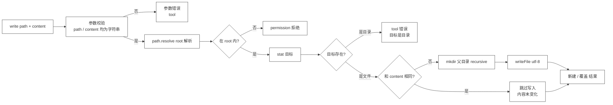

# 20 · Write Tool

> <span class="stage-badge">Stage Hello Coding Agent</span> · <span class="tag-badge">v20-write</span>


第十九章，我们给 Coding Agent 装上了第一只手——**`read`**。它能在 workspace 里「睁开眼睛」，把文件内容读回来。兄弟，这一章我们要给它装上**第一支笔**——**`write`**。

读是修 bug 的前提，但光读不写，Agent 永远只能「看」不能「动」。这一章，我们让它把内容写进代码库。

<!-- more -->

## 一、上一版存在什么问题？

1. **只能看，不能动**：`read` 把源码交到模型手里，可模型看完之后**改不了任何一个字符**——「帮我创建一个 TypeScript CLI」这种需求，`read` 一个字都答不上来；
2. **「修 bug」闭环缺了中间环**：观察 → 定位 → **修改** → 验证，十九张图只画出了「观察」，后面的「修改」还没有任何工具承接；
3. **而「写」比「读」危险得多**：读是只读的，最多浪费点上下文；写是**有副作用的**——写错路径、写坏内容，直接弄坏项目。给 Agent 一支笔之前，得先想清楚怎么管住这支笔。

> 一句话：**Agent 有了「眼睛」，还缺「手」；而这只手只要一动，就会真实改变世界——所以它必须比「眼睛」多几道护栏。**

## 二、本篇解决什么问题？

1. **给 Agent 装上 `write` 工具**：`write(path, content)` 把内容完整写入 workspace 内的文件；
2. **继承 read 的 workspace 边界**：同样的 `resolve` + 包含判断，越界写入一律 `[permission]` 拒绝——**边界不是 read 的专利，是每个碰文件系统的工具都必须遵守的第一条红线**；
3. **父目录自动创建**：写 `docs/guide/readme.md` 时，`docs/guide/` 不存在也会一路建出来——模型不用先手工 `mkdir`；
4. **把「覆盖」变成可观察的结果**：工具返回「新建文件 / 覆盖已有文件 / 内容未变化」三种语义，**覆盖不再偷偷发生，而是明明白白写进返回值**；
5. **目标校验**：写入目标是目录时直接报错，不让 `writeFile` 甩一个莫名其妙的底层异常给模型。

核心心智模型：

> **读是只读的，写是有副作用的。副作用越强，观察越重要——write 的职责不只是「把内容写进去」，还包括「告诉你它到底做了什么」。**

解决完上面五件事，咱们回过头把这条线串一下：**上一章留下的「Agent 只能看不能动、修 bug 闭环缺修改环、写比读危险」这些遗留问题 → 这一章用「write 工具 + 复用 workspace 边界 + 回读对比 + 父目录自动创建」解决掉 → 接下来看看我们到底得到了什么收获。**

### 解决之后，我们收获了什么？

- **Agent 第一次能「动」代码库**：从只能看，到能看能写，创建新文件、覆写旧内容都真实落盘；
- **覆盖变成可观察的事实**：返回「新建 / 覆盖 / 内容未变化」，副作用不再偷偷发生；
- **父目录自动创建**：`docs/guide/readme.md` 这种深层路径一次写完，不用模型先手工 `mkdir`；
- **workspace 边界复用**：越界写入和越界读取用同一条 `[permission]` 红线——安全纪律不因工具不同而改变。

> 一句话收个尾：遗留的「只能看不能动」问题被这一章的 `write` 解决掉，换来的则是「能写、可见、自创目录、边界统一」四笔实实在在的收获

## 三、先看最终效果

这一章和上一章一样，先不跑真模型，直接驱动 `write` 工具——八个场景一屏看全：

```bash
$ node --import tsx examples/stage-3/20-write-tool/demo.mts

=== 1. 新建文件 → 成功（新建文件） ===
[ok]   write src/notes.txt
       → 已写入 src/notes.txt（14 字符，新建文件）
=== 2. 覆盖已有文件 → 成功（覆盖已有文件） ===
[ok]   write src/hello.ts
       → 已写入 src/hello.ts（24 字符，覆盖已有文件）
=== 3. 写入相同内容 → 成功（内容未变化） ===
[ok]   write src/hello.ts
       → 已写入 src/hello.ts（24 字符，内容未变化）
=== 4. 嵌套目录自动创建 → 成功（新建文件） ===
[ok]   write docs/guide/readme.md
       → 已写入 docs/guide/readme.md（8 字符，新建文件）
=== 5. 路径穿越 ../outside.txt → 拒绝（permission） ===
[fail] path=../outside.txt
       → [permission] 路径超出 workspace 范围，拒绝写入：../outside.txt（解析后 C:\Users\yihui\AppData\Local\Temp\outside.txt）
=== 6. 绝对路径指向 workspace 外 → 拒绝（permission） ===
[fail] path=C:\Users\yihui\AppData\Local\Temp\secret.txt
       → [permission] 路径超出 workspace 范围，拒绝写入：C:\Users\yihui\AppData\Local\Temp\secret.txt（解析后 C:\Users\yihui\AppData\Local\Temp\secret.txt）
=== 7. 目标是目录 → 拒绝（tool） ===
[fail] path=src
       → [tool] 目标是一个目录，无法写入：src
=== 8. content 缺失或非字符串 → 拒绝（tool） ===
[fail] path=src/a.txt
       → [tool] 参数 content 必须是字符串
[fail] path=src/b.txt content=123
       → [tool] 参数 content 必须是字符串

=== 写后校验：read 回读 ===
docs/guide/readme.md → "# Guide\n
```

注意三个细节：

- 场景 5、6 的拒绝是 `[permission]`——**和 read 用的是同一条红线**：越界就是越界，不管你是读还是写；
- 场景 2、3 的返回值是「覆盖已有文件 / 内容未变化」——**覆盖没有偷偷发生**，模型一眼能看出这次写入到底是「新建」「改动」还是「白写」；
- 场景 4 写入的是 `docs/guide/readme.md`，父目录 `docs/guide/` 本来不存在，**一次调用全建好了**。

### 再跑：把 write 装进 Chat 对话

上面的 demo 是**直接驱动工具**，证明工具本身可靠。这一章的最终目的，是让 Agent 在真实对话里完成「**写 → 读回 → 验证**」的完整闭环。`cli/index.ts` 里给 registry 加了一行，把 write 注册进 `--chat`（workspace root 就是启动 CLI 的目录）：

```bash
$ pnpm dev -- --chat
```

对它说：「请直接创建文件 examples/stage-3/20-write-too/src/greet.ts，内容为一个 TypeScript 模块，导出一个 greet 函数，接收一个 name 字符串参数，返回问候语字符串。创建完成后，用 read 工具把 src/greet.ts 读回来确认内容，并告诉我文件是否创建成功。」

```text
你 > 请直接创建文件 examples/stage-3/20-write-too/src/greet.ts，内容为一个 TypeScript 模块，导出一个 greet 函数，接收一个 name 字符串参数，返回问候语字符串。创建完成后，用 read 工具把 src/greet.ts 读回来确认内容，并告诉我文件是否创建成功。
[run:start ] Run ID : 28abf790-398f-45b7-9c32-fbe28108794f
[run:start ] Input  : 请直接创建文件 examples/stage-3/20-write-too/src/greet.ts，内容为一个 TypeScript 模块，导出一个 greet 函数，接收一个 name 字符串参数，返回问候语字符串。创建完成后，用 read 工具把 src/greet.ts 读回来确认内容，并告诉我文件是否创建成功。
[model:start] 思考中 …

[model:end ] 调用工具：write · 2354 in / 254 out · 4618ms
Step 1 · model  → 调用工具：write
[tool:start] write({"path":"examples/stage-3/20-write-too/src/greet.ts","content":"/**\n * 生成问候语\n * @param name 姓名\n * @returns 问候语字符串\n */\nexport function greet(name: string): string {\n  return `Hello, ${name}! Welcome to TypeScript.`;\n}"})
[tool:end  ] → "已写入 examples/stage-3/20-write-too/src/greet.ts（152 字符，新建文件）" · 2ms
Step 2 · tool   → write({"path":"examples/stage-3/20-write-too/src/greet.ts","content":"/**\n * 生成问候语\n * @param name 姓名\n * @returns 问候语字符串\n */\nexport function greet(name: string): string {\n  return `Hello, ${name}! Welcome to TypeScript.`;\n}"}) = "已写入 examples/stage-3/20-write-too/src/greet.ts（152 字符，新建文件）"
[model:start] 思考中 …

[model:end ] 调用工具：read · 2519 in / 70 out · 1696ms
Step 3 · model  → 调用工具：read
[tool:start] read({"path":"examples/stage-3/20-write-too/src/greet.ts"})
[tool:end  ] → "/**\n * 生成问候语\n * @param name 姓名\n * @returns 问候语字符串\n */\nexport function greet(name: string): string {\n  return `Hello, ${name}! Welcome to TypeScript.`;\n}" · 1ms
Step 4 · tool   → read({"path":"examples/stage-3/20-write-too/src/greet.ts"}) = "/**\n * 生成问候语\n * @param name 姓名\n * @returns 问候语字符串\n */\nexport function greet(name: string): string {\n  return `Hello, ${name}! Welcome to TypeScript.`;\n}"
[model:start] 思考中 …
✅ **文件创建成功！**

已成功在 `examples/stage-3/20-write-too/src/greet.ts` 创建了 TypeScript 模块。使用 `read` 工具读取确认，内容如下：

/**
 * 生成问候语
 * @param name 姓名
 * @returns 问候语字符串
 */
export function greet(name: string): string {
  return `Hello, ${name}! Welcome to TypeScript.`;
}

**总结：**
- **路径**：`examples/stage-3/20-write-too/src/greet.ts`
- **导出函数**：`greet(name: string): string`
- **功能**：接收一个姓名，返回 `Hello, {name}! Welcome to TypeScript.` 格式的问候语
- **状态**：文件已新建并写入成功，内容与读取结果一致，确认无误。
[model:end ] 完成回答 · 2654 in / 317 out · 4352ms
Step 5 · model  → 完成回答
Step 6 · finish → finished
[run:end   ] completed (finished) · 10671ms
Answer  : ✅ **文件创建成功！**

已成功在 `examples/stage-3/20-write-too/src/greet.ts` 创建了 TypeScript 模块。使用 `read` 工具读取确认，内容如下：

/**
 * 生成问候语
 * @param name 姓名
 * @returns 问候语字符串
 */
export function greet(name: string): string {
  return `Hello, ${name}! Welcome to TypeScript.`;
}


**总结：**
- **路径**：`examples/stage-3/20-write-too/src/greet.ts`
- **导出函数**：`greet(name: string): string`
- **功能**：接收一个姓名，返回 `Hello, {name}! Welcome to TypeScript.` 格式的问候语
- **状态**：文件已新建并写入成功，内容与读取结果一致，确认无误。
Steps   : 3 轮 · 24 条消息 · 6 步 · 10671ms
Tokens  : 7527 in / 641 out
Status  : completed (finished)
```

兄弟，看这条完整链路：**模型决定调用 write → 文件真实落盘 → 模型再调 read 把内容读回来 → 对比确认「写入一致」→ 基于真实结果作答**。

这里有个非常值得记住的转折——`write` 和 `read` 是**天生的一对**：write 负责「把话写出去」，read 负责「把话读回来验证」。**一个负责任的 Coding Agent，写完一定会回读**。这是第 24 章 System Prompt 里「先观察、再修改、修改后验证」方法论的最早萌芽。

## 四、架构变化

```text
src/
├── model/            # Model 层（不变）
├── agent/            # Agent 核心（不变）
├── tools/            # 工具层
│   ├── tool.ts       # Tool / ToolResult（不变）
│   ├── registry.ts   # ToolRegistry（不变）
│   ├── calculator.ts # 玩具工具（不变）
│   ├── random.ts     # 玩具工具（不变）
│   ├── read.ts       # ch19：第一个真实世界工具（不变）
│   └── write.ts      # 新增：createWriteTool(workspaceRoot) —— 第一个「有副作用」的工具
├── context/          # 上下文（不变）
├── events/           # 事件（不变）
├── errors/           # 错误（不变）
└── cli/              # CLI
    └── index.ts      # 加一行：registry.register(createWriteTool(process.cwd()))，SYSTEM_PROMPT 补一句
```

架构变化还是极小——**核心只新增一个 `write.ts`，CLI 只加一行注册**。但它在演进叙事里的分量，比 read 重得多：

> **read 是「看世界」，write 是「改世界」。从 read 到 write，工具从「只读观察」跨进「可写操作」——副作用首次出现，护栏也随之加码。**

工具内部是一条比 read 稍长的单向流水线：




老架构和新架构，兄弟可以对照着看——同样是 Coding Agent 这套工具，它「能不能动真格的」差出一条街：

| 维度 | 上一版：只有 read（只读世界） | 这一版：read + write（能改世界） |
| --- | --- | --- |
| Agent 能干什么 | 只能看源码，改不了任何字符 | 能创建新文件、覆写旧内容 |
| 修 bug 闭环 | 只到「观察」，缺「修改」 | 观察 → 修改 → 验证 串成一条 |
| 安全边界 | read 越界 `[permission]` | write 越界同样 `[permission]`，同一条红线 |
| 副作用 | 无，最多费点上下文 | 有，写错路径/内容就弄坏项目，所以多几道护栏 |

一句话：以前是「只能睁眼看世界的观众」，现在是「既看得、也动得了手的工匠」。

> 注：write 直接复用 read 的 `resolve` + 包含判断，越界一律 `[permission]`，正是规划里「边界是碰文件系统的工具的通用纪律」那句话。

## 五、核心抽象

本文对整体架构的影响同样很小，可以理解为新增一个「会写文件的工具」。拆一下需求：

1. **钉需求**：Coding Agent 要修 bug，第二步必然是「改」。需求就一句：「给模型一个能把内容写进 workspace、且绝对不会写到 workspace 之外的工具」；

2. **拆设计**：写文件比读文件多出三件事，每一件都要有明确答案——
   - **副作用**：写会真实改变文件系统，所以结果要**可观察**——返回「新建 / 覆盖 / 未变化」，而不是闷头写一个 `void`；
   - **覆盖**：写已有文件会覆盖旧内容，这是 write 的本职（写就是要「设置文件内容」），但要**让模型知道它覆盖了**；
   - **父目录**：目标文件的父目录可能不存在，`write` 要自动 `mkdir -p`，别让「目录不存在」这种琐事打断模型的思路。

3. **克制边界**：**没有做原子写入**（先写临时文件再 rename）、**没有做备份/版本**（覆盖即覆盖，回滚是 Continual 阶段的事）、**没有做 diff 预览**（那是 edit 工具和 TUI 的职责）——一个能工作的最小 write，先保证「写得对、写得进、可观察」。

### 为什么 write 要「回读对比」？

这是这一章最容易被忽略、但最重要的一个设计决定。

`write` 在覆盖前，会先把目标文件**读回来和 content 比一比**：

```ts
const existing = await readFile(target, "utf-8").catch(() => null);
if (existing === content) {
  unchanged = true;      // 内容一样 → 连写都不用写
}
```

它带来两个好处：

1. **白写可以避免**：模型重复写入相同内容时，工具直接返回「内容未变化」，既不动盘，也省掉一次无谓的 I/O；
2. **观察性拉满**：返回值精确区分「新建 / 覆盖 / 未变化」，模型能判断「这次写是不是真的改变了世界」——这为后续「写 → 读回 → 验证」的闭环埋下了伏笔。

### 护栏对比：read 与 write

| 护栏 | read | write |
| --- | --- | --- |
| workspace root | 越界拒绝（`permission`） | 越界拒绝（`permission`） |
| `resolve` + 包含判断 | 同 | 同 |
| `stat` 文件校验 | 读目录 → `tool` | 写目录 → `tool` |
| 文本截断 | 8000 字符截断返回 | 不需要（内容是模型给的多大就写多大） |
| **新增：覆盖检测** | 无 | 回读对比，返回「覆盖 / 未变化」 |
| **新增：父目录创建** | 无 | `mkdir(parent, { recursive: true })` |

## 六、实现代码

### WriteTool实现

**`src/tools/write.ts`**——完整实现：

```ts
import { mkdir, readFile, stat, writeFile } from "node:fs/promises";
import path from "node:path";
import type { Tool, ToolResult } from "./tool";

export interface WriteInput {
  path?: unknown;
  content?: unknown;
}

export function createWriteTool(workspaceRoot: string): Tool {
  const root = path.resolve(workspaceRoot);

  return {
    name: "write",
    description: "把 content 完整写入 workspace 内的文件（path 为相对 workspace 根目录的路径）；父目录自动创建，已有文件会被覆盖",
    parameters: {
      type: "object",
      properties: {
        path: {
          type: "string",
          description: "相对 workspace 根目录的文件路径，例如 src/index.ts",
        },
        content: {
          type: "string",
          description: "要写入的完整文件内容",
        },
      },
      required: ["path", "content"],
    },
    async execute(input: unknown): Promise<ToolResult> {
      const { path: filePath, content } = input as WriteInput;
      if (typeof filePath !== "string" || filePath.trim() === "") {
        return { ok: false, error: "参数 path 必须是文件路径字符串", kind: "tool", retryable: false };
      }
      if (typeof content !== "string") {
        return { ok: false, error: "参数 content 必须是字符串", kind: "tool", retryable: false };
      }

      const target = path.resolve(root, filePath);
      if (target !== root && !target.startsWith(root + path.sep)) {
        return {
          ok: false,
          error: `路径超出 workspace 范围，拒绝写入：${filePath}（解析后 ${target}）`,
          kind: "permission",
          retryable: false,
        };
      }

      try {
        const info = await stat(target).catch(() => null);
        let overwritten = false;
        let unchanged = false;

        if (info) {
          if (info.isDirectory()) {
            return { ok: false, error: `目标是一个目录，无法写入：${filePath}`, kind: "tool", retryable: false };
          }
          const existing = await readFile(target, "utf-8").catch(() => null);
          if (existing === content) {
            unchanged = true;
          } else {
            overwritten = true;
          }
        }

        if (!unchanged) {
          await mkdir(path.dirname(target), { recursive: true });
          await writeFile(target, content, "utf-8");
        }

        const verb = unchanged ? "内容未变化" : overwritten ? "覆盖已有文件" : "新建文件";
        return { ok: true, value: `已写入 ${filePath}（${content.length} 字符，${verb}）` };
      } catch (error) {
        const message = error instanceof Error ? error.message : String(error);
        return { ok: false, error: `写入失败：${message}`, kind: "tool", retryable: false };
      }
    },
  };
}
```

**重点关注**这几个设计点：

1. **越界判断和 read 一字不差**：`target.startsWith(root + path.sep)`——同一套红线，读和写共用。因为**越界这种事，不该因为工具不同而有不同的放行标准**；
2. **`stat().catch(() => null)` 优雅处理「文件不存在」**：不存在就是「新建」，存在才需要判断「目录 / 覆盖 / 未变化」——把「存在性判断」写得像一道分支，而不是一层 try/catch 套一层；
3. **`readFile(target).catch(() => null)` 读回对比**：读不出来（比如二进制文件）就按「有变化」处理，该覆盖就覆盖，不会因为读不回来就卡住写入；
4. **`unchanged` 时连写都跳过**：`if (!unchanged)` 才 `mkdir + writeFile`——**内容没变就不动盘**，这是 write 的最小「幂等」；
5. **父目录 `mkdir({ recursive: true })`**：目标文件的父目录不存在时自动创建，模型不用先建目录再写文件；
6. **返回值带「新建 / 覆盖 / 未变化」**：副作用必须可见——模型从返回值里就知道这次调用到底改没改文件系统。

> 和 read 一样，这份实现是「教学最小版」：没有原子写入、没有备份、没有 diff 预览、没有按行合并。看到这里觉得「写文件哪有这么简单」的兄弟，耐下性子——`edit`（21 章）会解决「整文件覆盖太粗暴」，`Workspace`（23 章）会统一这堆散装的环境抽象。

### 工具注册使用

沿着 ch10 的工具注册策略，把 write 注册进 MiniHarnessCli——同样是一行 + 系统提示词补一句：

```ts
registry.register(createReadTool(process.cwd()));
registry.register(createWriteTool(process.cwd()));

const SYSTEM_PROMPT = "你是一个简洁、直接的中文助手，工具可以使用时必须调用工具；对于复杂的数学计算，你应该拆分成多个简单的表达式，进行多次的工具调用；当用户询问代码内容或涉及文件时，必须使用 read 工具读取后基于真实内容回答，不要猜文件内容；当需要创建新文件或修改已有文件内容时，使用 write 工具写入完整内容，不要直接编造结果";
```

注意提示词里的两个强调：

- **「写入完整内容」**——write 是整文件语义，模型得给全内容，不能只写「改动的那一行」；
- **「不要直接编造结果」**——write 之后必须基于工具返回值说话，而不是假装「写好了」。

## 七、运行 Demo

接下来进入正题，正确的使用姿势如下，兄弟跟着跑两遍就懂了：

这一章的演示同样有两种跑法：

**跑法一：直接驱动工具**——不需要模型、不需要 API Key，会在临时目录里自动建一个 workspace 演示完再清理掉：

```bash
node --import tsx examples/stage-3/20-write-tool/demo.mts
```

输出就是第三节第一屏。八个场景，一一对应工具的参数校验、workspace 边界、覆盖检测、父目录创建与错误处理：

| 场景 | 验证点 |
| --- | --- |
| 新建 `src/notes.txt` | 不存在 → `新建文件` |
| 覆盖 `src/hello.ts` | 存在且不同 → `覆盖已有文件` |
| 写入相同内容 `src/hello.ts` | 存在且相同 → `内容未变化`（且跳过写盘） |
| 写 `docs/guide/readme.md` | 父目录不存在 → 自动 `mkdir` 后写入 |
| `../outside.txt` 穿越 | 包含判断：越界 → `[permission]` |
| 绝对路径指向 workspace 外 | 包含判断：越界 → `[permission]` |
| 目标是目录 `src` | `stat` 校验：目录 → `[tool]` |
| `content` 缺失 / 非字符串 | 参数校验 → `[tool]` |
| 写后 `read` 回读 | `docs/guide/readme.md` 内容一致 → 写真的落盘了 |

**跑法二：装进 Chat 对话**——需要配好 `.env`（真实模型）：

```bash
pnpm dev -- --chat
# 你 > 请帮我在 examples/stage-3/20-write-tool/ 目录下，使用TS实现一个冒泡排序的方法
```


在我本地进行执行时，发现这一波的输出有点长，可以看看大模型到底干了些啥

- 多次的reade工具调用，如 `read({"path":"examples/stage-3/20-write-tool"})` --> 大模型在尝试读取文件，看起来是误解了我们的需求，我们的实际诉求是希望它创建一个新的文件来实现冒泡排序；
- 经过多次循环的尝试（这就是我们前面实现的Loop Agent的效果了，任务没完成，那就继续跑）
- 调用工具write，实现结果保存

模型调 `write` 创建文件 → 调 `read` 读回 → 没有？ → 创建新文件 **写入** → 汇报结果，读写两个工具多次交叉使用，借助我们之前实现的AgentLoop，最终顺利的完成了结果交付

## 八、新架构解决了什么？

- **Agent 第一次能「动」代码库**：从「只能看」到「能看能写」，`write` 是修 bug 循环的第二环——创建新文件、覆写旧内容，都真实落盘；
- **覆盖变成了可观察的事实**：返回「新建 / 覆盖 / 内容未变化」，模型知道每一次写入改没改世界——**副作用不再偷偷发生**；
- **父目录自动创建**：`docs/guide/readme.md` 这种深层路径一次写完，不用模型先手工 `mkdir`，也避免了「目录不存在」这类琐碎失败；
- **workspace 边界在第二个工具上得到复用**：越界写入和越界读取用**同一条 `[permission]` 红线**——安全边界不是 read 的特性，是碰文件系统的工具的通用纪律；
- **验证闭环雏形出现**：write 自带「回读对比」，配合 read 工具，Agent 已经能「写完再读回来确认」——这是「修改后验证」方法论在代码层面最早的立足点。

## 九、它又引入了什么问题？

笔已经拿到手了，可是兄弟们，这笔真的用起来，你会发现问题也不少：

- **整文件覆盖太粗暴**：改一行注释也要把整个文件重写一遍——**token 贵、易错、还容易在重写时把别处弄坏**。这正是下一章 `edit` 工具要解决的：按 `search / replace` 精准修改；
- **写是「无差别覆盖」，没有 diff、没有预览**：模型覆盖旧内容时看不到自己动了哪些行，改错了一行都难以察觉；
- **没有原子性、没有备份**：覆盖即覆盖，写一半断电文件就坏了，也没有任何版本可回滚——「先写临时文件再 rename」的原子写入和「备份/版本」都还是空白；
- **危险的「覆盖」没有 Permission Gate**：覆盖已有文件这种高风险动作，目前直接执行、不需要确认——「写之前要不要问一下人」要等 Stage 4 的 Permission Gate；
- **二进制与编码依旧无解**：write 只认 utf-8 字符串，二进制内容没法写；
- **symlink 依旧防不住**：和 read 一样，`startsWith` 校验的是路径字符串，workspace 里的 symlink 指向外部时依旧可能写出去——真实路径校验（realpath）待补；
- **workspace 还是散装的**：read、write 各自 `createXxxTool(root)` 自管环境，**统一抽象（Workspace 类）在第 23 章**；
- **write 没有「追加/局部更新」语义**：只能整文件覆盖，想 append 一行日志都得先读全文再拼字符串——这是 edit 的另一个理由。

## 十、下一章

> **本章小结**：这一章给 Coding Agent 装上第一支笔——**`write` 工具**。它继承 read 的 workspace 边界与 `[permission]` 红线，用「回读对比」把覆盖变成可观察的结果（新建 / 覆盖 / 未变化），用 `mkdir -p` 免掉父目录的繁琐。我们立住了一个新的心智模型：**读是只读的，写是有副作用的；副作用越强，观察越重要**。从此，Agent 不仅能「看」代码，还能「改」代码。

**下一章：Edit Tool**——write 这支笔太粗了：

- 改一行代码，`write` 要把整个文件重写一遍——**成本高、风险大**；
- 整文件覆盖时，模型容易在「重写」的过程中不小心改坏别的地方；
- 我们需要一支「手术刀」：**精确找到要改的那几行，只动那一处**——`search / replace` 与 patch。

所以下一章，我们从 `edit` 开始，把「整文件重写」升级成「精准修改」😊，欢迎点赞、关注公众号「一灰灰Blog」 我们下章见

---

微信公众号: 一灰灰Blog
