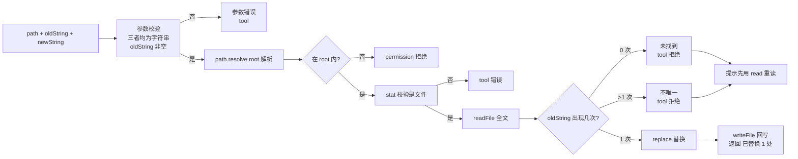

# 21 · Edit Tool

> <span class="stage-badge">Stage Hello Coding Agent</span> · <span class="tag-badge">v21-edit</span>

第二十章，我们给 Coding Agent 装上了第一支笔——**`write`**。它能整文件写入、能覆盖、能自动建目录。兄弟，这章我们要换一种思路：不是再装一支「更大的笔」，而是装一把 **「手术刀」**——**`edit`**。

修改一个文件里的一小段，`write` 要把整个文件重写一遍，那滋味你品品：token 哗哗烧，还可能把不该动的地方也写坏。这一章，我们让 Agent 学会**只动要动的那一处**。

<!-- more -->

## 一、上一版存在什么问题？

第二十章的 `write` 很好用，但它有个与生俱来的毛病——**「整文件覆写」这个动作本身太重了**：

1. **改一行，却要搬整个文件**：把 `Hello, World!` 改成 `Hello, Coding Agent!`，模型得把整个 `greet.ts` 从头到尾再生成一遍——**token 贵**，而且文件的绝大部分内容压根没变；
2. **重写 = 高风险**：模型把 300 行的文件重新吐出来时，非常容易「顺手」改坏别处——漏一行、少一个分号、加错一个逗号，都是重写最经典的翻车现场；
3. **改了什么？不透明**：`write` 只回一句「已写入，覆盖已有文件」——**它没告诉模型「这次到底动了哪些字符」**，diff 的可观察性为零；
4. **和真实世界的编辑习惯脱节**：人类改代码用的是「找 → 换」，是 patch 思维；而 `write` 逼着模型每次都做「全量重建」，思维负担和 token 消耗都高一个量级。

> 一句话：**write 是「整页重抄」，edit 是「局部手术」。修 bug 这种精确活，需要的是手术刀，不是复印机。**

## 二、本篇解决什么问题？

1. **给 Agent 装上 `edit` 工具**：`edit(path, oldString, newString)` 在文件里**精准定位 oldString 并替换成 newString**，其余内容一个字符都不动；
2. **引入「唯一匹配」护栏**：`oldString` 必须**恰好出现一次**——找不到就明确报错让模型重新 `read`，出现多次就报「不唯一」逼模型把上下文写得更具体——**用「可复现的唯一性」兜住 search 的正确性**；
3. **替换可观察**：返回「已替换 1 处：`old → new`」，模型一眼看到这次动了什么，为「改完回读验证」铺路；
4. **支持删除**：`newString` 可以为空字符串——把一段代码「摘掉」，这是 edit 对比 write 的另一层语义（write 只会覆盖，不会删除）；
5. **复用 workspace 边界**：同样的 `resolve` + 包含判断，越界修改一律 `[permission]` 拒绝——**边界是碰文件系统的工具的通用纪律，第 N 次强调了**。

核心心智模型：

> **edit 是「定位 + 替换」：一次调用只改一处。它把「改代码」从「整文件重建」降维成「最小 patch」——token 更省、风险更小、改动可见。**

解决完上面五件事，咱们把线串一下：**上一章留下的「write 整文件覆写太重、token 贵、易改坏别处、改动不可见」这些遗留问题 → 这一章用「edit 工具 + 唯一匹配护栏 + 可观察的替换结果」解决掉 → 接下来看看 Agent 拿到手术刀后修 bug 长什么样。**

### 解决之后，我们收获了什么？

- **Agent 第一次能「精准」改代码**：改一行只发一行，不需要重写整个文件；
- **改错成本大幅下降**：改一行弄坏其余 299 行的风险没了——`edit` 只替换匹配到的片段，其余内容原样保留；
- **改动可观察**：返回值告诉你改了哪一段、从什么变成什么，模型能判断「这次改动对不对」；
- **search 的正确性有护栏兜底**：匹配不到、匹配多个，都直接拒绝而不是瞎改——**宁可让模型重读，也不让它盲改**。

> 一句话收个尾：遗留的「整文件覆写太粗暴」问题被这一章的 `edit` 解决掉，换来的则是「改得精、改得省、改得看得见」三笔实实在在的收获。

## 三、先看最终效果

这一章和前面一样，先不跑真模型，直接驱动 `edit` 工具——九个场景一屏看全：

```bash
$ node --import tsx examples/stage-3/21-edit-tool/demo.mts

=== 1. 唯一匹配 → 精准替换成功 ===
[ok]   edit src/hello.ts "Hello, ${name}!`" → "Hi, ${name}!`"
       → 已替换 1 处：Hello, ${name}!`; → Hi, ${name}!`;（src/hello.ts）
=== 2. oldString 未找到 → 失败（tool） ===
[fail] edit src/hello.ts "nonexistent" → "x"
       → [tool] 在 src/hello.ts 中未找到 oldString，请先用 read 读取文件确认内容
=== 3. oldString 出现多次 → 失败（不唯一） ===
[fail] edit src/hello.ts "greet" → "hi"
       → [tool] oldString 在 src/hello.ts 中出现了 2 次，匹配不唯一；请提供更多上下文让 oldString 唯一
=== 4. oldString 为空 → 失败（tool） ===
[fail] edit src/hello.ts oldString=''
       → [tool] 参数 oldString 必须是非空字符串
=== 5. 路径穿越 ../outside.txt → 拒绝（permission） ===
[fail] path=../outside.txt
       → [permission] 路径超出 workspace 范围，拒绝修改：../outside.txt（解析后 C:\Users\yihui\AppData\Local\Temp\outside.txt）
=== 6. 绝对路径指向 workspace 外 → 拒绝（permission） ===
[fail] path=C:\Users\yihui\AppData\Local\Temp\secret.txt
       → [permission] 路径超出 workspace 范围，拒绝修改：C:\Users\yihui\AppData\Local\Temp\secret.txt（解析后 C:\Users\yihui\AppData\Local\Temp\secret.txt）
=== 7. 目标是目录 → 失败（tool） ===
[fail] path=src
       → [tool] 不是文件，无法修改：src
=== 8. 文件不存在 → 失败（tool） ===
[fail] path=nope.ts
       → [tool] 修改失败：ENOENT: no such file or directory, stat 'C:\Users\yihui\AppData\Local\Temp\hh-21-workspace-fzCaal\nope.ts'
=== 9. newString 为空 → 删除片段 ===
[ok]   edit src/hello.ts "const message" → ""
       → 已替换 1 处：\n\nconst message = greet("harness"); → \n（src/hello.ts）

=== 替换后校验：read 回读 ===
src/hello.ts → "export function greet(name: string): string {\n  return `Hello, ${name}!`;\n}\n\nconsole.log(message);\n"
```

关于上面的输出，小伙伴们请重点注意看四个细节：

- 场景 2、3 是**这一章最核心的护栏**——`oldString` 找不到、或找到了不止一处，**一律拒绝**，绝不瞎改。这是「search」正确性的生命线：**先保证找得准，再谈换得对**；
- 场景 4 拒绝空 `oldString`——空串在文件里「到处都是」，允许它等于允许「全文件替换」，太危险；
- 场景 5、6 依旧是 `[permission]`——**越界这条红线，从 read 到 write 再到 edit，一刻都没松过**；
- 场景 9 的 `newString` 为空，效果是**删除一段**——`edit` 不止能改，还能摘。

### 再跑：把 edit 装进 Chat 对话

上面的 demo 是**直接驱动工具**。这一章的最终目的，是让 Agent 在真实对话里走完「**read 定位 → edit 替换 → read 回读验证**」的完整闭环。`cli/index.ts` 里给 registry 加了一行，把 edit 注册进 `--chat`（workspace root 就是启动 CLI 的目录）：

```bash
$ pnpm dev -- --chat
```

对它说：「请修改 `examples/stage-3/21-edit-tool/workspace/src/hello.ts` 中的问候语，把 Hello, harness! 改成 Hello, Coding Agent!，要求只修改那一处，不要重写整个文件」：


看这条完整链路，它就是修 bug 的标准姿势：

1. **read**：先把文件读回来，看看到底原来的代码长什么样；
2. **edit**：给出 `oldString="harness"`、`newString="Coding Agent"`——**精准定位、精准替换，一个字符都没多改**；
3. **read 回读**：改完再读回来，确认「只有那一处变了，其他代码保持不变」；
4. **基于真实结果作答**：模型说「仅替换了那一行模板字符串中的内容，其他代码保持不变」——这不是猜的，是回读验证过的。

注意 `[tool:end]` 的返回值：`"已替换 1 处：\"harness\" → \"Coding Agent\"（examples/stage-3/21-edit-tool/workspace/src/hello.ts）"`——**改动本身可见、可审计**，这正是 write 整文件覆写做不到的。

## 四、架构变化

```text
src/
├── model/            # Model 层（不变）
├── agent/            # Agent 核心（不变）
├── tools/            # 工具层
│   ├── tool.ts       # Tool / ToolResult（不变）
│   ├── registry.ts   # ToolRegistry（不变）
│   ├── calculator.ts # 玩具工具（不变）
│   ├── random.ts     # 玩具工具（不变）
│   ├── read.ts       # ch19：读文件（不变）
│   ├── write.ts      # ch20：整文件写入（不变）
│   └── edit.ts       # 新增：createEditTool(workspaceRoot) —— 精准 search / replace
├── context/          # 上下文（不变）
├── events/           # 事件（不变）
├── errors/           # 错误（不变）
└── cli/              # CLI
    └── index.ts      # 加一行：registry.register(createEditTool(process.cwd()))，SYSTEM_PROMPT 补一句
```

架构变化依旧是**核心只新增一个 `edit.ts`，CLI 只加一行注册**。但它在演进叙事里的地位很特殊：

> **read / write / edit 是 Coding Agent 的「三件套」：read 负责「看」，write 负责「整建」，edit 负责「精修」。三者各有各的用武之地，共同覆盖「观察 → 修改」的完整动作面。**

工具内部是一条比 write 更精炼的单向流水线——因为它**不新建文件、不建目录、不处理「覆盖」语义**，它只做一件事：**定位，然后替换**。




老架构和新架构，兄弟可以对照着看——同样是「改代码」，用的方法不同，命运完全不同：

| 维度 | 上一版：write（整文件覆写） | 这一版：edit（search / replace） |
| --- | --- | --- |
| 改一行 | 整个文件重新生成 | 只发 `old → new` 两段 |
| token 成本 | 高（全文重发） | 低（只发改动片段） |
| 误伤风险 | 高（重写容易改坏别处） | 低（其余内容原样保留） |
| 改动可见性 | 无（只报「已覆盖」） | 有（返回 old → new） |
| 删除语义 | 无（只能覆盖） | 有（newString 为空即删除） |
| 出错保护 | 无（盲写） | 「唯一匹配」护栏兜底 |

一句话：以前是「改一行就要重写一个文件」，现在是「改一行就真的只改一行」。

## 五、核心抽象

本文对整体架构的影响同样很小，可以理解为新增一个「会精准替换的工具」。拆一下需求：

1. **钉需求**：修 bug 往往是「把某一行 / 某一段改成另一段」。需求就一句：「给模型一个能在 workspace 内精准定位并替换一段文字、且不会改到别处的工具」；

2. **拆设计**：edit 的语义比 write 多一个关键概念——**search 的正确性**。替换本身很容易（`String.prototype.replace`），难的是**保证「找得准」**：
   - **唯一性**：`oldString` 必须恰好出现一次。出现 0 次 → 说明模型记错了文件内容（让它 `read`）；出现多次 → 说明上下文给得不够具体（让它把 `oldString` 加长到唯一）。**宁可不改，不可盲改**；
   - **非空性**：空 `oldString` 在任意位置都能「匹配」，等于允许无差别替换——直接拒绝；
   - **可观察**：返回替换前后的片段，模型和人都能审计这次改动。

3. **克制边界**：**没有做正则替换**（`String.replace` 的字符串语义就是字面量匹配，正则匹配与转义是另一个复杂度层级）、**没有做多 hunk 的完整 patch 格式**（一次只替换一处，多处修改就多次调用）、**没有做 diff 预览 / 行号定位**（那是 TUI 和后续 `patch` 工具的职责）——一个能工作的最小 edit，先保证「找得准、换得对、看得见」。

### 为什么「唯一匹配」是 edit 的生命线？

这是这一章最值得记住的设计决定。

`edit` 的本质是 **search + replace**，而 search 一旦出错，replace 就跟着出错——**找不到是模型该重读，不唯一是模型该加上下文，这两种「搜不准」都必须硬拒绝**：

```ts
const count = content.split(oldString).length - 1;
if (count === 0)  // 没找到 → 明确让模型先 read
if (count > 1)    // 不唯一 → 明确让模型提供更多上下文
```

它带来三个好处：

1. **绝不盲改**：搜不准就不动手，杜绝「replace 到了错误的位置」这类最隐蔽的 bug；
2. **给模型清晰的纠错信号**：报错信息直接告诉模型「该 read」还是「该加上下文」，它下一步该干什么一目了然；
3. **审计友好**：唯一匹配 + 返回值带 old → new，一次 edit 的效果完全确定、可复现。

### 护栏对比：read / write / edit

| 护栏 | read | write | edit |
| --- | --- | --- | --- |
| workspace root | 越界拒绝（`permission`） | 越界拒绝（`permission`） | 越界拒绝（`permission`） |
| `resolve` + 包含判断 | 同 | 同 | 同 |
| `stat` 文件校验 | 读目录 → `tool` | 写目录 → `tool` | 改目录 → `tool` |
| 参数校验 | path 非空字符串 | path + content | path + oldString + newString，**oldString 必须非空** |
| 内容上限 | 8000 字符截断 | 无 | 无 |
| **新增：唯一匹配** | 无 | 无 | 找不到 / 不唯一 → `tool` 拒绝 |
| **新增：删除语义** | 无 | 无 | newString 为空 → 删除片段 |

## 六、实现代码

### EditTool 实现

**`src/tools/edit.ts`**——完整实现：

```ts
import { readFile, stat, writeFile } from "node:fs/promises";
import path from "node:path";
import type { Tool, ToolResult } from "./tool";

export interface EditInput {
  path?: unknown;
  oldString?: unknown;
  newString?: unknown;
}

function snippet(value: string, max = 40): string {
  const flat = value.replace(/\r?\n/g, "\\n");
  return flat.length <= max ? flat : `${flat.slice(0, max)}…`;
}

export function createEditTool(workspaceRoot: string): Tool {
  const root = path.resolve(workspaceRoot);

  return {
    name: "edit",
    description: "在 workspace 内文件中做精准 search / replace 替换：把恰好出现一次的 oldString 替换为 newString，其余内容保持不动；oldString 必须非空、且必须唯一",
    parameters: {
      type: "object",
      properties: {
        path: {
          type: "string",
          description: "相对 workspace 根目录的文件路径，例如 src/index.ts",
        },
        oldString: {
          type: "string",
          description: "要替换的原文片段，必须非空、且在文件中恰好出现一次；不唯一时请包含更多上下文",
        },
        newString: {
          type: "string",
          description: "替换后的新内容，可为空字符串（表示删除该片段）",
        },
      },
      required: ["path", "oldString", "newString"],
    },
    async execute(input: unknown): Promise<ToolResult> {
      const { path: filePath, oldString, newString } = input as EditInput;
      if (typeof filePath !== "string" || filePath.trim() === "") {
        return { ok: false, error: "参数 path 必须是文件路径字符串", kind: "tool", retryable: false };
      }
      if (typeof oldString !== "string" || oldString === "") {
        return { ok: false, error: "参数 oldString 必须是非空字符串", kind: "tool", retryable: false };
      }
      if (typeof newString !== "string") {
        return { ok: false, error: "参数 newString 必须是字符串", kind: "tool", retryable: false };
      }

      const target = path.resolve(root, filePath);
      if (target !== root && !target.startsWith(root + path.sep)) {
        return {
          ok: false,
          error: `路径超出 workspace 范围，拒绝修改：${filePath}（解析后 ${target}）`,
          kind: "permission",
          retryable: false,
        };
      }

      try {
        const info = await stat(target);
        if (!info.isFile()) {
          return { ok: false, error: `不是文件，无法修改：${filePath}`, kind: "tool", retryable: false };
        }

        const content = await readFile(target, "utf-8");
        const count = content.split(oldString).length - 1;
        if (count === 0) {
          return {
            ok: false,
            error: `在 ${filePath} 中未找到 oldString，请先用 read 读取文件确认内容`,
            kind: "tool",
            retryable: false,
          };
        }
        if (count > 1) {
          return {
            ok: false,
            error: `oldString 在 ${filePath} 中出现了 ${count} 次，匹配不唯一；请提供更多上下文让 oldString 唯一`,
            kind: "tool",
            retryable: false,
          };
        }

        const updated = content.replace(oldString, newString);
        await writeFile(target, updated, "utf-8");

        return { ok: true, value: `已替换 1 处：${snippet(oldString)} → ${snippet(newString)}（${filePath}）` };
      } catch (error) {
        const message = error instanceof Error ? error.message : String(error);
        return { ok: false, error: `修改失败：${message}`, kind: "tool", retryable: false };
      }
    },
  };
}
```

**重点关注**这几个设计点：

1. **越界判断和 read / write 一字不差**：`target.startsWith(root + path.sep)`——同一套红线，读、写、改共用。**越界这种事，不该因工具不同而有不同的放行标准**；
2. **`content.split(oldString).length - 1` 数匹配次数**：先「数清楚 oldString 出现几次」，再决定是否动手——**这是 search 正确性的第一道闸门**；
3. **0 次 → 让模型 read**：找不到时错误信息直接说「请先用 read 读取文件确认内容」——它大概率记错了文件内容，该去重读，而不是继续盲试；
4. **>1 次 → 让模型加上下文**：不唯一时报出具体次数，并给出解法「请提供更多上下文让 oldString 唯一」——**错误的诊断信息本身就是给模型的纠错指令**；
5. **`String.replace(oldString, newString)` 的字符串语义是「字面量匹配、替换第一处」**：结合上面的 `count === 1` 校验，这里刚好替换到唯一那一处——**没有正则、没有转义，教学最小版**；
6. **返回值带 `snippet` 化的 old → new**：多行片段会被折叠成 `\n` 展示，防止把整个文件内容又灌回上下文——**改动可观察，但不撑爆上下文**。

> 和前面一样，这份实现是「教学最小版」：没有正则替换、没有多 hunk patch、没有 diff 预览、没有原子写入。看到这里觉得「edit 哪有这么简单」的兄弟，耐下性子——「一次只改一处」的局限我们会在本章结尾说明，`Workspace`（23 章）会统一这堆散装的环境抽象。

### 工具注册使用

沿着 ch10 的工具注册策略，把 edit 注册进 MiniHarnessCli——同样是一行 + 系统提示词补一句：

```ts
registry.register(createReadTool(process.cwd()));
registry.register(createWriteTool(process.cwd()));
registry.register(createEditTool(process.cwd()));

const SYSTEM_PROMPT = "你是一个简洁、直接的中文助手，工具可以使用时必须调用工具；对于复杂的数学计算，你应该拆分成多个简单的表达式，进行多次的工具调用；当用户询问代码内容或涉及文件时，必须使用 read 工具读取后基于真实内容回答，不要猜文件内容；当需要创建新文件或修改已有文件内容时，使用 write 工具写入完整内容，不要直接编造结果；当需要修改已有文件中的一小段内容时，优先使用 edit 工具做精准替换，而不是用 write 重写整个文件";
```

注意提示词里的关键一句：

- **「修改已有文件中的一小段内容时，优先使用 edit 工具做精准替换，而不是用 write 重写整个文件」**——这是给模型的**工具选择方法论**：新建 / 整体改写用 write，局部微调用 edit。**工具不是越多越好，而是「什么场景用什么工具」要教给模型**。

## 七、运行 Demo

这一章的演示同样有两种跑法：

**跑法一：直接驱动工具**——不需要模型、不需要 API Key，会在临时目录里自动建一个 workspace 演示完再清理掉：

```bash
node --import tsx examples/stage-3/21-edit-tool/demo.mts
```

输出就是第三节第一屏。九个场景，一一对应工具的参数校验、workspace 边界、唯一匹配护栏、删除语义与错误处理：

| 场景 | 验证点 |
| --- | --- |
| 唯一匹配替换 | `count === 1` → 替换成功，返回 old → new |
| `oldString` 未找到 | `count === 0` → `[tool]`，提示先 read |
| `oldString` 出现多次 | `count > 1` → `[tool]`，提示加上下文 |
| `oldString` 为空 | 参数校验 → `[tool]` |
| `../outside.txt` 穿越 | 包含判断：越界 → `[permission]` |
| 绝对路径指向 workspace 外 | 包含判断：越界 → `[permission]` |
| 目标是目录 `src` | `stat` 校验：目录 → `[tool]` |
| 文件不存在 | `stat` 抛错 → `[tool]` 带底层错误信息 |
| `newString` 为空 | 删除片段 → 返回 old →（空） |
| 替换后 `read` 回读 | 文件内容只变了目标片段 → 写真的精准落盘了 |

**跑法二：装进 Chat 对话**——需要配好 `.env`（真实模型）：

```bash
pnpm dev -- --chat
# 你 > 请修改 src/greet.ts 中的问候语，把 Hello, World! 改成 Hello, Coding Agent!，要求只修改那一处，不要重写整个文件
```


```text
你 > 请修改 `examples/stage-3/21-edit-tool/workspace/src/hello.ts` 中的问候语，把 Hello, harness! 改成 Hello, Coding Agent!，要求只修改那一处，不要重写整个文件
[run:start ] Run ID : 56efd4bc-d294-4826-82a7-6865b89923a8
[run:start ] Input  : 请修改 `examples/stage-3/21-edit-tool/workspace/src/hello.ts` 中的问候语，把 Hello, harness! 改成 Hello, Coding Agent!，要求只修改那一处，不要重写整个文件
[model:start] 思考中 …

[model:end ] 调用工具：read · 897 in / 108 out · 4651ms
Step 1 · model  → 调用工具：read
[tool:start] read({"path":"examples/stage-3/21-edit-tool/workspace/src/hello.ts"})
[tool:end  ] → "export function greet(name: string): string {\r\n  return `Hello, ${name}!`;\r\n}\r\n\r\nconst message = greet(\"harness\");\r\nconsole.log(message);\r\n" · 2ms
Step 2 · tool   → read({"path":"examples/stage-3/21-edit-tool/workspace/src/hello.ts"}) = "export function greet(name: string): string {\r\n  return `Hello, ${name}!`;\r\n}\r\n\r\nconst message = greet(\"harness\");\r\nconsole.log(message);\r\n"
[model:start] 思考中 …

[model:end ] 调用工具：edit · 1030 in / 347 out · 8285ms
Step 3 · model  → 调用工具：edit
[tool:start] edit({"path":"examples/stage-3/21-edit-tool/workspace/src/hello.ts","oldString":"\"harness\"","newString":"\"Coding Agent\""})
[tool:end  ] → "已替换 1 处：\"harness\" → \"Coding Agent\"（examples/stage-3/21-edit-tool/workspace/src/hello.ts）" · 3ms
Step 4 · tool   → edit({"path":"examples/stage-3/21-edit-tool/workspace/src/hello.ts","oldString":"\"harness\"","newString":"\"Coding Agent\""}) = "已替换 1 处：\"harness\" → \"Coding Agent\"（examples/stage-3/21-edit-tool/workspace/src/hello.ts）"
[model:start] 思考中 …

[model:end ] 调用工具：read · 1173 in / 69 out · 1712ms
Step 5 · model  → 调用工具：read
[tool:start] read({"path":"examples/stage-3/21-edit-tool/workspace/src/hello.ts"})
[tool:end  ] → "export function greet(name: string): string {\r\n  return `Hello, ${name}!`;\r\n}\r\n\r\nconst message = greet(\"Coding Agent\");\r\nconsole.log(message);\r\n" · 1ms
Step 6 · tool   → read({"path":"examples/stage-3/21-edit-tool/workspace/src/hello.ts"}) = "export function greet(name: string): string {\r\n  return `Hello, ${name}!`;\r\n}\r\n\r\nconst message = greet(\"Coding Agent\");\r\nconsole.log(message);\r\n"
[model:start] 思考中 …
修改已完成。将 `greet` 调用的参数从 `"harness"` 替换为 `"Coding Agent"`，执行后控制台输出会变为 `Hello, Coding Agent!`。最终文件内容如下：

export function greet(name: string): string {
  return `Hello, ${name}!`;
}

const message = greet("Coding Agent");
console.log(message);

[model:end ] 完成回答 · 1307 in / 134 out · 2323ms
Step 7 · model  → 完成回答
Step 8 · finish → finished
[run:end   ] completed (finished) · 16983ms
Answer  : 修改已完成。将 `greet` 调用的参数从 `"harness"` 替换为 `"Coding Agent"`，执行后控制台输出会变为 `Hello, Coding Agent!`。最终文件内容如下：


export function greet(name: string): string {
  return `Hello, ${name}!`;
}

const message = greet("Coding Agent");
console.log(message);

Steps   : 4 轮 · 8 条消息 · 8 步 · 16983ms
Tokens  : 4407 in / 658 out
Status  : completed (finished)
```

我们可以仔细看一下它的完整输出

输出就是第三节第二屏：模型**自动**走出「read → edit → read」的完整链路——先读文件定位，再精准替换，改完回读验证，最后基于验证结果作答。

## 八、新架构解决了什么？

- **Agent 第一次能「精准」改代码**：改一行只发 `old → new`，不再整文件重写——token 省了，改坏别处的风险也没了；
- **search 的正确性有了护栏**：找不到 / 不唯一都硬拒绝，并且报错信息就是给模型的纠错指令（「去 read」「加上下文」）——**宁可不改，不可盲改**；
- **改动可观察、可审计**：返回值带回 `已替换 1 处：old → new`，模型和人一眼看到这次动了什么；
- **有了「删除」语义**：`newString` 为空即删除片段——这是 write 永远做不到的（write 只会覆盖）；
- **「修改后验证」闭环完全成型**：配合 read 工具，Agent 已经能走出「先读 → 再改 → 回读确认」的标准修 bug 流程——**第 24 章 System Prompt 的方法论，在工具层面已经全部就位**；
- **工具选择方法论开始出现**：System Prompt 开始告诉模型「局部修改用 edit、整体改写用 write」——**工具在变多，选择工具的智慧也要跟上**。

## 九、它又引入了什么问题？

手术刀拿到手了，可兄弟们，用着用着你会发现这把刀一点都不锋利：

- **一次只能改一处**：多处修改要调用多次 edit——如果一次要改 5 处，就是 5 次 round trip；「一次提交、多处 hunk」的**完整 patch 语义还没有**；
- **没有正则匹配**：`String.replace` 的字符串语义是字面量匹配——想「把所有 `foo` 换成 `bar`」或「把第 3 行那种模式全替换」，edit 做不到，得循环调用；
- **没有 diff 预览、没有行号定位**：模型看不到「这次改动的 diff 长什么样」，`oldString` 也必须是「完整片段」而不是「第 X 行附近」——**diff 可视化要等 TUI（39 章）**；
- **没有原子性与备份**：`readFile → replace → writeFile` 三步之间如果进程崩溃，文件可能停留在中间态；也没有任何版本可回滚——「先写临时文件再 rename」的原子写入和「备份/版本」依旧空白；
- **`oldString` 本身可能「出问题」**：文件里有相同片段但语义不同（比如两个同名变量），模型得手动加上下文让它唯一——**上下文拼装是模型的心智负担**，后续可以用「多行 + 唯一锚点」等技巧优化；
- **symlink 依旧防不住**：和 read / write 一样，`startsWith` 校验的是路径字符串，workspace 里的 symlink 指向外部时依旧可能改出去——真实路径校验（realpath）待补；
- **workspace 还是散装的**：read、write、edit 各自 `createXxxTool(root)` 自管环境，**统一抽象（Workspace 类）在第 23 章**；
- **真正的高风险操作还没有 Permission Gate**：edit 也是「有副作用的写」，目前直接执行、不需要确认——「改之前要不要问一下人」要等 Stage 4 的 Permission Gate。

## 十、下一章

> **本章小结**：这一章给 Coding Agent 装上一把手术刀——**`edit` 工具**。它用「唯一匹配」护栏兜住 search 的正确性（找不到就 read、不唯一就加上下文），用 `String.replace` 实现最小 patch（只替换匹配片段、其余内容原样保留），并支持 `newString` 为空即删除片段。我们立住了一个新的心智模型：**edit 是「定位 + 替换」，一次调用只改一处；改代码不是整文件重建，而是最小 patch**。至此，read / write / edit 三件套齐了，Agent 能看、能建、能精修。

**下一章：Bash Tool**——光会读写文件，还不是真正的程序员：

- 修 bug 改完代码，怎么知道改对了？——得**跑起来看结果**（`npm test` / `tsc`）；
- Agent 需要观察项目结构时，`read` 读不了目录——得**执行 `ls` / `grep`**；
- 读、写、改都是「静态」操作，而真实开发是「动态」的：**编译、测试、运行、检查输出**。

而 Bash 是**第一次进入高风险工具**——它能让 Agent 执行任意命令，一旦跑错可能毁掉整个项目。所以我们得给它加上 `cwd`、`timeout`、`stdout` / `stderr`、`exitCode`、`grep` 这些护栏——**这是整个系列第一次直面「工具可以造成真实破坏」的场景**，也是 Permission Gate 真正的练兵场。

所以下一章，我们从 `bash` 开始，把「能看能改」升级成「能跑能验」😊，欢迎点赞、关注公众号「一灰灰Blog」 我们下章见

---

微信公众号: 一灰灰Blog
