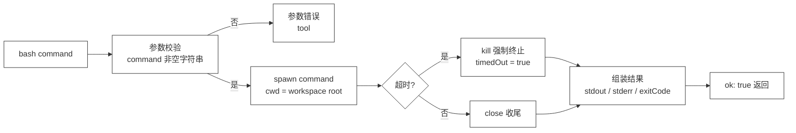

# 22 · Bash Tool

> <span class="stage-badge">Stage Hello Coding Agent</span> · <span class="tag-badge">v22-bash</span>

第二十一章，我们给 Coding Agent 装上了手术刀——**`edit`**。它能精准地改一处代码。兄弟，这一章我们要装的东西更硬核：**`bash`**——让 Agent 真正 **「跑」**起来。

读、写、改，都是「静态」操作；而真实开发是「动态」的——编译、测试、运行、看输出、验结果。这一章，我们让 Agent 第一次能**执行命令**，也因此第一次直面「工具可以造成真实破坏」的高风险场景。

<!-- more -->

## 一、上一版存在什么问题？

到上一章为止，Coding Agent 手里有「三件套」：`read` 能看、`write` 能建、`edit` 能改。可兄弟们，这三件套全是**静态文件操作**，一旦进入真实开发，可能发现这还是不够呀：

1. **改完代码，怎么知道改对了？**——`read` 只能把文件读回来，**它跑不了 `npm test`、编译不了 TypeScript、执行不了任何命令**。「修复这个 bug」的闭环在「验证」这一步永远断着；
2. **看不了项目结构**——`read` 只能读单个文件，**它读不了目录**。Agent 想知道「项目里有哪些文件、目录长什么样」，没有任何工具能回答，总不能让我们每次指定全路径的文件让CodingAgent来进行定位吧；
3. **缺了「观察真实世界」的渠道**——静态文本是「纸面」，而 `ls`、`grep`、`node` 的输出是「现场」。一个只会读纸面的 Agent，永远不知道代码跑起来到底是什么样；
4. **验证只能靠模型「自说自话」**——没有执行结果兜底，模型说「修好了」就是「修好了」，没有 exitCode、没有 stdout 给它打脸的机会。

> 一句话：**read / write / edit 让 Agent 能「看」和「改」，但缺了关键的「找」和改完没地方「验」——修 bug 的闭环缺了最关键的一环：执行。**

## 二、本篇解决什么问题？

1. **给 Agent 装上 `bash` 工具**：`bash(command)` 在 workspace 根目录下执行一条 shell 命令，把结果交回给模型；
2. **`cwd` 边界**：命令运行在**固定的 workspace 根目录**下——它不会在项目外的任意目录瞎跑；
3. **`timeout` 护栏**：命令超过时限被**强制终止**，绝不无限等待——这是高风险工具的第一道刹车；
4. **`stdout` / `stderr` 分离捕获**：命令的「正常输出」和「错误输出」分开回传，模型能精确看到程序到底说了什么；
5. **`exitCode` 可观察**：命令的退出码原样保留——`0` 是成功、非 `0` 是失败，**模型的判断建立在真实执行结果上，而不是「我觉得它应该能跑」**；
6. **超长输出自动截断**：命令可能吐出海量日志，返回给模型的内容有上限，防爆上下文。

核心心智模型：

> **bash 是 Coding Agent 与真实世界的执行通道。它把「命令 → 进程 → stdout / stderr → exitCode」这条真实的运行链路，原样呈现给模型——模型不再靠猜，而是靠跑。**

解决完上面六件事，咱们把线串一下：**上一章留下的「改完没地方验、看不了目录、验证靠自说自话」这些遗留问题 → 这一章用「bash 工具 + cwd / timeout / stdout / stderr / exitCode 全套护栏」解决掉 → 接下来看看 Agent 第一次「跑」起来长什么样。**

### 解决之后，我们收获了什么？

- **Agent 第一次能「跑」代码**：`node src/index.ts`、`npm test`、`tsc --noEmit`……想怎么跑就怎么跑，**修 bug 的「验证」闭环第一次被真正接通**；
- **判断建立在真实结果上**：`exitCode` + `stdout` + `stderr` 三件证据在手，模型说「修好了」就真的是修好了——**执行结果成了唯一的事实来源**；
- **看目录不再是盲区**：`ls`、`dir`、`grep -r` 一条命令搞定，项目结构对 Agent 不再是黑盒；
- **高风险工具的第一批护栏就位**：`timeout` 刹车、`cwd` 圈地、输出截断防爆——**允许它跑，但跑得有边界、跑不失控**。

> 一句话收个尾：遗留的「改完没地方验」问题被这一章的 `bash` 解决掉，换来的则是「能跑、能验、能看现场、跑不失控」四笔实实在在的收获。

## 三、先看最终效果

这一章和前面一样，先不跑真模型，直接驱动 `bash` 工具——八个场景一屏看全（注意：demo 的输出展示做了截断，命令本身真实执行）：

```bash
$ node --import tsx examples/stage-3/22-bash-tool/demo.mts

=== 1. 正常执行 → stdout 捕获、exitCode 0 ===
[ok]   bash("echo hello harness")
       → exitCode : 0
         stdout   : "hello harness\r\n"
         stderr   : ""
=== 2. 命令运行在 workspace 根目录（cwd 生效） ===
[ok]   bash("node -e \"console.log(process.cwd())\"")
       → exitCode : 0
         stdout   : "C:\\Users\\bangz\\AppData\\Local\\Temp\\hh-22-workspace-irJPLa\n"
         stderr   : ""
=== 3. stdout / stderr 分离捕获 ===
[ok]   bash("node -e \"console.log(1); console.error(2)\"")
       → exitCode : 0
         stdout   : "1\n"
         stderr   : "2\n"
=== 4. 非零退出码 → 结果仍返回，exitCode 保留 ===
[ok]   bash("node -e \"process.exit(3)\"")
       → exitCode : 3
         stdout   : ""
         stderr   : ""
=== 5. 超时 → 强制终止，timedOut 标记 ===
[ok]   bash("node -e \"setTimeout(()=>{}, 10000)\"")
       → exitCode : null（超时被终止）
         stdout   : ""
         stderr   : ""
=== 6. 超长输出 → 自动截断 ===
[ok]   bash("node -e \"console.log(\'A\'.repeat(20000))\"")
       → exitCode : 0
         stdout   : AAAAAAAAAAAAAAAAAAAAAAAAAAAAAAAAAAAAAAAAAAAAAAAAAAAAAAAAAAAAAAAAAAAAAAAAAAAAAAAAAAAAAAAAAAAAAAAAAAAA…（8022 字符）
         stderr   : ""
=== 7. command 缺失 → 拒绝（tool） ===
[fail] bash()
       → [tool] 参数 command 必须是字符串
=== 8. command 非字符串 → 拒绝（tool） ===
[fail] bash(123)
       → [tool] 参数 command 必须是字符串
```

请各位小伙伴注意这四个细节：

- 场景 1 的 `stdout` 是 `hello harness\r\n`——**命令真的跑了**，输出被原样捕获；场景 3 里 `1` 进了 `stdout`、`2` 进了 `stderr`，**两条通道分开回传，互不污染**；
- 场景 2 的 `cwd` 指向的就是 demo 建的临时 workspace——**命令默认跑在 workspace 根目录，不是乱跑**；
- 场景 4 的命令 `process.exit(3)` 返回 `exitCode: 3`——注意它**不是 `[fail]`**！命令执行本身成功了，只是程序自己退了非零码。**这就是 bash 的设计核心：命令「跑完了」和「跑成功了」是两回事，都交给模型去判断**；
- 场景 5 用 500ms 超时打一个 `setTimeout(10000)` 的命令——**超时被强制杀掉，`exitCode` 变成 `null`，并打上 `timedOut` 标记**，模型一眼看出「命令是被掐断的，不是跑完了」。

### 再跑：把 bash 装进 Chat 对话

上面的 demo 是**直接驱动工具**。这一章的最终目的，是让 Agent 在真实对话里走完「**read 定位 → bash 验证 → edit 修复 → bash 再验**」的完整闭环。`cli/index.ts` 里给 registry 加了一行，把 bash 注册进 `--chat`（workspace root 就是启动 CLI 的目录）：

```bash
$ pnpm dev -- --chat
```

对它说：「请帮我补齐现在当前项目下 math.ts 中的逻辑实现，我希望再这个文件中实现一个 sum() 函数」，这个输出长度有点多，我们在实际验证时，发现一轮对话它还没搞定😀


- 第一轮对话，它直接去读取 `math.ts` 文件不存在，重试两次依然失败，就中断异常返回了
- 第二轮对话，我们告诉它可以使用bash工具，查一下这个文件在哪里；然后它吭呲吭呲调用bash工具，找到位置了(在下面的 Step  5 终于使用 where 命令找到了具体的路径)

找到位置之后，接下来就朝着我们预期的方向前进了

```bash
Step 5 · tool   → bash({"command":"where /r . math.ts 2>nul || findstr /m . *.ts 2>nul"}) = {"command":"where /r . math.ts 2>nul || findstr /m . *.ts 2>nul","cwd":"D:\\Workspace\\hui\\project\\hello-harness","stdout":"D:\\Workspace\\hui\\project\\hello-harness\\examples\\stage-3\\22-bash-tool\\src\\math.ts\r\nD:\\Workspace\\hui\\project\\hello-harness\\node_modules\\.pnpm\\katex@0.16.47\\node_modules\\katex\\src\\functions\\math.ts\r\nD:\\Workspace\\hui\\project\\hello-harness\\node_modules\\.pnpm\\mermaid@11.16.1\\node_modules\\katex\\src\\functions\\math.ts\r\nD:\\Workspace\\hui\\project\\hello-harness\\node_modules\\.pnpm\\node_modules\\katex\\src\\functions\\math.ts\r\n","stderr":"","exitCode":0,"timedOut":false}
[model:start] 思考中 …

[model:end ] 调用工具：read · 2088 in / 86 out · 2755ms
Step 6 · model  → 调用工具：read
[tool:start] read({"path":"examples\\stage-3\\22-bash-tool\\src\\math.ts"})
[tool:end  ] → "function calculate() {\r\n\t// 这个数学计算怎么实现呢？\r\n}" · 2ms
Step 7 · tool   → read({"path":"examples\\stage-3\\22-bash-tool\\src\\math.ts"}) = "function calculate() {\r\n\t// 这个数学计算怎么实现呢？\r\n}"
[model:start] 思考中 …

[model:end ] 调用工具：write · 2190 in / 272 out · 4573ms
Step 8 · model  → 调用工具：write
[tool:start] write({"path":"examples\\stage-3\\22-bash-tool\\src\\math.ts","content":"/**\n * 计算一组数字的总和\n * @param numbers 数字数组\n * @returns 所有数字的总和\n */\nfunction sum(...numbers: number[]): number {\n    return numbers.reduce((total, num) => total + num, 0);\n}\n\n// 导出以便在其他模块中使用\nexport { sum };"})
[tool:end  ] → "已写入 examples\\stage-3\\22-bash-tool\\src\\math.ts（202 字符，覆盖已有文件）" · 3ms
Step 9 · tool   → write({"path":"examples\\stage-3\\22-bash-tool\\src\\math.ts","content":"/**\n * 计算一组数字的总和\n * @param numbers 数字数组\n * @returns 所有数字的总和\n */\nfunction sum(...numbers: number[]): number {\n    return numbers.reduce((total, num) => total + num, 0);\n}\n\n// 导出以便在其他模块中使用\nexport { sum };"}) = "已写入 examples\\stage-3\\22-bash-tool\\src\\math.ts（202 字符，覆盖已有文件）"
[model:start] 思考中 …
已完成！以下是 `math.ts` 中实现的 `sum()` 函数：

/**
 * 计算一组数字的总和
 * @param numbers 数字数组
 * @returns 所有数字的总和
 */
function sum(...numbers: number[]): number {
    return numbers.reduce((total, num) => total + num, 0);
}

// 导出以便在其他模块中使用
export { sum };

**实现说明：**
- 使用剩余参数 `...numbers: number[]`，支持传入任意数量的参数（例如 `sum(1, 2, 3)` 或 `sum(1, 2)`）。
- 内部通过 `reduce` 累加求和，初始值为 `0`，简洁高效。
- 添加了 JSDoc 注释以便 IDE 提示。
- 最后通过 `export` 导出，方便在其他文件里导入使用。

如果你还需要在这个文件中添加其他数学函数（比如 `average`、`max`、`min` 等），告诉我即可。

... 省略后面的返回
```

接下来我们进行第三轮对话，让它再执行验证下写的函数对不对


虽然上面的实现过程不是很顺畅，但是经过了我们的多轮对话，也算是完成了我们的诉求。换句话来说，这个多轮的对话、多次工具的调用过程，不也正体现了我们之前实现的Agent Loop的力量吗，如果只有简单的LLM调用，可能就抓瞎啦

当然我们更希望的是一句话，就能完成我们的目的，比如

1. **bash**: 先通过 bash 命令，找一下文件再什么地方
1. **read**: 读取下当前这个文件的具体实现，看看我们要怎么改
3. **edit**：精准实现我们需要完成的结果
4. **bash 再跑**：验证下我们的实现函数是否有误

## 四、架构变化

```text
src/
├── model/            # Model 层（不变）
├── agent/            # Agent 核心（不变）
├── tools/            # 工具层
│   ├── tool.ts       # Tool / ToolResult（不变）
│   ├── registry.ts   # ToolRegistry（不变）
│   ├── calculator.ts # 玩具工具（不变）
│   ├── random.ts     # 玩具工具（不变）
│   ├── read.ts       # ch19：读文件（不变）
│   ├── write.ts      # ch20：整文件写入（不变）
│   ├── edit.ts       # ch21：精准替换（不变）
│   └── bash.ts       # 新增：createBashTool(workspaceRoot) —— 第一个高风险工具
├── context/          # 上下文（不变）
├── events/           # 事件（不变）
├── errors/           # 错误（不变）
└── cli/              # CLI
    └── index.ts      # 加一行：registry.register(createBashTool(process.cwd()))，SYSTEM_PROMPT 补一句
```

架构变化依旧极小——**核心只新增一个 `bash.ts`，CLI 只加一行注册**。但它在演进叙事里的分量，比前三个工具加起来都重：

> **read / write / edit 是「静态三件套」，bash 是「动态执行通道」。从 bash 开始，工具从「碰文件」进入「跑进程」——副作用级别从「改一个文件」跃升到「执行任意命令」,这是整个系列第一次真正需要把「高风险」三个字写在护栏上。**

工具内部是一条「进程级」的单向流水线：




上一版的读、写、更新，对别这一章的bashTool，大家可以对比一下——从「静态三件套」到「执行通道」，Coding Agent 的能力面发生了质变：

| 维度 | 上一版：read / write / edit（静态） | 这一版：+ bash（动态） |
| --- | --- | --- |
| 改完能不能验 | 不能，靠模型自说自话 | 能，`node src/math.js` 一跑便知 |
| 看项目结构 | 读不了目录 | `ls` / `dir` 一条命令 |
| 事实来源 | 文件文本（纸面） | 进程输出（现场） |
| 副作用级别 | 改文件 | 执行任意命令（高风险） |
| 护栏重点 | 路径边界 / 唯一匹配 | **cwd 圈地 / timeout 刹车 / 输出截断** |
| 结果语义 | 失败即 `ok:false` | **非零退出码 ≠ 工具失败**，交给模型判断 |

一句话：以前是「能看能改的文档管理员」，现在是「能跑能验、看得见真实执行现场的工程师」。

> 注：bash 的护栏和 read / write / edit 有本质不同——路径工具防的是「碰错地方」，bash 防的是「跑失控」。前者用 `[permission]` 划红线，后者用 `timeout` 踩刹车。

## 五、核心抽象

本文对整体架构的影响同样很小，可以理解为新增一个「会执行命令的工具」。拆一下需求：

1. **钉需求**：Coding Agent 要验证代码、看目录、跑测试。需求就一句：「给模型一个能在 workspace 根目录执行命令、并把执行结果完整带回来的工具」；

2. **拆设计**：bash 和其他工具最大的不同是——**它的「结果」不是一个值，而是一段执行记录**。所以结果必须是结构化、可观察的：
   - **`stdout` / `stderr`**：进程的两条输出通道分开捕获，模型能区分「程序正常说的」和「程序抱怨的」；
   - **`exitCode`**：进程的退出码原样保留——`0` 成功、非 `0` 失败，**判断权完全交给模型**；
   - **`timedOut`**：超时被打断时标记出来，`exitCode` 置 `null`——**模型能看出「命令是跑完了还是被掐断的」**；
   - **`cwd`**：命令在哪个目录跑的，写进结果，模型心里有数。

3. **克制边界**：**没有做命令白名单 / 黑名单**（「允许哪些命令」是 Permission Gate 的职责，第 37 章）、**没有做 `bash` 之外的更细粒度 shell 抽象**（`git` / `npm` 等专属工具是后续演进）、**没有做交互式进程**（一次命令一个进程，`spawn` 完就等它结束）—— 我们这一篇的目的是先来一个能工作的最小 bash，先保证「跑得起、看得到、停得下」。

### 为什么「非零退出码」不算工具失败？

这是这一章最反直觉、也最重要的一个设计决定。

`read` / `write` / `edit` 里，**操作失败 = `ok: false`**——文件读不到、替换不唯一，这些是工具「没干成活」，要报错。

但 `bash` 不一样：**命令执行本身成功了，程序却可能返回非零码**。

```ts
child.on("close", (code) => {
  resolve({
    ok: true,   // 命令「跑完了」就是 ok
    value: { stdout, stderr, exitCode: code, timedOut },
  });
});
```

`node src/math.js` 输出 `sum(2, 3) = -1` 时 `exitCode` 是 `0`——程序没「报错」，但它暴露了一个 bug。如果 bash 把非零码当 `ok: false`，模型就看不到 `-1` 这个关键证据了。**bash 的职责不是替模型判断「成功还是失败」，而是把执行结果原样交给模型判断。**

> 一句话：**「命令跑完了」和「程序成功了」是两件事。bash 只负责前者，后者交给模型结合 exitCode + stdout 去判断——工具不越位，模型才有完整信息。**

### 为什么 bash 要自己管 timeout？

这也是一个容易忽略的设计点。

我们之前的 Runtime（第 17 章）已经有一个工具级 `toolTimeoutMs` 护栏。那 bash 为什么还要在**工具内部**再管一次超时？

```ts
const timer = setTimeout(() => {
  timedOut = true;
  child.kill("SIGKILL");   // 杀的是「进程」，不是 Promise
}, timeoutMs);
```

因为 Runtime 的 `withGuard` 超时**只能取消 Promise，杀不掉已经 spawn 出来的子进程**——Promise 一超时就被扔了，但 `node` / `npm` 进程还在后台裸奔。**bash 必须自己在进程层面管理超时，才能真正把失控的命令掐死。** 这是「进程资源」和「异步任务」的本质区别，也是我们第一次在工具层面对抗「资源泄漏」这类真实世界的问题。

### 护栏对比：read / write / edit / bash

| 护栏 | read / write / edit | bash |
| --- | --- | --- |
| workspace root | 路径越界拒绝（`permission`） | **`cwd` 圈定命令运行目录** |
| 参数校验 | path / content / oldString | command 非空字符串 |
| 超时 | 无（工具内） | **`timeout` + `kill` 强杀进程** |
| 输出上限 | read 8000 字符截断 | **stdout / stderr 各 8000 字符截断** |
| 失败语义 | 操作失败 → `ok:false` | **命令跑完即 `ok:true`，`exitCode` 交给模型判断** |
| **新增：进程管理** | 无 | spawn / timeout kill / close 收尾 |

## 六、实现代码

### BashTool 实现

**`src/tools/bash.ts`**——完整实现：

```ts
import { spawn } from "node:child_process";
import path from "node:path";
import type { Tool, ToolResult } from "./tool";

export const MAX_OUTPUT_CHARS = 8000;

export interface BashInput {
  command?: unknown;
}

export interface BashResult {
  command: string;
  cwd: string;
  stdout: string;
  stderr: string;
  exitCode: number | null;
  timedOut: boolean;
}

function truncate(text: string, max: number): string {
  if (text.length <= max) return text;
  return `${text.slice(0, max)}\n...（已截断：输出超过 ${max} 字符）`;
}

export function createBashTool(workspaceRoot: string, options: { timeoutMs?: number } = {}): Tool {
  const root = path.resolve(workspaceRoot);
  const timeoutMs = options.timeoutMs ?? 10_000;

  return {
    name: "bash",
    description: "在 workspace 根目录下执行一条 shell 命令，返回 stdout / stderr / exitCode；命令必须非空，超时会强制终止",
    parameters: {
      type: "object",
      properties: {
        command: {
          type: "string",
          description: "要执行的 shell 命令，例如 node src/index.ts 或 npm test",
        },
      },
      required: ["command"],
    },
    async execute(input: unknown): Promise<ToolResult> {
      const { command } = input as BashInput;
      if (typeof command !== "string" || command.trim() === "") {
        return { ok: false, error: "参数 command 必须是字符串", kind: "tool", retryable: false };
      }

      return new Promise<ToolResult>((resolve) => {
        let stdout = "";
        let stderr = "";
        let timedOut = false;
        let settled = false;

        const child = spawn(command, { cwd: root, shell: true, windowsHide: true });

        const timer = setTimeout(() => {
          timedOut = true;
          child.kill("SIGKILL");
        }, timeoutMs);

        child.stdout.on("data", (chunk) => {
          stdout += chunk;
        });
        child.stderr.on("data", (chunk) => {
          stderr += chunk;
        });

        child.on("error", (error) => {
          if (settled) return;
          settled = true;
          clearTimeout(timer);
          resolve({ ok: false, error: `命令启动失败：${error.message}`, kind: "tool", retryable: false });
        });

        child.on("close", (code) => {
          if (settled) return;
          settled = true;
          clearTimeout(timer);
          resolve({
            ok: true,
            value: {
              command,
              cwd: root,
              stdout: truncate(stdout, MAX_OUTPUT_CHARS),
              stderr: truncate(stderr, MAX_OUTPUT_CHARS),
              exitCode: timedOut ? null : code,
              timedOut,
            },
          });
        });
      });
    },
  };
}
```

**重点关注**这几个设计点：

1. **`spawn(command, { cwd: root, shell: true, windowsHide: true })`**：命令在 workspace 根目录下启动、走系统 shell、Windows 下不弹黑窗口——`cwd` 是 bash 的「圈地」，不是参数而是环境；
2. **超时 = 杀进程，不是杀 Promise**：`setTimeout` 到点就 `child.kill("SIGKILL")` 强杀进程，并标记 `timedOut = true`——**这是 bash 对 Runtime 层 `toolTimeoutMs` 的补位：Promise 超时只能丢任务，进程超时必须杀进程**；
3. **`stdout` / `stderr` 分别挂 `data` 监听**：两条通道分开累积，最后分开放进结果——模型能精确区分「程序正常输出」和「错误信息」；
4. **`child.on("close", ...)` 统一收尾**：进程结束（无论正常退出还是被 kill）都在这里 resolve——`exitCode` 正常时是数字，超时置 `null`；
5. **`settled` 防双收**：`error` 和 `close` 都可能触发，用 `settled` 保证只 resolve 一次，避免重复回调；
6. **结果始终 `ok: true`（命令跑完）**：非零退出码不是工具失败——**bash 只负责把执行记录交出来，成功与否是模型结合 exitCode 的判断**；
7. **输出截断**：`stdout` / `stderr` 各截 8000 字符并标注——**命令可能吐海量日志，但回到上下文的内容必须有上限**。

> 和前面一样，这份实现是「教学最小版」：没有命令白名单、没有更细粒度的 shell 封装、没有交互式终端。看到这里觉得「bash 哪有这么简单」的兄弟，耐下性子——「允许哪些命令」是 Permission Gate（37 章）的职责，`Workspace`（23 章）会统一环境抽象。

### 工具注册使用

沿着 ch10 的工具注册策略，把 bash 注册进 MiniHarnessCli——同样是一行 + 系统提示词补一句：

```ts
registry.register(createReadTool(process.cwd()));
registry.register(createWriteTool(process.cwd()));
registry.register(createEditTool(process.cwd()));
registry.register(createBashTool(process.cwd()));

const SYSTEM_PROMPT = "你是一个简洁、直接的中文助手，工具可以使用时必须调用工具；对于复杂的数学计算，你应该拆分成多个简单的表达式，进行多次的工具调用；当用户询问代码内容或涉及文件时，必须使用 read 工具读取后基于真实内容回答，不要猜文件内容；当需要创建新文件或修改已有文件内容时，使用 write 工具写入完整内容，不要直接编造结果；当需要修改已有文件中的一小段内容时，优先使用 edit 工具做精准替换，而不是用 write 重写整个文件；当需要查看目录结构、执行命令或验证代码运行结果时，使用 bash 工具执行命令并基于 stdout / stderr / exitCode 判断结果";
```

注意提示词里的关键一句：

- **「查看目录结构、执行命令或验证代码运行结果时，使用 bash 工具，并基于 stdout / stderr / exitCode 判断结果」**——这是给模型的**验证方法论**：**跑起来、看输出、看退出码，一切判断以真实执行结果为准**。第 24 章 System Prompt 的「先观察、再修改、修改后验证」，在这一章第一次有了执行层面的支撑。

## 七、运行 Demo

这一章的演示同样有两种跑法：

**跑法一：直接驱动工具**——不需要模型、不需要 API Key，会在临时目录里自动建一个 workspace 演示完再清理掉：

```bash
node --import tsx examples/stage-3/22-bash-tool/demo.mts
```

输出就是第三节第一屏。八个场景，一一对应工具的参数校验、cwd 圈地、超时强杀、输出截断与结果语义：

| 场景 | 验证点 |
| --- | --- |
| `echo hello harness` | 正常执行 → stdout 捕获、`exitCode 0` |
| `node -e "console.log(process.cwd())"` | `cwd` 生效 → 输出 workspace 根目录 |
| `console.log(1); console.error(2)` | `stdout` / `stderr` 分离捕获 |
| `process.exit(3)` | 非零退出码 → 结果仍 `ok:true`，`exitCode 3` 保留 |
| `setTimeout(..., 10000)` + 500ms 超时 | `timeout` 强杀 → `timedOut` 标记、`exitCode null` |
| `console.log('A'.repeat(20000))` | 超长输出 → 截断到 8000 + 标注 |
| `command` 缺失 / 非字符串 | 参数校验 → `[tool]` |

**跑法二：装进 Chat 对话**——需要配好 `.env`（真实模型）：

比如我们直接让大模型帮我们分析下当前这个项目：

```bash
pnpm dev -- --chat
# 你 > 帮我分析下这个项目的工程结构
```

下面这个输出太长了，我截取其中一部分，会看到有较多轮次的工具调用，有兴趣的小伙伴可以跑一下试试效果哦


## 八、新架构解决了什么？

- **修 bug 闭环的「验证」环节第一次被接通**：改完代码跑一遍，`exitCode` + `stdout` 就是最硬的事实——**「修好了」第一次有了可执行、可复现的证明**；
- **Agent 第一次能「看现场」**：`ls` 看目录、`grep` 搜代码、`node` 跑程序——**项目结构对 Agent 不再是黑盒，运行输出不再是「猜」**；
- **判断建立在真实结果上**：bash 不替模型判断成败，只把 `stdout` / `stderr` / `exitCode` 原样交回——**模型的每个结论都有执行证据背书**；
- **高风险工具的第一批护栏就位**：`cwd` 圈定运行目录、`timeout` 强杀失控进程、输出截断防爆上下文——**允许执行，但执行有边界、有刹车、有上限**；
- **「工具不越位」的设计原则**：bash 只负责「跑」，不负责「判」——**成功与否留给模型结合 exitCode 判断，这正是工具边界（input → environment → output）的教科书案例**。

## 九、它又引入了什么问题？

双手都能跑了，可兄弟们，这正是整个系列第一次踩进「真实世界」，当然真实世界并不总如我们想象的那么美好，各种问题也将跟着成片地冒出来：

- **「能跑」同时意味着「能搞破坏」**：`bash("rm -rf .")`、`bash("git push --force")` 一样能执行——**没有任何 Permission Gate 拦着**。这是本系列第一个真正的高风险点，需要人机确认（allow / deny / ask）来收口——**Permission Gate 在 Stage 4（37 章）**；
- **命令能在 workspace 内为所欲为**：`cwd` 只圈定了「默认工作目录」，但 `cd ..` 加绝对路径照样能摸到 workspace 之外——**bash 的边界是「软」的，没有路径工具那种硬校验**；
- **超时是「一刀切」**：`kill("SIGKILL")` 只杀 bash 的子进程，**子进程再拉起的孙进程（比如 npm 脚本里再跑脚本）可能成为孤儿进程继续裸奔**——进程组管理（process group）是后续要补的硬骨头；
- **没有命令白名单 / 黑名单**：`rm`、`git reset --hard` 这种高危命令现在也能跑——「哪些命令允许、哪些拒绝」没有策略，全靠模型自觉；
- **中文输出可能乱码**：`stdout` / `stderr` 默认按 UTF-8 解码，Windows 下部分工具输出 GBK 会出现乱码——**编码探测是另一个问题域，暂未处理**；
- **长命令、管道、引号容易踩坑**：`spawn(command, { shell: true })` 依赖 shell 解析，特殊字符转义、`&&` / `|` 的语义都藏在 shell 里——**命令本身的健壮性要靠模型生成，出错了也是模型背锅**；
- **workspace 还是散装的**：read / write / edit / bash 各自 `createXxxTool(root)` 自管环境，**统一抽象（Workspace 类）在第 23 章**；
- **一次只跑一个命令**：bash 是「跑完就结束」的一次性进程，**没有持久化环境**——「这次定义的变量下次还在吗」这种问题，要等 Stage 5 的 Persistent Runtime。

## 十、下一章

> **本章小结**：这一章给 Coding Agent 装上了真正的双手——**`bash` 工具**。它用 `spawn` 在 workspace 根目录执行命令，用 `cwd` 圈地、用 `timeout` + `kill` 强杀失控进程，把 `stdout` / `stderr` 分离、`exitCode` 原样交回给模型判断，并截断超长输出防爆上下文。我们立住了一个新的心智模型：**bash 是「命令 → 进程 → 输出」的执行通道，它只负责「跑」，不负责「判」——成败由模型结合 exitCode 定夺**。至此，Coding Agent 能看（read）、能写（write）、能精修（edit）、能跑能验（bash），修 bug 的闭环第一次真正闭合。

**下一章：Workspace**——工具越来越多了，可兄弟们，对应的问题也越来越突出了，环境越来越散：

- `read` 有自己的 root，`write` 有自己的 root，`edit` 有自己的 root，`bash` 有自己的 cwd——**同一个 workspace，被四个工具各管一摊**；
- 每个新工具都要重复写一遍「`path.resolve` + 包含判断」——**护栏代码在复制粘贴**，迟早会有人忘了加；
- 一个统一的环境抽象呼之欲出：**`Workspace` 类把 root / resolve / read / write / exists 收拢到一个对象里**，工具不再自己裸碰文件系统。

所以下一章，我们从 `Workspace` 开始，把「四个工具各管一摊」升级成「一个环境统一收口」😊，欢迎点赞、关注公众号「一灰灰Blog」 我们下章见

---

微信公众号: 一灰灰Blog
