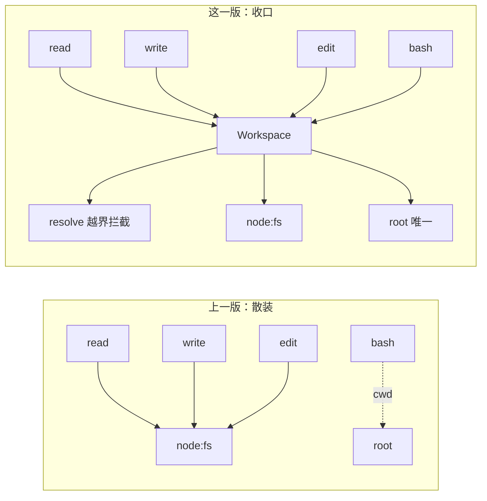

# 23 · Workspace

> <span class="stage-badge">Stage Hello Coding Agent</span> · <span class="tag-badge">v23-workspace</span>


第二十二章，我们给 Coding Agent 装上了真正的手——`bash`，能跑能验，修 bug 的闭环第一次闭合。可兄弟，工具装得越多，一个被忽略的老问题就越来越刺眼：**read 有自己的 root，write 有自己的 root，edit 有自己的 root，bash 有自己的 cwd——同一个 workspace，被四个工具各管一摊。**

这一章，我们要干一件「不声张」的事：**把环境收拢成一个 `Workspace` 对象，工具不再自己裸碰文件系统。** 它不像前几章那样给 Agent 加新能力，而是一次架构手术——**换芯，但不换脸**。

<!-- more -->

## 一、上一版存在什么问题？

到上一章为止，四个工具是这样各自圈地的：

```ts
export function createReadTool(workspaceRoot: string): Tool {
  const root = path.resolve(workspaceRoot);
  // ... 工具内部自己 stat / readFile
}

export function createWriteTool(workspaceRoot: string): Tool {
  const root = path.resolve(workspaceRoot);
  // ... 工具内部自己 mkdir / writeFile
}
```

问题在三个层面越来越明显：

1. **同一个概念，被四个工具各写一遍**：`read` 的 root、`write` 的 root、`edit` 的 root、`bash` 的 cwd——明明说的是「Coding Agent 的活动范围」，却散落在四个工厂函数里，各存各的、各算各的。**Agent 的环境没有一个「户口」**；
2. **护栏代码在复制粘贴**：每一个文件工具都有一段几乎一模一样的 `path.resolve + startsWith` 越界判断。前面是四个工具，看着还忍得住；但**只要再新增一个工具，就又得抄一遍**——复制粘贴的护栏，迟早会有人忘了加、加错了、或者改了一处忘了另外三处；
3. **工具层越权**：`read` / `write` / `edit` 三个工具直接 `import` 了 `node:fs/promises`——**工具的职责是「输入 → 环境 → 输出」，而「怎么碰文件系统」这个环境细节，和工具的业务逻辑搅在一起**。哪天要把文件系统换成内存版、换成沙箱，就得逐个工具开刀。

> 一句话：**四个工具各管一摊，环境的「户口」和「护栏」都是散装复制品——同一个 workspace，被四只手分开拿，总有一天会松手。**

## 二、本篇解决什么问题？

1. **新增 `Workspace` 类**：把 `root` / `resolve` / `read` / `write` / `exists` 收拢到一个对象里——**环境有了唯一户口**；
2. **工具不再自己碰文件系统**：四个工具的工厂签名从 `createXxxTool(root: string)` 改为 `createXxxTool(workspace: Workspace)`，内部不再 `import node:fs/promises`，只调用 `workspace` 的方法；
3. **越界护栏收拢为单一入口**：`Workspace.resolve()` 是唯一做「包含判断」的地方，工具只负责传一个「动作动词」（读取 / 写入 / 修改），护栏判断和错误消息统一由它产出；
4. **换芯不改脸**：工具的**名称、参数、返回结构、错误消息、ErrorKind 全部保持原样**——四个工具的行为对 Agent 来说零变化，`[permission]` 的文案也逐字不变。

核心心智模型：

> **Workspace 是 Coding Agent 的活动范围与文件系统入口。工具永远不该自己决定「我能碰哪里」——那是 Workspace 的事；工具只决定「我要读 / 写 / 改哪个路径」。**

解决完上面四件事，咱们把这条线串一下：**上一章留下的「四个工具各管一摊、护栏复制粘贴、工具层越权碰文件系统」这些遗留问题 → 这一章用「Workspace 类 + 签名迁移 + 护栏收口」解决掉 → 接下来看看这次架构手术到底长什么样。**

### 解决之后，我们收获了什么？

- **环境有了唯一户口**：`new Workspace(root)` 一个对象代表「活动范围」，四个工具共享它，谁也别想自说自话地另起炉灶；
- **护栏只写一遍**：越界判断从此只存在于 `Workspace.resolve` 一处，新增第五个文件工具时**一行护栏都不用抄**；
- **工具层瘦身**：`read` / `write` / `edit` 不再关心 `path.resolve`、`stat`、`mkdir`，从「文件系统操作员」退化成「业务判断员」；
- **换芯不改脸**：Agent 看到的世界毫无变化——工具名一样、参数一样、错误消息一样，**这是架构手术能悄悄完成的关键**。

> 一句话收个尾：遗留的「环境散装、护栏复制」问题被这一章的抽象解决掉，换来的则是「户口唯一、护栏单点、工具瘦身」三笔踏实的收获。

## 三、先看最终效果

这一章还是老规矩，先不跑真模型，直接驱动工具看效果（demo 会在临时目录里建一个 workspace，跑完自动清理）：

```bash
$ node --import tsx examples/stage-3/23-workspace/demo.mts

=== 0. 一个 Workspace 收口文件系统 ===
root    : C:\Users\yihui\AppData\Local\Temp\hh-23-workspace-mze2vA
resolve : C:\Users\yihui\AppData\Local\Temp\hh-23-workspace-mze2vA\src\hello.ts
exists  : true / false
isFile  : true / false

=== 1. 四个工具共享同一个 Workspace ===
[ok]   read src/hello.ts
       → export const greeting = "hello";

=== 2. 编辑后通过 bash 验证 ===
[ok]   edit "hello" → "harness"
       → 已替换 1 处：hello → harness（src/hello.ts）
[ok]   bash("node -e ...")
       → exitCode=0 "C:\Users\yihui\AppData\Local\Temp\hh-23-workspace-mze2vA\n"

=== 3. 越界护栏：同一个 resolve 挡住所有工具 ===
[fail] read ../secret.txt
       → [permission] 路径超出 workspace 范围，拒绝读取：../secret.txt（解析后 C:\Users\yihui\AppData\Local\Temp\secret.txt）
[fail] write ../secret.txt
       → [permission] 路径超出 workspace 范围，拒绝写入：../secret.txt（解析后 C:\Users\yihui\AppData\Local\Temp\secret.txt）
[fail] edit ../secret.txt
       → [permission] 路径超出 workspace 范围，拒绝修改：../secret.txt（解析后 C:\Users\yihui\AppData\Local\Temp\secret.txt）

=== 4. 嵌套写入 → 目录自动创建 ===
[ok]   write docs/guide/readme.md
       → 已写入 docs/guide/readme.md（8 字符，新建文件）
[ok]   bash("dir /s /b")
       → exitCode=0 "[d] docs\n[d] docs\\guide\n[f] docs\\guide\\readme.md\n[d] src\n[f] src\\hello.ts\n"
```

请各位小伙伴注意这几个细节：

- 场景 0 是这一章的主角——**一个 `Workspace` 对象**：`root` 是它圈定的地盘，`resolve` 把相对路径算成绝对路径，`exists` / `isFile` 回答「这东西存不存在、是不是文件」；
- 场景 1、2 里，`read` / `edit` / `bash` **共享同一个 Workspace**——编辑完还能用 bash 验证 cwd 就是这个 workspace 根目录，动作和验证在同一个地盘里完成；
- 场景 3 是全章最想让你看的一屏：三个不同的工具、三种不同的动作动词（读取 / 写入 / 修改），**越界文案却像同一个模子刻出来的**——只有动词不同，其余一字不差。这就是「护栏收拢到一个 `resolve`」的直观证据；
- 场景 4 展示了 `Workspace.write` 的自动建目录能力，`docs/guide/readme.md` 的父目录一次性建好——**目录创建这种「环境责任」，也收进了 Workspace**。

### 换芯不改脸的证据：老 demo 一个字母都不用改

这一章动的是 `src/` 内部实现，对外**零行为变化**。前四章（19–22）的 demo 只改了一处——工厂调用从传字符串改成传 `new Workspace(...)`，其余场景、断言、输出全部原样：

```bash
$ node --import tsx examples/stage-3/19-read-tool/demo.mts   # 输出与 ch19 完全一致
$ node --import tsx examples/stage-3/20-write-tool/demo.mts  # 输出与 ch20 完全一致
$ node --import tsx examples/stage-3/21-edit-tool/demo.mts   # 输出与 ch21 完全一致
$ node --import tsx examples/stage-3/22-bash-tool/demo.mts   # 输出与 ch22 完全一致
```

我们拿 ch19 的「路径穿越」场景做个对比，`[permission]` 文案逐字未变：

| 版本 | 越界文案 |
| --- | --- |
| ch19（旧）：`createReadTool(root)` | `路径超出 workspace 范围，拒绝读取：../README.md（解析后 …）` |
| ch23（新）：`createReadTool(workspace)` | `路径超出 workspace 范围，拒绝读取：../README.md（解析后 …）` |

**这就是「换芯不改脸」：内部从「每个工具自己 resolve」换成「Workspace.resolve 统一把关」，但 Agent 看到的消息、工具的行为，一个字符都没变。**

## 四、架构变化

```text
src/
├── model/            # Model 层（不变）
├── agent/            # Agent 核心（不变）
├── workspace/
│   └── workspace.ts  # 新增：Workspace 类 —— root / resolve / read / write / exists / isFile
├── tools/            # 工具层
│   ├── tool.ts       # Tool / ToolResult（不变）
│   ├── registry.ts   # ToolRegistry（不变）
│   ├── calculator.ts # 玩具工具（不变）
│   ├── random.ts     # 玩具工具（不变）
│   ├── read.ts       # 迁移：createReadTool(workspace)，不再 import node:fs
│   ├── write.ts      # 迁移：createWriteTool(workspace)，不再 import node:fs
│   ├── edit.ts       # 迁移：createEditTool(workspace)，不再 import node:fs
│   └── bash.ts       # 迁移：createBashTool(workspace)，cwd 取自 workspace.root
├── context/          # 上下文（不变）
├── events/           # 事件（不变）
├── errors/           # 错误（不变）
└── cli/              # CLI
    └── index.ts      # const workspace = new Workspace(process.cwd())，四个工具都注册它
```

架构变化的核心是**加了一个新目录 `src/workspace/`**，然后对四个工具做了一次**签名迁移**——不新增工具、不改行为，只换注入方式。依赖关系从「工具 ↔ 文件系统」变成「工具 ↔ Workspace ↔ 文件系统」：




上一版里四个工具各自面对文件系统、各存一份 root；这一版里**文件系统只被 Workspace 一个人碰，root 只存一份**。工具与文件系统之间，从此隔着一道「门卫」。

| 维度 | 上一版：各管一摊 | 这一版：Workspace 收口 |
| --- | --- | --- |
| root 存在哪 | 四个工厂函数各存一份 | **`Workspace.root` 唯一一份** |
| 越界判断 | 每个工具各写一段 `path.resolve + startsWith` | **`Workspace.resolve` 一处收口** |
| 谁碰 `node:fs` | read / write / edit 直接 import | **只有 `Workspace` 碰** |
| 新增文件工具 | 要抄一遍护栏 | **工厂签名一行，护栏自带** |
| 对外行为 | 基准 | **零变化（换芯不改脸）** |

一句话：以前是「四个工人各自带着工具进工地，谁也没有门禁卡」，现在是「工人在门外喊一声我要读 / 写 / 改哪个路径，由门卫（Workspace）统一放行」。

## 五、核心抽象

在甩代码之前，依然先讲讲设计的思考过程——核心依然是「先钉需求、再拆角色、最后克制边界」三步：

1. **钉需求**：回顾下痛点——环境的「户口」散装、护栏复制粘贴、工具越权碰文件系统。需求就一句：**「让 Coding Agent 的活动范围成为一等公民，且文件系统只有一个入口」**；
2. **拆角色**：谁管「范围」，谁管「文件」？——**`Workspace` 一个人管两件事**：`resolve` 负责「这个路径在不在范围内」（越界判断 + 错误消息），`read` / `write` / `exists` / `isFile` 负责「范围内怎么读写」。工具则退化成一个「翻译官」：把 Agent 传来的参数，翻译成对 workspace 的一次调用；
3. **克制边界**：**Workspace 不做的事**——不枚举目录（留给 bash，ch22 已铺垫）、不做 symlink realpath 校验（ch19 的已知限制继续保留）、不管理权限策略（Permission Gate，第 37 章）。它这一章只解决「环境户口 + 文件入口」这一件事。

> **出发点小结**：我们不是「为了加一层类而加类」，而是被「四个工具各管一摊、护栏复制粘贴」这三个真实痛点逼出来的。
> 先把「活动范围」收成一个有名字的对象，`isFile` 这类辅助方法是落地过程中自然长出来的——工具需要区分「文件 / 目录」，不该为它再搞一套判断。

下面把 `Workspace` 这个核心角色摊开看。

### 一个对象，两个职责

`Workspace` 把「活动范围」和「文件读写」合成一个对象，但职责是清晰分层的：

| 方法 | 职责 | 典型返回 / 行为 |
| --- | --- | --- |
| `root` | 圈定的地盘（构造时 `path.resolve` 定死） | 绝对路径字符串 |
| `resolve(filePath, verb)` | **越界判断的唯一入口**：相对路径算绝对，越界抛 `PermissionError` | 绝对路径 / 抛错 |
| `exists(filePath)` | 路径是否存在 | `boolean` |
| `isFile(filePath)` | 是否存在且是文件（不是目录） | `boolean` |
| `read(filePath)` | 读取文本内容（不存在抛原始 fs 错误） | `string` |
| `write(filePath, content)` | 写入文本，父目录自动创建 | `void` |

**重点关注** `resolve` 的第二个参数 `verb`（动作动词）——它是「换芯不改脸」的关键设计：

```ts
// 工具只告诉 Workspace「我要做什么」，护栏消息由 Workspace 统一产出
workspace.resolve(filePath, "读取");  // 越界 → 拒绝读取：…
workspace.resolve(filePath, "写入");  // 越界 → 拒绝写入：…
workspace.resolve(filePath, "修改");  // 越界 → 拒绝修改：…
```

如果 `resolve` 不接收 verb，越界消息就只能写死成「拒绝访问」——那 ch19–22 的 `[permission]` 文案就全变了。**verb 让护栏保持「一处实现、三种口径」，工具不用为消息差异付出任何成本。**

### 工具瘦身：从「操作员」到「翻译官」

迁移之后，read 工具的业务逻辑变成了纯「翻译」：

```ts
// 旧：read 自己 resolve + stat + readFile
// 新：read 只问 Workspace 三个问题
workspace.resolve(filePath, "读取");                          // ① 这个路径在范围内吗？
if (await workspace.exists(filePath)) {                        // ② 它存在吗？
  if (!(await workspace.isFile(filePath))) {                   // ③ 它是文件吗？
    return { ok: false, error: `不是文件，无法读取：${filePath}`, ... };
  }
}
const content = await workspace.read(filePath);                // ④ 读吧（范围已把关）
```

工具不再知道「绝对路径怎么算」「文件系统怎么碰」——**它只保留业务判断**：参数合不合法、目标是文件还是目录、匹配是否唯一。至于「在哪儿读、怎么读」，全是 Workspace 的事。

## 六、实现代码

### Workspace 实现

**`src/workspace/workspace.ts`**——完整实现：

```ts
import { mkdir, readFile, stat, writeFile } from "node:fs/promises";
import path from "node:path";
import { PermissionError } from "../errors/errors";

export class Workspace {
  readonly root: string;

  constructor(root: string) {
    this.root = path.resolve(root);
  }

  resolve(filePath: string, verb = "访问"): string {
    const target = path.resolve(this.root, filePath);
    if (target !== this.root && !target.startsWith(this.root + path.sep)) {
      throw new PermissionError(`路径超出 workspace 范围，拒绝${verb}：${filePath}（解析后 ${target}）`);
    }
    return target;
  }

  async exists(filePath: string): Promise<boolean> {
    const info = await stat(this.resolve(filePath)).catch(() => null);
    return info !== null;
  }

  async isFile(filePath: string): Promise<boolean> {
    const info = await stat(this.resolve(filePath)).catch(() => null);
    return info !== null && info.isFile();
  }

  async read(filePath: string): Promise<string> {
    const target = this.resolve(filePath);
    await stat(target);
    return readFile(target, "utf-8");
  }

  async write(filePath: string, content: string): Promise<void> {
    const target = this.resolve(filePath);
    await mkdir(path.dirname(target), { recursive: true });
    await writeFile(target, content, "utf-8");
  }
}
```

**重点关注**这几个设计点：

1. **`resolve` 是唯一的越界判断**：`path.resolve(root, filePath)` 算出绝对路径，再做包含判断（`target !== root && !target.startsWith(root + path.sep)`），越界就抛 `PermissionError`——**这份 ch19 的护栏代码，如今只存在于这一个地方**；
2. **verb 参数保留消息口径**：`拒绝${verb}：${filePath}（解析后 ${target}）`——工具传「读取 / 写入 / 修改」，越界文案就和 ch19–22 逐字一致；
3. **`read` 先 `stat` 再 `readFile`**：这样当文件不存在时，抛的是 `ENOENT … stat '…'` 的原始 fs 错误——**工具 catch 后包装成「读取失败：ENOENT…」，与 ch19 的实测输出完全一致**（ch19 的 `[tool] 读取失败：ENOENT: no such file or directory, stat '…'` 正是 stat 先抛的）；
4. **`exists` / `isFile` 内部也用 `resolve`**：即使工具忘了先调 `resolve`，这两个方法也会先过一遍越界判断——**护栏是「防御纵深」，不是「靠调用方自觉」**；
5. **`write` 自动建父目录**：`mkdir(path.dirname(target), { recursive: true })`——把 ch20 里 write 工具的「父目录自动创建」也收进了 Workspace；
6. **`root` 用 `readonly`**：构造时 `path.resolve` 定死，之后谁也别想改地盘——**「活动范围不可变」是对权限的第一道物理保证**。

### read 工具迁移

**`src/tools/read.ts`**——从「自己碰文件系统」变成「只问 Workspace」：

```ts
import type { Tool, ToolResult } from "./tool";
import { PermissionError, errorMessage } from "../errors/errors";
import type { Workspace } from "../workspace/workspace";

export const MAX_READ_CHARS = 8000;

export interface ReadInput {
  path?: unknown;
}

export function createReadTool(workspace: Workspace): Tool {
  return {
    name: "read",
    description: "读取 workspace 内的文本文件内容，path 为相对 workspace 根目录的路径；文件超长会自动截断",
    parameters: {
      type: "object",
      properties: {
        path: {
          type: "string",
          description: "相对 workspace 根目录的文件路径，例如 src/index.ts",
        },
      },
      required: ["path"],
    },
    async execute(input: unknown): Promise<ToolResult> {
      const { path: filePath } = input as ReadInput;
      if (typeof filePath !== "string" || filePath.trim() === "") {
        return { ok: false, error: "参数 path 必须是文件路径字符串", kind: "tool", retryable: false };
      }

      try {
        workspace.resolve(filePath, "读取");

        if (await workspace.exists(filePath)) {
          if (!(await workspace.isFile(filePath))) {
            return { ok: false, error: `不是文件，无法读取：${filePath}`, kind: "tool", retryable: false };
          }
        }

        const content = await workspace.read(filePath);
        if (content.length <= MAX_READ_CHARS) {
          return { ok: true, value: content };
        }
        return {
          ok: true,
          value: `${content.slice(0, MAX_READ_CHARS)}\n\n...（已截断：文件共 ${content.length} 字符，只返回前 ${MAX_READ_CHARS} 字符）`,
        };
      } catch (error) {
        if (error instanceof PermissionError) {
          return { ok: false, error: error.message, kind: "permission", retryable: false };
        }
        const message = errorMessage(error);
        return { ok: false, error: `读取失败：${message}`, kind: "tool", retryable: false };
      }
    },
  };
}
```

对比 ch19 的旧版，差异就三处：**① 不再 import `node:fs/promises` 和 `node:path`；② 工厂参数从 `root: string` 变成 `workspace: Workspace`；③ 越界判断从「手写 `path.resolve` + 包含判断」换成一行 `workspace.resolve(filePath, "读取")`**。其余逻辑——参数校验、目录拦截、8000 字符截断、错误包装——全部原样保留。

### write / edit 工具迁移

`write` 与 `edit` 的迁移逻辑与 read 完全同构，只换动作动词和业务判断。以 write 为例，核心变化是：

```ts
export function createWriteTool(workspace: Workspace): Tool {
  // ...
  try {
    workspace.resolve(filePath, "写入");      // 越界 → 拒绝写入：…
    const info = await workspace.exists(filePath);
    let overwritten = false;
    let unchanged = false;

    if (info) {
      if (!(await workspace.isFile(filePath))) {
        return { ok: false, error: `目标是一个目录，无法写入：${filePath}`, kind: "tool", retryable: false };
      }
      const existing = await workspace.read(filePath).catch(() => null);
      if (existing === content) unchanged = true;
      else overwritten = true;
    }

    if (!unchanged) {
      await workspace.write(filePath, content);   // 父目录自动创建在这里
    }
    // ...
  } catch (error) {
    if (error instanceof PermissionError) {
      return { ok: false, error: error.message, kind: "permission", retryable: false };
    }
    // ...
  }
}
```

edit 同理，动词换成「修改」，唯一性判断（`count === 0` / `count > 1`）原样保留。**三个文件工具的「业务脑」都在，只是「手」都换成了 workspace。**

### bash 工具迁移

bash 不读写文件，但它也需要 workspace——**它的 `cwd` 就是 `workspace.root`**：

```ts
export function createBashTool(workspace: Workspace, options: { timeoutMs?: number } = {}): Tool {
  const timeoutMs = options.timeoutMs ?? 10_000;
  // ...
  const child = spawn(command, { cwd: workspace.root, shell: true, windowsHide: true });
  // 结果里的 cwd 也是 workspace.root
}
```

bash 迁移后 `import path` 也删掉了——`root` 不再由 bash 自己 `path.resolve`，而是直接取自 Workspace。**bash 的「圈地」从此与文件工具是同一块地。**

### CLI 注册：一个 Workspace，四个工具

**`src/cli/index.ts`**——构造一次，全工具共享：

```ts
const workspace = new Workspace(process.cwd());
const registry = new ToolRegistry();
registry.register(calculator);
registry.register(randomInteger);
registry.register(createReadTool(workspace));
registry.register(createWriteTool(workspace));
registry.register(createEditTool(workspace));
registry.register(createBashTool(workspace));
```

对比 ch22 的四行 `createXxxTool(process.cwd())`——**现在 `process.cwd()` 只出现一次**。想给 Agent 换一个活动范围？只改 `new Workspace(...)` 这一行，四个工具一起搬家。

## 七、运行 Demo

这一章没有「装进 Chat」的新场景——**行为没变，CLI 表现不变**，所以验证重点是「换芯之后老行为一个不差」。三种跑法：

**跑法一：本章新增的 demo**——直接驱动一个 Workspace 下的四个工具：

```bash
node --import tsx examples/stage-3/23-workspace/demo.mts
```

输出就是第三节第一屏，五组场景：

| 场景 | 验证点 |
| --- | --- |
| `Workspace.root / resolve / exists / isFile` | Workspace 基础能力 |
| `read` 与 `bash` 共享 workspace | 同一地盘读写 + 验证 |
| read / write / edit 越界 | **同一个 `resolve` 产出三种动词的护栏** |
| 嵌套写入 + bash 看目录 | `write` 自动建目录、bash 看得到 |

**跑法二：回归老 demo**——四个旧章节的 demo 只改了工厂调用，输出必须与原章节逐字一致：

```bash
node --import tsx examples/stage-3/19-read-tool/demo.mts
node --import tsx examples/stage-3/20-write-tool/demo.mts
node --import tsx examples/stage-3/21-edit-tool/demo.mts
node --import tsx examples/stage-3/22-bash-tool/demo.mts
```

**跑法三：类型检查**——确认签名迁移没有漏网之鱼：

```bash
pnpm typecheck
```

> 这一章没有真实对话转录，因为**它不是加能力，而是换内核**——Agent 的感受是「一切照旧」，所以最有说服力的验证，就是「老输出逐字不变」。

## 八、新架构解决了什么？

- **环境的户口终于唯一了**：`Workspace.root` 一份地盘，四个工具共享——**「Coding Agent 的活动范围」第一次有了一个说得出口、拿得出手的对象**；
- **护栏只写一遍**：越界判断从此只在 `Workspace.resolve` 存在，新增第五个文件工具时**工厂签名一行，护栏自带**——复制粘贴护栏的日子结束了；
- **工具层瘦身成功**：read / write / edit 不再 `import node:fs/promises`，从「文件系统操作员」退化成「业务翻译官」——**工具只做判断，环境只归 Workspace 管**；
- **换芯不改脸的迁移范式立住了**：签名从 string 换成 Workspace，行为零变化、老 demo 输出逐字一致——**这是整个系列第一次「内部手术、外部无感」的迁移**，验证了「抽象收拢」可以不动摇对外的契约；
- **为下一层抽象铺好了路**：Workspace 把「活动范围」变成了一等公民，后续 Session（ch26）持久化、Runtine（Stage 4）沙箱、Capability 组合（Stage 5），都往这个口子上接。

## 九、它又引入了什么问题？

架构手术做完，可兄弟们，收拢带来的好处显而易见，但新的边界问题也跟着浮出来了：

- **Workspace 还是「单个路径字符串」**：它圈的是**一个根目录**，但真实项目往往牵涉多个目录、甚至多个仓库——「多根 workspace / 虚拟文件系统」是后续才有的能力，这一章只解决「一个地盘」；
- **`isFile` 是简单 `stat` 判断，没有 realpath**：符号链接 / 软链仍可能把路径指向 workspace 之外——这是 ch19 就声明的已知限制，**Workspace 收拢后并没有自动修复它**，做 realpath 校验是后续的硬骨头；
- **Workspace 没管「bash 的越界」**：bash 的 `cwd` 圈的是「默认工作目录」，但 `cd ..` + 绝对路径照样能摸出 workspace——**bash 的边界是「软」的，ch22 已声明，Permission Gate（37 章）才是真正的收口**；
- **工具里的错误包装逻辑还在重复**：每个工具都要 `catch` 后判断 `error instanceof PermissionError` 再分派——这段「错误翻译」代码虽然短，但也开始复制了，将来可以用统一的包装器收拢；
- **Workspace 只有「文件」能力**：它管不了网络、管不了进程组、管不了权限策略——**它只是「范围 + 文件」的口子，不是万能的 Runtime**（Stage 4 的 Runtime / Sandbox 才是）；
- **这一章没有给 Agent 任何新能力**：收益全在「代码结构」和「工程卫生」上——读者第一次需要适应「**为未来做的重构**」这种不显山不露水的章节，习惯了「每章都变强」的节奏可能会觉得这章「没加东西」。
- **workspace 根目录还是由调用方传**：CLI 里写死 `process.cwd()`，**「用户指定打开哪个项目」的能力还没有**——这正是下一章 System Prompt 之后要解决的问题：让 Agent 有「观察 → 修改 → 验证」的章法，而「打开哪个项目」是 CLI（25 章）的职责。

## 十、下一章

> **本章小结**：这一章给 Coding Agent 的活动范围上了唯一户口——**`Workspace` 类**。它把 `root` / `resolve` / `read` / `write` / `exists` / `isFile` 收拢到一个对象里，四个文件工具从「各自裸碰文件系统」迁移成「只问 Workspace」，越界护栏从复制粘贴变成单一入口。最重要的是，这次是**换芯不改脸**——工具的名称、参数、错误消息逐字未变，老 demo 输出一字不差。我们立住了一个新的心智模型：**工具永远不该自己决定「我能碰哪里」，那是 Workspace 的事；工具只决定「我要读 / 写 / 改哪个路径」。**

**下一章：System Prompt**——工具装齐了（read / write / edit / bash）、活动范围划好了（Workspace），可兄弟们，Agent 干活有没有章法，还没人管呢：

- 它拿到一个任务，可能**上来就改**，连「先看一眼现状」都省了；
- 它改完就宣称「修好了」，**根本不验证**——反正没人要求它验证；
- 它回答代码问题时会**猜文件内容**，明明 read 一下就知道——因为没人告诉它「不许猜」。

这些问题的解药不是再加一个工具，而是**告诉它方法论**——System Prompt 要立起四句话：

```text
先观察
再修改
修改后验证
不要猜文件内容
```

所以下一章，我们从 System Prompt 开始，把「会干活的 Agent」升级成「**有章法的 Coding Agent**」😊，欢迎点赞、关注公众号「一灰灰Blog」 我们下章见

---

微信公众号: 一灰灰Blog
