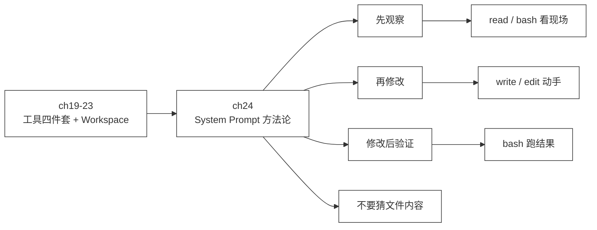

# 24 · System Prompt

> <span class="stage-badge">Stage Hello Coding Agent</span> · <span class="tag-badge">v24-system-prompt</span>

第二十三章，我们给 Agent 的活动范围划了户口——`Workspace`，环境从散装变成收口。可兄弟们，工具装齐了、边界划好了，回头看看那个**指挥模型干活的 System Prompt**，它还躺在 `cli/index.ts` 里，是一段从 [ch19](./19-read-tool) 一路「追加」下来的长字符串：

```ts
const SYSTEM_PROMPT = "你是一个简洁、直接的中文助手，工具可以使用时必须调用工具；对于复杂的数学计算，你应该拆分成多个简单的表达式，进行多次的工具调用；当用户询问代码内容或涉及文件时，必须使用 read 工具读取后基于真实内容回答，不要猜文件内容；当需要创建新文件或修改已有文件内容时，使用 write 工具写入完整内容，不要直接编造结果；当需要修改已有文件中的一小段内容时，优先使用 edit 工具做精准替换，而不是用 write 重写整个文件；当需要查看目录结构、执行命令或验证代码运行结果时，使用 bash 工具执行命令并基于 stdout / stderr / exitCode 判断结果";
```

这一段话会干活的 Agent 用起来还挺顺，但**它只回答了「哪个工具做什么」，从没回答过「一个任务应该怎么思考」**。这一章，我们要把「怎么干活的方法论」提炼出来，写进 System Prompt。

<!-- more -->

## 一、上一版存在什么问题？

回看 ch19–22，我们的 System Prompt 是**每个新工具进来就追一句「当…时，使用 X 工具」**——它是一条**平铺的工具使用说明**：

1. **有「用哪个工具」的规则，没有「怎么干一件活」的方法论**：遇到「修复这个 bug」这种多步骤任务，模型完全不知道应该**先看还是先改**。它可能拿到任务就直接 `edit`，连文件长什么样都没看过——反正没人要求它先观察；
2. **「不要猜文件内容」只是众多规则里的一句**：它被埋在一长串「当…时」的并列句中间，模型读起来和「复杂的数学计算要拆分」是同一个权重——**没有任何结构告诉模型「观察」是干活的起点**；
3. **改完就可以宣称「修好了」**：prompt 里没有「修改后验证」这一条硬规矩，模型改完代码直接给结论，**没有跑过 `node` / `npm test` 的「修好了」只是自说自话**；
4. **规则与规则之间是并列的，没有优先级**：什么时候 read、什么时候 edit、什么时候 bash，全部「一视同仁」——**模型要靠上下文猜谁先谁后**。

> 一句话：**这一版 System Prompt 是「工具说明书」，不是「干活手册」——它教会了模型每个工具是什么，却没教会它一个任务该怎么思考、按什么顺序推进。**

## 二、本篇解决什么问题？

1. **提炼方法论**：把散装在工具规则里的「怎么干活」，提炼成四句可执行的原则——**先观察、再修改、修改后验证、不要猜文件内容**；
2. **重构 System Prompt 结构**：从一段平铺的字符串，改造成「方法论 + 工具使用」分层的结构化 prompt——**先立规矩，再讲工具**；
3. **给工具规则挂到方法论下面**：read / write / edit / bash 不再各自为政，而是分别服务于「观察」「修改」「验证」三个阶段——**工具是手段，方法论是目的**；
4. **保持工具能力与调用点不变**：只改 `SYSTEM_PROMPT` 这一个字符串，工具的注册、Workspace、Runtime 一行不动。

核心心智模型：

> **System Prompt 是 Coding Agent 的操作手册。工具定义了 Agent「能做什么」，System Prompt 定义了 Agent「应该怎么想、按什么顺序做」——前者是能力边界，后者是干活章法。**

解决完上面四件事，咱们把这条线串一下：**上一版留下的「只有工具规则、没有方法论、改完不验证」这些遗留问题 → 这一章用「方法论四原则 + prompt 重构」解决掉 → 接下来看看有章法的 Agent 长什么样。**

### 解决之后，我们收获了什么？

- **模型有了「干活顺序」**：面对一个任务，它会**先观察（read / bash 看现状）→ 再修改（write / edit 动手）→ 修改后验证（bash 跑结果）**——修 bug 不再是盲修；
- **「不要猜文件内容」从并列规则变成首要铁律**：放在方法论的最前面，**读不到真东西不许动手**——回答代码问题不再靠脑补；
- **prompt 变成可读、可维护的结构**：以后加新方法论、新规则，往对应阶段里放就行，**不再是一长串「当…时」的堆积**；
- **工具注册、Workspace、Runtime 零改动**：这是一次纯粹的「软更新」——**改一句话，行为脱胎换骨**，恰恰说明 System Prompt 的分量。

> 一句话收个尾：遗留的「只有工具说明、没有干活章法」问题被这一章的方法论解决掉，换来的则是「先观察、再修改、修改后验证、不猜文件内容」四笔实实在在的章法收获。

## 三、先看最终效果

这一章没有新工具、没有新 demo 脚本——**演示就是让有章法的 Agent 干一次真实的活**。我们准备了一个带 bug 的项目（`examples/stage-3/24-system-prompt/`），`src/math.mjs` 里 `factorial` 的递归参数写错了：

```js
export function factorial(n) {
  if (n <= 1) return 1;
  return n * factorial(n - 2);   // bug：应该是 n - 1
}

console.log("factorial(5) =", factorial(5));   // 实际输出 15，正确应为 120
console.log("factorial(1) =", factorial(1));
```

在这个目录下启动 Chat，让它修复这个 bug：

```bash
$ pnpm dev -- --tools "修复 example/stage-3/24-system-prompt/src/math.mjs 里 factorial 函数的 bug，请先观察确认问题再修改，最后运行代码验证结果正确"
```

真实的转录如下（**先观察 → 再修改 → 修改后验证**三步一气呵成）：

```text
[run:start ] Input  : 修复 src/math.mjs 里 factorial 函数的 bug，请先观察确认问题再修改，最后运行代码验证结果正确
Step 1 · model  → 调用工具：read
[tool:start] read({"path":"src/math.mjs"})
[tool:end  ] → "export function factorial(n) { ... return n * factorial(n - 2); ... }"
Step 2 · tool   → read({"path":"src/math.mjs"}) = "export function factorial(n) { ... return n * factorial(n - 2); ... }"
Step 3 · model  → 调用工具：edit
[tool:start] edit({"path":"src/math.mjs","oldString":"return n * factorial(n - 2);","newString":"return n * factorial(n - 1);"})
[tool:end  ] → "已替换 1 处：return n * factorial(n - 2); → return n * factorial(n - 1);（src/math.mjs）"
Step 4 · tool   → edit({"path":"src/math.mjs","oldString":"return n * factorial(n - 2);","newString":"return n * factorial(n - 1);"}) = "已替换 1 处：...（src/math.mjs）"
Step 5 · model  → 调用工具：bash
[tool:start] bash({"command":"node src/math.mjs"})
[tool:end  ] → {"stdout":"factorial(5) = 120\nfactorial(1) = 1\n","exitCode":0,...}
Step 6 · tool   → bash({"command":"node src/math.mjs"}) = {"stdout":"factorial(5) = 120...","exitCode":0,...}
Step 7 · model  → 完成回答
Answer  : 结果验证通过：
          - factorial(5) = 120 ✅
          - factorial(1) = 1 ✅
          **问题总结**：factorial 函数递归时误减 2（n - 2），导致跳过多项，结果偏小。
          修正为 n - 1 后，递归逻辑正确，结果符合预期。
Steps   : 4 轮 · 9 条消息 · 8 步 · 12934ms
```

请各位小伙伴注意这三个细节：

- **Step 1 就是 read**：面对「修复 bug」的任务，模型**没有上来就改**，而是先读文件看清楚 bug 在哪——这就是「先观察」；
- **Step 3 是 edit**：看清了问题才动手，而且用的是精准替换，不是整文件重写——「再修改」；
- **Step 5 是 bash `node src/math.mjs`**：改完**主动跑了一遍**，看到 `factorial(5) = 120` 才回答「验证通过」——「修改后验证」。回答里还明确写了「结果验证通过」，这就是「跑出来的事实」，不是「我觉得修好了」。

对比 ch19–22 那种「模型说修好了就是修好了」的状态，这一章的 Agent 第一次有了**干活顺序**。

## 四、架构变化

```text
src/
├── model/            # Model 层（不变）
├── agent/            # Agent 核心（不变）
├── workspace/        # ch23：Workspace（不变）
├── tools/            # 工具层（不变：read / write / edit / bash / calculator / random）
├── context/          # 上下文（不变）
├── events/           # 事件（不变）
├── errors/           # 错误（不变）
└── cli/
    └── index.ts      # 只改 SYSTEM_PROMPT：从「工具说明书」重构为「方法论手册」
```

架构变化**小到不能再小**——**只改了一个字符串常量**，没有任何新增文件、没有任何工具改动。但这一章恰恰想让你看到：

> **System Prompt 是整个 Agent 里「性价比」最高的一个常量。同样的工具、同样的循环、同样的 Runtime，只改写这段文字，Agent 的干活方式就从「瞎干」变成「有章法」。**

从演进叙事上看，它标志着 Coding Agent 从「**会调用工具**」（ch19–23，能力层面）跨入「**有章法地干活**」（方法论层面）：




一句话：前几章给 Agent 装好了「手」和「腿」，这一章给 Agent 装了「**脑子里的工作流程**」。

## 五、核心抽象

在甩代码之前，依然先讲设计思考——核心依然是「先钉需求、再拆角色、最后克制边界」三步：

1. **钉需求**：Coding Agent 要修 bug，就得**先看清楚再动手、改完再验证**。需求就一句：「把『怎么干一件活』从工具的平铺规则里提炼成方法论，写进 System Prompt」；
2. **拆角色**：System Prompt 要管两类东西，必须分层——**方法论（怎么想：观察 → 修改 → 验证）** 与 **工具使用（怎么做：read / write / edit / bash 各管什么）**。方法论是「总纲」，工具规则是「细则」，细则挂到对应的总纲下面；
3. **克制边界**：**不在 prompt 里塞具体项目的业务知识**（那是 Session / 上下文的事）、**不做动态 prompt 模板**（「根据任务生成提示」是后续演进）、**不把工具实现写进 prompt**（工具描述已经在 schema 里）。这一章只做一件事：**立方法论**。

> **出发点小结**：我们不是「为了写得更漂亮而重构 prompt」，而是被「模型不知道先看再改、改完不验证」这些真实痛点逼出来的。
> 先把「干活顺序」写进系统提示词，让模型默认按章法干活。

### 方法论 vs 工具规则：一个分层的心智模型

这一章的核心抽象不是某个类，而是一个**prompt 的分层结构**：

| 层 | 回答的问题 | 内容 | 对应的工具 |
| --- | --- | --- | --- |
| **方法论（总纲）** | 一个任务应该**怎么想** | 先观察 → 再修改 → 修改后验证 → 不要猜文件内容 | ——（顺序编排） |
| **工具使用（细则）** | 每个阶段**怎么做** | 观察用 read / bash；修改用 write / edit；验证用 bash | read / write / edit / bash |

关键设计在于：**工具不再是「当…时」的并列清单，而是挂在方法论阶段下面的「执行手段」**：

```text
先观察        → 涉及文件先 read 读取真实内容（不要猜）；看目录结构用 bash
再修改        → 新文件/整文件重写用 write；一小段精准改动用 edit
修改后验证    → 改完必须用 bash 跑一遍，基于 stdout / stderr / exitCode 判断
不要猜文件内容 → 放在最前面当铁律，所有回答都建立在实际读取的内容上
```

这个分层的价值：**模型先建立「干活的顺序感」，再在每一步知道该调哪个工具**——顺序错了（先改后看）、缺了某一步（改完不验），都是方法论层面的错误，不再是无从检查的「自由发挥」。

### 为什么「不要猜文件内容」要放最前面？

在 ch19–22 里，它是众多规则中的一句，位置在中间；这一章把它**提到方法论的首位**。因为它是所有代码任务的**前置条件**——不读真东西，观察就是空的，后面的修改、验证全都建立在幻觉上。

> 一句话：**「不要猜文件内容」不是一条普通规则，它是 Coding Agent 的诚信底线——先让模型永远基于真实读取的内容说话，方法论才有地基。**

## 六、实现代码

### 新 System Prompt

**`src/cli/index.ts`**——`SYSTEM_PROMPT` 从一段平铺字符串，重构为「方法论 + 工具细则」分层的模板字符串：

```ts
const SYSTEM_PROMPT = `你是一个简洁、直接的中文 Coding Agent。面对代码任务时，必须遵循以下方法论干活：

【先观察】
- 动手前先看清现状：涉及代码或文件时，先用 read 读取真实内容再回答，不要猜文件内容；
- 需要查看目录结构或定位文件时，用 bash（如 dir / ls / find）观察现场。

【再修改】
- 创建新文件或整文件重写时，用 write 写入完整内容，不要直接编造结果；
- 只修改文件中的一小段时，优先用 edit 做精准替换，而不是用 write 重写整个文件。

【修改后验证】
- 改完必须验证：用 bash 执行命令（如 node、npm test）跑一遍，基于 stdout / stderr / exitCode 判断结果，不通过就继续修。

【工具总则】
- 工具可以使用时必须调用工具；
- 复杂的数学计算应拆分成多个简单表达式，进行多次的工具调用。`;
```

**重点关注**这几个设计点：

1. **方法论优先，工具细则挂靠**：四个阶段（先观察 / 再修改 / 修改后验证）是「总纲」，read / write / edit / bash 的规则是挂到对应阶段的「细则」——**顺序感直接写死在 prompt 结构里**；
2. **「不要猜文件内容」从并列句变成「先观察」的底线**：它不再和「数学要拆分」平起平坐，而是成为「观察」阶段的铁律，**权重被结构抬高了**；
3. **验证是强制步骤**：「改完必须验证」「不通过就继续修」——**模型不再有「改完就交差」的选项**；
4. **旧的工具规则一条没丢**：read 读取真实内容、write 写完整内容、edit 精准替换、bash 基于 exitCode 判断——**全部原样保留，只是换了位置、挂了层级**；
5. **`${...}` 用模板字符串，可读性大幅提升**：相比一长串用分号拼起来的字符串，**每个阶段一眼可读，以后加规则也方便**。

### 与旧 prompt 的逐条对照

| 旧 prompt 规则 | 新 prompt 归属 |
| --- | --- |
| 工具可以使用时必须调用工具 | 【工具总则】 |
| 复杂的数学计算拆分成多个简单表达式 | 【工具总则】 |
| 必须使用 read 读取后基于真实内容回答，不要猜文件内容 | 【先观察】铁律 |
| 使用 write 写入完整内容，不要直接编造结果 | 【再修改】 |
| 优先使用 edit 做精准替换，不要用 write 重写整个文件 | 【再修改】 |
| 使用 bash 执行命令并基于 stdout / stderr / exitCode 判断结果 | 【修改后验证】 |

**换芯不变规则**——方法论重构没有丢任何旧规则，只是把它们组织成了有顺序、有层级的手册。

### CLI 其余代码零改动

这次改动只有 `SYSTEM_PROMPT` 一个常量：

```ts
const request: ModelRequest = {
  messages: [systemMessage(SYSTEM_PROMPT), userMessage(prompt)],
};
```

工具注册、Workspace、Runtime、事件渲染全部不动——**这是整个系列最轻的一次落地：一句话，改变干活方式。**

## 七、运行 Demo

这一章的演示就是第三节那段真实转录，不需要新建脚本。复现步骤：

**跑法一：直接修复带 bug 的 demo 工程**（需要配置好 `.env`，使用真实模型）：

```bash
cd examples/stage-3/24-system-prompt
node --import tsx --env-file-if-exists=../../../.env ../../../src/cli/index.ts --tools "修复 src/math.mjs 里 factorial 函数的 bug，请先观察确认问题再修改，最后运行代码验证结果正确"
```

观察转录里的工具调用顺序，验证方法论是否生效：

| 阶段 | 期望 | 实测转录 |
| --- | --- | --- |
| 先观察 | 第一步是 read / bash 看现状 | Step 1 → `read({"path":"src/math.mjs"})` |
| 再修改 | 看清后精准修改 | Step 3 → `edit(oldString:"n - 2", newString:"n - 1")` |
| 修改后验证 | 改完跑命令确认 | Step 5 → `bash({"command":"node src/math.mjs"})` → `factorial(5) = 120` |

**跑法二：对照实验**——把 `SYSTEM_PROMPT` 换回 ch22 的旧版（平铺规则），同样的任务，观察模型是否还会「先观察再验证」。你会发现没有「先观察」「修改后验证」的明确指引时，**模型的顺序是随机的，改完经常不验证**——这就是方法论的价值。

> 这一章不做无模型 demo：**方法论的效果只能靠真实模型的「行为」来体现**——同样的工具，不同 prompt 下 Agent 的干活方式完全不同。

## 八、新架构解决了什么？

- **Agent 有了干活顺序**：先观察 → 再修改 → 修改后验证，**修 bug 从「盲修」变成「按流程走」**，每一步都有明确的工具支撑；
- **「不要猜文件内容」立住了**：从并列规则升格为观察阶段的铁律，**回答代码问题不再靠脑补**，所有结论建立在真实读取之上；
- **prompt 可读、可维护**：分层结构让方法论一眼可见，**以后加新规则往对应阶段放即可**，不再是一长串并列句；
- **验证成为强制动作**：改完必须跑，`stdout / stderr / exitCode` 是唯一事实来源——**「修好了」第一次有了可执行、可复现的证明**；
- **证明「文字即能力」**：零代码改动、只改一个字符串，Agent 的行为就脱胎换骨——**System Prompt 是性价比最高的 Agent 组件**。

## 九、它又引入了什么问题？

方法论立住了，可兄弟们，问题也跟着来了——**规矩是写进了 prompt，但「写在哪」本身开始暴露新问题**：

- **prompt 还是硬编码在 `cli/index.ts` 里**：方法论、角色、工具规则全是一个常量字符串，**想给不同项目配不同的规矩，得改代码重编译**——「prompt 应该是可配置、可管理的资产」，这个口子要留到 CLI（ch25）与 Session（ch26）；
- **「验证」依赖模型自觉执行**：prompt 说「改完必须验证」，但**模型不遵守时没有任何机制兜底**——「验证是流程而非自觉」需要 Runtime 层强制，这是 Stage 5 的 RLM / Evaluator 的职责；
- **方法论是「全通用」的**：先观察、再修改、修改后验证对所有任务生效，但**具体项目的独有规矩（比如「别动 lockfile」「用 pnpm 不用 npm」）还没有地方放**——项目级规则 / Skills 是后续演进；
- **prompt 越长，token 越贵**：方法论 + 工具规则都要随每次请求发给模型，**「怎么在能力与 token 成本之间平衡」是持久的问题**；
- **顺序感靠文字，不靠约束**：prompt 说「先观察再修改」，但工具调用顺序没有硬约束——**真正把「先看后改」变成不可违反的流程，需要 Agent 循环层面的顺序控制**；
- **一句话，从「会干」到「会按章法干」，但章法目前还是「写在提示词里的纸面约定」**——它信任模型自觉，而这恰恰是下一章要解决的：**给 Agent 一个真正的入口和壳**。

## 十、下一章

> **本章小结**：这一章给 Coding Agent 立了干活的方法论——**先观察、再修改、修改后验证、不要猜文件内容**。我们把散装在 ch19–22 工具规则里的「怎么干活」，提炼成 System Prompt 的分层结构：方法论是总纲、工具是挂靠的执行细则。零代码改动，只改一个字符串，Agent 就从「会调用工具」升级成「有章法地干活」——真实转录里，它先 read 看清 bug、再 edit 精准修复、最后 bash 跑出 `factorial(5) = 120` 才交差。我们立住了一个新的心智模型：**System Prompt 是 Coding Agent 的操作手册——工具决定它能做什么，System Prompt 决定它应该怎么想、按什么顺序做。**

**下一章：CLI**——章法有了，可兄弟们，现在的 Agent 还是「库」和「脚本」：要跑它得 `node --import tsx src/cli/index.ts --tools "..."`，长到没朋友。真正的 Coding Agent 应该是一个**产品**，一条命令就能干活：

```bash
hello "帮我修复这个项目"
```

- 现在的入口 `pnpm dev -- --tools ...`，参数多、记不住——**CLI 要把常用入口收敛成一句人话**；
- workspace 还是写死 `process.cwd()`——**CLI 要能打开用户指定的项目目录**；
- 任务跑完就散，连个名字都没有——**CLI 要为后续的 Session（ch26）铺好入口**。

所以下一章，我们从 CLI 开始，把「有章法的引擎」套上一个「**人话入口的壳**」😊，欢迎点赞、关注公众号「一灰灰Blog」 我们下章见

---

微信公众号: 一灰灰Blog
