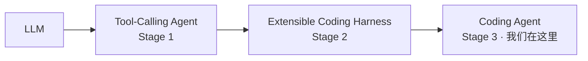
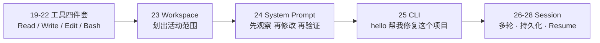

# Stage 3 · Hello Coding Agent

> <span class="stage-badge">Stage 3</span> · Git Tag 范围：<span class="tag-badge">v19-read</span> ~ <span class="tag-badge">v28-resume</span>


Stage 1 和 Stage 2完成之后，各位小伙伴将会收获了一个「会干活、能叫停、每一步都看得见」的 Harness Agent。从这一篇开始，我们正式把它升级成 **Coding Agent**——一个能走进你的代码库、读代码、改代码、跑命令、修 bug 的真正干活工具。

如果你刚读完 `18-hello-minimal-harness`，心里可能正带着一个疑问走进这一篇：

> **Agent 会干活、Harness 会管理了，Coding Agent 又是什么？它和前面的 Agent、Harness 到底是什么关系？**

接下来，这一篇就是 Stage 3 的开篇总览，回答三件事：

1. 什么是 Coding Agent？
2. 它和前两个 Stage 的 Agent、Harness 有什么区别？
3. 这一 Stage 完成之后，我们会设计出一个怎样的 Coding Agent？

<!-- more -->

## 一、先复习：我们手上有什么

前两个 Stage 攒下的东西，可以浓缩成一张成长图：



**Stage 1 给了它「手」**——一个 `while(true)` 循环：调模型 → 有工具调用就执行并回传 → 再调模型 → 直到不再调用工具 → 返回答案。它**会干活**。

**Stage 2 给它配了「马具」**——Tool Registry、Agent Context、AgentRuntime、AgentStep、AgentEvent、结构化错误、Abort/Timeout/Retry。它**可以被可靠地驾驭**。

但回头看看 Stage 1、2 那双手上拿的是什么工具：`calculator`、`randomInteger`。这匹马再训练有素，它的世界也只是**数学题和随机数**：

- 它读不了你项目里的代码；
- 它写不了文件；
- 它跑不了 `npm test`；
- 它甚至不知道「当前目录」是什么。

> 换句话说：**Agent + Harness 解决了「能干 + 能管」，但还没让 Agent 踏进真实代码库半步。**

## 二、什么是 Coding Agent？

中文直译就是「写代码的智能体」。上一匹马套上了鞍、挂上了铃铛，但它只会在操场上跑圈；Coding Agent 要做的，是**把这匹马牵进真实的代码库**，让它能干程序员最常干的活：

| 场景 | 现在的 Agent | Coding Agent |
| --- | --- | --- |
| 输入 | 「算一下 6 乘 7」 | 「**帮我创建一个 TypeScript CLI**」 |
| 动作 | 调一次计算器 | 查看目录 → 读取代码 → 修改代码 → 执行命令 → 检查结果 |
| 交付 | 一句话答案 | 一个能跑、有测试、验证过的**项目变更** |
| 场景 | 聊天/算数 | 创建项目、修 bug、跑测试、自查结果 |

一句话记住它与前两个 Stage 的分工：

> **Agent 负责「干」，Harness 负责「管」，Coding Agent 负责「在真实代码库里干」——把「能干 + 能管」的能力，对准「代码」这个真实世界。**

## 三、它如何成长为一个会编码、测试、修 bug 的 Coding Agent？

这是这一 Stage 最重要的一条叙事线。成长不是「推翻重来」，而是**一层一层换装**——上一阶段的能力原封不动，只是把工具、边界、方法论、壳子、记忆一件一件补上：



| 阶段 | 章节 | 补上的能力 | 对应成长 |
| --- | --- | --- | --- |
| **装上手** | 19–22 | `read` / `write` / `edit` / `bash` | 从「只会算数」变成「能读代码、写代码、改代码、跑命令」——工具从玩具换成代码世界的真实工具 |
| **划出边界** | 23 | `Workspace`（root / resolve / read / write / exists） | 工具不再自己裸碰文件系统，统一经由 Workspace——**一切动作被锁定在显式 workspace 内** |
| **教方法论** | 24 | System Prompt | 告诉它「先观察、再修改、修改后验证、不要猜文件内容」——**从蛮干变成有章法的干活** |
| **套上产品壳** | 25 | CLI | `hello "帮我修复这个项目"`——**从「库」变成「命令行产品」** |
| **给它记忆** | 26–28 | Session / 持久化 / Resume | 多轮上下文、`.sessions/` 落盘、`hello --resume xxx` 续跑昨天的任务——**从「一次性」变成「可跨会话续跑」** |

对照着看，每一步都踩在前一步的肩膀上：

- 没有 19–22 的工具，23 的 Workspace 无东西可约束；
- 没有 23 的边界，24 的方法论会在错误的地方乱动手；
- 没有 24 的章法，25 的 CLI 修出来的 bug 没人敢信；
- 没有 25 的壳子，26–28 的会话连「入口」都没有。

> **这就是演进叙事：不是每次加一个独立新功能，而是让 Agent 的能力环环相扣地长大。**

## 四、这一 Stage 完成之后，我们会得到一个怎样的 Coding Agent？

毕业作品叫 **Coding CLI**——一个能用一句话驱动、在真实代码库里干活、且能跨会话续跑的命令行 Coding Agent。

先看修 bug 场景它将长成什么样：

```mermaid
flowchart LR
  U[hello "帮我修复这个项目"] --> O[观察<br/>Workspace.read 目录 / 代码]
  O --> D[定位问题<br/>读文件 确认根因]
  D --> M[修改<br/>Edit.search/replace]
  M --> V[验证<br/>Bash 跑测试 / 检查输出]
  V --> X{结果对吗?}
  X -- 否 --> D
  X -- 是 --> R[汇报变更 + 退出]
  S[Session 持久化<br/>.sessions/xxx.json] -.随时可续跑.-> D
```

对比三个 Stage 的毕业作品，能力一目了然：

| 维度 | Stage 1 · Agent | Stage 2 · Harness | Stage 3 · Coding Agent |
| --- | --- | --- | --- |
| 工具 | calculator / random（玩具） | 同上，但进了注册表 | read / write / edit / bash（代码世界） |
| 场景 | 会聊、会算 | 系统可靠、可观察 | 能进代码库：创建项目 / 修 bug / 跑测试 |
| 安全边界 | 无 | 无 | Workspace 显式根目录，路径校验 |
| 干活方法论 | 无 | 无 | System Prompt：先观察、再修改、再验证 |
| 交互形态 | 库 / 一次性脚本 | minimal-harness CLI | `hello "帮我修复这个项目"` |
| 会话记忆 | 单轮 | 单轮 | 多轮 + `.sessions/` 持久化 + `--resume` |
| 核心心智 | 一个循环 | 一套基础设施 | **一个在真实代码库里按章法干活、可续跑的产品** |

> 一句话概括 Stage 3 的目标：
> **把「能干 + 能管的 Agent」，升级成「能走进代码库、按章法干活、还能续跑」的 Coding Agent。**

## 五、章节清单

| # | 章节 | Git Tag | 状态 |
| --- | --- | --- | --- |
| 19 | [Read Tool](19-read-tool) | v19-read | 已完成 |
| 20 | [Write Tool](20-write-tool) | v20-write | 已完成 |
| 21 | [Edit Tool](21-edit-tool) | v21-edit | 已完成 |
| 22 | [Bash Tool](22-bash-tool) | v22-bash | 已完成 |
| 23 | [Workspace](23-workspace) | v23-workspace | 已完成 |
| 24 | [System Prompt](24-system-prompt) | v24-system-prompt | 已完成 |
| 25 | [CLI](25-cli) | v25-cli | 已完成 |
| 26 | [Multi-turn Session](26-multi-turn-session) | v26-session | 已完成 |
| 27 | [Session 持久化](27-session-persistence) | v27-session-store | 已完成 |
| 28 | [Resume](28-resume) | v28-resume | 已完成 |
| 阶段结尾 |

## 阶段结尾

这一阶段结束：**Coding CLI**——输入 `hello "帮我修复这个项目"`，它能查看目录、读取代码、修改代码、执行命令、检查结果，而且 `--resume` 可以继续昨天的任务。

> **记住这一 Stage 的灵魂一句：**
> **Agent 负责「干」，Harness 负责「管」，Coding Agent 负责在真实代码库里按章法干活。**

下一阶段，我们会学习 Pi 最有价值的思想——**Minimal Core + Extension First**：当工具、会话、能力越来越多时，如何让 Core 保持小而稳定，把扩展能力全部交给 Extension 插件。