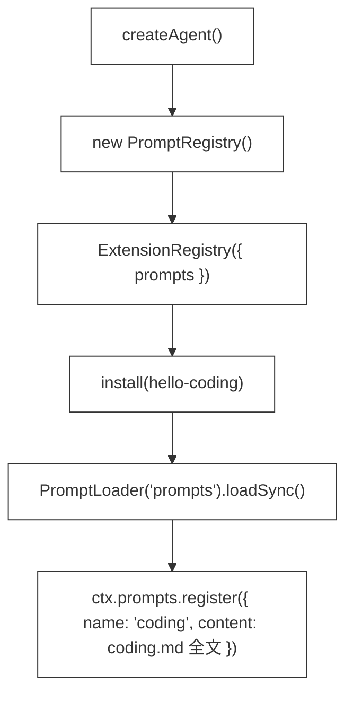

# 33 · Prompt Extension

> <span class="stage-badge">Stage Hello Pi</span> · <span class="tag-badge">v33-prompt-extension</span>

第三十二章，`ctx.hooks` 让扩展能在 harness **运行中插手**了——`hello-trace` 在六个节点打印轨迹，`beforeModel` 还能改本次请求。

但是再瞅一下具体的实现，还有一个扎眼的问题：

> **工具和钩子都「出门」了，提示词还焊死在代码里。** 从 ch08 到现在，每次运行 Agent，第一句永远是同一个写死的 `SYSTEM_PROMPT`——「你是一个简洁、直接的中文 Coding Agent……」它躺在 `src/cli/index.ts` 顶部，和逻辑代码挤在一起。想改一句「先观察再修改」，得改代码、重新部署。想要第二套「评审模式」？抱歉，只有一份。

这一章，我们让 **Prompt 不再写死**。提示词落成文件、由扩展加载、从注册表取用：

```text
prompts/
  coding.md
  review.md
```

接下来进入正题。

## 一、上一版存在什么问题？

一般来讲，Agent 的「出厂设置」要是焊死在代码里，那改一句都得重新部署，这滋味可不太好受。遗留的问题其实挺明显：

1. **System Prompt 焊死在代码里**：方法论写在 `src/cli/index.ts` 顶部的常量里，改提示词=改代码=重新部署，**它不是配置，是源码的一部分**；
2. **只有一份，没有第二套**：想要「评审模式」「测试模式」「翻译模式」，同一个 `SYSTEM_PROMPT` 应付不了——`coding` / `review` 没有分工；
3. **扩展贡献不了提示词**：ch32 的 `hello-trace` 只能拿 `beforeModel` 塞一条写死的字符串「【钩子注入】按章法干活」——**能塞，但塞的不是「正牌」prompt，也没有地方登记**；
4. **不可审计、不可演进**：ch24 起 session 能持久化消息，但 prompt 本身没有文件、没有版本，想对比「这个版本改了哪句」无从下手。

> 一句话：**prompt 是 Agent 的「出厂设置」，可它被焊死在代码里，改一行都要动源代码。** 说白了就是改个提示词还要动部署，多少有点鬼畜 😂

## 二、本篇解决什么问题？

那么问题来了：既然提示词焊死在代码里改不动，那怎么让它「随扩展加载、随时可换」？接下来看下这一章的具体解决姿势，一共四件事：

1. **Prompt 落成文件**：`prompts/coding.md`（干活方法论）、`prompts/review.md`（评审方法论），提示词第一次以「纯文本配置」的身份存在；
2. **PromptLoader 读目录**：把 `prompts/*.md` 读成 `Prompt = { name, content }`，文件名就是名字；
3. **`ctx.prompts` 注册表**：`ExtensionContext` 长出第三个能力——和 `ctx.tools` 一模一样的 `register / get / list`，扩展在 `setup` 里注册提示词，**随扩展加载**；
4. **CLI 不再写死**：system prompt 从注册表取 `prompts.get("coding")`，取不到才回退到内置默认 prompt；新增 `hello --prompts` 列出所有已注册提示词。

核心心智模型：

> **Prompt 也是配置。** 和工具一样，由扩展贡献、可插拔、可替换——「先观察再修改」不再是一条代码常量，而是一个可以被替换、被评审、被演进的文件。

这一章把线串一下：**上一版「prompt 焊死在代码、只有一份、扩展塞不进正牌 prompt」这些遗留问题 → 这一章用「`prompts/*.md` + `PromptLoader` + `ctx.prompts` 注册表」解决 → 接下来看同一套运行时怎么靠两个 md 文件切换两套人设。**

## 三、先看最终效果

先跑 demo（无需 API Key，下面是标准的使用姿势）：

```bash
$ node --import tsx examples/stage-4/33-prompt-extension/demo.mts
```

输出结果如下：

```text
=== 33 · Prompt Extension：Prompt 不再写死 ===

=== 1. PromptLoader 从 prompts/ 目录加载 *.md ===
  coding.md → name=coding · 395 字符
  review.md → name=review · 296 字符

=== 2. 扩展通过 ctx.prompts 注册（随扩展加载） ===
  prompts.list() → coding / review

=== 3. 同一个 Agent，换 prompt 文件，system 消息跟着换 ===
  用 coding  prompt → system 首行：「你是一个简洁、直接的中文 Coding Agent。面对代码任务时，必须遵循以下…」
  用 review  prompt → system 首行：「你是一个严谨的中文代码评审 Agent。面对代码改动时，必须遵循以下评审方法论：」

=== 4. 未注册时兜底：get() 返回 undefined ===
  空 registry 取 coding → （默认提示词）
```

再跑 CLI（无需 API Key，实测结果如下）：

```bash
$ node --import tsx src/cli/index.ts --prompts
```

```text
Workspace: D:\Workspace\hui\project\hello-harness
已注册的提示词（prompt）：
  coding（395 字符）
    ↳ 你是一个简洁、直接的中文 Coding Agent。面对代码任务时，必须遵循以下方法论干活：
  review（296 字符）
    ↳ 你是一个严谨的中文代码评审 Agent。面对代码改动时，必须遵循以下评审方法论：
```

注意三个信息（**重点关注**这三点）：

1. **提示词来自文件，不是代码**：`prompts/coding.md` 决定 Agent 的「出厂性格」，想换方法论，改 md 文件即可；
2. **可插拔**：同一个 Agent，system prompt 跟着 `coding` / `review` 两个文件切换——**一套运行时，多套人设**；
3. **有兜底**：注册表取不到 `coding`，CLI 回退到内置默认 prompt，**不会因为文件缺失而崩**。

> 这就是这一章的兑现：**提示词从「代码常量」变成「可加载、可替换、可演进的配置」。** 改一行提示词，不再需要动一行代码。然后就可以愉快的接着玩了。

## 四、架构变化

这一章的架构变化：**新增一个「prompt 配置层」，`ctx` 再长大一个能力。**

```text
prompts/                       ← 新增：coding.md / review.md（提示词 = 纯文本配置）
src/prompt/prompt.ts           ← 新增：Prompt + PromptRegistry + PromptLoader
src/extensions/extension.ts    ← ExtensionContext 增加 readonly prompts: PromptRegistry
src/extensions/registry.ts     ← 注入 prompts（可选），setup(ctx) 带上 prompts
src/extensions/hello-coding.ts ← setup 里用 PromptLoader 加载 prompts/*.md 并注册（0.5.0）
src/cli/index.ts               ← createAgent 返回 prompts；system prompt 取 prompts.get("coding")；
                                 新增 --prompts 清单；SYSTEM_PROMPT 降级为默认兜底 DEFAULT_SYSTEM_PROMPT
```

数据流分两条线：


【加载线】




【取用线】


```text
%%{init: { 'flowchart': { 'handDrawn': true } } }%%
flowchart TD
    classDef boxStyle fill:#ffffff,stroke:#333,stroke-width:1px

    A["main()"]:::boxStyle --> B["prompts.get('coding')?.content ?? DEFAULT_SYSTEM_PROMPT"]:::boxStyle
    B --> C["systemMessage(systemPrompt)"]:::boxStyle
    C --> D["进 request"]:::boxStyle
    D --> E["模型看到「出厂性格」"]:::boxStyle
```

**依赖方向依然干净**：`src/prompt` 只依赖 `core/errors`（重名时抛 `RuntimeError`）；`extensions` 依赖 `src/prompt`；CLI 同时依赖两者；**core 依旧不认识 prompt**——提示词是可演进状态，不进核心。

> 关键点：**Tool 是核心契约，Prompt 是扩展配置。** `ToolRegistry` 住进 core，`PromptRegistry` 留在应用层——因为工具名是稳定协议，而 prompt 内容正是 Continual 阶段要反复改进的东西。**机制与状态分离，又一次（最基本的，手动加强语气，核心只管契约、不管内容）。**

## 五、核心抽象

这一章有三个小抽象，加在一起恰好是一根完整的「prompt 流水线」：

```ts
Prompt         // { name, content } —— 提示词的最终形态
PromptLoader   // 读 prompts/*.md → Prompt[]（文件 → 数据）
PromptRegistry // register / get / list —— 注册表（数据 → 可用）
```

| 抽象 | 职责 | 一句话 |
| --- | --- | --- |
| `Prompt` | 纯数据 | 「叫什么、说了什么」 |
| `PromptLoader` | 文件 → 数据 | 「把 md 变成 prompt」 |
| `PromptRegistry` | 数据 → 可用 | 「注册、查询、枚举」 |

### 它和 ToolRegistry 的关系：一个注册表，两种来源

`PromptRegistry` 的接口和 `ToolRegistry`（ch10）几乎一样：`register / get / list`，重名拒绝。但来源不同（**请注意**这一条）：

| | ToolRegistry（ch10） | PromptRegistry（本章） |
| --- | --- | --- |
| 注册来源 | 代码里 `new Tool(...)` | **文件里 `prompts/*.md`** |
| 谁能注册 | 扩展 `ctx.tools.register` | 扩展 `ctx.prompts.register` |
| 重名策略 | 拒绝 | 拒绝 |
| 归属 | 核心契约（core） | 扩展配置（应用层） |

> 为什么长得一样？**因为「注册表」是这套架构最省心的一类抽象**：注册、查重、枚举，三件套走天下。读者已经见过 `ToolRegistry`，再看 `PromptRegistry`，几乎零学习成本——**这是刻意的「形状复用」，不是偷懒。** 骚操作谈不上，但这种复用很贴心。

## 六、实现代码

### `src/prompt/prompt.ts`（完整）

下面给出完整实现：

```ts
import { readFileSync, readdirSync } from "node:fs";
import path from "node:path";
import { RuntimeError } from "../core/errors/errors";

export interface Prompt {
  name: string;
  content: string;
}

export class PromptRegistry {
  private readonly prompts = new Map<string, Prompt>();

  register(prompt: Prompt): void {
    const name = prompt.name;
    if (typeof name !== "string" || name.trim() === "") {
      throw new RuntimeError("提示词名称不能为空");
    }
    if (this.prompts.has(name)) {
      throw new RuntimeError(`提示词 ${name} 已注册`);
    }
    this.prompts.set(name, prompt);
  }

  get(name: string): Prompt | undefined {
    return this.prompts.get(name);
  }

  list(): Prompt[] {
    return [...this.prompts.values()];
  }
}

export class PromptLoader {
  constructor(private readonly dir: string) {}

  loadSync(): Prompt[] {
    let entries: string[];
    try {
      entries = readdirSync(this.dir);
    } catch {
      return [];
    }
    return entries
      .filter((entry) => entry.endsWith(".md"))
      .sort()
      .map((entry) => {
        const file = path.join(this.dir, entry);
        const content = readFileSync(file, "utf-8");
        return { name: entry.slice(0, -3), content };
      });
  }
}
```

三个细节值得点名（**重点关注**这三点）：

1. **`PromptLoader` 用「文件名 → name」**：`coding.md` 的 `name` 就是 `coding`——**文件系统就是配置的目录结构**，不用额外声明 id；
2. **目录不存在时返回空数组**：`loadSync` 把 `readdirSync` 的异常吞成 `[]`，配合 CLI 的兜底逻辑，**prompt 目录缺失不致命**；
3. **`PromptRegistry` 重名拒绝**：和 `ToolRegistry` 一个脾气——两个扩展都想叫 `coding`？`RuntimeError` 当场拦下，**坏配置要尽早爆炸**。

### `hello-coding`：工具与提示词，同一个 setup

`createHelloCodingExtension` 长了一截，但结构没变——**setup 里塞什么，扩展就是什么**（核心结构不赘述，看片段）：


```ts
export function createHelloCodingExtension(workspace: Workspace, options: { promptsDir?: string } = {}) {
  return defineExtension({
    name: "hello-coding",
    version: "0.5.0",
    description: "Coding Agent 本体：6 个工具…由扩展注册；方法论 prompt 从 prompts/*.md 加载。",
    setup(ctx) {
      ctx.tools.register(calculator);
      // …random / read / write / edit / bash…

      const loader = new PromptLoader(options.promptsDir ?? "prompts");
      for (const prompt of loader.loadSync()) {
        ctx.prompts.register(prompt);
      }
    },
  });
}
```

> 注意到没有：**「注册提示词」和「注册工具」用的是同一双手。** 扩展的 `setup` 不再有「只塞工具」的版本——ctx 长出什么能力，setup 就能用上什么能力。

### CLI：prompt 从注册表取，写死的降级为兜底

`main()` 里，`SYSTEM_PROMPT` 不再是唯一来源，而是**最后一道保险**：

```ts
const { workspace, registry, extensions, hooks, prompts } = createAgent(...);

// 借助上面的 PromptRegistry 来获取Coding编码的提示词，找不到时，使用默认的提示词
const systemPrompt = prompts.get("coding")?.content ?? DEFAULT_SYSTEM_PROMPT;

const request: ModelRequest = {
  messages: [systemMessage(systemPrompt), userMessage(prompt)],
};
```

`DEFAULT_SYSTEM_PROMPT` 就是原来的那段方法论——现在它叫「默认」，只在 `prompts/coding.md` 缺失时顶上。`--prompts` 则是对外的一扇观察窗：

```ts
if (args.prompts) {
  console.log("已注册的提示词（prompt）：");
  for (const prompt of prompts.list()) {
    const firstLine = prompt.content.split("\n").find((line) => line.trim() !== "") ?? "";
    console.log(`  ${prompt.name}（${prompt.content.length} 字符）`);
    console.log(`    ↳ ${firstLine.slice(0, 60)}`);
  }
  return;
}
```

demo 里的 `recordingModel` 用一句话证明了「system 真的来自文件」——模型把收到的 system message 原样记下来：

```ts
async generate(request: ModelRequest): Promise<ModelResponse> {
  seen.system = request.messages.find((m) => m.role === "system")?.content ?? "";
  return { content: "（模型收到了 system prompt）", toolCalls: [], inputTokens: 1, outputTokens: 1 };
}
```

## 七、运行 Demo

三种跑法，三个层面（**最基本的**，手动加强语气，建议逐条核一遍）：

我们写个demo，来看看提示词的加载 `examples/stage-4/33-prompt-extension/demo.mts` 文件

```ts
import { PromptLoader, PromptRegistry } from "../../../src/prompt/prompt";
import { ExtensionRegistry, defineExtension } from "../../../src/extensions";
import { AgentRuntime, HookManager, ToolRegistry, systemMessage, userMessage } from "../../../src/core";
import type { Model, ModelRequest, ModelResponse } from "../../../src/core";

function head(text: string, max: number): string {
  return text.length > max ? `${text.slice(0, max)}…` : text;
}

function recordingModel(seen: { system: string }): Model {
  return {
    modelName: "fake-prompt",
    async generate(request: ModelRequest): Promise<ModelResponse> {
      seen.system = request.messages.find((m) => m.role === "system")?.content ?? "";
      return { content: "（模型收到了 system prompt）", toolCalls: [], inputTokens: 1, outputTokens: 1 };
    },
    async *stream() {},
  };
}

async function main() {
  console.log("=== 33 · Prompt Extension：Prompt 不再写死 ===");

  console.log("\n=== 1. PromptLoader 从 prompts/ 目录加载 *.md ===");
  const loaded = new PromptLoader("prompts").loadSync();
  for (const prompt of loaded) {
    console.log(`  ${prompt.name}.md → name=${prompt.name} · ${prompt.content.length} 字符`);
  }

  console.log("\n=== 2. 扩展通过 ctx.prompts 注册（随扩展加载） ===");
  const registry = new ToolRegistry();
  const hooks = new HookManager();
  const prompts = new PromptRegistry();
  const extensions = new ExtensionRegistry({ tools: registry, hooks, prompts });
  extensions.install(
    defineExtension({
      name: "hello-coding",
      description: "把 prompts/*.md 注册为 prompt",
      setup(ctx) {
      	// 注册提示词
        for (const prompt of loaded) ctx.prompts.register(prompt);
      },
    }),
  );
  console.log(`  prompts.list() → ${prompts.list().map((p) => p.name).join(" / ")}`);

  console.log("\n=== 3. 同一个 Agent，换 prompt 文件，system 消息跟着换 ===");
  const seen: { system: string } = { system: "" };
  const runtime = new AgentRuntime(recordingModel(seen), registry, { hooks, maxSteps: 1 });
  const coding = prompts.get("coding")?.content ?? "";
  const review = prompts.get("review")?.content ?? "";

  await runtime.run({ messages: [systemMessage(coding), userMessage("看一下这个项目")] });
  console.log(`  用 coding  prompt → system 首行：「${head(seen.system.split("\n")[0], 40)}」`);
  await runtime.run({ messages: [systemMessage(review), userMessage("看一下这个项目")] });
  console.log(`  用 review  prompt → system 首行：「${head(seen.system.split("\n")[0], 40)}」`);

  console.log("\n=== 4. 未注册时兜底：get() 返回 undefined ===");
  const empty = new PromptRegistry();
  const fallback = empty.get("coding")?.content ?? "（默认提示词）";
  console.log(`  空 registry 取 coding → ${fallback}`);
}

main();
```

```bash
# 1. 本章 demo：加载 + 注册 + 换 prompt 切换 system 消息，无需 API Key
$ node --import tsx examples/stage-4/33-prompt-extension/demo.mts

=== 33 · Prompt Extension：Prompt 不再写死 ===

=== 1. PromptLoader 从 prompts/ 目录加载 *.md ===
  coding.md → name=coding · 395 字符
  review.md → name=review · 296 字符

=== 2. 扩展通过 ctx.prompts 注册（随扩展加载） ===
  prompts.list() → coding / review

=== 3. 同一个 Agent，换 prompt 文件，system 消息跟着换 ===
  用 coding  prompt → system 首行：「你是一个简洁、直接的中文 Coding Agent。面对代码任务时，必须遵循以下…」
  用 review  prompt → system 首行：「你是一个严谨的中文代码评审 Agent。面对代码改动时，必须遵循以下评审方法论：」

=== 4. 未注册时兜底：get() 返回 undefined ===
  空 registry 取 coding → （默认提示词）
```


当然我们也可以通过 `--prompts` 查看加载的提示词


```bash
# 2. CLI：列出已注册提示词，无需 API Key
$ node --import tsx src/cli/index.ts --prompts
```


```bash
# 3. 回归：ch32 / ch31 demo 与扩展清单不受影响
$ node --import tsx examples/stage-4/32-extension-register-hook/demo.mts
$ node --import tsx examples/stage-4/31-extension-register-tool/demo.mts
$ node --import tsx src/cli/index.ts --extensions
$ pnpm typecheck
```

| 验证点 | 结果 |
| --- | --- |
| 文件 → Prompt | demo 第 1 段：coding / review 各读成 `{name, content}` |
| 扩展注册 | demo 第 2 段：`prompts.list()` → coding / review |
| 可插拔 | demo 第 3 段：同一 Agent，system 首行随文件切换 |
| 兜底 | demo 第 4 段：空 registry 取不到 → 默认提示词 |
| CLI 清单 | `--prompts` 列出名字 / 字符数 / 首行 |
| 回归 | ch31/ch32 demo 输出不变，`--extensions` 正常 |

## 八、解决了什么

1. **提示词与代码分离**：改方法论 = 改 `prompts/coding.md`，不动一行源码——**配置回归配置，代码回归代码**；
2. **多套人设可插拔**：`coding` / `review` 同一运行时自由切换，为「评审 / 测试 / 翻译」等专用 Agent 留好了缝；
3. **扩展贡献提示词**：`ctx.prompts` 是 `ctx.tools`、`ctx.hooks` 之后第三个能力——**ctx 每章长大一个，扩展的舞台越来越大**；
4. **为 Skill 铺路**：ch36 的 Skill 注入本质也是「往上下文塞知识」，现在 prompt 有了明确的加载与注册路径，**知识注入的地基已经在了**。

## 九、引入了什么问题

接下来再泼盆冷水，看看这一版还留了哪些坑：

1. **文件名即身份**：`coding.md` 改名就丢，没有独立的 id / 版本号——prompt 还没有「身份证」，后续要演进它时（ch64 Prompt Version）得先补版本化；
2. **没有模板变量**：`{workspace}`、`{os}`、`{date}` 都没法注入，提示词还不能「个性化」——不同的项目目录，说着同一套方法论；
3. **内容没有校验**：读进来就是字符串，坏 markdown、超长 prompt、空文件都没有拦截——`DEFAULT_SYSTEM_PROMPT` 兜底只能救「文件缺失」，救不了「文件内容有毒」；
4. **加载发生在安装时**：prompt 在 `setup` 里注册一次就定型，运行时想热换 prompt（比如切评审模式）做不到；
5. **`--prompts` 只显示首行**：清单能看到名字和大小，看不到全文——想检查内容还得去翻文件；
6. **同步读文件**：`readFileSync` 阻塞在 setup 里，对 CLI 够用，但对「加载大量 skill」的后续场景会卡顿——ch36 的 Skill Loader 要考虑异步。

## 十、下一章

Prompt 有了，但「知识」还是**一段写死的方法论**。真正干活的 Agent，需要的知识是分门别类的：查某个 API 用什么流程、这个仓库有什么约定、遇到编译错误怎么排查——它们不该挤在同一段 system prompt 里。

下一章，**Skill**：正式引入 `Skill`——`Skill 不是 Tool`，它是知识、流程、约束、操作方法的打包。目录形态：

```text
.skills/
  refactor/
    SKILL.md
```

从「一段 prompt」到「结构化技能」，ch34 见。

> **本阶段汇总**：ctx 三连——ch31 `tools`、ch32 `hooks`、ch33 `prompts`。下一个要出场的，是「会做事」的 Skill。

---

上面这些就是 Prompt Extension 的基本使用姿势了，有啥用、怎么接着玩 Skill，留在下一篇逐一展开。

尽信书则不如，以上内容纯属一家之言，因个人能力有限，难免有疏漏和错误之处，如发现 bug 或者有更好的建议，欢迎批评指正，不吝感激 🙃


欢迎点赞、关注公众号「一灰灰Blog」 我们下章见

---

微信公众号: 一灰灰Blog

