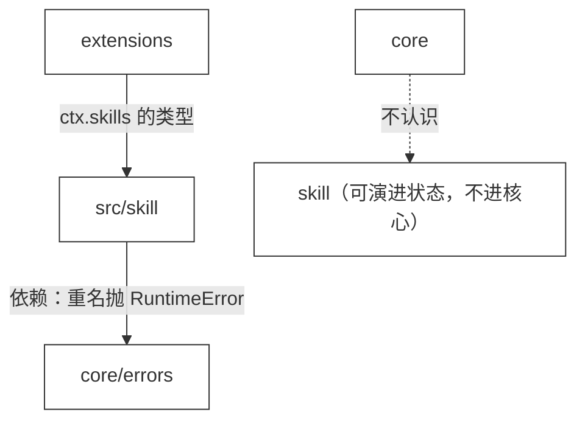

# 34 · Skill

> <span class="stage-badge">Stage Hello Pi</span> · <span class="tag-badge">v34-skill</span>

第三十三章，prompt 落成了文件——方法论不再焊死在代码里。

> **一个 Coding Agent，光有「方法论 prompt」就够了吗？** 现在的 `prompts/coding.md` 是一段**对所有人说同一句话**的通用方法论——「先观察、再修改、再验证」。可真实干活时，知识是**分场景**的：重构代码有一套章法（先跑测试、小步改、保持行为不变），排查 bug 有另一套章法（先复现、再逆推、用命令验证）。这些知识挤在同一段 system prompt 里，既臃肿，又没法按任务挑着用。

这一章，我们正式引入 **Skill**——知识、流程、约束、操作方法的**打包**。先立住一句话：

> **Skill 不是 Tool。** 工具是 Agent 的「手」（能被 function calling 调用），技能是 Agent 的「脑」（给它按场景干活的知识）。

接下来进入正题。

## 一、上一版存在什么问题？

一般来讲，知识要是只会用「一段通用 prompt」硬扛所有任务，那重构和调试两套章法挤在一起，迟早让人头大。遗留的问题其实挺明显：

1. **知识全挤在一段 prompt 里**：`prompts/coding.md` 一套方法论应付所有任务，重构、调试、评审……**不分场景，一锅烩**；
2. **知识没有「身份」**：一段 prompt 里的某几条约束，既没有名字，也没法单独引用——想「只用重构章法」做不到；
3. **知识没有「打包形态」**：流程、约束、操作方法混在段落里，没有结构，程序无法针对性地选中、拼接；
4. **扩展没有贡献知识的通道**：`ctx.tools` 能塞手、`ctx.prompts` 能塞统一人设，但**没有「按场景的知识包」**这一档——想给 Agent 加一种「干活姿势」，没有插座。

> 一句话：**手有几十只（工具），脑却只有一段话（prompt）。** 真正的 Agent，需要的是分场景、可命名、可打包的知识——这就是 Skill。说白了就是脑容量太小，不够用 😂

## 二、本篇解决什么问题？

先别急着看方案，我们花点篇幅把「Skill 到底是什么」说清楚。

一般来讲，一个 Agent 干活，靠两样东西：**手**和**脑**。手是工具——read / write / edit / bash，能被函数调用、能直接改世界；脑是知识——面对不同任务时，该按什么章法出招。ch33 之前，我们的「脑」只有一段对所有人说同一句话的 `prompts/coding.md`：所有任务共用一套方法论，重构、调试、评审全挤在一起，想挑着用根本挑不出来。

那么 Skill 是什么？**一句话：Skill 是把「按场景的脑」打包成一份可命名、可独立引用的知识包。** 它里头装的是流程、约束、操作方法——「重构时先跑测试、小步改、保持行为不变」这种话，就该属于 `refactor` 这一个技能，而不是糊在通用 prompt 里。它和工具最大的不同：它**不是**靠 function calling 直接被模型调用来「改世界」的——它的正文是知识，被读进上下文、让模型照着做。不过要注意：**标准的 Skill 并不只是一段 Markdown，它还能打包 `scripts/`（可执行的辅助脚本）和 `resources/`（参考资料）**，脚本是真正会跑起来的。本章我们先把「知识本体 + 注册表」立住，脚本的执行通道留给 ch35 / ch36 接上。

顺着上面那四个遗留问题看，Skill 恰恰是逐条对症的：

- **知识分场景** → 重构有 `refactor`、排查有 `debugging`，各管一摊，不再一锅烩；
- **知识有身份** → 每个 Skill 有 `name` / `description`，能被点名、被查询、被单独引用；
- **知识有打包形态** → 前提 / 流程 / 约束分节成结构化文本，程序能选中、能拼接；
- **扩展能贡献知识** → `ctx.skills` 给「按场景的知识包」留好了插座，扩展想加一种干活姿势，注册一个 Skill 即可。

说白了，Skill 就是把「脑」从「一段通用嘱咐」升级成「一套可按需取用的操作规程」——**手有几十只，脑也该有一摞。** 那么问题来了：既然知识一锅烩、没法挑着用，那怎么把它拆成「按场景打包的脑」？接下来看下这一章的具体解决姿势，一共四件事：

1. **立住概念**：`Skill 不是 Tool`——工具是「手」（function calling），技能是「脑」（知识 / 流程 / 约束 / 操作方法）；
2. **落成类型**：`Skill = { name, description, content }`，一段结构化的知识包；
3. **长一个注册表**：`SkillRegistry`（register / get / list），与 `ToolRegistry`、`PromptRegistry` 同款形状；
4. **`ctx.skills` 第四个能力**：`ExtensionContext` 长出 `skills`，扩展在 `setup` 里注册技能；同时 `.skills/refactor/SKILL.md` 落成**第一份技能文件**（文件如何解析进类型，下一章 ch35 的 Skill Loader 来做）。

核心心智模型：

> **Tool 回答「我能做什么」，Skill 回答「我该怎么做」。** Tool 是能力清单（手），Skill 是操作规程（脑）——`refactor` 技能说的是「重构时先跑测试、小步改、保持行为不变」，它不能被执行，只能被**阅读**。

这一章把线串一下：**上一版「知识一锅烩、没有身份、没有打包形态、扩展塞不进知识」这些遗留问题 → 这一章用「Skill 类型 + SkillRegistry + ctx.skills」解决 → 接下来看一份 `.skills/refactor/SKILL.md` 怎么变成 Agent 能阅读的脑。**

## 三、先看最终效果

先跑 demo（无需 API Key，下面是标准的使用姿势）：

```bash
$ node --import tsx examples/stage-4/34-skill/demo.mts
```

输出结果如下：

```text
=== 34 · Skill：技能不是工具 ===

=== 1. 从 .skills/*/SKILL.md 读取技能 ===
  debugging    ← .skills/debugging/SKILL.md · 195 字符
  refactor     ← .skills/refactor/SKILL.md · 225 字符

=== 2. 扩展通过 ctx.skills 注册（第四个能力） ===
  skills.list() → debugging / refactor

=== 3. 技能 ≠ 工具 ===
  registry.list() → （空）
  execute(refactor) → ok=false · 未知工具：refactor
  技能不参与 function calling —— 它是给 Agent 的知识，不是给 Agent 的手

=== 4. 技能的正文（这是将来要注入 Agent 的知识） ===
    # refactor

    重构现有代码时使用：保持行为不变，只改结构。

    ## 前提
  （注入机制 ch36 见）
```

注意三个信息（**重点关注**这三点）：

1. **技能来自 `.skills/*/SKILL.md` 目录**：一个技能 = 一个目录 + 一份 `SKILL.md`，`name` 就是目录名；
2. **技能注册进 `ctx.skills`，而不是 `ctx.tools`**：`skills.list()` 有 refactor / debugging，而 `registry.list()`（工具）是空的——**它俩住在不同的注册表**；
3. **技能不是「工具」**：把 `refactor` 丢给 `ToolRegistry.execute` 返回 `未知工具`——**本章的技能还没接上执行通道、不参与 function calling**，它的正文是给 Agent 阅读的知识。但请注意：**标准 Skill 可以打包 `scripts/` 可执行脚本**（ch35 的 Loader 会一并读入），脚本本身是会真正跑起来的——「不可执行」指的是它不靠模型函数调用触发，而不是它永远只是文本。

> 这就是这一章的兑现：**Agent 第一次有了「按场景打包的脑」。** 工具是手，技能是脑——手和脑，终于分开管理了。然后就可以愉快的接着玩了。

## 四、架构变化

这一章的架构变化：**新增一个「技能注册表」，`ctx` 再长大一个能力。** 目录与文件的变化，先以树形看清楚：

```text
src/
├── skill/
│   └── skill.ts              ← 新增：Skill + SkillRegistry（register / get / list）
└── extensions/
    ├── extension.ts          ← ExtensionContext 增加 readonly skills: SkillRegistry
    └── registry.ts           ← 注入 skills（可选），setup(ctx) 带上 skills
.skills/
├── refactor/SKILL.md         ← 新增：技能 = 目录 + SKILL.md
└── debugging/SKILL.md        ← 新增：技能 = 目录 + SKILL.md
```

依赖方向依然干净，画成流程图（手写风、白底黑框）：




> 注意：这一章**没有动 CLI**。`ctx.skills` 先长出能力、demo 先证明概念；技能的「文件加载」（ch35）和「选中注入」（ch36）还没到，CLI 现在硬接进来反而是半成品（先把概念立住再说）。

## 五、核心抽象

这一章的核心抽象是 **Skill**——一个比 Tool 更简单的对象：

```ts
interface Skill {
  name: string;        // 技能名，如 "refactor"（也是目录名）
  description: string; // 一句话：什么时候用
  content: string;     // 正文：流程 / 约束 / 操作方法
}
```

配套 **SkillRegistry**，形状和 `ToolRegistry` / `PromptRegistry` 一模一样：

```ts
class SkillRegistry {
  register(skill: Skill): void;   // 非空 name、重名拒绝
  get(name: string): Skill | undefined;
  list(): Skill[];
}
```

### Skill vs Tool：手和脑

| | Tool（ch06） | Skill（本章） |
| --- | --- | --- |
| 本质 | 可执行的能力（函数） | 知识正文（文本）+ 可执行的辅助脚本（scripts） |
| 谁调用 | `ToolRegistry.execute` / function calling | 知识正文被注入模型阅读；`scripts/` 由 harness 执行（ch35 起） |
| 存放 | `ctx.tools` | `ctx.skills` |
| 粒度 | 一个动作（read / write） | 一套章法（重构流程） |
| 一句话 | 我能做什么 | 我该怎么做 |

> 再补一刀：**Tool 是 JSON Schema，Skill 是 Markdown。** 一个喂给 function calling，一个喂给模型上下文——管道不同，归宿不同。但要补一句：**标准 Skill 还能打包 `scripts/` 可执行脚本**，那些脚本是 harness 真正会跑的，不是装饰。所以「技能 ≠ 工具」指的是它不靠模型函数调用触发，而不是它永远不会执行。骚操作谈不上，但这道分野很清晰。

### 一个注册表家族

至此我们有了三个「同款三件套」（**请注意**这一条）：

| 注册表 | 注册什么 | 谁注册 | 何时引入 |
| --- | --- | --- | --- |
| `ToolRegistry` | 可执行能力 | `ctx.tools` | ch10 / ch31 |
| `PromptRegistry` | 统一人设 | `ctx.prompts` | ch33 |
| `SkillRegistry` | 分场景知识 | `ctx.skills` | 本章 |

> 为什么一直复用这个形状？**因为「注册表」就是这套架构里最稳的一类抽象**——注册、查重、枚举三件套，读者看第三个时零成本。真正变化的是**注册什么**：手、人设、还是脑。

## 六、实现代码

### `src/skill/skill.ts`（完整）

下面给出完整实现：

```ts
import { RuntimeError } from "../core/errors/errors";

export interface Skill {
  name: string;
  description: string;
  content: string;
}

export class SkillRegistry {
  private readonly skills = new Map<string, Skill>();

  register(skill: Skill): void {
    const name = skill.name;
    if (typeof name !== "string" || name.trim() === "") {
      throw new RuntimeError("技能名称不能为空");
    }
    if (this.skills.has(name)) {
      throw new RuntimeError(`技能 ${name} 已注册`);
    }
    this.skills.set(name, skill);
  }

  get(name: string): Skill | undefined {
    return this.skills.get(name);
  }

  list(): Skill[] {
    return [...this.skills.values()];
  }
}
```

和 `PromptRegistry`（ch33）几乎逐行相同——**这是刻意的形状复用**。读者不需要学第四种「注册表」，只需要理解「又注册了另一种东西」（核心结构不赘述，看片段即可）。

### `ctx.skills`：第四根线

`ExtensionContext` 加一行，`ExtensionRegistry` 注入一行：

```ts
// extensions/extension.ts
readonly skills: SkillRegistry;

// extensions/registry.ts
this.skills = options.skills ?? new SkillRegistry();
extension.setup({ name, log, tools: this.tools, hooks: this.hooks, prompts: this.prompts, skills: this.skills });
```

### 第一份技能文件：`.skills/refactor/SKILL.md`

技能的「文件形态」——一个目录 + 一份 Markdown，`name` 是目录名，正文就是技能的知识：

```markdown
# refactor

重构现有代码时使用：保持行为不变，只改结构。

## 前提
- 重构前先用 bash 跑一遍测试，确保基线是绿的；
- 重构不改变对外行为，只改变内部结构。

## 流程
1. 先 read 相关文件，画出现状结构；
2. 每次只做一步小重构，改完立刻跑测试验证；
3. 保持「每步可回滚」，不要一次大改。

## 约束
- 不顺手修无关的 bug；发现另开记录；
- 不引入新依赖；
- 每一步都要有测试验证，最后整体回归。
```

> 注意「前提 / 流程 / 约束」的分节——**这正是技能之所以是技能**：一段能被模型「照着做」的操作规程。`description` 从 `# refactor` 这一行读出来，作为「什么时候用」的索引。

demo 里为了演示，用最简单的方式把文件读成 `Skill` 对象（目录名 → name，`# ` 标题 → description，全文 → content）：

```ts
function loadSkills(dir: string): Skill[] {
  return readdirSync(dir, { withFileTypes: true })
    .filter((entry) => entry.isDirectory())
    .map((entry) => {
      const content = readFileSync(path.join(dir, entry.name, "SKILL.md"), "utf-8");
      const description =
        content.split("\n").find((line) => line.startsWith("# "))?.replace(/^#\s*/, "").trim() ?? entry.name;
      return { name: entry.name, description, content };
    });
}
```

> 这段只是「演示用的临时读取」，**不是正式的 Loader**——正式的 Skill Loader 要处理 metadata、scripts、resources（ch35），而「把选中的技能注入 Agent 上下文」是 ch36。本章先把「技能是什么、住哪、怎么注册」立住（**最基本的**，手动加强语气，Loader 与注入留到后面两章）。

## 七、运行 Demo

两种跑法，两个层面（建议逐条核一遍）：

```bash
# 1. 本章 demo：读技能文件 + ctx.skills 注册 + 证明技能不进 ToolRegistry（非 function calling 工具），无需 API Key
$ node --import tsx examples/stage-4/34-skill/demo.mts

# 2. 回归：ch33 demo 不受影响
$ node --import tsx examples/stage-4/33-prompt-extension/demo.mts
$ pnpm typecheck
```

| 验证点 | 结果 |
| --- | --- |
| 文件 → Skill | demo 第 1 段：refactor / debugging 各读成 `{name, description, content}` |
| 扩展注册 | demo 第 2 段：`skills.list()` → debugging / refactor |
| 技能 ≠ 工具 | demo 第 3 段：工具注册表为空，`execute(refactor)` → 未知工具 |
| 知识可读 | demo 第 4 段：refactor 正文前 5 行 |
| 回归 | ch33 demo 输出不变，typecheck 通过 |

## 八、解决了什么

1. **知识分场景了**：refactor / debugging 各管一摊，不再挤进同一段 prompt——**想用哪套章法，用哪套**；
2. **知识有身份了**：技能有 `name`、`description`，能被点名、被查询、被枚举——`--skills` 那种清单能力（ch35 会接上）随时可做；
3. **知识有结构了**：前提 / 流程 / 约束分节，程序可以针对性地选中与拼接，不再是一段无结构的文本；
4. **扩展能贡献知识了**：`ctx.skills` 是 `ctx.tools`、`ctx.hooks`、`ctx.prompts` 之后第四个能力——**手、干预、人设、知识，各归其位**；
5. **`Skill 不是 Tool` 立住了**：技能不进 ToolRegistry、不走函数调用触发，知识正文的归宿是**模型上下文**——而它打包的 `scripts/` 由 harness 执行（ch35 起），为 ch36 的注入与脚本运行预留了清晰的边界。

## 九、引入了什么问题

接下来再泼盆冷水，看看这一版还留了哪些坑：

1. **文件还没正式加载**：demo 里那段临时读取不规范——没有 metadata 解析、没有 scripts / resources 支持，目录约定也还是「演示级」。**Skill Loader（ch35）必须补上**；
2. **技能还不会被注入**：注册了，但 Agent 根本看不见——`SkillRegistry` 和 `AgentRuntime` 之间还没有桥。**选中 + 注入（ch36）是下一个缺口**；
3. **没有选择机制**：`list()` 能把技能全列出来，但**该在什么时候用哪个**没定——「refactor 任务 → 注入 refactor 技能」这个映射是空的；
4. **内容没有校验**：`content` 是任意字符串，坏 markdown、空技能、超长技能都没有拦截；
5. **description 的约定脆弱**：依赖 `# ` 标题行，改个格式就断——这是临时读取的代价，Loader（ch35）会换成结构化 metadata。

## 十、下一章

技能有了「脑」，但还停在「代码里定义 + 手工读文件」。真实世界的技能是**住在磁盘上**的：`.skills/*/SKILL.md` 一坨一坨放着，等一个 Loader 把它们系统地读进来。

下一章，**Skill Loader**：把 `.skills/` 目录变成 `SkillRegistry` 的正式来源——解析 metadata、加载 instructions、处理 scripts 与 resources：

```text
metadata      # 名字、描述、适用场景
instructions  # 操作流程正文
scripts       # 可复用的辅助脚本
resources     # 参考资料
```

从「手工读一个文件」到「Loader 管整个目录」，ch35 见。

> **本阶段汇总**：ctx 四连——`tools`（手）、`hooks`（干预）、`prompts`（人设）、`skills`（脑）。下一章，把这些技能**从磁盘里系统地请进来**。


上面这些就是本章引入的 Skill 的基本内容了，由于只是定义，具体的有啥用、怎么接着玩 Skill Loader，留在下一篇逐一展开。

尽信书则不如，以上内容纯属一家之言，因个人能力有限，难免有疏漏和错误之处，如发现 bug 或者有更好的建议，欢迎批评指正，不吝感激 🙃

欢迎点赞、关注公众号「一灰灰Blog」 我们下章见

---

微信公众号: 一灰灰Blog

