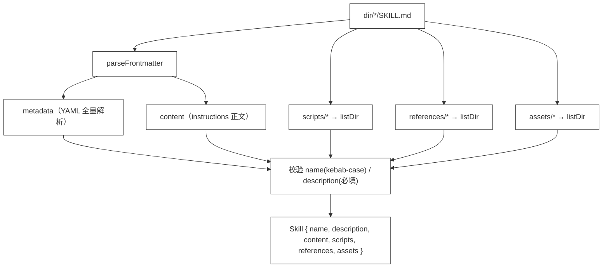

# 35 · Skill Loader

> <span class="stage-badge">Stage Hello Pi</span> · <span class="tag-badge">v35-skill-loader</span>

第三十四章，我们立住了「Skill 不是 Tool」——技能是给 Agent 阅读的知识包，`.skills/refactor/SKILL.md` 落了地。

但 demo 里那段读取代码，实在是有些过于简陋了：

```ts
const description =
  content.split("\n").find((line) => line.startsWith("# "))?.replace(/^#\s*/, "").trim() ?? entry.name;
```

> **从 `# 标题行` 里抠 description，靠目录名当 name。** 这套约定脆弱到让人心虚：标题换个写法、目录改个名字，metadata 就断了；`scripts`、`references` 这些技能该有的家当，连概念都没有。更别说——**每个技能都要手工读一次文件**，没有「请 Loader 把整个 `.skills/` 目录系统性搬进来」这回事。

这一章，我们造正式的 **Skill Loader**。但这次我们不闭门造车：**先用一个简单的解析器当思考**，再对齐业界已经形成的共识标准，让我们的加载器真的能读市面上公开的技能。接下来进入正题。

## 一、上一版存在什么问题？

一般来讲，靠「字符串截取」抠 metadata 这种活，迟早要出事。ch34 留下的坑其实挺明显：

1. **metadata 靠「抠」**：name 用目录名、description 从 `# 标题行` 里 string 截取——**约定脆弱**，格式一换就断；
2. **scripts / references 无家可归**：技能想带「可复用的脚本」「参考资料」，连字段和目录都没有——**技能没有家当，只有一段话**；
3. **没有正式的读取器**：ch34 demo 里的 `loadSkills` 只是演示代码，逐个目录手工读，**无法规模化**，也不会统一校验；
4. **读进来的东西没处去**：技能进了 `SkillRegistry`，但没有「谁负责把 `.skills/` 目录变成注册表」——**加载这个动作还不是基础设施**。

> 一句话：**技能有了「脑」，但没有「消化系统」。** 一个目录一个目录地手工啃，不是 harness 该有的样子。说白了就是拿牙签啃大西瓜，迟早硌牙 😂

## 二、本篇解决什么问题？

先思考，再对齐。

**第一步思考：一个最小 Loader 长什么样？** 答案朴素——切 `---` 之间的 key: value，配上目录扫描和兜底链。这就是上面那句「抠 description」的正规化，我们第一版就写了它。**它跑得通，但它是自娱自乐的小玩具**：只认 `key: value`，多行值、数组、嵌套结构一概不认识。

**第二步对齐：业界已经把标准定好了。** 2025 年 12 月，Anthropic 联合多家厂商发布了 **Agent Skills 开放标准**（agentskills.io），Claude Code、OpenAI Codex、Gemini CLI、GitHub Copilot、Cursor 相继采用。标准长这样：

- **一个技能 = 一个目录**，核心是 `SKILL.md`（必填），可选配套 `scripts/`、`references/`、`assets/` 子目录；
- **SKILL.md 顶部是真 YAML frontmatter**：`name`、`description` 必填，其余 `version`、`license`、`metadata`、`allowed-tools` 等可选；`name` 须是小写 kebab-case（1–64 字符），**目录名是技能的 canonical id**；
- **渐进披露**：启动时只载入 `name` + `description`（用于选择技能），正文按需加载；正文建议 ≤500 行，重内容放 `references/`。

那么问题来了：既然标准都定好了，我们怎么把加载器对齐上去？这一章一共做五件事（接下来看下具体解决姿势）：

1. **引入第一个应用层第三方依赖 `yaml`**：用真正的 YAML 解析器啃 frontmatter，多行、嵌套、数组都不怕；**core 保持零第三方依赖**不变；
2. **`parseFrontmatter` 升级**：不再手搓正则，交给 `yaml.parse`，解析失败只警告不炸；
3. **`SkillLoader` 对齐标准布局**：发现 `scripts/`、`references/`、`assets/` 三个约定目录（`resources` 这个旧命名退役），并对 `name`（kebab-case）、`description`（必填）做校验；
4. **用真实业界技能做实践**：把 anthropics/skills 官方仓库里的 `internal-comms`（Apache-2.0）搬进 demo fixture，证明我们的加载器能读市面上的真实技能，不是玩具；
5. **CLI 接上**：`hello-coding` 0.7.0 通过 `SkillLoader` 注册 `.skills/`，新增 `hello --skills` 列出已加载技能与 scripts/references/assets 数量。

核心心智模型：

> **SKILL.md 是技能的「配置文件」，Loader 是技能的「解释器」。** 一段 markdown + 一个目录，交给 Loader，变成注册表里结构化的 `Skill`——**metadata 归机器、instructions 归模型，家当进清单**。

这一章把线串一下：**上一版「metadata 靠抠、家当无家可归、没有正式读取器、加载不是基础设施」这些遗留问题 → 这一章用「对齐业界标准的 SkillLoader + 真 YAML」解决 → 接下来看一个 Loader 怎么把整个 `.skills/` 系统性搬进注册表。**

## 三、先看最终效果

先跑 demo（无需 API Key，下面是标准的使用姿势）：

```bash
$ node --import tsx examples/stage-4/35-skill-loader/demo.mts
```

输出结果如下：

```text
=== 35 · Skill Loader：加载业界标准的技能 ===

=== 1. 真 YAML：多行 description、嵌套 metadata 都能解析 ===
  parseFrontmatter(多行 YAML) →
    name: git-workflow
    description: 遵循仓库约定的 Git 提交与分支规范时使用： 小步提交、清晰信息、干净历史。
    metadata.owner: platform
  旧版「YAML 子集」解析在这里就会断；yaml 库完整支持

=== 2. 老格式（无 frontmatter）仍可降级 ===
  parseFrontmatter(老格式) → metadata={} · 全文当 content（description 回退到 # 标题行）

=== 3. 加载我们自己的 .skills/（标准布局） ===
  debugging    · 排查报错 / 调试失败测试时使用：先… · scripts=[] · references=["常见报错清单.md"]
  refactor     · 重构现有代码时使用：保持行为不变，只… · scripts=["run-tests.mjs"] · references=[]

=== 4. 加载真实的业界技能（anthropics/skills 官方仓库） ===
  name: internal-comms
  description: A set of resources to help me write all kinds of internal communicatio…
  正文 1098 字符，正文引用 examples/ 子目录（按需加载，不枚举进清单）

=== 5. name 校验（kebab-case） ===
  SKILL_NAME_RE.test("git-workflow") → true
  SKILL_NAME_RE.test("Git Workflow") → false
  SKILL_NAME_RE.test("my_skill")      → false

=== 6. 注册进 ctx.skills ===
  skills.list() → debugging / refactor / internal-comms
  get(internal-comms).description → A set of resources to help me write all kinds of int…
```

再跑 CLI（无需 API Key，实测结果如下）：

```bash
$ node --import tsx src/cli/index.ts --skills
```

```text
Workspace: D:\Workspace\hui\project\hello-harness
已加载的技能（skill）：
  debugging · 排查报错 / 调试失败测试时使用：先复现，再逆推，最后用命令验证。
    ↳ scripts 0 个 · references 1 个 · assets 0 个
  refactor · 重构现有代码时使用：保持行为不变，只改结构。
    ↳ scripts 1 个 · references 0 个 · assets 0 个
```

注意三个信息（**重点关注**这三点）：

1. **真 YAML 赢了**：第 1 段里 `>-` 多行折叠、嵌套 `metadata` 都能解析——这是旧版子集解析直接断掉的地方，**业界技能的 frontmatter 我们接得住**；
2. **家当被发现了**：refactor 自带 1 个脚本（`run-tests.mjs`），debugging 自带 1 份资料（`references/常见报错清单.md`）——**家当是目录里看得见的文件**；
3. **真实技能加载成功**：第 4 段把 anthropics/skills 官方仓库的 `internal-comms` 读进来了——**这不是我们的技能，是业界真在用的技能**。

> 这就是这一章的兑现：**加载器对齐业界标准，真技能读得进来。** 从「手工啃文件」到「一个 Loader 请整个目录」，从「YAML 子集」到「完整 YAML」。然后就可以愉快的接着玩了。

## 四、架构变化

这一章的架构变化：**新增「技能读取器」，SKILL.md 对齐 Agent Skills 开放标准。** 目录与文件的变化，先以树形看清楚：

```text
project/
├── package.json                       ← 新增依赖：yaml（应用层第一个第三方依赖，core 仍零依赖）
├── .skills/
│   ├── refactor/
│   │   ├── SKILL.md                   ← 不变：name/description frontmatter + instructions 正文
│   │   └── scripts/                   ← 不变：run-tests.mjs（scripts/ 标准目录）
│   └── debugging/
│       ├── SKILL.md                   ← 不变
│       └── references/                ← 改名：原 resources/ 迁到标准的 references/
├── src/
│   ├── skill/
│   │   ├── skill.ts                   ← Skill 增加 references? / assets?（移除 resources）
│   │   └── loader.ts                  ← 重写：yaml.parse + 标准目录发现 + name/description 校验
│   ├── extensions/
│   │   └── hello-coding.ts            ← setup 里用 SkillLoader 加载 .skills/ 并注册（0.7.0）
│   └── cli/
│       └── index.ts                   ← createAgent 返回 skills；--skills 列出 scripts/references/assets
└── examples/stage-4/35-skill-loader/
    └── fixtures/internal-comms/       ← 新增：anthropics/skills 官方真实技能（Apache-2.0）
```

一个符合标准的技能目录形态（标准目录全部可选）：

```text
.skills/refactor/
├── SKILL.md          ← 必填：YAML frontmatter（name/description）+ instructions 正文
├── scripts/          ← 可选：可复用的辅助脚本
├── references/       ← 可选：参考资料
└── assets/           ← 可选：模板、图片、fixture
```

> 注意：`scripts` / `references` / `assets` 都是**可选字段**——ch34 那种「只有一段话」的技能（没有家当）依旧合法。Loader 会把它们填成数组（有则列文件名，无则空数组），下游永远能按数组处理（**最基本的**，手动加强语气，可选归可选、数组归数组，下游不用特判）。

## 五、核心抽象

这一章有两个抽象：**`parseFrontmatter`**（一段 markdown → 元信息 + 正文）和 **`SkillLoader`**（一个目录 → 一群 Skill）。

### `parseFrontmatter`：YAML 交给 `yaml`，不再手搓

```ts
export function parseFrontmatter(text: string): ParsedFrontmatter {
  // 第一行是 --- 才当作 frontmatter；否则整个文件都是 content（降级）
  // 两个 --- 之间的 YAML 交给 yaml.parse()：多行、嵌套、数组全支持
  // 解析失败 → console.warn，不炸
  // content = 第二个 --- 之后的部分
}
```

一个细节值得点名：**没有 frontmatter 时，整个文件都算 content**——这就是「老格式也能读」的降级路径。**格式升级不破坏旧文件**。和上一版唯一的区别，是把「逐行正则」换成了「真 YAML 解析器」——也正是这一步，让我们的加载器从玩具变成了能读真实业界技能的工具。

### `SkillLoader`：一个目录 → 技能数组

| 步骤 | 做什么 |
| --- | --- |
| 1. 扫目录 | `dir/*/` 下每个子目录 = 一个技能 |
| 2. 读 SKILL.md | `yaml.parse` frontmatter → name / description，正文 → content |
| 3. 发现家当 | `scripts/`、`references/`、`assets/` 子目录里的文件名 |
| 4. 校验 | `name` 须是 kebab-case 且与目录名一致；`description` 必填（缺省回退 `# 标题行` 并警告） |

这里有个标准带来的设计决定值得点名（**请注意**这一条）：**目录名是 canonical id**。标准规定技能 `name` 应当与目录名一致（kebab-case），所以 `Skill.name` 直接取目录名，frontmatter 里的 `name` 只用来做一致性校验——不一致就警告，而不是悄悄换掉。**稳定、可预测，不靠 frontmatter 的自觉。**

### 一图流

加载一条技能的处理流，画成流程图（手写风、白底黑框）：




## 六、实现代码

### `src/skill/loader.ts`（完整）

下面给出完整实现：

```ts
import { readFileSync, readdirSync } from "node:fs";
import path from "node:path";
import { parse } from "yaml";
import type { Skill } from "./skill";

export interface ParsedFrontmatter {
  metadata: Record<string, unknown>;
  content: string;
}

export const SKILL_NAME_RE = /^[a-z0-9]+(-[a-z0-9]+)*$/;

export function parseFrontmatter(text: string): ParsedFrontmatter {
  const lines = text.split(/\r?\n/);
  if (lines[0]?.trim() !== "---") return { metadata: {}, content: text };
  const end = lines.findIndex((line, index) => index > 0 && line.trim() === "---");
  if (end === -1) return { metadata: {}, content: text };
  const yamlText = lines.slice(1, end).join("\n");
  let metadata: Record<string, unknown> = {};
  try {
    const parsed = parse(yamlText);
    if (parsed && typeof parsed === "object") metadata = parsed as Record<string, unknown>;
  } catch (error) {
    console.warn(`[skill-loader] frontmatter YAML 解析失败：${(error as Error).message}`);
  }
  return { metadata, content: lines.slice(end + 1).join("\n").trimStart() };
}

function listDir(dir: string): string[] {
  try {
    return readdirSync(dir).sort();
  } catch {
    return [];
  }
}

function str(value: unknown): string | undefined {
  return typeof value === "string" ? value : undefined;
}

export class SkillLoader {
  constructor(private readonly dir: string) {}

  loadSync(): Skill[] {
    let entries;
    try {
      entries = readdirSync(this.dir, { withFileTypes: true });
    } catch {
      return [];
    }
    return entries
      .filter((entry) => entry.isDirectory())
      .sort((a, b) => a.name.localeCompare(b.name))
      .map((entry) => this.loadSkill(entry.name));
  }

  private loadSkill(folder: string): Skill {
    const skillDir = path.join(this.dir, folder);
    const raw = readFileSync(path.join(skillDir, "SKILL.md"), "utf-8");
    const { metadata, content } = parseFrontmatter(raw);
    const name = folder;
    const metaName = str(metadata.name);
    if (metaName && metaName !== folder) {
      console.warn(`[skill-loader] ${folder}: frontmatter 的 name「${metaName}」与目录名不一致，以目录名为准`);
    }
    if (!SKILL_NAME_RE.test(folder) || folder.length > 64) {
      console.warn(`[skill-loader] ${folder}: 目录名不符合 kebab-case 规范（小写字母/数字/连字符，1-64 字符）`);
    }
    let description = str(metadata.description);
    if (description === undefined) {
      const heading = content.split("\n").find((line) => line.startsWith("# "))?.replace(/^#\s*/, "").trim();
      description = heading ?? "";
      if (description === "") {
        console.warn(`[skill-loader] ${folder}: 缺少 description（标准要求必填）`);
      }
    }
    return {
      name,
      description,
      content,
      scripts: listDir(path.join(skillDir, "scripts")),
      references: listDir(path.join(skillDir, "references")),
      assets: listDir(path.join(skillDir, "assets")),
    };
  }
}
```

五个设计点值得点名（**重点关注**这五点）：

1. **`yaml.parse` 接管 frontmatter**：`import { parse } from "yaml"`，一行顶掉一整段正则——**解析能力交给标准库，我们不发明轮子**；`parse` 返回 `unknown`，做一次 `typeof` 收窄成 `Record<string, unknown>`；
2. **目录名是 canonical id**：`name = folder`，frontmatter 里的 `name` 只做一致性校验（不一致警告）——**身份由目录决定，稳定可预测**；
3. **校验但只警告**：kebab-case 正则 `^[a-z0-9]+(-[a-z0-9]+)*$` 管格式，description 缺省回退 `# 标题行`——**标准要求的必填项我们不硬拒，给降级、给警告**，坏技能不至于让整个 `.skills/` 加载失败；
4. **`listDir` 吞异常返回空数组**：技能没有 `scripts/` 目录不致命——**家当是可选的**；
5. **`readdirSync` 也吞异常返回空数组**：`.skills/` 目录不存在时返回 `[]`，不炸——和 `PromptLoader`（ch33）一个脾气。

### 第一个第三方依赖：`yaml`

这是本项目应用层第一次引入第三方运行时依赖（`core` 依旧零依赖）。为什么值得？（核心背景不赘述，看片段）

```text
业界技能 frontmatter 里的真 YAML：
  description: >-            ← 多行折叠
    第一行
    第二行
  metadata:
    owner: platform          ← 嵌套对象
  allowed-tools: [bash, read]  ← 数组
```

这些在真实技能里随手可见。**手搓正则解析到第一个嵌套结构就得重写**，而标准库一行搞定。教学原则是「每章只引入解决当前问题所需的最小概念」——**真 YAML 就是这里的最小必要概念**。骚操作谈不上，但这步对齐很值。

### 升级后的 SKILL.md

`.skills/refactor/SKILL.md` 顶部保持 frontmatter，正文保持原样：

```markdown
---
name: refactor
description: 重构现有代码时使用：保持行为不变，只改结构。
---

# refactor

重构现有代码时使用：保持行为不变，只改结构。

## 前提
- 重构前先用 bash 跑一遍测试，确保基线是绿的；
...
```

> 注意到没有：**`name` / `description` 从正文挪进了 frontmatter**。正文仍是给模型读的 instructions；元信息交给机器读——**职责分离，各取所需**。这正是业界标准里 `name` + `description` 被设计为「必填」的原因：**它们是加载器选择技能的触发元数据**。

### hello-coding：加载动作并入 setup

`createHelloCodingExtension` 再长一截，但套路不变——工具、prompt、技能，三种能力同一种姿势：

```ts
const skillLoader = new SkillLoader(options.skillsDir ?? ".skills");
for (const skill of skillLoader.loadSync()) {
  ctx.skills.register(skill);
}
```

CLI 侧：`createAgent` 返回 `skills`，`--skills` 打印每个技能的 description 与家当数量：

```ts
const { workspace, registry, extensions, hooks, prompts, skills } = createAgent(...);

if (args.skills) {
  console.log(`Workspace: ${workspace.root}`);
  console.log("已加载的技能（skill）：");
  for (const skill of skills.list()) {
    const scripts = skill.scripts?.length ?? 0;
    const references = skill.references?.length ?? 0;
    const assets = skill.assets?.length ?? 0;
    console.log(`  ${skill.name} · ${skill.description}`);
    console.log(`    ↳ scripts ${scripts} 个 · references ${references} 个 · assets ${assets} 个`);
  }
  return;
}
```

### 真实业界技能 fixture

`examples/stage-4/35-skill-loader/fixtures/internal-comms/` 是从 anthropics/skills 官方仓库（Apache-2.0）原样搬来的真实技能：`SKILL.md` + `LICENSE.txt` + `examples/` 四个模板文件。它的 frontmatter 是一长串英文 description，正文还引用 `examples/` 子目录——**这才是市面上真在跑的技能，我们的加载器直接读进来了**。放在 `examples/` 而不是 `.skills/`，是为了让运行时技能库保持纯净，同时 demo 有真实的业界样本可验证。

## 七、运行 Demo

三种跑法，三个层面（建议逐条核一遍）：

```bash
# 1. 本章 demo：真 YAML + 自有技能 + 真实业界技能，无需 API Key
$ node --import tsx examples/stage-4/35-skill-loader/demo.mts

# 2. CLI：列出已加载技能与家当，无需 API Key
$ node --import tsx src/cli/index.ts --skills

# 3. 回归：ch34 / ch33 demo、--extensions / --prompts 不受影响
$ node --import tsx examples/stage-4/34-skill/demo.mts
$ node --import tsx examples/stage-4/33-prompt-extension/demo.mts
$ node --import tsx src/cli/index.ts --extensions
$ pnpm typecheck
```

| 验证点 | 结果 |
| --- | --- |
| 真 YAML | demo 第 1 段：多行 `>-`、嵌套 `metadata` 解析成功 |
| 老格式降级 | demo 第 2 段：无 frontmatter → `metadata={}`，全文当 content |
| 标准目录发现 | demo 第 3 段：refactor（1 script）/ debugging（1 reference） |
| 真实业界技能 | demo 第 4 段：internal-comms 从 anthropics/skills 读入 |
| name 校验 | demo 第 5 段：kebab-case 正则三连测 |
| 注册 | demo 第 6 段：`skills.list()` → debugging / refactor / internal-comms |
| CLI 清单 | `--skills` 列出 description 与 scripts/references/assets 数量 |
| 回归 | ch33/ch34 demo 不变，`--extensions` / `--prompts` 正常 |

## 八、解决了什么

1. **加载器能读业界标准技能**：真 YAML + 标准目录布局，anthropics/skills 的真实技能直接读入——**不是自娱自乐的小玩具，是共识格式的解释器**；
2. **SKILL.md 有标准了**：`name`/`description` 必填、`version`/`license`/`metadata` 可选，元信息归机器、内容归模型——**格式可预期，解析可复用**；
3. **目录即库**：`SkillLoader` 扫一遍 `.skills/`，所有技能连同家当一次进注册表——**加载是基础设施，不是演示代码**；
4. **scripts / references / assets 有了标准位置**：技能不再只是一段话——可带脚本、可带资料，为 ch36 的注入和 ch5x 的 Code-as-Action 铺路；
5. **身份稳定**：目录名是 canonical id，kebab-case 校验 + 与 frontmatter 一致性检查——**技能命名可预测，坏名字有警告**；
6. **观察窗**：`hello --skills` 一眼看到技能、描述与家当——**加载可验证**。

## 九、引入了什么问题

接下来再泼盆冷水，看看这一版还留了哪些坑：

1. **家当只记文件名**：scripts / references / assets 没有解析成可执行路径，也没有校验「脚本能不能跑」——**家当进了清单，但还不能用**；
2. **渐进披露没做**：标准建议启动只载 name+description、正文按需加载，我们仍一次性读全文——技能多了会浪费 token 与 IO；
3. **真实技能的自定义目录不枚举**：internal-comms 的 `examples/` 不是标准目录，我们只按 body 里的引用按需取用，不自动进清单；
4. **还是同步 IO**：`readFileSync` 阻塞扫描，目录一多会卡——ch38 的 package 加载需要考虑异步；
5. **校验只警告不硬拒**：坏名字、缺 description 的目录照样被加载——**宽松意味着脏数据可能进注册表**，严格的 fail-fast 留待评测阶段；
6. **没有选择机制**：加载了全部技能，但**哪个任务该用哪个技能**没有定——这正是 ch36 的活。

## 十、下一章

技能加载进注册表了，但**Agent 还是看不见它们**——`SkillRegistry` 和 `AgentRuntime` 之间没有桥。技能躺在 `.skills/` 里被 `--skills` 数了一遍，却一个字都进不了模型的上下文。

下一章，**Skill Injection**：把选中的技能**注入 Agent 上下文**：

```text
selected skills
       ↓
context
```

从「请进门」到「上餐桌」，ch36 见。

> **本阶段汇总**：`Skill` 从「一段 markdown」变成「对齐业界标准的完整包」。下一步，让它真正影响 Agent 的行为。

---

上面这些就是 Skill Loader 的基本使用姿势了，有啥用、怎么接着玩 Skill Injection，留在下一篇逐一展开。

尽信书则不如，以上内容纯属一家之言，因个人能力有限，难免有疏漏和错误之处，如发现 bug 或者有更好的建议，欢迎批评指正，不吝感激 🙃


欢迎点赞、关注公众号「一灰灰Blog」 我们下章见

---

微信公众号: 一灰灰Blog

