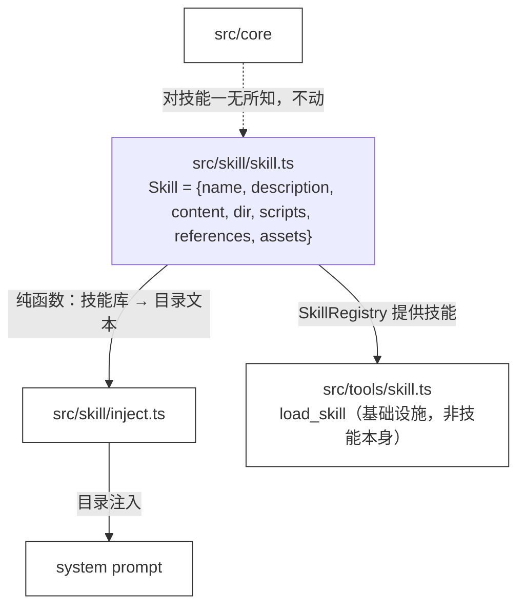

# 36 · Skill Injection

> <span class="stage-badge">Stage Hello Pi</span> · <span class="tag-badge">v36-skill-injection</span>

第三十五章，我们的 `SkillLoader` 把 `.skills/` 请进了 `SkillRegistry`——标准布局、真 YAML、还能读 anthropics/skills 的真实技能。收工的时候，`--skills` 能把技能连同名册数一遍。

但是，请容我们多追问一句：然后呢？**Agent 还是看不见它们。**

> **`SkillRegistry` 和 `AgentRuntime` 之间没有桥。** 技能躺在 `.skills/` 里被 `--skills` 数了一遍，却一个字都进不了模型的上下文。技能是知识，但**知识没上桌，Agent 就不知道它的存在**。

这一章，我们搭这座桥——而且这一次，**要做成真实可用的 Skill Harness**，不是演示玩具。接下来进入正题。

## 一、上一版存在什么问题？

先从 ch35 收尾开始：技能**只进了注册表，没进上下文**。

> 一句话：**技能有了「仓库」和「标准格式」，却没有「餐桌」。** 请进门了，但还上不了桌。

而「把技能送进上下文」这个需求，我们**一开始有个很自然的玩具思路**，恰好就是大多数人会写的第一版：**全文注入 + 启发式选择**。

```text
玩具思路：
  任务文本 × 技能描述 关键词打分  →  选中技能
  选中的技能全文拼进 system prompt
```

它在 demo 里跑得通——「帮我修报错」能选中 `debugging`。但往真实方向多看一眼，硬伤全出来了（**请重点关注**这些坑）：

1. **上下文会爆**：把选中的技能**全文**拼进 system prompt，技能一多、正文一长，token 直接失控——**一次任务可能只用得上技能的一小段，却把整本都背进考场**；
2. **选择器是玄学**：bigram 关键词打分，撞词就选、没撞就漏——**没有同义、没有语义**，英文技能（`internal-comms`）几乎永远选不中；真实业界里「该用哪个技能」是**模型读 `description` 自己决定**的，启发式把它抢走了；
3. **选择是静态的**：启动时选一次就定了，任务在对话里漂移也不会重选——**技能与任务绑死在第一句话**；
4. **能力还是空的**：技能的 `scripts` / `references` / `assets` 只有文件名，注入块里没有路径——**正文上桌了，脚本和资料还在抽屉里**；
5. **没有预算**：想加载多少就加载多少，**没有「一次最多带几个」的闸**。

> 一句话：**玩具版解决了「能不能看见」，没解决「怎么看才不炸、怎么真能用」。** 这一章，按业界已经跑通的方式来做，给我们的Hell Harness装上SKILL的技能

## 二、本篇解决什么问题？

业界（Agent Skills 开放标准，ch35 已介绍）的答案是一个叫**渐进式披露（progressive disclosure）**的机制：

- **启动只放「目录」**：上下文里只有每个技能的 `name + description`——这是选择所需的全部信息，体积小；
- **正文按需加载**：模型决定要用哪个技能后，通过工具把完整正文 + 配套能力**临时**取进上下文——用多少取多少；
- **能力跟着走**：加载返回技能目录路径与 `scripts` / `references` / `assets` 清单——脚本能跑、资料能读。

我们怎么按标准把来实现呢？这一章照这个标准做，一共五件事（接下来看下具体解决姿势）：

1. **目录注入（渐进式披露）**：`renderSkillCatalog` 只把 `name + description` 渲染进 system prompt，正文一个字节都不进——**上下文体积可控**；
2. **`load_skill` 工具**：模型按需加载技能正文与配套能力——**选择权交还给模型**（它读目录决定），选择变成运行时的、动态的；
3. **能力可用**：加载结果带上 `dir` 与 `scripts` / `references` / `assets` 路径——**bash 能跑脚本、read 能读资料**；
4. **预算与缓存**：同一技能重复加载走缓存，最多同时加载 3 个，超限结构化拒绝——**上下文不会被技能灌满，也不会无限加载**；
5. **CLI 接上**：hello-coding 0.8.0 注册第 7 个工具 `load_skill`，system prompt 组装时注入目录并打印「可用技能」清单。

核心心智模型：

> **上下文里只有「菜单」，正文是「点了才上」。** 目录 = 技能的名片（name + description）；`load_skill` = 传菜员（按需端上正文与能力）；预算 = 餐桌的大小（最多同时 3 道）。**这是 Agent Skills 标准在真实 harness 里的落地方式。**

关于边界，必须先说清一个容易误会的地方（**请注意**这一条）：

> **`load_skill` 是基础设施，不是「技能变成了工具」。** ch34 立住的是「技能不执行动作、只提供知识」——这条没破。`load_skill` 干的事是**把知识取进上下文**，它本身不执行任何技能动作；技能正文里的流程，仍然靠 `read` / `bash` 这些真正的工具去执行。**技能还是知识，加载是管道。**

这一章把线串一下：**上一版「技能只进注册表、没进上下文、玩具版全文注入各种爆」这些遗留问题 → 这一章用「渐进式披露 + load_skill + 能力可用 + 预算」解决 → 接下来看一个技能怎么从「躺在目录里」变成「随叫随到」。**

## 三、先看最终效果

先跑 demo（无需 API Key，下面是标准的使用姿势）：

```bash
$ node --import tsx examples/stage-4/36-skill-injection/demo.mts
```

输出结果如下：

```text
=== 36 · Skill Injection：渐进式加载 + 技能能力可用 ===

=== 1. 目录注入：只放 name + description（渐进式披露，正文不进上下文） ===
【可用技能】
本次任务可使用以下技能。需要某个技能时，调用 load_skill 工具加载其完整正文与配套能力（scripts/references/assets）；同一技能重复加载会走缓存；最多同时加载 3 个。

- debugging：排查报错 / 调试失败测试时使用：先复现，再逆推，最后用命令验证。
- refactor：重构现有代码时使用：保持行为不变，只改结构。
- internal-comms：A set of resources to help me write all kinds of internal communications...
- git-workflow：遵循仓库约定的 Git 提交与分支规范时使用：小步提交、清晰信息、干净历史。

（第 2 段「组装后的 system prompt」与第 1 段目录完全一致，只是接在 coding prompt 之后，此处略）

=== 3. load_skill：按需加载正文与配套能力 ===
  load_skill("debugging") → cached=false · 正文 196 字符 · dir=.skills\debugging
    scripts=[] · references=["常见报错清单.md"]
    references[0] 可读 → # 常见报错速查…（read 工具按 dir 相对路径即可读到）

=== 4. 重复加载走缓存 ===
  load_skill("debugging") 再调 → cached=true · loaded=1（不重复计数）

=== 5. 预算：最多 3 个，第 4 个被拒 ===
  refactor → ok
  git-workflow → ok
  internal-comms（第 4 个）→ 拒绝：已加载 3 个技能（上限 3），不再加载更多

=== 6. 未知技能有清晰拒绝 ===
  load_skill("nope") → 未知技能：nope，可用技能：debugging, refactor, internal-comms, git-workflow
```

CLI 侧（无需 API Key 也能看到目录注入的那一行，实测结果如下）：

```bash
$ node --import tsx src/cli/index.ts --tools --model-timeout 3000 --timeout 9000 "帮我修一下这个报错"
可用技能：debugging / refactor · 正文经 load_skill 按需加载（上限 3 个）
调用失败：缺少 OPENAI_API_KEY：请复制 .env.example 到 .env 后填入真实 Key
```

注意四个信息（**重点关注**这四点）：

1. **上下文里只有名片**：第 1 段整个目录就是几行 `name + description`——**正文一个字都没进**，这就是渐进式披露；
2. **正文是点了才上**：第 3 段 `load_skill` 一次调用，正文 + `dir` + `references` 全到位——**用多少取多少**；
3. **能力真的能用**：`references[0]` 能读、`dir` 能传给 bash——**脚本和资料不再是抽屉里的名字**；
4. **有闸**：重复加载走缓存、第 4 个被拒、未知技能有清晰理由——**上下文有预算，加载有边界**。

> 这就是这一章的兑现：**技能从「躺在 `.skills/` 里」到「站在模型面前、随叫随到」。** 目录 + 按需加载 + 能力 + 预算，一条完整的 skill harness 链路。然后就可以愉快的接着玩了。

## 四、架构变化

这一章的架构变化：**新增 `load_skill` 基础设施工具，目录注入替换玩具版全文注入。** 目录与文件的变化，先以树形看清楚：

```text
src/
├── skill/
│   ├── skill.ts              ← Skill 增加 dir（技能目录路径）；新增常量 MAX_SKILLS_LOADED=3
│   ├── loader.ts             ← loadSkill 填充 dir
│   └── inject.ts             ← 重写：renderSkillCatalog + injectSkillCatalog（目录注入，去掉启发式全文注入）
├── tools/
│   └── skill.ts              ← 新增：createSkillTool → load_skill 工具（按需加载 + 缓存 + 预算）
├── extensions/
│   └── hello-coding.ts       ← 注册第 7 个工具 load_skill（0.8.0）
└── cli/
    └── index.ts              ← system prompt 注入技能目录，打印「可用技能」清单
```

关键边界，画成流程图（手写风、白底黑框）：



> 注意：`Skill.dir` 是这一章给技能补上的「地址」。**有了地址，能力才能被引用**——`read` 按 `dir/references/*` 读资料，`bash` 按 `node dir/scripts/*` 跑脚本。它是能力可用的地基（**最基本的**，手动加强语气，地址不定，能力就端不上桌）。

## 五、核心抽象

这一章三个抽象：**目录渲染**（技能库 → 名片文本）、**加载工具**（名片 → 正文 + 能力）、**预算状态**（同一技能缓存 + 最多 N 个）。

### 目录渲染：上下文里只有名片

```ts
export function renderSkillCatalog(skills: Skill[], maxLoaded = MAX_SKILLS_LOADED): string {
  if (skills.length === 0) return "";
  const lines = skills.map((skill) => `- ${skill.name}：${skill.description}`);
  return `【可用技能】\n本次任务可使用以下技能。需要某个技能时，调用 load_skill 工具加载其完整正文与配套能力（scripts/references/assets）；同一技能重复加载会走缓存；最多同时加载 ${maxLoaded} 个。\n\n${lines.join("\n")}\n`;
}

export function injectSkillCatalog(systemPrompt: string, catalog: string): string {
  if (catalog === "") return systemPrompt;
  return `${systemPrompt.trim()}\n\n${catalog}`;
}
```

三个设计点值得点名（**重点关注**这三点）：

1. **只有 `name + description`**：目录的每一项都是「触发元数据」——正是 ch35 强调的、选择所需的全部信息，**正文再长也进不了目录**；
2. **指令说明怎么做**：目录里写明「调用 load_skill 加载、重复走缓存、上限 N 个」——**模型读到就知道流程，不用猜**；
3. **空库不污染**：没有技能时 `renderSkillCatalog` 返回空串，`injectSkillCatalog` 原样返回——**prompt 不被空目录脏化**。

### 加载工具：名片 → 正文 + 能力

`load_skill` 是第 7 个工具，注册在 hello-coding 里（0.8.0）。它的输入是技能名，输出是**正文 + 目录路径 + scripts/references/assets 清单 + 当前预算水位**：

```ts
export function createSkillTool(registry: SkillRegistry, options: { maxLoaded?: number } = {}): Tool {
  const maxLoaded = options.maxLoaded ?? MAX_SKILLS_LOADED;
  const loaded = new Map<string, Skill>();
  // 执行时：查注册表 → 未知技能拒绝（带可用清单）→ 已加载走缓存 → 超预算拒绝 → 加载并登记
}
```

一次成功的加载返回：

```text
{ name, cached, content（完整正文）, dir（目录路径）,
  scripts, references, assets（能力清单）, loaded（当前水位）, maxLoaded }
```

> 注意输出的两个「坐标」：`content` 让知识直接进上下文；`dir` + 能力清单让 `read` / `bash` 能**引用**这些能力——**一个加载调用，知识和方法一起到位**。

### 预算状态：闸在工具里

工具通过闭包持有已加载集合，实现三类行为：

| 场景 | 行为 |
| --- | --- |
| 技能已加载 | 返回缓存内容，`cached=true`，**不重复计数** |
| 已加载数 ≥ 上限 | 拒绝：`已加载 N 个技能（上限 N），不再加载更多` |
| 技能不在注册表 | 拒绝：`未知技能：xxx，可用技能：…`（带上完整清单） |

> 这里的三类返回，是第一次给工具做**结构化拒绝**：不是一句笼统的「不行」，而是「**为什么不行、该怎么改**」（未知的给清单、超限的给水位）。这几乎是 ch37 Permission Gate 的预演——**拒绝要有理由**。

## 六、实现代码

### `src/skill/inject.ts`（完整）

下面给出完整实现：

```ts
import type { Skill } from "./skill";
import { MAX_SKILLS_LOADED } from "./skill";

export function renderSkillCatalog(skills: Skill[], maxLoaded = MAX_SKILLS_LOADED): string {
  if (skills.length === 0) return "";
  const lines = skills.map((skill) => `- ${skill.name}：${skill.description}`);
  return `【可用技能】\n本次任务可使用以下技能。需要某个技能时，调用 load_skill 工具加载其完整正文与配套能力（scripts/references/assets）；同一技能重复加载会走缓存；最多同时加载 ${maxLoaded} 个。\n\n${lines.join("\n")}\n`;
}

export function injectSkillCatalog(systemPrompt: string, catalog: string): string {
  if (catalog === "") return systemPrompt;
  return `${systemPrompt.trim()}\n\n${catalog}`;
}
```

### `src/tools/skill.ts`（完整）

我们新增一个`load_skill`的工具，用于加载完整的skill上下文能力，提供给大模型

```ts
import type { Tool, ToolResult } from "../core/tool/tool";
import type { SkillRegistry } from "../skill/skill";
import { MAX_SKILLS_LOADED } from "../skill/skill";

export interface SkillInput {
  name?: unknown;
}

export function createSkillTool(registry: SkillRegistry, options: { maxLoaded?: number } = {}): Tool {
  const maxLoaded = options.maxLoaded ?? MAX_SKILLS_LOADED;
  const loaded = new Map<string, Skill>();

  return {
    name: "load_skill",
    description: `加载一个技能的完整正文与配套能力。技能名必须在【可用技能】清单里；同一技能重复加载直接返回已加载内容（不重复计数）；最多同时加载 ${maxLoaded} 个，超过会被拒绝。`,
    parameters: {
      type: "object",
      properties: { name: { type: "string", description: "技能名，例如 debugging" } },
      required: ["name"],
    },
    async execute(input: unknown): Promise<ToolResult> {
      const { name } = input as SkillInput;
      if (typeof name !== "string" || name.trim() === "") {
        return { ok: false, error: "参数 name 必须是技能名字符串", kind: "tool", retryable: false };
      }
      const skill = registry.get(name);
      if (!skill) {
        const available = registry.list().map((s) => s.name).join(", ") || "（无）";
        return { ok: false, error: `未知技能：${name}，可用技能：${available}`, kind: "tool", retryable: false };
      }
      const existing = loaded.get(name);
      if (existing) {
        return {
          ok: true,
          value: {
            name, cached: true,
            content: existing.content, dir: existing.dir,
            scripts: existing.scripts ?? [], references: existing.references ?? [], assets: existing.assets ?? [],
            loaded: loaded.size, maxLoaded,
          },
        };
      }
      if (loaded.size >= maxLoaded) {
        return { ok: false, error: `已加载 ${loaded.size} 个技能（上限 ${maxLoaded}），不再加载更多`, kind: "tool", retryable: false };
      }
      loaded.set(name, skill);
      return {
        ok: true,
        value: {
          name, cached: false,
          content: skill.content, dir: skill.dir,
          scripts: skill.scripts ?? [], references: skill.references ?? [], assets: skill.assets ?? [],
          loaded: loaded.size, maxLoaded,
        },
      };
    },
  };
}
```

四个设计点值得点名（**重点关注**这四点）：

1. **闭包持有预算状态**：`loaded` 是工具工厂闭包里的 `Map`——工具仍然是「input → environment → output」的纯契约，**状态是环境的私有物**，和 `createReadTool(workspace)` 一个姿势；
2. **缓存优先**：已加载的技能直接返回缓存，`loaded` 大小不变——**重复加载不消耗预算，也不重复读**；
3. **三类拒绝都有理由**：参数错、未知技能（带可用清单）、超预算（带当前水位）——**模型能据此自我修正**（换个名、别再加载）；
4. **返回带上水位**：`loaded` / `maxLoaded` 随每次结果返回——**模型自己就能看到预算还剩多少**。

### CLI：组装时注入目录

在CLI的组装时，完成SKILL的渐进式披露注入系统提示词：

```ts
const baseSystemPrompt = prompts.get("coding")?.content ?? DEFAULT_SYSTEM_PROMPT;
const prompt = args.question ?? "用一句话介绍你自己";

const skillCatalog = renderSkillCatalog(skills.list());
const systemPrompt = injectSkillCatalog(baseSystemPrompt, skillCatalog);
if (skillCatalog !== "") {
  console.log(`可用技能：${skills.list().map((s) => s.name).join(" / ")} · 正文经 load_skill 按需加载（上限 ${MAX_SKILLS_LOADED} 个）`);
}
```

### hello-coding：第 7 个工具

在 `src/extensions/hello-coding.ts` 中，完成`load_skill`工具的注入

```ts
export function createHelloCodingExtension(workspace: Workspace, options: { promptsDir?: string; skillsDir?: string } = {}) {
  return defineExtension({
    name: "hello-coding",
    version: "0.8.0",
    description: "Coding Agent 本体：7 个工具（calculator/random/read/write/edit/bash/load_skill）、prompt 模板、.skills/ 技能加载与技能目录注入均由扩展注册。",
    setup(ctx) {
      ctx.tools.register(calculator);
      ctx.tools.register(randomInteger);
      ctx.tools.register(createReadTool(workspace));
      ctx.tools.register(createWriteTool(workspace));
      ctx.tools.register(createEditTool(workspace));
      ctx.tools.register(createBashTool(workspace));
      // load_skill工具的注入
      ctx.tools.register(createSkillTool(ctx.skills));

      const promptLoader = new PromptLoader(path.resolve(workspace.root, options.promptsDir ?? "prompts"));
      for (const prompt of promptLoader.loadSync()) {
        ctx.prompts.register(prompt);
      }

      const skillLoader = new SkillLoader(path.resolve(workspace.root, options.skillsDir ?? ".skills"));
      for (const skill of skillLoader.loadSync()) {
        ctx.skills.register(skill);
      }
    },
  });
}
```

> 注意注册时机：`createSkillTool` 在工具注册阶段就创建，但技能的 `register` 在后面 setup 里才发生——**没关系，`load_skill` 执行时才查注册表**，工具持有的是注册表的引用，不是快照。**这正是 registry 模式的功劳。**

## 七、运行 Demo

我们在 `examples/stage-4/36-skill-injection/fixtures` 下面新增一个用于测试skill的项目，接下来我们在这个项目内，看看skill是否正确加载启用


```bash
$ cd examples/stage-4/36-skill-injection/fixtures/price-calc

$ hello --chat --trace-hook

可用技能：debugging · 正文经 load_skill 按需加载（上限 3 个）

Hello Harness v1.0 · 流式多轮对话（输入 exit 退出，Ctrl+C 取消本轮）
Session : d4b64069-962b-4e9b-a9df-713f7f955f3c
Sessions: D:\Workspace\hui\project\hello-harness\examples\stage-4\36-skill-injection\fixtures\price-calc/.sessions
你 > 我发现 price.ts 的实现有问题，请参照 debugging 技能进行优化
```

注意上面的输出，在启动之后，就已经明确告诉我们可用技能 `debugging`，接下来，按照预期应该是先触发 `load_skill` 来获取完整的技能


接下来按照SKILL的要求，执行脚本进行复现

- 根据skill的要求，先进行问题复现
- 然后读取代码，修复代码
- 全量测试验证


---


除了上面示例项目演示之外，也可以通过下面的方式进行简单快速验证


```bash
# 1. 本章 demo：目录注入 → 按需加载 → 缓存 → 预算 → 拒绝，无需 API Key
$ node --import tsx examples/stage-4/36-skill-injection/demo.mts
```


| 验证点 | 结果 |
| --- | --- |
| 渐进式披露 | demo 第 1 段：上下文只有 name + description |
| 按需加载 | demo 第 3 段：正文 + dir + 能力清单一次到位 |
| 能力可用 | demo 第 3 段：references[0] 可读 |
| 缓存 | demo 第 4 段：重复加载 cached=true、水位不变 |
| 预算 | demo 第 5 段：第 4 个被拒并给出上限 |
| 结构化拒绝 | demo 第 6 段：未知技能给出可用清单 |

## 八、解决了什么

1. **渐进式披露落实了**：上下文只有目录，正文随 `load_skill` 按需进场——**技能再多，上下文只长目录那么点**，Agent Skills 标准的核心机制落地；
2. **选择权还给模型**：不再用关键词打分抢答，**模型读 `description` 决定用哪个技能**——选择从静态变成运行时动态，任务在对话里漂移也能随时再加载；
3. **能力真的可用**：`dir` + `scripts` / `references` / `assets` 随加载返回，`read` 能读资料、`bash` 能跑脚本——**技能不再只是几行文字**；
4. **有预算、有缓存**：最多同时 3 个、重复走缓存、超限结构化拒绝——**上下文不会被技能灌满，模型知道自己剩多少额度**；
5. **边界保持**：Core 对技能依旧无知，`load_skill` 只是第 7 个普通工具，**「技能是知识、工具是手」的 ch34 原则纹丝不动**；
6. **拒绝有理由**：未知技能带可用清单、超预算带水位——**这是第一次给工具做结构化拒绝，ch37 权限闸的预演**。

### 完整实现流程与工作原理

上面六个点回答的是「解决了什么」，这里把整个 Skill 机制**从头到尾串一遍**——从 `.skills/` 里的一个 SKILL.md 文件，到模型真正照着它干活，中间到底发生了什么。

#### 1. 完整实现流程：从 SKILL.md 到模型上下文

```text
.skills/<skill>/SKILL.md
   │ ① 加载：SkillLoader.loadSync()          （src/skill/loader.ts）
   │    - yaml 解析 frontmatter：name / description
   │    - 读正文 content；扫描 scripts / references / assets；记录 dir
   ▼
Skill 对象 { name, description, content, dir, scripts, references, assets }
   │ ② 注册：ctx.skills.register(skill)      （src/extensions/hello-coding.ts）
   ▼
SkillRegistry
   │ ③ 目录注入：renderSkillCatalog()         （src/skill/inject.ts）
   │    只放 name + description，正文一个字节都不进
   ▼
【可用技能】卡片 ──注入──▶ system prompt     （src/cli/index.ts）
   │ ④ 模型读卡片：任务命中某个 description
   ▼
模型发起 function calling：load_skill(name)  （src/tools/skill.ts）
   │ ⑤ 工具执行：查注册表 → 缓存？预算？→ 取正文
   ▼
正文 + dir + scripts/references/assets ──▶ 工具结果 ──▶ 上下文
   │ ⑥ 模型「看到」技能全文，开始照着执行
   ▼
read 读代码 / bash 跑脚本 / 对照 references（能力落地）
```

拆成六步，每一步对应一个真实的文件：

| 步骤 | 谁在做 | 产物 | 关键点 |
| --- | --- | --- | --- |
| ① 加载 | `SkillLoader` | 标准 `Skill` 对象 | 目录名即 id，frontmatter 只信 `name`/`description`，正文与能力路径一次性摸清 |
| ② 注册 | `hello-coding` 扩展 | `SkillRegistry` 里的条目 | 与工具、prompt 同级的第四种能力，靠扩展注入 |
| ③ 目录注入 | `renderSkillCatalog` | 【可用技能】卡片 | **只放名片**——这是渐进式披露的落点 |
| ④ 模型决策 | 大模型（function calling） | `load_skill` 调用 | **选择权在模型**，读 description 自己判断 |
| ⑤ 按需加载 | `load_skill` 工具 | 正文 + 能力清单进上下文 | 查注册表 → 缓存/预算两道闸 → 返回 `content`/`dir`/`scripts`/`references` |
| ⑥ 能力落地 | 模型 + `read`/`bash` | 修复 / 复现 / 回归 | 按技能正文执行，脚本靠 `dir` 相对路径引用 |

#### 2. 工作原理：六个关键设计

1. **「菜单 + 传菜」分层**：上下文里永远只有菜单（name + description），正文是「点了才上」——**模型看到的是选择所需的全部信息，正文是它执行所需的全部信息，两件事分开放**；
2. **加载是函数、不是拼接**：`load_skill` 是普通工具，走 `ToolRegistry.execute` 同一套机制——**它和 `read`、`bash` 地位平等**，所以预算、缓存、结构化拒绝这些「工具通用治理」在它身上天然生效；
3. **状态在闭包里**：缓存与预算的 `Map` 是工具工厂闭包的私有物——**技能机制不需要 Runtime 开新口子**，Core 边界纹丝不动；
4. **能力是「引用」不是「拷贝」**：加载结果里给的是 `dir` + 文件清单——**正文进了上下文，文件还在磁盘上**，模型用 `read`/`bash` 按相对路径去用，加载只负责「告诉它东西在哪、怎么用」；
5. **决策延迟到运行时**：不预选、不预拼，模型在每一轮都能重新决定「要不要技能、要哪个」——**任务在对话里漂移，技能也能跟着换**；
6. **一切可观察**：目录、加载结果（cached / loaded / maxLoaded）、拒绝理由都结构化返回——**harness 每一步都在明牌**。

#### 3. 大模型是如何「加载」和「使用」技能的

拿第七节 chat demo 的场景走一遍模型视角的完整过程：

**加载前（启动时）**——模型的 system prompt 里只有这么一张卡片：

```text
【可用技能】
- debugging：排查本项目（price-calc）报错 / 失败测试时使用：先复现，再逆推，最后用命令验证。
```

它**看不见** SKILL.md 正文、看不见复现脚本、看不见参考资料——此刻它只知道「有这么个技能，干什么用的」。

**加载时（对话中）**——用户说「price.ts 的实现有问题，请参照 debugging 技能进行优化」：

1. 模型读到 `debugging` 的描述，判定命中任务 → 发起一次 function calling：`load_skill("debugging")`；
2. harness 查注册表命中 → 返回完整正文 + `dir` + `scripts` / `references` 清单；
3. 工具结果进上下文，模型**第一次真正「看到」技能全文**：流程（先复现 → 再逆推 → 最后验证）、常用命令（`npm run repro` / `npm test`）、可用的脚本与资料。

**使用中（技能开始干活）**——模型按技能正文一步步执行：

```text
① 复现   bash：npm run repro            → 锁定失败用例 calcPrice(99.9, 0) = 99
② 逆推   read：price.ts                 → 根因：Math.floor 吞了分位
③ 修复   edit：去掉先取整那行
④ 回归   bash：npm test                 → 5 个用例全绿
```

其中**每一步的「怎么走」都是技能正文教的**（复现命令、验证姿势、参考资料里的陷阱清单），而**「怎么执行」用的是 `read / bash / edit` 这些基本的工具**——技能给方法，工具给手脚。

**使用后（这一轮结束）**——技能留在闭包缓存里：同一会话再次触发 `load_skill("debugging")` 直接走缓存、不重复计数；任务切换到别的领域（比如重构），模型再按目录决定加载 `refactor`。**整个生命周期里，模型只在「决策」和「执行」两处参与，其余全是 harness 的活。**

> **一句话总结工作原理**：harness 把技能做成了「**按需供应的知识管道**」——目录负责让模型知道有什么（渐进式披露），`load_skill` 负责让模型拿得到（工具化加载），`read`/`bash` 负责让模型用得上（能力落地）。**技能从「躺在仓库里的 Markdown」变成「模型随叫随到、照着干活的知识包」。**

## 九、引入了什么问题

接下来再泼盆冷水，看看这一版还留了哪些坑：

1. **模型可能忘了加载**：目录只是「菜单」，模型不调 `load_skill` 就永远只有名片——**靠模型自觉，不是 harness 强制**；将来可以加「目录外再兜底一次启发式提示」；
2. **预算是进程级的**：`loaded` 闭包跟着工具活一整个进程，chat 多轮共享同一额度——**没有按 run / 按会话重置**，长会话会越走越紧；
3. **能力只给路径，不校验存在**：`scripts` / `references` 是文件名清单，脚本能不能跑、资料是否存在没有验证——**家当进了菜单，端上来坏了才知道**；
4. **没有 token 统计**：目录和加载正文各占多少 token 没有上报——**渐进披露省了多少，说不清楚**；
5. **目录全量注入**：技能库大了（几十个），连名片都占上下文——**真实系统会按任务先筛一轮名片**，这是后续 Skill Eval / 检索的活；
6. **`load_skill` 的 `dir` 是加载器视角的相对路径**：依赖 workspace 根目录作 cwd（bash 正好如此），**跨目录或子进程场景需要再校验路径边界**。

## 十、下一章

技能终于能真实影响 Agent 的行为了——目录、按需加载、能力、预算，一条完整的 skill harness 链路。

但这一章引出一个更大的缺口：**工具想跑就跑。**

- 模型说一句「帮我删掉所有日志文件」，`bash` 工具就真的会去执行；
- 没有人在工具调用前问一句「这个操作允许吗」；
- ch36 给了技能**预算与结构化拒绝**，但工具本身还没有权限这道闸。

下一章，**Permission Gate**：在工具执行前立一道门——`allow` / `deny` / `ask`：

```text
工具调用前
   ↓
allow / deny / ask
```

从「技能上桌、按需取用」到「动作有闸、先问后跑」，ch37 见。

> **本阶段汇总**：技能从「定义 → 加载 → 渐进式注入」走完真实 harness 闭环——目录披露、按需加载、能力可用、预算受控。下一步，给所有工具装上权限的缰绳。


本文完成之后，终于给我们的Hello Harness装上了技能库，可以服用行业内的一些经典的skill来实现更复杂的场景了，虽然只是往前走了一小步，但起到的能力提升可以说是跨时代的了😊，我们的Hello harness好像也逐渐脱离玩具的范畴了~


以上内容纯属一家之言，因个人能力有限，难免有疏漏和错误之处，如发现 bug 或者有更好的建议，欢迎批评指正，不吝感激 🙃


欢迎点赞、关注公众号「一灰灰Blog」 我们下章见

---

微信公众号: 一灰灰Blog

