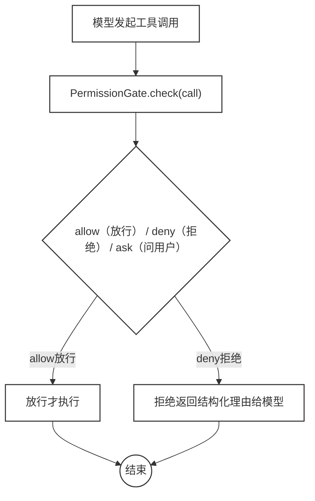
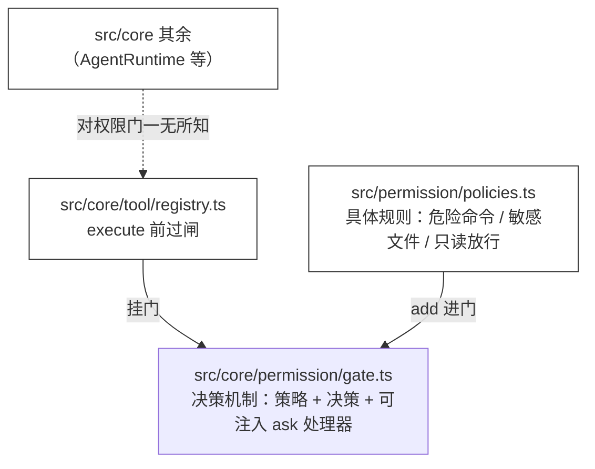
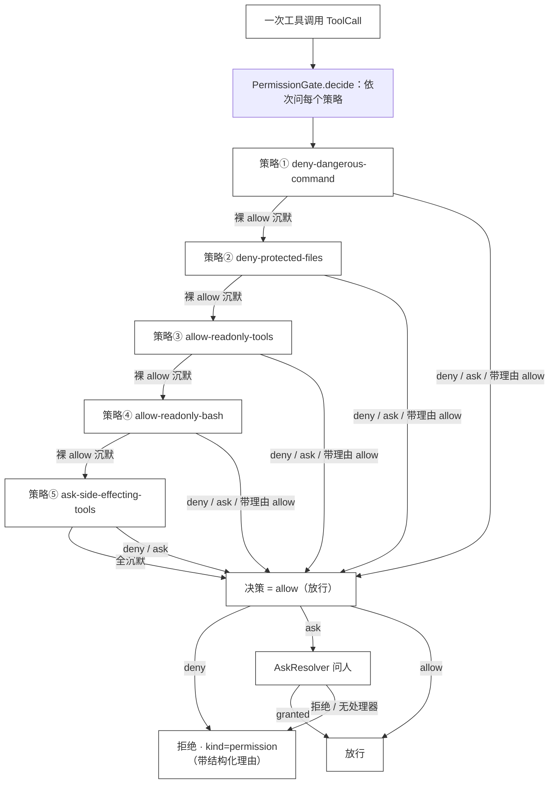

# 37 · Permission Gate

> <span class="stage-badge">Stage Hello Pi</span> · <span class="tag-badge">v37-permission</span>

第三十六章，技能终于上桌了——目录披露、按需加载、能力可用、预算受控，一条完整的 skill harness 链路。

但收工之前，我们自己在「引入了什么问题」里留了一个大坑：

> **工具想跑就跑。** 模型说一句「帮我删掉所有日志文件」，`bash` 工具就真的会去执行；没有人在工具调用前问一句「这个操作允许吗」。

这一章，就在工具执行前立一道门。接下来进入正题。

## 一、上一版存在什么问题？

回看整个工具链：`ToolRegistry.execute` 是唯一的执行咽喉，`bash` 能执行任意命令、`write` 能写任意文件、`edit` 能改任意内容——（这就有一个高风险事项了，如果直接执行了 `rm -rf /` 命令，岂不是一下把服务器都干崩了😂）


虽然我们在前面对工具的执行添加了一层Worksapce的边界：

> **路径边界（[ch23 的 Workspace](../stage-hello-coding-agent/23-workspace)）**：路径不能出 workspace 圈。

Workspace 只回答了「**去哪**」的问题，没回答「**该不该**」的问题（**请注意**这一条）：

1. **`rm -rf node_modules` 也能跑**：命令在 workspace 圈内，路径边界不拦——**「去哪」合法，不代表「干什么」安全**；
2. **`write .env` 也能写**：`.env` 在 workspace 圈内，但里面是密钥——**路径合法，内容不该碰**；
3. **没有人在执行前介入**：模型说要删，harness 就删——**没有「先问后跑」的环节**；
4. **拒绝没有结构化理由**：将来想拦，也得有个清晰的「为什么不行、该怎么办」——**ch36 给技能做了结构化拒绝，工具却没有**。

> 一句话：**路径边界管「脚」能到哪，Permission Gate 管「手」该不该伸。** 这一章补上后者。说白了，脚能进去不代表手能乱动 😂

## 二、本篇解决什么问题？

在工具调用前立一道**权限门（Permission Gate）**，让每一次工具调用都先过闸：




那么问题来了：既然「先问后跑」势在必行，我们怎么把它做成一套干净的机制嵌入到我们的这套Harness的体系中呢？

这一章做五件事（接下来看下具体解决姿势）：

1. **三态决策**：`allow` / `deny` / `ask`——**能自动放行的放行，能自动拒绝的拒绝，拿不准的交给人**；
2. **策略化**：规则是一个个 `PermissionPolicy` 对象（`name + description + check`），**可以任意增删组合，像插件一样装上**；
3. **默认策略**：危险命令（`rm -rf` 等）直接 deny、敏感文件（`.env` / `.sessions` / `.git`）直接 deny、只读工具与只读 bash 命令（`ls` / `dir` / `cd` / `node -v` / `git status` 等）放行、其余会改世界的操作 ask——**开箱即有闸**；
4. **ask 是可注入的处理器**：CLI 里把 ask 接到终端输入（人确认），demo 里接一个自动应答——**权限门不绑定交互方式**；
5. **fail-closed**：没装 ask 处理器时，ask 一律按拒绝处理——**没人确认 = 不放行**，宁可不做不可错做。

核心心智模型：

> **权限门是一群「异议者」**：每个策略都是一个异议者，它要么出异议（deny / ask），要么沉默（裸 allow）。
> **谁先出异议（deny / ask）谁获胜；全沉默才放行。** 带理由的 `allow`（如「这是只读命令，无副作用」）是**明确的放行宣告**，同样是终态——我们既要有「不同意就拦下」的闸，也要有「明确同意就放行」的闸，不然只读的 `ls`、`cd` 也会被逮去问一遍。没有人确认的 ask，视为异议成立（拒绝）。

这一章把线串一下：**前面的实现「工具想跑就跑、只有路径边界、执行前没人介入、拒绝没结构」这些遗留问题 → 这一章用「PermissionGate 三态 + 策略化 + fail-closed」解决 → 接下来看一个危险命令怎么在闸前被拦下。**

## 三、先看最终效果

跑 demo（无需 API Key，下面是标准的使用姿势）：

```bash
$ node --import tsx examples/stage-4/37-permission-gate/demo.mts
```

输出结果如下：

```text
=== 1. 已安装的权限策略 ===
  deny-dangerous-command · bash 里的危险命令（rm -rf / del /q / rd /s / drop database / git push --force 等）直接拒绝
  deny-protected-files · write / edit 的目标是 .env / .sessions / .git 等敏感路径时直接拒绝
  allow-readonly-tools · calculator / random / read / load_skill 只读不改世界，直接放行
  allow-readonly-bash · bash 里整条命令都是只读操作（ls / dir / cd / pwd / grep / cat / node -v / git status 等）直接放行；拼接了多条命令的不在此列，交给 ask
  ask-side-effecting-tools · 其余会改世界或执行命令的操作（write / edit / bash 里的非只读命令）默认询问用户

=== 2. allow：只读工具 / 只读命令直接放行 ===
  calculator(17 * 38)
    决策 → 允许 [allow]（calculator 是只读工具，无副作用）
    结果 → 执行成功：value=646
  read("notes/demo.txt")
    决策 → 允许 [allow]（read 是只读工具，无副作用）
    结果 → 执行成功：value="hello harness"
  bash("dir")
    决策 → 允许 [allow]（只读命令（dir），无副作用）
    结果 → 执行成功：stdout="..."（exitCode=0）
  bash("cd notes")
    决策 → 允许 [allow]（只读命令（cd notes），无副作用）
    结果 → 执行成功：stdout=""（exitCode=0）
  bash("node --version")
    决策 → 允许 [allow]（只读命令（node --version），无副作用）
    结果 → 执行成功：stdout="v25.6.1"（exitCode=0）
  bash("dir && echo ok")（拼接命令不在只读名单，交给 ask）
    决策 → 允许（ask 已获批准）（该操作有副作用，需要用户确认）
    结果 → 执行成功：stdout="..."（exitCode=0）

=== 3. deny：危险命令 / 敏感文件直接拒绝 ===
  bash("rm -rf node_modules")
    决策 → 拒绝 [deny]（bash 命令包含危险操作（rm -rf 等），禁止执行：rm -rf node_modules）
    结果 → 失败：...（kind=permission · retryable=false）
  write(".env", "KEY=secret")
    决策 → 拒绝 [deny]（目标路径属于敏感文件（.env），禁止写入）

=== 4. ask：交给用户，批准则执行 ===
  write("notes/hello.txt", "hi")
    决策 → 允许（ask 已获批准）（该操作有副作用，需要用户确认）
    结果 → 执行成功：value="已写入 notes/hello.txt（2 字符，内容未变化）"
  bash("node --version")
    决策 → 拒绝 [ask]（该操作有副作用，需要用户确认）
    结果 → 失败：用户拒绝：bash（该操作有副作用，需要用户确认）（kind=permission · retryable=false）

=== 5. fail-closed：没装 ask 处理器 = 一律拒绝 ===
  bash("node --version")（无 ask 处理器）
    决策 → 拒绝 [ask] → 失败：用户拒绝...

=== 6. auto-approve：ask 自动批准 ===
  bash("node --version")（auto-approve）
    决策 → 拒绝 [ask]（...）
    结果 → 执行成功：stdout="v25.6.1"（exitCode=0）
```

CLI 侧（无需 API Key 也能看门，实测结果如下）：

```bash
$ hello --permissions
Workspace: D:\Workspace\hui\project\hello-harness
已安装的权限策略（policy）：
  deny-dangerous-command · bash 里的危险命令（rm -rf / del /q / rd /s / drop database / git push --force 等）直接拒绝
  deny-protected-files · write / edit 的目标是 .env / .sessions / .git 等敏感路径时直接拒绝
  allow-readonly-tools · calculator / random / read / load_skill 只读不改世界，直接放行
  allow-readonly-bash · bash 里整条命令都是只读操作（ls / dir / cd / pwd / grep / cat / node -v / git status 等）直接放行；拼接了多条命令的不在此列，交给 ask
  ask-side-effecting-tools · 其余会改世界或执行命令的操作（write / edit / bash 里的非只读命令）默认询问用户
```

注意四个信息（**重点关注**这四点）：

1. **三态分流**：只读直接放行（第 2 段）、危险直接拒绝（第 3 段）、其余问人（第 4 段）——**一条链路三种命运**；
2. **拒绝是结构化的**：每次拒绝都带 `kind=permission · retryable=false` 和理由——**模型能看清为什么不行**；
3. **ask 不执行 = 拒绝**：第 5 段没装 ask 处理器，bash 直接不放行——**fail-closed**；
4. **ask 只是闸门，不是阻塞**：第 6 段 auto-approve 下 ask 全批——**「问谁」完全由调用方注入**。

> 这就是这一章的兑现：**工具执行从「想跑就跑」变成「先问后跑」。** 门是机制的，规则是配置的，确认是人的。然后就可以愉快的接着玩了。

## 四、架构变化

这一章的架构变化：**Core 新增一个最小的权限门机制，规则放应用层，CLI 负责接线。** 目录与文件的变化，先以树形看清楚：

```text
src/
├── core/
│   ├── permission/
│   │   └── gate.ts          ← 新增：PermissionDecision / PermissionPolicy / PermissionGate（机制）
│   └── tool/
│       └── registry.ts      ← execute 前过闸；拒绝返回 kind=permission
├── permission/
│   └── policies.ts           ← 新增：默认策略（deny-dangerous / deny-protected / allow-readonly-tools / allow-readonly-bash / ask-side-effecting）
└── cli/
    ├── index.ts             ← 装配默认门、--permissions / --auto-approve / --no-permissions、交互式 ask
    └── chat.ts              ← chat 复用自身 readline 做权限确认
examples/stage-4/37-permission-gate/demo.mts ← 全链路 demo
```

关键边界，画成流程图：




> 注意：权限门挂在 **`ToolRegistry.execute`** 这个唯一的执行咽喉上，所以它**天然覆盖所有工具**——不管是 hello-coding 的 7 个工具，还是将来任何扩展注册的新工具。**这是 Registry 单点收口的红利**（一个咽喉管住所有出口）。

## 五、核心抽象

这一章三个抽象：**决策（PermissionDecision）**、**策略（PermissionPolicy）**、**门（PermissionGate）**，外加一个可注入的 **ask 处理器（AskResolver）**。

先别急着看代码，我们花点篇幅把这四样东西怎么串成一个整体说清楚——很多小伙伴读到这里会卡，正是因为只看见了零散的零件、没看见装配图。

**一句话串联**：策略是「异议者」，每个策略只管自己那段、要么沉默（裸 `allow`）要么出异议（`deny` / `ask`），出 `allow` 时**带上理由就是明确的放行宣告**（例如「只读命令，无副作用」）；门（`PermissionGate`）负责把一串策略按顺序问一遍、**谁先出异议谁获胜、带理由的 allow 立即放行、全沉默才放行**，最后产出一个**决策（PermissionDecision）**这三态之一；如果这个决策是 `ask`，门再把它交给**可注入的 ask 处理器**去问人，没人确认就当拒绝（fail-closed）。四者分工是一条线：**策略出异议 → 门裁决 → 决策三态 →（ask 时）需人确认**。

我们以一次工具调用的完整流程图看看




> 这张图就是本节全部代码的「装配图」：下面四个小节，分别是图里的**决策**、**策略**、**门**、**ask 处理器**四块，对着图看代码就不容易散架。

### Decision:决策三态

我们采用三种形态，来表达我们的意见（同意执行、拒绝执行、询问后确认是否执行）

```ts
export type PermissionDecision =
  | { action: "allow"; reason?: string }
  | { action: "deny"; reason: string }
  | { action: "ask"; reason: string };
```

三个设计点值得点名（**重点关注**这三点）：

1. **allow 分两种：裸 allow 是「沉默」，带理由的 allow 是「明确放行」**：策略不适用就返回不带理由的 allow，意思是「我不出异议」；策略判定这是只读操作（`ls` / `cd` / `calculator` 等）就返回带理由的 allow，意思是「我确认安全，直接放行」——**两种都是终态，前者等其他人表态，后者当场拍板**；
2. **deny / ask 必带 reason**：拒绝和询问都必须说清为什么——**模型拿到的不是一句「不行」，是「为什么不行」**；
3. **deny 与 ask 的区别**：deny 是「无条件不行」（`rm -rf` 高危操作，不予批准——但是请注意，对于一些临时文件的删除，这种实际诉求中是常见的），ask 是「拿不准，问人」（写个普通文件，人批一下就能跑）——**自动化的边界划得很清楚**。

### Policy:策略->返回工具的判定决策

```ts
export interface PermissionPolicy {
  readonly name: string;
  readonly description: string;
  check(call: ToolCall): PermissionDecision;
}
```

三个设计点值得点名（**重点关注**这三点）：

1. **name + description 是「名片」**：每个策略都有名字和一句话说明，CLI 的 `--permissions` 直接列出来——**门上装了什么，一眼可见**；
2. **check 是纯函数**：给一个调用，返回一个决策，无副作用——**策略可以任意组合、单独测试**；
3. **策略是配置不是机制**：Core 里只有 `PermissionPolicy` 接口，具体规则全在 `src/permission/policies.ts`——**加新规则不用动 Core**。

### Gate:门->先出异议者获胜

```ts
export class PermissionGate {
  async decide(call: ToolCall): Promise<PermissionDecision> {
    for (const policy of this.policies) {
      const decision = policy.check(call);
      if (decision.action === "deny" || decision.action === "ask") return decision;
      if (decision.action === "allow" && decision.reason) return decision;
    }
    return { action: "allow" };
  }
}
```

> **从第一个策略开始问，谁先出异议（deny / ask）谁获胜；出带理由的 allow（明确放行，如「只读命令」）也当场定案；全都只回裸 allow（沉默）才放行。** 这就是「异议模型 + 明确放行」——被任何一道闸拦住就到此为止，反过来任何一道闸拍板放行也到此为止。骚操作谈不上，但这套「谁先表态谁赢」的逻辑很干脆：**闸既要能拦，也要能放，不然只读的 `ls`、`cd` 也会被逮去问一遍。**

### ask 处理器：响应用户的决策结果

```ts
export type AskResolver = (call: ToolCall, reason: string) => Promise<boolean>;

export class PermissionGate {
  async check(call: ToolCall): Promise<PermissionCheck> {
    const decision = await this.decide(call);
    if (decision.action === "deny") return { allowed: false, decision };
    if (decision.action === "ask") {
      const granted = this.askResolver ? await this.askResolver(call, decision.reason) : false;
      if (!granted) return { allowed: false, decision };
    }
    return { allowed: true, decision };
  }
}
```

两个关键点值得点名（**重点关注**这两点）：

1. **ask 处理器是可注入的**：CLI 注入终端交互，demo 注入自动应答，测试注入假的——**「问谁」是调用方的自由**，权限门不绑定任何交互方式；
2. **没处理器 = 拒绝**：`askResolver ? ... : false`——**没人能确认，就当拒绝**，这是 fail-closed 的落点。

> 注意 `decide`（纯策略判断）和 `check`（加上人的确认）的分层：**规则是一层，人是另一层**。这样策略可以离线测试，人在运行时注入。

## 六、实现代码

### `src/core/permission/gate.ts`（完整）

gate的实现中，包含上面的 `Decision` `Policy` `Gate` `AskResolver` 的四个核心抽象

```ts
import type { ToolCall } from "../model/types";

export type PermissionDecision =
  | { action: "allow"; reason?: string }
  | { action: "deny"; reason: string }
  | { action: "ask"; reason: string };

export interface PermissionPolicy {
  readonly name: string;
  readonly description: string;
  check(call: ToolCall): PermissionDecision;
}

export type AskResolver = (call: ToolCall, reason: string) => Promise<boolean>;

export interface PermissionCheck {
  allowed: boolean;
  decision: PermissionDecision;
}

export class PermissionGate {
  private readonly policies: PermissionPolicy[] = [];
  private askResolver?: AskResolver;

  add(policy: PermissionPolicy): void {
    this.policies.push(policy);
  }

  setAsk(resolver: AskResolver): void {
    this.askResolver = resolver;
  }

  list(): PermissionPolicy[] {
    return [...this.policies];
  }

  async decide(call: ToolCall): Promise<PermissionDecision> {
    for (const policy of this.policies) {
      const decision = policy.check(call);
      if (decision.action === "deny" || decision.action === "ask") return decision;
      if (decision.action === "allow" && decision.reason) return decision;
    }
    return { action: "allow" };
  }

  async check(call: ToolCall): Promise<PermissionCheck> {
    const decision = await this.decide(call);
    if (decision.action === "deny") return { allowed: false, decision };
    if (decision.action === "ask") {
      const granted = this.askResolver ? await this.askResolver(call, decision.reason) : false;
      if (!granted) return { allowed: false, decision };
    }
    return { allowed: true, decision };
  }
}
```

### `src/core/tool/registry.ts`（execute 前过闸）

因为我们的整个权限是控制工具的执行，因此具体的拦截策略比较容易想到，放在工具的执行前，做一次权限的放行与否的逻辑控制：

```ts
async execute(call: ToolCall): Promise<ToolResult> {
  const tool = this.tools.get(call.name);
  if (!tool) {
    return { ok: false, error: `未知工具：${call.name}`, kind: "tool", retryable: false };
  }

  if (this.gate) {
    const { allowed, decision } = await this.gate.check(call);
    if (!allowed) {
      let error: string;
      switch (decision.action) {
        case "ask":
          error = `用户拒绝：${call.name}（${decision.reason}）`;
          break;
        case "deny":
          error = decision.reason;
          break;
        case "allow":
          error = `用户拒绝：${call.name}`;
          break;
      }
      return { ok: false, error, kind: "permission", retryable: false };
    }
  }
  // ...原有执行逻辑
}
```

三个设计点值得点名（**重点关注**这三点）：

1. **先查工具，再过闸**：未知工具先给「工具不存在」的错，过闸只对有实体的调用发生；
2. **拒绝就是普通 ToolResult**：`kind: "permission"` 走工具结果通道，**AgentRuntime 完全不用改**——模型收到的是「这次调用被拒了 + 理由」，它自己会想办法（换命令、不干这件事、问用户）；
3. **ask 被拒也说清是谁拒的**：`用户拒绝：bash（该操作有副作用…）`——**模型能分清是「规则拒」还是「人拒」**。

### `src/permission/policies.ts`（默认策略）

我们的`Hello-Harness`的实现中，已经集成了若干个工具了，基于这些工具的作用，我们完全可以给一个默认的策略实现（比如只读的工具、只读的 bash 命令直接放行，危险的 bash 命令拒绝，写工具的人工确认）

```ts
const DANGEROUS_COMMAND_RE =
  /\b(rm\s+-rf|del\s+\/q|rd\s+\/s|format\s+[a-z]:|drop\s+database|git\s+push\s+--force|shutdown|mkfs\.)\b/i;

export function denyDangerousCommands(): PermissionPolicy {
  return {
    name: "deny-dangerous-command",
    description: "bash 里的危险命令（rm -rf / del /q / rd /s / drop database / git push --force 等）直接拒绝",
    check(call: ToolCall): PermissionDecision {
      if (call.name !== "bash") return { action: "allow" };
      const command = String((call.arguments as { command?: unknown })?.command ?? "");
      if (DANGEROUS_COMMAND_RE.test(command)) {
        return { action: "deny", reason: `bash 命令包含危险操作（rm -rf 等），禁止执行：${command}` };
      }
      return { action: "allow" };
    },
  };
}

const PROTECTED_PATH_RE = /(^|[\\/])\.env($|\.)|\.sessions[\\/]|\.git[\\/]|\.secret$/i;

export function denyProtectedFiles(): PermissionPolicy {
  return {
    name: "deny-protected-files",
    description: "write / edit 的目标是 .env / .sessions / .git 等敏感路径时直接拒绝",
    check(call: ToolCall): PermissionDecision {
      if (call.name !== "write" && call.name !== "edit") return { action: "allow" };
      const args = call.arguments as { path?: unknown; filePath?: unknown };
      const filePath = String(args.path ?? args.filePath ?? "");
      if (PROTECTED_PATH_RE.test(filePath)) {
        return { action: "deny", reason: `目标路径属于敏感文件（${filePath}），禁止写入` };
      }
      return { action: "allow" };
    },
  };
}

const READONLY_TOOLS = new Set(["calculator", "random", "read", "load_skill"]);

export function allowReadonlyTools(): PermissionPolicy {
  return {
    name: "allow-readonly-tools",
    description: "calculator / random / read / load_skill 只读不改世界，直接放行",
    check(call: ToolCall): PermissionDecision {
      if (READONLY_TOOLS.has(call.name)) {
        return { action: "allow", reason: `${call.name} 是只读工具，无副作用` };
      }
      return { action: "allow" };
    },
  };
}

const READONLY_BASH_ARGS_RE = /^(ls|dir|pwd|cd|type|where|find|grep|cat|head|tail|echo)(\s+.*)?$/i;
const READONLY_BASH_NODE_RE = /^node\s+(-v|--version)$/i;
const READONLY_BASH_GIT_RE = /^git\s+(status|log|diff|branch|ls-files|remote|config|show)(\s+.*)?$/i;
const COMMAND_SEPARATOR_RE = /&&|\|\||;|\||`|\$\(/;

export function isReadonlyBashCommand(command: string): boolean {
  const trimmed = command.trim();
  if (COMMAND_SEPARATOR_RE.test(trimmed)) return false;
  return (
    READONLY_BASH_ARGS_RE.test(trimmed) ||
    READONLY_BASH_NODE_RE.test(trimmed) ||
    READONLY_BASH_GIT_RE.test(trimmed)
  );
}

export function allowReadonlyBash(): PermissionPolicy {
  return {
    name: "allow-readonly-bash",
    description: "bash 里整条命令都是只读操作（ls / dir / cd / pwd / grep / cat / node -v / git status 等）直接放行；拼接了多条命令的不在此列，交给 ask",
    check(call: ToolCall): PermissionDecision {
      if (call.name !== "bash") return { action: "allow" };
      const command = String((call.arguments as { command?: unknown })?.command ?? "");
      if (isReadonlyBashCommand(command)) {
        return { action: "allow", reason: `只读命令（${command.trim()}），无副作用` };
      }
      return { action: "allow" };
    },
  };
}

export function askSideEffectingTools(): PermissionPolicy {
  return {
    name: "ask-side-effecting-tools",
    description: "其余会改世界或执行命令的操作（write / edit / bash 里的非只读命令）默认询问用户",
    check(_call: ToolCall): PermissionDecision {
      return { action: "ask", reason: "该操作有副作用，需要用户确认" };
    },
  };
}

// 实现一个默认的 PermissonGate
export function createDefaultPermissionGate(): PermissionGate {
  const gate = new PermissionGate();
  gate.add(denyDangerousCommands());
  gate.add(denyProtectedFiles());
  gate.add(allowReadonlyTools());
  gate.add(allowReadonlyBash());
  gate.add(askSideEffectingTools());
  return gate;
}
```

三个设计点值得点名（**重点关注**这三点）：

1. **策略只认自己管的范围**：deny-dangerous 只对 bash 说话，deny-protected 只对 write/edit 说话，不归自己管的就回裸 allow（沉默）——**各管一段，互不干扰**；
2. **只读放行是「带理由的 allow」**：`allow-readonly-tools` 与 `allow-readonly-bash` 对只读工具、只读命令返回 `{action:"allow", reason:"..."}`——**这是明确放行，是终态**，让 `ls`、`cd`、`node -v` 这类日常命令当场放行、不用被逮去问人；命名或拼接可疑的命令（`ls && pwd`、`node -e ...`）不在此列，自然落到 ask；
3. **顺序有讲究**：deny 在前、allow 在后、ask 收尾——**先看有没有「无条件不行」的，再放行确定安全的，最后才问人**，别让危险命令还有机会被问一次，也别让只读命令白问一次。

### CLI：装配与交互

工具权限的引入中，`ask` 决策态，很明显是需要人来参与进来决策的，所以我们需要在cli中补齐相关的交互

```ts
// createAgent：默认装上「门」，attach 到 registry
if (options.permission !== "off") {
  gate = createDefaultPermissionGate();
  if (options.permission === "auto") gate.setAsk(async () => true);
  registry.attachGate(gate);
}

// 单次运行：交互式 ask 处理器
function createInteractiveAskResolver(): AskResolver {
  return async (call, reason) => {
    if (!process.stdin.isTTY) return false;              // 非终端 = 拒绝（fail-closed）
    const rl = createInterface({ input: process.stdin, output: process.stdout });
    try {
      const answer = await rl.question(
        `[权限] 模型请求调用 ${call.name}：${reason}\n  参数：${JSON.stringify(call.arguments)}\n  允许执行？(y/N) > `,
      );
      return /^(y|yes|allow|允许|1)$/i.test(answer.trim());
    } finally {
      rl.close();
    }
  };
}

// chat：复用 chat 自己的 readline，权限确认不打断会话流
registry.permissionGate?.setAsk(async (call, reason) => {
  if (!process.stdin.isTTY) return false;
  console.log(`[权限] 模型请求调用 ${call.name}：${reason}`);
  console.log(`  参数：${JSON.stringify(call.arguments)}`);
  const answer = await ask("  允许执行？(y/N) > ");
  return /^(y|yes|allow|允许|1)$/i.test(answer?.trim() ?? "");
});
```

交互效果：

```text
[权限] 模型请求调用 write：该操作有副作用，需要用户确认
  参数：{"path":"notes/hello.txt","content":"hi"}
  允许执行？(y/N) > y
```

> 注意 CLI 里「非终端一律拒绝」：脚本里跑 `hello` 不会因为等输入卡死，而是直接 fail-closed——**交互能力是终端给的，不是权限门假设的**（**最基本的**，手动加强语气，门不假设环境，环境给什么它用什么）。

## 七、运行 Demo

接下来我们来实际体验一下这个工具的权限管理

```bash
$y hello --chat --trace-hook
可用技能：debugging / refactor · 正文经 load_skill 按需加载（上限 3 个）

Hello Harness v1.0 · 流式多轮对话（输入 exit 退出，Ctrl+C 取消本轮）
Session : f0d2d3c9-4629-47a0-a92c-a9e6342cc0b7
Sessions: D:\Workspace\hui\project\hello-harness/.sessions
你 > 帮我在目录 examples/stage-4/37-permission-gate/ 下实现一个冒泡排序算法
```

上面这个示例中，我们希望在指定的目录下，新建一个冒泡排序的算法文件，所以会存在多个 base 命令、 read、write的工具调用，必然也会触发自动放行和询问后放行的交互，如下图


---


除了上面的对话中工具执行与否的演示之外，我们还可以基于`demo.mts`来演示工具的策略

> 你可以在 examples/stage-4/37-permission-gate/demo.mts 文件中找到下面的完整实现

```ts
import { mkdirSync, writeFileSync } from "node:fs";
import os from "node:os";
import path from "node:path";
import { Workspace } from "../../../src/workspace/workspace";
import { ToolRegistry } from "../../../src/core/tool/registry";
import type { ToolCall } from "../../../src/core/model/types";
import { calculator } from "../../../src/tools/calculator";
import { createReadTool } from "../../../src/tools/read";
import { createWriteTool } from "../../../src/tools/write";
import { createBashTool } from "../../../src/tools/bash";
import { createDefaultPermissionGate } from "../../../src/permission/policies";

const scratch = path.join(os.tmpdir(), "hello-harness-permission-demo");
mkdirSync(path.join(scratch, "notes"), { recursive: true });
writeFileSync(path.join(scratch, "notes", "demo.txt"), "hello harness", "utf-8");

const registry = new ToolRegistry();
registry.register(calculator);
registry.register(createReadTool(new Workspace(scratch)));
registry.register(createWriteTool(new Workspace(scratch)));
registry.register(createBashTool(new Workspace(scratch)));

const gate = createDefaultPermissionGate();
registry.attachGate(gate);

let approved = true;
gate.setAsk(async (_call, _reason) => approved);

function summarize(result: Awaited<ReturnType<ToolRegistry["execute"]>>): string {
  if (!result.ok) return `失败：${result.error}（kind=${result.kind} · retryable=${result.retryable}）`;
  const value = result.value as { value?: unknown; stdout?: string; exitCode?: number | null };
  if (value.stdout !== undefined) return `执行成功：stdout=${JSON.stringify(value.stdout.split("\n")[0])}（exitCode=${value.exitCode}）`;
  if (value.value !== undefined) return `执行成功：value=${JSON.stringify(value.value)}`;
  if (typeof result.value === "number" || typeof result.value === "string") {
    return `执行成功：value=${JSON.stringify(result.value)}`;
  }
  return "执行成功";
}

async function show(label: string, call: ToolCall): Promise<void> {
  const decision = await gate.check(call);
  const action = decision.decision.action;
  const note = decision.decision.reason ? `（${decision.decision.reason}）` : "";
  const verdict = decision.allowed
    ? action === "ask"
      ? "允许（ask 已获批准）"
      : "允许 [allow]"
    : action === "ask"
      ? "拒绝 [ask]"
      : "拒绝 [deny]";
  console.log(`  ${label}`);
  console.log(`    决策 → ${verdict}${note}`);
  const result = await registry.execute(call);
  console.log(`    结果 → ${summarize(result)}`);
}

console.log("=== 37 · Permission Gate：allow / deny / ask ===");

console.log("\n=== 1. 已安装的权限策略 ===");
for (const policy of gate.list()) {
  console.log(`  ${policy.name} · ${policy.description}`);
}

console.log("\n=== 2. allow：只读工具 / 只读命令直接放行 ===");
await show("calculator(17 * 38)", { id: "c1", name: "calculator", arguments: { expression: "17 * 38" } });
await show('read("notes/demo.txt")', { id: "c2", name: "read", arguments: { path: "notes/demo.txt" } });
await show('bash("dir")', { id: "c3", name: "bash", arguments: { command: "dir" } });
await show('bash("cd notes")', { id: "c4", name: "bash", arguments: { command: "cd notes" } });
await show('bash("node --version")', { id: "c5", name: "bash", arguments: { command: "node --version" } });
await show('bash("dir && echo ok")（拼接命令不在只读名单，交给 ask）', { id: "c6", name: "bash", arguments: { command: "dir && echo ok" } });

console.log("\n=== 3. deny：危险命令 / 敏感文件直接拒绝 ===");
await show('bash("rm -rf node_modules")', { id: "c7", name: "bash", arguments: { command: "rm -rf node_modules" } });
await show('write(".env", "KEY=secret")', { id: "c8", name: "write", arguments: { path: ".env", content: "KEY=secret" } });
await show('bash("rm -rf .")', { id: "c9", name: "bash", arguments: { command: "rm -rf ." } });

console.log("\n=== 4. ask：交给用户，批准则执行 ===");
approved = true;
await show('write("notes/hello.txt", "hi")', { id: "c10", name: "write", arguments: { path: "notes/hello.txt", content: "hi" } });
approved = false;
await show('bash("node -e \\"console.log(1 + 1)\\"")', { id: "c11", name: "bash", arguments: { command: 'node -e "console.log(1 + 1)"' } });

console.log("\n=== 5. fail-closed：没装 ask 处理器 = 一律拒绝 ===");
const gateNoAsk = createDefaultPermissionGate();
registry.attachGate(gateNoAsk);
await show('bash("node -e \\"console.log(1 + 1)\\"")（无 ask 处理器）', { id: "c12", name: "bash", arguments: { command: 'node -e "console.log(1 + 1)"' } });

console.log("\n=== 6. auto-approve：ask 自动批准 ===");
const gateAuto = createDefaultPermissionGate();
gateAuto.setAsk(async () => true);
registry.attachGate(gateAuto);
await show('bash("node -e \\"console.log(1 + 1)\\"")（auto-approve）', { id: "c13", name: "bash", arguments: { command: 'node -e "console.log(1 + 1)"' } });

registry.attachGate(gate);
console.log("");
```

直接演示上面这些工具的执行的关键策略

```bash
# 1. 本章 demo：allow / deny / ask / fail-closed / auto-approve，无需 API Key
$ node --import tsx examples/stage-4/37-permission-gate/demo.mts
```


```bash
# 2. 列出当前装的门上都有什么策略
$ hello --permissions

# 3. 关掉门（策略全失效）
$ hello --no-permissions --permissions
#   （权限门未启用：--no-permissions）

# 4. ask 自动批准（非交互跑通「该问的问，问完直接批」）
$ hello --auto-approve "在这个项目里帮我做点改动"

# 5. 默认交互：跑真实任务，遇到 write/edit/bash 会在终端问你 y/N
$ hello "帮我修复这个项目"
```

| 验证点 | 结果 |
| --- | --- |
| allow：只读工具放行 | demo 第 2 段：calculator / read 直接执行 |
| allow：只读命令放行 | demo 第 2 段：`dir` / `cd notes` / `node --version` 直接执行 |
| 拼接命令落入 ask | demo 第 2 段：`dir && echo ok` 不在只读名单，交给 ask |
| deny：危险命令 | demo 第 3 段：`rm -rf` 拒绝，`kind=permission` |
| deny：敏感文件 | demo 第 3 段：`write .env` 拒绝 |
| ask：批准才执行 | demo 第 4 段：批准后 write 成功；拒绝后 bash 不放行 |
| fail-closed | demo 第 5 段：无 ask 处理器 → 一律拒绝 |
| auto-approve | demo 第 6 段：ask 全批、bash 正常执行 |
| 门可枚举 | `hello --permissions` 列出 5 个策略 |
| 门可关闭 | `hello --no-permissions --permissions` 显示未启用 |

## 八、解决了什么

1. **工具执行有了闸**：每一次 `ToolRegistry.execute` 前都过 `PermissionGate.check`——**「先问后跑」从口号变成机制**，覆盖所有工具（包括未来扩展注册的）；
2. **「该不该」有了答案**：路径边界管「去哪」，权限门管「该不该」——**`rm -rf` 圈内也拦，`.env` 圈内也拦**；
3. **拒绝结构化**：`kind=permission · retryable=false` + 明确理由，模型能看清为什么不行、自己调整——**拒绝不再是黑箱**；
4. **规则是配置**：策略是带 name/description 的对象，增删组合不碰 Core——**门是机制的，规则是活的**；
5. **人机分工清晰**：能自动判的自动判（只读工具、只读命令放行，危险拒绝），拿不准的交给人（ask），没人在场就拒绝——**fail-closed，宁可不做不可错做**；
6. **Core 只长了一个小文件**：机制在 Core（gate.ts），规则在应用层（policies.ts），CLI 只负责接线——**Core 依旧小而稳**。

## 九、引入了什么问题

接下来再泼盆冷水，看看这一版还留了哪些坑：

1. **规则是字符串黑名单 / 白名单**：`rm -rf` 靠正则匹配，**改个写法就绕过去**（`rm -f -r`、`r m -rf`）；只读白名单也只能覆盖常见形态，**漏网的就落到 ask**（保守总比放开好）——真正的安全要语义级（解析命令树），不是字符串匹配；
2. **ask 只问一次**：模型第一次被拒后，**可能换个姿势再来一遍**，没有「同一类请求被拒后自动改 deny」的机制——理想是**记住人拒绝过什么**；
3. **策略没有持久化**：每次启动重新装配，用户改的规则不落地——**规则配置化但没文件化**；
4. **没有按会话 / 按用户分级**：所有 ask 一视同仁，没有「这个项目我信任，全自动放行」的记忆——**信任梯度缺失**；
5. **ask 会卡在无人场景**：CI 里跑 agent，遇到 ask 直接失败（fail-closed 是对的，但**没有「失败后怎么通知人」的通道**）；
6. **bash 的 cwd 与策略判断的路径不同源**：策略读的是参数里的字符串，**和执行时真正解析的路径可能有偏差**——将来要统一用 Workspace.resolve 之后的规范化路径做判断。

## 十、下一章

权限门立住了——工具执行前，allow / deny / ask 三道闸，谁也不能想跑就跑。

但这一章也暴露了一个新的组织问题：**能力越来越多了。**

- `hello-coding` 一个扩展里注册了 7 个工具、prompt 模板、技能加载、权限策略——**它快变成一个大杂烩了**；
- 想加一个 git 扩展、一个 web 扩展，就得往 `src/extensions/` 里塞——**扩展和宿主揉在一个包里**；
- 真实的生态是：**扩展各自独立发布、独立版本、按需安装**——`@hello-harness/git`、`@hello-harness/web`……

下一章，**Package / Plugin**：扩展开始独立发布：

```text
@hello-harness/git
@hello-harness/web
```

> **本阶段汇总**：工具从「想跑就跑」到「先问后跑」，权限门（allow / deny / ask + 策略化 + fail-closed）成为 Core 之外、运行之内的第一道安全闸。下一步，把扩展拆成能独立发布的包。

从「一个扩展什么都干」到「每个能力一个包」，我们留待 ch38 再会。

尽信书则不如，以上内容纯属一家之言，因个人能力有限，难免有疏漏和错误之处，如发现 bug 或者有更好的建议，欢迎批评指正，不吝感激 🙃

欢迎点赞、关注公众号「一灰灰Blog」 我们下章见

---

微信公众号: 一灰灰Blog