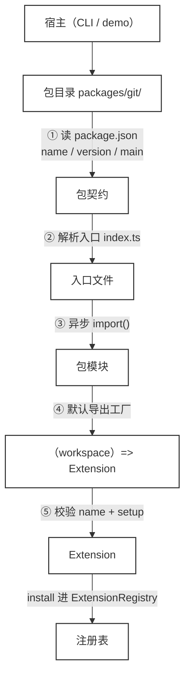

# 38 · Package / Plugin

> <span class="stage-badge">Stage Hello Pi</span> · <span class="tag-badge">v38-package</span>

第三十七章，权限门立住了——工具执行前，allow / deny / ask 三道闸，谁也不能想跑就跑。

在上一章的结束前，我们提了一个新的问题：

> **扩展和宿主揉在一个包里。** 想加一个 git 扩展、一个 web 扩展，就得往 `src/extensions/` 里塞源码；`hello-coding` 一个扩展注册了 7 个工具、prompt 模板、技能加载、权限策略——**它快变成一个大杂烩了**。

这一章，我们需要减轻 `src/extensions` 的负担，让扩展可以**独立发布**。接下来进入正题。

## 一、上一版存在什么问题？

回看 ch30 到 ch37 的组装方式：所有扩展都写在 `src/extensions/` 里，宿主代码里 `extensions.install(createHelloCodingExtension(workspace))` 硬编码装上：

1. **扩展不是包**：`hello-coding` 没有自己的 `package.json`、没有版本号、没有入口——**它只是仓库里的一个目录**，谈不上「发布」；
2. **扩展揉在宿主里**：加能力就要改 `src/extensions/` 的代码——**宿主和扩展的边界是「目录」，不是「依赖」**，ch31 就点过「hello-coding 仍是代码硬装」；
3. **没法按需安装**：`createAgent` 里写死装哪几个，**没有「从磁盘发现、加载」的机制**，ch30 / ch31 / ch35 反复埋的坑都是这一条；
4. **没有包契约**：一个扩展该有什么（名字、版本、入口、默认导出）**没有约定**，装的时候也没人校验——ch30 说「版本：先声明，后验证（ch38 Package 再收紧）」，这就是那个「后验证」。

> 一句话：**扩展现在只能「长在仓库里」，不能「装进仓库里」。** 这一章补上后者。

## 二、本篇解决什么问题？

把扩展拆成**独立的包**，让宿主可以**从磁盘加载任意包**：




这一章做四件事：

1. **包契约**：建立一套能力扩展的契约，一个独立包 = 一个目录 + 一份 `package.json`（`name` / `version` / `main`）+ 一个默认导出工厂 `(workspace) => Extension`——**「包长什么样」先说清楚**；
2. **磁盘加载**：新增 `PackageLoader`，读清单 → 解析入口 → 异步 `import()` → 调工厂 → 校验 Extension——**回答 ch35「package 加载需要考虑异步」**；
3. **两个示例包**：`@hello-harness/git`（只读 git 工具）与 `@hello-harness/web`（fetch 工具）——**每个能力一个包，各自独立版本**；
4. **权限不信任新包**：新包的工具在默认权限门里**一个都不认识**，一律落到 `ask`——**回答 ch37「独立包一引入就是安全隐患」**：包可以随便装，装了也只是「多问一句」。

核心心智模型：

> **包是「黑盒能力」：宿主只认契约（package.json + 默认导出工厂），不认包内部实现。** 装进来的任何工具，权限门默认都不认识——**允许你装，不等于允许你乱跑**。只读工具也走 `ask`，是保守的代价，也是安全的地基。

这一章把线串一下：**前面「扩展揉在宿主里、没有包契约、不能从磁盘加载」这些遗留问题 → 这一章用「PackageLoader + 包契约 + 默认导出工厂」解决 → 接下来看两个独立包怎么被装进 harness。**

## 三、先看最终效果

我们可以装在 git 扩展，来实现查看最近的提交（同一套机制，从磁盘加载任意包）：

```bash
$ hello --chat  --package packages/git
```

直接通过 `--package` 来加载git扩展，内部提供了 `git_status` `git_log` `git_diff` 三个工具，用于查询git的相关信息


```bash
[run:start ] Run ID : 275f37a5-8db4-4646-8f5e-916d15fc6f07
[run:start ] Input  : 返回这个项目的最近两个提交历史
[model:start] 思考中 …


[model:end ] 调用工具：git_log · 1329 in / 63 out · 2943ms
Step 1 · model  → 调用工具：git_log
[tool:start] git_log({})
[权限] 模型请求调用 git_log：该操作有副作用，需要用户确认
  参数：{}
  允许执行？(y/N) > y
[tool:end  ] → {"args":["log","--oneline","-10"],...
Step 2 · tool   → git_log({}) = {"args":["log","--oneline","-10"]
[model:start] 思考中 …

根据最近的提交历史，这个项目的最近两个提交是：

1. **a926878** - feat: chapter 37 permission gate - add PermissionGate to manager tool execute
2. **9b010e9** - add cover

这两个提交分别代表了：
- 第一个提交添加了权限门控功能，为管理器工具的执行添加了PermissionGate
- 第二个提交是添加封面（cover）的相关功能
[model:end ] 完成回答 · 2135 in / 162 out · 10426ms
Step 3 · model  → 完成回答
Step 4 · finish → finished
[run:end   ] completed (finished) · 15864ms
Answer  :
根据最近的提交历史，这个项目的最近两个提交是：

1. **a926878** - feat: chapter 37 permission gate - add PermissionGate to manager tool execute
2. **9b010e9** - add cover

这两个提交分别代表了：
- 第一个提交添加了权限门控功能，为管理器工具的执行添加了PermissionGate
- 第二个提交是添加封面（cover）的相关功能
Steps   : 2 轮 · 5 条消息 · 4 步 · 15864ms
Tokens  : 3464 in / 225 out
Status  : completed (finished)
```

从上面这个结果演示来看，当我们完成`package-plugin`的封装之后，之后给我们的`hello harness agent`来安装能力就更简单了，原来的核心都不动，直接在package中按照`插件契约`实现一份新的即可

## 四、架构变化

这一章的架构变化：**新增 `packages/` 目录承载独立扩展包，Core / 既有扩展一行没动——扩展从「仓库里的文件」变成「磁盘上的包」。** 目录与文件的变化，先以树形看清楚：

```text
packages/
  git/                     ← 新增：@hello-harness/git 独立扩展包
    package.json           ← 包契约：name / version / main
    index.ts               ← 默认导出工厂（workspace）=> Extension
    git.ts                 ← 只读 git 工具（execFile 固定参数，不拼接任意命令）
  web/                     ← 新增：@hello-harness/web 独立扩展包
    package.json
    index.ts               ← 默认导出工厂
    web.ts                 ← fetch_url 工具（仅 HTTP GET）
src/extensions/
  extension.ts             ← 既有：Extension / ExtensionContext（未动）
  registry.ts              ← 既有：ExtensionRegistry（未动）
  loader.ts                ← 新增：PackageLoader（读清单 → 解析入口 → import → 工厂 → 校验）
  index.ts                 ← 导出 PackageLoader
src/cli/index.ts           ← 新增 --package <目录>（可重复），从磁盘加载并 install
examples/stage-4/38-package-plugin/demo.mts ← 全链路 demo
```

> 注意：**Extension API 一行没改。** 包里的工厂最终产出的还是 ch30 定义的那个 `Extension`（`name + setup`），装的时候还是 `extensions.install(...)`——**Package 只是「Extension 的运输形式」，不是新的抽象**。这就是「先教学后抽象」：先有 Extension，再有它的包封装。

## 五、核心抽象

Package 是三个东西的约定：

1. **清单（manifest）**：`package.json` 里的 `name`（包名，可带 scope）、`version`（版本，独立演进）、`main`（入口，缺省 `index.ts`）——**包长什么样，看清单就知道**；
2. **默认导出工厂**：入口文件 `export default (workspace) => Extension`
  - 注意：**包不直接导出 Extension，而是导出「拿到 workspace 才能造出 Extension」的工厂**，让我们的插件依然在 `workspace` 的边界内玩耍
  - 对于web 包不需要 workspace 也可以不接参数
3. **加载器（PackageLoader）**：四步拿包，每一步失败都有结构化报错。
  - **读清单（校验 name / version）**
  - **→ 解析入口（校验存在）
  - **→ 异步 `import()`（可能失败）
  - **→ 调工厂并校验返回的 Extension（name + setup）**
  

Loader 的三个设计点：

1. **契约先校验**：`name` / `version` 缺失、入口不存在、默认导出不是函数、工厂没返回合法 Extension——**每一条都有明确的 RuntimeError**，宿主不会被半吊子的包悄悄坑掉；
2. **加载是异步的**：`await import()` 天然支持网络 / 懒加载 / 缓存（ch35 的伏笔），加载器本身 `async`；
3. **「包」只是约定，不是特权**：加载出来的还是普通 `Extension`，走同一条 `install` 通道——**Loader 没有绕过任何既有机制**（包括权限门）。

## 六、实现代码

### `src/extensions/loader.ts`（核心，全量）

```ts
import { readFile, stat } from "node:fs/promises";
import path from "node:path";
import { pathToFileURL } from "node:url";
import { RuntimeError } from "../core/errors/errors";
import type { Workspace } from "../workspace/workspace";
import type { Extension } from "./extension";

export interface PackageManifest {
  name: string;
  version: string;
  main?: string;
}

export type ExtensionFactory = (workspace: Workspace) => Extension;

export interface LoadedPackage {
  manifest: PackageManifest;
  entry: string;
  extension: Extension;
}

export class PackageLoader {
  private readonly log: (message: string) => void;

  constructor(log: (message: string) => void = () => {}) {
    this.log = log;
  }

  async load(packageDir: string, workspace: Workspace): Promise<LoadedPackage> {
    const manifest = await this.readManifest(packageDir);
    const entry = await this.resolveEntry(packageDir, manifest.main);

    let module: unknown;
    try {
      module = await import(pathToFileURL(entry).href);
    } catch (error) {
      throw new RuntimeError(
        `包 ${manifest.name} 入口加载失败：${entry}（${error instanceof Error ? error.message : String(error)}）`,
      );
    }

    const factory = (module as { default?: unknown }).default;
    if (typeof factory !== "function") {
      throw new RuntimeError(
        `包 ${manifest.name} 的入口必须默认导出一个工厂函数（workspace）=> Extension，收到：${typeof factory}`,
      );
    }

    let extension: Extension;
    try {
      extension = factory(workspace) as Extension;
    } catch (error) {
      throw new RuntimeError(
        `包 ${manifest.name} 的工厂执行失败（${error instanceof Error ? error.message : String(error)}）`,
      );
    }
    if (typeof extension?.name !== "string" || typeof extension.setup !== "function") {
      throw new RuntimeError(`包 ${manifest.name} 的工厂没有返回合法的 Extension（需要 name + setup）`);
    }

    this.log(`已加载包：${manifest.name}@${manifest.version}（入口 ${path.basename(entry)}）`);
    return { manifest, entry, extension };
  }

  private async readManifest(packageDir: string): Promise<PackageManifest> {
    const manifestPath = path.join(packageDir, "package.json");
    let raw: string;
    try {
      raw = await readFile(manifestPath, "utf-8");
    } catch (error) {
      throw new RuntimeError(
        `读取包清单失败：${manifestPath}（${error instanceof Error ? error.message : String(error)}）`,
      );
    }

    let parsed: unknown;
    try {
      parsed = JSON.parse(raw);
    } catch (error) {
      throw new RuntimeError(
        `包清单不是合法 JSON：${manifestPath}（${error instanceof Error ? error.message : String(error)}）`,
      );
    }

    const manifest = parsed as Partial<PackageManifest>;
    if (typeof manifest.name !== "string" || manifest.name.trim() === "") {
      throw new RuntimeError(`包清单缺少合法 name：${manifestPath}`);
    }
    if (typeof manifest.version !== "string" || manifest.version.trim() === "") {
      throw new RuntimeError(`包清单缺少合法 version：${manifestPath}`);
    }
    return { name: manifest.name, version: manifest.version, main: manifest.main };
  }

  private async resolveEntry(packageDir: string, main: string | undefined): Promise<string> {
    const entry = path.resolve(packageDir, main ?? "index.ts");
    const info = await stat(entry).catch(() => null);
    if (info === null || !info.isFile()) {
      throw new RuntimeError(`包入口不存在：${entry}`);
    }
    return entry;
  }
}
```

关键点：

1. **每步都校验、每步都有明确报错**：清单读不到、JSON 坏了、name / version 缺失、入口不存在、默认导出不是函数、工厂抛错、返回的不是 Extension——**七个失败点七个 RuntimeError**；
2. **`pathToFileURL(entry).href`**：Node 的 `import()` 接受文件 URL，Windows 路径用 `file:///` 形式才稳——**这也是 demo 里把 workspace 直接传给工厂的原因**（工厂签名 `(workspace) => Extension`，不是 `(env) => Extension`，先教学后抽象，不提前造环境对象）；
3. **加载是异步的**：`await import()` 天然支持懒加载 / 缓存 / 未来的网络加载。

### `packages/git/` —— @hello-harness/git 扩展包

`packages/git/package.json`：

```json
{
  "name": "@hello-harness/git",
  "version": "0.1.0",
  "private": true,
  "type": "module",
  "main": "index.ts",
  "description": "独立发布的 Git 扩展包：只读 git 工具（git_status / git_log / git_diff），参数固定、不拼接任意命令"
}
```

> `name` 是带 scope 的发布名，`version` 是独立版本号，`main` 指向入口——**这就是一个可以独立演进的「包」的样子**。

`packages/git/index.ts`（包入口，默认导出工厂）：

```ts
import { defineExtension } from "../../src/extensions";
import type { Workspace } from "../../src/workspace/workspace";
import { createGitTools } from "./git";

export function createGitExtension(workspace: Workspace) {
  return defineExtension({
    name: "git",
    version: "0.1.0",
    description: "独立发布的 Git 扩展包（@hello-harness/git）：只读 git 工具 git_status / git_log / git_diff，参数固定、不拼接任意命令",
    setup(ctx) {
      for (const tool of createGitTools(workspace)) {
        ctx.tools.register(tool);
      }
    },
  });
}

export default createGitExtension;
```

`packages/git/git.ts`（只读 git 工具——**注意安全姿势**）：

```ts
import { execFile } from "node:child_process";
import type { Tool, ToolResult } from "../../src/core/tool/tool";
import type { Workspace } from "../../src/workspace/workspace";

const GIT_TIMEOUT_MS = 10_000;

export interface GitOutput {
  args: string[];
  cwd: string;
  stdout: string;
  stderr: string;
  exitCode: number;
}

function runGit(cwd: string, args: string[]): Promise<GitOutput> {
  return new Promise((resolve) => {
    execFile("git", args, { cwd, timeout: GIT_TIMEOUT_MS, maxBuffer: 1024 * 1024 }, (error, stdout, stderr) => {
      const code = (error as { code?: unknown } | null)?.code;
      resolve({
        args,
        cwd,
        stdout: String(stdout ?? ""),
        stderr: String(stderr ?? ""),
        exitCode: typeof code === "number" ? code : error ? 1 : 0,
      });
    });
  });
}

function createGitTool(workspace: Workspace, name: string, description: string, args: string[]): Tool {
  return {
    name,
    description,
    parameters: { type: "object", properties: {}, required: [] },
    async execute(): Promise<ToolResult> {
      const result = await runGit(workspace.root, args);
      if (result.exitCode !== 0) {
        return {
          ok: false,
          error: `git ${args.join(" ")} 失败（exitCode=${result.exitCode}）：${result.stderr || result.stdout || "未知错误"}`,
          kind: "tool",
          retryable: false,
        };
      }
      return { ok: true, value: result };
    },
  };
}

export function createGitTools(workspace: Workspace): Tool[] {
  return [
    createGitTool(
      workspace,
      "git_status",
      "只读：查看 workspace 当前未提交改动（git status --short）",
      ["status", "--short"],
    ),
    createGitTool(
      workspace,
      "git_log",
      "只读：查看最近 10 条提交记录（git log --oneline -10）",
      ["log", "--oneline", "-10"],
    ),
    createGitTool(
      workspace,
      "git_diff",
      "只读：查看工作区未提交改动的统计（git diff --stat）",
      ["diff", "--stat"],
    ),
  ];
}
```

git 包的两个安全设计点（**重点关注**）：

1. **参数是写死的数组，不是字符串**：`runGit(workspace.root, ["status", "--short"])` 用 `execFile` 直接传参，**不经过 shell、不拼接用户输入**——包只暴露 3 个只读操作，`git push` / `git reset` 这种写操作**本包根本不提供**；
2. **只读不等于免审**：这几个工具在默认权限门里不认识，还是走 `ask`——**包自己声明安全没用，门说了算**。

### `packages/web/` —— @hello-harness/web 扩展包

`packages/web/index.ts`：

```ts
import { defineExtension } from "../../src/extensions";
import { createFetchUrlTool } from "./web";

export function createWebExtension() {
  return defineExtension({
    name: "web",
    version: "0.1.0",
    description: "独立发布的 Web 扩展包（@hello-harness/web）：fetch_url 工具，仅 HTTP GET，出网行为交给默认权限门（ask）",
    setup(ctx) {
      ctx.tools.register(createFetchUrlTool());
    },
  });
}

export default createWebExtension;
```

`packages/web/web.ts`（fetch 工具——**出网是最大的副作用**）：

```ts
import type { Tool, ToolResult } from "../../src/core/tool/tool";

export const MAX_FETCH_CHARS = 8000;

export interface FetchUrlInput {
  url?: unknown;
}

export function createFetchUrlTool(options: { timeoutMs?: number } = {}): Tool {
  const timeoutMs = options.timeoutMs ?? 8000;

  return {
    name: "fetch_url",
    description: "HTTP GET 抓取一个 URL 的文本内容，返回状态码与正文（超长截断）；只支持 http / https",
    parameters: {
      type: "object",
      properties: {
        url: {
          type: "string",
          description: "要抓取的完整 URL，例如 https://example.com",
        },
      },
      required: ["url"],
    },
    async execute(input: unknown): Promise<ToolResult> {
      const { url } = input as FetchUrlInput;
      if (typeof url !== "string" || url.trim() === "") {
        return { ok: false, error: "参数 url 必须是字符串", kind: "tool", retryable: false };
      }

      let parsed: URL;
      try {
        parsed = new URL(url);
      } catch {
        return { ok: false, error: `URL 解析失败：${url}`, kind: "tool", retryable: false };
      }
      if (parsed.protocol !== "http:" && parsed.protocol !== "https:") {
        return { ok: false, error: `仅支持 http / https，收到：${parsed.protocol}`, kind: "tool", retryable: false };
      }

      try {
        const response = await fetch(parsed, { signal: AbortSignal.timeout(timeoutMs) });
        const body = await response.text();
        const truncated =
          body.length > MAX_FETCH_CHARS
            ? `${body.slice(0, MAX_FETCH_CHARS)}\n...（已截断：正文共 ${body.length} 字符）`
            : body;
        return { ok: true, value: { url: parsed.href, status: response.status, body: truncated } };
      } catch (error) {
        const message = error instanceof Error ? error.message : String(error);
        return { ok: false, error: `抓取失败：${message}`, kind: "tool", retryable: true };
      }
    },
  };
}
```

web 包的边界：协议白名单（http / https）、超时（8s）、正文截断（8000 字符）、**出网 = 副作用 = 默认门不认识 = ask**。Demo 里 `fetch_url` 被拒绝，**一次网络都没出去**。

### CLI 接线（`src/cli/index.ts`）

```ts
const { workspace, registry, extensions, hooks, prompts, skills, gate } = createAgent(args.dir ?? process.cwd(), {
  traceHook: args.traceHook,
  permission: args.permission,
});

const loader = new PackageLoader((message) => console.log(`[pkg] ${message}`));
for (const dir of args.packages) {
  const pkg = await loader.load(dir, workspace);
  extensions.install(pkg.extension);
}
```

`--package` 是个可重复参数，装完还是走 `extensions.install`——**Loader 只是把「磁盘上的包」变成「内存里的 Extension」，剩下的交给既有通道**。

## 七、运行 Demo

对于扩展的加载，直接使用 `--package` 进行即可，前面演示了git的使用，我们这里再来看看web的扩展使用

```bash
$ hello --chat  --package packages/web
```


当然有兴趣的小伙伴，也可以基于实际看一下我们的全链路验证的demo

```bash
# 全链路 demo（无需 API Key）
$ node --import tsx examples/stage-4/38-package-plugin/demo.mts

# CLI 从磁盘加载两个包并列出扩展
$ node --import tsx src/cli/index.ts --package packages/git --package packages/web --extensions

# 加载包后看权限门（门不认新包的工具）
$ node --import tsx src/cli/index.ts --package packages/git --package packages/web --permissions
```


| 验证点 | 结果 |
| --- | --- |
| 加载独立包 | demo 第 1 段：两个包都读到 name / version / main |
| 装进注册表 | demo 第 2 段：`git@0.1.0` / `web@0.1.0` 均为 active |
| 新包工具不被默认门认识 | demo 第 3 段：`ask-side-effecting-tools` 兜底 |
| git 只读工具可执行 | demo 第 4 段：ask 批准后 `git_status` / `git_diff` / `git_log` 正常 |
| 出网被拒 = 不出网 | demo 第 5 段：`fetch_url` → `kind=permission · retryable=false` |
| CLI 从磁盘装包 | `--package packages/git --package packages/web --extensions` 列出 3 个扩展 |

## 八、新架构解决了什么？

1. **能力可以独立演进**：git 包、web 包有自己的版本号，**升级 git 不影响 web，也不影响宿主**——从「一个仓库」向「一个生态」迈出第一步；
2. **宿主瘦身**：`hello-coding` 只管编码本体，git / web 是外挂——**想加能力，装包，不改宿主代码**；
3. **包有契约、有校验**：`PackageLoader` 七处失败点都有明确报错，**半吊子的包装不上来**；
4. **安全姿势随包走**：git 包用 `execFile` 固定参数、web 包只管 GET 出网——**「干什么」由包自己收敛到最小，「该不该」由权限门裁决**，二者配合；
5. **权限门守住最后底线**：任何新包的工具默认不认识、默认 ask、无人确认默认拒绝——**「允许你装」和「允许你跑」是两件事**，ch37 的 fail-closed 在这里成了生态的安全垫。

## 九、它又引入了什么问题？

1. **包名 ≠ 扩展名**：清单叫 `@hello-harness/git`，扩展名是 `git`——**发布名和运行名两套**，目前靠约定对齐，没校验（loader 也不强制 `name` 一致性）；
2. **还是相对路径依赖**：包里 `import { defineExtension } from "../../src/extensions"` 写的是仓库内的相对路径——**真正的独立发布要等 `@hello-harness/core` 这个包存在**（ch40 拆核心）；
3. **包不能声明自己的权限策略**：git 只读工具也只能吃默认门的 `ask`——**包想声明「我是只读的」，当前机制不支持**（ch37 的 `allow-readonly-tools` 是写死在策略里的名单）；
4. **加载是任意代码**：`import()` 一个包 = 执行它的顶层代码——**没有沙箱、没有签名、没有供应链校验**，一个坏包可以在 `setup` 前就干坏事，权限门挡不住**包自身**（demo 只演示了「装包后工具受控」，没演示「装包本身的信任」）；
5. **没有版本解析 / 依赖管理**：`--package` 按目录加载，没有「装 @hello-harness/git@0.1.0 自动拉依赖」——**publish / install / registry 生态是 ch40 的方向**。

## 十、下一章

包能独立发布了，但看着还是命令行里一行行的文字——工具调用、结果、token 消耗，挤在滚动输出里。

下一章，**TUI**：让运行中的每一步都摊开在屏幕上——thinking、tool call、tool result、diff、token usage，一眼看全。

> **本阶段汇总**：扩展从「仓库里的文件」变成「磁盘上的独立包」，PackageLoader 建立了「读清单 → import → 工厂 → 校验」的最小加载链路；权限门成为所有新能力（无论内置还是外挂）的保守默认。下一步，把这场「跑动中的演出」搬到 TUI 上。

从「一个扩展什么都干」到「每个能力一个包」，本章已交出 `@hello-harness/git` 与 `@hello-harness/web`；从「包里跑什么」到「屏上看什么」，我们留待 ch39 再会。

尽信书则不如，以上内容纯属一家之言，因个人能力有限，难免有疏漏和错误之处，如发现 bug 或者有更好的建议，欢迎批评指正，不吝感激 🙃

欢迎点赞、关注公众号「一灰灰Blog」 我们下章见

---

微信公众号: 一灰灰Blog
