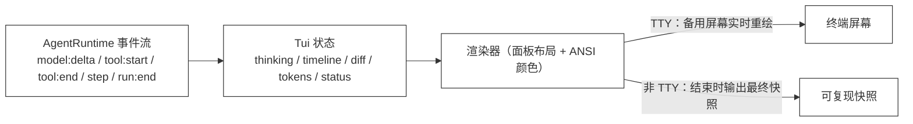
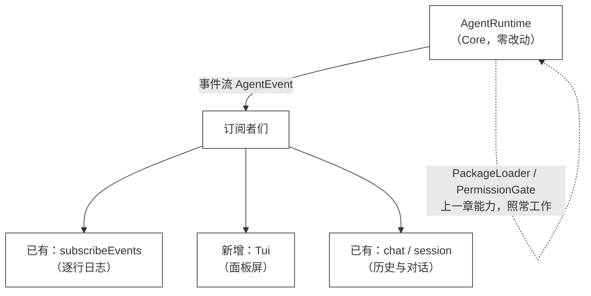

# 39 · TUI

> <span class="stage-badge">Stage Hello Pi</span> · <span class="tag-badge">v39-tui</span>

第三十八章，包能独立发布了——`@hello-harness/git`、`@hello-harness/web` 从磁盘装进 harness。

整体的产品能力已经有些样子了，但是还有一个明显的缺点，整个输出不够清晰

> **跑动被淹没在滚动里。** 每一次模型调用、工具调用、结果、token 消耗，都是一行行 `[event]` 日志往下滚——**没有一屏全景**，改了什么文件要看很久，token 消耗看不见。

这一章，就把这场「跑动中的演出」搬到屏幕上。接下来进入正题。

## 一、上一版存在什么问题？

回看 ch39 之前的运行界面：`src/cli/render.ts` 的 `subscribeEvents` 把每个事件打一行日志：

```text
[run:start ] Run ID : a1b2c3d4-...
[run:start ] Input  : 看看这个项目的改动
[model:start] 思考中 …
[model:end ] 调用工具：bash · 12 in / 9 out · 812ms
[tool:start] bash({"command":"git status --short"})
[tool:end  ] → {"command":"git status --short","stdout":" M src/index.ts",...} · 84ms
[step      ] Step 3 · tool → bash(...) = {...}
[run:end   ] completed (finished) · 1800ms
```

1. **一屏看不全**：输出无限往下滚，**「现在到哪了」要靠眼睛追**——thinking 和结果隔了几屏；
2. **没有 diff 视图**：改文件、跑 `git diff`，结果是一坨 JSON，**「改了什么」没有一眼可读的画面**；
3. **token 不显眼**：token 只出现在 `model:end` 那一行，**没有累计视图**；
4. **界面和事件耦合**：渲染逻辑直接 `console.log`，**没法复用、没法换皮肤**。

> 一句话：**命令行是「过程日志」，不是「运行界面」。** 这一章补上后者。

## 二、本篇解决什么问题？

做一个**面板式 TUI**：订阅同一个 `AgentRuntime` 事件流，把它渲染成一块屏，五块面板各司其职：




这一章做四件事（外加第五件事）：

1. **五块面板**：`RUN`（run 与状态）、`THINKING`（模型的思考文本）、`TIMELINE`（最近的 step 轨迹）、`DIFF`（工具结果里的改动）、`FOOTER`（token 累计 / 步数 / 状态）——**一屏看全**；
2. **TTY 实时刷新**：在终端里用**备用屏幕**（alternate screen）+ 清屏重绘，每个事件刷新一帧——**跑动就在眼前**；
3. **非 TTY 快照**：管道 / 文件 / CI 下没有屏幕可刷，退化为**结束时输出一张最终快照**——**demo 可复现，正文输出即实测**；
4. **diff 面板**：从工具结果（`git diff` / `git_diff`）里**认出 unified diff 并着色**（`+` 绿、`-` 红、`@@` 青）——**改了什么一眼可见**；
5. **接进 `--chat`**：`hello --chat --tui` 两段式——**每轮跑动进面板屏、跑完退回到 `你 > ` 输入行**，对话历史与面板互不干扰。

核心心智模型：

> **TUI 是事件的「投影」：先订阅、再攒状态、最后全量重绘。** 事件流是数据，屏幕是投影——**Core 一个字节都不用改**，TUI 只是 `AgentEvent` 的另一个消费者。

这一章把线串一下：**前面「一屏看不全、没有 diff、token 不显眼」这些遗留问题 → 这一章用「事件 → 状态 → 渲染」的 Tui 投影解决 → 接下来看一张真实的 TUI 快照。**

## 三、先看最终效果

跑 demo（无需 API Key，下面是标准的使用姿势）：

```bash
$ node --import tsx examples/stage-4/39-tui/demo.mts
```

```text
=== 39 · TUI：thinking / tool call / tool result / diff / token 一屏看全 ===
┌ RUN ─────────────────────────────────────────────────────────────────────┐
│ RUN demo · completed (finished)                                          │
│    输入: 看看这个项目的改动                                                         │
└──────────────────────────────────────────────────────────────────────────┘
┌ THINKING ────────────────────────────────────────────────────────────────┐
│ 让我先看看当前 git 状态。状态确认，改动在 src/index.ts。再看下具体 diff。改动就一行：把常量从 1 改成 2。完成。    │
└──────────────────────────────────────────────────────────────────────────┘
┌ TIMELINE ────────────────────────────────────────────────────────────────┐
│ #1 model  → 调用工具：bash                                                    │
│ #2 tool   bash({"command":"git status --short"})                         │
│ #3 result ok: stdout=" M src/index.ts"                                   │
│ #4 model  → 调用工具：bash                                                    │
│ #5 tool   bash({"command":"git diff src/index.ts"})                      │
│ #6 result ok: stdout="diff --git a/src/index.ts b/src/index.ts"          │
│ #7 model  → 完成回答                                                         │
└──────────────────────────────────────────────────────────────────────────┘
┌ DIFF ────────────────────────────────────────────────────────────────────┐
│ diff --git a/src/index.ts b/src/index.ts                                 │
│ index ad1d380..25dfdc4 100644                                            │
│ --- a/src/index.ts                                                       │
│ +++ b/src/index.ts                                                       │
│ @@ -1 +1 @@                                                              │
│ -export const x = 1;                                                     │
│ +export const x = 2;                                                     │
└──────────────────────────────────────────────────────────────────────────┘
┌ FOOTER ──────────────────────────────────────────────────────────────────┐
│ TOKENS 18 in / 27 out · 5 步 · completed (finished)                       │
└──────────────────────────────────────────────────────────────────────────┘
```

五块面板一目了然：**模型在想什么、调了哪个工具、结果是什么、改了什么文件、花了多少 token**。这个 demo 在真实终端里跑是**逐帧刷新**的（TTY 备用屏幕），这里展示的是非 TTY 下的**最终快照**——**两次运行逐字节一致**（diff 里的 blob hash 由文件内容决定，可复现）。

再看 CLI 的 TUI 模式（真实模型）：

```bash
$ hello --tui "看看这个项目的改动"
```

TTY 下进入全屏面板，运行结束退场并打印最终快照；管道 / CI 下直接打印快照——**同一份代码，两种呈现**。

**多轮对话也能进面板**（`--chat --tui`）：每轮跑动进备用屏，跑完退回到输入行，历史不被面板冲掉（非 TTY 管道驱动、假模型的实测输出，两轮）：

```text
$ hello --chat --tui
Hello Harness v1.0 · 流式多轮对话（输入 exit 退出，Ctrl+C 取消本轮）
TUI     : 每轮跑动进面板屏，跑完回到对话
Session : 761aa26a-...

你 > 看看这个项目的改动
┌ RUN ─────────────────────────────────────────────────────────────────────┐
│ RUN 9a99b32e · completed (finished)                                      │
│    输入: 看看这个项目的改动                                                        │
└──────────────────────────────────────────────────────────────────────────┘
┌ THINKING ────────────────────────────────────────────────────────────────┐
│ 我先看看 git 状态。状态 OK，改动在 src/index.ts。完成。                                   │
└──────────────────────────────────────────────────────────────────────────┘
┌ TIMELINE ────────────────────────────────────────────────────────────────┐
│ #1 model  → 调用工具：bash                                                    │
│ #2 tool   bash({"command":"git status --short"})                         │
│ #3 result ok: stdout=" M src/index.ts"                                   │
│ #4 model  → 完成回答                                                         │
└──────────────────────────────────────────────────────────────────────────┘
┌ FOOTER ──────────────────────────────────────────────────────────────────┐
│ TOKENS 10 in / 16 out · 3 步 · completed (finished)                       │
└──────────────────────────────────────────────────────────────────────────┘

Answer  : 状态 OK，改动在 src/index.ts。完成。
Steps   : 2 轮 · 5 条消息 · 3 步 · 195ms

你 > 再看一遍
┌ RUN ─────────────────────────────────────────────────────────────────────┐
│ RUN 6b4821d8 · completed (finished)                                      │
│    输入: 再看一遍                                                              │
└──────────────────────────────────────────────────────────────────────────┘
┌ THINKING ────────────────────────────────────────────────────────────────┐
│ 第二轮，我再看一次。确认完毕。结束。                                                       │
└──────────────────────────────────────────────────────────────────────────┘
┌ TIMELINE ────────────────────────────────────────────────────────────────┐
│ #1 model  → 调用工具：bash                                                    │
│ #2 tool   bash({"command":"git status --short"})                         │
│ #3 result ok: stdout=" M src/index.ts"                                   │
│ #4 model  → 完成回答                                                         │
└──────────────────────────────────────────────────────────────────────────┘
┌ FOOTER ──────────────────────────────────────────────────────────────────┐
│ TOKENS 10 in / 16 out · 3 步 · completed (finished)                       │
└──────────────────────────────────────────────────────────────────────────┘
```

> 输入在主页面上（`你 > `），跑动在备用屏里（面板），跑完退回主页面——**两段式互不干扰**；每轮 summary 的步数与面板 footer 一致（`3 步`），因为步数统一来自 runtime 的 `step` 事件。

## 四、架构变化

这一章的架构变化：**新增 `src/cli/tui.ts`，CLI 加一个 `--tui` 开关——Core 与事件流零改动，TUI 只是 `AgentEvent` 的又一个订阅者。** 目录与文件的变化，先以树形看清楚：

```text
src/cli/
  render.ts                ← 既有：逐行事件日志（subscribeEvents）与摘要（printSummary，未动）
  tui.ts                   ← 新增：Tui（面板状态 + 渲染器 + ANSI）
  index.ts                 ← 新增 --tui 开关：TUI 模式 attach，结束打印快照
examples/stage-4/39-tui/demo.mts ← 全链路 demo（fake 流式模型 + 真实 bash 工具）
```

> 注意：**`AgentRuntime`、`AgentEvent`、事件类型一个都没动。** 上一章的 `PackageLoader`、再上一章的 `PermissionGate` 也都不用改——**TUI 长在 CLI，不碰 Core**。这是 ch29「Core 保持小」的直接红利：**换脸（界面）不动芯（事件）**。

**关键边界**：TUI 只是事件流的「又一个订阅者」，加一层界面、不染指 Core。一张图说明它和 Runtime 的关系：




一句话：**事件从 Core 流出，谁爱订阅谁订阅；Tui 只是新增的一个消费者，不修改、不拦截、不阻塞**——这正是一灰灰式「加脸不动芯」的精髓。

## 五、核心抽象

Tui 是两层结构的「投影」：

1. **状态（State）**：`status` / `runId` / `input` / `thinking`（模型思考文本）/ `timeline`（最近的 step 轨迹）/ `diff`（识别出的 unified diff）/ `tokens` / `steps`——**事件进来改状态，状态是唯一的真源**；
2. **渲染器（Renderer）**：把状态画成一张固定宽度的面板屏——五块 `┌─┐` 面板、每行按语义着色（模型黄、工具青、成功绿、失败红、diff 加减色）——**渲染不碰状态，状态不碰终端**。

三个设计点：

1. **TTY / 非 TTY 双路径**：`color = stdout.isTTY`，TTY 用 `\x1b[?1049h` 进备用屏幕 + `\x1b[H\x1b[2J` 清屏重绘；非 TTY 不刷屏，**结束输出一张快照**——**一个 `color` 布尔分岔，可复现性有了**；
2. **diff 是「认出」不是「算出」**：工具结果里如果有 `diff --git ` 或 `@@ ` 开头的行，就当成 unified diff 收进 diff 面板着色——**不解析语义、不算差异，只识别并展示**（git 包 / bash 的 `git diff` 天然产出这种文本）；
3. **全量重绘**：每个事件都重画整屏——**简单、无状态累积 bug**；代价是输出量大时闪烁（列入已知限制，ch40 再议）。

## 六、实现代码

### `src/cli/tui.ts`（核心，节选）

事件订阅——**事件 → 状态**（节选）：

```ts
export class Tui {
  // ... 状态字段 ...
  attach(runtime: AgentRuntime): void {
    this.active = true;
    if (this.color) {
      process.stdout.write("\x1b[?1049h\x1b[?25l"); // 进备用屏幕 + 隐藏光标
    }

    runtime.on("model:delta", (e) => {
      this.sawDelta = true;
      this.thinking += e.text;
      this.redraw();
    });

    runtime.on("model:end", (e) => {
      this.tokensIn += e.response.inputTokens;
      this.tokensOut += e.response.outputTokens;
      if (!this.sawDelta && e.response.content !== "") {
        this.thinking += e.response.content;
      }
      if (e.response.toolCalls.length > 0) {
        this.push("model", `→ 调用工具：${e.response.toolCalls.map((c) => c.name).join(", ")}`, "plain");
      } else {
        this.push("model", "→ 完成回答", "plain");
      }
      this.redraw();
    });

    runtime.on("tool:end", (e) => {
      if (e.result.ok) {
        this.push("result", this.summarizeValue(e.result.value), "ok");
        this.collectDiff(e.result.value);
      } else {
        this.push("result", `[${e.result.kind}] ${e.result.error}`, "error");
      }
      this.redraw();
    });

    runtime.on("step", (e) => {
      if (e.step.type === "model" || e.step.type === "tool") {
        this.steps += 1;
      }
    });
    // run:start / model:start / model:retry / tool:start / run:end 同理
  }
}
```

diff 识别——**从工具结果里认出 unified diff**：

```ts
private collectDiff(value: unknown): void {
  const record = value as Record<string, unknown>;
  const stdout = record && typeof record === "object" ? record.stdout : undefined;
  if (typeof stdout !== "string" || stdout.trim() === "") return;
  const lines = stdout.split("\n");
  const looksLikeDiff = lines.some((line) => line.startsWith("diff --git ") || line.startsWith("@@ "));
  if (looksLikeDiff) {
    this.diff = lines.slice(0, this.maxDiffLines);
  }
}
```

渲染——**状态 → 面板屏**（节选）：

```ts
private render(colored: boolean): string {
  const paint = (text: string, code: string): string => (colored ? `${code}${text}${ANSI.reset}` : text);
  // ...
  const diffRendered = this.diff.map((line) => {
    if (line.startsWith("diff --git ") || line.startsWith("--- ") || line.startsWith("+++ ") || line.startsWith("@@ ")) {
      return paint(line, ANSI.cyan);
    }
    if (line.startsWith("+")) return paint(line, ANSI.green);
    if (line.startsWith("-")) return paint(line, ANSI.red);
    return line;
  });
  const footer = `TOKENS ${this.tokensIn} in / ${this.tokensOut} out · ${this.steps} 步 · ${this.status}`;
  // 五块面板拼成一张屏
}
```

三个设计点落地处：

1. **着色是纯函数**：`paint(text, code)` 只在 `colored` 时包 ANSI 码——**快照（`colored=false`）是纯文本**，贴进文档 / CI 日志都是干净的；
2. **`step` 事件数步数**：复用 Runtime 自己的步概念（model / tool 才算），**不是 TUI 自己拍脑袋数**；
3. **`detach()` 负责退场**：`\x1b[?25h`（显光标）`\x1b[?1049l`（退出用屏）——**进去出来对称**，不会把终端弄乱。

### CLI 接线（`src/cli/index.ts`）

```ts
const tui = options.tui ? new Tui() : undefined;
if (tui) {
  tui.attach(runtime);
} else {
  subscribeEvents(runtime, state, options.streaming ?? false);
}
const run = await runtime.run(request);
if (tui) {
  tui.detach();
  console.log(tui.snapshot()); // 结束打印最终快照
}
printSummary(run, state);
```

`--tui` 模式下强制流式（`streaming: true`）——**thinking 面板吃 `model:delta`，逐字刷新**；TUI 与非 TUI 共用同一个 `run()`，**芯不变，脸随便换**。

### 接进 `--chat`（`src/cli/chat.ts`）

多轮对话里，Tui 是**按轮**挂上去的——`session.turn` 走的是和单次 run 完全相同的 `runContext` 事件流，所以复用同一个 `Tui`，每轮 `attach` → `turn` → `detach`：

```ts
for (;;) {
  const prompt = await ask();
  if (prompt === null || prompt.trim() === "" || prompt === "exit" || prompt === "quit") break;

  state.stepCount = 0;
  state.retryCount = 0;

  const tui = tuiMode ? new Tui({ color: process.stdout.isTTY && !!process.stdin.isTTY }) : undefined;
  if (tui) tui.attach(runtime);

  const run = await session.turn(runtime, prompt);

  if (tui) {
    tui.detach();
    state.stepCount = tui.stepCount; // 面板 footer 的步数 → 每轮 summary，口径统一
    console.log(tui.snapshot());
  }
  await store.save(session.snapshot());
  printSummary(run, state);
}
```

两个细节：

1. **颜色只在双向 TTY 开**：`process.stdin.isTTY && process.stdout.isTTY`——stdin 不是 TTY（管道喂话）就不进备用屏，**按行对话 + 每轮快照**，demo 可复现；
2. **TUI 模式下跳过 `subscribeEvents`**：事件日志和面板二选一，**面板吃事件、日志不再打**；步数从 `tui.stepCount` 同步给 summary，**面板 footer 与 summary 数字一致**（都来自 runtime 的 `step` 事件）。

## 七、运行 Demo

```bash
# 全链路 demo（无需 API Key，非 TTY 输出最终快照）
$ node --import tsx examples/stage-4/39-tui/demo.mts

# CLI 面板模式（TTY 实时刷新 / 非 TTY 快照）
$ hello --tui "看看这个项目的改动"

# 多轮对话 + 面板（每轮进屏、跑完回输入行）
$ hello --chat --tui
```


| 验证点 | 结果 |
| --- | --- |
| thinking 面板 | demo：三句思考文本完整展示 |
| timeline 面板 | demo：7 个轨迹条目（model / tool / result） |
| diff 面板 | demo：`git diff` 的 unified diff 展示 + 着色（+ 绿 / - 红 / @@ 青） |
| token 累计 | demo：`TOKENS 18 in / 27 out` |
| 步数统计 | demo：`5 步`（3 model + 2 tool） |
| 快照可复现 | 连续两次运行逐字节一致（diff blob hash 由内容决定） |
| CLI 开关 | `hello --tui` 解析正常，TTY 走备用屏幕、非 TTY 走快照 |
| 接入 --chat | `--chat --tui` 每轮 attach/detach，跑完退回 `你 > ` 输入行；summary 步数与面板 footer 一致 |

## 八、新架构解决了什么？

1. **一屏看全**：thinking / tool call / tool result / diff / token 五块面板，**跑动不再淹没在滚动里**；
2. **改动可见**：diff 面板让「改了什么」一眼可读，**配合 git 包 / bash 的 `git diff` 天然衔接**；
3. **token 显性**：footer 累计 in / out，**花钱看得见**（ch25 埋的「token 成本」在这里落地为面板）；
4. **界面与事件解耦**：Tui 只是事件消费者，**换任何 runtime / 任何扩展跑出来的都是同一套界面**；
5. **可复现性**：非 TTY 快照让 TUI 也能进 demo / CI / 文档——**真实输出即正文**。

## 九、它又引入了什么问题？

1. **快照式渲染，不是终端应用**：整屏重绘、没有键盘导航、没有滚动、没有多面板选择——**是「监视器」，不是「控制台」**（真正的终端应用要事件循环 + 布局引擎 + 输入处理，ch40 方向）；
2. **diff 只是「认出」**：只认 `diff --git` / `@@` 开头的 unified diff——**git 之外的改动（比如 write 直接改写）不会生成 diff**；
3. **thinking 依赖流式**：`model:delta` 才有逐字思考；非流式模型只能整段上屏（demo 的 fake 模型特意实现了流式）；
4. **全量重绘会闪**：输出大（长 diff、多 step）时每帧重画开销大——**没有增量渲染、没有脏矩形**；
5. **真正的「思考」不可见**：我们展示的是模型的**输出文本**，不是它的推理过程——**thinking 模型 / reasoning 内容要不要、怎么展示，留给后续阶段**；
6. **对话里的权限询问仍用 readline 行输入**：TTY 下跑动在备用屏、权限 `ask` 会**叠在面板上**等输入（能收到回答，但视觉上不是面板的一部分）——**交互输入进面板是「控制台」级改造，留给 ch40**。

## 十、下一章

TUI 让「跑动中的演出」上了屏幕，但包还是躺在 `packages/` 里的目录——`@hello-harness/git`、`@hello-harness/web`、还有那个什么都干的 `hello-coding`。

下一章，**Hello Pi-style Harness**：这一阶段收官——把 `core`、`coding`、`cli`、`extensions` 拆成正式的包，让「最小核心 + 一切可扩展」的 Pi 式架构完整落地。

> **本阶段汇总**：从「工具想跑就跑」到「先问后跑」（Permission Gate），从「扩展揉在宿主里」到「独立包从磁盘加载」（Package / Plugin），再到「跑动一屏看全」（TUI）——Core 始终小而稳定，工具、技能、提示词、权限、包、界面全部以扩展形态生长。下一步，把这套组装正式命名为 Hello Pi-style Harness。

从「一屏看全的监视器」到「能交互的控制台」，我们留待 ch40 再会。

尽信书则不如，以上内容纯属一家之言，因个人能力有限，难免有疏漏和错误之处，如发现 bug 或者有更好的建议，欢迎批评指正，不吝感激 🙃

欢迎点赞、关注公众号「一灰灰Blog」 我们下章见

---

微信公众号: 一灰灰Blog