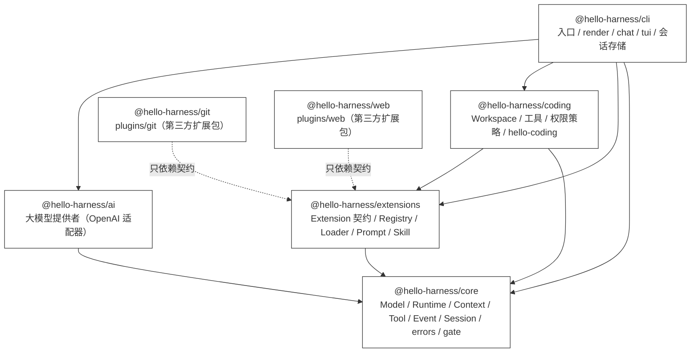
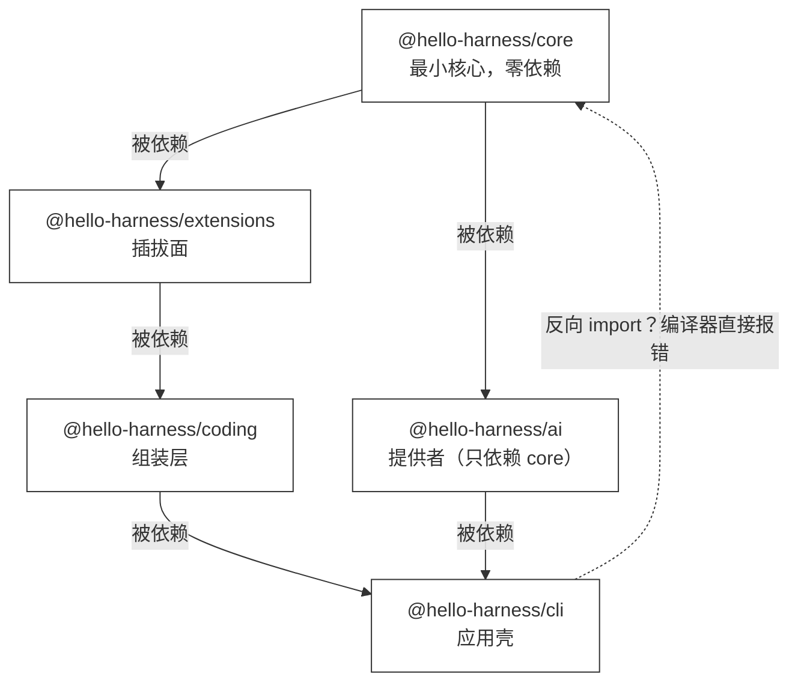

# 40 · Hello Pi-style Harness

> <span class="stage-badge">Stage Hello Pi</span> · <span class="tag-badge">v40-pi-style</span>

第三十九章，我们把「跑动的演出」搬上了屏幕——TUI 把 thinking / tool call / tool result / diff / token 一屏看全。

屏幕是好看点了，底子干净吗？作为 `hello-pi` 系列的最后一篇，咱们回过头来扒一扒现在的项目结构。

> **一切揉在 `src/` 一个包里。** 从 ch29 到 ch39，Core、工具、扩展、CLI 全在 `src/` 里——**「边界」只是目录，不是依赖**：任何模块都能 import 任何东西，core 被随手引用，拆包只能靠自觉。

这一章，就把宿主拆成 5 个正式包，让项目结构更像一款「正经产品」，而不是一个练手 demo。

## 一、上一版存在什么问题？

回看 ch29–ch39 的 `src/`：

```text
src/
├── core/          Model / Runtime / Context / Tool / Event / Session + errors + permission gate
├── tools/         7 个工具
├── workspace/     Workspace 路径沙箱
├── extensions/    Extension / Registry / Loader / hello-coding / trace-hook
├── prompt/        PromptRegistry / PromptLoader
├── skill/         SkillRegistry / SkillLoader / 注入
├── permission/    默认权限策略
├── providers/     OpenAI 适配器
├── session/       SessionStore 持久化
└── cli/           入口 / render / chat / tui
```

1. **边界只是「目录」，不是「依赖」**：`src/tools/bash.ts` 想 import `src/core/runtime/runtime.ts`，直接引就行——**没有编译器强制依赖方向**，「core 保持小」靠自觉；
2. **谁都能碰 Core**：`hello-coding` 揉着工具、prompt、skill、权限……它本身就是一个大杂烩扩展，**ch31 就点过「仍是代码硬装」**；
3. **没有版本、没有独立演进**：一切在一个 `hello-harness` 包里，**「能不能单独发布」无从谈起**——[ch38](./38-package-plugin) 把 git/web 拆成了包，但宿主自己还是一坨；
4. **可复用性为零**：想在自己的项目里只引用 Core（或只引用 CLI），**做不到——没有包粒度**。

> 一句话：**到 ch39 为止，「包」只存在于两个扩展里，宿主本身还是一枚巨石。** 这一章，把「巨石」也拆开——小伙伴，别眨眼。

## 二、本篇解决什么问题？

做一件事：**把宿主拆成 5 个正式包**，用包边界把依赖方向强行钉死，并把第三方插件（git/web）归位 `plugins/`：

```text
packages/
├── core/         @hello-harness/core        最小核心：六件套 + errors + permission gate（零第三方依赖）
├── extensions/   @hello-harness/extensions  插拔面：Extension 契约 + Registry + PackageLoader + Prompt/Skill 注册表
├── coding/       @hello-harness/coding      Coding Agent 组装层：Workspace + 7 工具 + 权限策略 + hello-coding
├── ai/           @hello-harness/ai          大模型提供者：OpenAI 适配器（面向 core 的 Model 契约）
└── cli/          @hello-harness/cli         CLI 应用壳：单次/流式/全量/多轮/TUI + 会话持久化
plugins/
├── git/          @hello-harness/git         第三方插件（只读 git 工具）
└── web/          @hello-harness/web         第三方插件（fetch 工具）
```

五个包谁依赖谁，一张图先摊开看：




核心心智模型，先记住这一句：

> **small core，everything else optional。** Core 只有 6 个抽象 + errors + 权限门；其余全是可选的、可独立发布的东西。**依赖方向由包边界强制，扩展只见契约（`WorkspaceLike`）不见实现（`Workspace`）——契约是门面，实现是后厨，点菜的不进厨房。**

## 三、先看最终效果

拆完的仓库长这样（`src/` 从此消失，正式宣告「一枚巨石」时代结束）：

```text
packages/
├── core/src/        15 个文件 · 826 行
├── extensions/src/  9 个文件
├── coding/src/      11 个文件
├── cli/src/         6 个文件
└── ai/src/          2 个文件（OpenAI 适配器，126 行）
plugins/
├── git/             第三方扩展包（只读 git 工具）
└── web/             第三方扩展包（fetch 工具）
examples/            19 个 demo 全部改用包名导入
```

Core 边界报告（`ch29` 的 demo 直接改口径，从数 `src/` 变成数 `packages/`，外部包计入 `{extensions,coding,cli,ai}`）：

```text
=== Core 边界报告（packages/ 的文件数与行数） ===
Core（packages/core/src/，共 15 个文件，826 行）：
  context/context.ts     29 行
  errors/errors.ts       59 行
  events/events.ts       39 行
  hooks/hooks.ts         32 行
  model/…                83 行
  permission/gate.ts     56 行
  runtime/…             375 行
  session/session.ts     35 行
  tool/…                 80 行
Core 之外（packages/{extensions,coding,cli,ai}，共 28 个文件，2132 行）
Core 占比：约 28%（826 / 2958 行）
Core 第三方依赖：无（只 import node 内置模块与 core 内部文件）
```

而**跑起来毫无变化**：`hello --extensions`、`hello --permissions`、19 个 demo、`--package plugins/git`、TUI、chat——**全部照跑**（下文「运行 Demo」逐一验证）。这就是「重构不动行为」的最好证明，也是各位小伙伴的一颗定心丸：拆包不是重写，只是挪窝。

## 四、架构变化

这一章的架构变化：**`src/` 整体迁入 `packages/`，按包边界重写所有跨包导入为包名导入。** 文件怎么挪、边界怎么画，先以树形看清楚（重点关注每个 `←` 后面的来源）：

```text
packages/                         （宿主拆成的 5 个正式包）
├── core/
│   ├── package.json   ← 新增：@hello-harness/core（零依赖）
│   └── src/…          ← 原 src/core/*（git mv，仅 index.ts 补 permission 导出）
├── extensions/
│   ├── package.json   ← 新增：@hello-harness/extensions（依赖 core + yaml）
│   └── src/…          ← 原 src/extensions/{extension,registry,loader,trace-hook}
│                        + 原 src/prompt/prompt.ts + 原 src/skill/*（git mv）
├── coding/
│   ├── package.json   ← 新增：@hello-harness/coding（依赖 core + extensions）
│   └── src/…          ← 原 src/workspace + src/tools/* + src/permission/policies
│                        + src/extensions/hello-coding.ts（git mv）
├── ai/
│   ├── package.json   ← 新增：@hello-harness/ai（依赖 core + openai）
│   └── src/openai.ts  ← 原 src/providers/openai.ts（git mv：大模型提供者独立成包）
├── cli/
│   ├── package.json   ← 新增：@hello-harness/cli（依赖 core + extensions + coding + ai）
│   ├── src/main.ts    ← 原 src/cli/index.ts（git mv 改名：入口与 barrel 分家）
│   ├── src/index.ts   ← 新增：barrel（导出 Tui / chat / subscribeEvents / printSummary）
│   └── src/…          ← 原 src/cli/{render,tui,chat} + 原 src/session/*（git mv）
plugins/                          （第三方扩展包，移出宿主目录）
├── git/   ← 原 packages/git（git mv：第三方扩展包移出宿主目录）
└── web/   ← 原 packages/web（git mv）
仓库根（其他变动文件）
├── bin/hello.mjs          ← 入口指向 packages/cli/src/main.ts
├── tsconfig.json          ← include 改为 ["packages"]，加 paths：@hello-harness/* → packages/*/src
├── pnpm-workspace.yaml    ← 新增：packages/* 与 plugins/*
└── package.json           ← 删 src 相关脚本路径；openai/yaml 下放到对应包
```

> 注意：**CLI 入口与包 barrel 分家**——`main.ts` 是「脚本」（顶部直接 `main()`），`index.ts` 是「库出口」（导出 Tui / chat 给 demo 用）。包既当应用又当库，入口就得让位，这事儿别绕晕了。

**关键边界**：依赖方向被包边界「焊死」，谁也反向不了。一张图说明这条单向链：




一句话：**core 不想被谁反向依赖，靠的不是自觉，是 `package.json` 里根本没有那条依赖箭头。** 这就是「core 保持小」从小伙伴的口头约定，变成了编译器替你守的规矩。

## 五、核心抽象

五个包组成一张「有向无环」的依赖图，从底到顶，谁也别想回头（注意：**ai 与 extensions 同层，都只依赖 core**）：

1. **core**（最小核心）：`Model / Runtime / Context / Tool / Event / Session` 六件套 + `errors` + `permission/gate`。**零第三方依赖**——编译期只有 `node:` 内置模块，纯粹得不像话；
2. **extensions**（插拔面）：Extension 契约 + `ExtensionRegistry` + `PackageLoader` + **Prompt/Skill 注册表与加载/注入**。理由很简单：这几个注册表正是「扩展要插进去的地方」，和 Extension 共同构成插拔面；
3. **coding**（组装层）：`Workspace` 路径沙箱 + 7 个工具 + 默认权限策略 + `hello-coding` 扩展。**Coding Agent 的一切能力从这儿长出**；
4. **ai**（大模型提供者）：面向 core 的 `Model` 契约的具体实现（OpenAI 适配器），**和 extensions 平级、只依赖 core**。**模型是「供应方」，不该塞在应用壳里**——这也是向 Pi 项目学的：`ai` 独立成包，换模型不动 cli；
5. **cli**（应用壳）：入口 / render / chat / tui + 会话持久化。**只负责把下面四层组装成 `hello` 命令**，自己不发明能力、也不写死某个模型。

> 至于 git / web 这种**第三方插件实现**，连 `packages/` 都不进——挪到仓库根的 `plugins/` 目录。**`packages/` 是宿主包，`plugins/` 是外来户**，一眼分清主客。

四个关键决策，是这一章真正的「骚操作」所在：

1. **包名导入 + workspace 链接**：跨包一律 `import { ToolRegistry } from "@hello-harness/core"`——tsc 用 `tsconfig paths` 解析到 `packages/*/src`，运行时靠 `pnpm-workspace.yaml` 生成的 `node_modules` 软链解析到同一份源码。**编译期与运行期走同一个文件，无需构建**，省心得很；
2. **扩展只见契约不见实现**：`PackageLoader` 不再 `import` coding 的 `Workspace`，改用一个最小结构契约 `WorkspaceLike = { readonly root: string }`——**extensions 不依赖 coding（否则循环），扩展包（git/web）也只依赖这个契约**，解耦彻底；
3. **提供者独立成包**：OpenAI 适配器从 cli 迁入 `@hello-harness/ai`——**cli 面向 core 的 `Model` 接口编程，不绑定任何具体厂商**；再接入 Anthropic/Gemini/本地模型时，只是在 ai 里多加一个文件；
4. **入口与 barrel 分家**：`packages/cli/src/main.ts` 是脚本（直接跑），`index.ts` 是库出口（供 import）——**一个包既当应用又当库时，入口给脚本、barrel 给库**，各司其职。

## 六、实现代码

### 工作区（根目录）

```yaml
# pnpm-workspace.yaml
packages:
  - packages/*
  - plugins/*
```

```jsonc
// tsconfig.json（节选）
"baseUrl": ".",
"paths": {
  "@hello-harness/*": ["packages/*/src"]
},
"include": ["packages"]
```

### 各包 package.json（以 coding 为例）

```json
{
  "name": "@hello-harness/coding",
  "private": true,
  "type": "module",
  "main": "src/index.ts",
  "types": "src/index.ts",
  "exports": {
    ".": "./src/index.ts"
  },
  "dependencies": {
    "@hello-harness/core": "workspace:*",
    "@hello-harness/extensions": "workspace:*"
  }
}
```

> `main` / `exports` 直接指向 `src/index.ts`——**tsx 运行时顺着软链吃到源码，tsc 顺着 paths 吃到同一份**，源码即产物。

### 各包 barrel（以 coding 为例）

```ts
// packages/coding/src/index.ts
export { Workspace } from "./workspace/workspace";
export { createReadTool } from "./tools/read";
export { createWriteTool } from "./tools/write";
export { createEditTool } from "./tools/edit";
export { createBashTool } from "./tools/bash";
export type { BashResult } from "./tools/bash";
export { createSkillTool } from "./tools/skill";
export { calculator } from "./tools/calculator";
export { randomInteger } from "./tools/random";
export { createDefaultPermissionGate } from "./permission/policies";
export { createHelloCodingExtension } from "./extensions/hello-coding";
```

### 提供者独立成包（ai）

`packages/ai/src/openai.ts` 是从 cli 的 `providers/` 原样搬过来的 `OpenAIModel` + `createOpenAIModel()`，一行逻辑没改，只改了「住址」：

```ts
// packages/ai/src/index.ts（barrel）
export { OpenAIModel, createOpenAIModel } from "./openai";
```

```ts
// packages/cli/src/main.ts —— cli 不再依赖 openai SDK，只从 ai 拿工厂
import { createOpenAIModel } from "@hello-harness/ai";
const model = createOpenAIModel();
```

> 从此 `openai` 这个第三方依赖只出现在 `packages/ai/package.json` 里，**cli 的依赖表干净到只有四个自家包**。想接 Anthropic？在 ai 里加 `anthropic.ts`，cli 一行不动。

### 契约解耦（`packages/extensions/src/loader.ts`）

```ts
export interface WorkspaceLike {
  readonly root: string;
}

export type ExtensionFactory = (workspace: WorkspaceLike) => Extension;
```

> 扩展工厂不再需要 `Workspace` 的实现，只要「看得见 root」——**extensions 与 coding 之间没有依赖，扩展包（git/web）也只见这个最小契约**。这是 ch40 最值得记住的一笔：**契约住在插拔面里，实现住在组装层里。**

### 入口与 barrel 分家（cli）

```text
packages/cli/src/
├── main.ts   ← 原 src/cli/index.ts：parseArgs → createAgent → 各模式分发，顶部直接 main()
└── index.ts  ← 新增：barrel（Tui / TuiOptions / chat / DisplayState / subscribeEvents / printSummary）
```

```js
// bin/hello.mjs（节选：入口指向脚本；完整实现还负责加载 .env 与 tsx 引导）
const entry = path.join(path.dirname(fileURLToPath(import.meta.url)), "../packages/cli/src/main.ts");
```

### 历史 demo 批量迁移

19 个 demo 的 `../../../src/…` 一律改为包名导入，**一行代码不用动**：

```ts
// 改前
import { AgentRuntime } from "../../../src/core/runtime/runtime";
import { createBashTool } from "../../../src/tools/bash";
// 改后
import { AgentRuntime } from "@hello-harness/core";
import { createBashTool } from "@hello-harness/coding";
```

## 七、运行 Demo

```bash
pnpm install          # 生成 workspace 软链（node_modules/@hello-harness/*）
pnpm typecheck        # 全仓类型检查（tsc paths 解析包名）

# 全部 19 个 demo 照跑（stage-2/3/4）
node --import tsx examples/stage-4/29-small-core/demo.mts      # 边界报告：Core 826 行 / 28%
node --import tsx examples/stage-4/38-package-plugin/demo.mts  # 从磁盘加载 git/web 扩展包（plugins/）
node --import tsx examples/stage-4/39-tui/demo.mts             # TUI 快照

# CLI 冒烟（不碰模型）
pnpm hello --extensions                 # hello-coding@0.8.0
pnpm hello --package plugins/git --package plugins/web --extensions   # 扩展包也能加载
pnpm hello --permissions                # 5 条默认策略
```

| 验证点 | 结果 |
| --- | --- |
| 包名解析 | tsc（paths）与 tsx（软链）都指向 `packages/*/src` 同一份源码 |
| 依赖方向 | core ← ai/extensions ← coding ← cli，单向前进，无循环 |
| 提供者独立 | openai 依赖只在 `packages/ai`，cli 只面向 core 的 Model 接口 |
| 插件归位 | git/web 移入 `plugins/`，仍是「外来户」，不混入宿主包 |
| 扩展契约 | git/web 只见 `WorkspaceLike.root`，不依赖 coding |
| 行为不变 | 19 个 demo + CLI 全部照跑（本次实测全绿） |
| 边界可测量 | ch29 demo 改口径为 packages/：Core 826 行，占比 28%，零第三方依赖 |

## 八、新架构解决了什么？

1. **依赖方向被包边界强制**：core 想被 cli 反向依赖？import 方向直接报错——**「core 保持小」从自觉变成结构**；
2. **扩展只见契约不见实现**：`WorkspaceLike` 让 extensions 不碰 coding，git/web 包只认契约——**插拔面与组装层彻底解耦**；
3. **边界可测量**：ch29 的边界报告有了新口径——**Core 826 行、占比 28%、零第三方依赖**，这句话从此可复现；
4. **可独立演进**：五个包各有版本与依赖声明，**任何一个都能单独拿走或单独发布**；
5. **行为零变化**：19 个 demo + CLI 全绿——**「重构不动行为」第一次在全仓尺度被验证**。

## 九、它又引入了什么问题？

1. **单仓库源码直跑，还没有「发布」**：包的 `main` 指着 `src/index.ts`，没有构建产物、没有 npm 发布流程——**「包」目前是源码意义上的，不是产物意义上的**；
2. **依赖纪律靠自觉**：单向依赖没有 lint 强制（比如 `no-import-cycles`）——**谁敢在 cli 里偷偷 import coding 再被 coding import，就成环了**；
3. **WorkspaceLike 是最小契约**：扩展要更多 workspace 能力（resolve/read/write），得扩契约——**契约太小，扩起来就纠结**；
4. **历史章节正文里的 `src/` 路径成了「当时的样子」**：ch29–39 的正文按对应 Tag 描述，v40 之后结构变了——**检历史章节请用对应 Git Tag**；
5. **Core 826 行已经不小**：六件套 + errors + 权限门——**Stage 5 会重新审视「Core 该不该更小」**。

## 十、毕业作品：回望 Stage 4

写到这里，`hello-pi` 系列收官了。别急着往前跑——**先回头把 Stage 4 这 12 章攒下的东西整个端出来看一眼**，这才是「毕业作品」该有的样子。

### 一条命令，端出全部家底

```bash
pnpm hello "帮我修这个项目"          # 默认 --tools：单次运行，观察 → 修改 → 验证
pnpm hello --stream "…"             # 流式：thinking 实时滚出
pnpm hello --chat                   # 多轮对话；--resume 续上昨天的会话
pnpm hello --tui                    # TUI：五块面板一屏看全
pnpm hello --extensions             # 插拔面：hello-coding@0.8.0
pnpm hello --permissions            # 权限门：5 条默认策略
pnpm hello --package plugins/git --extensions   # 外来插件：从磁盘加载独立包
```

### 12 章，一条演进弧

| 章节 | 一句话收获 | 留给下一章的限制 |
| --- | --- | --- |
| 29 | **Core ≠ 功能集合**：六件套 + errors + gate | 边界只是目录，依赖方向没人守 |
| 30–32 | **Extension API**：注册 Tool、注册 Hook | 提示词还是写死的，能力还是硬装 |
| 33 | **Prompt 落成配置**：`prompts/*.md` 随扩展加载 | 提示词是配置了，知识/流程还没进系统 |
| 34–36 | **Skill**：定义 / Loader / 注入上下文 | 会干活了，但没人管「能不能干」 |
| 37 | **Permission Gate**：allow / deny / ask | 权限是纪律，还管不住「代码从哪来」 |
| 38 | **Package / Plugin**：独立包从磁盘加载 | 扩展独立了，宿主自己还是一枚巨石 |
| 39 | **TUI**：把每一步画出来 | 屏幕好看了，底子还是一坨 |
| 40 | **宿主拆成 5 个包 + 插件归位** | 「包」还是源码意义，尚未真正发布 |

每一步都踩在前一步的肩膀上：没有 29 收紧的 Core，30 的 Extension 无处挂钩；没有 30–32 的扩展机制，33 的提示词、34 的 Skill 都没有插槽；没有 34–36 的 Skill，37 的权限不知道该审什么；没有 37 的权限，38 的独立包一引入就是安全隐患；没有前面的能力分层，39 的 TUI 无从展示，40 的拆包也没有边界可守。

### 毕业作品的能力清单

```text
hello-harness/
├── core        六件套 + errors + permission gate —— 826 行 / 占 28% / 零第三方依赖
├── extensions  Extension 契约 + Registry + PackageLoader + Prompt/Skill 注册表
├── coding      Workspace 路径沙箱 + 7 个工具 + 5 条权限策略 + hello-coding 扩展
├── ai          OpenAI 适配器（cli 不绑定任何厂商）
├── cli         --tools / --stream / --chat / --resume / --tui / --extensions / --permissions / --package
└── plugins/    git / web —— 外来户，只认 WorkspaceLike 契约，不混入宿主包
```

### 五条原则，12 章反复兑现

1. **先教学，后抽象**：Extension、Skill、Permission、Package……每个概念都是被「上一步的限制」逼出来的，从不为了「未来可能用」提前造轮子；
2. **核心小且可读**：Core 始终只有六件套 + errors + gate，826 行、零依赖、占全仓 28%——**这个数字用 ch29 的 demo 就能复现**；
3. **每章可运行可验证**：19 个 demo + CLI 冒烟 + Git Tag（v29 ~ v40）——**检出任一 Tag，都能跑出那一章**；
4. **不隐瞒复杂性**：权限门 ask/deny 的结构化拒绝理由、PackageLoader 的七处失败点、TUI 的全量重绘与快照逐字节可复现——**「魔法」只存在于没写明白的代码里**；
5. **所有变更受控**：fail-closed 的权限门、只读的 git 包、协议白名单的 fetch——**能力越强，门禁越严**。

### 最该带走的三个心智模型

1. **Core ≠ 功能集合**：把「想让 Core 干什么」换成「Core 之外能不能干」——六件套够用，其余全在 Core 外生长；
2. **契约是门面，实现是后厨**：`WorkspaceLike` 让插拔面（extensions）与组装层（coding）彻底解耦，扩展只见门面不见后厨；
3. **结构即约束**：单向依赖靠 `package.json` 的箭头焊死、靠编译器守着——**比「自觉」更可靠的是「结构上做不到」**。

### 毕业不是终点

回头看，Stage 4 收的每一道口子，都是 Stage 5 的起点：Core 826 行已经不小，该不该更小？依赖纪律靠自觉，要不要 lint 强制？「包」还是源码意义，怎么真正发布？而最尖锐的那个问题已经顶在门口了——

> **如果模型越来越会写代码，我们真的还需要给它几十个 Tool Schema 吗？**

带着「small core，everything else optional」毕业，下一站：**Stage 5 · Hello Programmatic Agent**。

## 十一、下一章

Stage 5 · Hello Programmatic Agent 开场：

> **如果模型越来越会写代码，我们真的还需要给它几十个 Tool Schema 吗？**

从 `LLM → Tool`，进入 `LLM → Program → Tool`（Code as Action）。ch42，先看清楚 **Tool Calling 的组合成本**——为什么 10 个 Tool Call 需要 10 次模型决策。

尽信书则不如，以上内容纯属一家之言，因个人能力有限，难免有疏漏和错误之处，如发现 bug 或者有更好的建议，欢迎批评指正，不吝感激 🙃

欢迎点赞、关注公众号「一灰灰Blog」 我们下章见

---

微信公众号: 一灰灰Blog