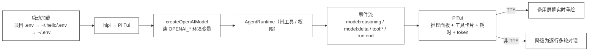

---
title: "40 · Pi-style TUI"
description: "Stage 4 的扩展增补：在 v40 的 Extensible Coding Agent 之上，封装一个和官方 Pi 相似的交互式 TUI。直接 hello 进入；模型配置从项目 .env 或 ~/.hello/.env 读取；流式对话；以友好方式呈现推理思考、工具调用、耗时与 token 监控。Core 仅新增一个 reasoning 事件，其余全是 cli 包内的产品化封装。"
gitTag: "v41-pi-tui"
stage: 4
---

# 40 · Pi-style TUI（extend）

> <span class="stage-badge">Stage Hello Pi</span> · <span class="tag-badge">v40-pi-style-tui</span> · 扩展增补（建立在 v40-pi-style 之上）

第四十章收官时，我们端出了一个「小核心 + 可选生态」的 Extensible Coding Agent：`hello` 能跑单次任务、能 `--chat` 多轮、能 `--tui` 看面板。

但回头看，Stage 4 从头到尾都在对标 **Pi**，却始终没有一个和 Pi 官方最像的东西——

> **一个真正「开箱即用」的交互式终端：敲 `hipi` 就进、流式输出、把模型的推理思考 / 工具调用 / 耗时 / token 一目了然地摊在屏幕上。**

前面的 `hello` 还停留在「给一个问题、跑一次」的脚本心态；真正的 Coding Agent 应该像 Pi 那样，**一进来就是一场可持续的、看得见思考的对话**。这一章，就把这个缺口补上。

## 一、上一版存在什么问题？

`v40` 之后，`hello` 的进入方式仍然是「命令式」的：

```text
hello "帮我修复这个项目"        # 单次跑，跑完即退
hello --chat                   # 多轮，但只是「逐行打印事件 + readline 收输入」
hello --tui "问题"             # 面板，但只针对「单轮跑动」，不是常驻对话
```

1. **没有「常驻交互」**：每次都要带参数；没有「敲 `hello` 直接进入对话」的入口；
2. **配置入口分散**：`bin/hello.mjs` 只认当前目录 `.env`（外加 `~/.env`），**没有项目级 `.hello/.env` 这种「用户全局默认配置」**；
3. **推理思考被淹没**：`v39` 的 TUI 把 `model:delta` 当作「thinking」显示，**真正有价值的「推理链（reasoning）」并没有独立事件**，模型即便在思考，我们也看不到；
4. **对话观感不够「Pi」**：要么是一行行事件日志，要么是单轮面板，**缺少「用户问题 → 模型推理 → 工具调用 → 最终回答」一气呵成的流式呈现**，也没有会话级的 token / 耗时累计。

> 一句话：**我们有了 Engine，但还没有 Cockpit。** 这一章，给 `hello` 装上一座像 Pi 那样的交互驾驶舱。

## 二、本篇解决什么问题？

做四件事，全部落在「不破坏 small core」的边界内：

1. **`hipi` 直接进 TUI**：`hipi` 命令（或任意命令带 `--pi`）进入 Pi 风格交互界面；`hello` 保持原有「给问题、跑一次」的行为不变，互不干扰；
2. **配置分级加载**：启动优先读 **项目 `.env`**，其次 **`~/.hello/.env`**（用户全局），最后 `~/.env`；已存在的变量不被覆盖，项目配置优先；
3. **推理事件进 Core**：给 `ModelEvent` / `AgentEvent` 增加一个最小、零依赖的 `reasoning` 事件，让「思考过程」成为一等公民；
4. **Pi 风格交互 TUI**：流式对话、推理思考面板、工具调用卡片（状态 + 耗时）、会话级 token / 耗时监控，TTY 走备用屏幕实时重绘，非 TTY 自动降级为逐行对话。




> 核心心智模型：**Core 只多了一个 `reasoning` 事件；产品化的全部工作都在 `cli` 包内——这正是 Stage 4 那句 `everything else optional` 的最佳注脚。**

## 三、先看最终效果

在使用之前，先执行命令 `pnpm link --global`

然后真实终端里敲 `hipi`，即可进入 `tui`


注意：**推理、回答、工具各自成区**。

推理在 `── 思考 ──` 区；

模型回答在 `── 回复 ──` 区；

一旦新的推理或新的回答出现，就新开一个区，而不是在上一区后面续写

——例如工具执行完后模型给出的「最终回答」会是一个全新的 `── 回复 ──` 区，而不是接在前面那句「我先查看一下 git 状态。」之后。

生成过程中，底部不再是「可以打字」的假象，而是明确的忙碌态：

```text
⠋ 生成中…  ⏱ 1.2s  (Ctrl+C 取消)
```

输入行被禁用，配合状态栏实时跳动的耗时，用户一眼就知道「模型还在想，别急着输入」。内容多到一屏装不下时，用 **↑/↓（或 PageUp/PageDown）翻页**查看历史，状态栏会提示「↑ 已上翻 N 行 · End 回底部」；按 **End** 立即回到最新。

底部状态栏实时跳动：`● 生成中` 时显示本轮耗时与累计 token；工具调用以 `⏳ → ✓/✗` 卡片呈现参数、结果与耗时；推理思考单独成块，和最终回答区分开。

不需要真实 Key 也能验证（下面「运行 Demo」用 mock 模型逐帧复现上屏效果）。

## 四、架构变化

这一章的改动极小且边界清晰：

```text
packages/
├── core/src/
│   ├── model/types.ts        ← ModelEvent 新增 reasoning（零依赖，仅加一个联合分支）
│   ├── events/events.ts      ← AgentEvent 新增 model:reasoning
│   └── runtime/runtime.ts    ← streamOnce 把 reasoning 透传为 model:reasoning；
│                                并做三件「兜底」：① maxSteps 超限后做一次无工具收尾合成；
│                                ② 文本式工具调用抽取（JSON 与 <function> XML，扫 content+reasoning）；
│                                ③ 任何来源命中的工具调用都补进 toolCalls 继续循环
├── ai/src/openai.ts          ← stream() 额外 yield reasoning（兼容 reasoning / reasoning_content 字段）
└── cli/src/
    ├── pi-tui.ts             ← 新增：Pi 风格交互 TUI（本文主角）
    ├── pi.ts                 ← 新增：runPi 编排（构建 agent → 进入 TUI）
    ├── main.ts               ← 新增 --pi 标志与「无参数默认进 TUI」的分发
    └── index.ts              ← 导出 PiTui / runPi
bin/hello.mjs                 ← 环境变量分级加载（项目 .env → ~/.hello/.env → ~/.env）
examples/stage-4/41-pi-style-tui/demo.mts  ← 用 mock 模型逐帧演示，无需 Key
```

> 注意：**Core 没有任何行为变更，只新增了一个事件分支**——`reasoning` 对旧代码完全透明（旧提供方不 yield 它即可）。这正是「扩展优先」的体现：要给 Harness 加一种「可观察信号」，正确的做法不是改 Runtime 逻辑，而是扩展事件契约。

## 五、核心抽象

### 5.1 推理成为一等事件（Core）

`ModelEvent` 增加一个联合分支；`AgentRuntime` 在流式累积时把它透传出去：

```ts
// packages/core/src/model/types.ts（节选）
export type ModelEvent =
  | { type: "content"; text: string }
  | { type: "reasoning"; text: string }          // ← 新增：模型的推理思考
  | { type: "tool_call"; index: number; id?: string; name?: string; arguments: string }
  | { type: "usage"; inputTokens: number; outputTokens: number };
```

```ts
// packages/core/src/runtime/runtime.ts（streamOnce 节选）
for await (const event of this.model.stream(request)) {
  if (event.type === "content") { /* 原样 */ }
  else if (event.type === "reasoning") {
    // 透传给上层 UI：模型在「想什么」现在可观察了
    this.events.emit({ type: "model:reasoning", runId: this.activeRunId ?? "", text: event.text });
  }
  else if (event.type === "tool_call") { /* 原样 */ }
}
```

> 为什么是「事件」而不是「塞进回复里」？因为推理过程与最终答案是两件事：推理要**流式可见**，但历史消息里通常不需要回灌。保持它只是事件流上的一个信号，UI 爱显示就显示、不需要就忽略，Core 依旧零负担。

### 5.2 提供方吐出 reasoning（ai 包）

OpenAI 官方 SDK 不会主动给 `reasoning` 字段，但兼容端点（DeepSeek / OpenRouter 的 o 系列等）常在 delta 里带 `reasoning` 或 `reasoning_content`。这里做**最佳努力（best-effort）**捕获：

```ts
// packages/ai/src/openai.ts（stream 节选）
const raw = delta as Record<string, unknown>;
const reasoning =
  (typeof raw.reasoning === "string" && raw.reasoning) ||
  (typeof raw.reasoning_content === "string" && raw.reasoning_content);
if (reasoning) {
  yield { type: "reasoning", text: reasoning };
}
```

> 普通模型不返回这个字段，`reasoning` 事件自然为空，**面板自动跳过**——不报错、不降级，产品依旧可用。

### 5.3 环境变量分级加载（bin）

`bin/hello.mjs` 改成「先解析、首见优先」：

```js
// bin/hello.mjs（节选）
function parseEnv(content) { /* KEY=VALUE，去引号，跳过 # 注释 */ }
function loadEnvIfMissing(filePath) {
  if (!existsSync(filePath)) return;
  const parsed = parseEnv(readFileSync(filePath, "utf-8"));
  for (const [key, value] of Object.entries(parsed)) {
    if (process.env[key] === undefined) process.env[key] = value; // 已存在不覆盖
  }
}
// 顺序：项目 .env 优先 → 用户全局 ~/.hello/.env → 兜底 ~/.env
loadEnvIfMissing(path.resolve(process.cwd(), ".env"));
loadEnvIfMissing(path.join(os.homedir(), ".hello", ".env"));
loadEnvIfMissing(path.join(os.homedir(), ".env"));
```

于是用户可以把 Key 放在 `~/.hello/.env` 一次，任何项目里直接 `hello` 就能用；而某个项目想用不同 Key，只需在项目 `.env` 覆盖。

无参数启动时，bin 自动补 `--pi`：

```js
const hasMode = args.some((a) => ["--tools","--chat","--stream","--full","--pi","-h","--help"].includes(a));
if (!hasMode) args.unshift("--pi");
```

### 5.4 Pi 风格交互 TUI（cli/pi-tui.ts）

`PiTui` 持有一次对话所需的全部依赖，自己驱动输入循环与渲染。关键设计：

- **状态模型**：每轮对话是一个 `TurnView`，内部用有序的 `segments` 列表记录「思考 / 回复 / 工具」三种片段；历史轮次存 `history`，正在生成的是 `current`。
- **片段自动分区**：`appendSegment(kind, text)` 在追加时判断「上一段是否同类型」——同类型就续写，不同类型就新开一段。因此模型若「思考 → 回复 → 再思考 → 再回复」，屏幕上会出现四个独立区域，而不是把两次思考或两次回复合并到一起。
- **事件驱动渲染**：`attach(runtime)` 订阅 `model:reasoning / model:delta / model:end / tool:start / tool:end`，把信号写进 `current` 并触发 `redraw()`。
- **文本工具调用兜底（content + reasoning，JSON + XML）**：部分 OpenAI 兼容端点不返回原生 `tool_calls`，而是把调用以**文本**形式回显——可能是 JSON（`{"name":"read","arguments":{...}}` / `read({...})` / `{"read":{...}}`），也可能是 XML（`<tool_call><function=bash><parameter=command>…</parameter></function></tool_call>`），甚至直接写在 **reasoning（推理/思考）流**里。`streamOnce` 现在同时累积 `content` 与 `reasoning`，并在「没有原生工具调用」时，对这两个来源用 `extractToolCallsFromContent` 一起扫描：命中即当作一次工具调用执行，并清洗掉正文里的 JSON / XML，避免「模型说要调用工具，却什么都不做」，也避免把调用文本当正文刷屏。
- **超步数收尾合成（避免半成品）**：`runOnce` 主循环在 `iterations > maxSteps` 时不再直接结束，而是置 `forceFinal` 后继续走一次（最多 2 次、含硬性兜底）**不带工具**的模型调用，让模型基于已累积的工具结果做最后一次总结，再 `finish`——这样即便工具轮数撞上限，返回的也是模型加工后的回答，而不是上一句「我先看一下…」之类的半成品。
- **可滚动视口**：`redraw()` 先把整段对话按显示宽度折成物理行，再用 `scrollOffset` 截取可视区——默认贴在底部（最新），向上翻页则保留位置让用户安心读历史。支持 `↑/↓`（在底部时回忆输入历史，已上翻时滚动视口）、`PageUp/PageDown`（整页翻）、`Home/End`（跳到顶 / 回到底）。
- **时间戳记录输入时刻**：用户行前缀 `[HH:MM:SS]` 取的是该轮 `userAt`（按下回车那一刻），而非重绘时的当前时间——即使上翻历史后反复重绘，时间也不会跳变。
- **忙碌态与输入态严格区分**：生成中底部显示 `⠋ 生成中…  ⏱ 1.2s  (Ctrl+C 取消)`（带动画、输入禁用），空闲时才显示可编辑的 `▶ 输入▌`，再配合状态栏实时跳动的耗时，避免「屏幕静止却以为对话已结束、又发现不能输入」的违和感。
- **TTY 全屏重绘**：进入备用屏幕（`\x1b[?1049h`），每次 `redraw()` 用 `\x1b[H\x1b[J` 清屏重画；底部「状态栏 + 输入行」常驻，输入用 raw mode 自行处理（`Ctrl+C` 取消本轮、`Ctrl+L` 重绘）。
- **CJK 安全换行**：自己实现 `charWidth`（中日韩宽字符计 2、ANSI 转义计 0）与 `wrapAnsi`，因此中文长句也能按显示宽度正确折行，不会出现错位。
- **非 TTY 降级**：管道 / CI 下没有光标与尺寸，自动委托给既有的逐行 `chat()`，行为不中断。

渲染一轮的核心就是把这些片段「画」出来——每段之间用空行分隔成独立区域：

```ts
// packages/cli/src/pi-tui.ts（renderTurn 节选）
for (let i = 0; i < turn.segments.length; i++) {
  const seg = turn.segments[i];
  if (i > 0) out.push("");                       // 每段之间留空行，形成独立区域
  const isActive = active && i === turn.segments.length - 1;
  const spin = isActive ? ` ${this.spinner()}` : "";
  if (seg.kind === "reasoning") {
    out.push(this.color(`── 思考 ──${spin}`, ANSI.dim));
    out.push(...this.coloredWrapped(seg.text.trim(), ANSI.dim, width));
  } else if (seg.kind === "content") {
    out.push(this.color(`── 回复 ──${spin}`, ANSI.dim));
    out.push(...this.coloredWrapped(seg.text.trim(), ANSI.reset, width));
  } else {
    const icon = seg.tool.status === "running" ? `⏳${this.spinner()}` : seg.tool.status === "ok" ? "✓" : "✗";
    const tail = seg.tool.status === "running" ? "" : ` → ${seg.tool.summary ?? ""} (${seg.tool.durationMs ?? 0}ms)`;
    out.push(...this.coloredWrapped(`${icon} ${seg.tool.name}(${seg.tool.args})${tail}`, code, width));
  }
}
```

底部状态栏实时累计会话 token 与本轮耗时：

```ts
const elapsed = this.running ? ((Date.now() - this.turnStart) / 1000).toFixed(1) : "0.0";
const parts = [
  this.running ? "● 生成中" : "○ 空闲",
  `⏱ 本轮 ${elapsed}s`,
  `🪙 本轮 ${this.turnTokensIn}/${this.turnTokensOut}`,
  `会话 ${this.sessionTokens.in}/${this.sessionTokens.out}`,
  "· /exit 退出 · Ctrl+C 取消",
];
```

### 5.5 编排与入口（cli/pi.ts + main.ts）

`runPi` 只是把依赖交给 `PiTui` 并 `start()`；`main.ts` 在收到 `--pi` 时走进它（`hipi` 命令会自动补上 `--pi`，`hello` 则不进入）：

```ts
// packages/cli/src/main.ts（分发节选）
const wantsPi =
  args.pi ||
  (!args.question && !args.chat && !args.tools && !args.stream &&
   !args.full && !args.codeRuntime && !args.extensions && !args.prompts &&
   !args.skills && !args.permissions);
if (wantsPi) {
  const model = createOpenAIModel();
  await runPi({
    model, workspace, registry, hooks, gate, systemPrompt, options,
    confirmTools: args.permission !== "auto" && args.permission !== "off",
  });
  return;
}
```

`confirmTools` 决定工具调用是否弹 TUI 内的 `y/N` 确认：`--auto-approve` 或 `--no-permissions` 时直接放行，默认模式才询问——既保留权限门，又给交互留了顺畅通道。

## 六、运行 Demo

```bash
pnpm install
pnpm typecheck                       # 全仓类型检查（Core 小改 + cli 新增，应全绿）

pnpm link --global # 执行之后，可以在控制台，直接使用 `hipi` 命令进入 hipi-uti 模式

# 1) 真实产品：终端里直接进 Pi TUI（需 OPENAI_API_KEY，或放 ~/.hello/.env）
pnpm hipi

# hello 保持旧行为不变：默认工具模式跑一次
pnpm hello "帮我修复这个项目"

# 2) 无需 Key 的可复现演示：mock 模型逐帧上屏，验证推理/工具/耗时/token 渲染
node --import tsx examples/stage-4/41-pi-style-tui/demo.mts
```

`demo.mts` 用一个**按「模型调用次数」排队**的 mock 模型（Agent Loop 在有工具时会二次调用模型：第一次产出工具调用，第二次产出最终回答），把「看改动 → 调工具 → 解释」完整跑一遍，逐帧打印 `PiTui.renderToText()`，输出与上文一致。

| 验证点 | 结果 |
| --- | --- |
| Core 改动 | 仅新增 `reasoning` 事件分支，零行为变更、零新依赖 |
| 配置加载 | 项目 `.env` 优先，其次 `~/.hello/.env`，最后 `~/.env`；已存在不覆盖 |
| 入口 | 无参数 `hello` 即进入 Pi TUI；`--pi` 显式等价 |
| 推理呈现 | `reasoning` 事件独立成块；无该事件时面板自动跳过 |
| 工具卡片 | `⏳ → ✓/✗` 显示参数、结果摘要与耗时 |
| token / 耗时 | 每轮与「会话累计」双视图，状态栏实时跳动 |
| 兼容性 | TTY 全屏重绘；非 TTY 自动降级为逐行对话 |
| 行为不变 | `hello "问题"` / `--chat` / `--tui` / `--stream` 等旧模式照旧 |

## 七、这一章解决了什么？

1. **有了 Cockpit**：`hipi` 是一个「常驻交互驾驶舱」，和 Pi 的使用姿态对齐；`hello` 仍保持原有脚本式行为，两者互不干扰；
2. **配置零摩擦**：`~/.hello/.env` 一次配置、处处可用，项目 `.env` 可覆盖，不再每次 export；
3. **思考可见**：`reasoning` 成为 Core 的一等事件，推理链不再淹没在 `delta` 里；
4. **可观察性升级**：工具调用有状态与耗时，token 有「本轮 + 会话累计」双视图；
5. **边界依旧干净**：所有产品化都在 `cli` 包，Core 只多了一个事件——`small core, everything else optional` 再次被兑现。

## 八、它又引入了什么问题？

1. **reasoning 依赖提供方**：并不是所有模型都吐 `reasoning` 字段，推理面板对部分模型是空的——这是「能力随提供方」的固有边界，不是缺陷；
2. **全屏 TUI 仍有终端差异**：自制 raw-mode 重绘在极窄宽度 / 极端 resize 下观感一般，没有用成熟 TUI 框架（刻意保持零依赖、可读）；
3. **降级路径复用 chat**：非 TTY 时委托给 `chat()`，与 TUI 并非同一份渲染代码——两条路径的长期维护成本；
4. **没有真正发布**：和 v40 一样，`cli` 仍以源码运行，未构建产物、未 npm 发布；
5. **这是 Stage 4 的增补，不是新 Stage**：它站在 v40 之上，没有引入新的架构层次——真正的下一跃迁仍是 Stage 5 的 RLM。
6. **文本工具调用兜底有「误伤」风险**：从 `content` / `reasoning` 里正则识别工具调用，若模型在讲解中随手写了形如 `<function=read>` 且 `read` 恰好已注册，可能被误触发成一次工具调用。目前靠「仅匹配已注册工具名」缓解；更稳的做法是让 provider 始终走原生 `tool_calls`，或对抽取出的参数做 schema 校验。

## 九、实战排错：三类「模型没说完就结束」

把 `hipi` 接上真实模型后，立刻撞上三类「对话提前中断 / 回答是半成品」的问题。它们的共同点是：**模型其实还想继续（要调工具 / 要总结），但 Runtime 误判为「本轮已结束」**。下面把现象、根因、修复与验证一并记下——这类「协议兜底」正是生产可用性的关键。

### 9.1 工具轮数超限，直接甩半成品

**现象**：工具连续调用超过 `maxSteps`（默认 20）后，TUI 立刻结束，最后一行是某个工具调用之前那句「我先看一下…」，没有模型的任何加工总结。

**根因**：`runOnce` 主循环在 `iterations > maxSteps` 时直接 `finish("completed","maxSteps")`，`answer` 用的是上一次模型输出里**伴随工具调用那句**文本（`lastText`），根本没再让模型基于已累积的工具结果做最后一次合成。

**修复**：超限时不再立即返回，而是置 `forceFinal`，继续走一次（最多 2 次、含硬性兜底）**不带工具**的模型调用（`tools: undefined`），让模型对已有上下文做收尾总结；若该收尾调用仍返回工具调用（个别 provider 忽略空 tools），继续循环直到不再请求工具或触达 `maxSteps + 2` 硬上限，避免死循环。

```ts
if (iterations > this.maxSteps) {
  if (forceFinal) return finish("completed", "maxSteps");
  forceFinal = true;            // 不再发起新工具调用，但允许一次无工具收尾合成
}
if (forceFinal && iterations > this.maxSteps + 2) return finish("completed", "maxSteps");
...
const tools = forceFinal ? undefined : this.registry.list();
```

**验证**：`maxSteps=2` 的 mock（每次都请求工具）下，模型被调用 3 次（2 次工具轮 + 1 次收尾合成），最终回答为模型加工后的内容而非半成品。

### 9.2 工具调用写成 XML 文本，被当成正文

**现象**：模型把工具调用写成 `<tool_call><function=bash><parameter=command>…</parameter></function></tool_call>` 这类 XML（非原生 `tool_calls`），TUI 把它原样显示在思考区，然后**直接结束**，工具从未执行。

**根因**：`extractToolCallsFromContent` 只认 JSON 风格（`{"name":…}` / `read({…})` 等），不认 `<function>` XML，于是 `toolCalls` 为空、主循环判定结束。

**修复**：扩展抽取函数，新增对 `<function=NAME>…</function>` / `<function name="NAME">…</function>` 的解析，内部再解析 `<parameter=KEY>VALUE</parameter>`（或 `name="KEY"`）生成参数对象；命中后从正文剔除该块并清理残留 `<tool_call>` 标签。

```ts
const fnRe = /<function\b(?:\s+name\s*=\s*["']?|\s*=\s*["']?)([A-Za-z0-9_\-]+)["']?\s*>([\s\S]*?)<\/function>/gi;
// 对每个匹配：从 <parameter=…>…</parameter> 中收集参数，整体作为一次工具调用补进 toolCalls
```

**验证**：mock 模型把两个 `<tool_call>` 写进 `content`，结果 5 轮 × 2 调用全部被正确抽取并执行，`STOP_REASON: finished`，回答里无残留 XML。

### 9.3 工具调用写在「推理流」里，直接中断

**现象**：和 9.2 类似，但 XML 出现在 `── 思考 ──` **之后**——也就是模型把工具调用写进了 **reasoning（推理/思考）流**。Runtime 既不累积 reasoning，文本抽取也只扫 `content`，于是工具调用彻底「消失」，运行直接结束。

**根因**：`streamOnce` 此前只把 `reasoning` 事件**转发给界面显示**，从不把它累积进 `content`；而 `extractToolCallsFromContent` 只扫 `content`。reasoning 里的 XML 因此永远到不了抽取逻辑。

**修复**：`streamOnce` 现在额外累积 `reasoning` 文本；文本式工具调用抽取同时扫描 **`content` 与 `reasoning` 两个来源**，任一命中即补进 `toolCalls` 并继续循环。

```ts
} else if (event.type === "reasoning") {
  reasoning += event.text;     // 之前只有 this.events.emit(...)
  this.events.emit({ type: "model:reasoning", ... });
}
...
// 抽取时：content 与 reasoning 都扫
const fromContent = extractToolCallsFromContent(content, tools);
const fromReasoning = extractToolCallsFromContent(reasoning, tools);
const extracted = [...fromContent.calls, ...fromReasoning.calls];
```

**验证**：mock 把两个 `<tool_call>` 写进 `reasoning`、`content` 为空，结果 5 轮 × 2 调用全部抽取并执行，`STOP_REASON: finished`，不再提前中断。（注：思考区仍会原样显示那段 XML，但紧接着会真正执行对应工具并显示 `✓`；若希望思考区剥离 XML，可在 TUI 渲染层再做「reasoning 内工具调用剥离」，属展示层优化。）

> 这三类问题都指向同一句话：**Runtime 不能假设模型一定用「原生 `tool_calls`」表达意图**。生产环境里，兼容端点五花八门——有的回显 JSON、有的写 XML、有的把调用塞进推理流。把「从文本里识别工具调用」做成 Runtime 的兜底能力，比依赖单一协议格式更稳健。

## 十、小结

`hipi` 是一个**真实可用的 Pi 风格 Coding Agent 入口**：敲进去就聊，思考、工具、耗时、token 一眼看清，配置放 `~/.hello/.env` 一次搞定；而 `hello` 依旧是它的老样子——给个问题、跑一次。`hipi` 默认就注册了常用 Coding 工具（read / write / edit / bash / skill / calculator / random），开箱即干。做到这一切，Core 只多了一个 `reasoning` 事件——这正是对 Stage 4 灵魂那句 `small core，everything else optional` 最实在的回应。


尽信书则不如，以上内容纯属一家之言，因个人能力有限，难免有疏漏和错误之处，如发现 bug 或者有更好的建议，欢迎批评指正，不吝感激 🙃

---

微信公众号: 一灰灰Blog
