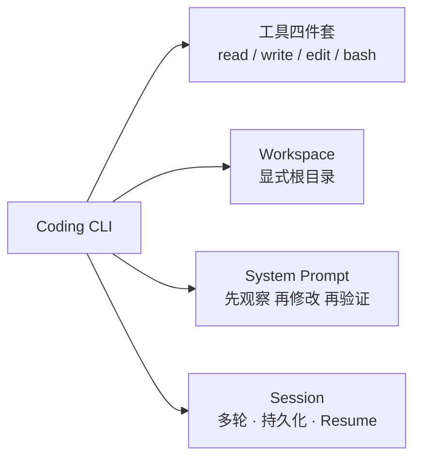
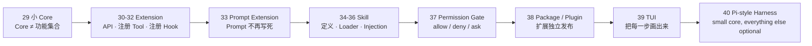

# Stage 4 · Hello Pi

> <span class="stage-badge">Stage 4</span> · Git Tag 范围：<span class="tag-badge">v29-small-core</span> ~ <span class="tag-badge">v40-pi-style</span>

顺利完成Stage 3 Hello Coding Agent之后的小伙伴，将会收获一个**能走进真实代码库干活的 Coding CLI**——`hello "帮我修复这个项目"`，它能查看目录、读取代码、修改代码、执行命令、检查结果，还能 `--resume` 继续昨天的任务。

但一路走到这里，你有没有感觉到一丝「要失控」的苗头？工具越来越多了（`read` / `write` / `edit` / `bash` / Session……），每加一个能力，`src/` 里就多一个文件；再过几个阶段，`Core` 会膨胀成一个什么都能干、也什么都拆不开的大泥球。

也是从这一篇开始，我们要正式向一个真实世界里的优秀项目学习——**Pi**。接下来的 12 章，我们会反复对照它来理解「Harness 该怎么长」。

如果你刚读完 `28-resume`，心里可能正带着一个疑问走进这一篇：

> **工具、会话、能力越来越多，怎么让 Core 保持小而稳定，把扩展能力全部交给插件？**

接下来，这一篇就是 Stage 4 的开篇总览，回答三件事：

1. 我们为什么选择学习 Pi？
2. Pi 最重要的思想是什么？
3. 这一 Stage 完成之后，我们会得到一个怎样的 Extensible Coding Agent？

<!-- more -->

## 一、先复习：我们手上有什么

Stage 3 攒下的东西，可以浓缩成一张图：



**它已经很能干活了**：进入代码库、按章法修改、跑测试、跨会话续跑。

但注意看这张图的结构——**它是「平铺」的**。工具、提示词、会话、工作区，全都长在同一个 `src/` 里，彼此之间没有边界。而 Stage 4 要回答的问题恰恰是：

> **当能力继续膨胀（Extension、Skill、Permission、Package、TUI……），这套平铺的代码还能撑多久？**

## 二、先认识一下：Pi 是什么？我们为什么学它？

**Pi** 是一个开源的 AI Agent Toolkit，由 [earendil-works/pi](https://github.com/earendil-works/pi) 维护，主打「AI agent toolkit: unified LLM API, agent loop, TUI, coding agent CLI」。它官方对自己的定义非常直接：

> **Pi is a minimal terminal coding harness. It is designed to stay small at the core while being extended through TypeScript extensions, skills, prompt templates, themes, and pi packages.**

翻译过来，Pi 的核心设计就是：**「最小核心 + 通过扩展（Extensions / Skills / Prompt Templates / Themes / Packages）保持可扩展」**——这几乎就是我们整个 Stage 4 要亲手复现的设计哲学。

Pi 的仓库按包拆分，结构非常清晰，你几乎一眼就能对上前几章的收获：

```text
@earendil-works/pi-ai              # 统一多 Provider LLM API（OpenAI / Anthropic / Google……）→ 我们对 Stage 0
@earendil-works/pi-agent-core      # Agent Runtime：tool calling + state management       → 我们对 Stage 1-2
@earendil-works/pi-coding-agent    # 交互式 Coding Agent CLI                             → 我们对 Stage 3
@earendil-works/pi-tui             # 终端 UI 库                                          → 我们对 Stage 4 的 39 章
```

> 也就是说：前面三个 Stage 我们手搓的东西，在 Pi 里各有各的包；**Pi 就是我们「长大后想成为的样子」的一个具体参照物。**

### 那为什么是 Pi，而不是别的？

市面上 Agent 框架多如牛毛（LangChain、LlamaIndex、AutoGen、OpenAI Agents SDK……），但我们选择 Pi 作为这一 Stage 的学习对象，是因为它和我们的目标**出奇地同频**：

| 我们的诉求 | Pi 为什么契合 |
| --- | --- |
| **小而可读** | 官方自述就是 `minimal terminal coding harness`，核心保持小，读者看得完、跟得动 |
| **可扩展** | 扩展点是 TypeScript 的 Extension / Skill / Prompt / Package，恰好是我们要亲手实现的 |
| **从零演进** | 它的包结构与我们的 Stage 0→3 路线一一对应，**我们走过的路它都走过** |
| **面向工程** | 专注 coding agent CLI 本身，不捆绑某个大厂的封闭生态，和「Runtime 不绑定 Provider」的边界一致 |

更重要的是，我们的学习姿态是**学思想，不抄代码**：

> **不是复刻 Pi，而是理解它为什么要这么设计。** Pi 的设计是结果，我们要还原的是「它面对什么问题、为什么这样拆」。所以本章起我们反复「对标 Pi」，但每一行代码仍然由我们亲手写出来。

## 三、什么是 Pi 风格，为什么 Core 应该保持小？

中文直译「最小的核心 + 扩展优先」。这是 Pi 最有价值的思想，我们不是要复刻 Pi，而是要理解它**为什么**要这么设计。

一句话立住心智模型：

> **Core ≠ 产品功能集合。**

Core 不是「把能想到的功能都塞进去的地方」，而是**一套最小、稳定、可扩展的骨架**——只有经过考验、几乎不会变的抽象，才有资格留在 Core 里：

```text
Core 只留下：
Model      # 与 Provider 无关的模型抽象
Runtime    # 一次任务怎么跑
Context    # Agent 当前可见世界
Tool       # 能力的统一契约
Event      # 每一步都被观察
Session    # 一次会话的状态
```

其余的一切——工具集、提示词、技能、权限、TUI……**全部通过 Extension 追加**。Core 保持小，换来的三件宝贝：

| 好处 | 说明 |
| --- | --- |
| **稳定** | Core 越小，改动越少，越经得起演进 |
| **可验证** | 骨架越简单，越容易看懂、测透 |
| **可组合** | 能力以插件形态自由组装，按需加载，互不污染 |

> **这就是 Stage 4 的核心命题：不是「把 Core 做大」，而是「让一切能力都能在 Core 之外生长」。**

## 四、它如何成长为一个 Extensible Coding Agent？

这是这一 Stage 最重要的一条叙事线。成长不是「推翻重来」，而是**从平铺走向分层**——先把 Core 收紧，再把能力一件件搬到 Core 之外：



| 阶段 | 章节 | 补上的能力 | 对应成长 |
| --- | --- | --- | --- |
| **收紧核心** | 29 | 架构原则：`Core` 只留 Model / Runtime / Context / Tool / Event / Session | 从「平铺的 src」变成「有明确边界的 Core」 |
| **长出扩展机制** | 30–32 | `Extension` API + 注册 Tool + 注册 Hook（before/afterModel、before/afterTool……） | 从「往 Core 里加代码」变成「在 Core 外挂能力」 |
| **提示词可插拔** | 33 | Prompt 落成 `prompts/coding.md`，随扩展加载 | 从「写死在代码里」变成「提示词也是配置」 |
| **技能进系统** | 34–36 | Skill（知识 / 流程 / 约束）+ Loader + 注入上下文 | 从「只会 Tool」变成「会按 Skill 干活」 |
| **权限显性化** | 37 | Permission Gate：`allow / deny / ask` | 从「工具想跑就跑」变成「跑之前先问一道」 |
| **扩展可发布** | 38 | `@hello-harness/git` / `@hello-harness/web` 等独立包 | 从「一个仓库」变成「可独立演进的生态」 |
| **体验可视化** | 39 | TUI：thinking / tool call / tool result / diff / token | 从「命令行日志」变成「一眼看清 Agent 在干嘛」 |
| **阶段收束** | 40 | `hello-harness-core` + `hello-harness-coding` + `hello-harness-cli` + `hello-harness-extensions` | 从「一个函数库」变成「一个最小核心 + 可选生态」 |

对照着看，每一步都踩在前一步的肩膀上：

- 没有 29 收紧的 Core，30 的 Extension 就无处挂钩；
- 没有 30–32 的扩展机制，33 的提示词、34 的 Skill 都没有「插槽」可插；
- 没有 34–36 的 Skill，37 的权限就不知道该审什么；
- 没有 37 的权限，38 的独立包一引入就是安全隐患；
- 没有前面的能力分层，39 的 TUI 也无从展示。

> **这就是演进叙事：不是每次加一个独立新功能，而是让 Harness 从「平铺」一步步长成「小核心 + 可扩展」的形态。**

## 五、这一 Stage 完成之后，我们会得到一个怎样的 Coding Agent？

毕业作品叫 **Extensible Coding Agent**——一个「小核心 + 一切皆可选」的 Pi 风格 Harness。

先看它长成什么样：

```mermaid
flowchart LR
  U[hello "帮我修复这个项目"] --> CORE[Core<br/>Model · Runtime · Context · Tool · Event · Session]
  CORE --> EXT[Extensions<br/>按需加载]
  EXT --> T[Tools<br/>read / write / edit / bash]
  EXT --> SK[Skills<br/>refactor / review / test]
  EXT --> PR[Prompts<br/>coding.md / review.md]
  EXT --> PG[Permission Gate<br/>allow / deny / ask]
  EXT --> TUI[TUI<br/>把每一步画出来]
```

对比 Stage 3 的 Coding CLI，能力一目了然：

| 维度 | Stage 3 · Coding CLI | Stage 4 · Extensible Coding Agent |
| --- | --- | --- |
| 结构 | 平铺的 `src/` | 小 Core + Extension 生态 |
| 工具 | 写死在代码里 | 扩展注册，按需加载 |
| 提示词 | 写死在 System Prompt | `prompts/*.md`，随扩展加载 |
| 技能 | 无 | Skill 定义 / Loader / Injection |
| 权限 | 无 | Permission Gate：allow / deny / ask |
| 扩展 | 无 | Extension API + Hook + 独立 Package |
| 核心心智 | 一个能干活的产品 | **一个小而稳定的 Core，一切能力都可扩展** |

> 一句话概括 Stage 4 的目标：
> **让 Core 保持小而稳定，把扩展能力全部交给 Extension——学会 Pi 最重要的思想：Minimal Core + Extension First。**

## 六、章节清单

| # | 章节 | Git Tag | 状态 |
| --- | --- | --- | --- |
| 29 | [为什么 Core 应该保持小](29-small-core) | v29-small-core | 已完成 |
| 30 | [Extension API](30-extension-api) | v30-extension | 已完成 |
| 31 | [Extension 注册 Tool](31-extension-register-tool) | v31-extension-tool | 已完成 |
| 32 | [Extension 注册 Hook](32-extension-register-hook) | v32-hooks | 已完成 |
| 33 | [Prompt Extension](33-prompt-extension) | v33-prompt-extension | 已完成 |
| 34 | [Skill](34-skill) | v34-skill | 已完成 |
| 35 | [Skill Loader](35-skill-loader) | v35-skill-loader | 已完成 |
| 36 | [Skill Injection](36-skill-injection) | v36-skill-injection | <span class="stage-badge">规划中</span> |
| 37 | [Permission Gate](37-permission-gate) | v37-permission | <span class="stage-badge">规划中</span> |
| 38 | [Package / Plugin](38-package-plugin) | v38-package | <span class="stage-badge">规划中</span> |
| 39 | [TUI](39-tui) | v39-tui | <span class="stage-badge">规划中</span> |
| 40 | [Hello Pi-style Harness](40-hello-pi-style-harness) | v40-pi-style | <span class="stage-badge">规划中</span> |

## 阶段结尾

这一阶段结束：**Extensible Coding Agent**——`hello-harness-core` 保持小而稳定，工具、技能、提示词、权限、TUI 全部以扩展形态生长。

> **记住这一 Stage 的灵魂一句：**
> **small core，everything else optional——Core 越小，Harness 越稳，能力越能在 Core 之外自由生长。**

下一阶段，我们要回答一个更尖锐的问题：如果模型越来越会写代码，我们**还需要给它几十个 Tool Schema 吗**？——这是整套教程第二次最大跃迁：从 **Tool Calling 进入 Code as Action**。
