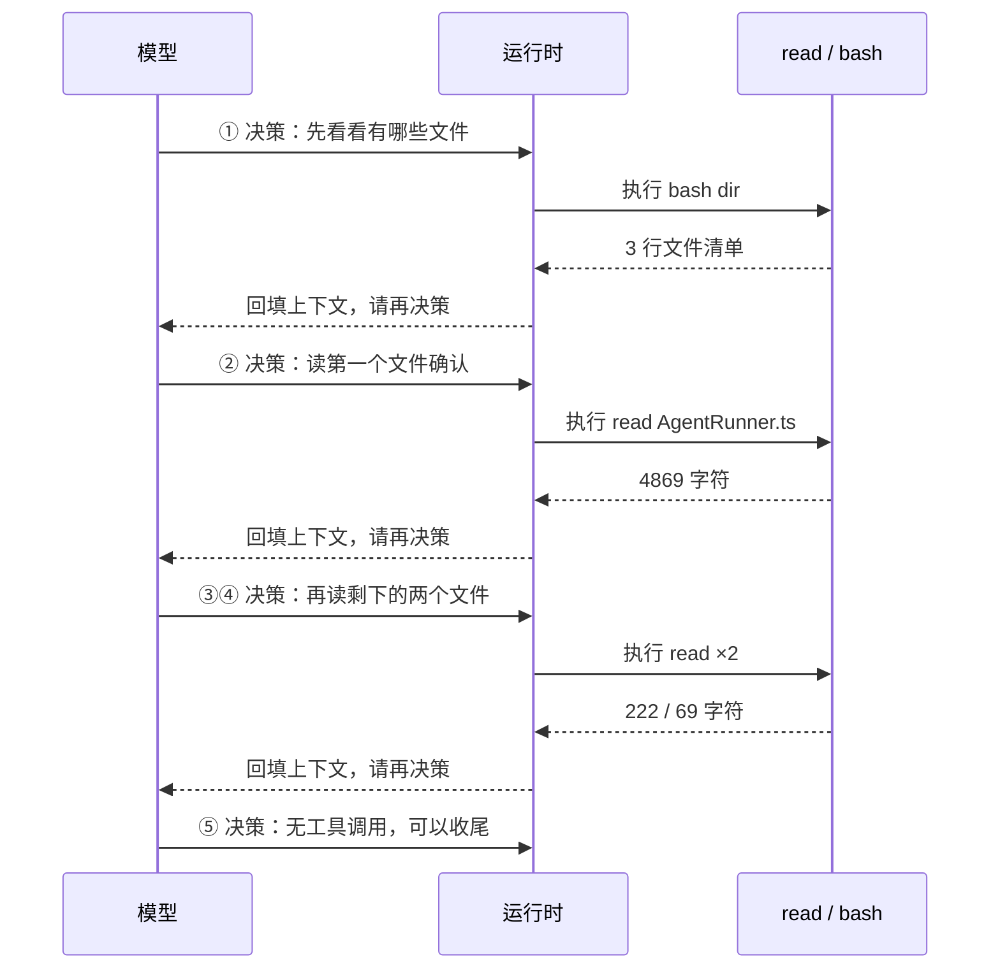
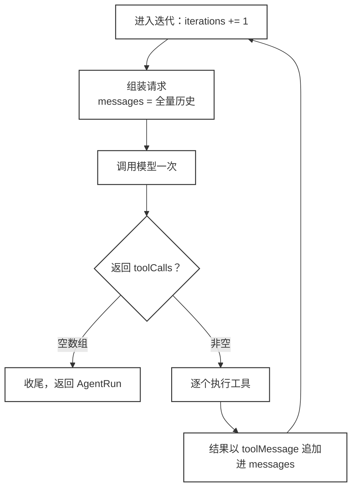
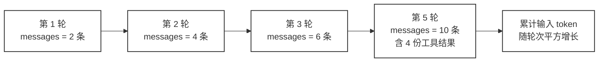

# 42 · Tool Calling 的组合成本

> <span class="stage-badge">Stage Hello Programmatic Agent</span> · <span class="tag-badge">v42-composition-cost</span>

判断一个 Coding Agent 干活快不快，我们一般先看模型聪不聪明。这一章要说的是另一件事：**在 Tool Calling 架构下，速度更多取决于控制循环让模型回来做了多少次决定。**

Stage 1 到 Stage 4 建起来的这套 Harness，单次工具调用其实非常干净。问题不在单次调用，而在需要多个工具协作的组合任务上。

这一章不改架构，只做一件事：把「组合成本」从感觉变成数字。下一步先看清代价，ch43 的 Code as Action 才有靶子可打。

## 一、上一版存在什么问题？

一般来讲，单次工具调用的路径是一气呵成的：模型输出一个 ToolCall，工具注册表找到工具，工具执行，结果回填上下文，模型继续。

`read("src/index.ts")`、`bash("npm test")` 这类「一次一把工具」的动作，模型选一次、Harness 干一次、结果回一次，没有多余的环节。

问题藏在组合任务里。比如这个任务：

> **找出 `src` 下所有包含 `AgentRuntime` 的 TypeScript 文件。**

模型手里只有 `bash` 和 `read`，没有一个「一次遍历全部文件」的工具。于是它只能把这个任务拆成好几段，每段的中间结果都必须回到模型，模型必须再决策一次。

下面这张时序图就是我们在真实 Harness 上跑出来的完整轨迹：




一个任务，五段对话。看清楚这个结构，后面三个代价就都好理解了：

- **往返次数随组合规模线性增长**：文件多一个，往返就多一轮。「遍历 3 个文件」和「遍历 30 个文件」之间的差距，是 27 次额外的模型决策；
- **上下文随轮次累积**：每读一个文件，内容都会写进消息历史，而且下一轮会把整份历史重新发给模型（第五节会给源码证据）；
- **编排权放错了位置**：先列、再逐个读、过滤、汇总——这套「怎么组合」的逻辑，本该由模型一口气写出来，现在却散落在每一次模型决策里。

> 一句话：**Tool Calling 擅长「选择能力」，不擅长「低成本组合能力」。** 而组合，恰恰是模型最擅长的事情。

## 二、本篇解决什么问题？

这一章**不改任何架构**，只给已有的控制循环装上一把度量尺。

> 把「组合成本」从感觉变成可度里的数字，为下一章「让模型写程序来组合」立起一个明确的靶子。

接下来先说清楚要量哪三个数：

| 指标 | 含义 | 从哪里取 |
| --- | --- | --- |
| 模型决策次数 | 模型一共被调用了几次，每次工具结果都要回来再做一次决定 | `AgentRun.iterations` |
| 工具调用次数 | Harness 真实执行了几个工具 | `steps` 里 `type === "tool"` 的条数 |
| 往返次数 | `Model ↔ Harness` 一共来回了几趟 | 等于模型决策次数 |

这三个数都来自 ch14 就建好的 `AgentRun` 档案，不需要新造统计逻辑。

有一个方法论上的取舍要提前说清楚：**demo 里的模型是脚本化的，不是真实大模型。**

真实大模型面对同一个任务，有可能一次列完文件就猜出答案，也可能绕更多弯路，同样的命令跑两遍结果还不一样。我们要度量的是「控制循环会逼出多少次往返」这个结构属性，不是某一次具体调用的运气，所以把模型的行为固定住，让变量只剩一个。

文件、工具、运行时则全部是真的——`read` 真的读磁盘，`bash` 真的起子进程，上下文真的在累积。只有「模型这一步决定做什么」是写死的。

核心心智模型只有一句：**组合成本 ≈ 工具步骤数**。只要是「一步一决策」的 Tool Calling，组合复杂度就会变成模型往返次数——这不是模型笨，是控制循环的结构决定的。

## 三、先看最终效果

运行这一章的 demo（命令在第七节），会看到一次完整的组合任务轨迹：

```bash
=== 42 · Tool Calling 的组合成本：为什么 1 个组合任务要 5 次模型往返 ===

[模型] 先列出 src 下所有 TypeScript 文件，看看有哪些文件需… → 决定调用：bash({"command":"dir /b /s src\\*.ts"})
  [工具] → bash({"command":"dir /b /s src\\*.ts"})
  [结果] ← stdout="...\\src\\AgentRunner.ts\r"…（3 行）exitCode=0
[模型] 第一个文件可能是候选，读取它确认是否包含 AgentRuntime。 → 决定调用：read({"path":"src/AgentRunner.ts"})
  [工具] → read({"path":"src/AgentRunner.ts"})
  [结果] ← content="// AgentRunner.ts\nimport { AgentRuntime } from \"@h"…（4869 字符）
[模型] 已确认包含 AgentRuntime，继续读下一个文件确认。 → 决定调用：read({"path":"src/ToolRegistry.ts"})
  [结果] ← content="// ToolRegistry.ts\nimport { AgentRuntime } from \"@"…（222 字符）
[模型] 也包含 AgentRuntime，继续读最后一个文件。 → 决定调用：read({"path":"src/utils.ts"})
  [结果] ← content="// utils.ts\nexport const answer = 42;\n\n// filler l"…（69 字符）
[模型] 已完成全部确认：包含 AgentRuntime 的文件是 src/A… → 无工具调用，可以收尾

=== 组合成本度量 ===
任务数量        : 1
模型决策次数    : 5（每次工具结果都要回到模型再做一次决定）
工具调用次数    : 4
模型↔Harness 往返 : 5 次
token          : 4000 in / 1750 out
最终回答        : 已完成全部确认：包含 AgentRuntime 的文件是 src/AgentRunner.ts 和 src/ToolRegistry.ts（utils.ts 不含） 。
```

注意最下面这组数字：**1 个任务 = 5 次模型决策 = 5 次往返。**

对照一下，如果「列出来 → 逐个读 → 过滤 → 汇总」这段逻辑能用一段程序一次写出来（这正是 ch43 要做的），模型只需要决策一次。

还有一个细节值得留意：`AgentRunner.ts` 那次读取，4869 字符的完整内容全部进了上下文。这还只是个 320 行的示例文件。

## 四、架构变化

这一章**没有引入任何新抽象**，这本身就是教学点。想看清组合成本，不需要造新引擎，只需要把已有的主循环读一遍。

下面这张图是 `packages/core/src/runtime/runtime.ts` 里那个 `while (true)` 的真实结构：




这张图意味着两件事。

第一，**一次迭代精确等于一次模型调用**——`iterations += 1` 就在循环体的第一行，所以 `AgentRun.iterations` 可以直接当作模型决策次数来读。

第二，**循环的唯一出口是「模型这次不调工具了」**。工具执行完之后没有判断、没有分支、没有短路，只会回到循环顶部再问一次模型。组合的编排权，就被锁死在这个出口条件里了。

我们没有动 `AgentRuntime`、`ToolRegistry`、`read`、`bash` 任何一个类，只是订阅了事件做观测。Stage 2 建起来的事件系统，又一次派上了用场。

## 五、核心抽象

这一节讲两个结论，第二个是这一章真正的信息差。

### 往返是 Tool Calling 的最小计价单位

```text
一次往返 = 模型决策一次 → 工具执行一次 → 结果回上下文
```

组合任务由 N 个工具步骤组成，就大约需要 N 次往返，外加最后一次收尾决策。这是第一节那张图已经证明过的事情。

### 真正贵的不是往返次数，是每轮重发全量历史

先看源码，`packages/core/src/runtime/runtime.ts` 的主循环里组装模型请求只有一行：

```ts
// packages/core/src/runtime/runtime.ts:351-426（节选）
while (true) {
  iterations += 1;
  const modelRequest = { messages: context.messages, tools };   // 全量历史
  response = await this.generate(modelRequest);                  // 一次迭代 = 一次模型调用
  if (response.toolCalls.length === 0) return finish("completed", "finished");
  for (const call of response.toolCalls) {
    context.add(toolMessage(call.id, JSON.stringify(result)));   // 结果写进历史
  }
}
```

注意 `context.messages` 是**累积的完整历史**，不是增量。第 k 次迭代发出去的消息条数是 `2 + 2(k-1)`：system 和 user 各一条，加上前面 k-1 轮每轮留下的一条 assistant 消息和一条 tool 消息。

把这一章 demo 的数字代进去算一遍，第 5 次迭代发出去的请求长这样：




图里那个「10 条」是可以数出来的：system 和 user 各 1 条，前 4 轮每轮 2 条，一共 10 条。这 10 条里的工具结果分别是文件清单、4869 字符、222 字符、69 字符，加起来约 5400 字符——它们在最后一次迭代里被完整重发了一遍，而中间几轮各自重发过一次。

单个工具结果的体积也有硬上限，两个常量都在 `packages/coding/src/tools` 下：`read` 是 `MAX_READ_CHARS = 8000`（`read.ts:5`），`bash` 是 `MAX_OUTPUT_CHARS = 8000`（`bash.ts:5`）。也就是说，一次工具调用最多能把 8000 字符塞进历史，而这些字符会在后续每一轮里被反复重发。

把两件事合起来看，成本结构就变了：

```text
第 k 轮的输入规模 ≈ O(k × 单次工具结果大小)
N 轮累计输入 token ≈ O(N² × 单次工具结果大小)
```

平方级，不是线性级。

这里要说明 demo 里的 4000/1750 是怎么来的：脚本化模型每轮固定返回 800/350，5 轮就是 4000/1750。这么设计是为了让「往返次数」这个变量干净可复现。**换成真实大模型，inputTokens 会随历史逐轮膨胀**——demo 把这个变量抹平了，但源码里的 `context.messages` 不会替我们抹平。

> 所以组合成本的完整说法是：**步数线性地变成往返次数，往返次数又平方地变成 token。**

## 六、实现代码

完整代码在 `examples/stage-5/42-tool-calling-cost/demo.mts`，核心三步。

### 造一个真实工作区，只注册两个工具

关键设计是：**文件是真实的，工具也是真的。** `read` 真的去读磁盘，`bash` 真的去执行命令。

只有「模型每一步做什么决定」是脚本化的，这样才能稳定复现组合轨迹，不依赖大模型的随机性。

```ts
// 3 个真实文件：2 个含 AgentRuntime，1 个不含
writeFileSync(path.join(scratch, "src", "AgentRunner.ts"),  padSource("…含 AgentRuntime…", 320), "utf-8");
writeFileSync(path.join(scratch, "src", "ToolRegistry.ts"), padSource("…含 AgentRuntime…", 12), "utf-8");
writeFileSync(path.join(scratch, "src", "utils.ts"),        padSource("…不含…", 5), "utf-8");

const workspace = new Workspace(scratch);
const registry = new ToolRegistry();
registry.register(createReadTool(workspace));
registry.register(createBashTool(workspace));
```

`padSource` 是 demo 里的填充函数，作用是把文件撑到指定行数，模拟真实项目的文件体积。

### 脚本化模型：把逐步决策写成 5 次调用

```ts
function createCompositionModel(): Model {
  const script: Array<{ content: string; toolCalls: ToolCall[] }> = [
    { content: "先列出 src 下所有 TypeScript 文件…",
      toolCalls: [{ id: "c1", name: "bash", arguments: { command: "dir /b /s src\\*.ts" } }] },
    { content: "读取第一个文件确认…",
      toolCalls: [{ id: "c2", name: "read", arguments: { path: "src/AgentRunner.ts" } }] },
    { content: "继续读下一个文件…",
      toolCalls: [{ id: "c3", name: "read", arguments: { path: "src/ToolRegistry.ts" } }] },
    { content: "读最后一个文件…",
      toolCalls: [{ id: "c4", name: "read", arguments: { path: "src/utils.ts" } }] },
    { content: "已完成全部确认：…", toolCalls: [] },   // 空数组 = 循环的唯一出口
  ];
  let index = 0;
  return {
    modelName: "mock-roundtrip",
    async generate() {
      const item = script[Math.min(index++, script.length - 1)];
      return { content: item.content, toolCalls: item.toolCalls, inputTokens: 800, outputTokens: 350 };
    },
    async *stream() { throw new Error("本 demo 使用 generate 模式"); },
  };
}
```

最后那一项的 `toolCalls` 是空数组，正对应第四节流程图里那个唯一出口。

### 用真实 AgentRuntime 跑，订阅事件度量

```ts
const runtime = new AgentRuntime(createCompositionModel(), registry, { maxSteps: 10 });

runtime.on("model:end", (e) => { /* 打印这次决策 + 决定调用的工具 */ });
runtime.on("tool:start", (e) => { /* 打印工具进入执行 */ });
runtime.on("tool:end", (e) => { /* 打印工具结果摘要 */ });

const run = await runtime.run({ messages: [systemMessage(…), userMessage(…)] });
const toolSteps = run.steps.filter((s) => s.type === "tool").length;
console.log(`模型决策次数 : ${run.iterations}`);   // 5
console.log(`工具调用次数 : ${toolSteps}`);        // 4
```

`maxSteps` 的默认值是 20（`runtime.ts:174`），这里显式给 10 是为了留出观察余量。这个值本身就是组合能力的天花板：超过它，运行时会强制收尾，模型想再多确认几个文件也没机会了。

还有一处容易被忽略的设计，是喂给模型的第一条消息：

```ts
systemMessage("你是一个严谨的 Coding Agent：确认任何事实前必须先调用工具查看真实内容，不要猜，也不要跳过。")
```

这句提示词不是装饰，它堵住了「看到文件名就猜内容」这条捷径。

少了这句，同样的任务在真实模型上很可能 2 轮就结束了，脚本化模型也就不会老老实实读满 4 次，组合成本自然就看不出来。度量一个结构属性之前，得先把绕开它的路封住。

完整代码路径请参照项目源码：


## 七、运行 Demo

```bash
pnpm typecheck                # 全仓类型检查，应全绿
node --import tsx examples/stage-5/42-tool-calling-cost/demo.mts
```

输出即第三节的完整轨迹与度量。不同系统下 `bash` 的路径显示会有差异；Windows 用 `dir`，Linux/macOS 可以把命令换成 `find src -name "*.ts"`。


验证点：

| 验证点 | 结果 |
| --- | --- |
| 工具是否真实执行 | `read` 真的返回文件内容、`bash` 真的列出 3 个文件 |
| 是否逐次往返 | 5 次 `model:end`、4 次 `tool:start`/`tool:end`，轨迹可见 |
| 组合成本是否量化 | 任务 1 个 → 模型决策 5 次 → 往返 5 次 → token 4000/1750 |
| 是否改动 Harness | `AgentRuntime / ToolRegistry / read / bash` 零改动，只订阅事件做观测 |

## 八、新架构解决了什么？

既然没改架构，这一节说的是「把成本看清楚」这件事本身带来了什么。

1. **组合成本显式化**：「为什么复杂任务越来越慢、越来越贵」第一次有了可度量的解释，不是模型不行，是控制循环的往返次数在涨；
2. **问题边界清晰了**：工具本身没问题，`read` 和 `bash` 都是一次就干完活的，问题出在「组合的编排权」被拆散进了每一次模型决策；
3. **给 ch43 立了靶子**：同一个任务，1 次决策和 5 次决策的差距，成为衡量 Code as Action 价值的最小对照实验；
4. **证明观测体系的价值**：不拆引擎、只看事件，就能把结构性问题看清。

前三点是给 ch43 铺路的，第四点是给整套教程铺路的。Stage 2 花一整章建事件系统时，它的收益还看不出来；到这里，观测成了唯一需要的能力。

## 九、它又引入了什么问题？

问题没有被解决，只是被看清楚了，而且看得比预想的更严重：

1. **往返次数随组合规模线性增长**：文件越多、过滤条件越多，模型决策次数就越多，时延跟着涨；
2. **token 随轮次平方增长**：这是第三节那组 4000/1750 掩盖掉的真相，全量历史每轮重发，中间结果反复计价；
3. **中间结果全进上下文**：`read` 的完整内容会成为消息历史的一部分，「过程数据」和「最终结论」混在一起，最多一个文件就能贡献 8000 字符；
4. **模型被迫一次只走一步**：模型明明会用「循环 + 过滤 + 聚合」表达整个流程，却没有一条让它这样表达的通道；
5. **编排掉进了夹缝**：模型在「选工具」，Harness 在「执行工具」，而「怎么组合」这一层既不属于模型的一次表达，也不属于 Harness 的一次执行。

最后一条是这一章真正的结论。前面四条都是代价，第五条指向了解法的位置——既然「怎么组合」这一层没有归属，那就给它造一个归属。

## 十、下一章

42 章留下的问题可以压缩成一句话：

> 模型已经会编程了，为什么「列文件 → 逐个读 → 过滤 → 汇总」还要它一次次回来说一句话？

43 章回答它——**Code as Action**：

```python
files = await glob("src/**/*.ts")
targets = []
for file in files:
    text = await read(file)
    if "AgentRuntime" in text and len(text.splitlines()) > 300:
        targets.append(extract_class(text))
```

核心是八个字：**Model 负责生成程序，Harness 负责执行能力。** 让模型把「组合」写进一段程序，一次交给 Harness，而不是拆成每步一次往返。

尽信书则不如，以上内容纯属一家之言，因个人能力有限，难免有疏漏和错误之处，如发现 bug 或者有更好的建议，欢迎批评指正，不吝感激 🙃

欢迎点赞、关注公众号「一灰灰Blog」 我们下章见

---

微信公众号: 一灰灰Blog
