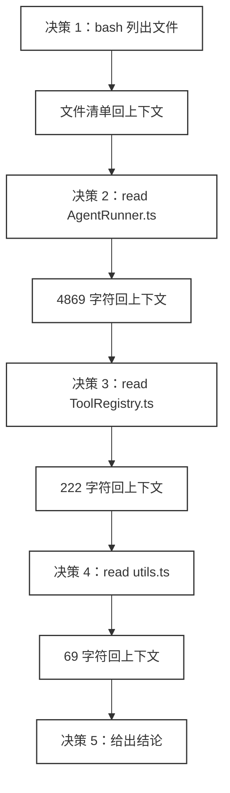
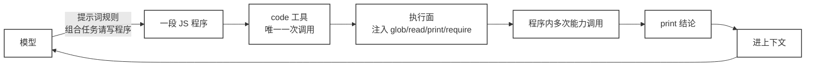
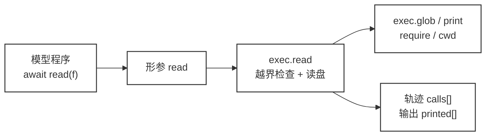

# 43 · Code as Action

> <span class="stage-badge">Stage Hello Programmatic Agent</span> · <span class="tag-badge">v43-code-as-action</span>

第四十二章只测量、不改架构，量出一组不太好看的数字：**1 个组合任务 = 5 次模型决策 = 5 次 Model↔Harness 往返。**

原因很直白：模型每次只能执行一个工具，于是「列出文件 → 逐个读取 → 确认 → 汇总」里的每一步，都逼着中间结果回到模型、模型再决策一次。

这一章把答案做成真实能力：**让真实大模型生成一段 JavaScript 程序，由 Harness 一次执行，跑完组合、只把结论送回来。**

模型写程序、`code` 工具执行、`print` 结果进上下文、模型收尾。这四步在真实 CLI 里跑得通，不是 demo 里的假动作。

## 一、上一版存在什么问题？

上一章那 5 次决策，拆开看是这样的：




这张图暴露了三件事：

- **编排权散在往返里**：「怎么组合」这件事被拆成五次独立决策，没人能一次看清模型的完整意图；
- **中间结果全部回流上下文**：`utils.ts` 明明跟结论无关，它的内容也完整地烧了一遍 token；
- **编程能力被禁用**：模型会用 `for`、会写 `if`、会聚合，但这套控制面只允许它一次说一个工具。

还有一个更实际的问题：上一章那个「让模型写程序」的能力，**只存在于 demo 的脚本里**。提示词没告诉模型可以写程序，Harness 里也没有一个能执行程序的工具，真实模型根本用不上。

问题因此可以换个说法：模型并不缺工具，缺的是一条能让它把组合逻辑一次写出来的通道。

## 二、本篇解决什么问题？

这一章动两处最小的地方，把组合能力真正装进 Harness：




具体是三件事：

1. **新增 `code` 工具**，注册进 `hello-coding`（第 8 个工具），参数就是一段 JavaScript 程序，执行时把 `glob` / `read` / `print` / `require` 注入进程序，`print` 的内容作为工具结果进上下文；
2. **调整提示词**，在 `prompts/coding.md` 和 CLI 默认系统提示词里加【组合任务请写程序】规则，告诉真实模型：遍历、过滤、聚合请写一段程序一次调用 `code`，不要逐个点工具；
3. **端到端跑通**，真实模型收到任务 → 按提示词写出程序 → 调用 `code` → Harness 执行 → `print` 结论回上下文 → 模型收尾给答案。

核心就八个字：**Model 负责生成程序，Harness 负责执行能力。**

## 三、先看最终效果

先看不需要 API Key 的对照 demo（命令在第七节）。它注册真实的 `code` 工具，用 `ToolRegistry` 直接执行四段程序：

```bash
=== 43 · Code as Action：真实 code 工具执行一次程序 ===

[模型决策 1] 输出一段程序（而不是逐个点工具）：
const files = await glob("src/**/*.ts");
const matches = [];
for (const file of files) {
  const text = await read(file);
  if (text.includes("AgentRuntime")) matches.push(file);
}
print("包含 AgentRuntime 的文件：" + matches.join("、"));

[Harness] 调用真实工具：code({ code })（hello-coding 第 8 个工具）

>> 正常程序
   [能力] glob(src/**/*.ts)
   [能力] read(src/AgentRunner.ts)
   [能力] read(src/ToolRegistry.ts)
   [能力] read(src/utils.ts)
   [结果] 包含 AgentRuntime 的文件：src/AgentRunner.ts、src/ToolRegistry.ts

>> 带 Markdown 围栏的程序（自动剥离）
   [能力] read(src/utils.ts)
   [结果] utils.ts 行数：6

>> 用 require 加载模块（不再报 require is not defined）
   [能力] glob(src/**/*.ts)
   [结果] AgentRunner.ts

>> 一段编译失败的坏程序
   结果 → 失败：程序编译失败：Unexpected token ';'｜程序开头：const x = ; print(x);（kind=tool）

=== 对比：同一个组合任务 ===
                     ch42 · Tool Calling    ch43 · Code as Action
模型决策次数          5                      1
能力调用次数          4                      4（在同一段程序内）
Model↔Harness 往返     5                      1
进上下文的中间结果      4 份整文件内容           仅最终输出
```

这张对比表里有一个数字要说清楚，否则容易误读。

最后那张表的「模型决策次数 1」是**手写的结论，不是测出来的**——demo 里根本没有起 `AgentRuntime`，它直接调 `registry.execute()` 执行工具，绕过了模型。

真实跑通时的准确数字是 **5 次变 2 次**：一次写程序，一次收尾。ch42 那 5 次里本来就含一次收尾决策，所以公平的算法是看组合部分——**4 次工具决策压成 1 次**。

> 还有一件事别被表骗了：**能力调用次数是 4 → 4，一次没少。** Code as Action 省下来的是编排成本和上下文，不是工作量。

这个区分很重要。如果以为「写程序就等于跑得更快」，那是误解了这套机制：该读的文件一个都不少读，少的是「每读一个都要回模型问一次」的那段路。

## 四、架构变化

这一章的改动集中在两个地方：一个新工具，一段新提示词。其余一行没动。

先把变化摊开看一眼：

```text
packages/
├── coding/
│   ├── src/
│   │   ├── tools/
│   │   │   └── code.ts              ← 新增：createCodeActionTool（第 8 个工具）
│   │   ├── extensions/
│   │   │   └── hello-coding.ts      ← 注册 code；version 0.8.0 → 0.9.0
│   │   └── index.ts                 ← 导出 createCodeActionTool / CodeActionInput
├── cli/
│   └── src/
│       └── main.ts                  ← 默认系统提示词加【组合任务请写程序】
prompts/
└── coding.md                        ← 加同一段【组合任务请写程序】规则
examples/
└── stage-5/43-code-as-action/
    └── demo.mts                     ← 新增：对照 demo（不需要 API Key）
```

有一处容易踩：`prompts/coding.md` 和 `packages/cli/src/main.ts` 里那段规则是**同一份内容写了两遍**。前者走 `PromptLoader` 注入，后者是 CLI 没加载 prompt 时的兜底默认值。两边不一致就会出现「TUI 里模型会写程序、直接跑命令时不会」这种怪事，改动时要同步。

接下来分两处说。

### 新增 `code` 工具

`packages/coding/src/tools/code.ts` 新增 `createCodeActionTool(workspace)`，在 `hello-coding` 扩展里注册为第 8 个工具，扩展版本从 0.8.0 升到 0.9.0。

`code` 会执行任意程序，属于有副作用的工具，所以**不在只读白名单里**——`packages/coding/src/permission/policies.ts:41` 那个只读集合只有 `calculator / random / read / load_skill`，`code` 落到 `askSideEffectingTools()`，返回 `ask`。真实使用时会询问确认，加 `--auto-approve` 才直接放行。

能跑任意代码的工具，理所当然该过这道闸。

### 调整提示词

`prompts/coding.md` 和 CLI 默认系统提示词各加一段【组合任务请写程序】规则，告诉模型五件事。

一是程序里可以用 `glob(pattern)` / `read(path)` / `require(id)` / `cwd()` / `print(内容)`，二是 `glob` 和 `read` 只能访问 workspace 内路径，三是中间结果留在程序变量里、只有 `print` 的结论进下一轮上下文，四是拼绝对路径要用注入的 `cwd()` 而不是 `process.cwd()`，五是确实要写文件、改文件或跑系统命令时才改用 `write` / `edit` / `bash`。

`cwd()` 这一条看着不起眼，实际是踩过的坑。CLI 的启动目录不一定等于 workspace 根目录，程序里直接用 `process.cwd()` 拼路径，换个目录启动就会指向错的地方。注入 `cwd()` 让程序只能拿到 workspace 根，把这个变量掐掉。

这条规则是整套机制的扳机。工具注册好了，模型不知道有这个工具、不知道什么时候该用它，等于没做。

还有一层边界要说清楚：**`code` 不是用来替代 `write` / `edit` / `bash` 的。** 程序里没有注入写文件的能力，也没有注入执行 shell 的能力，所以「改一个文件」这种单次动作，用 `edit` 更直接，套一段程序反而绕。提示词里明确写了这条分界。

## 五、核心抽象

### 能力注入口就是那一行 `new Function`

模型的程序里凭什么能调 `glob` 和 `read`？答案在 `code.ts:128`，只有一行：

```ts
const body = `return (async () => {\n${program}\n})();`;
const fn = new Function("glob", "read", "print", "require", "cwd", body) as (...args: unknown[]) => Promise<unknown>;
await Promise.race([fn(exec.glob, exec.read, exec.print, exec.require, exec.cwd), timeoutPromise]);
```

五个形参名就是五个能力名。程序体被包进一个 `async` IIFE，所以模型写 `await read(...)` 是合法的；执行时按顺序把 `exec` 上的五个实现传进去，一一对应：




这个写法的意思是：**模型程序不碰文件系统，它只调用注入进来的能力。** 能力背后由谁实现、受什么治理，完全是 Harness 的事，这正是下一章「复用 ToolRegistry」的入口。

### 为什么是 `new Function`，不是 `vm` 或沙箱

一般来讲，跑外部代码第一反应是上沙箱。这里没上，有三个理由，按重要性排。

第一，**这一章要展示的是「能力注入」这个机制本身**，不是沙箱工程。用 `vm` 起一个独立 context，读者得先理解 contextify、global 代理、模块解析，注意力就被带跑了。

第二，**真正的隔离边界在别处**。`new Function` 生成的函数确实能访问全局，所以安全不能靠它，得靠注入的能力本身——`read` 做越界检查、超时兜底、权限门判 `ask`。把防护做在能力层，比做在沙箱层更可控，也更符合「Capability 优于 Tool 膨胀」的原则。

第三，**它是可替换的**。执行面只是一个函数签名，ch44 要把它换成 `ProgrammaticToolBinding`，ch45 之后要加治理，`new Function` 都可以原地换掉，模型那一侧完全无感。

代价也很清楚：程序里的 `require` 是完整的 Node require，能加载 `fs`。这个洞本章不补，留给 ch44–45。

### 编排权从模型决策转移到了程序

ch42 的编排权在每一次模型决策里，组合的代价就等于往返次数。ch43 把它挪进了一段程序，组合在程序内部完成，模型只在开头和结尾各决策一次。

> Tool Calling 让模型「选」能力，一次是一步；Code as Action 让模型「写」组合，一次是一段。

而让模型真的走这条路，靠的正是提示词规则。没有【组合任务请写程序】，真实模型还会回到逐点点工具的老路上。

## 六、实现代码

### 注入给程序的五个能力

完整实现在 `packages/coding/src/tools/code.ts`

下面给出核心部分，也就是 `createProgramExec(root)` 返回的那组函数。

`glob` 按 pattern 解析出的目录与后缀递归收集文件，`read` 做越界检查后读文件，`print` 把输出收进数组，最后作为工具结果返回：

```ts
const SKIPPED_DIRS = new Set(["node_modules", ".git", ".sessions", ".harness", "dist"]);

function createProgramExec(root: string) {
  const calls: string[] = [];          // 能力调用轨迹
  const printed: string[] = [];        // print 收集区
  const requireFromWorkspace = createRequire(path.join(root, "__hello_harness_program__.cjs"));

  return {
    calls, printed,
    glob(pattern: string): string[] {
      calls.push(`glob(${pattern})`);
      const { rootDir, exts } = parseGlobPattern(pattern);   // 前缀目录 + 后缀集合
      /* 从 root/rootDir 递归 walk，跳过 SKIPPED_DIRS，按 exts 过滤 */
    },
    async read(relPath: string): Promise<string> {          // 越界即拒绝
      calls.push(`read(${relPath})`);
      const target = path.resolve(root, relPath);
      if (target !== root && !target.startsWith(root + path.sep)) {
        throw new PermissionError(`程序 read 越界，拒绝：${relPath}`);
      }
      return readFileSync(target, "utf-8");
    },
    print(text: unknown): void { printed.push(/* 字符串化 */); },
    require(id: string): unknown { return requireFromWorkspace(id); },
    cwd(): string { return root; },      // workspace 根目录
  };
}
```

有几处细节值得留意。

`SKIPPED_DIRS` 是硬编码的排除名单，`node_modules`、`.git`、`dist` 这些目录不会被遍历。没有它，模型一句 `glob("**/*.ts")` 就会把整个依赖树读一遍。

`read` 里的越界检查是自己写的，没有复用 ch23 的 Workspace 边界。这个不一致正是下一章要还的债。

`require` 用的是 `createRequire` 造出来的、以 workspace 为基准的解析器。没有它，模型程序里写 `require("path")` 会直接报 `require is not defined`，而这是真实模型写程序时的高频动作。


我们注册一个 `code` 的工具提供给大模型，表示可以用来执行一段JS代码，同样在 `code.ts` 文件中，实现如下

```ts
export function createCodeActionTool(workspace: Workspace): Tool {
  return {
    name: "code",
    description:
      "执行一段 JavaScript 程序（代码动作）：一次执行即可在程序内部循环、过滤、组合多次能力。程序里可用注入的能力：glob(pattern)（按前缀目录与后缀集合匹配文件并返回相对路径，自动跳过 node_modules/.git/.sessions 等）、read(path)（读取 workspace 内文件）、require(id)（加载 Node 内建模块或 workspace 内模块）、cwd()（workspace 根目录，拼绝对路径用它）、print(内容)（输出结论，唯一进入上下文的结果）。适合把「遍历 → 过滤 → 聚合」这类组合任务一次写完。",
    parameters: {
      type: "object",
      properties: {
        code: {
          type: "string",
          description:
            "一段 JavaScript 程序文本，可使用 await；可直接调用 glob(pattern)、read(path)、require(id)、cwd()、print(内容)，循环/过滤/组合全部在程序内完成。不要写 import 语句（本执行面是函数作用域），需要模块用 require；拼绝对路径用注入的 cwd()，不要依赖 process.cwd()；不要带 ``` 围栏（会自动剥离）。",
        },
      },
      required: ["code"],
    },
    async execute(input: unknown): Promise<ToolResult> {
      const { code } = input as CodeActionInput;
      if (typeof code !== "string" || code.trim() === "") {
        return { ok: false, error: "参数 code 必须是程序文本字符串", kind: "tool", retryable: false };
      }

      const program = normalizeCode(code);
      const exec = createProgramExec(workspace.root);
      const body = `return (async () => {\n${program}\n})();`;
      const messageOf = (error: unknown): string =>
        error instanceof Error ? error.message : String(error);

      let fn: (...args: unknown[]) => Promise<unknown>;
      try {
        fn = new Function("glob", "read", "print", "require", "cwd", body) as (
          ...args: unknown[]
        ) => Promise<unknown>;
      } catch (error) {
        return {
          ok: false,
          error: `程序编译失败：${messageOf(error)}｜程序开头：${excerpt(program)}`,
          kind: "tool",
          retryable: false,
        };
      }

      let timer: ReturnType<typeof setTimeout> | undefined;
      const timeoutPromise = new Promise<never>((_, reject) => {
        timer = setTimeout(
          () => reject(new Error(`程序执行超时（${CODE_ACTION_TIMEOUT_MS}ms）`)),
          CODE_ACTION_TIMEOUT_MS,
        );
      });

      try {
        await Promise.race(
          [fn(exec.glob, exec.read, exec.print, exec.require, exec.cwd), timeoutPromise],
        );
      } catch (error) {
        if (error instanceof PermissionError) {
          return { ok: false, error: error.message, kind: "permission", retryable: false };
        }
        return {
          ok: false,
          error: `程序执行失败：${messageOf(error)}｜程序开头：${excerpt(program)}`,
          kind: "tool",
          retryable: false,
        };
      } finally {
        if (timer) clearTimeout(timer);
      }

      return {
        ok: true,
        value: { printed: exec.printed, calls: exec.calls },
      };
    },
  };
}
```


编译失败时的错误消息也做了处理，会带上 `｜程序开头：…`：

```ts
return { ok: false, error: `程序编译失败：${messageOf(error)}｜程序开头：${excerpt(program)}`, kind: "tool", retryable: false };
```

模型拿到这条消息能看出自己哪一段写坏了，而不是只看到一个 `SyntaxError` 干瞪眼。

`execute` 里还有一处值得留意：

- 捕获错误时会先判断是不是 `PermissionError`，是就返回 `kind: "permission"`，否则返回 `kind: "tool"`。
- 这两种 kind 在 ch37 的权限门和后续的重试策略里含义不同——越界是「不许做」，语法错是「做错了」，不该混为一谈。

另外要注意编译失败和执行失败是两个不同的阶段。
- `new Function` 在构造时就抛异常，走的是「程序编译失败」那条消息；
- `await fn(...)` 运行时抛异常，走的是「程序执行失败」。分开报，模型才知道该重写语法还是改逻辑。

还有一处容易被忽略：`Promise.race` 之后有个 `finally { clearTimeout(timer) }`。它清掉的是超时计时器，不是程序本身。程序跑完或超时之后，那个用于 reject 的定时器都必须清掉，否则 Node 进程会被一个已经没人等待的定时器拖住不退出。

### 注册与提示词

注册就一行，跟在 `load_skill` 之后：

```ts
// @packages/coding/src/extensions/hello-coding.ts 文件中

ctx.tools.register(createCodeActionTool(workspace));   // hello-coding 第 8 个工具
```

提示词规则（完整版见 `prompts/coding.md` 第 18 行起）：

```text
【组合任务请写程序】
- 需要遍历、过滤、聚合，或把多次读取/查找组合完成的任务，不要逐个点工具——直接写一段
  JavaScript 程序，一次调用 code 工具执行（循环、过滤、汇总都在程序内完成）；
- 程序里可使用注入的五个能力：glob(pattern) / read(path) / require(id) / cwd() / print(内容)；
- 拼绝对路径用注入的 cwd()，不要依赖 process.cwd()（CLI 启动目录可能不是 workspace 根）；
- 不要在程序里写 import 语句（本执行面是函数作用域），需要模块用 require；
- 程序不要带围栏（会自动剥离）；中间结果保留在程序变量里，不要逐条回显；
- 只有确实需要写文件、编辑文件或执行系统命令时，才改用 write / edit / bash。
```

`normalizeCode()` 那几行正则负责剥掉模型最爱加的 ```` ```js ```` 围栏。模型输出 Markdown 代码块是本能，工具不做这层容错，几乎每两次就会挂一次。

## 七、运行 Demo

```bash
pnpm typecheck                                          # 全仓类型检查，应全绿

# 1) 对照 demo（不需要 API Key）
node --import tsx examples/stage-5/43-code-as-action/demo.mts
```

输出即第三节的完整轨迹，四个场景依次是：正常程序、带围栏的程序、用 `require` 加载模块、编译失败的坏程序。真实模型的输出取决于模型本身，但形态是固定的：**一段 `code` 程序 → 一次执行 → `print` 结论 → 模型收尾。**

```bash
# 2) 真实模型（需要 OPENAI_API_KEY；--auto-approve 放行 code 的权限确认）
pnpm hello --auto-approve --tools "找出 packages/coding 下所有包含 createCodeActionTool 的 TypeScript 文件"

# 也可以直接使用 hello 进入多轮对话
# hello --chat
```

接下来我们可以看看具体的执行输出情况


这一次的交互过程中，最终生效的是一段的js代码（直接忽略掉最开始生成编译异常的代码块）, 若换成之前的工具调用，这个完整的交互轮数相比较于coding的方式可能就不太乐观了

1. 找到包含内容的文件

```ts
async function findFiles() {
  const files = await glob('packages/coding/*.ts');
  const matchingFiles = await Promise.all(files.map(async file => {
    const content = await read(file);
    return content.includes('createCodeActionTool') ? file : null;
  }));
  print(matchingFiles.filter(f => f !== null).join('\n'));
}
findFiles();
```

2. 输出如下

除了打印了最终的结果之外，还在`calls`中记录所有的调用 `glob(xxx)` 、`read(xxx)`

```json
{
    "printed": [
        "packages/coding/src/extensions/hello-coding.ts\npackages/coding/src/index.ts\npackages/coding/src/tools/code.ts"
    ],
    "calls": [
        "glob(packages/coding/*.ts)",
        "read(packages/ai/src/index.ts)",
        "read(packages/ai/src/openai.ts)",
        "read(packages/cli/src/chat.ts)",
        //... 省略
    ]
}
```

当然模型不一样，输出的表现也可能有较大的差异，有兴趣验证的小伙伴，重点看关注下面这些验证点：

| 验证点 | 结果 |
| --- | --- |
| `code` 是否真实存在 | `hello --tools` 的工具清单里能看到 `code`，第 8 个 |
| 真实模型是否写程序 | 【组合任务请写程序】生效后，组合任务输出一段程序而不是逐个点工具 |
| 程序是否真的执行 | `glob` + `read` 出现在能力轨迹中，`print` 的结论作为工具结果进上下文 |
| 往返是否减少 | 组合部分只有一次 `code` 调用，模型只做「写程序 + 收尾」两次决策 |
| 权限是否生效 | `code` 被权限门判定为 `ask`，`--auto-approve` 才放行 |
| `require` 是否可注入 | 程序里 `require("path")` 能正常加载，不再报 `require is not defined` |
| 围栏是否自动剥离 | 带 ```` ```js ```` 围栏的程序直接传参也能执行 |
| 失败是否可读 | 错误消息带 `｜程序开头：…`，模型能定位自己写错的那一段 |

## 八、新架构解决了什么？

1. **组合部分的往返从 4 次变 1 次**：模型一次决策表达完整意图，`code` 工具一次执行完成组合；
2. **中间结果不再烧 token**：ch42 里四份结果加起来约 5400 字符，会完整留在消息历史里，而且下一轮还要被重发一遍。现在文件内容只存在于程序的局部变量，进上下文的只有 `print` 出来的那一句话。上一章算出的平方级 token 增长，根子就在这里被掐断了；
3. **模型的编程能力被释放**：循环、过滤、聚合终于能用写代码的方式表达，而不是被拆成一句句工具点选；
4. **从设想变成了真实能力**：提示词规则 + `code` 工具 + 越界检查 + 超时兜底，四样凑齐，真实模型才真正走得上这条路；
5. **治理没有消失**：`code` 走 ch37 的权限门（`ask`）、`read` 做 workspace 越界检查、整体带 10 秒超时。能力越强，越要过闸。

> 额外提一句，在这一轮的实现中，我们顺带优化了一下 `hello --chat` 多轮对话的显示样式，将推理过程进行了输出，将每个事件的输出前缀如`[model:end ]`进行了颜色区分，让终端的输出看起来更方便一些😊

## 九、它又引入了什么问题？

先看四个设计层面的取舍，都是故意留下的债，后面一章一章还。

1. **程序内部的能力没复用 ToolRegistry**：注入的 `glob` / `read` 是临时手写实现，没有复用 ch10 的 `read` 工具，也没走 ch15 的事件、ch17 的工具超时。于是「模型程序里的 read」和「模型直接点 read」是两套治理——**这是 ch44 要还的头号债；**
2. **程序每次全新执行，变量不保留**：这一轮里的 `matches` 还能用，下一轮模型再来一段程序，`matches` 已经消失——**跨 Action 的持久工作状态是 ch50 的债；**
3. **`require` 是一扇没关的门**：程序里可以 `require("fs")`，等于绕开了 workspace 边界，直接通往任意文件系统。「程序里到底能用哪些能力、每种能力的权限怎么定」必须逐项治理，这是 ch44–45 最要紧的债；
4. **`print` 出来的字符串怎么变成一条可靠的上下文消息**，被下一轮正确消费，也留待执行面正式化时一并处理。

还有两个藏在源码里、不读实现看不出来的问题，顺手提一句。

**`glob` 的 pattern 解析只是「够用」级别。** `code.ts:32-42` 的 `parseGlobPattern` 只从 pattern 里提取两样东西：第一段不含 `*` 的目录名当根前缀，`{ts,js}` 花括号或末尾的 `.ts` 当后缀集合。它不认 `*` 和 `?`，也不支持中间层级的目录约束。`glob("packages/*/src/*.ts")` 里的 `*` 会被当成普通字符，实际返回的是 `packages` 下全部 `.ts` 文件，`*/src/` 这一层约束被丢掉了。真要全覆盖得接成熟的 glob 库，那是 ch44 复用 ToolRegistry 时顺带解决的事。

**超时的 `Promise.race` 不会取消程序。** `code.ts:148-151` 用 `Promise.race` 竞速，10 秒后超时 Promise 先 reject，工具返回失败——但 `fn` 那段程序还在事件循环里继续跑。程序里写个 `while(true)`，超时之后 CPU 照样被占满。

> 这两条合起来说明一件事：**注入进程序的能力是「野能力」，能跑但没人管。** 它们绕过了 ch37 的权限门、ch15 的事件、ch17 的超时。

## 十、下一章

`code` 成了 `hello-coding` 的第 8 个真实工具，提示词把它变成了真实模型会走的路：一次决策、一段程序、一次执行、`print` 结论回上下文、模型收尾。

但打开 `packages/coding/src/tools/code.ts` 就能看到，程序内部调用的 `glob` / `read` 还是临时注入的旁路实现，不是 ch10 那个 `ToolRegistry` 里的 `read`。这意味着「模型点 read」和「程序里 read」是两套治理。

44 章就做最关键的一步——**复用现有 Tool Registry**，把旁路能力换成正式能力：

```ts
class ProgrammaticToolBinding {
  constructor(private registry: ToolRegistry) {}

  async call(name: string, args: unknown) {
    return this.registry.execute({ name, arguments: args });  // ← 还是那一套
  }
}
```

模型程序里 `await read(...)`、`await bash(...)`，跨桥之后依然走 `ToolRegistry → PermissionGate → Tool.execute()`。`read/write/edit/bash` 一个都不用重写，ch37 的权限门、ch15 的事件、ch17 的超时，全部对模型程序继续生效。

尽信书则不如，以上内容纯属一家之言，因个人能力有限，难免有疏漏和错误之处，如发现 bug 或者有更好的建议，欢迎批评指正，不吝感激 🙃

欢迎点赞、关注公众号「一灰灰Blog」 我们下章见

---

微信公众号: 一灰灰Blog
