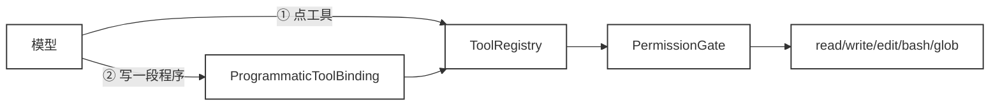
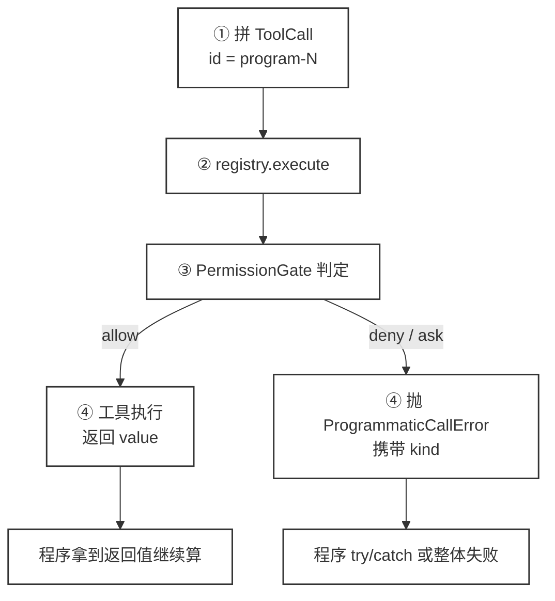
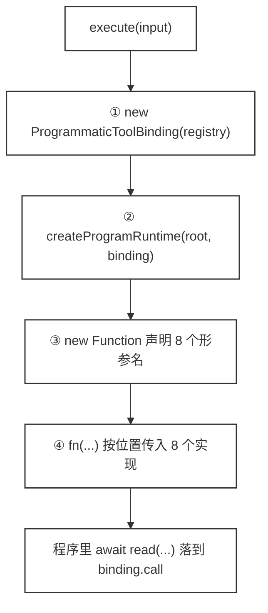

# 44 · 复用现有 Tool Registry

> <span class="stage-badge">Stage Hello Programmatic Agent</span> · <span class="tag-badge">v44-programmatic-binding</span>

第四十三章给模型开了一条新路：写一段程序，`code` 工具一次执行，`print` 结论回上下文。路是通的，但路上跑的车是自己攒的——程序里的 `glob` 和 `read` 是 `code.ts` 里手写的旁路实现，跟我们花了四十多章建起来的那个 `ToolRegistry` 没有半点关系。

这一章把这笔债还掉：**一个工具都不重写，只加一层薄桥。**

> **Code as Action 没有第二套工具，只有一层去往第一套工具的桥。**

## 一、上一版存在什么问题？

ch43 的 `code.ts` 里，`createProgramExec(root)` 给程序注入了手写的 `read`：

```ts
// ch43 的旁路实现（现已被本重构取代）
async read(relPath: string): Promise<string> {
  calls.push(`read(${relPath})`);
  const target = path.resolve(root, relPath);
  if (target !== root && !target.startsWith(root + path.sep)) {
    throw new PermissionError(`程序 read 越界，拒绝：${relPath}`);
  }
  return readFileSync(target, "utf-8");
}
```

把这段和 ch23 建起来的 `read` 工具并排看，问题立刻显形：

- **同一个动作有两套实现**。一个是手写 `readFileSync` 加手写路径前缀检查，一个是注册表里的 `createReadTool`（workspace 边界校验 + 8000 字符截断）。行为还可能不一致；
- **`glob` 的 pattern 解析只有「够用」级别**。`parseGlobPattern` 只认前缀目录和后缀集合，`packages/*/src/*.ts` 中间层的 `*` 会被当成普通字符；
- **权限只有 `read` 越界这一道**。程序里的能力没有走 ch37 的权限门：`code` 整体是 `ask`，但程序内部的 `bash` 命令、`require("fs")` 都不在自己的判定里；
- **`require` 是一扇没关的门**。注入的是完整 Node require，程序里 `require("fs")` 可以直接把 workspace 外的文件读进来。

问题因此可以换个说法：**能力存在两个世界。** 工具清单里的能力是「公民」，程序里注入的能力是「野能力」，能跑，但不受治理。

## 二、本篇解决什么问题？

这一章做三件事，核心只有一个。

一般来讲，想让两套能力合并，最省事的做法是重写一遍。这里没这么干。

一是新增 `ProgrammaticToolBinding`，程序里的能力调用不再直接动手，而是变成 `ToolRegistry.execute({ name, arguments })`；二是 `glob` 升格为第 9 个注册工具（`createGlobTool`），把 ch43 手写的 glob 从 `code.ts` 里迁走；三是程序里的能力与直接点工具从此共享同一条治理线。



两个入口在 `ToolRegistry` 这里汇成同一条路。往下走什么门、走多远，两条路完全一致——这就是 ch44 的全部架构。

治理线上具体复用的是这几样：权限门（ch37）、workspace 边界（ch23）、read 的 8000 字符截断、bash 的 10 秒超时、结构化错误（ch16）。

## 三、先看最终效果

运行这一章的 demo（命令在第七节），会看到程序里的能力调用完整轨迹：

```bash
=== 44 · ProgrammaticToolBinding：程序里的能力全部复用 ToolRegistry ===

[模型] 输出一段组合程序（不逐个点工具）：
const files = await glob("src/**/*.ts");
const matches = [];
for (const file of files) {
  const text = await read(file);
  if (text.includes("AgentRuntime")) matches.push(file);
}
print("包含 AgentRuntime 的文件：" + matches.join("、"));

>> 组合任务程序
   [能力] glob({ pattern: "src/**/*.ts" })
   [能力] read({ path: "src/AgentRunner.ts" })
   [能力] read({ path: "src/big.ts" })
   [能力] read({ path: "src/ToolRegistry.ts" })
   [能力] read({ path: "src/utils.ts" })
   [结果] 包含 AgentRuntime 的文件：src/AgentRunner.ts、src/ToolRegistry.ts
      [判定·glob] glob → allow（glob 是只读工具，无副作用）
      [判定·read] read → allow（read 是只读工具，无副作用）
      [判定·write] write → ask（该操作有副作用，需要用户确认）

>> 程序内 read 与直接点 read 等价（含 8000 字符截断）
   [能力] read({ path: "src/utils.ts" })
   [能力] read({ path: "src/big.ts" })
   [结果] big.ts 截断标记（程序内）：存在
   直接点 read：big.ts 截断标记 = 存在
   [判定] 程序内 read 与直接点 read：内容一致 ✓ / 截断行为一致 ✓

>> 程序内 write 落盘 + bash 验证（ask 放行）
   [能力] glob({ pattern: "src/**/*.ts" })
   [能力] write({ path: "docs/report.md", content: "# 组合报告\n候选文件：\nsrc/AgentRu… })
   [能力] bash({ command: "node -e \"console.log('bash ok')\"" })
   [结果] 已写入 docs/report.md（75 字符，新建文件）
   [结果] bash stdout：bash ok
   落盘核对（fs 直读）：6 行，首行 = # 组合报告
   [判定] 本轮经历 ask 放行 2 次（write 1 次 + bash 1 次，外层的 code 未计入）

>> 程序里执行危险命令（不捕获：整体返回 kind=permission）
   结果 → 失败：bash 命令包含危险操作（rm -rf 等），禁止执行：rm -rf .（kind=permission）

>> 程序里执行危险命令（程序捕获：结构化错误可接住）
   [能力] bash({ command: "rm -rf ." })
   [结果] 程序已捕获：bash 命令包含危险操作（rm -rf 等），禁止执行：rm -rf .

=== ch43 vs ch44：同一个组合任务 ===
              ch43 · 临时注入实现    ch44 · 复用 ToolRegistry
read 的实现      手写 fs.readFileSync      注册表里的 createReadTool
glob 的实现      手写 walk                 注册表里的 createGlobTool
权限            只挡 read 越界            全部能力走 PermissionGate
workspace 边界   手写路径前缀检查          read/write/edit/bash 自带的边界
截断 / 超时       无                        read 8000 截断 / bash 10s 超时
```

四个看点，对应四件这次终于成立的事：

- **能力轨迹长成了 ToolCall 的样子**。ch43 打印的是 `read(src/x.ts)`，现在打印 `read({ path: "src/x.ts" })`——因为桥真的构造了一个带参数名和参数值的 `ToolCall`；
- **权限判定逐项算出来**。`glob` / `read` 直接放行（只读白名单），`write` 判定为 `ask`，不再靠手写的一行路径检查硬凑；
- **行为完全一致**。程序内 read 和直接点 read，内容一字不差，`big.ts` 的 8000 字符截断标记在两条路上都出现；
- **拒绝是结构化的**。危险命令 `rm -rf .` 被权限门 `deny`：程序不捕获，整个 `code` 调用以 `kind=permission` 失败；程序捕获，`error.message` 原样可读、程序还能继续。

## 四、架构变化

这一章的改动集中在 `packages/coding`：加一个文件、一个工具、一层桥，改四处注册。

```text
packages/coding/src/
├── tools/
│   ├── glob.ts                   ← 新增：createGlobTool（第 9 个工具）＋globFiles/parseGlobPattern
│   ├── code.ts                   ← 重构：createProgramRuntime 改为绑定能力；
│   │                                createCodeActionTool(workspace, registry)
│   ├── read.ts / write.ts / edit.ts / bash.ts   ← 一个字节没改
├── programmatic/
│   └── binding.ts                ← 新增：ProgrammaticToolBinding（桥）
├── permission/
│   └── policies.ts               ← glob 加入只读白名单（第 41 行）
└── extensions/
    └── hello-coding.ts           ← 版本 0.9.0 → 0.10.0；code 传入 registry；注册 glob
```

`read` / `write` / `edit` / `bash` 的源码一行没动。

它们并不知道「程序」的存在，也不该知道。多出来的只是程序一侧的桥。

### 两个注册点

`hello-coding` 扩展里，`code` 工具从「只拿 workspace」变成「workspace + registry」，`glob` 注册为第 9 个工具（`hello-coding.ts:29-30`）：

```ts
ctx.tools.register(createCodeActionTool(workspace, ctx.tools));  // code 仍是第 8 个工具
ctx.tools.register(createGlobTool(workspace));                    // glob 第 9 个
```

注册顺序刻意放在后面：ch43 里「code 是第 8 个工具」的说法在 `hello --tools` 里仍然成立，`glob` 是新增的第 9 个。

权限白名单同步补一行（`policies.ts:41`）：`glob` 只读不改世界，进 `READONLY_TOOLS`，所以 demo 里判定为 `allow`。

这一行看着是小事，漏了就很烦。不进白名单的话，程序里每调一次 `glob` 都会触发一次 `ask`，一个「遍历加过滤」的组合任务能在确认框上卡住用户。

### 迁移留了一个兼容出口

`parseGlobPattern` 和 `globFiles` 从 `code.ts` 搬到了 `glob.ts`，但 `code.ts:8` 留了一行重导出：

```ts
export { parseGlobPattern, globFiles } from "./glob";
```

目的是让 ch43 时期写过 `import { parseGlobPattern } from "@hello-harness/coding"` 的代码不用改。教学项目里这种兼容出口值得说明一句——**它让人看清「实现搬走了，契约留下了」**，但也意味着 `code.ts` 现在有两个导出来源，读代码时容易看晕。

## 五、核心抽象

### 桥的契约

```ts
// packages/coding/src/programmatic/binding.ts:36
export class ProgrammaticToolBinding {
  readonly calls: string[] = [];   // 能力调用轨迹，供观测与回显
  private sequence = 0;

  constructor(private readonly registry: ToolRegistry) {}

  async call<T = unknown>(name: string, arguments_: unknown): Promise<T> {
    this.sequence += 1;
    const call: ToolCall = { id: `program-${this.sequence}`, name, arguments: arguments_ };
    this.calls.push(`${name}(${brief(arguments_)})`);

    const result = await this.registry.execute(call);
    if (result.ok) return result.value as T;
    throw new ProgrammaticCallError(name, result.kind, result.error);
  }
}
```

这个类小得几乎没有存在感，这正是它的设计目标。

它**没有** import 任何工具实现，只依赖 `ToolRegistry`。程序能力的定义被整个推给了注册表。

一次 `call` 内部的四步：




`id` 上的 `program-` 前缀用来区分「模型点的」和「程序里发的」。

这个前缀现在只出现在轨迹里，暂时没人消费它。但等 ch45 要把程序内能力接进事件系统时，`ToolCall` 已经自带了可区分的身份，不用再改结构。

`registry.execute` 这一步是整套机制的关键：权限门、工具查找、执行、错误兜底（ch16 的 `toHarnessError`）全发生在它内部，桥自己一概不管。最后一步把结果翻译成程序期望的样子，成功返回 `value`，失败抛 `ProgrammaticCallError`。

### 桥是怎么接进程序作用域的

`code.ts` 自己不认识任何工具，它只做三件事：把 `registry` 收进来、造一层能力转发对象、用 `new Function` 把这张表绑进程序作用域。




代码比图还短，核心就三步（`code.ts:90`）：

```ts
const binding = new ProgrammaticToolBinding(registry);
const rt = createProgramRuntime(workspace.root, binding);

// 1. 把字符串变成函数（编译 + 类型标注）
// 形参名 = 程序里能写的能力名；fn(...) 的实参必须按同一顺序传
fn = new Function("glob", "read", "write", "edit", "bash", "print", "require", "cwd", body) as (
  ...args: unknown[]
) => Promise<unknown>;

// 2. 执行函数并开启“生死时速”（竞跑 + 超时）: 正常代码执行快就先返回执行结果、如果是超时，则执行超时流程
await Promise.race(
  [fn(rt.glob, rt.read, rt.write, rt.edit, rt.bash, rt.print, rt.require, rt.cwd), timeoutPromise],
);
```

用到的是三种很朴素的机制，合起来刚好够用。

**构造器注入。** `createCodeActionTool(workspace, registry)` 的第二个参数是调用方传进来的注册表。

工具工厂不知道注册表里有哪些工具，也不该知道。加一个工具不需要改 `code.ts`，这正是上一节那个杠杆成立的前提。

**转发而非实现。** `createProgramRuntime` 返回的对象里，五个能力每个都是一行 `binding.call`，没有任何逻辑。

root 参数现在只服务于 `cwd()` 和 `require` 这两个非工具能力，工具能力已经不需要它了。路径约束交还给了工具自身。

**位置绑定。** `new Function` 的形参名和 `fn(...)` 的实参靠**位置**对应，不靠名字。

这一条是个真实的脆弱点。把 `fn(rt.glob, rt.read, ...)` 手滑写成 `fn(rt.read, rt.glob, ...)`，程序里的 `glob` 会静默地拿到 `read` 的实现——不报错，不告警，只是结果错得离谱。

类型系统也抓不到这类错误，`new Function` 返回的是 `Function`，形参名只是字符串。要防只能靠约定：把形参名列表和实参列表写在一起，别分成两处维护。

### 每次调用都是全新的一套房

`binding` 和 `rt` 都在 `execute` 内部创建（`code.ts:91-92`），不在工具工厂的闭包里。这带来两个后果。

- 一是**轨迹和 printed 每次重置**。第二次调 `code` 时，`binding.calls` 是空的，`binding.sequence` 从 0 开始，`ToolCall` 的 `id` 又从 `program-1` 编起。

  同一次运行里调两次 `code`，事件流里会出现两个 `program-1`。现在没人按 id 索引，所以相安无事；等 ch45 把程序内能力接进事件系统，这个编号就得改成带运行实例的前缀。

- 二是**程序变量不保留的根源就在这里**。ch43 说的是模型程序里的 `matches` 下一轮消失。

  往下一层看，连承载轨迹的 `binding` 都是一次性的，执行面本身就没有跨调用的状态。ch50 要解决的持久工作状态，得从这一层往上建。

返回值的分工也顺着这个结构：

```ts
return { ok: true, value: { printed: rt.printed, calls: binding.calls } };
```

`printed` 来自 runtime，`calls` 来自 binding。

工具调用轨迹归桥管，程序输出归执行面管。看这一行就能分清哪些是工具能力、哪些是执行面设施。

### 为什么失败要抛异常，而不是返回失败对象

这是程序面与工具面语义的自然分界。

Tool Calling 面，失败就是一段 `ToolResult` 文本回填上下文，模型再决定怎么办。失败不是异常，是对话内容。

程序面不一样。程序是命令式的，`await read(...)` 后面通常还要继续计算，失败必须是流程的一部分。

抛异常，程序才能用 `try/catch` 接住继续走；不接，整个程序失败，`code` 工具原样把 `kind=permission` 送回模型。两种用法都合法，demo 最后两段把两种都演了一遍。

> 记住这条分界：**工具面把失败当内容，程序面把失败当控制流。** 这也是为什么同一个 `kind` 在两处长得不一样。

### 能力注入面瘦身

ch43 注入了五个能力，现在 `createProgramRuntime`（`code.ts:33`）里文件与命令类能力全部变成一行 `binding.call`：

```ts
read(relPath: string): Promise<string> {
  return binding.call("read", { path: relPath });
}
bash(command: string): Promise<unknown> {
  return binding.call("bash", { command });
}
```

留在注入面的只有三个「非工具」能力：`print`（结果收集）、`require`（模块加载）、`cwd`（workspace 根）。它们没有对应的工具语义，属于执行面基础设施，暂时还由 `new Function` 直接注入。

### 能力生长从此等于「注册工具」

> 这是这一章最值得记住的一点：**模型程序能调什么，不再是 `code.ts` 里手写几个函数决定的，而是注册表里有什么决定的。**

往 `hello-coding` 里 `register` 一个新工具，模型程序第二天就能 `await` 它。能力库的扩充从「改执行面代码」变成了「加一个工具」，和给工具清单加一个工具是完全同一件事。

反过来看，这也意味着收权变得同样容易。

不想让程序碰某个能力，从注册表里摘掉就行，不用去 `code.ts` 里翻注入函数。ch43 那种「想限制得改执行面代码」的局面，到这里就结束了。

Stage 4 学到的「Capability 优于 Tool 膨胀」，到这里成了一条自动生效的规则。

## 六、实现代码

### glob 升格为正式工具

`packages/coding/src/tools/glob.ts` 现在持有完整的 pattern 解析与遍历逻辑。下面给出核心的 `globFiles`，按「前缀目录 + 后缀集合」递归收集文件：

```ts
export const SKIPPED_DIRS = new Set(["node_modules", ".git", ".sessions", ".harness", "dist"]);

export function globFiles(root: string, pattern: string): string[] {
  const { rootDir, exts } = parseGlobPattern(pattern);
  const files: string[] = [];
  function walk(dir: string) {
    for (const entry of readdirSync(dir)) {
      if (SKIPPED_DIRS.has(entry)) continue;
      const full = path.join(dir, entry);
      if (statSync(full).isDirectory()) walk(full);
      else if (exts.size === 0 || exts.has(path.extname(entry).replace(/^\./, ""))) {
        files.push(path.relative(root, full).split(path.sep).join("/"));
      }
    }
  }
  walk(path.join(root, rootDir));
  return files;
}
```

`createGlobTool`（`glob.ts:49`）与其它工具一样是标准 `Tool`：`pattern` 参数、`globFiles` 实现、失败返回 `{ ok: false, kind: "tool" }`，整个工具 30 行。

这版 glob 比 ch43 的旁路版多的不是功能，是**身份**：它是 `ToolRegistry` 里登记在册的工具，程序调 `glob(pattern)` 与模型直接点 `glob` 是同一实现，可以单独注册、单独测试、单独进白名单。

### 注入面从五个变八个

ch43 注入五个能力，ch44 注入八个。新增的三个（`write` / `edit` / `bash`）全是去往注册表的桥。

**程序面第一次拿到了写能力和命令能力，而且是受过治理的。** ch43 的程序只能读，现在能改文件、能跑命令，治理强度一点没降——因为它调用的还是那几个老工具。

失败路径其实分三种，不是两种：

```ts
// packages/coding/src/tools/code.ts:124（节选）
if (error instanceof ProgrammaticCallError) {
  if (error.kind === "permission") {
    return { ok: false, error: error.message, kind: "permission", retryable: false };
  }
  return { ok: false, error: error.message, kind: "tool", retryable: false };
}
return { ok: false, error: `程序执行失败：${messageOf(error)}｜程序开头：${excerpt(program)}`, kind: "tool", retryable: false };
```

前两种来自桥，错误消息原样传递；第三种是程序自身的运行时错误（比如模型写了 `null.foo`），会额外附上 `excerpt` 帮模型定位。

`permission` 与 `tool` 的分界和 ch37 / ch16 的定义保持一致：越界和危险操作是「不许做」，参数错误和实现错误是「做错了」。模型读到 `kind=permission` 时，重试方向应该是换个请求去问用户，而不是换个语法再跑一遍。

### coding层适配

在第五节我们其实已经拆解了 `@packages/coding/src/tools/code.ts` 的关键实现点，接下来我们从对比角度看看具体的改动点

1. 注入的能力改造


2. 编译执行层


## 七、运行 Demo

```bash
pnpm typecheck            # 全仓类型检查，应全绿

# 1) 对照 demo（不需要 API Key）
node --import tsx examples/stage-5/44-programmatic-binding/demo.mts
```

输出即第三节的完整轨迹。五段依次是：组合任务程序、程序内 read 与直接点 read 的等价性（含截断）、write 落盘加 bash 验证（ask 放行）、危险命令被拒的两种形态。

真实模型跑出来的形态是固定的：**一段程序 → 程序内多次能力调用（全部走权限门）→ `print` 结论 → 模型收尾。**

```bash
# 2) 真实模型（需要 OPENAI_API_KEY；--auto-approve 放行权限确认）
pnpm hello --auto-approve --tools "找出 packages/coding 下所有包含 ProgrammaticToolBinding 的 TypeScript 文件，并用一段程序跑完，将结果保存到 res_out.txt 文档中"
```

当我们直接跑一轮对话之后，大概率可以看到输出结果如下


```ts
const paths = await glob('packages/coding/**/*.ts') || [];
const results = [];
for (const path of paths) {
    const content = await read(path);
    if (content.includes('ProgrammaticToolBinding')) {
        results.push(path);
    }
}
await write('res_out.txt', results.join('\n'));
print('res_out.txt');
```

验证点：

| 验证点 | 结果 |
| --- | --- |
| `glob` 是否真实注册 | `hello --tools` 里能看到 `glob`，第 9 个；`code` 还是第 8 个 |
| 能力是否走注册表 | 程序内 `read({ path: ... })` 与直接点 `read` 产生完全相同的内容 |
| 权限门是否生效 | `glob/read` allow、`write` ask、`rm -rf` deny，判定逐项可查 |
| 行为是否一致 | `big.ts` 的 8000 字符截断在两条路上都出现 |
| 拒绝是否结构化 | 不捕获 → 整体 `kind=permission`；捕获 → 可读错误 `error.message` |
| 落盘是否真实 | 程序内 `write` 后，demo 用 `fs` 直读核对文件确实存在 |
| 工具是否零重写 | `read/write/edit/bash` 源码未改动 |

## 八、新架构解决了什么？

1. **一套工具，两个入口，零重写**：`read/write/edit/bash` 一个字节没改，程序里和工具清单里是同一份实现，ch43 的两套治理合并回一套；
2. **治理线完整贯通**：权限门在每次能力调用后生效，只读放行、副作用 ask、危险 deny，demo 里三种判定一次看全；workspace 边界回归工具自身，不再是手写字符串前缀检查；
3. **能力行为一致**：截断、超时、错误 kind，程序内与直接点完全同构。ch45 要证明「Permission / Event / Error 仍然有效」，前提就是这一章的「同一套工具」；
4. **能力生长变成注册工具**：程序能调什么等于注册表里有什么。往后给模型加能力不是改执行面，而是注册一个工具，Stage 4 的扩展机制第一次直接影响程序面；
5. **程序面拿到了写能力**：`write` / `edit` / `bash` 进了程序，而且一进来就带着权限门。ch43 的程序只能读，现在能改能跑，治理强度没降。

## 九、它又引入了什么问题？

桥立起来了，桥下面又背负了几笔新债：

1. **拒绝发生在能力调用级，程序内部的控制流没人逐行审查**。权限门能挡住「程序调 `bash("rm -rf")`」，挡不住「程序先算完 N 步再调」。程序是黑盒，治理是灰盒——**这是 ch45 的主题；**
2. **`require` 依然是一扇没关的门**。程序里 `require("fs")` 仍能绕过 workspace 边界的语义（`read` 工具本身有边界，但 `require` 没有），`require` 能加载什么、该不该被审计，还没有逐项治理。ch45–46 要把「程序到底能用哪些能力、每种能力什么权限」定成一张清单；
3. **程序内的能力调用不产生 Runtime 事件**。ch15 的 `tool:start` / `tool:end` 由 `AgentRuntime` 在「模型点的工具」周围发出；`code` 作为一个工具外围事件有，但内部的 `glob/read` 没有事件。可观察性靠 `binding.calls` 轨迹撑着，还没进事件系统；
4. **单次能力粒度仍等同 ToolCall**。程序里一次 `read` 还是读一个文件，`bash` 还是跑一条命令。桥已经复用工具，但「把多次已知能力组合成一个可复用单元」还没归属——这是 ch46「Executable Skill」要补的位置。

还有两处是读源码才会发现的，顺手记下。

**一次 `code` 调用可能弹多次确认。** `code` 本身是 `ask`，内部的 `write`、`bash` 又各是一次 `ask`。

demo 第三段那句「ask 放行 2 次」指的就是内部两次，`code` 外层那次还没算进去。真实交互模式下，一段程序能让用户连按三次确认。

这是能力变强之后必然带出来的体验代价。

**`ProgrammaticCallError` 的 `name` 字段目前读不到工具名。** `binding.ts:7` 把工具名声明成了参数属性 `readonly name: string`，但 `binding.ts:12` 紧接着把 `this.name` 改成了 `"ProgrammaticCallError"`。实测结果：

```bash
error.name    = "ProgrammaticCallError"
error.message = "危险命令被拒"
error.kind    = "permission"
```

构造时传进去的 `"bash"` 被覆盖掉了。要恢复工具名，得把这个参数改名为 `toolName` 之类，别和 `Error.name` 撞车。

现在这个字段不影响功能，`code.ts` 只按 `kind` 分支。但它让错误消息少了一层上下文，等 ch45 要按工具名做差异化处理时，这个坑会冒出来。

> 桥接不是把线接通就完事了，线两头的信息得一样多。少带一个字段过去，治理时想区分就只能回头改桥。

## 十、下一章

程序里的 `await bash("rm -rf dist")` 现在走的不是程序自己执行 shell，而是经 `ProgrammaticToolBinding` 走进 `bash` 工具，工具再走 `PermissionGate`。ch44 把「程序里的能力」变成了「注册表的正常调用」，Stage 4 攒下的全部治理资产就都站到了程序面前：

> **Permission（ch37）、Hooks（ch32）、Events（ch15）、Workspace（ch23）、Tool 超时、Error Model（ch16）——一个都不会因为「调用方式从点工具变成写程序」而失效。**

45 章逐一演示这件事：`await bash("rm -rf")` 依旧被拒、被拒的 `kind=permission` 依旧结构化地回到模型、工具的超时与截断依旧生效。同时把话挑明——**Programmatic Calling 改变的是调用方式，不是 Harness 的治理体系。**

尽信书则不如，以上内容纯属一家之言，因个人能力有限，难免有疏漏和错误之处，如发现 bug 或者有更好的建议，欢迎批评指正，不吝感激 🙃

欢迎点赞、关注公众号「一灰灰Blog」 我们下章见

---

微信公众号: 一灰灰Blog
