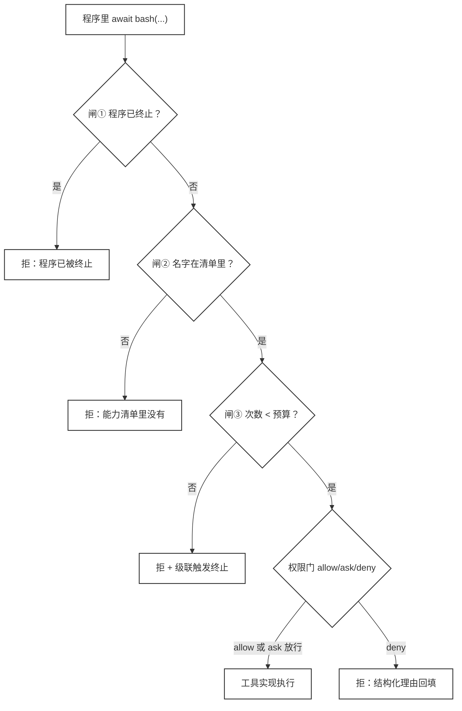
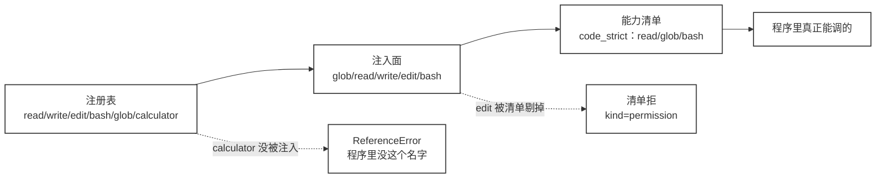
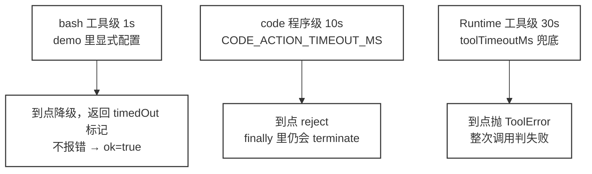

# 45 · Programmatic Governance：把程序关进治理清单

> <span class="stage-badge">Stage Hello Programmatic Agent</span> · <span class="tag-badge">v45-programmatic-governance</span>

第四十四章我们把桥搭起来了，不需要再自己给大模型生成的code注入能力，code中需要使用的 `read/write/edit/bash` 直接与工具共用同一套，之前的工具怎么管理的，大模型生成的代码中对于工具的调用依然沿用同一套管理口径。

桥通了，债也跟着过来了。

- 程序能调哪些能力取决于我们注入了哪几个名字
- `require("fs")` 能绕过 workspace 边界
- 程序内部的能力调用不产生任何 Runtime 事件。

这三笔债都不在「单次能力调用」这一层。权限门这东西守的是「这次调用允不允许」，至于「这个程序一共能调几次」「能碰哪几个名字」「跑完之后还能不能再动手」，它一概不管。

所以这一章我们不打算去把程序内部看明白——**治理的目标从来不是看清程序的控制流，而是把程序能碰的世界、能用几次、结束后还能不能再动手，全部钉死在一张清单里。**

## 一、上一版存在什么问题？

ch44 我们验证过，程序里的能力调用走权限门、错误是结构化的、超时照样生效。验证本身没啥问题，欠的是**治理层**的事。

1. **能力面没有清单**。程序能调用哪些能力，取决于 `code.ts` 注入了哪几个名字，而不是一张可配置的清单。想让某个能力「程序不许用」，得去改注入代码，而不是改配置；
2. **`require` 没有任何门**。注入的是完整的 Node require，`require("fs")` 直接把 workspace 边界语义穿成筛子，想加载什么加载什么；
3. **程序控制流完全失控**。程序爱循环几次循环几次，爱调几次能力调几次，没有任何预算。一次 `while(true)` 能把一整个运行拖到外层超时；
4. **内层能力不可观测**。`binding.calls` 记录了轨迹，但没有 `tool:start / tool:end` 事件、没有 `beforeTool / afterTool` Hook。观测是两条线，外层一套 Runtime 事件，内层一套 `binding.calls`，拆着用；
5. **一个藏着的字段坑**。`ProgrammaticCallError` 的构造参数叫 `name`，被 `this.name = "ProgrammaticCallError"` 覆盖掉，工具名根本读不到。

## 二、本篇解决什么问题？

这一章我们将在「验证」基础上，再**实现**四件事。

1. **能力白名单（capability manifest）**。`code` 工具可配置「程序允许调用的能力名」。清单外的注入能力（比如严格版里的 `edit`）→ 直接拒绝；注册表里有但注入面没给的（`calculator`）→ 程序世界里根本没这个名字；
2. **require 白名单**。`require` 只放行 `path / util / os` 这类安全内建，`fs / child_process / http` 一律拒绝并记录；
3. **调用预算 + 终止开关**。一次程序最多 N 次能力调用，溢出即终止；程序结束或者超时之后，残余的异步调用一律失效（kill-switch）；
4. **内层调用接入 Runtime 事件与 Hook**。程序里的 `read/bash/glob` 发出 `tool:start / tool:end`，`beforeTool / afterTool` 同步触发，观测统一成一条线。

外加 ch44 记下的那个字段坑，顺手修掉，构造参数改名为 `toolName`。

## 三、先看最终效果

接下来先看效果。运行这一章的 demo（命令在第七节），会看到一次完整运行。程序内每次能力调用都带事件、都过闸，被拒的都进了 `[桥闸拒绝]`。

```text
[tool:start] code_strict({"code":"let editDenied = \"\", calcRefused = \"\", fsDenied…")
   · 事件流[tool:start] glob(...)（程序内调用，runId 同一）
[ext:trace-hook] beforeTool  即将执行 glob({"pattern":"src/**/*.ts"})
[ext:trace-hook] afterTool   执行完成 · glob → ok=true · 2ms
   · 事件流[tool:end ] glob → ok=true · 2ms
   …（预算 6 次，放行 6 次，事件与 Hook 成对出现）…
   [结果] edit 已注入但不在清单（清单拒）：程序能力清单里没有 edit（允许：read / glob / bash；config 里可配 programCapabilities）
   [结果] calculator 已注册但未注入（程序世界里不存在）：calculator is not defined
   [结果] require fs（白名单拒）：程序 require 超出白名单：fs（允许：path / util / os；config 里可配 programRequireAllowlist）
   [结果] require path（放行）：b.ts
   [结果] 预算 6 次（溢出，拒）：程序能力调用超出预算（6 次上限），被强制终止
   [结果] 预算触顶后再次调用（已终止，拒）：程序已被终止（超出能力调用预算），不再允许发起能力调用
   [桥闸拒绝]
      - edit(...) ｜ 超能力白名单
      - require("fs")
      - glob(...) ｜ 超预算
      - glob(...) ｜ 程序已被终止（超出能力调用预算），不再允许发起能力调用
```

四个看点，正好对上第二节那四件事。

- **`edit` 被清单挡下**。`edit` 是注入能力，但 `code_strict` 的清单里没有它，于是清单拒；`calculator` 注册了却没注入，程序里是 `ReferenceError`。能力面第一次有了「配置即收权」；
- **`require` 的门关上了**。`require("fs")` 被白名单拒，理由里带出允许名单；`require("path")` 照常放行；
- **预算让控制流有界**。第 7 次调用溢出后程序被终止，之后再调任何能力都拿「已终止」；
- **内层调用进事件流了**。`glob` 的 `tool:start/tool:end` 与 `trace-hook` 的 `beforeTool/afterTool` 在程序内部同样出声。

## 四、架构变化

一般来讲，加一层治理改一处就够。但是这一章我们动了 `core` 与 `coding` 两层，各加一块、改一处。

文件层面的变化，用目录树看更直观（↔ 标记文件是否在本章被改动）。

```text
packages/
├── core/src/
│   ├── runtime/
│   │   ├── scope.ts              ← 新增：RuntimeScope（events + hooks + runId RuntimeScope）
│   │   └── runtime.ts            ← 重构：工具事件与 Hook 委托 registry.execute；
│   │                               执行前 set / 执行后 clear RuntimeScope
│   ├── tool/
│   │   └── registry.ts           ← 重构：execute 升级为「事件·Hook·执行」三合一出口；
│   │                               runTool 拆出（查表→权限门→执行）
│   └── index.ts                  ← 导出：RuntimeScope / set·getActiveRuntimeScope
├── coding/src/
│   ├── programmatic/
│   │   └── binding.ts            ← 重构：三道治理闸（终止→清单→预算）+ require 白名单 + kill-switch
│   └── tools/
│       ├── code.ts               ← 重构：CodeActionOptions（programCapabilities /
│       │                           requireAllowlist / maxProgramCapabilityCalls）；finally 触发 terminate
│       └── glob.ts / read.ts / write.ts / edit.ts / bash.ts   ← 一个字节没改（ch44 已定稿）
├── cli/src/
│   └── main.ts                   ← 微调：system prompt 写明 require 白名单（path / util / os）
└── prompts/
    └── coding.md                 ← 微调：require 白名单措辞（fs / child_process 拒，不要绕过）
```

> 这张树里 `core` 与 `coding` 两层是「架构变化」（各加一块、改一处），`cli/src/main.ts` 与 `prompts/coding.md` 只是提示词措辞微调，对应第五节「治理还得写进 prompt」。

这几处改动里，最要紧的是下面这个。

> **`ToolRegistry.execute` 从「只执行」升级成了「事件 · Hook · 执行」的三合一出口。** Runtime 不再自己发 `tool:start/tool:end`，而是把作用域递给 `execute`。

这么改之后，内层调用直接复用了**同一个** events 和 hooks，不用再单开一条线。站在观众（CLI / TUI / Hook）的角度看，外层 `code` 的事件和内层 `read/bash` 的事件长得一模一样，也压根不需要区分谁是谁。

### 三道治理闸

`binding.call` 在每次能力调用之前按顺序过三道闸，过了闸还有最后一层，是 `ToolRegistry` 自带的**权限门**（ch37）。




闸①②③拦的是「程序自己管不住的东西」，也就是终止状态、能力面、调用次数。权限门拦的是「这次操作的副作用」。两套东西叠加着来，谁也替不了谁。

这里有个地方容易看漏。闸③ 拒绝的同时会去调用终止开关，于是后面所有调用都改走闸①了，第三节输出里「超预算」和「程序已被终止」是两条措辞完全不同的消息，源头就在这儿。

## 五、核心抽象

### 「清单 = 注入面 ∩ 注册表」，两个世界要分清

程序里到底能调什么，得看三个集合的共同作用。

| 集合 | 含义 | 谁定的 |
| --- | --- | --- |
| 注入面 | 传给程序的局部名字，固定 8 个 | 工具实现里的形参列表 |
| 能力清单 | 程序允许调用的能力名 | 配置项的 `programCapabilities` |
| 注册表 | Harness 真正持有的工具 | 宿主注册 |

三者的关系画出来是这样。




注入面是**固定**的，程序跑起来能拿到的局部名字就那 8 个，白名单不会去增删它们。

```ts
// packages/coding/src/tools/code.ts:115
fn = new Function("glob", "read", "write", "edit", "bash", "print", "require", "cwd", body) as (...)
```

所以同样是「拿不到能力」，成因完全不一样：

- 清单外但已经注入的 `edit`，抛的是治理层的拒绝；
- 注册表里有但没注入的 `calculator`，程序里压根没这个名字，那个 `ReferenceError` 是 JavaScript 引擎给的

两条路子的报错来源都不是一回事，混在一起看就容易把排查方向带偏。

另外三个注入名字其实不归这张清单管。`print` 和 `cwd` 是同步的局部函数，压根不过 binding；`require` 走的是自己的白名单门，也不加计数器。

清单管的是「有副作用、要走权限门」的那五个能力，剩下的不占治理预算。

这么划也有麻烦，维护分成了两处：

- 要回答「程序能不能用 X」，得同时看代码里的注入面和注册处的清单，两处不同步就会出现「注入了却调不动」的静默失效。
- 往长远看，注入面和清单应该合并到同一个来源，一张 SKILL.md 的 manifest 干的就是这个活——这个留到 ch46 我们再来看。

> 记法是三句话。**清单给「程序的世界」划界，注入给「程序的世界」造物，注册表给「Harness 的世界」存货。** 收权改清单，加能力注册工具。


### require 白名单：名字进清单才算数

`require` 是注入面里唯一能直接打开文件系统大门的缝隙。为什么要搞个白名单？因为不搞的话，它太灵活、也太容易失控，针对 ch43 留下的问题是「程序可以 `require` 任何东西」，我们在这一章把它收成了一张白名单。

```ts
assertRequireAllowed(id: string): string {
  const normalized = id.replace(/^node:/, "");
  if (this.requireAllowlist.has(normalized)) return normalized;
  const message = `程序 require 超出白名单：${id}（允许：${[...this.requireAllowlist].join(" / ")}；config 里可配 programRequireAllowlist）`;
  this.denied.push(`require(${JSON.stringify(id)})`);
  throw new ProgrammaticCallError("require", "permission", message);
}
```

归一化只剥 `node:` 这个前缀，所以 `require("node:fs")` 和 `require("fs")` 一样被拒，前缀剥不掉 `fs` 本身。

程序里那个 `require` 就是在调完 `binding.assertRequireAllowed(id)` 之后才去加载模块的，位置在 `code.ts:66-69`。

一般来讲，程序想读个文件，简简单单 `require("fs")` 一行的事。但是我们这里偏偏不让，得走 `read` 能力，它带 workspace 边界检查和 8000 字符截断，比裸 `fs` 安全。能开门的模块收进白名单，能读文件的路径交给带边界的能力，这就是这一章对 ch43 那个「`require` 野能力」的治理思路。

这道门还有两个特性，单独记一笔。

- **`require` 不消耗预算**。它走的是 `assertRequireAllowed` 而不是 `call`，不加计数器；
- **`require` 的拒绝不进事件流**。被拒的 `require("fs")` 只出现在 `denied[]` 里，没有 `tool:start/tool:end`，`beforeTool/afterTool` 也不会触发。观测统一了，但这一处还是个缺口。

治理这事还得写进 prompt 里。命令行入口的 system prompt 同步改了措辞，明确写着「`require(id)`（仅白名单内建模块 path / util / os）」和「fs / child_process 等一律被拒绝，不要尝试绕过」。光在运行时拦、不在提示词里说清楚，模型会反复去试探同一个被拒的模块，白白消耗轮次。

### 预算与终止开关：把黑盒变成有界

「程序是黑盒，控制流不可逐行审查」，ch44 里我们说这是灰盒。ch45 不打算去看清程序内部，换了个思路，**把黑盒的出口全部钉上预算与锁**。

- **预算**。一次程序最多 `maxCalls` 次能力调用（默认 100）。计数器在每次放行前递增，越底线即终止；
- **终止开关（kill-switch）**。预算溢出、程序正常结束、或者外层超时，一旦 `terminate()`，之后再发起任何能力调用一律抛「程序已被终止」。

还有粒度的问题。`code` 工具每次执行都会新建一个 binding，所以计数、终止状态、拒绝记录都是「一次程序调用」这个级别，不跨程序累积。一轮运行里模型连写三段程序，每段各自有一份预算，想按整轮收口就得在外层另加一个计数器。

这两个机制加在一起，就让「程序先算完 N 步再调」变成有代价的事了。N 可以被预算截断，终止之后连剩下的步都进不了能力闸。

> 有一条必须诚实，**真同步死循环 `while(true){}` 拦不住。** 预算、终止、超时全都依赖事件循环能被让出来，`while(true){}` 会把一切定时器饿死。真正的取消得靠隔离执行（worker / 子进程），那是后面阶段的题。能把爆炸半径收到能力闸以内，已经是现阶段能做到的边界了。

### 三层超时：工具级超时是降级，不是失败

第 1 段程序里有条输出挺反直觉，单独拎出来说。

```text
   [结果] 长任务（bash 工具超时 1s → timedOut）: true
   · 事件流[tool:end ] bash → ok=true · 6304ms
```

程序拿到的是 `timedOut: true`，事件里的 `ok` 却是 `true`。这俩不矛盾，因为它们说的压根不是同一件事。这一章的运行里同时存在三层超时。




三层各管一段，从内到外依次放宽。要紧的是，**工具级超时是「降级」而不是「失败」**，`bash` 到 1 秒的时候没有抛错，而是返回了一个带 `timedOut` 标记的结果，所以 `tool:end` 的 `ok` 依然是 `true`，外层程序拿到这个标记可以自己决定怎么办。

治理层的超时才是真的取消。`code` 的 10 秒到点会直接 reject，而 `finally` 里的终止开关照样执行，把残余的异步调用全挡下来。

还有个嵌套关系。`code` 的 10 秒比 Runtime 的 30 秒短，正常情况下程序先自己超时。要是把 `CODE_ACTION_TIMEOUT_MS` 调到 30 秒以上，Runtime 那层就成了真正的兜底，而这时候 `finally` 里的 `terminate()` 依然会跑，这是这套设计里比较稳的一处。

### 事件统一：内层调用 = 外层同名事件

`binding.call` 放行的时候会去读 `getActiveRuntimeScope()`，把当前跑着的 runtime 的 `events + hooks + runId` 递给 `registry.execute`。这么一来。

- 内层 `read/bash/glob/edit` 发 `tool:start / tool:end`（和直接点工具同一事件名、同一 runId）；
- `beforeTool / afterTool` Hook 同步触发，`trace-hook` 对程序内调用同样打点；
- 观测从「外层一套 + 内层一套」变成「一套，不分来源」。

实测输出印证了这一点。外层 `code` 耗时 6682ms，内部那次慢 `bash` 耗时 6304ms，两对 `tool:start/tool:end` 在时间轴上是完整嵌套的。

```text
[tool:start] code({"code":"const head = (await read(\"src/utils.ts\")).trim().…)
   · 事件流[tool:start] bash(...)（程序内调用，runId 同一）
   · 事件流[tool:end ] bash → ok=true · 6304ms
[ext:trace-hook] afterTool   执行完成 · code → ok=true · 6682ms
[tool:end  ] → ok=true · 6682ms
```

还有一处容易读错。`startedAt` 是取在 `beforeTool` 之后的，所以 Hook 自身的耗时不计入 `durationMs`，事件里看到的那个耗时是纯工具执行时间。想给 Hook 计时，得自己在 Hook 里打点。

代价也得提一句。一段程序里几十次能力调用，会给 CLI 刷出几十行事件，观测统一了，噪音也统一了。加上事件 payload 里没有 `parent` 或 `depth` 字段，现在要区分内外层只能靠 `ToolCall.id` 的前缀 `program-`，想做「折叠成一张程序执行摘要」的展示层，那么最佳的方案是先补这个字段，方便区分。

## 六、实现代码

### core：RuntimeScope

`packages/core/src/runtime/scope.ts`（新增，23 行）。

```ts
export interface RuntimeScope {
  runId: string;
  events: AgentEventEmitter;
  hooks?: HookManager;
}
// 下面由一对 set/get 函数读写模块级变量 activeScope，此处省略实现
```

这里有一条限制必须说清。`RuntimeScope`用的是**模块级变量**，不是 `AsyncLocalStorage`。现在的实现是单线程串行执行工具调用，`set` 和 `await` 之间不会有另一次调用插进来，所以够用。一旦要支持并发的工具调用，模块级变量就会互相影响，那时候需要换成 `AsyncLocalStorage`。

### core：registry.execute 成了三合一出口

`packages/core/src/tool/registry.ts` 把原有逻辑拆成了两块，`runTool`（查表 → 门 → 执行 → 错误兜底）和 `execute`（事件 + Hook + runTool）。

```ts
// packages/core/src/tool/registry.ts:76-90
// 统一执行入口：凡是经过注册表的工具调用，都在这里完成。
// ch45 起，事件（tool:start / tool:end）与 Hook（beforeTool / afterTool）也在这里发出，
// 于是「程序内能力调用」与「直接点工具」共享同一条观测线（scope 由 Runtime 注入）。
async execute(call: ToolCall, scope?: RuntimeScope): Promise<ToolResult> {
  const runId = scope?.runId ?? "";
  const events = scope?.events;
  const hooks = scope?.hooks;

  events?.emit({ type: "tool:start", runId, call });
  await hooks?.run("beforeTool", { call });
  const startedAt = Date.now();
  const result = await this.runTool(call);          // 查表 → 权限门 → 工具实现
  await hooks?.run("afterTool", { call, result });
  events?.emit({ type: "tool:end", runId, call, result, durationMs: Date.now() - startedAt });
  return result;
}
```

`runtime.ts` 里原来那四行 `tool:start / beforeTool / afterTool / tool:end` 删掉了，改成在 `registry.execute(call, scope)` :

```ts
// packages/core/src/runtime/runtime.ts:403-421（节选）
const scope: RuntimeScope = { runId: id, events: this.events, hooks: this.hooks };
let result: ToolResult;
setActiveRuntimeScope(scope);
try {
  result = await withGuard(this.registry.execute(call, scope), this.toolTimeoutMs, this.signal, ...);
} finally {
  setActiveRuntimeScope(undefined);
}
```

### coding：binding 三道闸

下面给出 `packages/coding/src/programmatic/binding.ts` 的核心，也就是 `call` 这个方法，99-133 行。

```ts
async call<T = unknown>(name: string, arguments_: unknown): Promise<T> {
  // 三道治理闸按序挡住三种失控，被拒的一律先记一笔 denied[] 再抛
  if (this.terminated) {
    const why = `程序已被终止（${this.terminationReason}），不再允许发起能力调用`;
    throw new ProgrammaticCallError(name, "permission", why);
  }
  if (!this.capabilities.has(name)) {
    const why = `程序能力清单里没有 ${name}（允许：${[...this.capabilities].join(" / ")}；config 里可配 programCapabilities）`;
    throw new ProgrammaticCallError(name, "permission", why);
  }
  if (this.callCount >= this.maxCalls) {
    const why = `程序能力调用超出预算（${this.maxCalls} 次上限），被强制终止`;
    this.terminate("超出能力调用预算");   // ← 关键：先上锁，再抛错
    throw new ProgrammaticCallError(name, "permission", why);
  }
  this.callCount += 1;                    // 只有放行才计数
  this.sequence += 1;
  const call: ToolCall = { id: `program-${this.sequence}`, name, arguments: arguments_ };
  this.calls.push(`${name}(${brief(arguments_)})`);

  const scope = getActiveRuntimeScope();
  const result = await this.registry.execute(
    call,
    scope ? { runId: scope.runId, events: scope.events, hooks: scope.hooks } : undefined,
  );
  if (result.ok) return result.value as T;
  throw new ProgrammaticCallError(name, result.kind, result.error);
}
```

三个细节决定了这套闸的实际行为。

- **顺序是 终止 → 清单 → 预算**。终止状态放在最前头，因为它最廉价也最绝对，一旦上锁后面两道闸都不用再问了；
- **闸③ 会级联**。`this.terminate(...)` 那一行让「溢出」从一次性的拒绝变成了持久状态，第三节输出里那两条不同措辞的消息就是这么来的；
- **被闸挡下的调用不消耗预算**。计数器在放行之后才自增，所以程序反复去试探一个清单外的能力，不会把预算烧光。

拒绝一律带 `kind: "permission"`，和权限门的拒绝同类型。区别在于理由，清单和预算说的是「不许做」，工具错误说的是「做错了」。

顺带还掉一笔 ch44 记下的旧账。异常类的构造参数原来叫 `name`，会被 `Error.name` 覆盖掉，工具名根本读不到；现在改成了 `toolName`，程序里就能按工具名做差异化处理了。

### coding：code 工具的可配置治理

`packages/coding/src/tools/code.ts` 里的 `CodeActionOptions`（16-21 行），三个选项都是可选的。

```ts
export interface CodeActionOptions {
  programCapabilities?: string[];        // 能力白名单，默认 glob/read/write/edit/bash
  programRequireAllowlist?: string[];    // require 白名单，默认 path/util/os
  maxProgramCapabilityCalls?: number;    // 能力调用预算，默认 100
}
```

三个默认值都定义在 `binding.ts:45-47`，工具那一层只负责把配置传进去。

```ts
// packages/coding/src/programmatic/binding.ts:45-47
export const DEFAULT_PROGRAM_CAPABILITIES = ["glob", "read", "write", "edit", "bash"];
export const DEFAULT_PROGRAM_REQUIRE_ALLOWLIST = ["path", "util", "os"];
export const DEFAULT_PROGRAM_MAX_CALLS = 100;
```

`execute` 里把选项喂给 binding（`code.ts:103-107`），并在收尾时触发终止开关（`code.ts:152-156`）。

```ts
} finally {
  if (timer) clearTimeout(timer);
  // kill-switch：程序无论成功 / 失败 / 超时都已收尾，剩余异步段再调能力一律拒绝
  binding.terminate("程序执行已结束（完成 / 失败 / 超时均生效）");
}
```

> 这就是「治理可配置」的实质，**同一个 `code` 工具实现，换了清单和预算，就是两个不同的治理面。** 改的是配置，不是执行代码。

## 七、运行 Demo

```bash
pnpm typecheck            # 全仓类型检查，应全绿

# 1) 对照 demo（不需要 API Key）
node --import tsx examples/stage-5/45-programmatic-governance/demo.mts
```

输出就是第三节的轨迹。三段程序依次是权限门矩阵（allow / deny / ask / 超时）、治理闸矩阵（清单 / require 白名单 / 预算 / 终止）、不捕获拒绝回填（kind=permission）。整段约 7 秒，其中大部分是那段 6 秒慢命令。Run ID 与毫秒数每次运行不同。

demo 里注册了两个 `code` 工具，演示同一个实现、两份治理配置。

```ts
// examples/stage-5/45-programmatic-governance/demo.mts:36-46
// 宽松版：默认清单 + 预算 8
registry.register(createCodeActionTool(workspace, registry, { maxProgramCapabilityCalls: 8 }));
// 严格版：清单收窄到 read/glob/bash（edit 注入但被剔），预算 6
const strictTool = createCodeActionTool(workspace, registry, {
  programCapabilities: ["read", "glob", "bash"],
  maxProgramCapabilityCalls: 6,
});
registry.register({ ...strictTool, name: "code_strict" });
```

顺带提一句写法上的坑。demo 里第二份配置是用对象展开覆盖 `name` 注册进去的，这绕过了注册表的重名检查。真要在生产里挂多份治理面，应该让工具工厂直接接收名字参数，而不是靠展开覆盖。

真实模型跑起来是另一条命令，需要 `OPENAI_API_KEY`，`--auto-approve` 用来放行权限确认。

```bash
$ pnpm hello --auto-approve --tools "找出 packages/coding 下所有包含 ProgrammaticToolBinding 的 TypeScript 文件，并用一段程序跑完，将结果保存到 res_out.txt 文档中"

# 或者直接进入多轮对话
$ hello --chat
你 > 找出 packages/coding 下所有包含 ProgrammaticToolBinding 的 TypeScript 文件，并用一段程序跑完，将结果保存到 res_out.txt 文档中
```

我们这里实际跑的和ch44的用例一致，重点看看输出的情况


真实模型的形态是固定的，**一段程序 → 内层能力逐次过闸（清单 / require / 预算 / 权限门 / 事件）→ 拒绝结构化回填 → 模型据此重写程序。**

有兴趣自己验证的小伙伴，重点关注下面这几条。

| 验证点 | 结果 |
| --- | --- |
| 能力清单是否生效 | `code_strict` 里 `edit` 被清单拒，错误消息给出允许名单 |
| 注册但未注入是否拿不到 | `calculator` 程序里 `ReferenceError`，两个世界边界清晰 |
| require 白名单 | `require("path")` 放行、`require("fs")` 拒绝并记录 |
| 预算是否截断 | 第 7 次 `glob`（预算 6）被拒并强制终止，终止后再调一律「已终止」 |
| 终止开关 | `terminate()` 后残余异步调用全部抛「程序已被终止」 |
| 内层是否进事件 | 内层 read/bash/glob 发 `tool:start/end`，`beforeTool/afterTool` 同步触发 |
| 拒绝是否结构化 | 桥闸拒绝进 `denied[]`（清单 / fs / 预算 / 终止），权限门拒绝带 kind=permission |
| 是否可配置 | 清单 / require 名单 / 预算全走 `CodeActionOptions`，不碰执行代码 |


## 八、新架构解决了什么？

对一下 ch44 结尾那几笔债，逐条算账。

1. **控制流没人逐行审查 → 「有界的黑盒」**。我们不去偷看程序内部，而是把程序的出口全部钉上清单（能力面）、预算（次数）、终止（状态）。程序能碰的世界就是清单，能用几次就是预算，结束后还能不能再动手看终止。黑盒还在，但它的世界被画了框；
2. **require 无限制 → 白名单门**。`fs/child_process/http` 进不来程序执行面，要读文件走带边界的 `read` 能力。ch43 那个「绕 workspace 边界的缝隙」第一次被结构性堵住；
3. **内层调用无事件 → 事件统一**。`registry.execute` 成了「事件 · Hook · 执行」三合一出口，内层调用和直接点工具共用同一套 `tool:start/end` 与 `beforeTool/afterTool`。观测从两条线合并成一条；
4. **治理从「验」到「配」**。能力名单、require 名单、预算，全部是 `CodeActionOptions` 的配置项。收权、限流不再改 `code.ts`，只改配置——和 ch44「加能力 = 注册工具」对上，**收能力 = 改清单**；
5. **字段坑顺手修掉**。`ProgrammaticCallError.toolName` 恢复读取，为后面按工具名做差异化处理铺平了路。

## 九、它又引入了什么问题？

治理落地了，但是依然还是有些新的问题，接下来按严重程度进行排列：

- **同步死循环依然拦不住**。`while(true){}` 会让事件循环彻底饿死，预算、终止开关、三层超时统统失效。让「程序真的可以被杀死」需要隔离执行（worker 线程 / 子进程 / 独立 isolate），这是 ch43 那笔「超时不能取消程序」的深水区，留给可取消性专题；
- **终止后残留的异步段还能抛出进程级异常**。`Promise.race` 终断程序（code 工具返回）后，程序里残留的 floating promise / 定时器不受任何 Promise 链约束；它们之后抛出的异常是 `unhandledRejection / uncaughtException`，Node 15+ 默认会直接崩溃整个进程，一轮 `--chat` 会话会被残留代码杀死（实测：code 返回后 300ms，孤儿拒绝把进程带崩）。CLI 已在 `packages/cli/src/main.ts` 注册孤儿异常兜底：`[orphan-guard]` 记录并继续，会话不中断。兜底只是止血，真正的解法仍是隔离执行，与上一笔同步死循环同源同债；
- **并发下RuntimeScope会踩踏**。模块级变量撑不住并行的工具调用，换成 `AsyncLocalStorage` 才安全；
- **预算按次数计费，不按代价**。一次 8000 字符的 `read` 和一次 1ms 的 `glob` 占用同样的配额。真正贵的是 token 和时延，不是调用数；
- **拒绝的审计依赖程序配合**。桥闸拒绝会进 `denied[]` 并返回给程序，但程序可以 `try/catch` 吞掉不打印。想保证审计可见，最后得把拒绝摘要强制附在工具结果里，幸运的是 `code` 已经把 `denied` 一并返回了，缺的是「强制」这个策略；
- **内层事件全量刷屏**。一段程序里几十次能力调用会在命令行里刷出几十行。观测内容齐了，观测形式还没聚合；

这几个问题中最硬的是第一笔。其余几个都是配置或者展示层的问题，唯独同步死循环是能力缺口——预算、终止、超时全都建在「事件循环还会让出来」这个前提上，前提一破整套闸就成了摆设。

## 十、下一章

程序现在被三道安全闸围着，能碰的世界写在清单里。但清单是写在 `CodeActionOptions` 里的配置，散在注册处，它还不算一个「有名字」的治理单元。

ch44 结尾其实还留了第四笔债，比清单更根本。**单次能力粒度仍然等同一次工具调用**，「把多次已知能力组合成一个可复用单元」还没有归属。这就是我们下一章 ch46 要实现的内容

> **ch46 把它变成一件有名字、可发现、可复用的工作流——Agent Skill。**

一段「被清单 + 预算 + require 白名单治理过的程序」，加上一个说明它什么时候用、边界在哪的 `SKILL.md`，就是一个 Skill。

```text
skills/
  dependency-analysis/
    SKILL.md          # 什么时候用、边界是什么（清单：read/glob/bash）
    skill.mjs         # 实现：一段程序（同样过 Binding 的三道闸）
```

有意思的悬念也在这儿。Skill 一旦变成可调用的能力，它要不要进 `programCapabilities` 白名单？ch45 的清单只覆盖了「工具」，还没覆盖「能力的能力」。

---

尽信书则不如，以上内容纯属一家之言，因个人能力有限，难免有疏漏和错误之处，如发现 bug 或者有更好的建议，欢迎批评指正，不吝感激 🙃

看到这里的小伙伴，不妨点个赞，顺手关注下微信公众号「一灰灰Blog」，我们下章见。

微信公众号: 一灰灰Blog
