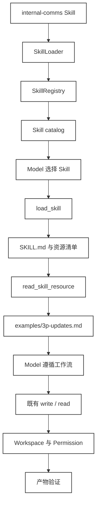
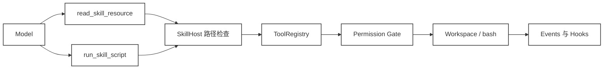

# 46 · Agent Skills 实战：接入真实 Skill，跑通工作流验证

> <span class="stage-badge">Stage Hello Programmatic Agent</span> · <span class="tag-badge">v46-agent-skills</span>

前面几章已经让 Harness 能够发现、加载和注入 `SKILL.md`。如果本章再创建一个本地 `refactor-ts`，然后证明它能被 `load_skill` 读出来，读者得到的只是一次重复演示。

本章换一个问题：把一个别人已经写好的 Skill 放进 Harness，看看它能不能参与真实任务。我们会接入 Anthropic 官方 `skills` 仓库中的 `internal-comms`，让 Agent 根据其中的工作流和示例资料写一份 3P 周报，再检查实际生成的文件。

这里的 Skill 不是一个通过代码执行的函数。它更接近一份带有资源的工作手册：`SKILL.md` 告诉模型什么时候使用、应该怎样判断任务和组织结果，`examples/` 提供需要时再读取的格式材料。这个定位也符合业界常见用法，OpenAI 的 Skills 文档和 Anthropic 的公开 Skill 仓库都把 Skill 作为可发现、可加载、由模型遵循的工作流说明。

- [OpenAI Skills 文档](https://learn.chatgpt.com/docs/build-skills) 
- [Anthropic internal-comms Skill](https://github.com/anthropics/skills/tree/main/skills/internal-comms)

## 一、上一版存在什么问题？

Stage 4 的 Skill 基础设施已经完成了三件事：注册 Skill、解析 `SKILL.md`、把可用 Skill 的名称和描述放进模型上下文。`load_skill` 也能按名称返回完整正文以及 `scripts`、`references`、`assets` 等目录信息。

这套能力解决了“模型怎样知道有一个 Skill”的问题，却没有展示“模型知道之后怎样把它用起来”。如果只看返回值，Skill 很容易被误解成另一种 Prompt 模板，或者被误解成一个等待实现的函数。

上一版还有一个实际的接口缺口。加载结果中虽然有 Skill 的目录和文件名，但模型没有一个统一的、受控的方式去读取 `examples/3p-updates.md` 这样的资源。

把绝对目录交给模型，让模型自己拼接文件路径，会带来两个麻烦。第一，资源目录结构被暴露给了模型；第二，目录穿越检查会散落在每一个调用方，很难保证所有 Skill 都使用同一条安全规则。

脚本也存在类似问题。Skill 可以带一个 `scripts/` 目录，但它不应该因此获得一条绕过 `Permission Gate` 的隐藏执行通道。

所以，上一版的限制不是“没有更多 Skill 字段”。真正缺少的是 Skill 和宿主环境之间的边界，以及一条能够被观察和验证的消费过程。

## 二、本篇解决什么问题？

本篇把目标收窄成一个可运行的场景：

> 给定一份项目进展，Agent 选择 `internal-comms`，按需读取 3P 更新规范，使用既有 `write` 生成周报，再用既有 `read` 回读文件，最后由宿主检查三个必要段落。

为此新增一个很小的 `SkillHost`。它不解析 Markdown 中的步骤，也不创建新的 Agent 循环，只负责把已经加载的 Skill 资源映射为受控能力。

本篇具体完成四件事：

- 加载一个真实的业界 Skill，而不是只使用本仓库为测试写的玩具 Skill；
- 通过通用的 `read_skill_resource` 读取 Skill 目录中的相对资源；
- 通过通用的 `run_skill_script` 把 Skill 脚本重新交给已有 `bash` Tool；
- 读取实际产物，用最小验证器判断工作流是否留下了可检查的结果。

本篇也明确三条不做的事。Skill 不变成 `execute()` 函数，不新增一个绕过 Runtime 的脚本执行器，也不自动修改或激活正式 Skill。

这样安排是为了保留 Stage 5 的位置。这里要学习的是 Agent 如何消费可复用工作流，Skill 的生成、修改、版本化和回滚留到后续的 Continual / Self-Improving 主题。

## 三、先看最终效果

Demo 使用的任务很普通：根据本周 Harness 项目进展写一份 3P 周报。特别之处在于格式要求不是写死在模型响应里，而是来自外部 Skill 的参考文件。

完整过程如下：




模型先看到 Skill catalog，再决定调用 `load_skill`。加载正文后，它知道 3P update 需要参考哪一个文件，于是只读取 `examples/3p-updates.md`，并没有把 Skill 目录中的所有文件一次性放进上下文。

随后写文件的仍然是普通 `write` Tool。最后的 `read` 负责把文件内容带回模型，宿主验证器则直接读取同一个文件检查结果。

运行命令：

```bash
node --import tsx examples/stage-5/46-agent-skills/demo.mts
```

预期输出：

```text
=== 46 · Skill 消费流程 ===
来源：Anthropic skills 官方仓库的 internal-comms 快照（Apache-2.0）
[tool:end] load_skill -> ok
[tool:end] read_skill_resource -> ok
[tool:end] write -> ok
[tool:end] read -> ok

=== 运行结果 ===
status=completed, stopReason=finished
[skill:verify] internal-comms 3P 格式 -> pass
[skill:security] 目录穿越 -> 拒绝（符合预期）
```

demo中采用的是模型的响应模式模拟整个循环流程，主要是为了更好的体现 Skill 的完整执行过程，我们可以看一下接入真实的大模型之后，真实的表现

比如我们让大模型基于 `harness-writer` 这个skill，来完成教程制作的全过程（截取关键片段截图）


> 实际体验之后很容易发现一些问题，虽然这个按照了SKILL的要求完成了文章的创作，但是整个交互体验上还是有不少问题，大量的工具执行的权限确认（若超时未确认就会失败😂）、输出的信息冗杂且不能折叠收敛可视化效果较差、随着对话的演进上下文的长度爆炸（token消耗快）等等，这些都是我们后续作为成熟产品面世时，需要解决的问题


## 四、架构变化

本章没有把 Skill 抬升成新的 Runtime。变化集中在“加载完成之后，资源怎样进入宿主能力”这一段。

| 版本 | Skill 能做什么 | 仍然由谁负责 |
| --- | --- | --- |
| Stage 4 | 注册、发现、加载 `SKILL.md`，返回目录清单 | Runtime 负责循环，Tool 负责环境操作 |
| Stage 5 ch46 | 按需读取 Skill 资源，把 Skill 脚本映射到受治理的宿主工具 | Runtime、ToolRegistry、Workspace、Permission、Events |

本章只新增一个文件：`packages/coding/src/skills/host.ts`。它和 Stage 4 已经落地的 Skill 基础设施分处不同的包——`Skill` 接口、`SkillLoader`、`SkillRegistry` 与 catalog 注入逻辑都位于 `packages/extensions/src/skill/`，由 `@hello-harness/extensions` 导出；而 `SkillHost` 与三个 Tool 工厂位于 `packages/coding`，由 `@hello-harness/coding` 导出。这样划分是为了守住 AGENTS.md 的架构边界：`Skill` 的"发现与加载"和"如何被宿主消费"解耦，两边都可独立演进。

对应的源码位置如下：

| 位置 | 作用 | 本章变化 |
| --- | --- | --- |
| `packages/extensions/src/skill/skill.ts` | `Skill`、`SkillRegistry`、加载数量上限 | 增加 `resources`、`metadata` |
| `packages/extensions/src/skill/loader.ts` | 解析 frontmatter，加载 Skill 目录 | 递归收集资源文件 |
| `packages/extensions/src/skill/inject.ts` | 生成 Skill catalog 并注入上下文 | 沿用 Stage 4 实现 |
| `packages/coding/src/tools/skill.ts` | 暴露 `load_skill` | 返回资源信息并通知 Host |
| `packages/coding/src/skills/host.ts` | 资源路径检查、资源/脚本适配 | 本章新增 |
| `packages/coding/src/index.ts` | 对外导出 Coding 能力 | 导出 Host 与两个 Tool 工厂 |
| `examples/stage-5/46-agent-skills/demo.mts` | 可复现消费流程 | 读取资源、写入并验证周报 |
| `packages/core/src/tool/registry.ts` | Tool 执行、事件和 Hook | 由 Host 复用 |
| `packages/core/src/runtime/scope.ts` | 当前 Runtime scope | 由脚本调用传递 |

`SkillHost` 持有 `SkillRegistry`、`ToolRegistry` 和 `Workspace`，但不持有模型，也不持有消息历史。

它向 ToolRegistry 暴露两个通用 Tool：

- `read_skill_resource`：读取已经加载的 Skill 目录内的相对文件；
- `run_skill_script`：执行 `scripts/` 目录内的 Node 辅助脚本，调用仍然转交给现有 `bash` Tool。

这里有一个刻意的顺序：模型必须先调用 `load_skill`，Host 才会把这个 Skill 标记为可访问。这样，Skill catalog 中“存在一个 Skill”和“本次运行已经启用它”是两个不同状态。

资源清单也做了一点扩展。`SkillLoader` 现在会递归记录除 `SKILL.md` 外的文件路径，因此它能识别 `examples/`、`LICENSE.txt` 或其他 Skill 自己组织的目录，而不只认识固定的 `references/`。

这不意味着加载器要读完所有资源。它只返回清单，正文仍由模型根据工作流按需请求。

资源和脚本的调用关系可以压缩成下面这张图：




因此，Skill Host 是一层适配边界，不是第二个执行引擎。它把“Skill 想读取或运行什么”转换成宿主已经理解的能力。

## 五、核心抽象

先看本章涉及的四个角色：

| 角色 | 负责什么 | 不负责什么 |
| --- | --- | --- |
| Skill | 描述工作流，提供正文和可选资源 | 不拥有 Agent 循环，不直接写文件 |
| Tool | 执行一次输入到环境的操作 | 不理解某个 Skill 的业务含义 |
| SkillHost | 校验 Skill 资源边界，组合宿主能力 | 不替模型决定工作流步骤 |
| Verifier | 检查真实产物是否满足最低要求 | 不把模型的自我描述当成事实 |

`Skill` 接口在 Stage 4 的字段上增加了 `resources` 和 `metadata`：

```ts
export interface Skill {
  name: string;
  description: string;
  content: string;
  dir: string;
  scripts?: string[];
  references?: string[];
  assets?: string[];
  resources?: string[];
  metadata?: Record<string, unknown>;
}
```

`resources` 使用相对于 Skill 目录的路径，例如 `examples/3p-updates.md`。`metadata` 保存 frontmatter 中尚未被 Skill 接口专门解释的字段。

需要特别说明的是，`metadata.tools` 或 `metadata.parameters` 如果存在，也不会自动变成 Tool Schema。Skill 是工作流说明，工具是否可用仍由 Harness 注册和权限策略决定。

`SkillHost` 有三道门：

- 第一道门是加载状态：`readResource()` 和 `runScript()` 都会先确认当前运行已经调用过 `load_skill`，否则返回“技能尚未加载”。
- 第二道门是路径校验：Host 拒绝绝对路径，把目标解析到 Skill 目录下，再检查相对结果是否以 `..` 开头或已经越出目录。
- 第三道门是能力范围：资源可以读取 Skill 目录内的文件，但脚本只能位于 `scripts/`；`SKILL.md` 正文必须通过 `load_skill` 返回，不允许用资源 Tool 绕过加载状态。

这三道检查不是为了给 Skill 增加复杂协议，而是把容易被每个调用方重复实现的规则放到一个地方。以后换成另一个 Skill，只替换 Skill 包，不需要为它新增一套文件访问 Tool。

验证器的抽象也保持克制。本篇的验证器只检查 `Progress:`、`Plans:`、`Problems:` 三个标记，它不是通用评测框架。

这个小检查却很有价值。它把“模型声称完成”与“工作区中确实产生了满足约束的文件”分开了，也为后面 Stage 7 的 `Verifier`、trajectory 和 reward 留出了清楚的升级位置。

## 六、实现代码

这一节不只看 Demo。为了让一个外部 Skill 真正可消费，本章的源码改造分成四组：

| 文件 | 改造内容 | 解决的问题 |
| --- | --- | --- |
| `packages/extensions/src/skill/skill.ts` | `Skill` 增加 `resources`、`metadata` | 保留 Skill 的递归资源清单和额外 frontmatter |
| `packages/extensions/src/skill/loader.ts` | 递归扫描文件，提取额外元数据 | 兼容 `examples/` 等非固定目录 |
| `packages/coding/src/tools/skill.ts` | `load_skill` 返回新字段，并增加 `onLoad` 回调 | 让 Host 知道 Skill 何时被本次运行启用 |
| `packages/coding/src/skills/host.ts` | 新增 `SkillHost`、资源 Tool 和脚本 Tool | 统一处理资源边界，并复用宿主能力 |
| `packages/coding/src/index.ts` | 导出 Host 和两个 Tool 工厂 | 让 Demo 或上层组装器可以注册这些能力 |

### `extensions/skill`：扩展 Skill 数据和加载结果

`packages/extensions/src/skill/skill.ts` 没有把 Skill 改造成可执行对象，只补充了两个数据字段。`resources` 保存相对 Skill 目录的全部文件路径，`metadata` 保存 `license` 等未被接口专门解释的 frontmatter 字段；`tools`、`parameters` 等字段不会因此自动变成 Tool Schema。

`packages/extensions/src/skill/loader.ts` 用递归的 `listFiles()` 替换原来只读取一级目录的 `listDir()`。返回对象的关键部分如下：

```ts
const extraMetadata = Object.fromEntries(
  Object.entries(metadata).filter(([key]) => key !== "name" && key !== "description"),
);
return {
  name,
  description,
  content,
  dir: skillDir,
  scripts: listFiles(path.join(skillDir, "scripts"), "scripts"),
  references: listFiles(path.join(skillDir, "references"), "references"),
  assets: listFiles(path.join(skillDir, "assets"), "assets"),
  resources: listFiles(skillDir),
  metadata: extraMetadata,
};
```

这里有两个细节。`listFiles(skillDir)` 会排除 `SKILL.md`，避免同一份正文同时出现在 `content` 和资源列表中；`scripts`、`references`、`assets` 仍然保留各自的相对前缀，调用方可以直接把它们展示给模型。

### `load_skill`：返回资源清单，并通知 Host

`packages/coding/src/tools/skill.ts` 仍然负责加载预算和缓存。重复加载命中 `loaded` Map，不重复增加计数；首次加载成功后，新增的 `onLoad` 回调才会触发：

```ts
loaded.set(name, skill);
options.onLoad?.(skill);
return {
  ok: true,
  value: {
    name: skill.name,
    description: skill.description,
    content: skill.content,
    dir: skill.dir,
    scripts: skill.scripts ?? [],
    references: skill.references ?? [],
    assets: skill.assets ?? [],
    resources: skill.resources ?? [],
    metadata: skill.metadata ?? {},
    loaded: loaded.size,
    maxLoaded,
  },
};
```

`onLoad` 不负责执行 Skill，它只把“这个 Skill 已经被本次运行加载”传给 `SkillHost`。这样，资源 Tool 不能绕过 `load_skill` 直接读取任意 Skill 目录。

### `SkillHost`：把资源访问接回宿主边界

Demo 的组装方式很直接。先用 `SkillLoader` 从 fixture 目录加载 Skill，注册进 `SkillRegistry`，再创建 `Workspace`、`ToolRegistry`、Host 和相关 Tool。注意 `load_skill` 这一项在注册时通过 `onLoad` 把加载状态转交给 Host：

```ts
const skills = new SkillRegistry();
for (const skill of new SkillLoader(thirdPartySkillRoot).loadSync()) {
  skills.register(skill);
}
const workspace = new Workspace(repoRoot);
const tools = new ToolRegistry();
tools.register(createReadTool(workspace));
tools.register(createWriteTool(workspace));
tools.register(createEditTool(workspace));
const host = new SkillHost(skills, tools, workspace);
tools.register(createReadSkillResourceTool(host));
tools.register(createRunSkillScriptTool(host));
tools.register(createSkillTool(skills, {
  onLoad: (skill) => host.markLoaded(skill.name),
}));
```

`createSkillTool` 内部维护一个 `loaded` Map：同一个 Skill 重复 `load_skill` 直接返回缓存、不重复计数；超过 `MAX_SKILLS_LOADED`（默认 3）会拒绝。加载成功的那一刻才触发 `onLoad`，Host 据此把该 Skill 标记为"本次运行已启用"，后续资源读取才会放行。

`SkillHost` 的安全边界全部落在 `resolveFile` 这一个私有方法里。它先确认 Skill 已经 `load_skill`，再拒绝绝对路径、拒绝逃出 Skill 目录的路径遍历，并分别约束资源与脚本的落点：

```ts
private resolveFile(name, relativePath, area) {
  const skill = this.load(name);
  if (!this.loaded.has(name)) {
    throw new RuntimeError(`技能尚未加载：${name}，请先调用 load_skill`);
  }
  if (path.isAbsolute(relativePath)) {
    throw new PermissionError(`技能资源必须使用相对路径：${relativePath}`);
  }
  const target = path.resolve(skill.dir, relativePath);
  const inside = path.relative(skill.dir, target);
  if (inside === "" || inside === ".." || inside.startsWith(`..${path.sep}`) || path.isAbsolute(inside)) {
    throw new PermissionError(`技能资源超出技能目录，拒绝访问：${relativePath}`);
  }
  const normalized = inside.split(path.sep).join("/");
  if (area === "script" && !normalized.startsWith("scripts/")) {
    throw new PermissionError(`只能执行技能 scripts/ 目录内的文件：${relativePath}`);
  }
  if (area === "resource" && normalized === "SKILL.md") {
    throw new RuntimeError("SKILL.md 正文请通过 load_skill 加载");
  }
  this.workspace.resolve(path.relative(this.workspace.root, target), "访问技能资源");
  return { absolutePath: target };
}
```

三道门的逻辑在这里一目了然。模型传入 `../LICENSE.txt` 时，`inside` 会变成 `..`（Windows 下是 `..\LICENSE.txt`），在遍历检查处直接抛出 `PermissionError`，根本不会触达文件系统。最后一行再用 `workspace.resolve` 确认目标落在工作区范围内，把"Skill 目录"和"workspace 目录"两道边界串起来。

资源读取自己只是薄薄一层：`readResource` 调用 `resolveFile` 后读文件，`runScript` 则把脚本重新交回既有 `bash` Tool，连当前 Runtime 的 `runId`、事件与 Hook 都一并带上：

```ts
async readResource(name, relativePath) {
  const { absolutePath } = this.resolveFile(name, relativePath, "resource");
  return readFile(absolutePath, "utf-8");
}

async runScript(name, relativePath, args = []) {
  const { workspacePath } = this.resolveFile(name, relativePath, "script");
  const command = ["node", quoteShellArg(workspacePath), ...args.map(quoteShellArg)].join(" ");
  const scope = getActiveRuntimeScope();
  return this.tools.execute(
    { id: `skill-script-${++this.sequence}`, name: "bash", arguments: { command } },
    scope ? { runId: scope.runId, events: scope.events, hooks: scope.hooks } : undefined,
  );
}
```

`SkillHost` 本身不直接出现在模型的 Tool 清单里。`createReadSkillResourceTool(host)` 和 `createRunSkillScriptTool(host)` 才是模型可以调用的适配器，它们负责校验输入、捕获 `PermissionError`，并把结果转换为统一的 `ToolResult`。

资源 Tool 的注册代码只有一处，两个 Tool 工厂通过 `packages/coding/src/index.ts` 导出给上层组装：

```ts
tools.register(createReadSkillResourceTool(host));
tools.register(createRunSkillScriptTool(host));
```

这两个 Tool 都是通用入口。换成另一个带有 `references/`、`examples/` 或 `scripts/` 的 Skill，不需要再新增 `createInternalCommsTool()` 之类的专用函数。

因此 Skill 的脚本仍走 `Permission Gate`、`Events` 和 `Hooks` 全套治理。Skill 只能"建议运行某个辅助脚本"，不能自行扩大宿主的授权范围。

本篇的实际调用序列位于 `examples/stage-5/46-agent-skills/demo.mts`。`DeterministicSkillModel` 按 5 步脚本返回：先 `load_skill`，再 `read_skill_resource` 读取 `examples/3p-updates.md`，然后用既有 `write` 生成周报、`read` 回读。宿主验证器直接读 `scratch/weekly-update.md`，确认 `Progress:`、`Plans:`、`Problems:` 三段都在；Demo 结束会删除 `scratch`，不把临时周报留在仓库里。

## 七、运行 Demo

先安装依赖：

```bash
pnpm install
```

然后运行：

```bash
node --import tsx examples/stage-5/46-agent-skills/demo.mts
```

Demo 不在运行时联网。`internal-comms` 的快照放在 `examples/stage-4/35-skill-loader/fixtures` 中，前一章已经用它验证过 Skill Loader，本章复用同一份内容。

这个 Skill 包含 `SKILL.md`、多个 `examples/*.md` 文件和 `LICENSE.txt`。官方仓库中的 `internal-comms` 说明了不同内部沟通任务的使用方式，本次任务只读取其中的 3P 更新规范。[查看官方 Skill 内容](https://github.com/anthropics/skills/tree/main/skills/internal-comms)

运行时可以观察到 Skill catalog：

```text
- internal-comms：A set of resources to help me write all kinds of internal communications...
资源文件：examples/3p-updates.md / examples/company-newsletter.md / examples/faq-answers.md / examples/general-comms.md / LICENSE.txt
```

随后是 Tool 事件：

```text
[tool:end] load_skill -> ok
[tool:end] read_skill_resource -> ok
[tool:end] write -> ok
[tool:end] read -> ok
```

最后是两个检查：

```text
[skill:verify] internal-comms 3P 格式 -> pass
[skill:security] 目录穿越 -> 拒绝（符合预期）
```

需要区分 Demo 已经验证和 Host 提供的扩展能力。本次 Demo 只调用资源 Tool 以及既有的 `write`、`read`，没有注册 `bash`，因此没有执行 Skill 脚本；如果宿主启用脚本能力，还应把 `bash` 和对应的 Permission Gate 一起注册，再单独验证脚本权限。

---

若需要在真实的对话中，体验SKILL的能力使用，则先将 `SKILL` 移动到项目的 `.skill`目录下，就会实现自动加载了

```bash
$ hello --chat
[skill-loader] harness-writer: frontmatter 的 name「yhh-tech-writer」与目录名不一致，以目录名为准
可用技能：debugging / harness-writer / refactor · 正文经 load_skill 按需加载（上限 3 个）

Hello Harness v1.0 · 流式多轮对话（输入 exit 退出，Ctrl+C 取消本轮）
Session : 1a9000ce-7543-4019-81cd-74555d91d3ce
Sessions: D:\Workspace\hui\project\hello-harness/.sessions

你 > 我想写一篇关于 “什么是Harness” 的科普向文章
```

接下来就会自动启用`harness-writer`这个SKILL来实现文章的编写了，具体的输出过程可以参见第三节的输出截图

## 八、新架构解决了什么？

1. **只能加载本地格式 → 外部 Skill 也能消费**。本章没有为 `internal-comms` 编写专用适配器，真实 Skill 的目录结构可以直接进入 catalog。

2. **资源访问接口不统一 → 统一受控的资源读取**。模型只需要知道 Skill 名和相对路径，不需要接触宿主绝对目录，也不需要为 `examples/`、`references/` 分别认识不同 Tool。

3. **治理入口断裂 → 复用既有 Permission/Events/Hooks**。资源访问经过 `SkillHost` 的路径检查，脚本调用回到 `ToolRegistry`；当宿主注册 `bash` 和 Permission Gate 时，脚本会继续沿用这套策略，文件修改仍然走 `Workspace`，调用结果仍然进入 Runtime 事件。

4. **Skill 不可验证 → 产物可被最小验证器检查**。我们不再只看 `load_skill -> ok`，而是观察 Skill 是否改变了模型的选择、资源是否被读取、最终文件是否满足最低格式。

5. **Skill 与 Tool 职责模糊 → 各司其职**。Skill 提供"怎样做这类任务"的说明，Tool 提供"怎样对环境做一次操作"的能力，Host 负责在两者之间建立受控连接。

这就是 Skill 在 Stage 5 的定位：它是一个可发现、可按需消费、可和既有能力组合的工作流包，而不是一个新的代码执行接口。

## 九、它又引入了什么问题？

真实 Skill 带来互操作性，也带来了信任问题。`SKILL.md` 的文字会影响模型接下来的选择，资源文件可能包含过时、错误甚至恶意的建议，宿主不能把“来自 Skill”当成“天然可信”。

脚本风险更直接。即使路径被限制在 `scripts/`，脚本本身仍可能读取文件、联网或产生副作用，因此后续需要更细的权限声明、人工确认和审计记录。

资源目录也可能很大。当前实现只返回递归文件清单，按需读取已经比一次性注入更节制，但还没有 token 预算、文件大小上限、内容类型过滤和缓存策略。

本章的验证器同样很弱。它能发现三个标题缺失，却不能判断周报中的数字是否真实，不能判断语气是否合适，也不能判断模型是否完整遵循了外部工作流。

Skill 的版本和许可证也是实际问题。Demo 使用仓库内快照，保证了可复现性；生产环境还需要固定来源、记录版本、检查许可证，并在升级后重新跑回归任务。

还有一个权限边界没有在本章解决：Agent 可以消费 Skill，但不能因为消费成功就修改正式 Skill。若要让 Agent 提议或更新 Skill，必须把候选内容放入受控状态，经过校验、评测、版本记录后才能激活。

这些问题正好说明了下一阶段的必要性。Skill Host 负责把外部工作流安全地带进来，但它还不负责判断工作流本身是否值得信任。

## 十、下一章

本章让 Agent 消费了一份现成的工作流，下一章继续处理 Agent 自身的程序化组合。

在 ch47 中，我们会把 `AgentRuntime` 包装成可以被代码调用的 `agent(...)` 函数。这样，一个 Agent 就能成为另一个 Agent 的受控能力，并带有明确的输入、输出、预算和取消边界。

两章之间的关系可以这样理解：Skill 告诉 Agent 怎样完成一类任务，Agent as Function 让一个 Agent 能够被另一个程序化流程调用。

再往后的章节会继续补上子 Agent、任务树、评测和可演进状态。到那时，Skill 仍然是工作流资产，但它的生成、修改、激活和回滚必须进入受控的 Harness State。

---

尽信书则不如，以上内容纯属一家之言，因个人能力有限，难免有疏漏和错误之处，如发现 bug 或者有更好的建议，欢迎批评指正，不吝感激 🙃

欢迎点赞、关注公众号「一灰灰Blog」 我们下章见

微信公众号: 一灰灰Blog
