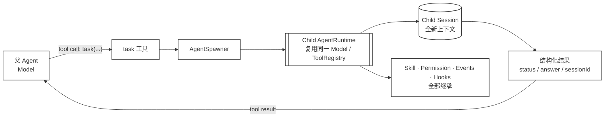
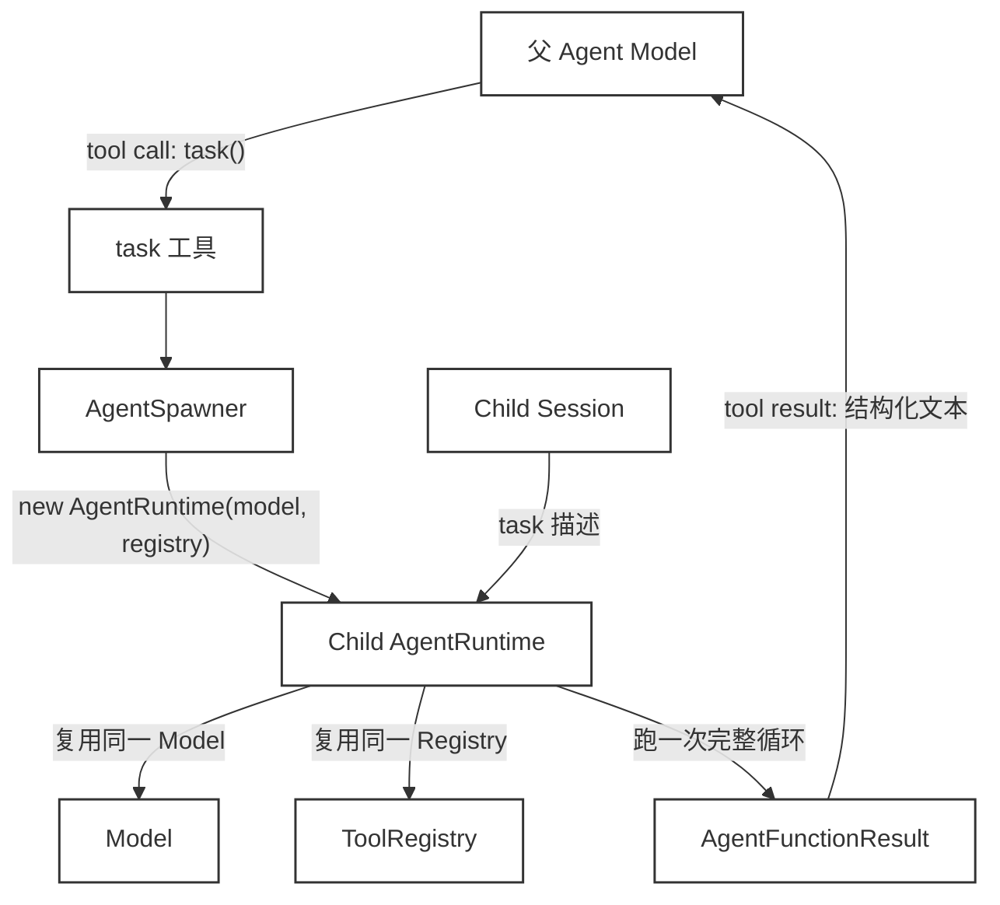

# 47 · Agent as Function

> <span class="stage-badge">Stage Hello Programmatic Agent</span> · <span class="tag-badge">v47-agent-function</span>

Code as Action 走到这一步，能力组合的「单元」还停留在工具级：模型写一段程序，把 `glob / read / write / bash` 串起来。但碰到「把认证与 API 两个模块各自分析一遍，再汇总结论」这种任务就卡住了——一次分析就是一个完整的模型循环，程序里的 `await read(...)` 表达不了「再唤醒一个 LLM 去做它自己的任务」。

本章补上这一级：**子 Agent 调用成为标准 Tool Calling**。

```text
task({ description: "分析认证模块", prompt: "读取 src/auth.ts 并概括要点" })
→ AgentSpawner → 子 AgentRuntime + 独立 Session → 结构化结果回到模型上下文
```

`task` 工具与 `read / write / bash` 同级——模型不需要写代码来调用子 Agent，直接通过 tool calling 委派。

## 一、上一版存在什么问题？

ch42–44 解决的是「组合成本」：模型不再每组合一步就回 Harness 决策一次，而是写一段程序把多次能力调用串联起来。ch45 给这段程序上了三道治理闸（能力白名单 / require 白名单 / 预算与终止），ch46 让模型能按工作流消费真实 Skill。

但细看就会发现，这段程序能组合的世界仍然只有「工具」。`await read(...)`、`await bash(...)`、`await load_skill(...)`——每一个都是对环境的单次操作。组合粒度是「工具级」，不是「任务级」。

碰到下面这类任务就卡住了：

> 把 `src/auth.ts` 与 `src/api.ts` 各自分析一遍：读文件、提炼要点、各自得出结论，再在父层级汇总。

传统做法是父 Agent 亲手把两个文件读完，再在**同一个循环、同一份上下文**里自己提炼两份结论，最后汇总。一次多模块分析等于一条越来越长的 trajectory 加一份越来越长的上下文。模型缺少「把一个子任务交给另一个独立 LLM 循环去做，然后拿回一个结构化结果」的表达方式。

Skill 也补不了这个缺口。Skill 是一份「怎么做这类任务」的工作流说明，它仍然由当前这个循环、当前这份上下文执行；它不是「另起一个会独立思考、独立取舍的模型循环」。

> 上一版的边界：**程序可以编排工具，但编排不了「另一个 Agent」。** 任务级组合没有归属。

## 二、本篇解决什么问题？

本篇把「子 Agent 调用」变成模型工具箱里的一个标准工具：

```ts
// 模型直接调用 task 工具（与 read / write / bash 同级）
task({
  description: "分析认证模块",
  prompt: "你是子 Agent。请读取 src/auth.ts 并概括认证机制的实现要点。",
});
// → 结果直接回到模型上下文，不需要写代码
```

实现上刻意保持「复用」而不是「重写」：

- `task` 工具内部调用 `AgentSpawner.spawn()`，创建一个 **AgentRuntime**（同一个 Model、同一个 ToolRegistry：权限门 / 事件 / Hook / 超时全部继承，ch45 的治理对子 Agent 照样生效）；
- 子 Agent 运行在**一个全新的 Session** 里，上下文只由「任务描述」构成，与父程序的对话历史完全隔离；
- 返回的是结构化结果（`status / stopReason / answer / steps / tokens …`），失败不再是一个黑箱。

本篇同时立住一条原则：

> **子 Agent 的可见世界由父程序显式划定——父程序给了什么，子 Agent 才看得到什么。**

## 三、先看最终效果

Demo 的任务：父 Agent 调用 `task` 工具把「认证模块」和「API 模块」拆给两个子 Agent 各自分析，再汇总结论。




运行：

```bash
node --import tsx examples/stage-5/47-agent-function/demo.mts
```

预期输出（Run ID / Session ID 每次不同）：

```text
=== 47 · Agent as Function（Tool Calling 驱动）===

[run:start 父] fd5b1aae · 输入：用 task 工具把认证与 API 两个模块拆给子 Agent 分析，并汇总结论。
[model:end 父] 调用 task, task · 310 in / 30 out
[run:start 子] a67445e2 · 输入：你是子 Agent。请读取 src/auth.ts 并概括认证机制的实现要点…
[model:end 子] 无工具调用，直接回答 · 260 in / 40 out
[tool:end ] task
   [completed/finished] 认证模块的要点：Authorization 头携带 hv_ 前缀的签名 token，verifyToken() 校验前缀与 15 分钟过期时间（src/auth.ts）。
   session: a50808ae-…
   run: a67445e2-…
   steps: 2 · tokens: 260 in / 40 out
[run:start 子] 13d3c3e0 · 输入：你是子 Agent。请读取 src/api.ts 并概括路由结构与错误处理方式…
[model:end 子] 无工具调用，直接回答 · 240 in / 38 out
[tool:end ] task
   [completed/finished] API 模块的要点：4 条路由（/auth/login、/auth/refresh、/projects、/users），handleError() 对 401/403 给出明确提示（src/api.ts）。
   session: 4ab2d028-…
   run: 13d3c3e0-…
   steps: 2 · tokens: 240 in / 38 out
[model:end 父] 无工具调用，直接回答 · 950 in / 70 out

=== 运行结果 ===
父 Agent：completed / finished · Run fd5b1aae · 2 轮
子 Agent：2 个 · 均从同一个 AgentSpawner 派生

=== 验证清单 ===
[pass] 子 Agent 全部复用同一套 Runtime：completed / finished
[pass] 子 Agent 各有独立 Session：2 个 sessionId 互不相同
[pass] 子 Agent 的 runId 与父 run 不同
[pass] 注入资料生效：子 A 结论提到 verifyToken 与 15 分钟过期
[pass] 注入资料生效：子 B 结论提到路由与 401
[pass] 父模型收到子 Agent 结论并汇总
```

注意事件流的顺序：父 Agent 一次 tool call 同时发出两个 `task` 调用，子 A 和子 B 各自以**自己的 runId** 出现在同一条时间线上；每个子 Agent 的结构化结果（含 session / run / steps / tokens）直接回到 `tool:end` 事件。

## 四、架构变化

本章没有新增第二个 Runtime，变化只发生在「模型工具箱 → 子 Agent」这一段：

```text
packages/
├── coding/
│   └── src/
│       ├── programmatic/
│       │   ├── binding.ts          ← ch44–45 已有：能力桥
│       │   └── spawner.ts          ← ch47 新增
│       ├── tools/
│       │   ├── code.ts             ← ch47 修改：调整提示词
│       │   └── task.ts             ← ch47 新增：task 工具
│       ├── extensions/
│       │   └── hello-coding.ts     ← ch47 修改：注册 task 工具
│       └── index.ts                ← ch47 修改：导出 createTaskTool
├── cli/
│   └── src/
│       └── main.ts                 ← ch47 修改：传 AgentSpawner 给扩展
examples/
└── stage-5/
    └── 47-agent-function/
        └── demo.mts                ← ch47 修改：Tool Calling 驱动的 demo
prompts/
└── coding.md                       ← ch47 修改：task 工具说明
```

核心变化对比：

| 版本 | 模型能调用什么 | 任务级组合的归属 |
| --- | --- | --- |
| ch43–46 | 工具级能力（glob / read / write / bash / skill 资源） | 没有：所有子任务都挤在父循环里 |
| ch47 | + `task({description, prompt})`（子 Agent 委派） | 子任务是「一个独立的 AgentRuntime + 独立 Session」 |

### Agent as Tool

在Hello Harness的实现中，我们的子Agent是按照 ToolCalling的方式进行驱动；除此之外还可以使用我们前面完成的code方式来完成子Agent的触发链路；那么这两中方案有什么区别呢？

**Tool Calling 驱动（主流）**

| 产品 |  触发方式 |  核心工具 |
| --- | --- | --- |
| OpenAI Codex |  模型直接调用 tool |  `spawn_agent / send_message / wait_agent / list_agents` |
| Claude Code | 模型直接调用 tool |  `Task(agent_type, description) 或 Agent(agent_type)` |
| OpenCode |  模型直接调用 tool | `task(description, prompt, subagent_type)` |

> 子 Agent 的生命周期管理（spawn / wait / resume / close）被封装成工具，LLM 通过标准 tool calling 直接调用。Agent 定义是配置文件（TOML/Markdown/JSON），LLM 看到的是工具的 description，据此决定何时调用。

**代码驱动**

完整的链路如下

```
LLM 决策 → 写一段程序 → code 工具执行 → 程序里调用 agent() → AgentSpawner 创建子 Runtime + Session
```

**对比如下**

| 维度 | Tool Calling 驱动 | 代码驱动（我们 + MiMo） |
|------|-------------------|----------------------|
| 编排能力 | 受限于工具接口 | 图灵完备：循环、条件、错误处理、变量复用 |
| 确定性 | 靠 prompt 约束，模型可能"忘记"分支 | 代码分支不会遗漏 |
| token 效率 | 每次 spawn 都消耗一轮 tool calling | 编排逻辑在一次 code 执行里完成 |
| 复杂度上限 | 适合简单 fan-out | 适合多阶段、有条件分支的编排 |
| 实现成本 | 需要定义 spawn/wait/close 一组工具 | 复用现有 code 工具 + agent() 函数 |


从简单实现理解的角度出发，我们选择了目前主流的 `Tool Calling` 的驱动方式，通过一个新的 `task` 工具来完成子Agent的触发、执行

## 五、核心抽象

父子交互的完整数据流：




| 角色 | 负责什么 | 不负责什么 |
| --- | --- | --- |
| `task` 工具 | 标准 Tool Calling 接口：模型调用它委派子任务 | 不是新 Agent 实现 |
| `AgentSpawner` | 创建子 AgentRuntime 与独立 Session | 不持有消息历史、不决定模型行为 |
| Child Session | 子任务的身份与上下文容器（`sessionId` 可追踪） | 不共享父程序的对话历史 |
| Child AgentRuntime | 复用同一 Model / ToolRegistry 跑一次完整循环 | 没有自己的第二套治理体系 |

本章的公开面很小，只有两个接口和一个类：

```ts
export interface AgentSpawnOptions {
  system?: string;      // 子 Agent 的 system 提示；不传则子 Agent 只有任务描述
}

export interface AgentFunctionResult {
  runId: string;          // 子运行的身份
  sessionId: string;      // 子 Session 的身份
  status: RunStatus;      // completed / failed / aborted
  stopReason: StopReason; // finished / maxSteps / timeout / aborted / failed
  answer: string;         // 子 Agent 的最终回答
  iterations: number;     // 子运行的循环轮数
  steps: number;          // 子运行落账的步数
  inputTokens: number;    // 子运行的 token 用量
  outputTokens: number;
  error?: string;         // 子运行失败时的错误信息
}
```

三个原则值得单独说。

**① `task` 是标准工具，走能力白名单。** 与 `read / write / bash` 同级，模型通过标准 tool calling 调用。子 Agent 的预算收口（最大深度 / 取消传播 / usage 汇总）留给 ch48。

**② 子 Agent 的可见世界由父程序显式划定。** 子上下文等于任务描述。父程序的局部变量、父 Agent 的对话历史，一样都不带进去。模型在 `prompt` 参数里写什么，子 Agent 就看到什么。

**③ task 工具返回结构化文本。** 子 Agent 的 `answer / status / sessionId / steps / tokens` 被格式化成可读文本回到模型上下文，模型可以直接基于子 Agent 的结论做汇总，不需要额外解析。

## 六、实现代码

### `task` 工具：标准 Tool Calling 接口

`packages/coding/src/tools/task.ts` 是本章唯一的「新工具」：

```ts
// packages/coding/src/tools/task.ts

export interface TaskInput {
  description?: unknown;
  prompt?: unknown;
  system?: unknown;
}

export function createTaskTool(spawner: AgentSpawner): Tool {
  return {
    name: "task",
    description:
      "委派一个独立子任务给子 Agent：子 Agent 在自己的上下文窗口中运行，复用同一套工具和权限，完成后返回结构化结果。适合需要独立推理的子任务（如分析单个模块、运行测试套件、执行专项审查）。子 Agent 不会看到父对话历史，只看到你传入的任务描述和可选系统提示。",
    parameters: {
      type: "object",
      properties: {
        description: {
          type: "string",
          description: "子任务的简短描述（3-10 个词，用于工具调用日志和结果索引）",
        },
        prompt: {
          type: "string",
          description:
            "子 Agent 的完整任务指令：包含目标、输入资料路径、期望输出格式。子 Agent 只会看到这段指令，不会看到父对话上下文。",
        },
        system: {
          type: "string",
          description:
            "子 Agent 的系统提示词（可选）：定义子 Agent 的角色、行为边界和工具使用规则。不传则子 Agent 只有任务描述。",
        },
      },
      required: ["description", "prompt"],
    },
    async execute(input: unknown): Promise<ToolResult> {
      const { description, prompt, system } = input as TaskInput;
      if (typeof description !== "string" || description.trim() === "") {
        return { ok: false, error: "参数 description 必须是非空字符串", kind: "tool", retryable: false };
      }
      if (typeof prompt !== "string" || prompt.trim() === "") {
        return { ok: false, error: "参数 prompt 必须是非空字符串", kind: "tool", retryable: false };
      }

      try {
        const spawnOptions: { system?: string } = {};
        if (typeof system === "string" && system.trim() !== "") {
          spawnOptions.system = system;
        }
        const result = await spawner.spawn(prompt, spawnOptions);
        const lines = [
          `[${result.status}/${result.stopReason}] ${result.answer}`,
          ``,
          `session: ${result.sessionId}`,
          `run: ${result.runId}`,
          `steps: ${result.steps} · tokens: ${result.inputTokens} in / ${result.outputTokens} out`,
        ];
        if (result.error) lines.push(`error: ${result.error}`);
        return { ok: true, value: lines.join("\n") };
      } catch (error) {
        const msg = error instanceof Error ? error.message : String(error);
        return { ok: false, error: `子 Agent 执行失败：${msg}`, kind: "tool", retryable: false };
      }
    },
  };
}
```

模型调用 `task` 工具时，`execute` 内部调用 `AgentSpawner.spawn()`，创建一个全新 Session 的子 AgentRuntime，跑一次完整循环，把 `AgentRun` 映射成程序可消费的 `AgentFunctionResult`。

### `AgentSpawner`：复用而非重写

`packages/coding/src/programmatic/spawner.ts` 的 `spawn()` 有四个动作，每一个都在复用：

```ts
// packages/coding/src/programmatic/spawner.ts
async spawn(task, options = {}) {
  // ① 子运行时：同一个 Model / 同一个 ToolRegistry；Hook 沿当前调用链继承
  const scope = getActiveRuntimeScope();
  const child = new AgentRuntime(this.model, this.registry, {
    ...this.options,
    hooks: this.options.hooks ?? scope?.hooks,
  });

  // ② 子运行时的事件转发到当前调用链的事件流（runId 不同，父子可区分）
  if (scope) {
    child.on("run:start", (e) => scope.events.emit(e));
    child.on("model:end", (e) => scope.events.emit(e));
    child.on("tool:end", (e) => scope.events.emit(e));
    // …（10 类事件全部转发）
  }

  // ③ 子 Session：上下文只由「任务描述」构成
  const session = new Session();
  session.context.add(userMessage(task));

  // ④ 跑一次完整循环，把 AgentRun 映射成结构化结果
  const run = await child.runContext(session.context);
  const result = { runId: run.id, sessionId: session.id, … };
  this.children.push(result);
  return result;
}
```

四个动作对应的复用清单：`AgentRuntime`（ch12）、`Session` / `runContext`（ch14/26）、`getActiveRuntimeScope` 与事件转发（ch45）。


### 接线：扩展不知道 Model，组装方知道

`hello-coding` 扩展注册 `task` 工具时并不持有 Model（AGENTS.md 的边界：扩展不绑定具体模型），所以 `AgentSpawner` 由组装方（CLI）注入：`main.ts` 在 `createAgent` 之前先 `createOpenAIModel()`，创建 `AgentSpawner`，经 `HelloCodingExtensionOptions.spawner` 传进扩展。

```ts
// packages/cli/src/main.ts（createAgent 内部）
const spawner = new AgentSpawner(options.model, registry, options.childRuntimeOptions ?? {});
extensions.install(createHelloCodingExtension(workspace, { spawner }));
```

### render输出层改造

调整下 `render.ts`，让子Agent的输出可以更方便的区分出来


## 七、运行 Demo

```bash
pnpm typecheck            # 全仓类型检查，应全绿

# 对照 demo（不需要 API Key，确定性模型）
node --import tsx examples/stage-5/47-agent-function/demo.mts
```

输出即第三节的轨迹：父 Agent 一次 tool call 发出两个 `task` 调用，子 A 和子 B 各自在独立 Session 中运行，结构化结果回到模型上下文，父 Agent 收尾汇总。整段运行一秒内结束（子 Agent 由确定性模型直接回答，不联网）。

### 真实模型场景

上面的 demo 用确定性模型验证了机制正确性。但 `task` 工具的真正价值要在真实 LLM 场景下才能体现：模型自己判断「什么时候该拆、拆给谁、怎么汇总」。

一个典型场景：

```bash
# 需要 OPENAI_API_KEY；--auto-approve 放行权限确认
$ pnpm hello --auto-approve --tools "分析 packages/core/src 下的 runtime / session / events 三个模块，各自概括职责边界和对外接口，最后输出一份架构分工说明"
```

真实模型收到这个任务后的决策过程：

```text
模型思考：这个任务有三个独立模块需要分析 → 适合拆分 → 调用 task 工具

模型 tool call → task({ description: "分析 runtime 模块", prompt: "读取 packages/core/src/runtime/runtime.ts 并概括 AgentRuntime 的职责边界与对外接口" })
模型 tool call → task({ description: "分析 session 模块", prompt: "读取 packages/core/src/session/session.ts 并概括 Session 的职责边界与对外接口" })
模型 tool call → task({ description: "分析 events 模块", prompt: "读取 packages/core/src/events/events.ts 并概括事件系统的职责边界与对外接口" })

模型收到三个 task 结果 → 汇总成一份架构分工说明
```

这里的四个关键点：

1. **模型自己决定拆分策略。** 不是硬编码的 if/else，而是模型根据任务语义判断「三个独立模块 → 适合并行拆分」。
2. **每个子 Agent 只拿到它需要的指令。** prompt 参数由模型撰写，子 Agent 在自己的上下文窗口中运行。
3. **子 Agent 的回答是独立推理。** 每个子 Agent 在自己的 Session 里分析一个模块，不被其他模块的代码干扰。
4. **父模型做汇总但不做重复分析。** task 结果直接回到模型上下文，模型基于子 Agent 的结论给出整体说明。

或者进入多轮对话：

```bash
$ pnpm hello --chat
你 > 用 task 工具把 packages/coding/src 下的 tools / extensions / programmatic 三个目录各派一个子 Agent 分析，汇总成一份模块职责说明
```


真实模型的形态是固定的：**父 Agent 调用 `task` 工具 → 子 Agent 复用同一套注册表与权限跑自己的循环 → 结构化结果回到父模型上下文 → 父 Agent 汇总。** 子 Agent 读文件、改文件、跑命令，一律继续走 `Permission Gate`（CLI 默认开启权限门；`--auto-approve` 只是把 ask 改成自动放行）。

### 替代方案：代码驱动

本章选择 Tool Calling 驱动是因为它与主流 coding agent（Codex、Claude Code、Devin、OpenCode）的子 Agent 实现方式一致。前面也说到，除此之外也可以用**代码驱动**的方式实现同样的效果：在 `code` 工具的执行环境里注入一个 `agent()` 函数，模型写一段程序来编排多个子 Agent。

```ts
// 代码驱动（替代方案）
const auth = await agent("分析认证模块", { context: ["src/auth.ts"] });
const api = await agent("分析 API 模块", { context: ["src/api.ts"] });
print("认证：" + auth.answer);
print("API：" + api.answer);
```

代码驱动的优势是图灵完备的编排能力（循环、条件、错误处理），适合复杂的多阶段工作流。MiMo Code 的 Dynamic Workflows 就采用了这种方式。本章选择 Tool Calling 驱动是因为：教学上更简单（不需要理解 code 工具的执行模型），与业界主流一致（各位小伙伴学完后可以直接对接 Codex / Claude Code 的子 Agent 系统），且对大多数子任务已经足够。

## 八、新架构解决了什么？

1. **组合从「工具级」升到「任务级」。** 模型不仅能调用 `read / bash`，还能把一整块「需要独立思考的子任务」交给另一个 LLM 循环，拿回 `status / stopReason / answer` 结构化结果。ch42 的「组合成本」问题在任务维度上再降一级。

2. **复用而不是重写。** `task` 工具背后是同一个 `AgentRuntime`、同一个 `ToolRegistry`、同一个 `Session` 机制。子 Agent 的权限门、事件、Hook、工具超时、Skill（注册表共享）一个不少——「Programmatic Calling 改变的是调用方式，不是 Harness 的治理体系」这句话，对 Agent 调用同样成立。

3. **上下文范围变成显式约定。** 子 Agent 该看到什么，由父模型调用 `task` 时的 `prompt` 显式划定；父对话历史默认不可见。信息传递不再是「全量继承」，而是「按需投递」——这为 ch50 Persistent Working State（程序状态跨 Action 存活）埋了第一颗种子。

4. **每条子运行都可观察。** 子运行时的事件转发进父事件流，`runId / sessionId` 让父子在同一时间线上可区分；`AgentFunctionResult` 携带 `iterations / steps / inputTokens / outputTokens`，是后面 usage 汇总的起点。

## 九、它又引入了什么问题？

1. **上下文范围是双刃剑。** 子 Agent 只看到 prompt 里写的东西——这是隔离，也是孤岛。要用上父级的任何信息，都必须显式投递到 prompt 里。传少了子 Agent 答不准，传多了又退回「全量复制上下文」。「该给多少」成为新的调参问题。

2. **递归没有上限。** 子 Agent 的循环里也有 `task` 工具，那它的循环里也可以再调 `task`。深度可以无限叠下去，谁能递归几层，目前没有任何预算。

3. **取消不沿树传播。** 父 runtime 的 `abort()` 只断自己的循环。正在跑的子 Agent 不知道自己应该被取消，也没有把取消转达给孙 Agent 的机制。Ctrl+C 只取消「最上面那一层」。

4. **并发还没有。** 两个 `task` 调用是顺序 `await`，子 Agent 之间没法并行。要并行，需要并发预算、共享资源冲突（两个子 Agent 同时改一个文件）的处理——这是 ch49。

5. **事件刷屏加倍。** 子事件全量转发到父事件流，可观测性拉满的同时，命令行也会被 10 类事件 × 嵌套层级刷满。观测内容齐了，观测形式（按 runId 聚合、折叠）还没到位。

6. **CLI 接线次序被锁定。** `AgentSpawner` 需要 Model，而扩展在组装早期就要注册工具——`main.ts` 被迫把 `createOpenAIModel()` 提前到 `createAgent` 之前。副作用是：现在 CLI 任何模式都会创建一次模型对象。这是「扩展不知道 Model」边界的组装代价，目前可接受，但值得记录。

7. **工具超时与子 Agent 生命周期冲突。** `task` 是一个工具，但子 Agent 的执行时间可能远超普通工具的单次调用。父 runtime 有一个全局 `timeoutMs`（默认 120s），子 runtime 也有自己的 `timeoutMs`。当父模型调用 `task` 时，父的工具执行阻塞等待子 Agent 完成——子 Agent 跑了 90s，父就只剩 30s 给后续工作。多个 `task` 串行调用会快速耗尽父的预算。更深层的问题是：父的超时机制基于「单次工具调用不应太久」的假设，而 `task` 天然是个长耗时工具。超时语义需要重新设计——是给 `task` 单独配一个更大的超时，还是让子 Agent 的时间独立于父的预算，目前没有解。

这些问题里，1 是设计取舍（ch50 的 Persistent Working State 会讨论程序状态跨 Action 存活），2、3 是结构性缺口——递归深度与取消传播必须上预算，7 是超时语义的冲突——这三类问题正是下一章。

## 十、下一章

`task` 工具成为标准工具之后，递归结构自然出现：子 Agent 的循环里也有 `task` 工具，它还能再委派子任务。ch48 要回答的问题不是「能不能递归」（当然能），而是：

> 递归必须上预算：最大深度多少？parent / child 关系怎么记录？usage 怎么沿树汇总？取消怎么沿树传播？子 Agent 的生命周期归谁管？

ch48 会把 `AgentSpawner` 演进为一个真正持有递归结构的 spawner：`depth / parent-child / usage / abort / lifecycle` 全部显式建模——继续复用这里的 Runtime，不新造一套。

---

看到这里的小伙伴，不妨点个赞，顺手关注下微信公众号「一灰灰Blog」，我们下章见。

微信公众号: 一灰灰Blog
