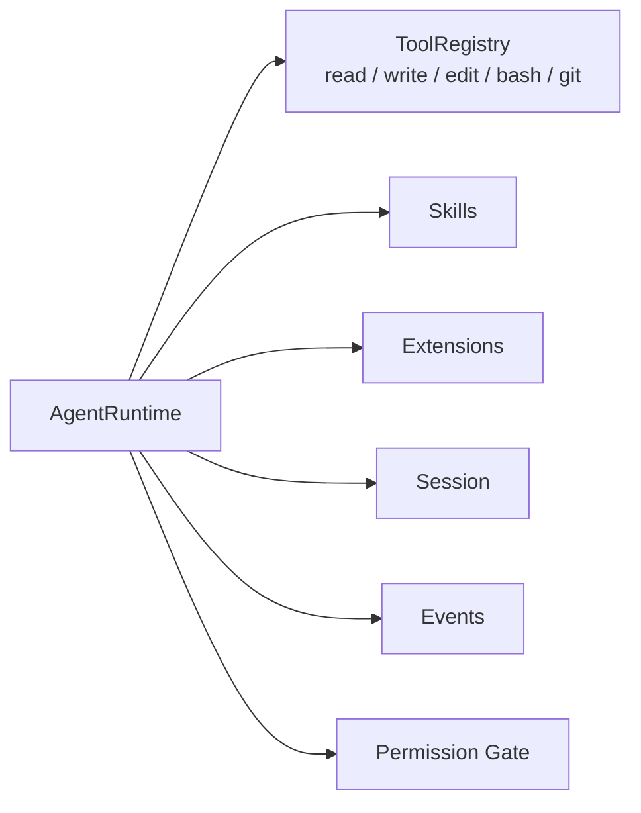
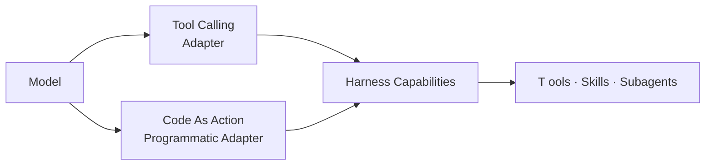
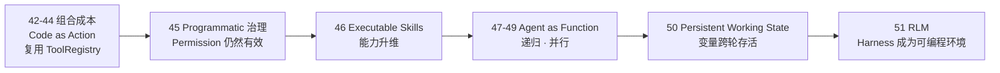

# Stage 5 · Hello Programmatic Agent

> <span class="stage-badge">Stage 5</span> · Git Tag 范围：<span class="tag-badge">v42-composition-cost</span> ~ <span class="tag-badge">v51-rlm</span>

Stage 4 走完之后，我们已经收获了一个 **Extensible Coding Agent**——小核心 + 扩展优先，工具、技能、提示词、权限都能按需生长。而 `AgentRuntime`、`ToolRegistry`、`Skills`、`Session`、`Events`、`Permission` 这些能力，一路走来都健在、都可复用。

但一路走来，你有没有发现一件事正在悄悄变味：模型每完成一次稍微复杂一点的任务，都要在 `Model ↔ Harness` 之间来回很多趟——`glob` 一趟、`read` 一趟、过滤一趟……**每一次组合都需要模型回来决策一次**。当这种往返越来越多，你会感到一种强烈的不对劲。

也是从这一篇开始，我们向第二个真实世界里的优秀项目学习——**Prime Agent**。如果说 Stage 4 的 Pi 教我们「怎么把 Harness 做小、做可扩展」，那么 Prime Agent 教我们的是：「当模型越来越会写代码时，模型不再需要每次回 Harness 做一次选择——它应该能在一段程序里，自己组合这些能力」。

如果你刚读完 `40-hello-pi-style-harness`，心里可能正带着一个疑问走进这一篇：

> **模型已经这么会写代码了，我们为什么还要让它每次做事，都回来点一次 Tool？**

接下来，这一篇就是 Stage 5 的开篇总览，回答三件事：

1. 我们这个 Stage 解决什么问题？（能力编排的往返成本）
2. 什么是 Programmatic Tool Calling，它与 RLM 是什么关系？
3. 这一 Stage 完成之后，我们会得到一个怎样的 Programmatic Agent？

<!-- more -->

## 一、先复习：我们手上有什么

Stage 4 攒下的东西，可以浓缩成一张图：



**它已经是一个非常规整的 Tool-Calling Harness**：能力以扩展形态组织，权限可控，可观察性拉满。

但这条路的尽头，藏着一个越来越尖锐的成本矛盾。模型面对的是：

```text
几十个精心设计的 Tool Schema
```

于是 Harness 的核心问题永远是：

```text
调哪个工具？参数是什么？下一个调哪个？结果怎么放回上下文？
```

> **Tool Calling 擅长「选择能力」，但不擅长「低成本组合能力」——而组合，恰恰是模型最擅长的。**

## 二、这一篇要回答的问题：组合成本

传统 Tool Calling 下一个「找出 src 下所有包含 `AgentRuntime` 且超过 300 行的 TypeScript 文件，再只读其中的 class 定义」的任务，会长成什么样？

```text
Model → glob → Model → read 文件1 → Model → read 文件2 → Model → …
```

大量的 `Model ↔ Harness` 往返。每个中间结果都得回到模型那里，重新做一次决策。

而如果 Harness 已经有这些能力，模型明明可以写：

```python
files = await glob("src/**/*.ts")
targets = []
for file in files:
    text = await read(file)
    if "AgentRuntime" in text and len(text.splitlines()) > 300:
        targets.append(extract_class(text))
```

一次动作，一段程序，多次能力调用。

> **Code as Action 真正解决的问题：把能力编排权从 Harness Loop 的多轮 Tool Calling，部分交给模型生成的程序。**
>
> **不是「模型缺工具」，而是——「模型已经会编程，为什么简单的循环、过滤、组合，还必须每次回到 LLM 做一次决策？」**

## 三、关键设计：这只是一层新的控制面，不是新的 Harness

Stage 5 最容易走偏的地方，是把「给模型一个可编程环境」误当成「再造一个 Python Runtime / 第二套 Harness」。我们的立场从一开始就是：

> **Code As Action 不是新的 Harness。它只是已有 Harness 上面新增的一种「Model → Harness 控制协议」。**

Tool Calling 与 Code Calling 是**并列的两个控制面**：



`await read(...)`、`await bash(...)` 最终都走回同一套 **ToolRegistry → Permission → Tool.execute()**：

```text
Python → Harness Bridge → ProgrammaticToolBinding → ToolRegistry → Permission → Tool.execute()
```

于是 Stage 2 的 Runtime、Stage 3 的 Workspace 与文件/Shell 工具、Stage 4 的 Permission / Hooks / Events / Skills / Extensions，**一个都不浪费**。模型程序里的 `await agent(...)` 复用的也是同一个 `AgentRuntime`。

### 那为什么学 Prime Agent？

Prime Agent 正是把「programmatic tool / sub-agent calling + persistent REPL」作为模型面对的核心控制环境，而 TypeScript host 仍持有 agent loop、provider、session、child lifecycle 等宿主职责。它的 RLM 抽象，恰好就是我们这个 Stage 的课程表：

> **学 Prime Agent 的思想，不绑死 Prime Agent 的实现。** 我们提取「让模型编程组合能力、把 Agent 变成函数、让中间状态持久化」这三个核心思想，用前 40 篇已有的东西亲手写出来。

## 四、它如何成长为一个 Programmatic Agent？

成长不是「推翻重来换引擎」，而是**一层一层把已有 Harness 的能力，变成模型可编程调用的对象**：



| 阶段 | 章节 | 补上的能力 | 对应成长 |
| --- | --- | --- | --- |
| **组合成本** | 42–44 | Tool Calling 的往返 → 模型写程序组合能力 → 复用 ToolRegistry | 从「每组合一步回一次模型」变成「一次程序多次能力」 |
| **治理不变** | 45 | `await bash(...)` 仍走 Permission / Event / Error | 从「调用方式变了」变成「治理体系照旧」 |
| **技能升维** | 46 | Skill 从指令变成可调用能力 | 从「Prompt Skill」变成「Executable Skill」 |
| **Agent 变函数** | 47–49 | `await agent(...)` 复用 AgentRuntime，可递归、可并行 | 从「一条 trajectory」变成「一棵可并行的 Agent 树 / 函数」 |
| **状态持久** | 50 | `files / analysis` 跨轮存活，不必全塞 messages | 从「中间结果全是 token」变成「数据留在 program state」 |
| **正式命名** | 51 | RLM Programming Model | 从「一系列小技巧」变成「一套完整范式」 |

> **这就是演进叙事：不是每次加一个独立新功能，而是把「模型怎么使用 Harness」从选工具，一步步换成写代码编排全部已有能力。**

## 五、这一 Stage 完成之后，我们会得到一个怎样的 Agent？

毕业作品叫 **Programmatic Agent（RLM 编程模型）**——模型通过可编程控制面，复用、组合前面所有阶段建好的能力：

```mermaid
flowchart LR
  U[hello "分析这个项目"] --> PA[Programmatic Layer<br/>Persistent Working State]
  PA --> T[Tools<br/>复用 ToolRegistry]
  PA --> SK[Executable Skills]
  PA --> AG[agent&#40;...&#41;<br/>复用 AgentRuntime]
  AG --> S1[子 Agent · 递归/并行]
```

对比 Stage 4 的 Extensible Coding Agent，能力一目了然：

| 维度 | Stage 4 · Extensible Coding Agent | Stage 5 · Programmatic Agent |
| --- | --- | --- |
| 模型的动作 | 从 Tool 清单里「选」 | 写代码「组合」已有能力 |
| 组合能力的方式 | 每组合一步回一次模型 | 一次模型 = 循环 / 过滤 / 并行 / 多次能力 |
| 与已有 Harness 的关系 | 能力来自扩展 | **全部复用，一个都不重写** |
| 治理 | Permission / Hooks / Events | 原样保留，仍在每次能力调用后生效 |
| Agent 形态 | 单一线性 Steps | `agent()` 可递归、可并行 |
| 核心心智 | 小核心 + 扩展 | **把整个 Harness 变成模型可编程调用的世界** |

> 一句话概括 Stage 5 的目标：
> **不是给 Agent 一个新的 Python 世界，而是把我们前面辛苦构建的整个 Harness，变成一个模型可以编程调用的世界。Tool Calling 让模型「选」能力，Programmatic Calling 让模型「写」组合。**

## 六、章节清单

| # | 章节 | Git Tag | 状态 |
| --- | --- | --- | --- |
| 42 | [Tool Calling 的组合成本](42-tool-calling-cost) | [v42-composition-cost](https://github.com/liuyueyi/hello-harness/releases/tag/v42-composition-cost) | <span class="badge-done">正文完成</span> |
| 43 | [Code as Action](43-code-as-action) | [v43-code-as-action](https://github.com/liuyueyi/hello-harness/releases/tag/v43-code-as-action) | <span class="badge-done">正文完成</span> |
| 44 | [复用现有 Tool Registry](44-programmatic-binding) | v44-programmatic-binding | <span class="badge-done">正文完成</span> |
| 45 | [Permission / Event / Error 仍然有效](45-programmatic-governance) | v45-programmatic-governance | <span class="stage-badge">规划中</span> |
| 46 | [Executable Skills](46-executable-skill) | v46-executable-skill | <span class="stage-badge">规划中</span> |
| 47 | [Agent as Function](47-agent-function) | v47-agent-function | <span class="stage-badge">规划中</span> |
| 48 | [Recursive Agent](48-recursive-agent) | v48-recursive-agent | <span class="stage-badge">规划中</span> |
| 49 | [Parallel Agents](49-parallel-agent) | v49-parallel-agent | <span class="stage-badge">规划中</span> |
| 50 | [Persistent Working State](50-persistent-state) | v50-persistent-state | <span class="stage-badge">规划中</span> |
| 51 | [RLM：把 Harness 当作可编程环境](51-rlm) | v51-rlm | <span class="stage-badge">规划中</span> |

## 阶段结尾

这一阶段结束：**Programmatic Agent（RLM 编程模型）**——模型用代码编排 Tool / Skill / Subagent，Agent 变成可递归、可并行的函数，中间结果留在持久的工作状态里。前 40 篇的 Harness，一个都没被浪费。

> **记住这一 Stage 的灵魂一句：**
> **Stage 5 不是重新搞一个新 Runtime，而是把前面 Harness 的所有能力，全部变成模型可以编程调用的对象。**

下一阶段，我们要回答整套教程最「危险」也最迷人的问题：如果 Agent 已经能写代码编排整个 Harness 的能力，**它能不能改进 Harness 本身的状态？**——Prompt、Skill、Memory、Agent 配置不再是开发者的领地，这就是 **Continual Harness**。