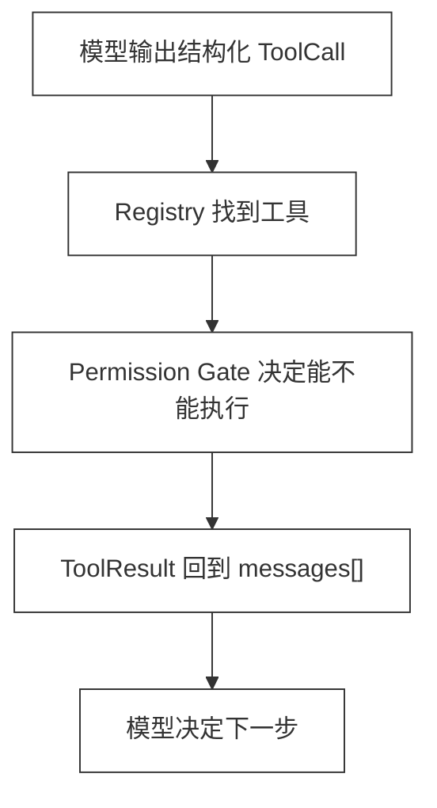
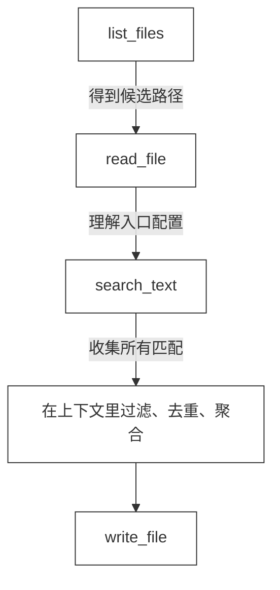
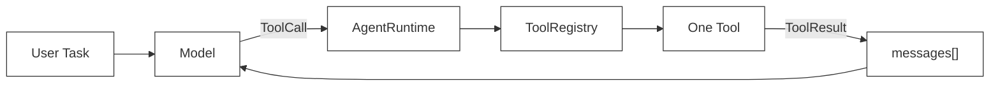
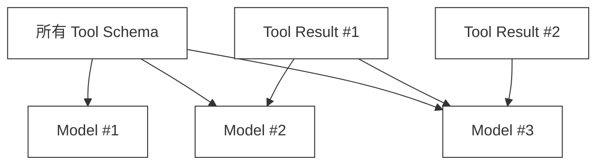
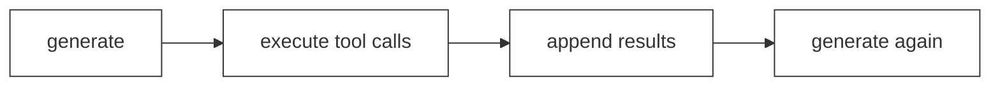
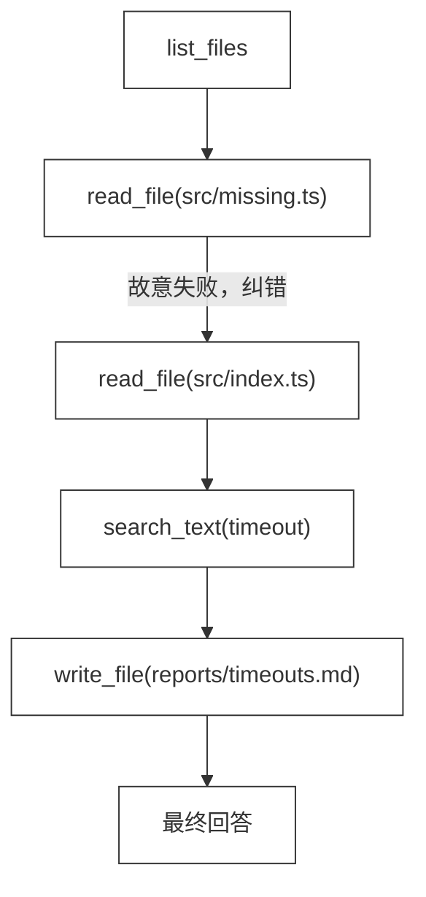
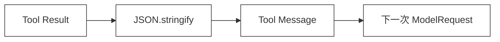
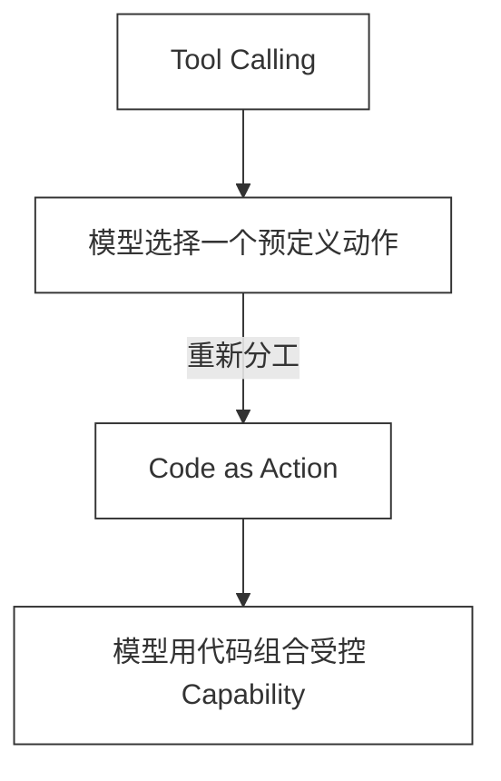
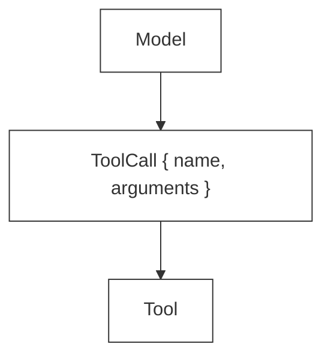
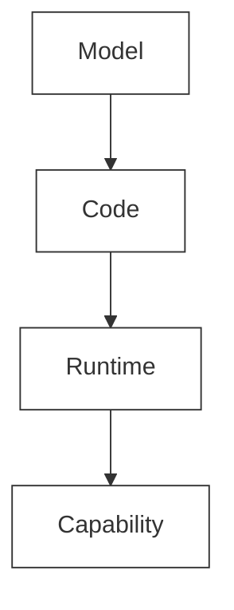

# 41 · Tool Calling 的边界

> <span class="stage-badge">Stage Hello RLM</span> · <span class="tag-badge">v41-tool-limit</span>

一般来讲，当我们把一套系统做得"可扩展"之后，下一个坑往往不是功能不够，而是能力太多。

上一章（第四十章）我们把 Harness 拆成了 `core / extensions / coding / ai / cli` 五个正式包。Core 保持克制，工具可以通过 Extension 与 Package 持续接入——`small core，everything else optional` 终于不只是一句口号。

可扩展性是解决了，一个更隐蔽的问题却跟着浮了上来：**能力越容易接进来，模型面前那张 Tool 菜单就越容易膨胀。**

内置的 `calculator / random / read / write / edit / bash / load_skill` 已经有 7 个；再装上上一阶段的 git 与 web 包，又多出 `git_status / git_log / git_diff / fetch_url`。以后呢？`grep / glob / json / database / search / browser / deploy`……

每个能力都值得拥有，但它们全部平铺成 JSON Tool 以后，问题还是"工具不够多"吗？

> **这一章我们不急着发明新架构。先给当前这套 Tool-Calling Harness 做一次压力测试，看看它到底把什么成本藏进了 Agent Loop。**

<!-- more -->

## 一、上一版存在什么问题？

Stage 1–4 一直在证明 Tool Calling 的价值，链路很简单：




这条链路本身没毛病。对于 `read("README.md")`、`git_status()` 这种**边界清晰的单步操作**，它依然简单、可靠、好授权、好审计。

问题出在任务开始变成"组合题"之后。比如下面这种需求，小伙伴们在日常 Coding 里肯定没少遇到：

> 审计 `src` 中散落的 timeout 配置，把结论写到 `reports/timeouts.md`。

模型至少要走完这么几步：




Tool Calling 当然能做完，但有四笔账会一起涨：

1. **菜单账**：每个 Tool 都带着 name / description / parameters，模型调用时得反复看到；
2. **往返账**：有依赖关系的步骤只能"模型 → 工具 → 模型"逐轮推进；
3. **上下文账**：每个中间结果都被序列化成 Tool Message，后续调用继续背着；
4. **纠错账**：工具选错、参数猜错或结果格式理解错，至少再付一次往返。

一句话概括就是：

> **Tool 本来是"给模型一个动作"，工具多了以后，Harness 开始用一堆动作替模型预先设计程序结构。**

## 二、本篇解决什么问题？

这一章我们只做两件事：

1. 用当前 `ToolRegistry + AgentRuntime` 跑一个**无需 API Key、结果可复现**的组合任务；
2. 把"Tool 爆炸"从模糊感受，拆成可以观测的四项指标。

本章**不会**引入 `CodeRuntime`，也不会删掉任何 Tool。原因很简单，演进叙事不能断：

- ch41 负责确认边界；
- ch42 才提出 `Code as Action`；
- ch43 才定义新的 `CodeRuntime` 抽象。

如果这一章就把答案写进 Core，整个进化故事就断档了。

我们依然沿用整个《Hello Harness》系列的叙事风格，一步一步，最小改动成本的方式，来实现最终的效果

## 三、先看最终效果

运行本章 demo 的姿势如下：

```bash
$ node --import tsx examples/stage-5/41-tool-calling-limits/demo.mts
```

它不调用真实模型，也不读写真实项目。12 个代表性 Tool 用真实 `Tool` 契约注册，脚本模型与 `AgentRuntime` 跑完整循环，并记录每次 `ModelRequest` 的大小。

实测结果如下：

```text
=== 41 · Tool Calling 的边界：一次组合任务的账单 ===
工具菜单        : 12 个 Tool Schema
模型往返        : 6 次（5 次工具调用 + 1 次最终回答）
失败调用        : 1 次（纠错占用了一次额外往返）
单次 Schema     : 2842 字符
累计 Schema     : 17052 字符（同一份菜单重复发送 6 次）
最终消息上下文  : 3614 字符
最终 Tool Result: 5 条已经回灌 messages[]
运行结果        : completed (finished) · 审计完成：发现 18 处 timeout 定义，报告已写入 reports/timeouts.md。

每次模型调用看到的负担：
  #1 schema=2842 chars · messages=78 chars · toolResults=0
  #2 schema=2842 chars · messages=322 chars · toolResults=1
  #3 schema=2842 chars · messages=596 chars · toolResults=2
  #4 schema=2842 chars · messages=882 chars · toolResults=3
  #5 schema=2842 chars · messages=3301 chars · toolResults=4
  #6 schema=2842 chars · messages=3614 chars · toolResults=5

结论：Tool Calling 能完成任务；代价是 Harness 必须把菜单、编排轮次和中间结果都搬进模型上下文。
```

先别急着把"2842 字符"换算成 token 或费用。不同 Provider 的序列化、分词、缓存策略都不一样，这个 demo **不是计费器**。它证明的是三个结构事实：

- 同一份 Tool 菜单进入了每一次模型请求；
- 有依赖的组合任务产生了多次模型往返；
- Tool Result 随着循环持续进入消息历史。

这些事实都来自我们自己的运行时，而不是对某个模型"可能会怎样"的猜测。

## 四、架构没有变，观察视角变了

这一章不动生产代码。我们仍然跑第 40 章的架构：




以前我们盯着"某个工具能不能被正确调用"；现在改成盯着"一个组合任务如何穿过整个循环"。视角一拉远，隐藏的成本就冒出来了：




每增加一轮，模型通常不只看到"最新结果"，还会看到工具菜单与此前的消息历史。Tool Calling 的局部接口很简洁，**组合成本却落在全局循环里**。

## 五、边界就在当前实现里

不用猜，打开 `packages/core/src/runtime/runtime.ts` 就能找到这几笔账。作为一个喜欢刨根问底的小同学，我们直接看代码。

### 5.1 每轮都把 ToolDefinition 交给模型

运行时循环里的模型请求是这样构造的：

```ts
// packages/core/src/runtime/runtime.ts
const tools = this.registry.list();
const modelRequest = { messages: context.messages, tools };
response = await this.generate(modelRequest);
```

`registry.list()` 返回的是全部 `ToolDefinition`：

```ts
export interface ToolDefinition {
  name: string;
  description: string;
  parameters: unknown;
}
```

**请注意**：Tool 的成本不只在执行时出现。即便本轮只需要 `read_file`，其余工具的定义也照样躺在 `tools` 里。Provider 是否缓存、怎么编码是下一层的事，但 Harness 交出的请求结构不会因为"这轮没用到它"就自动变小。

### 5.2 Tool Result 会进入消息历史

工具执行完以后，当前实现做了这一步：

```ts
context.add(toolMessage(call.id, JSON.stringify(result) ?? ""));
```

这一步非常合理：模型不看到结果，就没法决定下一步。可当搜索返回几十条匹配、shell 打出几千字符、read 截取一段源码时，**中间数据也会变成后续每一轮的输入**。

我们已经给 `read` 和 `bash` 设了 8000 字符截断，避免单次结果无限膨胀。这是必要的防护，但没改掉问题本身：

- 截断只能限制"一次搬多少"，不能让 Harness 不再搬。

### 5.3 依赖链天然需要多轮

当前 Runtime 的基本节奏是：




一次响应可以包含多个 ToolCall，所以**互不依赖**的操作有机会同批执行。但 `read_file` 的 path 来自 `list_files` 的结果，`write_file` 的 content 又依赖搜索与聚合结果，这种数据依赖无法凭空并行：模型必须先看到前一步输出，才能构造后一步参数。

这不是循环写坏了，而是 Tool-Calling 编排模型的自然代价。

## 六、最小实验怎么写？

完整代码在 `examples/stage-5/41-tool-calling-limits/demo.mts`。下面给出三个关键点。

### 6.1 故意挂一张"有点拥挤"的菜单

demo 注册了 12 个代表性工具：

```text
list_files       read_file       search_text      write_file
edit_file        read_json       write_json       run_shell
git_status       git_diff        fetch_url        query_database
```

它们可不是为了凑数。Coding Agent 很自然就会长出这些能力，而且每个工具都需要自己的描述与参数：

```ts
demoTool({
  name: "search_text",
  description: "在 workspace 文本文件中搜索正则表达式；返回文件、行号和匹配行",
  properties: {
    pattern: { type: "string", description: "正则表达式" },
    glob: { type: "string", description: "限定文件范围的 glob" },
    maxResults: { type: "integer", description: "最大匹配数" },
  },
  required: ["pattern"],
});
```

菜单变大的原因不是开发者喜欢堆功能，而是**平铺 Tool 的粒度，要求每一种操作都拥有一份公开契约**。

### 6.2 用脚本模型制造一条真实的依赖链

脚本回复依次调用：




这里的模型是假的，但下面这些都是真的：

- `ToolRegistry.register / execute`；
- `AgentRuntime` 的循环与停止条件；
- Assistant Message / Tool Message 回灌；
- 结构化失败结果；
- 每轮 `ModelRequest` 里的 `messages + tools`。

使用脚本模型，目的不是模拟"模型有多聪明"，而是把模型的随机性从实验里挪走，让我们只测 Harness 的结构。

### 6.3 在 Model 边界记录请求大小

模型收到请求时只做三项观测：

```ts
requests.push({
  schemaChars: JSON.stringify(request.tools ?? []).length,
  messageChars: JSON.stringify(request.messages).length,
  toolMessages: request.messages.filter((message) => message.role === "tool").length,
});
```

这也解释了指标为什么用 `chars` 而不是 `tokens`：字符数是对当前 Harness 请求结构的确定性测量；token 数属于具体 Provider 与模型，没法在纯本地 demo 里假装精确。

### 6.4 完整源码

```ts
import {
  AgentRuntime,
  ToolRegistry,
  userMessage,
  type Model,
  type ModelRequest,
  type ModelResponse,
  type Tool,
  type ToolResult,
} from "@hello-harness/core";

interface DemoToolOptions {
  name: string;
  description: string;
  properties?: Record<string, unknown>;
  required?: string[];
  run?: (input: unknown) => ToolResult;
}

function demoTool(options: DemoToolOptions): Tool {
  return {
    name: options.name,
    description: options.description,
    parameters: {
      type: "object",
      properties: options.properties ?? {},
      required: options.required ?? [],
      additionalProperties: false,
    },
    async execute(input: unknown): Promise<ToolResult> {
      return options.run?.(input) ?? { ok: true, value: `${options.name}: ok` };
    },
  };
}

const registry = new ToolRegistry();

for (const tool of [
  demoTool({
    name: "list_files",
    description: "列出 workspace 内匹配 glob 的文件；返回相对路径数组，不读取文件内容",
    properties: { glob: { type: "string", description: "glob 表达式，例如 src/**/*.ts" } },
    required: ["glob"],
    run: () => ({ ok: true, value: ["src/api.ts", "src/cache.ts", "src/index.ts"] }),
  }),
  demoTool({
    name: "read_file",
    description: "读取 workspace 内一个 UTF-8 文本文件；文件过长时按 maxChars 截断",
    properties: {
      path: { type: "string", description: "相对 workspace 根目录的文件路径" },
      maxChars: { type: "integer", description: "最多返回多少字符" },
    },
    required: ["path"],
    run: (input) => {
      const { path } = input as { path?: unknown };
      if (path === "src/missing.ts") {
        return { ok: false, error: "文件不存在：src/missing.ts", kind: "tool", retryable: false };
      }
      return { ok: true, value: "export const apiTimeout = 3000;\nexport const cacheTimeout = 5000;" };
    },
  }),
  demoTool({
    name: "search_text",
    description: "在 workspace 文本文件中搜索正则表达式；返回文件、行号和匹配行",
    properties: {
      pattern: { type: "string", description: "正则表达式" },
      glob: { type: "string", description: "限定文件范围的 glob" },
      maxResults: { type: "integer", description: "最大匹配数" },
    },
    required: ["pattern"],
    run: () => ({
      ok: true,
      value: Array.from({ length: 18 }, (_, index) => ({
        path: `src/module-${String(index + 1).padStart(2, "0")}.ts`,
        line: index + 10,
        text: `const timeout = ${3000 + index * 100}; // TODO: centralize timeout configuration`,
      })),
    }),
  }),
  demoTool({
    name: "write_file",
    description: "把完整 content 写入 workspace 文件；已有文件会被覆盖，父目录自动创建",
    properties: {
      path: { type: "string", description: "相对 workspace 根目录的目标路径" },
      content: { type: "string", description: "要写入的完整内容" },
    },
    required: ["path", "content"],
    run: (input) => {
      const { path, content } = input as { path?: unknown; content?: unknown };
      return { ok: true, value: { path, chars: typeof content === "string" ? content.length : 0 } };
    },
  }),
  demoTool({
    name: "edit_file",
    description: "对文件做一次精确 search/replace；oldText 必须只出现一次",
    properties: {
      path: { type: "string" },
      oldText: { type: "string" },
      newText: { type: "string" },
    },
    required: ["path", "oldText", "newText"],
  }),
  demoTool({
    name: "read_json",
    description: "读取 JSON 文件并解析为对象；解析失败时返回结构化错误",
    properties: { path: { type: "string" } },
    required: ["path"],
  }),
  demoTool({
    name: "write_json",
    description: "把对象序列化为格式化 JSON 并写入文件",
    properties: { path: { type: "string" }, value: { type: "object" } },
    required: ["path", "value"],
  }),
  demoTool({
    name: "run_shell",
    description: "在 workspace 根目录运行一条命令；返回 stdout、stderr 和退出码",
    properties: { command: { type: "string" }, timeoutMs: { type: "integer" } },
    required: ["command"],
  }),
  demoTool({
    name: "git_status",
    description: "读取当前 Git 工作区状态；不修改仓库",
  }),
  demoTool({
    name: "git_diff",
    description: "读取当前 Git diff；可按 path 限定范围，不修改仓库",
    properties: { path: { type: "string" } },
  }),
  demoTool({
    name: "fetch_url",
    description: "通过 HTTP GET 获取 URL 正文；仅允许 http/https，响应过长会截断",
    properties: { url: { type: "string" } },
    required: ["url"],
  }),
  demoTool({
    name: "query_database",
    description: "执行只读数据库查询；必须提供数据源和查询文本",
    properties: { source: { type: "string" }, query: { type: "string" } },
    required: ["source", "query"],
  }),
]) {
  registry.register(tool);
}

const replies: ModelResponse[] = [
  {
    content: "先找出源码文件。",
    toolCalls: [{ id: "c1", name: "list_files", arguments: { glob: "src/**/*.ts" } }],
    inputTokens: 100,
    outputTokens: 12,
  },
  {
    content: "先读入口文件。",
    toolCalls: [{ id: "c2", name: "read_file", arguments: { path: "src/missing.ts", maxChars: 4000 } }],
    inputTokens: 140,
    outputTokens: 14,
  },
  {
    content: "路径猜错了，改读真实入口。",
    toolCalls: [{ id: "c3", name: "read_file", arguments: { path: "src/index.ts", maxChars: 4000 } }],
    inputTokens: 180,
    outputTokens: 16,
  },
  {
    content: "再搜索所有 timeout 定义。",
    toolCalls: [
      { id: "c4", name: "search_text", arguments: { pattern: "timeout", glob: "src/**/*.ts", maxResults: 50 } },
    ],
    inputTokens: 220,
    outputTokens: 18,
  },
  {
    content: "整理结果并写报告。",
    toolCalls: [
      {
        id: "c5",
        name: "write_file",
        arguments: {
          path: "reports/timeouts.md",
          content: "# Timeout audit\n\n发现 18 处 timeout 定义；建议收敛为统一配置。\n",
        },
      },
    ],
    inputTokens: 420,
    outputTokens: 24,
  },
  {
    content: "审计完成：发现 18 处 timeout 定义，报告已写入 reports/timeouts.md。",
    toolCalls: [],
    inputTokens: 450,
    outputTokens: 28,
  },
];

const requests: Array<{ schemaChars: number; messageChars: number; toolMessages: number }> = [];
let replyIndex = 0;
const model: Model = {
  modelName: "scripted-tool-limit-demo",
  async generate(request: ModelRequest): Promise<ModelResponse> {
    requests.push({
      schemaChars: JSON.stringify(request.tools ?? []).length,
      messageChars: JSON.stringify(request.messages).length,
      toolMessages: request.messages.filter((message) => message.role === "tool").length,
    });
    const response = replies[replyIndex];
    replyIndex += 1;
    if (!response) throw new Error("脚本回复已耗尽");
    return response;
  },
  async *stream() {},
};

const runtime = new AgentRuntime(model, registry, { maxSteps: 10 });
const run = await runtime.run({
  messages: [userMessage("审计 src 中散落的 timeout 配置，把结论写到 reports/timeouts.md")],
});

const failedCalls = run.steps.filter((step) => step.type === "tool" && !step.result.ok).length;
const toolCalls = run.steps.filter((step) => step.type === "tool").length;
const schemaCharsPerRequest = requests[0]?.schemaChars ?? 0;
const totalSchemaChars = requests.reduce((sum, request) => sum + request.schemaChars, 0);

console.log("=== 41 · Tool Calling 的边界：一次组合任务的账单 ===");
console.log(`工具菜单        : ${registry.list().length} 个 Tool Schema`);
console.log(`模型往返        : ${requests.length} 次（${toolCalls} 次工具调用 + 1 次最终回答）`);
console.log(`失败调用        : ${failedCalls} 次（纠错占用了一次额外往返）`);
console.log(`单次 Schema     : ${schemaCharsPerRequest} 字符`);
console.log(`累计 Schema     : ${totalSchemaChars} 字符（同一份菜单重复发送 ${requests.length} 次）`);
console.log(`最终消息上下文  : ${requests.at(-1)?.messageChars ?? 0} 字符`);
console.log(`最终 Tool Result: ${requests.at(-1)?.toolMessages ?? 0} 条已经回灌 messages[]`);
console.log(`运行结果        : ${run.status} (${run.stopReason}) · ${run.answer}`);

console.log("\n每次模型调用看到的负担：");
requests.forEach((request, index) => {
  console.log(
    `  #${index + 1} schema=${request.schemaChars} chars · messages=${request.messageChars} chars · toolResults=${request.toolMessages}`,
  );
});

console.log("\n结论：Tool Calling 能完成任务；代价是 Harness 必须把菜单、编排轮次和中间结果都搬进模型上下文。");
```

## 七、Tool Calling 的四条边界

理论铺垫完了，接下来进入正题——我们把上面这些成本正式拆成四条边界。

### 7.1 边界一：Tool Schema 会从"接口"变成"菜单税"

一个 Tool 的 Schema 很小，几十个 Schema 塞进每轮请求就不再小了。更麻烦的是，菜单里常常出现语义相近的选择：

```text
read_file / read_json
write_file / write_json / edit_file
run_shell / git_status / git_diff
```

拆得细，工具数量上升；合得粗，比如只留一个万能 `shell`，参数空间和安全风险又会变大。Tool-oriented Harness 很容易陷入两难：

| 设计 | 好处 | 代价 |
| --- | --- | --- |
| 细粒度 Tool | 参数明确，权限容易按动作控制 | Schema 多，选择与组合负担上升 |
| 粗粒度 Tool | 菜单短，表达能力强 | 参数空间大，安全边界与结果格式更难收敛 |
| 高层工作流 Tool | 一次调用完成常见流程 | 每出现一种新流程就要再造一个 Tool |

所以"再加一个 Tool"能解决局部需求，却不会自动解决组合问题。

### 7.2 边界二：复杂任务被切成模型往返

demo 里 5 次工具调用带来了 6 次模型请求，失败的 `read_file("src/missing.ts")` 又多占了一轮。

真实任务里的链条可能更长：


如果每一条边都必须穿过一次"生成完整 ModelResponse"的边界，延迟、上下文与失败面就会跟着链条一起涨。

**重点关注**：批量 ToolCall 能减少**独立操作**的往返，但消除不了数据依赖。后一步参数只有等前一步跑完才能确定时，循环就必须继续。

### 7.3 边界三：中间数据被迫变成对话

在普通程序里，我们会这么处理数据：

```ts
const matches = search("timeout");
const unique = dedupe(matches);
const summary = groupByPackage(unique);
writeReport(summary);
```

`matches` 和 `unique` 是进程内变量，不用写成自然语言，也不必每一步都交给模型重新读一遍。

但在当前 Tool Calling 循环里，中间结果主要靠 `messages[]` 传递：



于是搜索结果越大，后续轮次搬运的数据越多。结果截断、摘要、Context Compaction 都能缓解，但它们仍由 Harness 决定"留下什么、丢掉什么"。这条矛盾会一路通向第 48 章的 **Context as Variable**。

### 7.4 边界四：组合逻辑没有一等公民

今天的 `ToolCall` 表达一次动作：

```json
{
  "name": "read_file",
  "arguments": { "path": "src/index.ts" }
}
```

它并不直接表达：

```text
对每个文件执行 read
只保留包含 timeout 的结果
按 package 分组
失败时跳过并记录
最后把聚合结果写入报告
```

循环、条件、变量、过滤、异常处理这些**组合语义**，只能分散在模型的多轮决策和 Harness 的 Agent Loop 里。开发者如果把它们封装成 `audit_timeout`，这一个任务会变快，但下次又会出现 `audit_retry / audit_env / audit_dependency`。

> **Tool 爆炸的本质，不是工具名字太多，而是 Harness 正在用一个个预定义动作，替模型枚举未来可能需要的组合。**

## 八、这不等于"Tool Calling 已经过时"

边界不是判决书。Tool Calling 依然非常适合下面这些场景：

- 单步、离散、参数明确的能力，比如读取一个文件；
- 需要单独授权的副作用，比如写文件、出网、部署；
- 必须保留结构化审计记录的操作；
- 返回值小而稳定、不会形成长依赖链的查询；
- 不希望模型拥有通用代码执行能力的受限环境。

Stage 5 接下来也不会把 Tool 与 Permission Gate 扔掉。更准确的方向是：




底层文件、Shell、Git、搜索仍然需要清晰边界；权限仍然必须 fail-closed。变化的是**模型面对的操作面**：从一张不断变长的 JSON 菜单，转向一个可编程、可组合、仍受 Harness 约束的环境。

## 九、本章交付了什么？

这一章没有新增生产抽象，这是刻意的。交付物是一份可复现的架构证据：

| 验证点 | Demo 中的证据 |
| --- | --- |
| Tool 菜单随每轮进入模型请求 | 6 次请求的 `schemaChars` 都是 2842 |
| 依赖链产生模型往返 | 5 次工具调用 + 1 次最终回答 |
| 失败需要纠错轮次 | 错误路径产生 1 次失败，再调用正确路径 |
| Tool Result 持续进入上下文 | 最终请求包含 5 条 Tool Message |
| 中间结果推动消息增长 | `messages` 从 78 增长到 3614 字符 |
| 不依赖模型随机性 | 脚本 Model，本地直接运行，无需 API Key |

它解决的不是 Tool Calling 的边界，而是**我们对边界的含糊认识**。从这一章开始，后续架构变化都有一把尺子：新设计是否真的减少了菜单、往返和中间数据搬运，而不只是把复杂性换个名字。

## 十、它又引入了什么问题？

现在我们知道 Tool Calling 在组合任务上会吃力，但答案还没出来：

1. 如果不用几十个平铺 Tool，模型要输出什么？
2. 代码执行比 Tool Call 更强，权限边界怎么保住？
3. 模型写的代码在哪里运行，如何超时、取消、观察与重置？
4. Capability 与 Tool 到底是什么关系？
5. Code as Action 会不会只是把 JSON 错误换成语法错误？

这些问题不能靠一句"让模型写 Python"糊弄过去。尤其是第三条，它需要一套独立于 Python、Provider 和 Agent 的 Runtime 契约——但那是第 43 章的任务。

## 十一、小结与下一章

先把这一章的核心拎出来小结一下：

- Tool Calling 在单步任务上依然好用，但组合任务会把成本藏进 Agent Loop；
- 这些成本可以拆成四条边界：菜单税、往返、中间数据对话化、组合逻辑无一等公民；
- 我们没改生产代码，只是给后续演进立了一把可复现的尺子。

下一章先迈最小的一步：不实现 Runtime，只改变动作表达方式。

从：



进入：




ch42 章，**Code as Action**：如果编程语言本身就是组合器，Harness 还需要替模型预先枚举每一条工作流吗？

尽信书则不如，以上内容纯属一家之言，因个人能力有限，难免有疏漏和错误之处，如发现 bug 或者有更好的建议，欢迎批评指正，不吝感激 🙃

欢迎点赞、关注公众号「一灰灰Blog」 我们下章见

---

微信公众号: 一灰灰Blog
