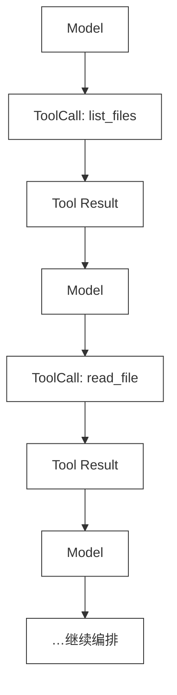
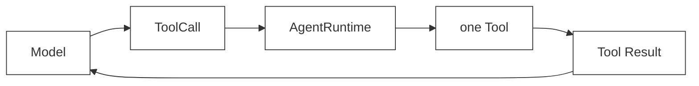
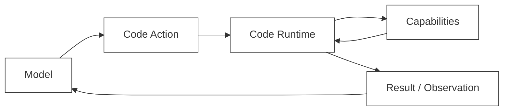

# 42 · Code as Action

> <span class="stage-badge">Stage Hello RLM</span> · <span class="tag-badge">v42-code-as-action</span>

上一章我们给 Tool Calling 算了一笔账：12 个 Tool Schema 在 6 次模型请求里重复携带，5 条 Tool Result 回灌进 `messages[]`，一次路径猜错还额外消耗了一轮。

最重要的结论并不是“Tool Calling 不行”。真正的问题是：**组合逻辑没有自己的位置。**

当任务是“列文件 → 逐个读取 → 并发搜索 → 过滤 → 聚合 → 写报告”时，Harness 只能把它拆成一串 JSON ToolCall，再让模型在每一个断点回来决定下一步。可循环、条件、局部变量、异常分支、并发，本来就是编程语言最擅长表达的东西。

所以这一章提出 Stage 5 的第一次架构反转：

> **不要只让模型选择一个 Tool；让模型写一段代码，用代码自己组合受控的 Capability。**

<!-- more -->

## 一、上一版存在什么问题？

把ch41 的 timeout 审计任务再摆出来：

> 扫描 `src` 里的 timeout 配置，整理成 `reports/timeouts.md`。

在 Tool Calling 里，模型通常要表达的是一串离散动作：

```json
{ "name": "list_files", "arguments": { "glob": "src/**/*.ts" } }
```

拿到结果以后，再生成下一条：

```json
{ "name": "read_file", "arguments": { "path": "src/api.ts" } }
```

然后是 `search_text`、`write_file`。如果路径来自上一步、报告内容来自前几步结果，Agent Loop 就只能这样走：




这里有个很容易被忽略的事实：**模型并不是不知道怎么过滤、遍历、分组。** 它会写 Python、JavaScript、TypeScript，能把这些结构写进一段程序；但当前 Harness 只允许它从菜单中选择一个动作。

当我们把所有常见组合封成高层 Tool，例如：

```text
audit_timeout
audit_retry
audit_env
audit_dependency
generate_release_note
fix_test_failure
```

菜单看似变短了，实际上只是把“模型可以写的程序”提前固化成了一堆开发者预写流程。新需求一来，还得再加一个 Tool。

> **上一版的边界不在于能力不够，而在于模型能表达的动作粒度被固定在了一个个 JSON 调用。**

## 二、本篇解决什么问题？

这一章只改变一件事：**模型动作的表达形式。**

从：

```text
Model
  ↓
ToolCall { name, arguments }
  ↓
one Tool
```

变成：

```text
Model
  ↓
Code Action
  ↓
Runtime
  ↓
Capability
```

其中：

- **Code Action**：模型输出的一段程序。循环、条件、局部变量、函数和并发都写在这里；
- **Capability**：宿主受控提供的环境能力，例如 `files.list`、`files.read`、`files.write`；
- **Runtime**：执行这段程序、注入 Capability、处理超时/取消/权限/输出的边界。

请特别注意最后一项：这一章只提出 Runtime **应该在这里**，不实现它。`CodeRuntime.execute(code)` 是第 43 章的主角；Python、Capability 注入与持久化运行环境分别是第 44–46 章的工作。

> 这不是拖延，而是在保护抽象边界：现在若直接写一个“能执行代码”的类，本章的主题就被扩充，直接导致的问题就是复杂度就一下子飙升上来，整体的实现进度也像装了助推器，整体往前推了一步，这不符合我们最原始的设计本意。

## 三、先看最终效果

本章 demo 仍然使用 timeout 审计任务，但模型的“动作”不再是一串 ToolCall，而是一段直接组合 `files` Capability 的 JavaScript 程序。

```bash
$ node --import tsx examples/stage-5/42-code-as-action/demo.mts
```

输出如下：

```text
=== 42 · Code as Action：一段程序组合 Capability ===
模型动作        : auditTimeouts(capabilities) 这一段代码
程序内编排      : 局部变量 · Promise.all · map / filter / flatMap · 条件匹配
扫描结果        : 3 个文件 · 3 处 timeout 配置
Capability 调用 : 5 次（发生在同一段程序内部）
额外模型往返    : 0 次（本 demo 只观察一次 Code Action 的内部编排）

Capability 轨迹：
  files.list({"prefix":"src/"}) → 3 paths
  files.read({"path":"src/api.ts"}) → 57 chars
  files.read({"path":"src/cache.ts"}) → 31 chars
  files.read({"path":"src/worker.ts"}) → 46 chars
  files.write({"path":"reports/timeouts.md"}) → 173 chars

写入的报告：
# Timeout audit

扫描文件：3
发现配置：3

- src/api.ts:1 — `export const apiTimeout = 3000;`
- src/worker.ts:1 — `const timeoutMs = 5_000;`
- src/worker.ts:2 — `export { timeoutMs };`
```

这段程序里，`files.list` 的结果保存在 `paths`；三个文件通过 `Promise.all` 并发读取；`flatMap / filter` 在进程内完成提取；最后再调用一次 `files.write`。

没有任何一个中间数组需要先翻译成 Tool Result、塞进 `messages[]`，再由模型读回来决定如何遍历。**编排已经写在代码里。**

不过别误会这条“额外模型往返 = 0”：它只描述本 demo 中一段已经写好的程序的内部执行，并不宣称真实 Agent 从此只需一次模型调用。程序仍可能报错，模型仍可能需要读取结果后生成下一段代码；只是每段代码拥有了更大的组合表达力。

## 四、架构变化：从选择动作到编写动作

先看旧模型。Harness 既提供能力，也在很大程度上决定了能力怎样拼：




模型当然能连续做多轮选择，但 `for each file`、`if result is empty`、`dedupe` 这些组合语义只能散落在很多轮“想一想 → 调一个 Tool”之间。

Code as Action 的形状不同：




这张图的核心不是“把 Tool 换一个名字”。变化在于：

| 维度 | Tool Calling | Code as Action |
| --- | --- | --- |
| 模型的直接输出 | 一个 `ToolCall` | 一段程序 |
| 组合者 | 模型跨多轮决策 + Harness Loop | 程序里的语言结构 |
| 循环 / 条件 / 变量 | 隐含在对话轨迹中 | 显式写在代码里 |
| 环境边界 | `Tool.execute(input)` | Runtime 注入的 Capability |
| 安全裁决 | Tool 调用前的 Permission Gate | Runtime / Capability 调用前的权限边界 |
| 本章状态 | 已实现 | **只定义方向** |

`Runtime` 仍然存在，安全边界也没有消失。它只是从“反复安排模型点菜单”的角色，逐步转向“给代码一个可控的运行环境”。

## 五、三个新词，先把边界说清楚

### 5.1 Code Action：代码就是一次动作

在本阶段，“Action”不再只是一条 JSON：

```json
{ "name": "read_file", "arguments": { "path": "src/api.ts" } }
```

它也可以是一小段程序：

```ts
const paths = await files.list("src/");
const files = await Promise.all(
  paths.map(async (path) => ({ path, content: await files.read(path) })),
);
const findings = files.flatMap(extractTimeouts);
await files.write("reports/timeouts.md", renderReport(findings));
```

这段代码仍会调用底层能力，但它同时表达了数据如何流动、哪些工作并发、什么时候过滤、最后怎样生成结果。编程语言本身就是一个组合器。

### 5.2 Capability：受控能力，不是无限制全局对象

在 demo 中，Capability 的面很小：

```ts
interface Capabilities {
  files: {
    list(prefix: string): Promise<string[]>;
    read(path: string): Promise<string>;
    write(path: string, content: string): Promise<void>;
  };
}
```

`files` 不是 Node 的 `fs`，更不是“随便 import 什么都行”的全局环境。它是宿主明确注入的一个门面：有哪些方法、能处理哪个 workspace、可否写入、输出多大，全部可以被 Runtime 约束。

这也解释了为什么 Stage 5 不会放弃安全。能力从 Tool Schema 变成函数，并不意味着文件、Shell、网络就自动可信；**边界必须随着调用形式一起迁移。** 第 45 章会正式处理 Capability Runtime。

### 5.3 Runtime：先留空，不要偷跑

现在最容易犯的错误，是看到上面的代码就立刻写：

```ts
await runtime.execute(code);
```

这一行看起来很小，背后却藏着一长串问题：

- `code` 是 JavaScript、Python，还是别的语言？
- Capability 如何注入，代码能否逃逸拿到宿主权限？
- 执行超时怎样终止？用户取消怎么办？
- stdout、异常、返回值如何结构化为观察结果？
- 一段代码结束后变量要保留还是清掉？

所以本章只把 Runtime 放到架构图里，不把它写进 `packages/`。下一章先抽出 provider 无关、语言无关的 `CodeRuntime` 契约，再谈具体执行器。

## 六、最小实现：用内存 Capability 看代码怎样组合

完整 demo 位于 `examples/stage-5/42-code-as-action/demo.mts`。它没有修改 Core，也不接触真实文件系统；内存 Map 只用于把注意力聚焦在“代码如何编排”上。

### 6.1 宿主只交出三个 Capability

```ts
interface FileCapabilities {
  list(prefix: string): Promise<string[]>;
  read(path: string): Promise<string>;
  write(path: string, content: string): Promise<void>;
}
```

实现里每次调用都会记录一条 `CapabilityEvent`，因此 demo 能打印出环境层轨迹。但它没有 `ToolRegistry`，也没有在每次调用后返回模型：程序在宿主中连续执行。

```ts
async read(path: string): Promise<string> {
  const content = source.get(path);
  if (content === undefined) throw new Error(`文件不存在：${path}`);
  events.push({ name: "files.read", input: JSON.stringify({ path }), output: `${content.length} chars` });
  return content;
}
```

这里的异常处理也值得留意：文件不存在时，普通程序可以 `throw`，由同一段代码自己 `try / catch`、跳过或重试。它不必把错误转成一条 Tool Message 后强制回到模型；当然，若程序最终失败，Runtime 仍要把错误作为 Observation 返回模型——那是后续章节的职责。

### 6.2 “模型写出”的 Code Action

demo 用一个 `auditTimeouts` 函数承载模型写出的代码：

```ts
async function auditTimeouts(capabilities: Capabilities) {
  const paths = await capabilities.files.list("src/");
  const files = await Promise.all(
    paths.map(async (path) => ({ path, content: await capabilities.files.read(path) })),
  );

  const findings = files.flatMap(({ path, content }) =>
    content
      .split("\n")
      .map((line, index) => ({ path, line: index + 1, text: line.trim() }))
      .filter(({ text }) => /timeout/i.test(text)),
  );

  await capabilities.files.write("reports/timeouts.md", renderReport(findings));
}
```

函数形式只是教学上的可执行替身：让读者能直接跑它、看见 Capability 轨迹。真正 Model Response 里的这段内容会是**代码字符串**，并由未来的 `CodeRuntime` 加载或执行；本章故意没有伪造一个 `eval` 来跳过第 43 章。

### 6.3 同一个任务，两种表达

对比会更直观：

```text
Tool Calling
  list_files()
  → model reads result
  read_file(path)
  → model reads result
  search_text(...)
  → model reads result
  write_file(report)

Code as Action
  const paths = await files.list(...)
  const records = await Promise.all(paths.map(async (path) => ({ path, content: await files.read(path) })))
  const findings = records.flatMap(...).filter(...)
  await files.write(...)
```

前者把控制流分给 Agent Loop 与多次模型决策；后者把控制流留在模型生成的程序里。底层的文件读写没有消失，只是从“模型每次点一个按钮”变成“程序按自己的控制流调用 Capability”。

### 6.4 Demo源码

```ts
interface SourceFile {
  path: string;
  content: string;
}

interface CapabilityEvent {
  name: string;
  input: string;
  output: string;
}

interface FileCapabilities {
  list(prefix: string): Promise<string[]>;
  read(path: string): Promise<string>;
  write(path: string, content: string): Promise<void>;
}

interface Capabilities {
  files: FileCapabilities;
}

function createMemoryCapabilities(sourceFiles: SourceFile[]): {
  capabilities: Capabilities;
  events: CapabilityEvent[];
  writtenFiles: Map<string, string>;
} {
  const source = new Map(sourceFiles.map((file) => [file.path, file.content]));
  const writtenFiles = new Map<string, string>();
  const events: CapabilityEvent[] = [];

  return {
    capabilities: {
      files: {
        async list(prefix: string): Promise<string[]> {
          const paths = [...source.keys()].filter((path) => path.startsWith(prefix)).sort();
          events.push({ name: "files.list", input: JSON.stringify({ prefix }), output: `${paths.length} paths` });
          return paths;
        },
        async read(path: string): Promise<string> {
          const content = source.get(path);
          if (content === undefined) throw new Error(`文件不存在：${path}`);
          events.push({ name: "files.read", input: JSON.stringify({ path }), output: `${content.length} chars` });
          return content;
        },
        async write(path: string, content: string): Promise<void> {
          writtenFiles.set(path, content);
          events.push({ name: "files.write", input: JSON.stringify({ path }), output: `${content.length} chars` });
        },
      },
    },
    events,
    writtenFiles,
  };
}

/**
 * 假定这是模型针对任务生成的一段 JavaScript Code Action。
 *
 * 这里直接调用它，只是为了在第 42 章观察「代码如何组合 Capability」。
 * 它不是 CodeRuntime：没有 execute(code)、没有代码字符串求值、没有持久状态，
 * 也没有权限、超时、取消或沙箱。这些边界由第 43 章以后逐步补上。
 */
async function auditTimeouts(capabilities: Capabilities): Promise<{ filesScanned: number; findings: number; report: string }> {
  const paths = await capabilities.files.list("src/");
  const files = await Promise.all(
    paths.map(async (path) => ({ path, content: await capabilities.files.read(path) })),
  );

  const findings = files.flatMap(({ path, content }) =>
    content
      .split("\n")
      .map((line, index) => ({ path, line: index + 1, text: line.trim() }))
      .filter(({ text }) => /timeout/i.test(text)),
  );

  const report = [
    "# Timeout audit",
    "",
    `扫描文件：${files.length}`,
    `发现配置：${findings.length}`,
    "",
    ...findings.map((finding) => `- ${finding.path}:${finding.line} — \`${finding.text}\``),
  ].join("\n");

  await capabilities.files.write("reports/timeouts.md", report);
  return { filesScanned: files.length, findings: findings.length, report };
}

const { capabilities, events, writtenFiles } = createMemoryCapabilities([
  { path: "src/api.ts", content: "export const apiTimeout = 3000;\nexport const retries = 2;" },
  { path: "src/cache.ts", content: "export const cacheTtl = 60_000;" },
  { path: "src/worker.ts", content: "const timeoutMs = 5_000;\nexport { timeoutMs };" },
]);

const result = await auditTimeouts(capabilities);

console.log("=== 42 · Code as Action：一段程序组合 Capability ===");
console.log("模型动作        : auditTimeouts(capabilities) 这一段代码");
console.log("程序内编排      : 局部变量 · Promise.all · map / filter / flatMap · 条件匹配");
console.log(`扫描结果        : ${result.filesScanned} 个文件 · ${result.findings} 处 timeout 配置`);
console.log(`Capability 调用 : ${events.length} 次（发生在同一段程序内部）`);
console.log("额外模型往返    : 0 次（本 demo 只观察一次 Code Action 的内部编排）");

console.log("\nCapability 轨迹：");
for (const event of events) {
  console.log(`  ${event.name}(${event.input}) → ${event.output}`);
}

console.log("\n写入的报告：");
console.log(writtenFiles.get("reports/timeouts.md"));
```

## 七、运行 Demo

```bash
$ node --import tsx examples/stage-5/42-code-as-action/demo.mts
```

验证时关注三个点：

1. `files.read` 连续调用三次，却没有夹着三次 Model Request——它们由 `Promise.all` 在程序内部组织；
2. `paths`、`files`、`findings` 都是局部变量，中间数据不需要天然变成对话消息；
3. 最终只有 `files.write` 穿过环境边界，Capability 轨迹仍然完整可审计。

这个 demo 是确定性的：不需要 API Key、不实际创建 `reports/timeouts.md`，也不依赖当前仓库的源文件。它证明的不是“某个模型一定生成正确代码”，而是**一段 Code Action 能表达 Tool Calling 轨迹中原本分散的组合逻辑**。

## 八、新架构解决了什么？

### 8.1 不再为每个组合预造 Tool

一段程序能够自然表达：

```text
循环     for / map / flatMap
条件     if / filter / match
变量     const / let / function
并发     Promise.all / gather
错误处理 try / catch / finally
聚合     sort / group / reduce
```

这不是又增加了六个 Tool，而是让模型使用一个它已经会的通用语言去组合已有能力。未来的需求即使从“审计 timeout”变成“检查所有重试策略”，模型只需改程序，不必等待开发者再注册 `audit_retry`。

### 8.2 减少依赖链里的模型断点

模型依然需要在任务开始时写代码，并可能在程序结束或失败后根据 Observation 写下一段代码。但 `list → read → filter → aggregate → write` 这样的确定性子流程，不必被强制切成每步一次模型往返。

更准确的说法是：

> **Code as Action 不是消灭 Agent Loop，而是把适合程序完成的局部控制流，从 Agent Loop 移进程序。**

### 8.3 中间数据可以先留在运行时

`paths`、`files`、`findings` 活在程序执行上下文里。它们只有在模型确实需要看到时才应该被提炼成 Observation，而不必无条件经过：

```text
JSON.stringify → Tool Message → 下一次 ModelRequest
```

这是第 47–50 章 `Runtime State / Context as Variable / Search / Compaction`的起点：Context 不再只是 Harness 追加的一串 messages，而会逐步变成模型可操作、可查询的数据。

### 8.4 Capability 仍可保持最小权限

代码拥有循环并不等于拥有全部系统权限。demo 里它只能看见 `files.list/read/write`；没有网络、没有任意 shell、没有宿主的环境变量。以后 Runtime 可以在每次 Capability 调用前检查 workspace、权限策略、超时与预算。

> **把组合权交给模型，不等于把环境控制权交出去。**

## 九、它又引入了什么问题？

这次跃迁很大，新问题也更硬：

1. **代码在哪里执行？** 直接 `eval` 或 `Function` 不可接受：没有隔离、难以取消，也会拿到宿主权限；
2. **语言如何选择？** Python 适合数据与 REPL，JavaScript 与 Node 集成自然，但抽象不能绑死任何一种；
3. **输出如何观察？** stdout、返回值、异常、Capability 轨迹必须变成可读、可审计的 `RuntimeResult`；
4. **权限如何迁移？** `files.write()`、`shell.run()`、`http.get()` 仍是副作用，Permission Gate 必须覆盖新的调用面；
5. **代码会不会写错？** JSON 参数错会变成语法错误、导入错误、运行时异常或无限循环，需要超时、取消与清晰诊断；
6. **变量是否保留？** 每段代码执行后都清空很安全，但重复搬数据；保留状态更强，却需要 reset、snapshot 与资源治理。

第 42 章只回答了“模型应该输出什么样的动作”。接下来必须先回答“这段动作应该由什么契约来执行”。

## 十、下一章

下一章定义 Stage 5 的新发动机：`CodeRuntime`。

```ts
interface CodeRuntime {
  execute(code: string): Promise<RuntimeResult>;
  reset(): Promise<void>;
}
```

注意这个接口没有写 `PythonRuntime`，也没有让 `Model` 知道 Agent。它只是回答一件最基础的事：给我一段代码，受控地执行它，然后给我一个可观察的结果。

第 43 章，**CodeRuntime 抽象**：先把发动机的插槽设计清楚，再决定往里面装 Python、JavaScript 还是 Sandbox。

尽信书则不如，以上内容纯属一家之言，因个人能力有限，难免有疏漏和错误之处，如发现 bug 或者有更好的建议，欢迎批评指正，不吝感激 🙃

欢迎点赞、关注公众号「一灰灰Blog」 我们ch43见真章

---

微信公众号: 一灰灰Blog
