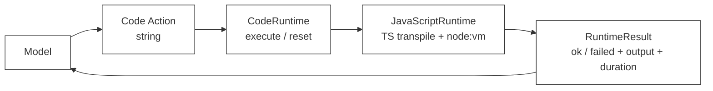

# 43 · CodeRuntime 抽象

> <span class="stage-badge">Stage Hello RLM</span> · <span class="tag-badge">v43-code-runtime</span>

一般来讲，Coding Agent 的演进，绕不过去的一步就是把模型从"点一个 JSON Tool"升级为"写一段 Code Action"。我们在第四十二章就干了这件事：循环、条件、局部变量和 `Promise.all` 不再是散落在一轮轮对话里的碎片，而是回到了编程语言本来最擅长的地方。

可上一章里，有个坑是咱们故意留着的：`auditTimeouts(capabilities)` 是宿主直接调用的函数。现实中的模型，吐出来的明明是一段**代码字符串**，那么问题来了——这段字符串到底谁来执行？执行成功、语法报错、`console.log` 输出、返回值、还有超时，又该怎么以一份稳定的格式回到 Harness？

> **这一章先造好发动机插槽，再点亮第一台 JavaScript/TypeScript 发动机。**

闲话不多说，这一章我们要做下面这几件事：

1. 定义语言无关的 `CodeRuntime` 与 `RuntimeResult`；
2. 用 Node `vm` + TypeScript 单文件转译实现 `JavaScriptRuntime`；
3. 让一个真实模型生成 TypeScript Code Action，并交给 Runtime 执行；

<!-- more -->

## 一、上一版存在什么问题？

上一章的 Code Action，表达力是够够的：

```ts
const paths = await files.list("src/");
const records = await Promise.all(
  paths.map(async (path) => ({ path, content: await files.read(path) })),
);
const findings = records.flatMap(extractTimeouts);
await files.write("reports/timeouts.md", renderReport(findings));
```

但是，这段程序目前只能作为 demo 源码被 Node 直接调用，它还不是模型能交给 Harness 的动作。中间缺了这么一层边界：


如果偷个懒，把 `???` 草率写成下面这样：

```ts
spawn("python", ["-c", code]);
```

看起来很快对吧？实际上这是把设计一次性锁死了，后面想改都改不动：

- Runtime 凭什么就一定是 Python？JavaScript、TypeScript、Sandbox 又怎么办？
- stdout、stderr、返回值、异常、耗时，该怎么统一回传？
- 调用方凭什么要去认识子进程、内核、解释器这些实现细节？
- 代码怎么超时？状态怎么清掉？
- 后面又怎么受控地注入 `fs / shell / git / search`？

> **我们缺的压根不是一行启动解释器的代码，而是"执行模型代码"这件事的公共契约。**

## 二、本篇解决什么问题？

本章新增一个独立、零 Provider 依赖的 `@hello-harness/code-runtime` 包。它先定好所有语言执行器共用的最小接口：

```ts
export interface CodeRuntime {
  execute(code: string): Promise<RuntimeResult>;
  reset(): Promise<void>;
}
```

然后实现第一版 `JavaScriptRuntime`，整体的执行链路如下：

```text
TypeScript source
      ↓ transpileModule（仅单文件转译）
JavaScript source
      ↓ node:vm
受限 context + console
      ↓
RuntimeResult
```

它同时支持 JavaScript 和 TypeScript 两种代码文本，但**请注意**，这里不注入任何环境 Capability：没有 `process`、`require`、文件、网络、Shell 或模型对象。这么做的目的很简单——小伙伴你可以先真刀真枪地体验"模型写代码 → Runtime 执行 → 结构化结果"，同时也不用担心越过 ch45 才要建立的 Capability 边界。

## 三、先看最终效果

接下来我们直接看效果，先把能跑的东西跑起来，再慢慢拆原理。

### 3.1 本地 JavaScript / TypeScript 执行

先跑一个不需要 API Key 的确定性 demo，省得大家一上来就被要密钥劝退：

```bash
$ node --import tsx examples/stage-5/43-code-runtime/demo.mts
```

输出结果如下，主要展示三件事：

```text
=== 43 · CodeRuntime：JavaScript / TypeScript 参考实现 ===
公共契约        : execute(code) → RuntimeResult；reset()
执行环境        : Node vm + 最小 console（不注入 process / require / 文件 / 网络）

TypeScript Code Action：
  typescript → completed · value={"count":2,"average":4000} · ...ms
    stdout: {"services":["api","worker"],"average":4000}

JavaScript Code Action：
  javascript → completed · value={"actions":["READ","SEARCH","WRITE"],"hasProcess":false,"hasRequire":false} · ...ms
    stderr: 这段代码只看见 console，不看见 process 或 require

同步死循环被 vm timeout 收束：
  while (true) {} → failed · Error: Script execution timed out after 50ms · ...ms
```

TypeScript 示例里有类型声明、数组 `reduce` 和 `return`；Runtime 会先转译，再在一个只装着 `console` 的 context 里跑起来。JavaScript 示例则用来验证 stdout/stderr 和返回值都能进到同一份 `RuntimeResult` 里。

### 3.2 真实模型生成并执行 Code Action

接下来，上真实模型。先把 `.env.example` 复制成 `.env`，再配置一个 OpenAI 兼容端点，然后**重点来了**——必须显式加 `--live`：

```bash
$ node --import tsx --env-file-if-exists=.env examples/stage-5/43-code-runtime/live-demo.mts --live
```

这个 demo 只发起**一次**模型调用。系统提示要求模型：只返回 TypeScript、在内存里准备好 timeout 样本、按服务聚合求平均、打印 JSON 摘要并 `return` 汇总对象。随后我们把返回文本直接丢给 `JavaScriptRuntime`。

一次真实验证里，`GLM-4.5-Flash` 生成了那段 TypeScript 聚合程序（138 input / 968 output tokens），Runtime 返回的结果长这样：

```json
{
  "ok": true,
  "stdout": "{\"totalServices\":4,\"globalAverageTimeout\":1750,\"serviceAverages\":[{\"service\":\"authentication\",\"averageTimeout\":1250},{\"service\":\"payment\",\"averageTimeout\":2250},{\"service\":\"notification\",\"averageTimeout\":500},{\"service\":\"api\",\"averageTimeout\":3000}]}",
  "stderr": "",
  "value": {
    "totalServices": 4,
    "globalAverageTimeout": 1750
  },
  "durationMs": 160
}
```

这不是预录好的答案：模型、提示词、生成的代码、Runtime 执行、结果打印，全在同一条命令里完成。模型偶尔手滑带上 Markdown 代码围栏也没关系，demo 会在执行前把最外层围栏剥掉；要是模型返回了不合法的代码，失败也会老老实实按 `RuntimeResult` 原样展示，而不是悄悄给你吞了。

> `--live` 是个显式开关，免得小伙伴随手跑个 demo 就无意中产生了模型调用费用，钱包它不香吗😂

### 3.3 在 `hello --chat` 里体验

独立 demo 证明了链路能跑之后，接下来把它接进 CLI，变成日常可用的姿势：

```bash
$ hello --chat --code-runtime typescript
```

这会进入一条独立的 **Code Action Chat** 循环：每一轮模型只返回一段 TypeScript，CLI 用 `JavaScriptRuntime` 执行，随后把代码和 `RuntimeResult` 打印出来。比如你输入：

```text
你 > 计算 21、34、55 三个数字的平均值，并给出结构化结果
```

一次真实运行得到的结果是：

```text
[model:end ] GLM-4.5-Flash · 176 in / 213 out · 9119ms
--- Code Action (typescript) ---
const numbers = [21, 34, 55];
const sum = numbers.reduce((acc, curr) => acc + curr, 0);
const average = sum / numbers.length;
console.log(`数字 ${numbers.join(', ')} 的平均值是 ${average.toFixed(2)}`);
return { numbers, sum, average, count: numbers.length };
--- RuntimeResult ---
{
  "ok": true,
  "stdout": "数字 21, 34, 55 的平均值是 36.67",
  "value": { "numbers": [21, 34, 55], "sum": 110, "average": 36.666666666666664, "count": 3 }
}
```

可选参数如下：

```text
--code-runtime typescript | javascript  # 选择模型输出语言（必须配合 --chat 或 --resume）
--code-timeout <ms>                  # 单段 Code Action 最长执行时间，默认 1000ms
```

Code Action Chat 不会去复用普通 Tool Calling 的 `.sessions/`，而是单独用 `.code-sessions/`；所以 `hello --resume <id> --code-runtime typescript` 只会恢复同类会话，不会把旧的 Tool Message 混进没有 Tool Schema 的代码对话里。另外当前模式也不支持 `--tui`，它直接把代码和 `RuntimeResult` 打到终端，跑的过程更好对照。

## 四、架构变化：Runtime 从虚线盒子变成正式包

接下来看架构层面的变化。现在的主链路是这样：




当它通过 CLI 跑起来时，外层再套一层对话循环：

```text
你输入任务
   ↓
Model.generate(messages) → Code Action
   ↓
JavaScriptRuntime.execute(code) → RuntimeResult
   ↓
把「代码 + 观察」存入 .code-sessions/，并显示给你
```

目录也只多出一个独立包：

```text
packages/
├── core/             # 既有 Tool-Calling Agent Runtime
├── coding/           # Workspace / Tool / Permission
├── extensions/       # Extension / Prompt / Skill
├── ai/               # OpenAI 等 Model Provider
├── cli/              # 应用壳
└── code-runtime/     # 新增：RLM 的代码执行面
    └── src/
        ├── runtime.ts      # CodeRuntime / RuntimeResult
        ├── javascript.ts   # JavaScriptRuntime 参考实现
        └── index.ts
```

`code-runtime` 不依赖 `core`、`ai` 或 `coding`。原因和 Stage 4 的 small-core 原则一脉相承：

- `AgentRuntime` 负责 Tool Calling 的"模型 → Tool → 模型"循环；
- `CodeRuntime` 负责"给我代码 → 还你执行结果"；
- Python、JavaScript、Sandbox 这些执行器会快速演进，不该反向污染稳定的 Core；
- Model Provider 更不该知道代码具体跑在哪。

## 五、核心抽象

接下来进入正题，看两个核心抽象长什么样。

### 5.1 `CodeRuntime`：执行与重置

`CodeRuntime` 的接口非常简单——执行 + 重置：

```ts
export interface CodeRuntime {
  execute(code: string): Promise<RuntimeResult>;

  reset(): Promise<void>;
}
```

`execute` 接收的是一整段代码字符串，而不是一个 `ToolCall`。所以模型可以一次性提交循环、条件、局部变量和并发逻辑，这才是 Code as Action 的爽点。

`reset` 则把生命周期的口子提前立住了。当前 `JavaScriptRuntime` 是个无状态实现，`reset()` 就是个 no-op；但等 ch46 章 Persistent Runtime 出场时，同一个方法就会变成清理变量、停掉内核、释放资源的显式入口。

这里有个坑要**注意**：别在接口里加 `language` 参数。语言是**实现的属性**——`PythonRuntime` 懂 Python，`JavaScriptRuntime` 懂 JavaScript/TypeScript。强行让每个 Runtime 都接收任意语言名，只会凭空制造它本来就不支持的状态。

### 5.2 `RuntimeResult`：成功和失败都是可观察结果

`RuntimeResult` 的设计理念是：成功和失败，都是可观察的结果。结构上拆成两个分支：

```ts
export interface RuntimeSuccess {
  ok: true;
  stdout: string;
  stderr: string;
  value?: unknown;
  durationMs: number;
}

export interface RuntimeFailure {
  ok: false;
  stdout: string;
  stderr: string;
  error: string;
  durationMs: number;
}

export type RuntimeResult = RuntimeSuccess | RuntimeFailure;
```

| 字段 | 含义 |
| --- | --- |
| `ok` | 判别成功与失败，调用方不用靠字符串猜状态 |
| `stdout` / `stderr` | 捕获模型代码主动打印和运行诊断 |
| `value` | 结构化的 `return` 值；没有时可省略 |
| `error` | 失败摘要，避免上层只会硬解析 stderr |
| `durationMs` | 每次执行的可观察耗时，给预算和评测留入口 |

这其实延续了 `ToolResult` 那条重要原则：失败不是没被接住的异常，而是一种可以被记录、展示并反馈给模型的正常结果。

## 六、第一台发动机：`JavaScriptRuntime`

核心契约有了，接下来把第一台发动机——`JavaScriptRuntime` 给点亮。

### 6.1 TypeScript 先转成 JavaScript

`JavaScriptRuntime` 支持的语言就两种：

```ts
type JavaScriptLanguage = "javascript" | "typescript";

new JavaScriptRuntime({
  language: "typescript",
  timeoutMs: 1_000,
});
```

当语言是 TypeScript 时，它用 `typescript.transpileModule()` 把**一段源代码**转译成 ES2022 的 JavaScript：

```ts
const compiled = ts.transpileModule(code, {
  compilerOptions: {
    target: ts.ScriptTarget.ES2022,
    module: ts.ModuleKind.ESNext,
    strict: true,
  },
  reportDiagnostics: true,
});
```

这里**请注意**，这不是完整工程的 `tsc --noEmit`：不解析 `tsconfig`、不加载 import、也不做跨文件类型检查。它只负责把模型刚写的一段 TS 变成能跑的 JS，并把转译诊断转成 `RuntimeFailure`。这是 Code Action 合理的第一步，不是假装已经支持完整 TypeScript 工程。


### 6.2 在最小 context 中执行

执行之前，先把代码包进一个 async IIFE：

```ts
const script = new vm.Script(`(async () => {
"use strict";
${source.output}
})()`);
```

所以模型代码可以愉快地使用 `await` 和 `return`：

```ts
const values = [3000, 5000];
console.log(values.reduce((sum, value) => sum + value, 0));
return { count: values.length };
```

宿主这边只注入一个能捕获输出的 `console`：

```ts
const context = vm.createContext({
  console: {
    log: write(output.stdout),
    info: write(output.stdout),
    warn: write(output.stderr),
    error: write(output.stderr),
  },
});
```

没有注入 `process`、`require`、`Buffer`、文件系统、网络或任何 Capability。这意味着第 43 章的真实模型 demo 只能做内存计算，没法"偷偷"读写你的项目文件。

### 6.3 两层超时，但还不是完整取消

超时这块，我们上了两层，但先说清楚——还不是完整的取消。

同步死循环，交给 `vm.Script.runInContext()` 的 `timeout`：

```ts
const pending = script.runInContext(context, { timeout: this.timeoutMs });
```

至于一个永远不 resolve 的 Promise，外层再用 `Promise.race` 风格的计时器返回失败。这样至少不会让 demo 永久卡死。

但要诚实点说：这算不上完美取消。外部 I/O、子进程、Capability 调用现在都还不存在，自然也就谈不上真正中止它们。完整的取消传播，得等 Runtime 和 Capability 都具备明确协议之后才能落地。

### 6.4 `node:vm` 不是安全沙箱

这一句警告，是本章最不能省的：

> **Node 的 `vm` 模块，不是执行不可信代码的安全边界。**

本实现通过"不注入危险对象"加上关闭动态 code generation，把演示面缩到了最小，但它扛不住那些精通 Node/JavaScript 逃逸技巧的恶意代码。它适合教学、受信任的本地试验、以及理解契约；真要上生产，得用专门的 Sandbox、进程隔离、容器或者远程执行服务。

这个限制咱们不藏着掖着，后续的 SandboxRuntime 可以在不动 `CodeRuntime` 调用方的前提下直接换掉实现。

### 6.5 完整实现 code-runtime/javascript.ts

完整实现如下

```ts
import vm from "node:vm";
import ts from "typescript";
import type { CodeRuntime, RuntimeFailure, RuntimeResult, RuntimeSuccess } from "./runtime";

export type JavaScriptLanguage = "javascript" | "typescript";

export interface JavaScriptRuntimeOptions {
  /** 代码文本的语言；TypeScript 只做单文件转译，不做完整项目类型检查。 */
  language?: JavaScriptLanguage;
  /** 同步执行与未完成异步结果的最长等待时间。 */
  timeoutMs?: number;
}

interface CapturedOutput {
  stdout: string[];
  stderr: string[];
}

type RuntimeResultInput = Omit<RuntimeSuccess, "durationMs"> | Omit<RuntimeFailure, "durationMs">;

function render(value: unknown): string {
  if (typeof value === "string") return value;
  try {
    return JSON.stringify(value);
  } catch {
    return String(value);
  }
}

function formatError(error: unknown): string {
  return error instanceof Error ? error.message : String(error);
}

function compileTypeScript(code: string): { ok: true; output: string } | { ok: false; error: string } {
  const compiled = ts.transpileModule(code, {
    compilerOptions: {
      target: ts.ScriptTarget.ES2022,
      module: ts.ModuleKind.ESNext,
      strict: true,
    },
    reportDiagnostics: true,
  });
  const diagnostics = (compiled.diagnostics ?? []).filter((diagnostic) => diagnostic.category === ts.DiagnosticCategory.Error);
  if (diagnostics.length > 0) {
    return {
      ok: false,
      error: diagnostics.map((diagnostic) => ts.flattenDiagnosticMessageText(diagnostic.messageText, "\n")).join("\n"),
    };
  }
  return { ok: true, output: compiled.outputText };
}

function withTimeout<T>(promise: Promise<T>, timeoutMs: number): Promise<T> {
  return new Promise<T>((resolve, reject) => {
    const timer = setTimeout(() => reject(new Error(`代码执行超过 ${timeoutMs}ms`)), timeoutMs);
    promise.then(
      (value) => {
        clearTimeout(timer);
        resolve(value);
      },
      (error) => {
        clearTimeout(timer);
        reject(error);
      },
    );
  });
}

/**
 * JavaScript / TypeScript 的最小参考实现。
 *
 * 此实现只给代码一个受限的 console；不注入 process、require、文件、网络或
 * Capability。node:vm 不是安全沙箱，不能用于执行不可信生产代码。
 */
export class JavaScriptRuntime implements CodeRuntime {
  private readonly language: JavaScriptLanguage;
  private readonly timeoutMs: number;

  constructor(options: JavaScriptRuntimeOptions = {}) {
    this.language = options.language ?? "typescript";
    this.timeoutMs = options.timeoutMs ?? 1_000;
  }

  async execute(code: string): Promise<RuntimeResult> {
    const startedAt = Date.now();
    const output: CapturedOutput = { stdout: [], stderr: [] };
    const finish = (result: RuntimeResultInput): RuntimeResult => {
      const durationMs = Date.now() - startedAt;
      return result.ok ? { ...result, durationMs } : { ...result, durationMs };
    };

    if (code.trim() === "") {
      return finish({ ok: false, stdout: "", stderr: "", error: "代码不能为空" });
    }

    const source = this.language === "typescript" ? compileTypeScript(code) : { ok: true as const, output: code };
    if (!source.ok) {
      return finish({ ok: false, stdout: "", stderr: "", error: `TypeScript 转译失败：${source.error}` });
    }

    const write = (target: string[]) => (...args: unknown[]) => target.push(args.map(render).join(" "));
    const context = vm.createContext(
      {
        console: {
          log: write(output.stdout),
          info: write(output.stdout),
          warn: write(output.stderr),
          error: write(output.stderr),
        },
      },
      { codeGeneration: { strings: false, wasm: false } },
    );

    try {
      const script = new vm.Script(`(async () => {\n"use strict";\n${source.output}\n})()`);
      const pending = script.runInContext(context, { timeout: this.timeoutMs });
      const value = await withTimeout(Promise.resolve(pending), this.timeoutMs);
      return finish({ ok: true, stdout: output.stdout.join("\n"), stderr: output.stderr.join("\n"), value });
    } catch (error) {
      return finish({
        ok: false,
        stdout: output.stdout.join("\n"),
        stderr: output.stderr.join("\n"),
        error: formatError(error),
      });
    }
  }

  async reset(): Promise<void> {
    // 本章是无状态、一次执行即丢弃的 context；Persistent Runtime 会在第 46 章覆写这一语义。
  }
}
```

## 七、真实模型体验：从文本到可运行 Code Action

### 7.1 一次性体验：`live-demo.mts`

`live-demo.mts` 的关键代码其实很短：

```ts
const model = createOpenAIModel();
const response = await model.generate({
  messages: [systemMessage("只输出可执行 TypeScript 代码"), userMessage("生成 timeout 审计程序")],
});

const code = extractCode(response.content);
const runtime = new JavaScriptRuntime({ language: "typescript", timeoutMs: 1_000 });
const result = await runtime.execute(code);
```

它复用现有的 `@hello-harness/ai` Provider 抽象；`code-runtime` 自己压根不 import OpenAI。所以后面你要换成别的 OpenAI 兼容端点、Anthropic 或者本地模型，只需要换 Model 层，执行 Runtime 一行都不用动。

体验的时候，可以故意改改用户任务，观察两种结果：

- 模型正确生成代码：看 `stdout` 和 `value`；
- 模型生成不合法或越界的代码：看 `RuntimeFailure.error` 和 `stderr`。

这就是 Code as Action 的第一手体感：模型的输出不再只是"我要调用什么"，而是"我将怎么完成一段计算"。Runtime 负责受控执行和反馈，模型再据此决定要不要生成下一段 Action。

### 7.2 日常模式：接入 `hello --chat` 的 Code Action Chat

独立 demo 只能证明链路跑得通一次；日常使用要的是多轮对话。CLI 侧新增 `packages/cli/src/code-chat.ts`（入口接线在 `main.ts`），用一个最小循环把这条链路变成正式模式：

```text
你输入任务
   ↓
Model.generate(context.messages) → Code string
   ↓
extractCode() 剥掉可能存在的 Markdown 围栏
   ↓
JavaScriptRuntime.execute(code) → RuntimeResult
   ↓
把「生成的代码 + RuntimeResult」作为一条 assistant 消息写回 context
```

**观察回写，是多轮对话能续起来的关键。** 这个循环里没有 Tool Message，上一段代码的执行结果必须换一种方式回到模型眼前：

```ts
function runtimeObservation(code: string, result: RuntimeResult): string {
  return [
    "[Code Action 已执行]",
    code,
    "",
    "[RuntimeResult]",
    JSON.stringify(result),
  ].join("\n");
}
```

每轮执行结束后，这段文本以 `assistantMessage` 写入 context；系统提示里与之配对的，是这样一句约定：

> 若上轮 assistant 消息带有 `[RuntimeResult]`，把它视作上一段 Code Action 的执行观察，并据此继续。

一个约定管写入格式，一句解释管怎么读——Code Action Chat 就拿到了和 Tool Calling 同构的「动作 → 观察 → 下一步」闭环，只是动作从 JSON 参数换成了一整段代码。

**会话与普通 Tool Calling 彻底隔离。** 存储直接复用第 27 章的 `SessionStore`（它本来就接受目录名参数），只是换了个目录：

```ts
const store = new SessionStore(workspace, ".code-sessions");
```

这不是随手起的新名字：这条循环没有注册任何 Tool Schema，历史里也不该混进 Tool Message；要是和普通 chat 共用 `.sessions/`，`--resume` 就可能把两种不兼容的消息历史搅在一起。目录一分开，恢复时天然只会遇到同类会话。

**其余部分，尽量站在既有 Harness 资产上：**

- 模型调用包在第 17 章的 `withGuard()` 里：超时收敛为结构化错误，Ctrl+C 走协作式取消，单轮失败打一行 `[model:error]` 就继续，不会拖垮整个聊天；
- 入口处校验立住边界：`--code-runtime` 必须配合 `--chat` / `--resume` 使用，且暂不支持 `--tui`——代码和 `RuntimeResult` 直接打到终端，比塞进面板更方便对照；
- `extractCode()` 在 live-demo 和 CLI 里各有一份，干的都是剥 Markdown 围栏的活。这点重复是刻意的章节隔离，等后续章节把两条路径真正收拢时，再提炼成共享工具不迟。

至此，「模型 → 代码 → 执行 → 观察 → 再模型」在正式 CLI 里完成了闭环。

接下来我们实际体验一下

```bash
$ hello --chat --code-runtime typescript

你 > 计算 21、34、55 三个数字的平均值，并给出结构化结果
```


## 八、新架构解决了什么？

小结一下，这一版新架构到底解决了啥：

1. **契约先于语言实现**：上层只依赖 `CodeRuntime`，Python、JavaScript、Sandbox 可以并列实现、独立替换；
2. **TS/JS 已经真实可跑**：不再是第 42 章的静态函数替身，字符串代码能被转译、执行、捕获输出还能返回值；
3. **模型调用可体验**：`--live` demo 把真实模型输出直接喂进 Runtime，形成最小的 `Model → Code → RuntimeResult` 闭环；
4. **结果可观察**：成功、转译失败、运行错误、同步超时，全都收敛成 `RuntimeResult`；
5. **安全面仍然小**：当前只给 `console`，没有文件、网络或 Shell，真实模型没法直接碰本机环境；
6. **Core 保持干净**：Code Runtime 独立成包，不让 RLM 的快速演进压进既有 Tool-Calling Core。
7. **能从正式 CLI 体验**：`hello --chat --code-runtime typescript` 已经跑通真实模型、多轮会话、代码执行和结果回写的最小闭环。

## 九、它又引入了什么问题？

当然，能跑归能跑，离 Coding Agent 真正要用的代码执行环境，还差得远。这一版又埋了哪些坑：

1. **没有 Python Runtime**：真实 Python 子进程的 stdout/stderr/exit code 翻译，留给下一章；
2. **没有 Capability**：模型代码还无法受控调用 workspace 文件、Shell、Git、搜索或 Skill；
3. **`vm` 不是安全沙箱**：千万别拿它当执行攻击者代码的生产方案；
4. **TypeScript 不是完整类型检查**：`transpileModule` 只能转译单文件，顶替不了项目级 `tsc`；
5. **超时不等于完全取消**：同步循环会被打断，悬挂 Promise 会返回失败，但未来 I/O 的终止还得靠专门协议；
6. **没有持久状态**：每次 `execute` 都新建 context，变量不会跨执行保留；
7. **尚未接入既有 `AgentRuntime`**：Code Action Chat 有自己的最小循环和 `.code-sessions/`，避免把它伪装成 ToolCall；两种 Runtime 的统一编排，还要靠后续 RLM 章节继续收束。

## 十、下一章

我们已经有了一份不绑定语言的 `CodeRuntime` 契约，也有了第一台 JavaScript/TypeScript 参考发动机。接下来再装上另一种特别适合数据处理和 REPL 的执行器：**Python Runtime**。

```text
CodeRuntime
   ├── JavaScriptRuntime   # 本章：TS transpile + vm
   └── PythonRuntime       # 下一章：Python subprocess
```

第 44 章会把 Python 子进程的 stdout、stderr 与退出状态，翻译进同一份 `RuntimeResult`。进程依旧是"一次执行，一次退出"；变量跨步骤存活的问题，留给第 46 章的 Persistent Runtime。

Python执行最好，但也会遇到相应的问题，比如 Python 子进程超时了怎么收束？它和 `node:vm` 的超时姿势又有什么不一样？这些就等咱们下一篇接着聊。

尽信书则不如，以上内容纯属一家之言，因个人能力有限，难免有疏漏和错误之处，如发现 bug 或者有更好的建议，欢迎批评指正，不吝感激 🙃

欢迎点赞、关注公众号「一灰灰Blog」 我们ch44见真章

---

微信公众号: 一灰灰Blog
