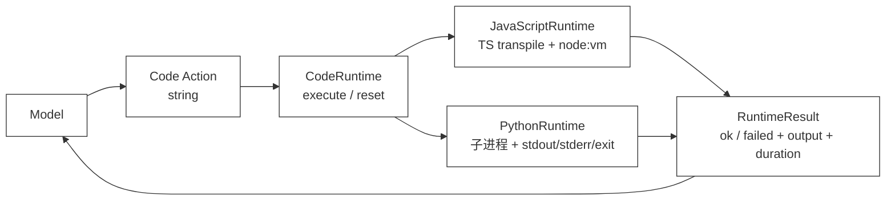

# 44 · Python Runtime

> <span class="stage-badge">Stage Hello RLM</span> · <span class="tag-badge">v44-python-runtime</span>

上一章我们把「执行模型代码」这件公共事务抽象成了 `CodeRuntime`：上层只认识 `execute(code) → RuntimeResult` 和 `reset()`，至于底下跑的是 JavaScript、Python 还是某个沙箱，调用方一概不关心。

但那一章我们只点亮了**一台**发动机——`JavaScriptRuntime`，它用 Node 的 `vm` 把 TypeScript 转译后跑在宿主进程里。问题立刻就来了：

- 模型如果更擅长写 Python（数据处理、科学计算、REPL 式探索），它生成的 Python 代码一个字都跑不了；
- `vm` 是**单语言、进程内**的，没法借到 Python 生态（pandas、标准库、本地脚本）；
- 更关键的是，`vm` 的超时是「同步循环被打断」，而真正生产级的代码执行往往是**一个独立的进程**。

> **这一章，我们给同一份 `CodeRuntime` 契约装上第二台发动机：PythonRuntime——它用子进程跑 Python，把 stdout / stderr / 退出状态翻译回统一的 `RuntimeResult`。**

我们会做四件事：

1. 复用上章的 `CodeRuntime` 契约，新增 `PythonRuntime` 实现；
2. 把「子进程的 stdout / stderr / 退出码」翻译为同一份 `RuntimeResult`；
3. 用 `__hr_main__()` 包装让用户代码能像 TypeScript 一样 `return` 结构化结果；
4. 把这条链路接进 `hello --chat --code-runtime python`，并支持真实模型生成 Python Code Action。

<!-- more -->

## 一、上一版存在什么问题？

上一章的 `JavaScriptRuntime` 已经能跑通「模型写代码 → Runtime 执行 → 结构化结果」的最小闭环，但它有三个绕不开的边界：

```text
Model
  ↓ Code string
JavaScriptRuntime
  ↓ vm + 最小 console
RuntimeResult
```

问题是：

- **只有一个语言引擎**：模型生成的 Python、Ruby、Shell 都跑不了，而很多数据/运维任务用 Python 写最自然；
- **进程内、单语言**：`vm` 跑在 Node 主进程里，既拿不到 Python 生态，也没有真正的进程隔离；
- **超时姿势单一**：`vm` 只能打断同步死循环，对真正的「长时间运行 + 外部 I/O」无能为力。

如果 CodeRuntime 永远只有一台 JS 发动机，那它和「只绑定 Python」并没有本质区别——只是换了个语言。契约的价值，恰恰在于**能并列长出多台发动机**。

## 二、本篇解决什么问题？

本章不改动 `CodeRuntime` 接口一行，只新增一个实现：`PythonRuntime`。它把模型生成的 Python 代码，交给一个**独立的 Python 解释器子进程**执行：

```text
Python source
      ↓ python3 -c（包裹 __hr_main__）
子进程 stdout / stderr / 退出码
      ↓ 翻译
RuntimeResult
```

它做三件具体的事：

1. **语言无关契约不变**：调用方还是 `execute(code) → RuntimeResult`；选 JavaScript 还是 Python，是实现的事（`createCodeRuntime(language)` 按语言挑实现）；
2. **子进程三要素翻译**：stdout、stderr、退出状态，分别落到 `RuntimeResult` 的对应字段；
3. **让 `return` 能回传值**：宿主把用户代码包进 `__hr_main__()`，再用一行哨兵把返回值写回 stdout，执行成功后剥掉哨兵、解析出 `value`。

仍然**不注入任何 Capability**：没有 `fs`、没有 `shell`、没有网络封装。模型此刻只能做内存计算——和上一章的 JS 发动机处于同一安全水位，只是语言换成了 Python。能力注入留给第 45 章。

## 三、先看最终效果

### 3.1 本地 Python 执行

先跑不需要 API Key 的确定性 demo：

```bash
$ node --import tsx examples/stage-5/44-python-runtime/demo.mts
```

输出会展示四件事：

```text
=== 44 · PythonRuntime：Python 子进程参考实现 ===
公共契约        : execute(code) → RuntimeResult；reset()
执行环境        : 独立 Python 解释器（一次执行一次退出）；宿主把代码包进 __hr_main__() 以便用 return 回传值

Python Code Action（return 字典）：
  python → completed · value={"count":3,"average":3333.3333333333335} · …ms
    stdout: {'services': ['api', 'worker', 'db'], 'average': 3333.3333333333335}

抛出异常被翻译为 RuntimeFailure：
  python → failed · ValueError: 故意抛错：演示失败如何收敛成 RuntimeResult · …ms
    stderr: Traceback (most recent call last):
  File "<string>", line 6, in <module>
  File "<string>", line 3, in __hr_main__
ValueError: 故意抛错：演示失败如何收敛成 RuntimeResult

同步死循环被 SIGKILL 收束：
  while True → failed · Python 执行超过 500ms，已强制终止子进程 · …ms
```

注意三点：

- `return` 出来的字典被收进了 `value`，而 `print` 的内容留在 `stdout`——和上一章 TypeScript 的 `console.log` / `return` 分工一致；
- 抛出的 `ValueError` 没有炸掉 Runtime，而是变成 `ok:false` 的 `RuntimeResult`，错误摘要取自 traceback 的最后一行；
- 死循环不再靠 `vm` 的同步超时，而是靠**杀掉子进程**（`SIGKILL`）来收束。

### 3.2 真实模型生成并执行 Python Code Action

复制 `.env.example` 为 `.env` 并配置一个 OpenAI 兼容端点后，显式加 `--live`：

```bash
$ node --import tsx --env-file-if-exists=.env examples/stage-5/44-python-runtime/demo.mts --live
```

这个 demo 只发起**一次**模型调用。系统提示要求模型：只返回 Python、在内存里准备 timeout 样本、按 service 聚合求平均、`print` 一行 JSON 摘要并 `return` 汇总字典。随后我们把返回文本直接交给 `PythonRuntime`。

一次真实验证中，模型生成了聚合程序，Runtime 返回：

```json
{
  "ok": true,
  "stdout": "{'services': ['api', 'worker', 'db'], 'average': 3333.3333333333335}",
  "stderr": "",
  "value": { "count": 3, "average": 3333.3333333333335 },
  "durationMs": 764
}
```

若模型返回不合法代码（语法错误、缩进错误、越界异常），失败也会按 `RuntimeResult` 原样展示，而不是悄悄吞掉。

> `--live` 是显式开关，避免读者随手运行 demo 时无意产生模型调用费用。

### 3.3 在 `hello --chat` 里体验

独立 demo 证明链路能跑之后，把它接进 CLI：

```bash
$ hello --chat --code-runtime python
```

这会进入与上一章同构的 **Code Action Chat** 循环，只是模型这轮只返回 Python，CLI 用 `PythonRuntime` 执行。例如输入：

```text
你 > 计算 21、34、55 三个数字的平均值，并给出结构化结果
```

一次真实运行得到：

```text
[model:end ] GLM-4.5-Flash · 172 in / 198 out · 8.8s
--- Code Action (python) ---
numbers = [21, 34, 55]
total = sum(numbers)
average = total / len(numbers)
print(f"数字 {numbers} 的平均值是 {average:.2f}")
return {"numbers": numbers, "sum": total, "average": average, "count": len(numbers)}
--- RuntimeResult ---
{
  "ok": true,
  "stdout": "数字 [21, 34, 55] 的平均值是 36.67",
  "value": { "numbers": [21, 34, 55], "sum": 110, "average": 36.666666666666664, "count": 3 }
}
```

可选参数与上一章完全一致：

```text
--code-runtime typescript | javascript | python  # 选择模型输出语言（必须配合 --chat 或 --resume）
--code-timeout <ms>                              # 单段 Code Action 最长执行时间，默认 1000ms
```

Code Action Chat 仍使用独立的 `.code-sessions/`、不支持 `--tui`，原因是上一章讲过的：它有自己的最小循环，不能把旧的 Tool Message 混进无 Tool Schema 的代码对话。

## 四、架构变化：同一份契约，第二台发动机

现在的主链路是：



目录只多了一个实现文件，契约和包结构都没变：

```text
packages/code-runtime/src/
  ├── runtime.ts        # CodeRuntime / RuntimeResult（上章）
  ├── javascript.ts     # JavaScriptRuntime 参考实现（上章）
  ├── python.ts         # 新增：PythonRuntime 参考实现
  └── index.ts          # 导出 + createCodeRuntime(language) 工厂
```

`code-runtime` 依旧不依赖 `core`、`ai` 或 `coding`。新增的 `createCodeRuntime(language, options)` 是个很薄的工厂：上层只说「我要 python」，工厂负责挑出 `PythonRuntime`；说「我要 typescript」，工厂挑出 `JavaScriptRuntime`。调用方始终拿着一个 `CodeRuntime`，不知道背后是哪台发动机。

## 五、核心抽象

### 5.1 契约完全复用

`CodeRuntime` 接口一字未改：

```ts
export interface CodeRuntime {
  execute(code: string): Promise<RuntimeResult>;
  reset(): Promise<void>;
}
```

这正是上一章坚持「语言是实现的属性，不是接口参数」的回报：`PythonRuntime` 和 `JavaScriptRuntime` 并列实现同一个接口，CLI 用工厂二选一，未来再加 `RubyRuntime`、`SandboxRuntime` 也不碰调用方。

### 5.2 子进程三要素 → RuntimeResult

`RuntimeResult` 的字段含义对两台发动机完全一致：

| 字段 | JavaScriptRuntime | PythonRuntime |
| --- | --- | --- |
| `stdout` | 捕获的 console.log | 捕获的子进程 stdout |
| `stderr` | 捕获的 console.warn/error | 捕获的子进程 stderr（含 traceback） |
| `value` | async IIFE 的 `return` | `__hr_main__()` 的 `return` |
| `error` | 异常摘要 | 退出码非 0 时的错误摘要（traceback 末行） |
| `durationMs` | Date.now() 差值 | Date.now() 差值 |

> **失败不是未处理异常，而是一种可以记录、展示并反馈给模型的正常结果**——这条原则从 Tool Result 延续到 Code Result，再到两台 Runtime，始终不变。

### 5.3 让 Python 也能 `return`：__hr_main__ 包装

Python 的“顶层”不能写 `return`，而我们希望模型像写 TypeScript 那样用 `return` 回传结构化结果。做法是在用户代码外包一层函数：

```python
import json, sys
def __hr_main__():
<用户代码，整体缩进 4 空格>
__hr_result = None
try:
    __hr_result = __hr_main__()
except BaseException as __hr_e:
    import traceback
    traceback.print_exc()
    sys.exit(1)
sys.stdout.write("\n__HARNESS_RESULT__" + json.dumps(__hr_result))
```

执行成功时，返回值被 `json.dumps` 后，紧跟哨兵 `__HARNESS_RESULT__` 写回 stdout。宿主在拿到 stdout 后：

- 把哨兵**之前**的内容当作用户真正的 `stdout`；
- 把哨兵**之后**的内容 `JSON.parse` 成 `value`。

这样模型写的 `return {...}` 就能对称地变成 `RuntimeResult.value`，和 TypeScript 发动机的体验完全一致。若模型没 `return`，`value` 为 `undefined`，也不报错。

### 5.4 超时：杀掉进程，而不是打断循环

同步死循环在 `vm` 里靠 `timeout` 参数打断；在子进程里则靠**定时器 + `child.kill("SIGKILL")`**：

```ts
const timer = setTimeout(() => {
  done({ kind: "timeout" });
  child.kill("SIGKILL");
}, timeoutMs);
```

这意味着只要超时，子进程一定被强制结束——既不会永久挂住 demo，也为未来真正的「取消传播」埋了第一颗种子（虽然此刻 I/O 取消仍不完整，见第九节）。

## 六、第二台发动机：PythonRuntime

### 6.1 找得到解释器吗？

不同机器上 Python 命令可能是 `python3` 也可能是 `python`。Runtime 默认依次尝试 `python3` → `python`，只有全部找不到时才返回一条友好的 `RuntimeFailure`：

```ts
const commands = this.command ? [this.command] : ["python3", "python"];
for (const command of commands) {
  const outcome = await runProcess(command, script, this.timeoutMs, output);
  if (outcome.kind === "spawn-error") {
    if (command === commands[commands.length - 1]) {
      return finish({ ok: false, stdout: "", stderr: "", error: `找不到可用的 Python 解释器：${outcome.message}` });
    }
    continue; // 试下一个命令
  }
  // ...翻译为成功或失败
}
```

### 6.2 跨平台编码的坑：强制 UTF-8

这是一个容易被忽略、却会让中文全变乱码的细节：在 Windows 上，Python 子进程的 stdout/stderr 默认按系统locale（如 GBK）编码，而宿主按 UTF-8 读取，于是 ValueError 的中文信息会变成一堆问号。

解决方式是在 spawn 时强行把 Python 切到 UTF-8 模式：

```ts
const child = spawn(command, ["-X", "utf8", "-c", script], {
  stdio: ["ignore", "pipe", "pipe"],
  env: { ...process.env, PYTHONIOENCODING: "utf-8" },
});
```

`-X utf8` 让解释器整体走 UTF-8，再显式设 `PYTHONIOENCODING` 兜底 I/O 编码。这样无论是模型返回的报错信息，还是 `print` 的中文摘要，都能原样回到 `RuntimeResult`。

### 6.3 退出状态 → 成功 / 失败

子进程正常退出（码 0）就当作成功；非 0 就当作失败，错误摘要优先取 stderr 的**最后一行**（恰好是 `ExceptionType: message`）：

```ts
function extractError(stderr: string, code: number): string {
  const lines = stderr.split("\n").map((l) => l.trim()).filter(Boolean);
  const last = lines[lines.length - 1];
  return last ? last : `Python 进程以退出码 ${code} 结束`;
}
```

异常分支里我们故意 `traceback.print_exc()` 后 `sys.exit(1)`，于是 stderr 保留了完整堆栈，既方便排错，又不让错误摘要丢失上下文。

### 6.4 `node:vm` 不是沙箱，子进程也不是

上章的警告这里同样成立，而且更重要：**子进程比 `vm` 多了一层进程隔离，但它看得见本机文件系统和网络**。如果模型写 `open('/etc/passwd')`，在标准 Python 环境里是真的能读到的。

所以当前 PythonRuntime 依旧通过「不注入任何 Capability」来缩小攻击面：没有文件系统 API、没有 shell 封装、没有网络封装。真正的安全边界要靠第 45 章的受控 Capability 注入，或生产级的容器 / 远程执行服务来补齐。

## 七、真实模型体验：从文本到可运行 Python Code Action

### 7.1 一次性体验：`demo.mts`

`demo.mts` 的关键代码很短：

```ts
const model = createOpenAIModel();
const response = await model.generate({
  messages: [systemMessage("只输出可执行 Python 代码"), userMessage("生成 timeout 审计程序")],
});

const code = extractCode(response.content);
const runtime = new PythonRuntime({ timeoutMs: 1_000 });
const result = await runtime.execute(code);
```

它复用现有的 `@hello-harness/ai` Provider 抽象；`code-runtime` 自己不 import OpenAI。换成别的 OpenAI 兼容端点、Anthropic 或本地模型时，只需替换 Model 层，执行 Runtime 不动。

体验时可以故意改用户任务，观察两种结果：

- 模型正确生成代码：看 `stdout` 与 `value`；
- 模型生成不合法或越界的代码：看 `RuntimeFailure.error` 与 `stderr`。

### 7.2 日常模式：接入 `hello --chat` 的 Code Action Chat

CLI 侧不需要为 Python 另写一套循环——`code-chat.ts` 通过工厂按语言挑发动机，系统提示也随语言切换（Python 用 `print`、提醒 `return`）：

```ts
const runtime = createCodeRuntime(options.language, { timeoutMs: options.codeTimeoutMs ?? 1_000 });
```

观察回写、会话隔离（`.code-sessions/`）、`withGuard` 守卫、`--code-runtime` 必须配合 `--chat/--resume` 等边界，都与上一章的 TypeScript 模式完全一致；差别只在「底下跑的是哪台发动机」。这正是 `CodeRuntime` 契约想要的效果——**换引擎不换循环**。

## 八、新架构解决了什么？

1. **契约长出第二台发动机**：同一份 `CodeRuntime`，`JavaScriptRuntime` 与 `PythonRuntime` 并列实现、独立替换；
2. **子进程三要素被翻译**：stdout / stderr / 退出状态，收敛为和 JS 发动机同构的 `RuntimeResult`；
3. **Python 也能 `return`**：`__hr_main__()` 包装 + 哨兵行，让结构化结果对称地回到 `value`；
4. **结果可观察且一致**：成功、异常、超时（SIGKILL）都收敛为 `RuntimeResult`，错误摘要取自 traceback 末行；
5. **跨平台编码已处理**：`-X utf8` + `PYTHONIOENCODING` 让中文不再变乱码；
6. **换引擎不换循环**：CLI 用工厂挑实现，Code Action Chat 的系统提示、观察回写、会话隔离全部复用；
7. **安全面仍然小**：当前只给标准 Python 内存环境，没有文件、网络或 Shell，真实模型无法直接触及本机。

## 九、它又引入了什么问题？

这一版已经真的能跑 Python 了，但离 Coding Agent 的实际代码执行环境还有距离：

1. **子进程不是安全沙箱**：Python 看得见本机文件系统和网络，`open()` 真实可读，绝不能当执行攻击者代码的生产方案；
2. **`return` 依赖包装**：模型必须 `return` 才能拿到 `value`，顶层表达式不会自动成为结果；这层 `__hr_main__()` 包装是教学取舍，不是 Python 的天然语义；
3. **没有 Capability**：模型代码还不能受控调用 workspace 文件、Shell、Git、搜索或 Skill；
4. **`vm` 不是安全沙箱（旧债仍在）**：上一章的 JavaScriptRuntime 同样没解决不可信代码问题；
5. **超时不等于完全取消**：同步循环会被 SIGKILL，但已发起的外部 I/O 是否被真正中止，仍取决于子进程内部；
6. **没有持久状态**：每次 `execute` 起一个全新解释器，变量不会跨执行保留；
7. **依赖本机 Python**：环境没装解释器时只能返回友好的 `RuntimeFailure`，无法降级到其他发动机；
8. **尚末接入既有 `AgentRuntime`**：Code Action Chat 仍走自己的最小循环，两种 Runtime 的统一编排还要靠后续 RLM 章节继续收束。

## 十、下一章

我们已经有了一份不绑定语言的 `CodeRuntime` 契约，也有了 JavaScript / TypeScript 与 Python 两台参考发动机。但这两台发动机现在都只给模型「内存计算」——没有文件、没有 Shell、没有 Git。

下一章就给 Runtime 装上**能力空间**：把 `fs`、`shell`、`git`、`search` 这些受控 Capability 注入到执行环境里，让模型写的代码可以直接调用它们。

```text
CodeRuntime
   ├── JavaScriptRuntime   # 上章：TS transpile + vm
   └── PythonRuntime       # 本章：Python 子进程
          ↓ 下一章注入能力
   fs / shell / git / search / skills / agents
```

第 45 章会回答一个关键问题：能力该以什么形式「注入」给代码，又不让模型越界？——是全局变量、是显式 import，还是一套受权限门约束的 API？这正是 Capability Runtime 要定义的边界。

> 尽信书则不如，以上内容纯属一家之言，因个人能力有限，难免有疏漏和错误之处，如发现 bug 或者有更好的建议，欢迎批评指正，不吝感激 🙃

欢迎点赞、关注公众号「一灰灰Blog」 我们 ch45 见真章

---

微信公众号: 一灰灰Blog
