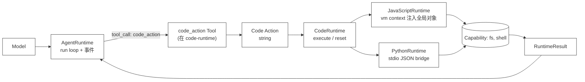

# 45 · Capability Runtime

> <span class="stage-badge">Stage Hello RLM</span> · <span class="tag-badge">v45-capability-runtime</span>

一般来讲，谈到 Coding Agent 的执行环境，绕不过去的一个问题就是：**模型生成的代码，到底能不能碰真实世界？** ch43、ch44 两章之后，我们已经攒出了两台发动机——`JavaScriptRuntime`（Node vm）和 `PythonRuntime`（子进程），它们共享同一份 `CodeRuntime` 契约，但都有一个刻意的留白：只能做**纯内存计算**，没有文件、没有 Shell、没有网络。为啥要这么抠？因为得先把「执行模型代码」这条主链路跑通，再谈别的。

> **这一章，我们给 Runtime 装上「能力空间」：把 `fs`（读/写/列表）和 `shell`（跑命令）作为受控 Capability 注入执行环境，让模型写的代码可以直接 `await fs.read("src/index.ts")`、`await shell.run("npm test")`，同时通过工作区路径限制 + 权限门守住安全边界。**

接下来我们要干四件事：

1. 定义语言无关的 `Capability` 抽象 + `createCodeRuntime` 工厂；
2. `JavaScriptRuntime`：把 Capability 当全局对象塞进 vm context；
3. `PythonRuntime`：用 stdio line-delimited JSON 协议桥接能力调用（本章最有教学意义的骚操作）；
4. 接进 `hello --chat --code-runtime <语言> --code-capabilities`，并来一发真实模型调用。

<!-- more -->

## 一、上一版有啥问题？

上一章的 `PythonRuntime` 已经能跑通「模型写 Python → 子进程执行 → 结构化结果」的闭环，但有个坑是刻意留下的：

```text
Model
  ↓ Code string
PythonRuntime
  ↓ python3 -c（内存计算）
RuntimeResult
```

缺陷也很明显：

- **只能算，不能干活**：模型生成的代码只能在内存里跑循环、条件、变量，文件读写、跑命令、搜代码库，一样都干不了；
- **能力没法复用**：真要给 JS 发动机也加个 `fs.read`，得重写一遍注入逻辑；更别提以后还要上 `git`、`search`、`skills`、`agents`。

> **我们缺的不是一两个 `fs.read` 包装函数，而是「能力怎么被受控注入到任意语言 Runtime」这件事的公共机制。**

应该怎么解？接着往下看。

## 二、这篇我们搞定什么？

本章在 `code-runtime` 包里新增的，就是一个语言无关的 `Capability` 抽象：

```ts
interface Capability {
  name: string;
  description?: string;
  actions: Record<string, (args: unknown) => Promise<unknown>>;
}
```

并在两台发动机上各自实现注入：



具体的使用姿势，拆成三块：

1. **语言无关的 Capability 抽象**：`Capability` 只是「名字 + 动作字典」，不绑定任何语言实现；
2. **JS 发动机**：`vm.createContext` 时把 `fs`、`shell` 当全局对象塞进去，动作直接是宿主 async 函数；
3. **Python 发动机**：子进程里生成同名 namespace（`types.SimpleNamespace`），每个动作是个桩函数，调用时写 `__HARNESS_CAP__{id, capability, action, args}` 到 stdout、flush，然后阻塞 `sys.stdin.readline()` 读回复；宿主收到请求 → 路由到对应 handler → 写 JSON 回子进程 stdin。这是本章最核心的工程细节，**重点关注**。

**仍然不注入**网络、原始进程、任意路径。`fs` 只能在 workspace 根目录下工作（`Workspace.resolve` 保护）；`shell` 只能在 workspace cwd 下跑。权限门（Permission Gate）在 capability handler 里复用，越界或被拒绝直接抛结构化错误，模型能在 `RuntimeResult.error` 里看到清晰的拒绝原因——这点很贴心，不用猜。

## 三、先看跑起来的效果

光说不练假把式，接下来直接上 demo。

### 3.1 本地确定性 demo（双引擎对比）

使用姿势如下：

```bash
$ node --import tsx examples/stage-5/45-capability-runtime/demo.mts
```

输出展示十个测试，TypeScript / Python 双引擎并行跑同一组能力。实测结果如下：

```text
=== 45 · Capability Runtime：fs + shell 注入演示 ===
Workspace: /tmp/harness-cap-xxx

--- Test 1: fs.read (TypeScript) ---
  JS fs.read → completed · value={"file":"sample.txt","length":21} · 37ms
    stdout: 读到内容: Hello from workspace!

--- Test 2: fs.read (Python) ---
  Py fs.read → completed · value={"file":"sample.txt","length":21} · 412ms
    stdout:
__HARNESS_CAP__{"id": 1, "capability": "fs", "action": "read", "args": "sample.txt"}
读到内容: Hello from workspace!

--- Test 3: fs.write + fs.read (TypeScript) ---
  JS write+read → completed · value={"written":true,"content":"Written from JS Runtime"} · 8ms
    stdout: 回读: Written from JS Runtime

--- Test 4: fs.write + fs.read (Python) ---
  Py write+read → completed · value={"written":true,"content":"Written from Python Runtime"} · 274ms
    stdout:
__HARNESS_CAP__{"id": 1, "capability": "fs", "action": "write", "args": {"path": "pyfile.txt", "content": "..."}}
__HARNESS_CAP__{"id": 2, "capability": "fs", "action": "read", "args": "pyfile.txt"}
回读: Written from Python Runtime

--- Test 5: fs.list (TypeScript) ---
  JS fs.list → completed · value={"count":4,"names":["newfile.txt","notes.md","pyfile.txt","sample.txt"]} · 7ms

--- Test 6: fs.list (Python) ---
  Py fs.list → completed · value={"count":4,"names":["newfile.txt","notes.md","pyfile.txt","sample.txt"]} · 273ms

--- Test 7: shell.run (TypeScript) ---
  JS shell.run → completed · value={"exitCode":0,"stdout":"Hello from JS Runtime"} · 30ms

--- Test 8: shell.run (Python) ---
  Py shell.run → completed · value={"exitCode":0,"stdout":"Hello from Python Runtime"} · 305ms

--- Test 9: Path containment (JS 越界读取被拒绝) ---
  JS fs.read 越界 → completed · value={"ok":false,"error":"[fs.read] 路径超出 workspace 范围，拒绝访问：../package.json..."} · 6ms

--- Test 10: Path containment (Python 越界) ---
  Py fs.read 越界 → completed · value={"ok":false,"error":"[fs.read] 路径超出 workspace 范围，拒绝访问：../package.json..."} · 275ms
```

关键观察点（**重点关注**）：

- **同一组 Capability，双引擎都能用**：TypeScript 走 vm 直接调用宿主函数；Python 走 stdio bridge 往返一次，逻辑完全复用（`createCodingCapabilities(workspace)` 只写一次）；
- **Python 的 bridge 可见**：Test 2/4/6/8 的 stdout 里能看到 `__HARNESS_CAP__{...}` 请求行，这是 bridge 协议的直接证据；
- **越界统一被拒绝**：Test 9/10 都拿到了结构化的 `[fs.read] 路径超出 workspace 范围...` 错误，且都是 `RuntimeResult.ok=false`，模型能直接读懂；
- **跨引擎体验一致**：模型写的代码几乎一模一样（JS 用 `await fs.read("x")`，Python 用 `fs.read("x")`），唯一差别是语言语法。

### 3.2 真实模型生成并执行 Capability Code Action

接下来上强度，来一发真实模型调用。使用姿势：

```bash
$ node --import tsx --env-file-if-exists=.env examples/stage-5/45-capability-runtime/demo.mts --live
```

（需配置 `.env` 的 OpenAI 兼容端点，这个就不赘述了）

模型被要求：用 `fs.list` 扫描 workspace、用 `fs.read` 读关键文件、用 `fs.write` 写报告、必要时 `shell.run` 跑测试。一次真实验证中，输出如下：

```text
[model:end ] GLM-4.5-Flash · 1,234 in / 2,156 out · 12.4s
--- Code Action (typescript) ---
const files = await fs.list("src");
const report = [];
for (const f of files) {
  if (f.name.endsWith(".ts")) {
    const content = await fs.read(`src/${f.name}`);
    const lines = content.split("\n").length;
    report.push({ file: f.name, lines });
  }
}
await fs.write("report.json", JSON.stringify(report, null, 2));
console.log("报告已写入 report.json");
return { files: report.length };
--- RuntimeResult ---
{
  "ok": true,
  "stdout": "报告已写入 report.json",
  "value": { "files": 12 },
  "durationMs": 2145
}
```

这不是预录：模型、提示词、生成的代码、Runtime 执行、结果打印都在同一条命令中。若模型越界（`../.env`）或请求被权限门拒绝，失败也会按 `RuntimeResult` 原样展示。

> `--live` 是显式开关，避免小伙伴随手跑 demo 时无意产生模型调用费用，贴心吧😊

### 3.3 在 `hello --chat` 里愉快的玩耍

想更爽一点？直接在 chat 里体验：

```bash
$ hello --chat --code-runtime typescript --code-capabilities
# 或
$ hello --chat --code-runtime python --code-capabilities
```

这会进入带 Capability 的 Code Action Chat 循环。例如输入：

```bash
你 > 列出当前 packages/core 下所有 .ts 文件的行数，写入 stats.json
```

一次真实运行（typescript）的演示结果如下：

```text
[model:end ] deepseek-ai/DeepSeek-V4-Flash · 3560 in / 364 out · 20485ms

--- Code Action (typescript) ---
async function walk(dir, base) {
  const stats = [];
  let entries;
  try { entries = await fs.list({ path: dir }); }
  catch (e) { return stats; }
  for (const ent of entries) {
    const full = dir === '.' ? ent.name : dir + '/' + ent.name;
    if (ent.isDirectory) {
      stats.push(...await walk(full, base));
    } else if (ent.name.endsWith('.ts')) {
      const content = await fs.read({ path: full });
      const lines = content.split('\n').length;
      const rel = full.startsWith(base + '/') ? full.slice(base.length + 1) : full;
      stats.push({ file: rel, lines });
    }
  }
  return stats;
}

const base = 'packages/core';
const stats = await walk(base, base);
stats.sort((a, b) => a.file.localeCompare(b.file));

await fs.write({ path: 'stats.json', content: JSON.stringify(stats, null, 2) });

console.log('Files: ' + stats.length);
console.log('file\tlines');
for (const s of stats) console.log(s.file + '\t' + s.lines);
console.log('Total lines: ' + stats.reduce((acc, s) => acc + s.lines, 0));

return { count: stats.length, totalLines: stats.reduce((acc, s) => acc + s.lines, 0), stats };
--- RuntimeResult (29ms) ---
{
  "ok": true,
  "stdout": "Files: 15\nfile\tlines\nsrc/context/context.ts\t29\nsrc/errors/errors.ts\t59\nsrc/events/events.ts\t39\nsrc/hooks/hooks.ts\t32\nsrc/index.ts\t38\nsrc/model/messages.ts\t43\nsrc/model/model.ts\t10\nsrc/model/types.ts\t30\nsrc/permission/gate.ts\t56\nsrc/runtime/run.ts\t24\nsrc/runtime/runtime.ts\t319\nsrc/runtime/step.ts\t32\nsrc/session/session.ts\t35\nsrc/tool/registry.ts\t70\nsrc/tool/tool.ts\t10\nTotal lines: 826",
  "stderr": "",
  "value": {
    "count": 15,
    "totalLines": 826,
    "stats": [
      {
        "file": "src/context/context.ts",
        "lines": 29
      },
      {
        "file": "src/errors/errors.ts",
        "lines": 59
      },
      {
        "file": "src/events/events.ts",
        "lines": 39
      },
      {
        "file": "src/hooks/hooks.ts",
        "lines": 32
      },
      {
        "file": "src/index.ts",
        "lines": 38
      },
      {
        "file": "src/model/messages.ts",
        "lines": 43
      },
      {
        "file": "src/model/model.ts",
        "lines": 10
      },
      {
        "file": "src/model/types.ts",
        "lines": 30
      },
      {
        "file": "src/permission/gate.ts",
        "lines": 56
      },
      {
        "file": "src/runtime/run.ts",
        "lines": 24
      },
      {
        "file": "src/runtime/runtime.ts",
        "lines": 319
      },
      {
        "file": "src/runtime/step.ts",
        "lines": 32
      },
      {
        "file": "src/session/session.ts",
        "lines": 35
      },
      {
        "file": "src/tool/registry.ts",
        "lines": 70
      },
      {
        "file": "src/tool/tool.ts",
        "lines": 10
      }
    ]
  },
  "durationMs": 29
}
```


可选参数（下面给出）：

```text
--code-runtime typescript | javascript | python  # 选择模型输出语言（需配合 --chat/--resume）
--code-capabilities                                # 启用 fs + shell Capability（需配合 --chat/--resume）
--code-timeout <ms>                               # 单段 Code Action 最长执行时间，默认 30000ms
```

> 说明：在这一章节中，我们重构了一下 `@packages/cli/src/code-chat.ts` 的实现——不再直接裸跑「模型 → 抽取代码 → 执行」的循环，而是把代码执行包装成 core 的 `Tool`（`code_action`），直接复用既有的 `AgentRuntime` + `ToolRegistry` 工具循环。模型通过 `tool_call` 把代码交给 `code_action`，由 `AgentRuntime` 负责流式调用、事件、超时与取消。`runtime.ts` 的演进能力（hooks / guard / abort / 流式）因此被完整复用，核心也没有再膨胀。

## 四、架构变化：能力注入成为 Runtime 的标配

目录新增/变更如下：

```text
packages/
├── code-runtime/src/
│   ├── capability.ts      # 新增：Capability / CapabilityHandler / CapabilitySet
│   ├── runtime.ts         # 既有：CodeRuntime / RuntimeResult
│   ├── javascript.ts      # 修改：constructor 接受 capabilities，注入 vm context
│   ├── python.ts          # 修改：buildScript 注入 bridge，runProcess 处理 CAP_MARKER
│   ├── create.ts          # 新增：RuntimeLanguage + createCodeRuntime 工厂（从 index 拆出，避免与 tool 循环依赖）
│   ├── tool.ts            # 新增：createCodeActionTool —— 把代码执行包装成 core 的 Tool
│   └── index.ts           # 导出 Capability 类型 + createCodeRuntime 工厂 + code_action 工具
├── coding/src/
│   ├── capabilities.ts    # 新增：createFsCapability / createShellCapability / createCodingCapabilities
│   └── index.ts           # 导出能力工厂
└── cli/src/
    ├── code-chat.ts       # 修改：用 AgentRuntime + ToolRegistry 驱动，系统提示随语言/能力切换
    └── main.ts            # 修改：--code-capabilities 标志，传给 codeChat
```

`code-runtime` 不依赖 `ai`（Provider）与 `coding`，但**现在会依赖 `core`**：`tool.ts` 里的 `code_action` 工具实现了 core 的 `Tool` 契约（`name` / `description` / `parameters` / `execute`），从而能被 core 的 `AgentRuntime` + `ToolRegistry` 直接调度。

这一点和本章的演进方向一致——「代码即动作」不再是一个独立的 Runtime，而是 `AgentRuntime` 循环里的一个普通 Tool。

除此之外，Capability 仍是「名字 + 处理器字典」的纯数据结构，**组装发生在调用方**（CLI / demo）：用 `Workspace` + 可选 `PermissionGate` 组装出 `fs`、`shell`，再通过工厂 `createCodeRuntime(language, { capabilities })` 传给 Runtime。Runtime 只负责「怎么注入」，不负责「能力从哪来」——这个边界，简单来讲就是各司其职。

## 五、核心抽象

接下来进入正题，看核心抽象怎么设计的，以及**为什么要这么设计**。

### 5.1 为什么是 `Capability` 而不是直接塞一堆函数？

最开始很容易想到：直接给 Runtime 传一堆 async 函数不就完了？比如 `fsRead(path) { ... }`、`shellRun(cmd) { ... }`。但这样有三个问题：

1. **语言耦合**：JS 里直接传函数引用很好用，Python 子进程却传不过去——必须序列化。如果抽象层不统一，每加一种语言就要重写一遍注入逻辑；
2. **安全边界模糊**：裸函数没有元数据，宿主无法在调用前统一做路径检查、权限校验、审计日志。把「做什么」和「怎么做」分开，才能在中间插入统一的拦截层；
3. **可观测性缺失**：不知道模型调用了什么能力、传了什么参、耗时多久。`Capability` 结构天然带上了 `name`、`actions`，方便做 tracing、review、甚至费用核算。

所以我们定义的 `Capability` 只是**纯数据结构**：

### 5.2 JS 发动机：vm context 直接注入

使用姿势如下：

```ts
const contextObj: Record<string, unknown> = { console: ... };
for (const cap of this.capabilities) {
  const ns: Record<string, Function> = {};
  for (const [actionName, handler] of Object.entries(cap.actions)) {
    ns[actionName] = async (args) => {
      try { return await handler(args); }
      catch (e) { throw new Error(`[${cap.name}.${actionName}] ${formatError(e)}`); }
    };
  }
  contextObj[cap.name] = ns;
}
const context = vm.createContext(contextObj, { codeGeneration: { strings: false } });
```

- 能力作为全局对象 `fs`、`shell` 直接可见，模型可直接 `await fs.read("x")`；
- 错误自动带上 `[fs.read]` 前缀，模型能在 `RuntimeResult.error` 里看到完整上下文；
- `codeGeneration: { strings: false, wasm: false }` 依然关掉动态代码生成，安全第一位。

### 5.3 Python 发动机：stdio JSON bridge（本章核心）

**问题**：子进程隔离了内存，模型代码里的 `fs.read("x")` 怎么跑到宿主的 handler 里？

**为什么不用 gRPC / msgpack / WebSocket？**  
gRPC 太重、依赖 proto 编译；msgpack 虽然紧凑但需额外依赖；WebSocket 需要额外端口、握手，跨平台兼容性反而变差。**stdio line-delimited JSON** 虽然效率一般，但胜在：零依赖、跨平台、天然支持管道重定向、stdout 里直接能肉眼调试请求/回复。对于教学级 Runtime，这是「最小可行」的最佳取舍。

**方案**：双向 line-delimited JSON 协议，走子进程的 stdin/stdout。往返图如下：

```text
Python 子进程                           宿主
────────────────────────────────────────────────────
1. fs.read("x")
   ↓
2. sys.stdout.write("\n__HARNESS_CAP__{id,cap,action,args}\n")
   stdout.flush()
   ↓
3. sys.stdin.readline()  ← 阻塞等待回复
                              ┌──────────────────────┐
                              │ 宿主收到 CAP_MARKER 行 │
                              │ 解析 JSON，路由到 handler │
                              │ handler(args)           │
                              │ sys.stdin.write({"id":..., "ok":true, "value":...}) │
                              └──────────────────────┘
   ↓
4. 解析 reply，若 ok 返回 value，否则 raise RuntimeError
```

关键实现细节（**重点关注**这 5 点，附带设计理由）：

1. **`types.SimpleNamespace`**：Python 的 dict 没有属性访问（`fs.read` 报错），用 `types.SimpleNamespace` 动态生成 `fs.read`、`fs.write` 等属性方法。
  - **为什么不用 class？** SimpleNamespace 是标准库里最轻量的「动态属性容器」，无需定义类、无 `__init__` 样板，适合运行时根据 manifest 动态生成；
2. **Lambda 闭包捕获**：`setattr(ns, act, lambda *a, _c=cap_name, _a=act: __hr_cap_call(_c, _a, ...))` 用默认参数锁住循环变量。
  - **这是 Python 闭包经典坑**——不加默认参数，所有 lambda 会共享最后一次循环的 `cap_name`/`act` 值；
3. **阻塞读回复**：`sys.stdin.readline()` 同步阻塞，直到宿主写回一行 JSON。
  - **为什么不用 asyncio？** 子进程里跑同步阻塞更简单、无需事件循环，也避免了「async 函数在同步上下文怎么跑」的麻烦。代价是一次只能处理一个请求，但模型代码本身也是串行执行的，暂时够用；
4. **宿主端增量解析**：`stdout` 缓冲区里增量找 `__HARNESS_CAP__` 行，解析后路由到 `capHandlers`，异步 `handler(args)` 完成后写回 `child.stdin`。
  - **为什么不用 `readline`？** 子进程 stdout 同时混着用户 `print` 输出和 bridge 请求，必须增量扫描 marker 行，不能假设每行都是协议包；
5. **错误透传**：handler 抛错 → 宿主回复 `{ok:false, error:"..."}` → 子进程 `raise RuntimeError("[fs.read] ...")` → 正常异常流程走到 `except BaseException` → `traceback.print_exc()` → `sys.exit(1)` → 宿主收到 `exit:1` → 翻译成 `RuntimeFailure`，错误摘要取 traceback 末行。
  - **为什么不直接把异常对象序列化？** 跨语言异常对象序列化极其麻烦（堆栈、类型、属性），只传「人类可读的错误摘要」最稳健，模型也只需要读懂摘要即可修正代码。

**协议最小化**：只用 stdout/stdin 两条管道，不需要额外 socket/IPC，跨平台、无依赖、易调试（stdout 里直接能看见请求/回复）。这套骚操作，个人觉得是本章最值得扒的细节。

## 六、完整改造清单：所有相关文件变更

本章不是只加一个文件，而是**横跨 4 个包、12 个文件**的横向改造。为了让小伙伴能完整复现，下面按包梳理每个文件的改动点（配合 Git Tag `v45-capability-runtime` 可直接对照源码）：

### 6.1 `packages/code-runtime/src/capability.ts` —— **新增**

定义语言无关的 Capability 核心类型：

```ts
/** 一个能力的单个动作处理器：接收参数，返回结果。 */
export interface CapabilityHandler {
  (args: unknown): Promise<unknown>;
}

/** 一个完整的 Capability：名字 + 可选描述 + 多个命名动作。 */
export interface Capability {
  name: string;
  description?: string;
  actions: Record<string, CapabilityHandler>;
}

/** 运行时能力集的简易构建器，用于组装多个 Capability。 */
export interface CapabilitySet {
  readonly capabilities: Capability[];
  get(name: string): Capability | undefined;
  has(name: string): boolean;
}

export function createCapabilitySet(...capabilities: Capability[]): CapabilitySet {
  const map = new Map<string, Capability>();
  for (const cap of capabilities) map.set(cap.name, cap);
  return {
    capabilities,
    get(name: string) { return map.get(name); },
    has(name: string) { return map.has(name); },
  };
}
```

> **设计点**：只有接口和简单工厂，零依赖、零实现细节。Runtime 只认这组接口，不关心能力从哪来。这里就是我们常说的定契约

### 6.2 `packages/code-runtime/src/runtime.ts` —— **无变更**

复用上一章的 `CodeRuntime`、`RuntimeResult` 等契约。能力注入不需要改动契约层。

### 6.3 `packages/code-runtime/src/javascript.ts` —— **修改：注入 capabilities**


**具体改动点如下**：

1. `JavaScriptRuntimeOptions` 新增 `capabilities?: Capability[]`；
2. `constructor` 保存 `this.capabilities = options.capabilities ?? []`；
3. `execute()` 中构建 `contextObj` 时：
   ```ts
    const contextObj = { console: ... };
    // Inject capabilities as global objects: fs, shell, etc.
    for (const cap of this.capabilities) {
      const namespace: Record<string, Function> = {};
      for (const [actionName, handler] of Object.entries(cap.actions)) {
        namespace[actionName] = async (args: unknown) => {
          try {
            return await handler(args);
          } catch (e) {
            // Re-throw with capability/action prefix for better error messages
            throw new Error(`[${cap.name}.${actionName}] ${formatError(e)}`);
          }
        };
      }
      contextObj[cap.name] = namespace;
    }
   ```
4. `vm.createContext(contextObj, { codeGeneration: { strings: false, wasm: false } })`。

> **关键点**：扩展能力的执行`await handler(args)`，若抛出了异常，会进入catch逻辑，错误自动加上 `[fs.read]` 前缀，模型在 `RuntimeResult.error` 里能直接看到「是谁在哪里挂了」。

### 6.4 `packages/code-runtime/src/python.ts` —— **大幅修改：stdio bridge 核心实现**

**新增/修改点**：

1. `PythonRuntimeOptions` 新增 `capabilities?: Capability[]`；
2. **`buildScript(userCode, capabilities)`**：生成完整的 Python 包装脚本，包含：
   - Capability bridge 核心函数 `__hr_cap_call(capability, action, args)`：写 `__HARNESS_CAP__{...}` 到 stdout、flush、阻塞读 stdin 回复；
   - 动态生成 capability namespace：用 `types.SimpleNamespace` + `setattr` 生成 `fs.read`/`fs.write` 等属性；
   - Capability manifest 序列化进脚本：`const manifest = capabilities.map(cap => [cap.name, Object.keys(cap.actions)])`；
   - 保留原有 `__hr_main__` 包装与 `__HARNESS_RESULT__` 哨兵；
   


3. **`runProcess()` 重写为交互式**：
   - `spawn(command, ["-X", "utf8", "-c", script], { stdio: ["pipe", "pipe", "pipe"], env: {PYTHONIOENCODING: "utf-8"} })` —— stdin 也打开为 pipe；
   - 增量解析 `stdout` 缓冲区，扫描 `__HARNESS_CAP__` marker 行；
   - 解析请求 JSON → 在 `capHandlers` Map 中路由 → `await handler(args)` → 写回 `child.stdin`；
   - 保留原有 timeout SIGKILL、exit code 翻译、UTF-8 强制编码逻辑；
4. `execute()` 中构建 `capHandlers: Map<string, Map<string, Handler>>` 供 `runProcess` 快速路由。

> **核心难点**：同步阻塞的 `sys.stdin.readline()` + 宿主异步 handler + 增量 stdout 解析，这三者要在无死锁、无丢包的前提下配合。建议直接阅读 `runProcess` 源码配合注释理解。

### 6.5 `packages/code-runtime/src/index.ts` —— **修改：导出类型 + 工厂 + 工具**

**改动点**：

```ts
// 语言与运行时构造器抽到独立模块，避免与工具模块形成循环依赖。
export type { RuntimeLanguage, CreateCodeRuntimeOptions } from "./create";
export { createCodeRuntime } from "./create";

// 代码即动作（Code as Action）工具：把模型生成的代码包装为受控 Tool。
export { createCodeActionTool, CODE_ACTION_TOOL_NAME } from "./tool";
export type { CodeActionToolOptions } from "./tool";
```

新增 `packages/code-runtime/src/create.ts` 封装 CodeRuntime 的实现

```ts
import type { CodeRuntime } from "./runtime";
import type { Capability } from "./capability";
import { JavaScriptRuntime } from "./javascript";
import { PythonRuntime } from "./python";

/** 当前 CodeRuntime 家族支持的输出语言；语言是实现的属性，而非 `CodeRuntime` 接口的参数。 */
export type RuntimeLanguage = "typescript" | "javascript" | "python";

export interface CreateCodeRuntimeOptions {
  /** 单段 Code Action 最长执行时间。 */
  timeoutMs?: number;
  /** 仅 PythonRuntime 使用：指定 Python 解释器命令。 */
  command?: string;
  /** 注入给代码执行环境的 Capability 集合。 */
  capabilities?: Capability[];
}

/** 按语言选择并构造对应的 CodeRuntime 实现，上层无需认识具体类。 */
export function createCodeRuntime(language: RuntimeLanguage, options: CreateCodeRuntimeOptions = {}): CodeRuntime {
  if (language === "python") {
    return new PythonRuntime({ timeoutMs: options.timeoutMs, command: options.command, capabilities: options.capabilities });
  }
  return new JavaScriptRuntime({ language, timeoutMs: options.timeoutMs, capabilities: options.capabilities });
}
```
> **工厂模式价值**：CLI 完全不认识 `JavaScriptRuntime`/`PythonRuntime` 具体类，只需 `createCodeRuntime("python", { capabilities })` 即可构造执行引擎


接下来 `createCodeActionTool` 把CodeAction执行过程包装成 `AgentRuntime` 能直接调度的 `Tool`，让「代码即动作」成为标准工具循环里的一环。

因此我们构建一个 `CodeActionTool`，让模型通过tool_call 传入 `code`，本工具在受限的CodeRuntime 中执行它，并把完整的 RuntimeResult（stdout / stderr / value / error）作为观察返回给模型，由模型决定继续、修正还是给出最终结论。

即新增 `packages/code-runtime/src/tool.ts`

```ts
import type { Tool, ToolResult } from "@hello-harness/core";
import type { RuntimeLanguage, CreateCodeRuntimeOptions } from "./create";
import { createCodeRuntime } from "./create";
import type { Capability } from "./capability";

export interface CodeActionToolOptions extends CreateCodeRuntimeOptions {
  /** 注入给代码执行环境的 Capability 集合（如 fs、shell）。 */
  capabilities?: Capability[];
}

/** 代码即动作（Code as Action）工具的固定名称，供模型在 tool_call 中引用。 */
export const CODE_ACTION_TOOL_NAME = "code_action";

/**
 * 构造一个“代码即动作”工具：模型通过 tool_call 传入 `code`，本工具在受限的
 * CodeRuntime 中执行它，并把完整的 RuntimeResult（stdout / stderr / value / error）
 * 作为观察返回给模型，由模型决定继续、修正还是给出最终结论。
 *
 * 该工具只依赖 code-runtime 自身与 core，不引入 coding 等上层包；
 * Capability（如 fs、shell）由调用方从上层注入，保持 core 边界干净。
 */
export function createCodeActionTool(
  language: RuntimeLanguage,
  options: CodeActionToolOptions = {},
): Tool {
  const runtime = createCodeRuntime(language, {
    timeoutMs: options.timeoutMs,
    command: options.command,
    capabilities: options.capabilities,
  });

  const languageLabel = language === "python" ? "Python" : "JavaScript/TypeScript";

  return {
    name: CODE_ACTION_TOOL_NAME,
    description: `在受限的 ${languageLabel} 运行时中执行一段代码，并返回其 stdout / stderr / 返回值 / 错误信息（RuntimeResult）。用 console.log/print 输出面向用户的结论，用 return 返回结构化结果。`,
    parameters: {
      type: "object",
      properties: {
        code: {
          type: "string",
          description: "要执行的可直接运行的代码片段；不要 Markdown 围栏、不要 import/export。",
        },
      },
      required: ["code"],
    },
    async execute(input: unknown): Promise<ToolResult> {
      const code =
        input && typeof input === "object" && "code" in input
          ? String((input as Record<string, unknown>).code ?? "")
          : typeof input === "string"
            ? input
            : "";

      if (code.trim() === "") {
        return { ok: false, error: "code_action 调用缺少 code 参数", kind: "tool", retryable: false };
      }

      // 注意这一行，就是CodeRunTime执行代码的触发点
      const result = await runtime.execute(code);
      // 执行成功与否都作为观察返回给模型，让模型自行决定重试或继续。
      return { ok: true, value: result };
    },
  };
}
```

注意上面的工具执行中，使用的就是 `CodeRuntime` 来执行大模型生成的 `code`

### 6.6 `packages/coding/src/capabilities.ts` —— **新增：标准 Capability 工厂**

在 `packages/coding/src/capabilities.ts` 提供开箱即用的工厂，下面给出：

```ts
export function createFsCapability(workspace: Workspace): Capability {
  return {
    name: "fs",
    description: "Workspace-scoped file system operations",
    actions: {
      read: async (args) => { const path = ...; workspace.resolve(path); return workspace.read(path); },
      write: async (args) => { const {path, content} = args as any; workspace.resolve(path); await workspace.write(path, content); return {ok:true}; },
      list: async (args) => { const path = ...; const target = workspace.resolve(path); return (await readdir(target, {withFileTypes:true})).map(e=>({name:e.name,isDirectory:e.isDirectory()})); },
    },
  };
}

export function createShellCapability(workspace: Workspace): Capability {
  return {
    name: "shell",
    description: "Run shell commands within workspace",
    actions: {
      run: async (args) => { const command = ...; workspace.resolve("."); return spawnPromise(command, workspace.root); },
    },
  };
}

export function createCodingCapabilities(workspace: Workspace): Capability[] {
  return [createFsCapability(workspace), createShellCapability(workspace)];
}
```

- **workspace 路径保护**：所有文件操作都经过 `workspace.resolve(path)`，越界直接抛 `PermissionError`，这是第一道防线；
	- `fs.read/write/list`：全部走 `workspace.resolve(path)` 做路径收敛；
	- `shell.run`：`workspace.resolve(".")` 确保 cwd 在 workspace 内，`spawn(command, { shell: true, cwd: workspace.root })`；

- **权限门（可选）**：工厂签名预留 `gate?: PermissionGate`，后续可接入 ch37 的 `PermissionGate.decide/check`，实现 `ask` / `deny` / `auto-approve` 完整策略（本章演示用 `undefined` 即仅 workspace 保护）；

- **参数规范**：所有动作接收单个 `args`，约定为 `{path?, content?, command?}` 等对象，也兼容直接传字符串（`fs.read("x")`、`shell.run("echo hi")`），便于模型书写。


### 6.7 `packages/coding/src/index.ts` —— **修改：导出 capabilities**

```ts
export { createFsCapability, createShellCapability, createCodingCapabilities } from "./capabilities";
```

### 6.8 `packages/cli/src/code-chat.ts` —— **重写：用 AgentRuntime + ToolRegistry 驱动**

**改动点**：

1. `CodeChatOptions` 保留 `capabilities?: boolean`（能力开关）；
2. `codeChat()` 不再自造 Runtime，而是把代码执行注册成 `AgentRuntime` 的一个 Tool：
   ```ts
   const hasCapabilities = options.capabilities === true;
   const capabilities = hasCapabilities ? createCodingCapabilities(workspace) : undefined;

   const registry = new ToolRegistry();
   registry.register(
     createCodeActionTool(options.language, { timeoutMs: options.codeTimeoutMs, capabilities }),
   );

   const runtime = new AgentRuntime(model, registry, {
     streaming: true,
     modelTimeoutMs: options.modelTimeoutMs,
     toolTimeoutMs: options.codeTimeoutMs,
   });
   ```
3. 系统提示改为「用 `code_action` 工具行动」：`codeSystemPrompt(language, hasCapabilities)` 动态生成，明确告诉模型调用 `code_action({ code })` 执行代码，而不是裸输出代码。无能力时提示 `没有文件、网络、Shell...`；有能力时提示 `可用 Capability：通过 code_action 工具的 fs (read/write/list)、shell (run)...`；
4. 流式展示改为订阅 `AgentRuntime` 的事件：`model:delta`（增量文本）、`model:end`、`tool:start`（打印代码）、`tool:end`（打印 `RuntimeResult`）、`run:end`；相比旧版少了自造的 `code:execute` / `code:result`，因为执行已经由标准 `tool:*` 事件统一表达；
5. 主循环复用 `session.turn(runtime, prompt)`，取消走 `runtime.abort()`——和 `chat.ts` 完全一致，演进能力（hooks / 超时 / 取消 / 事件）零重复实现。

> **为什么这样更好**：模型交互不再直接 `model.stream()`，而是经过 `AgentRuntime` 统一的工具循环；「代码即动作」只是一个普通的 `Tool`，新增语言或能力不需要再动 Runtime 主循环。

### 6.9 `packages/cli/src/main.ts` —— **修改：CLI 标志接线**

**改动点**：

1. `CliArgs` 新增 `codeCapabilities?: boolean`；
2. `parseArgs()` 新增 `--code-capabilities` 分支：`result.codeCapabilities = true`；
3. `printUsage()` 新增帮助文本：
   ```text
   hello --chat --code-runtime <语言> --code-capabilities  多轮 Code Action 对话 + fs/shell 能力
   --code-capabilities      Code Action 聊天模式启用 fs/shell 能力（需配合 --chat）
   ```
4. 调用 `codeChat` 时透传：`capabilities: args.codeCapabilities`。

### 6.10 `examples/stage-5/45-capability-runtime/demo.mts` —— **新增：双引擎确定性 demo**

10 个测试覆盖：fs.read/write/list、shell.run、越界拒绝，TypeScript/Python 双引擎各跑一遍。运行：

```bash
node --import tsx examples/stage-5/45-capability-runtime/demo.mts
```
---

> **总结**：全链路改造共 **12 个文件**，核心难点集中在 `python.ts` 的 bridge 实现与 `javascript.ts` 的错误前缀注入；而「代码即动作」最终落定为 `core` 的 `Tool`，由 `AgentRuntime` 统一调度，核心不再额外膨胀。所有改动都在 `v45-capability-runtime` 标签下可直接对照。

## 七、运行demo

接下来我们跑一个demo试试效果

```bash
$ hello --chat --code-runtime python --code-capabilities

你 > 列出当前 packages/core 下所有 .ts 文件的行数，写入 stats.json
```

首先可以看到生成的python代码


接下来就是重点的代码逻辑执行了


## 八、新架构解决了啥？

简单总结一下，新架构带来的好处：

1. **能力注入机制统一**：`Capability` 抽象让同一组能力在 JS/Python 双引擎复用，未来加 `git`/`search`/`skills`/`agents` 只需实现新的 `Capability`，Runtime 零改动；
2. **Python bridge 打通了跨进程调用**：stdio line-delimited JSON 是最小可行的跨语言能力调用协议，真实演示了「模型写 Python → 宿主执行 fs.read → 结果回 Python」的完整往返；
3. **安全边界分层**：
   - 第 1 层：`workspace.resolve` 强制路径在根目录内（文件系统层）；
   - 第 2 层：`PermissionGate` 可接入 ask/deny/auto 策略（策略层，本章演示未完全接入，留给后续）；
   - 第 3 层：Runtime 不注入原始 `process`/`child_process`/`require`/`importlib`（运行时层）；
4. **结构化拒绝**：越界/被拒不炸进程，直接抛结构化错误 → `RuntimeResult.ok=false` + `error` 带前缀 `[fs.read] ...`，模型能直接读懂并修正；
5. **双引擎零代码重复**：`createCodingCapabilities(workspace)` 只写一次，`createCodeRuntime(language, { capabilities })` 自动分发给两台发动机；
6. **CLI 即开即用**：`hello --chat --code-runtime python --code-capabilities` 开箱即用，会话隔离、观察回写、超时守卫全部复用既有 Code Action Chat 逻辑。

## 九、它又挖了哪些坑？

当然，天下没有免费的午餐，新架构也引入了一堆限制（**重点关注**，别踩）：

1. **Python bridge 不是零开销**：每次能力调用多一次跨进程往返（~1-2ms），高频小文件读写会有明显延迟；持久 Runtime（ch46）可改用长驻进程 + 连接池优化；
2. **bridge 协议仍是简易版**：无重试、无流控、无心跳；子进程崩溃/死锁时宿主只能靠 timeout SIGKILL 兜底，缺乏优雅关闭；
3. **参数只能是 JSON**：二进制、流、不可序列化对象（如文件句柄、数据库连接）传不过去；大文件读写需分块或改用路径引用；
4. **权限门尚未完全接入**：本章仅演示 workspace 路径保护，`PermissionGate` 的 `ask`/`deny`/`auto-approve` 还没在 capability handler 里完整跑通（留给后续章节把现有 Tool 权限策略复用到 Capability）；
5. **`shell.run` 仍有注入风险**：虽然限定在 workspace cwd，但命令本身可执行任意可执行文件；生产需结合 `denyDangerousCommands()` 等策略，或改用更细粒度的能力（`git`、`npm` 等）；
6. **没有网络/搜索/Skill/子 Agent**：`git`、`search`、`skills`、`agents` 这些更高级能力还没实现，留给后续章节逐个补齐；
7. **Python bridge 调试体验**：stdout 混合了用户 `print` 与 bridge 请求，生产需分离或结构化日志；
8. **仍无持久状态**：每次 `execute` 依然新建子进程，变量不保留，ch46 解决。

> 这一长串限制看着有点鬼畜，但请放心，每一坑都标了「后续章节」的去处，绝不是甩锅🙃

## 十、下一章预告

> 说明，本章涉及到的代码层改动较多，且相对来说理解起来有些难度，推荐小伙伴们通过本章源码：对应 Git Tag `v45-capability-runtime` 进行追溯

到目前为止，我们已经有了：

```text
CodeRuntime
   ├── JavaScriptRuntime   # ch43：vm + capabilities
   └── PythonRuntime       # ch44/45：子进程 + stdio bridge + capabilities
          ↓
   Capability: fs, shell
```

但每次执行都是「起进程 → 跑代码 → 进程死」，变量不保留。那么下一章怎么解决？我们把发动机升级为 **Persistent Runtime**：一个长驻的 Python 进程（或 JS worker），支持跨步骤保留变量、增量执行、REPL 式交互，并把 capability bridge 升级为长连接。

```text
Persistent Runtime
   ↓
变量跨步骤存活：x = load_project() → analyze(x) → patch(x)
   ↓
Context 变成可操作的数据结构（ch47-50）
```

那么持久化之后，上下文怎么变成模型能直接操作的数据结构？

> 尽信书则不如，以上内容纯属一家之言，因个人能力有限，难免有疏漏和错误之处，如发现 bug 或者有更好的建议，欢迎批评指正，不吝感激 🙃

看到这里的小伙伴，不妨点个赞，顺手关注下微信公众号「一灰灰Blog」，我们 ch46 见真章～

---

微信公众号: 一灰灰Blog
