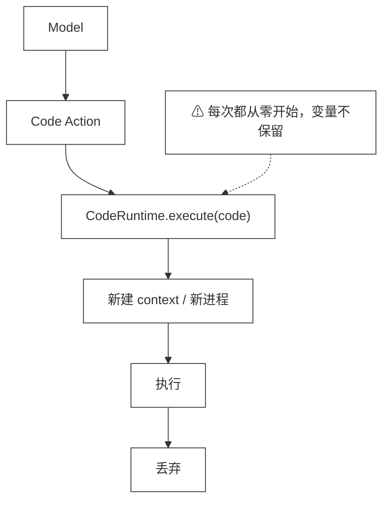
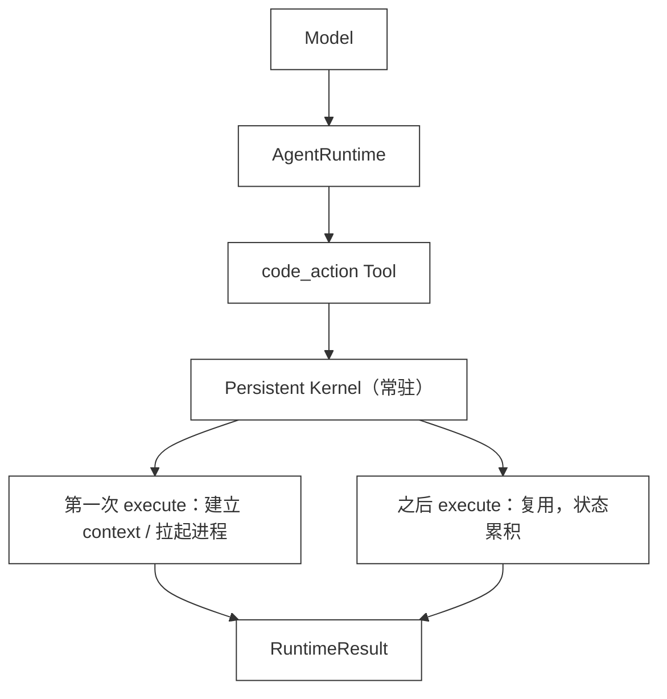
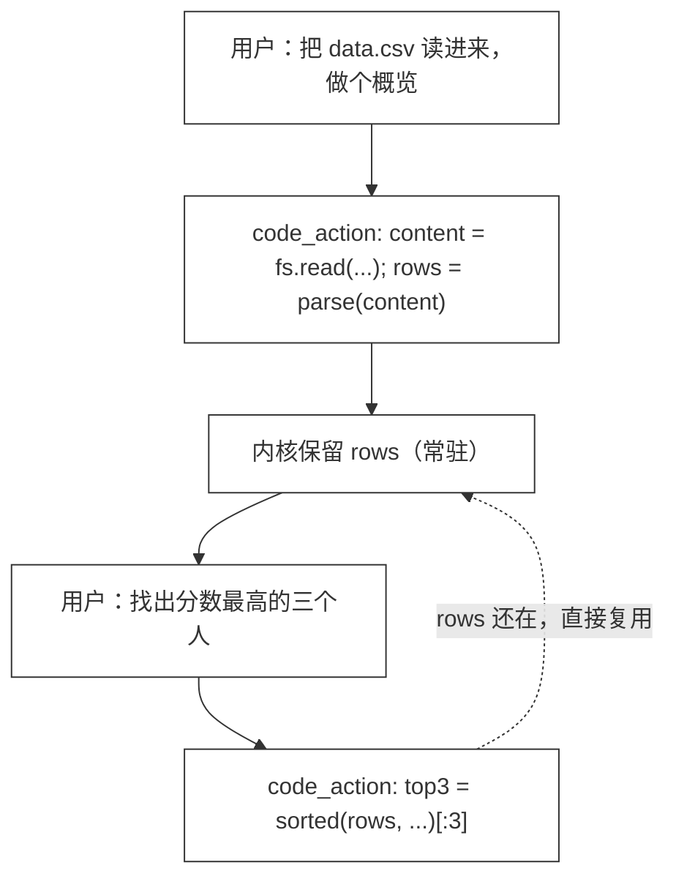
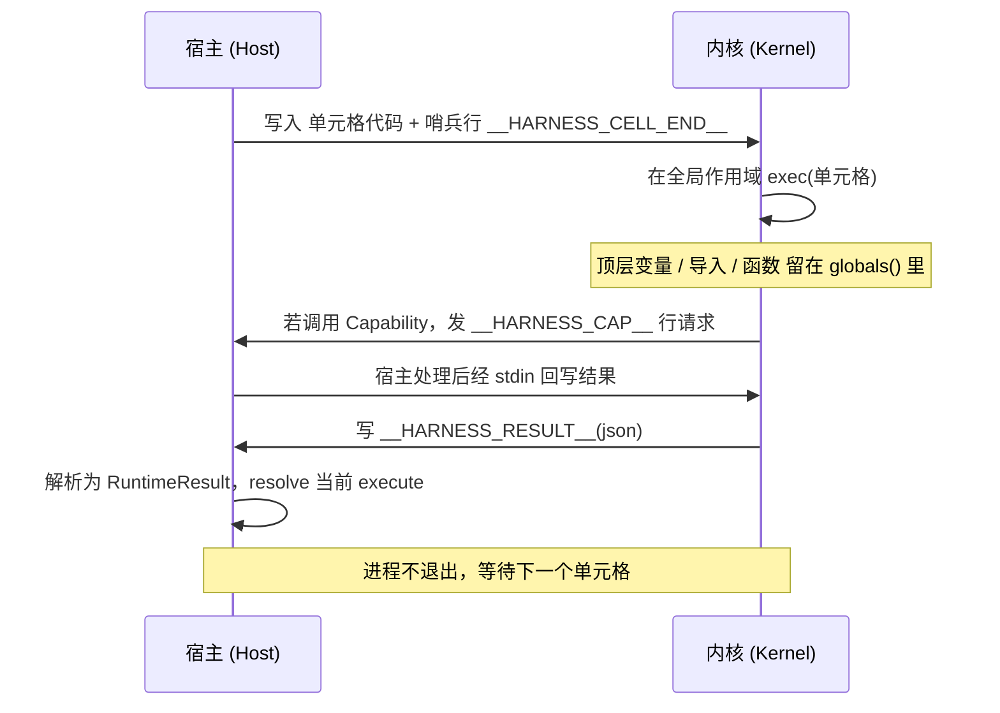

# 46 · Persistent Runtime

> <span class="stage-badge">Stage Hello RLM</span> · <span class="tag-badge">v46-persistent-runtime</span>

上一章（ch45）我们给 Runtime 装上了「能力空间」：`fs`、`shell` 等 Capability 被注入执行环境，模型写的代码可以直接读写工作区、跑命令。这一点咱们前面已经玩明白了。但是请注意，不管是 `JavaScriptRuntime` 还是 `PythonRuntime`，都还有一个共同的、刻意的留白——**每次 `execute` 都是一次性的**：

- JavaScript：`execute` 里现建一个 `vm.Context`，跑完就丢；
- Python：`execute` 里 `spawn` 一个全新的解释器进程，跑完 `sys.exit` 退出。

这一章，我们要把这个留白补上：**把 Runtime 升级成常驻内核（Persistent Kernel）**——一个解释器进程 / 一个 vm 上下文，**常驻存活**，多次 `execute` 之间保留状态。

> **一句话：从 `execute → process → exit` 升级为 `kernel`（常驻），让 `project = load_project()` 之后还能 `analyze(project)`。这一章非常关键，小伙伴们在看代码之前先把「为什么要常驻」想清楚。**

接下来我们要干四件事：

1. 不改 `CodeRuntime` 契约（`execute` / `reset`），把「状态保留」塞进两个 Runtime 的实现里；
2. `JavaScriptRuntime`：复用同一个 `vm.Context`，`reset` 才真正清空；
3. `PythonRuntime`：只启动**一个**长驻子进程，用「单元格 + 哨兵行」协议持续通信；
4. 验证 Capability 桥接在常驻内核里依然工作，并跑通 46 号示例。

<!-- more -->

## 一、上一版存在什么问题？

ch45 的执行模型大概长这样：




那么上面这个执行模型中的一次性执行到底坑在哪？缺陷集中在「一次性」这三个字上：

- **状态不保留**：模型如果想「先读入数据、再做多步分析」，每一步都得把数据重新传来传去；要么所有逻辑塞进一个超长单元格，要么在上下文里反复搬运中间结果；
- **启动浪费**：Python 每次都冷启动一个解释器进程（导入标准库、解析内核脚本……），即便只算一行 `1+1`；
- **表达力受限**：`project = load_project()` 这种「先建立、后消费」的范式根本表达不出来，因为 `project` 活不过这一次 `execute`。

> **我们缺的不是「把变量存到某处」的 hack，而是让 Runtime 本身就持有一个跨调用的执行环境——一个内核。**

## 二、本篇解决什么问题？

本章把两个 Runtime 都改造成「常驻内核」，但**对外契约完全不变**：

```ts
interface CodeRuntime {
  execute(code: string): Promise<RuntimeResult>;
  reset(): Promise<void>;
}
```

也就是说，`createCodeActionTool` / `code-chat` 这些调用方**一行都不用改**——这是这次改造最基本（手动加强语气）的承诺。它的使用姿势是这样：

- 同一个 `runtime` 实例的多次 `execute` 之间，**顶层变量 / 导入 / 函数都会保留**；
- `reset()` 才是真正的「重开一个干净内核」。

升级之后的调用链路长这样：




## 三、先看最终效果

说了这么多，咱们先不抠实现，直接看「常驻内核」跑起来是什么体验——重点是：**同一个 runtime 实例被 agent 在多轮里反复复用，内核替模型记着上一轮留下的变量**。

`createCodeActionTool` 在构造时**只 new 一个** Runtime，之后无论模型发起多少次 `code_action`，都复用这同一个：

```ts
// 构造时只用同一个 runtime 实例（js 或 python 二选一）
const runtime = createCodeRuntime({ language: "python", capabilities });
const codeActionTool = createCodeActionTool({ runtime, capabilities });

// AgentRuntime 在多次 code_action 调用里，复用上面这一个 runtime
const agent = new AgentRuntime({ tools: [codeActionTool], /* ... */ });
```

关键点就在这：**Runtime 不是「每次 code_action 现建现扔」，而是 agent 的常驻外挂**。接下来的四轮交互，感受一下「内核记得上一轮留下的东西」是什么体验：




```text
[Round 1] 用户：把 data.csv 读进来，做个概览
  → model 发出 code_action:
      content = fs.read("data.csv")
      rows = parse(content)
      return {"total": len(rows), "cols": list(rows[0].keys())}
  → Kernel 全局现在有：content, rows   ← 留下来了
  内核回包：{"total": 3, "cols": ["name","score"]}

[Round 2] 用户：算一下平均分
  → model 发出 code_action:
      return avg_score(rows)        # rows 还在，直接拿来用
  → Kernel 全局依旧有：content, rows
  内核回包：84.33

[Round 3] 用户：分数最高的三个人是谁？
  → model 发出 code_action:
      return sorted(rows, key=lambda r: r.score, reverse=True)[:3]
  → 还是那一份 rows，没重新读文件
  内核回包：["Alice","Bob","Carol"]

[Round 4] 用户：把 Carol 那一行的原始字段也给我
  → model 发出 code_action:
      return [r for r in rows if r.name == "Carol"]
  内核回包：{"name":"Carol","score":91}
```

注意看：从 Round 1 到 Round 4，`rows` 一次都没重新读、一次都没塞回对话历史。模型只要说「用 `rows`」就行，内核替它记着。这就是「工作记忆」的直观样子。

#### 如果没有常驻内核会怎样？

要是还停留在第 45 章的一次性内核，同一段对话得退化成这样——每一轮都得把 `rows` 重新建出来，或者把整张表塞回 prompt 让模型「带着走」：

```text
[Round 1] 用户：把 data.csv 读进来
  → code_action: content = fs.read(...); rows = parse(...)   ← 用完即焚
  → 内核回包：{"total": 3, "cols": [...]}

[Round 2] 用户：算平均分
  → code_action: 必须重新 fs.read + parse，才能再拿到 rows   ← 重复劳动
  → 内核回包：84.33

[Round 3] 用户：最高三人
  → code_action: 又一次重新 fs.read + parse ...              ← 又来一遍
```

每轮都要冷启动进程 + 重读文件 + 重解析，既慢又浪费，更别说超长表塞回上下文会把 token 烧穿。常驻内核把这层「重复搬运」整个消掉了——这也是 Persistent Runtime 真正的价值所在。

## 四、架构变化

两种语言的内核形态不同，但遵循同一套心智模型：**内核在第一次 `execute` 时建立，之后复用，直到 `reset` 或超时**。

| | 第 45 章 | 第 46 章（常驻内核） |
|---|---|---|
| JavaScript | 每次 `execute` 新建 `vm.Context` | 复用**同一个** `vm.Context` |
| Python | 每次 `execute` `spawn` 新进程 | 只 `spawn` **一个**进程，循环读单元格 |
| 状态 | 不保留 | 顶层变量 / 导入 / 函数跨 `execute` 保留 |
| 清空 | 无 | `reset()` 销毁内核，下次从零开始 |

从「每次 execute 都从零起一个执行环境」到「持有一个跨调用的内核」，这是本章唯一的架构性变化——而且它完全发生在实现内部，不碰 `CodeRuntime` 契约。接下来我们看下，这背后究竟抽出哪些核心抽象。

## 五、核心抽象

常驻内核落到代码里，其实就三四个一眼能看明白的抽象，没有花活：

- **抽象一：Persistent Kernel（常驻内核）**。它不是一个新类型，而是对「执行环境」的重新定义——一个跨多次 `execute` 存活的 `vm.Context` / 子进程。`ensureKernel()` 负责「第一次才建、之后复用」，`reset()` 负责「彻底丢弃、下次重建」；
- **抽象二：单元格（Cell）**。一次 `execute` 就是一段在**全局作用域**运行的代码单元。顶层赋值（`x = 1` / `var x` / 函数声明 / Python 全局赋值）会落到内核的全局命名空间，于是跨单元格可见；
- **抽象三：单元格协议（Python 专属）**。一个长驻子进程怎么持续服务多个单元格？靠三行约定——**哨兵行** `__HARNESS_CELL_END__` 标记单元格结束、**结果行** `__HARNESS_RESULT__(json)` 回传本次结果、**能力请求行** `__HARNESS_CAP__` 向宿主请求 Capability。整个来回用一张图就说清了：




- **抽象四：返回值通道 `__hr_last__`**。Python 全局作用域里不能写顶层 `return`，于是我们把「模块层级的 `return` / 末尾表达式」统一改写成一次全局赋值 `__hr_last__ = ...`，作为单元格的返回值出口。函数 / 异步函数内部的 `return` 原样保留。

把这几个抽象记住，下面的实现代码就是顺水推舟了。

## 六、实现代码

### 本章改动文件

| 包 | 文件 | 改动 |
|---|---|---|
| `code-runtime` | `src/javascript.ts` | `JavaScriptRuntime` 改为复用持久 `vm.Context`；`reset` 清空内核 |
| `code-runtime` | `src/python.ts` | `PythonRuntime` 改为常驻子进程 + 单元格协议；新增 AST `return` 变换、`textwrap.dedent`、超时/reset 重启 |
| `code-runtime` | `src/tool.ts` | 工具描述补充「常驻内核 / 状态跨调用保留」 |
| `examples` | `stage-5/46-persistent-runtime/demo.mts` | 新增：跨单元格状态、Capability 沉淀、reset 演示 |

`CodeRuntime` 契约本身（`runtime.ts`）、`createCodeRuntime` 工厂、CLI 的 `code-chat` 一行未改——这正是「核心保持小」的好处：能力演进落在实现里，不污染边界。


### 6.1 JavaScript：复用同一个 vm.Context

关键改动极小——把「建 Context」从 `execute` 里搬到「第一次需要时」，之后一直复用：

```ts
export class JavaScriptRuntime implements CodeRuntime {
  // 持久内核：多次 execute 复用同一个 vm.Context
  private context: vm.Context | null = null;

  private ensureKernel(): void {
    if (this.context) return;
    const contextObj: Record<string, unknown> = {
      console: { /* log/info/warn/error 写入 this.output */ },
    };
    // 一次性注入 Capability 命名空间（fs、shell 等）
    for (const cap of this.capabilities) { /* ... */ }
    this.context = vm.createContext(contextObj, {
      codeGeneration: { strings: false, wasm: false },
    });
  }

  async execute(code: string): Promise<RuntimeResult> {
    this.ensureKernel();              // 已存在就直接复用
    this.output = { stdout: [], stderr: [] };
    // 单元格在持久 context 里运行；裸赋值/var/function 会落到 context 全局，跨单元格保留
    const wrapped = `(async () => {\n${source.output}\n})()`;
    const script = new vm.Script(wrapped, { filename: "cell" });
    const value = await withTimeout(
      Promise.resolve(script.runInContext(this.context!, { timeout: this.timeoutMs })),
      this.timeoutMs,
    );
    return { ok: true, stdout: /* ... */, stderr: /* ... */, value, durationMs };
  }

  async reset(): Promise<void> {
    this.context = null;             // 丢弃内核；下次 execute 重建空白 context
  }
}
```

这里有个值得讲清的点：单元格包在 `(async () => { ... })()` 里运行，**所以顶层 `await` 与 `return` 仍然可用**（与 ch45 能力演示完全兼容）；而因为运行在非严格模式，裸赋值 `x = 1` / `var x = 1` / 函数声明会落到 `vm.Context` 的全局对象上——于是它们**在下一次 `execute` 时依然可见**。

> **边界提醒**：`let` / `const` 声明的变量仍是「单元格局部」的，不会跨单元格保留。若想让状态持久，用裸赋值（`x = 1`）或 `globalThis.x = 1`。这一点和 Python 内核「顶层赋值即全局」是一致的。

### 6.2 Python：一个常驻子进程 + 单元格协议

Python 的改造是本章的「重头戏」。我们不再每次 `spawn`，而是**启动一个长驻的解释器进程**，它通过 stdin/stdout 与宿主反复通信。内核脚本的核心是一个死循环（节选自 `python.ts` 的 `buildKernelScript`）：

```python
# 能力命名空间在内核启动时一次性注入
for cap_name, actions in <manifest>:
    ns = types.SimpleNamespace()
    for act in actions:
        setattr(ns, act, lambda *a, _c=cap_name, _a=act, **kw: __hr_cap_call(_c, _a, a[0] if a else (kw or {})))
    globals()[cap_name] = ns

while True:
    lines = []
    while True:
        line = sys.stdin.readline()
        if line == "":
            sys.exit(0)                 # 宿主关闭 stdin → 内核退出
        if line.rstrip("\n") == "__HARNESS_CELL_END__":
            break
        lines.append(line)
    code = textwrap.dedent("".join(lines))   # 处理 heredoc 缩进
    try:
        exec(__hr_compile_cell(code), globals())   # 在全局作用域执行！
        value = globals().pop("__hr_last__", None)
        sys.stdout.write("\n__HARNESS_RESULT__" + json.dumps({"ok": True, "value": value}) + "\n")
    except BaseException:
        traceback.print_exc()
        sys.stdout.write("\n__HARNESS_RESULT__" + json.dumps({"ok": False}) + "\n")
    sys.stdout.flush()
```

因为 `exec(code, globals())` 在**全局作用域**执行，所以 `project = load_project()` 之后，`project` 就留在 `globals()` 里，下一次 `execute` 还能用——这正是「持久内核」的精髓。

#### `return` 怎么办？

`exec` 在全局作用域运行，而 Python **不允许顶层 `return`**（哪怕是写在 `try/except` 里）。ch45 的能力演示大量使用 `return {...}`，不能丢。接下来我们看下怎么解决：用一个小巧的 AST 变换，把「模块层级」的 `return` 改写成 `__hr_last__ = ...`，而函数 / 异步函数内的 `return` 原样保留：

```python
class __hr_ReturnTransformer(ast.NodeTransformer):
    def __init__(self):
        self.depth = 0
    def visit_FunctionDef(self, node):
        self.depth += 1
        self.generic_visit(node)
        self.depth -= 1
        return node
    visit_AsyncFunctionDef = visit_FunctionDef
    def visit_Return(self, node):
        if self.depth == 0:
            return ast.Assign(
                targets=[ast.Name(id="__hr_last__", ctx=ast.Store())],
                value=node.value,
            )
        return node
```

此外，单元格末尾若是一个**表达式**（没写 `return`），也自动捕获为 `__hr_last__`：

```python
if tree.body and isinstance(tree.body[-1], ast.Expr):
    last = tree.body[-1]
    tree.body[-1] = ast.Assign(
        targets=[ast.Name(id="__hr_last__", ctx=ast.Store())],
        value=last.value,
    )
    ast.fix_missing_locations(tree)
```

> 这就是为什么 ch45 的 `return {"file": ..., "length": ...}` 写法在常驻内核里依然能跑——`return` 只是被悄悄改成了一次全局赋值，这一波操作可以说相当骚气了😏。

#### 超时 / reset 的语义

- **超时**：`execute` 内部有计时器；一旦超时，宿主 `SIGKILL` 掉内核进程，把当前单元格判为失败，并**重启一个干净内核**，避免卡死；
- **reset**：宿主直接 `SIGKILL` 掉内核进程，`this.proc = null`；下一次 `execute` 会重新拉起。

也就是说，`reset()` 是唯一能让内核「忘掉一切」的入口——在 agent 切换任务、或用户显式「清空上下文」时调用。

## 七、运行 Demo

```bash
node --import tsx examples/stage-5/46-persistent-runtime/demo.mts

# 想用真实模型交互体验常驻内核（多轮 code_action 之间变量保留），可运行：
#   pnpm dev -- --chat --code-runtime python --code-capabilities
```

示例（`examples/stage-5/46-persistent-runtime/demo.mts`）覆盖：

1. Python：单元格 1 用 `fs.read` 载入 `data.csv` 并沉淀为 `rows`；单元格 2 直接复用 `rows` 算出均值 / 最高分；
2. Python：Capability 结果（`total`）在后续单元格里继续可用；
3. JavaScript：裸赋值 `count = 0` → `count += 3` → `count += 1`，跨单元格累积为 `4`；
4. `reset()` 后，Python 的 `rows` 不再存在于 globals，JS 的 `count` 变为 `undefined`；
5. reset 之后可重新从空白内核起步。

实测输出如下：

```text
--- Python：跨单元格累积状态（持久内核） ---
  Py step 1 → completed · value=null · 564ms
    stdout:
已载入 3 行

  Py step 2 → completed · value={"avg":84.33333333333333,"top":"Alice"} · 1ms

--- Python：Capability 结果沉淀到内核全局 ---
  Py cap read → completed · value={"rows":3} · 1ms
    stdout:

  Py reuse total → completed · value={"reused_total":3} · 1ms

--- JavaScript：裸赋值跨单元格保留 ---
  JS seed → completed · value=0 · 31ms
  JS increment → completed · value=3 · 5ms
  JS increment again → completed · value=4 · 4ms

--- reset 清空内核 ---
  Py after reset → completed · value={"rows_still_here":false} · 308ms
  JS after reset → completed · value="undefined" · 5ms

--- reset 后可重新从空白内核起步 ---
  Py fresh → completed · value=42 · 0ms

✅ 所有测试完成，临时目录已清理
```

## 八、新架构解决了什么？

把一次性内核换成常驻内核，解决的不是某一个点，而是一连串此前绕不开的别扭：

- **状态保留（最核心）**：顶层变量 / 导入 / 函数跨 `execute` 保留，模型可以「先建立、后消费」，比如 `project = load_project()` 之后还能 `analyze(project)`；
- **启动不再浪费**：Python 不再每轮冷启动解释器进程，只 `spawn` 一次，之后所有单元格复用同一进程；
- **自动延伸到 agent 多轮**：因为 Runtime 是 agent 的常驻外挂，第 3 节那个「四轮对话里 `rows` 一直在」的效果是免费的，调用方无需任何额外处理；
- **Capability 桥接只建一次**：能力命名空间（fs、shell…）在内核启动时按 manifest 注入，协议和第 45 章完全一样，只是现在它跨越多次 `execute` 持续生效。一个很自然的写法是——

```python
# 单元格 1：通过 Capability 读工作区文件，结果沉淀到内核全局
content = fs.read("data.csv")
rows = parse(content)

# 单元格 2：直接复用上一步的 rows
return {"avg": avg_score(rows), "top": top_scorer(rows)}
```

`rows` 不需要被塞回模型上下文再传回来——它就在内核里。

## 九、它又引入了什么问题？

重点来了：常驻带来便利，也带来代价。内核「什么都记得」这件事，本身就是一把双刃剑：

1. **状态会泄漏**：常驻内核不会自动清状态。同一会话里前一次任务的变量会「污染」后一次——所以该在任务边界调用 `reset()`；
2. **JS 的 `let`/`const` 是单元格局部**：想跨单元格保留，用裸赋值或 `globalThis.x`；
3. **Python 顶层 `await` 暂不支持**：`exec` 在全局作用域不支持顶层 await（需异步函数包裹）。需要异步能力时，用 Capability 的同步桥接或 `asyncio.run(...)`；
4. **内核生命周期要管好**：`reset` / 超时都会 `SIGKILL` 子进程；宿主退出前应主动 `reset`，否则常驻进程会挂着（示例与 CLI 都会在结束时清理）；
5. **`vm` 不是安全沙箱**：常驻内核依旧只该执行模型生成的、受 Capability 约束的代码，不能跑不可信生产代码。

#### 什么时候该 reset？

接下来是一个容易踩坑的点：既然内核「什么都记得」，那什么时候该让它忘？一般来讲，当 agent **切换任务 / 换一个数据集 / 用户显式「清空上下文」**时，就该调一次 `reset()`，把上一份工作的残留变量清掉，避免「上次的 `rows` 偷偷污染这次的分析」。换句话说：**任务边界 = reset 边界**。

## 十、下一章

状态现在能跨调用保留了，但「Runtime 状态」和「对话上下文（Messages）」还泾渭分明。所以问题很明显，能不能把这二者统一起来？下一章 **#47 Runtime State** 就来填这个坑：

```text
Context = Conversation + Runtime State
```

我们会让 Runtime 的内部状态变成「可被上下文检索 / 引用」的一等公民，为后面 #48 Context as Variable、#49 Context Search 铺路。

### 小结

简单小结一下：这一章咱们把 CodeRuntime 从一个「用完即焚」的一次性执行器，升级成了常驻内核。重点其实就一句话——**状态保留落在实现里，契约一行没动**。接下来感兴趣的小伙伴可以顺着 #47 Runtime State 继续往下看，看看内核状态怎么和对话上下文揉到一起。

> 尽信书则不如，以上内容，纯属一家之言，因个人能力有限，难免有疏漏和错误之处，如发现 bug 或者有更好的建议，欢迎批评指正，不吝感激。

微信公众号: 一灰灰Blog