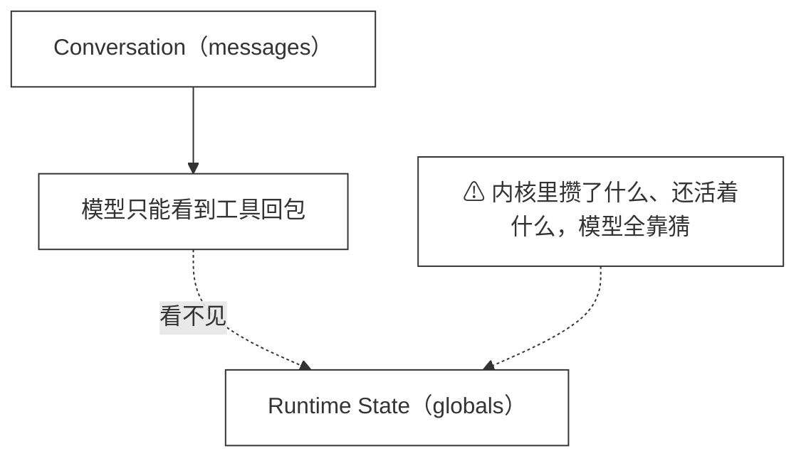
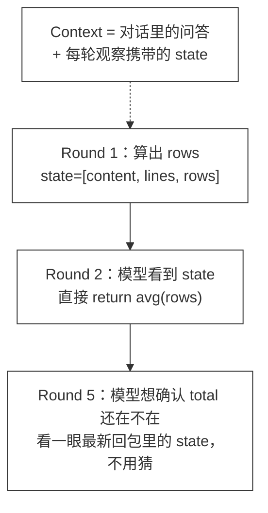
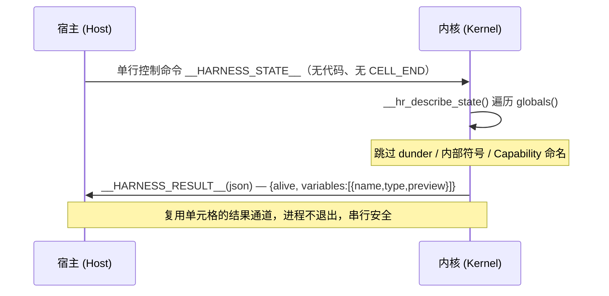

# 47 · Runtime State

> <span class="stage-badge">Stage Hello RLM</span> · <span class="tag-badge">v47-runtime-state</span>

上一章（ch46）咱们把 Runtime 升级成了常驻内核：`rows = parse(fs.read("data.csv"))` 之后，`rows` 就一直活在内核里，后续单元格随取随用。但不知道你有没有意识到一个问题——**内核什么都记得，可只有内核自己知道**。

模型那边呢？它看得到的是每次 `code_action` 回包里的 stdout / value。至于第 1 轮算好的 `rows` 现在还在不在？叫这个名字吗？有没有被后面哪一轮覆盖掉？——模型一概不知，只能靠猜：要么不敢用（重复计算，白烧 token），要么乱用（NameError / 用错旧值）。上一章结尾留的那个坑——「Runtime 状态和对话上下文泾渭分明」——这一章就来填上：

> **一句话：把 Context 从 `Messages` 升级为 `Conversation + Runtime State`。给 CodeRuntime 契约加上第三个生命周期动作 `describe()`，让内核状态变成可观察的一等公民，并让它随着每次 code_action 的观察自动进入对话上下文。**

接下来我们要干四件事：

1. 扩展 `CodeRuntime` 契约：新增 `RuntimeState` 类型与 `describe()`；
2. `JavaScriptRuntime`：内核创建时做一次全局属性基线快照，`describe()` 用只读探针报告「多出来的变量」；
3. `PythonRuntime`：单元格协议加一条状态检查控制行 `__HARNESS_STATE__`，复用同一个结果通道回摘要；
4. `code_action` 工具的观察自带 `state` 字段，CLI 与系统提示同步更新，跑通 47 号示例。

<!-- more -->

## 一、上一版存在什么问题？

ch46 之后的执行模型里，「对话」和「内核状态」是两个没有桥的平行世界：



 

这个「看不见」具体坑在哪？集中在三件事上：

- **不敢复用**：常驻内核最大的好处是「中间结果沉淀下来接着用」，但模型不确定 `rows` 还在不在，最安全的策略就退化成重新读文件、重新解析——ch46 省下来的那点开销，又被模型的不确定吃回去了；
- **覆盖无感知**：第 8 轮随手一句 `rows = [...]`，悄悄覆盖了第 1 轮辛苦攒下的 `rows`，模型自己都不知道世界变了；
- **调试黑盒**：别说模型了，人翻会话记录也看不到内核 globals 里有什么——出了问题只能往单元格里塞 `print(globals())` 挠痒。

> **我们缺的不是又一个 print 调试法，而是让「内核里有什么」变成上下文里结构化、权威、随手可得的一部分。**

## 二、本篇解决什么问题？

本章对 Context 的定义做一次正式升级：

```text
以前：Context = Messages

现在：Context = Conversation + Runtime State
```

落到代码上，就是给 `CodeRuntime` 契约加一个纯观察动作（这是整个 Stage 第一次、也是唯一需要动契约的地方）：

```ts
interface CodeRuntime {
  execute(code: string): Promise<RuntimeResult>;
  describe(): Promise<RuntimeState>;   // ← 新增：观察内核状态
  reset(): Promise<void>;
}

interface RuntimeState {
  /** 内核是否存活（尚未启动或已被 reset 时为 false）。 */
  alive: boolean;
  /** 模型创建的全局变量：名字 / 类型 / 截断预览。 */
  variables: { name: string; type: string; preview: string }[];
}
```

三条承诺先立好：

- `execute` / `reset` 的语义**零改动**，调用方已有的代码一行不用动；
- `describe()` 是**纯观察**：不执行用户代码、不污染全局命名空间；内核没启动时返回 `{ alive: false, variables: [] }`，绝不会为了「看一眼」而拉起一个新内核；
- 观察结果会由 `code_action` 工具**自动附在每轮回包里**送进对话——这就是「Context = Conversation + Runtime State」的真正落点。

## 三、先看最终效果

老规矩，先看跑起来长什么样。下面是 47 号示例的真实输出（节选）：

```text
--- 冷启动前：describe() 不会为了看状态而拉起内核 ---
  Py describe (before) → alive=false · variables=[空]

--- Python：单元格攒下的变量进入 Runtime State ---
  Py describe → alive=true · variables=[content:str, lines:list, rows:list, avg_score:function]
      content (str) = 'name,score\nAlice,90\nBob,75\nCarol,88\n'
      rows (list) = [{'name': 'Alice', 'score': 90}, {'name': 'Bob', ...]
      avg_score (function) = <function avg_score at 0x...>

--- JavaScript：裸赋值可见，let/const 是单元格局部 ---
  JS describe → alive=true · variables=[count:number, extra:string]

--- code_action 观察自带 state ---
  value   = {"rows":3}
  state   = ["content","lines","rows","avg_score","total"]  ← 这段随工具结果进入了对话
```

注意最后一段：`total` 是这一次单元格刚创建的，回包的 `state` 里立刻就能看到它。放到多轮对话里，模型的体验是这样的：




从「猜内核里有什么」到「看一眼就知道」，这就是本章要的效果。

## 四、架构变化

两种语言的实现路径不同，但对外是同一个动作：`describe()`。本章动的是「状态可观察」，所以改动集中在 Runtime 契约、两个内核实现、工具与 CLI 上。先把落地位置用一张树形总览摆出来，再展开对比与协议细节。

### 4.1 文件变动（树形一览）

```text
packages/
├── code-runtime/                # 核心：状态可观察的实现
│   └── src/
│       ├── runtime.ts           # CodeRuntime 契约新增 describe()；新增 RuntimeState / RuntimeStateEntry 类型
│       ├── javascript.ts        # 内核创建时记录全局属性基线；新增只读探针与 describe()
│       ├── python.ts            # 协议新增 __HARNESS_STATE__ 控制行；主循环/注入包进 __hr_main__/__hr_inject_capabilities__
│       └── tool.ts              # code_action 观察携带 state；支持外部传入 runtime 实例
├── cli/
│   └── src/
│       └── code-chat.ts         # 系统提示教模型按名复用 state；打印 Kernel State 摘要行
└── examples/
    └──  stage-5/47-runtime-state/
        └── demo.mts             # 冷启动语义 / 跨语言状态清单 / 观察携带 state / reset 归零
```

改动面很克制：契约只多了 `describe()` 一个生命周期动作，内核与工具各自把「看一眼」接上，没有任何一处在动执行边界。

### 4.2 前后对比：第 46 → 第 47

| | 第 46 章 | 第 47 章 |
|---|---|---|
| JavaScript | 复用同一个 `vm.Context` | + 内核创建时记**基线快照**；`describe()` 在 context 里跑只读探针 |
| Python | 单元格协议（CELL_END / RESULT / CAP） | + 控制行 `__HARNESS_STATE__`：不进单元格流水线，复用同一结果通道回摘要 |
| code_action 观察 | `RuntimeResult` | `RuntimeResult` **+ `state`**（随观察进入 messages） |
| 内核脚本卫生 | 主循环/注入循环的临时变量泄漏在 `globals()` | 主循环包进 `__hr_main()`、能力注入包进 `__hr_inject_capabilities()` |

最后一行值得单独说一句：要让 Runtime State 干净，得先让内核自己不乱丢垃圾——否则 `describe()` 报告出来的第一页全是 `line`、`code`、`payload` 这类内核内部变量。这也是为什么本章顺手做了一次内核脚本卫生整改。

### 4.3 状态检查协议（Python 侧时序）




## 五、核心抽象

- **抽象一：Runtime State（可观察的内核命名空间）**。它不是新存储，只是持久内核 globals 的一份**最小投影**：每个变量报三个字段——名字、类型、截断到 80 字符的预览。够模型判断「这是什么、还在不在」，又不至于把大对象整个拖进上下文；
- **抽象二：`describe()` 纯观察通道**。Python 侧走的是独立控制行：宿主写一行 `__HARNESS_STATE__`，内核遍历 globals 后用**同一个** `__HARNESS_RESULT__` 结果行回包——协议面没有变大，只是多了一种请求类型。JavaScript 侧更简单：在持久 context 里跑一段固定的探针表达式；
- **抽象三：基线快照（baseline）**。JS 内核创建那一刻，globalThis 上已经有成堆内建（Object、Promise……）加上 console 和 Capability 命名空间。创建时记一份属性名单，之后 `describe()` 只报告「多出来的」——剩下的自然就是模型亲手创建的变量。Python 用「下划线前缀 + 内部符号跳过表」达到同样效果；
- **抽象四：观察即上下文**。`code_action` 的回包带上 `state`，意味着 Runtime State 不再需要一个专门的「查看状态工具」——它搭着每一次执行的便车进入对话。Context = Conversation + Runtime State，从此是一句可以指着代码说的话。

## 六、实现代码

> 本节贴出各部分关键代码；完整改动位置见第四节的「文件变动（树形一览）」。

### 6.1 契约：runtime.ts

```ts
/** 内核全局命名空间里一个变量的最小描述：名字 / 类型 / 截断预览。 */
export interface RuntimeStateEntry {
  name: string;
  type: string;
  preview: string;
}

/** Runtime State 摘要：Context = Conversation + Runtime State 中「状态」一侧的最小可观察形态。 */
export interface RuntimeState {
  alive: boolean;
  variables: RuntimeStateEntry[];
}

export interface CodeRuntime {
  execute(code: string): Promise<RuntimeResult>;
  /**
   * 描述内核当前的 Runtime State。
   * 内核未启动 / 已被 reset 时返回空摘要，不会为了「看一眼」拉起新内核。
   */
  describe(): Promise<RuntimeState>;
  reset(): Promise<void>;
}
```

### 6.2 JavaScript：基线快照 + 只读探针

内核创建那一刻记下初始全局属性（JS 内建 + console + Capability），之后探针只报告增量：

```ts
this.context = vm.createContext(contextObj, { /* ... */ });

// 记录内核初始全局属性：内建对象 + console + Capability 命名空间。
const names = new vm.Script("Object.getOwnPropertyNames(globalThis).join('\\n')")
  .runInContext(this.context, { timeout: this.timeoutMs }) as string;
this.baseline = new Set(names.split("\n"));
```

`describe()` 在同一个 context 里跑一段固定探针，枚举自有属性的名字 / 类型 / 截断预览，再减去基线：

```ts
async describe(): Promise<RuntimeState> {
  if (!this.context || !this.baseline) return emptyRuntimeState();
  try {
    const raw = new vm.Script(DESCRIBE_SNIPPET).runInContext(this.context, {
      timeout: this.timeoutMs,
    }) as RuntimeStateEntry[];
    const variables = raw
      .filter((entry) => !this.baseline!.has(entry.name) && !entry.name.startsWith("__"))
      .map(({ name, type, preview }) => ({ name, type, preview }));
    return { alive: true, variables };
  } catch {
    return { alive: true, variables: [] };   // 探针失败不影响 execute 主路径
  }
}
```

探针本身（`DESCRIBE_SNIPPET`）是个纯表达式：逐个属性 `JSON.stringify` 取预览、超 80 字符截断、序列化失败降级 `String(v)`——绝不因为某个怪异值把整次观察搞挂。顺带一提，它的输出还免费验证了 ch46 留下的那条边界提醒：`let hidden = ...` 声明在 IIFE 里，是单元格局部，**根本不会出现在 state 清单里**；裸赋值的 `count` 和 `globalThis.extra` 则看得清清楚楚。

### 6.3 Python：控制行 + 状态探针 + 内核卫生

内核脚本新增两个函数。先是状态探针：

```python
def __hr_describe_state():
    skip = set(["json", "sys", "ast", "types", "textwrap", "fs", "shell"])
    items = []
    for name, val in list(globals().items()):
        if name.startswith("__") or name in skip:
            continue
        try:
            preview = repr(val)
        except BaseException:
            preview = "<unrepr>"
        if len(preview) > 80:
            preview = preview[:77] + "..."
        items.append({"name": name, "type": type(val).__name__, "preview": preview})
    return {"alive": True, "variables": items}
```

然后主循环开头加一条控制行的分发——它不进入单元格流水线：

```python
def __hr_main():
    while True:
        line = sys.stdin.readline()
        if line == "":
            sys.exit(0)
        # 状态检查控制行：不进单元格流水线，直接回一份 Runtime State 摘要
        if line.rstrip("\n") == "__HARNESS_STATE__":
            payload = __hr_describe_state()
            sys.stdout.write('\n__HARNESS_RESULT__' + json.dumps({"ok": True, "value": payload}) + "\n")
            sys.stdout.flush()
            continue
        lines = [line]          # ↓ 以下是原有的单元格读取逻辑
        ...
__hr_main()
```

两个细节值得点名：

- **内核卫生**：主循环原来平铺在模块层，`line` / `lines` / `code` / `value` 这些循环变量会一直赖在 `globals()` 里，连 `except` 分支里的 `import traceback` 都会给状态清单添堵。把主循环包进 `__hr_main()`、能力注入包进 `__hr_inject_capabilities()` 之后，局部变量归局部，`globals()` 里只剩模型亲手创建的东西——`describe()` 的输出立刻干净了；
- **通道复用**：宿主侧把 `execute` 和 `describe` 收敛到同一个私有 `send()`：注册 pending、计时器、写行、等 `__HARNESS_RESULT__` 回包，一套逻辑两处使用。所以状态检查天然继承单元格的全部既有语义——超时杀内核重启、串行排队、`\r\n` 归一化，一个都不用重写。

宿主侧的 `describe()` 还有一条贴心语义：内核没启动时**直接返回空摘要**，不去拉进程——「看一眼状态」永远不应该有副作用。

### 6.4 工具与 CLI：让 state 长在观察里

`createCodeActionTool` 在每次执行后追加一次 `describe()`，把摘要拼进回包：

```ts
const result = await runtime.execute(code);
const state = await runtime.describe();
return { ok: true, value: { ...result, state } };
```

同时给它加了 `runtime?: CodeRuntime` 选项：传入时工具不再自建内核，而是复用调用方持有的那个——不然宿主拿不到内核句柄，ch46 说的「任务边界 = reset 边界」就成了空话。CLI 侧（`code-chat.ts`）：系统提示明确告诉模型「state 就是当前存活变量清单，按名字复用，别重算」，事件渲染里补了一行 Kernel State 摘要，人也能看到内核里有什么了。

## 七、运行 Demo

```bash
node --import tsx examples/stage-5/47-runtime-state/demo.mts

# 想在真实模型交互里体验「模型看着 state 复用变量」，可运行：
#   pnpm dev -- --chat --code-runtime python --code-capabilities
```

示例（`examples/stage-5/47-runtime-state/demo.mts`）覆盖：

1. 冷启动前 `describe()` 返回 `alive=false`，且**不拉起内核**；
2. Python：单元格创建 `content / lines / rows / avg_score` 后，state 清单逐项可见（含类型与截断预览），且**不含任何内核内部变量**；
3. 「对话很瘦、状态很厚」对照：两轮对话只有两条短消息，内核却替它记着全部中间结果；
4. JavaScript：裸赋值 `count` 与 `globalThis.extra` 进状态，`let hidden` 不进（单元格局部）；
5. 工具视角：`code_action` 回包自带 `state`，新变量 `total` 当轮即可见；
6. `reset()` 后两侧 `describe()` 都回到 `alive=false`——任务边界 = reset 边界。

实测输出如下：

```text
=== 47 · Runtime State：Context = Conversation + Runtime State ===

--- 冷启动前：describe() 不会为了看状态而拉起内核 ---
  Py describe (before) → alive=false · variables=[空]
  JS describe (before) → alive=false · variables=[空]

--- Python：单元格攒下的变量进入 Runtime State ---
  Py describe → alive=true · variables=[content:str, lines:list, rows:list, avg_score:function]
      content (str) = 'name,score\nAlice,90\nBob,75\nCarol,88\n'
      lines (list) = ['Alice,90', 'Bob,75', 'Carol,88']
      rows (list) = [{'name': 'Alice', 'score': 90}, {'name': 'Bob', 'score': 75}, ...
      avg_score (function) = <function avg_score at 0x00000186A4EACD60>

--- Conversation 很瘦（只记答案），Runtime State 很厚（记着全部中间结果） ---
  Conversation: 2 条消息（模型上下文里的部分）
  Runtime State: ["content","lines","rows","avg_score"]（内核替对话记着）

--- JavaScript：裸赋值可见，let/const 是单元格局部 ---
  JS describe → alive=true · variables=[count:number, extra:string]

--- code_action 观察自带 state（Context = Conversation + Runtime State） ---
  value   = {"rows":3}
  state   = ["content","lines","rows","avg_score","total"]  ← 这段随工具结果进入了对话
  value#2 = {"avg":84.33}

--- reset：任务边界 = reset 边界 ---
  Py describe (after reset) → alive=false · variables=[空]
  JS describe (after reset) → alive=false · variables=[空]

✅ 所有测试完成，临时目录已清理
```

## 八、新架构解决了什么？

- **模型敢用内核了**：state 是「现在还有什么」的权威清单。看到 `rows:list` 活着，就直接 `avg_score(rows)`，不再重新 `fs.read`——常驻内核的价值终于被模型全额兑现；
- **覆盖变得可见**：哪个变量被改名、被覆盖、被新建，下一轮回包的 state 立刻反映，模型不再活在过时的假设里；
- **人也有了观察窗**：CLI 每轮打印 Kernel State 摘要，调试 agent 行为时不用再往单元格里塞 print；
- **契约依旧干净**：`describe()` 是纯观察，`execute` / `reset` 语义零改动，44～46 号示例原样通过回归——能力演进照旧发生在实现与观察侧，不动执行边界；
- **为下一跃迁备好了数据面**：#48 要把 context 本身变成内核变量、#49 要对上下文做 search / slice——前提都是「状态先成为结构化数据」。本章正是把这块地基打好。

## 九、它又引入了什么问题？

老规矩，说清楚代价：

1. **token 成本随变量数线性上涨**：每轮观察都驮着一份 state，变量攒得越多回包越胖。80 字符截断是止血不是治疗——「哪些信息值得留在上下文里」的预算问题，留给 #50 Context Compaction；
2. **preview 只是冰山一角**：`repr` / `JSON.stringify` 的首段预览能判断「是什么」，不能替代真值；十万行的 `rows` 在 state 里也只有开头几个字符。要看全量，还是得在代码里主动处理；
3. **串行假设**：`describe()` 与单元格共用一个 pending 通道，同一时刻只能有一个在途请求。单个内核内没问题，等 #54 Parallel Subagents 把多个内核并行跑起来时，这套协议要重新审视；
4. **基线法的盲区**：JS 侧如果模型覆盖了内建（比如 `JSON = ...`），基线法只看得见「新增」看不见「替换」；Python 侧以下划线命名的用户变量会被静默跳过。边界情况，但要知道它在；
5. **alive ≠ 正确**：`alive:true` 只说明进程活着，不代表里面的数据对新任务还有意义——脏状态的清理仍然依赖人在任务边界调 `reset()`，Harness 不会也不会替你判断语义。

#### 什么时候该看 state？什么时候该信 state？

一句话版本：**写代码前看一眼（决定复用什么），任务切换时清零（reset）**。state 是观察不是承诺——它是给你和模型看的仪表盘，不是持久化保证；真正要留下的结论，应该写回工作区或显式存档，而不是指望内核替你记住一切。

## 十、下一章

状态现在可观察了，但模型的姿势还是「被动接收」：每轮观察推给它什么就看什么。下一章 **#48 Context as Variable** 开始反客为主——把 context 本身变成内核里可以编程操作的变量：

```python
ctx = context.current()

items = ctx.search("authentication")
```

模型将第一次主动检索、切片、整理自己的上下文。今天这份 `RuntimeState` 结构化投影，正是明天 `ctx` 的第一个可用数据源。

### 小结

简单小结一下：这一章咱们把「内核记得什么」从黑盒变成了上下文里的一份结构化清单——契约加了一个 `describe()`，协议加了一行控制命令，观察多了一个 `state` 字段，从此 **Context = Conversation + Runtime State** 不再是口号，而是代码里真实存在的三行类型定义。

> 尽信书则不如，以上内容，纯属一家之言，因个人能力有限，难免有疏漏和错误之处，如发现 bug 或者有更好的建议，欢迎批评指正，不吝感激。

微信公众号: 一灰灰Blog
