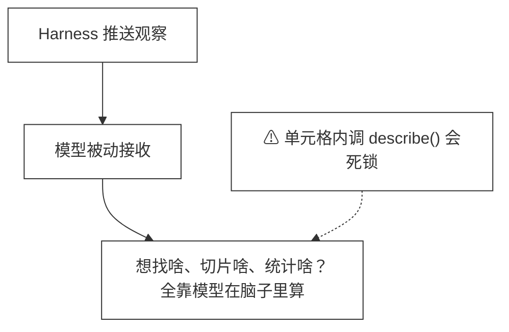

# 48 · Context as Variable

> <span class="stage-badge">Stage Hello RLM</span> · <span class="tag-badge">v48-context-variable</span>

上一章（ch47）咱们把 Runtime State 变成了可观察的一等公民：`describe()` 返回内核 globals 里的变量清单，`code_action` 的每次观察自带 `state` 字段。模型终于能「看见」内核里有什么了——但依然是被动的：观察推给它什么，它就看什么。

这一章，咱们要反客为主——**把 Context 本身变成内核里可以编程操作的变量**：

```python
ctx = context.current()          # 获取完整上下文（对话历史 + Runtime State）
items = ctx.search("authentication")  # 检索相关片段
recent = ctx.slice(-5, None)    # 最近 5 轮对话
summary = ctx.summarize()       # 概览统计
```

这是 Prime Agent / RLM 架构里 **Prompt-as-a-Variable** 的核心落地：Context 不再是 Harness 推送给模型的死板数组，而是模型可以随时查询、切片、整理的数据结构。

> **一句话：Context = Conversation + Runtime State，现在它变成了内核里的一个 `context` 对象，模型主动操作，而不是被动接收。**

接下来我们要干四件事：

1. 新增 `context` Capability：`current / search / slice / summarize / getRuntimeState` 五个动作；
2. 打破「内核构造需能力、能力需内核」的循环依赖：用可变引用延迟绑定 `CodeRuntime`；
3. `code-chat` 注入 `context` capability，系统提示教模型主动查询上下文；
4. 48 号示例：演示搜索、切片、概览、组合用法，并解释「单元格内不能调用 describe()」的死锁边界。

<!-- more -->

## 一、上一版存在什么问题？

ch47 之后的状态：模型能看到 `state` 字段（内核变量清单），但对话历史依然只能通过被动推送的 tool 回包看到。具体痛点：

- **检索靠猜**：想找第 3 轮提到的 `checkAuth` 函数签名？只能翻历史、或把全量历史塞进 prompt 让模型自己找——token 暴涨；
- **切片没有**：想只看最近 3 轮对话？没 API，全得自己在代码里手写切片逻辑；
- **概览没有**：当前上下文有多少消息、多少工具调用、Runtime State 有多少变量？全靠模型数；
- **Runtime State 还是「旁观者」**：`describe()` 是宿主调的，单元格内调会死锁（见下文），模型只能等宿主把 `state` 推过来。




## 二、本篇解决什么问题？

给内核注入一个 `context` 对象，暴露五个动作：

```python
context.current()       # -> { messages: [...], runtimeState: {alive, variables:[...]} }
context.search("query") # -> { results:[{index, role, snippet, score}], total }
context.slice(start, end?) # -> { messages:[...], total }
context.summarize()     # -> { messageCounts:{user,assistant,tool}, totalMessages, runtimeVariables, runtimeAlive }
context.getRuntimeState() # -> { alive, variables:[...] }  # 等价于 describe()
```

模型现在可以：

```python
# 先搜上下文里有没有提过 "auth"
found = context.search("auth")
if found.total > 0:
    # 再读文件确认
    content = fs.read("auth.ts")
```

不再需要把全量历史塞给模型让它「带着走」——Context 变成了可查询的数据结构。

## 三、先看最终效果

下面是 48 号示例的真实输出（节选）：

```text
=== 48 · Context as Variable：Context 成为可编程变量 ===

--- context.search() / slice() / summarize()：不依赖 Runtime State，直接可用 ---
  search: ok: true, stdout: 搜索结果数: 0
  slice: ok: true, stdout: 前 2 条: 0 总条数: 0
  summarize: ok: false  ← 需要 describe()，单元格内会死锁

--- 先在内核里攒变量，宿主更新缓存后再查看 ---
  缓存中的 Runtime 变量: content, lines, user_count
  user_count 预览: 3

--- 组合使用：搜索上下文找到相关代码，再读文件验证 ---
  ok: true, stdout: 搜到 checkAuth: 1 次
  文件内容前 200 字: export interface User { id: string; name: string; role: "admin" | "user"; }...

--- 通过 code_action tool 使用 context capability（模拟模型调用）---
  ok: true
  stdout: 搜到 api: 1 次
  api.ts 前 150 字: import { checkAuth } from "./auth"...
  最近对话条数: 0
  tool 返回的 state 变量: content, lines, user_count

--- 宿主侧直接调用 describe()（单元格间隙，安全）---
  alive: true, variables: content, lines, user_count
```

关键点：

- `search / slice / summarize` **不依赖 `describe()`**，在单元格内直接可用（纯宿主侧逻辑）；
- `current / getRuntimeState` 需要 `describe()`，**在单元格内会死锁**（内核单线程，正执行单元格时无法处理控制行）；
- 解决方案：**宿主在每次 `execute` 后更新 `runtimeState` 缓存**，单元格内读缓存；这正是 `code-chat` 的做法——`tool:end` 事件里自动更新，模型通过 `state` 字段看到。

## 四、架构变化

改动集中在 `coding` 包的 Context Capability 与 `cli` 的注入逻辑上

### 4.1 文件变动（树形一览）

```text
packages/
├── coding/                      # 核心：Context 可编程
│   └── src/
│       ├── capabilities.ts      # 新增 createContextCapability；五个动作实现；可变引用打破循环依赖
│       └── index.ts             # 导出 createContextCapability
├── cli/
│   └── src/
│       └── code-chat.ts         # 注入 context capability；系统提示教主动查询；循环依赖打破逻辑
└── examples/
    └── stage-5/48-context-as-variable/
        └── demo.mts             # 搜索 / 切片 / 概览 / 组合用法 / 死锁边界演示
```

改动面很克制：没动 `CodeRuntime` 契约，只在 Capability 空间里加了一个 `context` 对象，并把「循环依赖」用可变引用悄悄解开。

### 4.2 前后对比：第 47 → 第 48

| | 第 47 章 | 第 48 章 |
|---|---|---|
| Context 观察 | 被动：每轮 code_action 推送 `state` | 主动：模型调 `context.search/slice/...` 查询 |
| 对话历史 | 只在 messages 里，模型翻不动 | `context.search/slice` 可检索、分页 |
| Runtime State | 只能通过宿主推送的 `state` 看到 | `context.getRuntimeState()` 单独可取（宿主侧） |
| 循环依赖 | 无 | Capability 需 `CodeRuntime`、`CodeRuntime` 需 Capability → 可变引用打破 |
| 死锁边界 | 无 | 单元格内不能调 `describe()`，文档与系统提示明示 |

### 4.3 新增核心抽象

- **Context Capability**：把 `AgentContext`（对话）+ `CodeRuntime`（Runtime State）合成一个可编程的 `context` 对象，注入内核全局命名空间；
- **可变引用**：`createContextCapability(ctx, { current: codeRuntime })` —— 先造能力（引用为空），再造 runtime（注入能力），最后回填引用，打破循环。

## 五、核心抽象

1. **Context Capability**（`packages/coding/src/capabilities.ts`）：
   - `current()`：返回 `{ messages, runtimeState }` —— 完整上下文快照；
   - `search(query)`：在对话历史里做简单子串匹配，返回命中片段与下标；
   - `slice(start, end)`：对话历史分页，支持负数下标；
   - `summarize()`：统计 user/assistant/tool 消息数、总条数、Runtime 变量数、内核存活；
   - `getRuntimeState()`：等价于 `describe()`，返回 `RuntimeState`。

2. **循环依赖打破**：(`packages/cli/src/code-chat.ts`)
   ```ts
   const codeRuntimeRef = { current: null as CodeRuntime | null };
   const codeRuntime = createCodeRuntime(..., { capabilities: base });
   codeRuntimeRef.current = codeRuntime;
   const contextCap = createContextCapability(session.context, codeRuntimeRef);
   const fullRuntime = createCodeRuntime(..., { capabilities: [...base, contextCap] });
   codeRuntimeRef.current = fullRuntime;
   ```
   先用基础能力（fs/shell）造一个 runtime，把它塞进引用，再造 context capability，最后用完整能力造最终 runtime 并回填引用。

3. **死锁边界与缓存方案**：
   - 内核单线程：正跑单元格时，stdin 里塞不进 `__HARNESS_STATE__` 控制行；
   - `summarize()`、`current()`、`getRuntimeState()` 内部会 `await codeRuntime.describe()` → 死锁；
   - 方案：宿主在 `execute()` 返回后立即异步 `describe()` 更新缓存，单元格内读缓存；
   - `code-chat` 里 `tool:end` 事件自动做这件事，模型通过 `state` 字段拿到最新 Runtime State。

   为什么单元格内调 `describe()` 会卡死？一张图说清死锁路径与缓存解法：

   ```mermaid
   %%{init: { 'flowchart': { 'handDrawn': true } } }%%
   flowchart TD
       classDef boxStyle fill:#ffffff,stroke:#333,stroke-width:1px
       A["单元格执行中（内核单线程）"]:::boxStyle --> B["调用 current() / summarize() / getRuntimeState()"]:::boxStyle
       B --> C["内部 await codeRuntime.describe()"]:::boxStyle
       C --> D["需宿主写 __HARNESS_STATE__ 控制行"]:::boxStyle
       D -. "stdin 被当前单元格占用，控制行进不来" .-> E["⚠ 死锁：单元格等 describe，describe 等单元格结束"]:::boxStyle
       F["宿主在 tool:end 异步 describe() 更新缓存"]:::boxStyle --> G["单元格内只读 runtimeState 缓存"]:::boxStyle
       G --> H["安全拿到 Runtime State，不死锁"]:::boxStyle
   ```

  

## 六、实现代码

> 本节贴出各部分关键代码；完整改动位置见第四节的「文件变动（树形一览）」。

### 6.1 Context Capability：capabilities.ts

```ts
export function createContextCapability(
  agentContext: AgentContext,
  codeRuntimeRef: { current: CodeRuntime },
): Capability {
  function messagesToEntries() {
    return agentContext.messages.map(m => ({
      role: m.role,
      content: typeof m.content === "string" ? m.content : JSON.stringify(m.content),
    }));
  }

  const current: CapabilityHandler = async () => {
    const runtimeState = await codeRuntimeRef.current.describe();
    return { messages: messagesToEntries(), runtimeState };
  };

  const search: CapabilityHandler = async (args: unknown) => {
    const query = String(args ?? "");
    if (!query.trim()) return { results: [], total: 0 };
    const entries = messagesToEntries();
    const lowerQuery = query.toLowerCase();
    const results = entries
      .map((entry, index) => ({
        index,
        role: entry.role,
        snippet: entry.content.slice(0, 200),
        score: entry.content.toLowerCase().includes(lowerQuery) ? 1 : 0,
      }))
      .filter(r => r.score > 0);
    return { results, total: results.length };
  };

  const slice: CapabilityHandler = async (args: unknown) => {
    const { start = 0, end } = (args as Record<string, unknown>) ?? {};
    const entries = messagesToEntries();
    return { messages: entries.slice(start, end), total: entries.length };
  };

  const summarize: CapabilityHandler = async () => {
    const entries = messagesToEntries();
    const runtimeState = await codeRuntimeRef.current.describe();
    return {
      messageCounts: {
        user: entries.filter(e => e.role === "user").length,
        assistant: entries.filter(e => e.role === "assistant").length,
        tool: entries.filter(e => e.role === "tool").length,
      },
      totalMessages: entries.length,
      runtimeVariables: runtimeState.variables.length,
      runtimeAlive: runtimeState.alive,
    };
  };

  const getRuntimeState: CapabilityHandler = async () => {
    return codeRuntimeRef.current.describe();
  };

  return {
    name: "context",
    description: "Programmatic access to the agent's context...",
    actions: { current, search, slice, summarize, getRuntimeState },
  };
}
```

注意：`search`/`slice` 纯宿主侧逻辑，**不调用 `describe()`**，单元格内可直接用；`summarize`/`current`/`getRuntimeState` 需要 `describe()`，**单元格内会死锁**。

### 6.2 code-chat：注入与系统提示

```ts
// 可变引用打破循环依赖
const codeRuntimeRef = { current: null as CodeRuntime | null };
const codeRuntime = createCodeRuntime(options.language, {
  timeoutMs: options.codeTimeoutMs,
  capabilities: hasCapabilities ? createCodingCapabilities(workspace) : undefined,
});
codeRuntimeRef.current = codeRuntime;

const session = await createOrResumeSession(store, options.language, resumeId, hasCapabilities, hasContext);

const contextCapability = hasContext
  ? createContextCapability(session.context, codeRuntimeRef)
  : undefined;

const capabilities = hasCapabilities
  ? [...createCodingCapabilities(workspace), ...(contextCapability ? [contextCapability] : [])]
  : undefined;

registry.register(createCodeActionTool(options.language, {
  timeoutMs: options.codeTimeoutMs,
  runtime: codeRuntime,
  capabilities,
}));
```

系统提示（`codeSystemPrompt`）新增：

```text
特别注意：内核里注入了 context 对象，你可以随时用 context.current() 获取完整上下文，
用 context.search("关键词") 检索相关片段，用 context.slice(start, end) 分页，
用 context.summarize() 看概览。这是「Context as Variable」：上下文不再是被动推送
的观察，而是你可以主动查询、切片的数据结构。

善用 context 对象：需要上下文信息时直接调用 context.search() 或 context.current()，不要猜。
```

## 七、运行 Demo

```bash
node --import tsx examples/stage-5/48-context-as-variable/demo.mts

# 真实模型交互体验（需配置模型）：
#   pnpm dev -- --chat --code-runtime python --code-capabilities
# 然后在对话里试： "搜一下上下文里有没有提到 checkAuth"
```

示例覆盖：

1. `search / slice / summarize` 不依赖 `describe()`，单元格内直接可用；
2. 先在内核攒变量，宿主更新缓存后读缓存（模拟 `context.current()` 的 runtimeState 部分）；
3. 组合使用：`context.search` 找线索 → `fs.read` 验证；
4. `code_action` tool 模拟模型调用：搜索上下文、读文件、切片最近对话，工具回包自带 `state`；
5. 宿主侧直接 `describe()`（单元格间隙，安全）；
6. 关键点总结：哪些动作单元格内可用、哪些会死锁、缓存方案怎么工作。

### 真实体验

我们在 `examples/stage-5/48-context-as-variable` 下面准备几个测试文件 `auth.ts` 和 `api.ts`

接下来我们以Chat对话流，来看看代码内容读取、修改的相关能力

```bash
$ hello --chat --code-runtime python --code-capabilities

Hello Harness · Code Action Chat (python)（输入 exit 退出，Ctrl+C 取消运行）
Runtime : Python 子进程（最小内存环境） + Capability (fs, shell)
Sessions: D:\Workspace\hui\project\hello-harness/.code-sessions
Session : 1bac0e9d-7ad6-418c-b713-3563a9b183b6

你 > 帮我读取一下 examples/stage-5/48-context-as-variable/auth.ts 中的 checkAuth 函数
```


读取成功之后，我们再来看看内核态的上下文

```bash
你 > 刚才读的内容存在内核里吗？帮我确认一下当前 Runtime State 有哪些变量
```


再接下来，我们让它直接完成代码的逻辑修改

```bash
你 > 把 auth.ts 里的 checkAuth 改成：user 也可以访问 admin 资源
```

观察代码的输出，我们可以看到上下文中的变量是可以直接引用，大模型生成的代码会直接使用上下文变量，而不需要重复的设置


## 八、新架构解决了什么？

- **模型主动查询上下文**：不再被动等观察推送，想找啥直接 `context.search("关键词")`，token 省得多；
- **上下文变成了数据结构**：切片、统计、检索全有现成 API，模型写代码组合即可，不需要 Harness 专门造「上下文管理工具」；
- **Runtime State 与对话历史统一入口**：`context.current()` 一次性拿到 Conversation + Runtime State，Context = Conversation + Runtime State 落地为一个对象；
- **为 #49 Context Search、#50 Context Compaction 铺路**：搜索有了原语（search/slice），压缩有了统计入口。

## 九、它又引入了什么问题？

老规矩，说清楚代价：

1. **单元格内死锁边界**：`summarize`/`current`/`getRuntimeState` 在单元格内会死锁，必须靠宿主缓存。系统提示和文档要反复强调，否则模型会反复踩坑；
2. **搜索是朴素子串匹配**：`search` 只做 `includes`，不做语义搜索、不分词、不排序。真实场景需要向量检索 / BM25，留给 #49 Context Search；
3. **对话历史只读**：`slice` 返回副本，模型不能通过 context 删改历史。要删改得用 Harness 级的 mutation（Stage 6），这也是安全边界；
4. **缓存一致性**：宿主异步更新缓存，单元格内读到的可能是上一轮的 Runtime State。单轮内变量变动极快时会有短暂不一致，接受「最终一致性」；
5. **能力膨胀的开端**：context capability 本身也是一个 capability，以后还会加 `memory`、`skill`、`agent` 等 capability——Harness 正在从「给模型几十个 Tool」进化成「给模型几个 Capability 空间」，这正是 RLM 的精髓。

---

## 十、下一章

简单小结一下：这一章咱们把 Context 从「被动推送的观察流」变成了「内核里可编程的 `context` 对象」——五个动作覆盖了查、切、统计、取状态，模型第一次拥有了**主动操作上下文**的能力。死锁边界虽然有，但缓存方案把它管住了，且这正是 `code-chat` 已经在跑的生产逻辑。

> 尽信书则不如，以上内容，纯属一家之言，因个人能力有限，难免有疏漏和错误之处，如发现 bug 或者有更好的建议，欢迎批评指正，不吝感激。

微信公众号: 一灰灰Blog