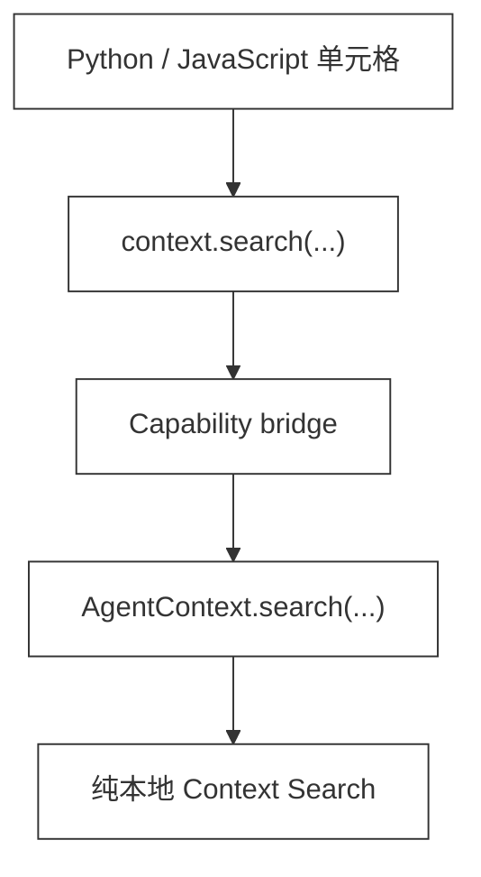
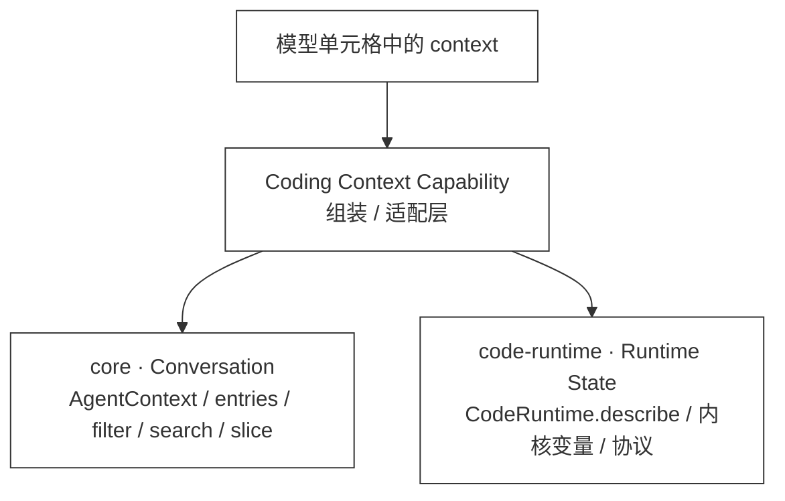

# 49 · Context Search

> <span class="stage-badge">Stage Hello RLM</span> · <span class="tag-badge">v49-context-search</span>

一般来讲，上一章（ch48）咱们终于让模型能写 `context.search("auth")`，主动翻自己的对话历史。这当然是个好的开始，但说白了那只是一个能跑的起点：底层是 `includes()`，所有命中都拿同一段开头文本，既不能区分「用户刚提出的约束」和「很长的 tool 输出」，也没法分页。

这一章，咱们就把它收敛成一个真正可用、但仍然小得能看懂（手动加强语气）的 **本地 Context Search**：

```python
# 在内核里按相关性搜索，并只看用户说过的话
page = context.search({
    "query": "认证失败",
    "roles": ["user"],
    "limit": 5,
})

for hit in page["results"]:
    print(hit["score"], hit["snippet"])

# 还可以把上下文缩成某几类消息，或按全局下标切片。
tools = context.filter({"roles": ["tool"]})
recent = context.slice(-5, None)
```

搜索完全在 Harness 宿主侧执行：不上传会话、不依赖模型服务，也不读取 Runtime State，所以在运行中的 Python / JavaScript 单元格里安全可用。

> **一句话：把「朴素 `includes`」升级成带相关性排序、角色过滤、分页和命中片段的本地 Context Search——而且领域逻辑下沉到 `core`，只让 `coding` 做 façade 适配。**

<!-- more -->

## 一、上一版存在什么问题？

ch48 的 `context.search("auth")` 当然有价值，但说白了，它只是最朴素的子串匹配（手动加强语气）：

- 命中顺序等于消息出现顺序，不等于相关性；
- 每个结果永远截取内容开头 200 字，命中点在末尾时看不到线索；
- 没有 `roles`，模型想找用户约束时会被 tool 输出淹没；
- 没有 `limit` / `offset`，长会话的搜索结果又会反过来撑大 Context；
- 搜索实现放在 `coding` Capability 中，`core` 自己并没有可复用的「查询 Context」能力。

那么问题来了：把 Context 变成变量之后，怎么让它「有边界地可查询」？这正是一个很典型的 Harness 问题：**把 Context 变成变量之后，还要让它可以被有边界地查询。**

## 二、本篇解决什么问题？

接下来进入正题，咱们新增一组 provider 无关、纯本地的 core 查询函数，使用姿势大概是这样：

```text
AgentContext
  ├─ entries()                       # 保留原始全局下标的可序列化视图
  ├─ filter({ roles })                # 角色过滤
  └─ search({ query, roles, offset, limit })
       └─ BM25-style 排序 + 精确短语加分 + 命中附近 snippet
```

`context` Capability 只把这些能力桥接进内核，链路非常直白：



这里重点关注一点：咱们刻意不做向量数据库，也不声称「语义搜索」。本章解决的是——在**当前会话**里，用少量、可解释代码，把准确命中排好序并限制回包大小。

### 2.1 先划边界：`context` 不是一个包的名字

接下来有个坑得先填：ch47 / ch48 / ch49 这三章都叫「Context」，很容易（手动加强语气）被放错位置。作为勤于思考的小同学，先给结论：**模型看见的 `context` 是一个 façade（统一入口）；它不等于某个包拥有全部实现。**



| 问题 | 正确归属 | 原因 |
| --- | --- | --- |
| 对话里有哪些消息？如何搜索、过滤、分页？ | `core` | 只依赖 `Message`；不应知道 Python、JavaScript、子进程或 Provider |
| 内核还活着吗？变量有哪些？如何读取？ | `code-runtime` | 依赖 Runtime 的执行模型、生命周期和 Python 控制行协议 |
| 为什么模型能调用同一个 `context.search()` / `context.current()`？ | `coding` | 这里是面向 Coding Agent 的组装层，负责桥接两个独立的数据源 |
| 如何把它注入会话、展示给人？ | `cli` | 这是产品入口，不应反向污染核心抽象 |

因此，ch47 的 `CodeRuntime.describe()` 必须留在 `code-runtime`；它是对持久内核的观察。ch49 的 `searchContext()` 必须留在 `core`；它只是在查询 Conversation 数据。两者概念上共同组成 `Context = Conversation + Runtime State`，**物理实现却不应该相互依赖**。

**请注意**：尤其不要为了让 `context.current()` 返回一个统一对象，就在 `core` 中 import `CodeRuntime`。那会让最基础的模型 / 对话包反向依赖具体执行环境，直接破坏「Runtime 不绑定 Provider、Core 保持小」的边界。正确做法是当前采用的 `createContextCapability(agentContext, codeRuntimeRef)`：由外层拿到两项依赖后再组合。

### 2.2 同一入口下，动作也有两类

接下来看一张很关键的表——同一个 `context` 入口下，动作其实分两类：

| `context` 动作 | 数据源 | 单元格执行中是否安全 |
| --- | --- | --- |
| `search` / `filter` / `slice` | `core` 的 Conversation | 是；完全不访问内核 |
| `current` / `summarize` / `getRuntimeState` | Conversation + `CodeRuntime.describe()` | Python 单元格执行中否；ch48 说明了单线程控制通道的死锁边界 |

这是为什么本章把搜索实现下沉到 `core`，但仍保留 `context` Capability：**下沉的是领域逻辑；保留的是模型面对的编程接口。**

## 三、先看最终效果

老规矩，先看跑起来长什么样。运行示例：

```bash
node --import tsx examples/stage-5/49-context-search/demo.mts
```

实测输出如下（节选）：

```text
--- 精确函数名：短消息也能排在冗长 tool 输出之前 ---
命中多条：
  [2] assistant · score=... · terms=check, auth
    我会先检查 auth.ts 中的 checkAuth，再追踪 API handler。

--- 角色过滤：只检索用户的约束，不让 tool 输出淹没它 ---
用户消息命中 2 条：认证接口偶发 401，请定位 checkAuth 的调用链。 | 不要改代码，只给我认证失败的排查建议。

--- 分页：先拿一页，再用 offset 继续拿 ---
总命中 3，第 1 页 [...], 第 2 页 [...]

✅ Context Search 演示通过
```

结果的核心形状如下：

```ts
{
  query: "checkAuth",
  total: 4,                 // 分页前的匹配数
  offset: 0,
  limit: 3,
  results: [{
    index: 2,               // 在完整 messages[] 中的位置
    role: "assistant",
    snippet: "我会先检查 auth.ts 中的 checkAuth，再追踪 API handler。",
    score: 5.1042,
    matchedTerms: ["check", "auth"],
  }],
}
```

## 四、架构变化

改动落在 `core` 的本地检索实现、`coding` 的 façade 与 `cli` 的提示上——先把落地位置用一张树形总览摆出来，再展开对比与边界原则。

### 4.1 文件变动（树形一览）

```text
packages/
├─ core/
│  └─ src/context/
│     ├─ context.ts       # AgentContext 增加 entries / filter / search
│     └─ search.ts        # 新增：纯函数、BM25-style 本地检索
├─ coding/
│  └─ src/context-capability.ts # Context façade：组合 Conversation 与 Runtime State
└─ cli/
   └─ src/code-chat.ts    # 提示模型使用 query / roles / limit
```

### 4.2 前后对比：第 48 → 第 49

| | 第 48 章 | 第 49 章 |
|---|---|---|
| 搜索实现位置 | `coding` Capability 内的朴素 `includes` | 下沉到 `core` 的 `searchContext`（纯函数、provider 无关） |
| 相关性 | 无排序，命中按消息顺序 | BM25-style 排序 + 精确短语加分 + 命中附近 snippet |
| 角色过滤 | 无 `roles` | 支持 `roles` 过滤（user / assistant / tool） |
| 分页 | 无 `limit` / `offset` | 支持分页，默认 10 条、最多 50 条 |
| 命中片段 | 固定截取开头 200 字 | 命中附近 snippet，长 tool 输出不再淹没线索 |
| 边界 | 搜索依赖 Capability | 领域逻辑在 `core`，`coding` 只做 façade 适配 |

### 4.3 核心边界原则

最重要的边界没有变（手动加强语气）：`core` 不认识 CodeRuntime、Capability 或具体模型；`search.ts` 只接收 `Message[]` 的可序列化视图。`coding` 的 `context-capability.ts` 才知道如何把 Conversation 与 Runtime State 送进内核。

## 五、核心抽象

### 5.1 保留原始位置的 ContextEntry

接下来看抽象一。过滤后的数组下标不等于它在完整会话中的位置，所以（手动加强语气）每条记录都保留 `index`：

```ts
export interface ContextEntry {
  index: number;
  role: Role;
  content: string;
}
```

这样 `context.search()` 找到第 27 条后，模型可以再用 `context.slice(25, 30)` 取周边消息；`filter()` 和 `slice()` 也不会丢失定位信息。

### 5.2 小而可解释的 BM25-style 排序

抽象二：小而可解释的 BM25-style 排序。每条消息是一篇 document，query 被拆成术语，分数由三部分组成：

```text
score = Σ BM25(term frequency, document frequency, document length)
      + 3（完整 query 短语出现时）
```

- 稀有词比高频词更有辨识度；
- 同一个词重复出现会加分，但收益递减；
- 超长 tool 输出不会仅凭长度占优势；
- `checkAuth` 会按 camelCase 拆为 `check`、`auth`；中文按字符拆分，不依赖分词库；
- 同分时优先较新的消息，较符合排查当前任务的直觉。

这不是为了替代成熟检索系统，而是为了让小伙伴看清：**相关性排序是 Context Search 的能力，不是又一个 JSON Tool。**

### 5.3 有界结果和两种缩小方式

抽象三：有界结果和两种缩小方式。`search` 默认只返回 10 条，最多 50 条；调用者可用 `offset` 翻页。`filter` 不做全文排名，只按角色保留消息：

```python
# 找用户真正的需求
requirements = context.search({"query": "不要改", "roles": ["user"], "limit": 3})

# 单独复盘工具观察
observations = context.filter({"roles": ["tool"]})
```

这两个 API 都是只读的副本，模型不能借此删改历史；Context mutation 仍留给后续 Continual Harness 的受控流程。

## 六、实现代码

下面给出核心实现。`packages/core/src/context/search.ts` 的入口保持很小：

```ts
export function searchContext(
  entries: readonly ContextEntry[],
  options: ContextSearchOptions,
): ContextSearchResult {
  const candidates = filterContext(entries, options);
  // 建 document frequency，计算 BM25-style score，完整 phrase 额外加分
  // 按 score 降序、index 降序排序，再返回 slice(offset, offset + limit)
}
```

`AgentContext` 只是委托给纯函数，因而仍然是 provider 无关的核心对象：

```ts
entries(): ContextEntry[] {
  return contextEntries(this._messages);
}

search(options: ContextSearchOptions): ContextSearchResult {
  return searchContext(this.entries(), options);
}
```

接下来看 Capability 侧的使用姿势：现在支持对象参数，同时保留上一章的字符串写法：

```ts
context.search("auth")
context.search({ query: "auth", roles: ["tool"], offset: 10, limit: 5 })
context.filter({ roles: ["user", "assistant"] })
```

`limit` 在 core 中被钳制到 50，空 query 直接返回空页。这是最小但实际的防护：模型不能一次把整段长会话又塞回上下文。

**接着重点来了**：`context-capability.ts` 不是把新领域逻辑塞回 Coding 包；它只做参数转换、Capability bridge 和两类数据源的组合。搜索的分词、排序、过滤、分页仍完全由 `core/context/search.ts` 承担。这种「**领域逻辑向内，面向模型的适配向外**」的拆分，正是后续增加 Runtime、CLI 或其他 Agent 入口时不复制逻辑的原因。

## 七、运行 Demo

```bash
# 无模型、无网络，验证排序、过滤、分页与全局下标
node --import tsx examples/stage-5/49-context-search/demo.mts

# 类型检查
pnpm typecheck

# 构建教程站点
pnpm docs:build
```

想愉快地用真实模型体验一把？启动已有的 Code Action Chat：

```bash
pnpm dev -- --chat --code-runtime python --code-capabilities
```

可以试着这样要求模型（骚操作预警）：

```text
只检索本次对话中用户说过的“不要修改”的约束，给出命中和对应下标。
```

它应写出类似 `context.search({"query": "不要修改", "roles": ["user"], "limit": 5})` 的代码，而不是重新猜测或展开所有历史。

## 八、新架构解决了什么？

那么问题来了，这一通改造到底解决了啥？简单来讲：

- **结果有相关性**：精确函数名、稀有术语和短消息不再被长日志掩盖；
- **输出有边界**：`limit` 与 `offset` 让检索结果本身不会制造新的 Context 膨胀；
- **约束可定向找回**：按 role 搜用户需求、按 tool 搜观察、按 assistant 搜既有决定；
- **core 可复用**：未来的 compaction、subagent context selection 都可复用同一套 `entries / filter / search`；
- **本地且可解释**：没有外部服务、索引写入和隐式数据流，示例可离线复现。

## 九、它又引入了什么问题？

接下来是老规矩的代价盘点——有啥用、坑在哪，得说清楚：

1. **仍非语义搜索**：`登录失败` 不会自动理解为 `authentication error`；向量检索或混合检索可在需要时替换这里的实现。
2. **中文处理是教学级**：逐字 token 能做到零依赖匹配，不等于专业分词；更复杂语料需要独立 tokenizer。
3. **每次查询都扫描全量 Context**：对本章的小型会话足够清楚；超长会话才需要增量倒排索引和持久化。
4. **分数不是概率**：它只用于同一次结果排序，不应跨会话或跨版本比较。
5. **只会找，不会减**：虽然能选出值得保留的消息，真正替换/压缩 prompt 还需要下一章的 Compaction policy。

## 十、下一章

现在模型不必吞下所有历史才能找回一条约束：它可以搜索、过滤、分页，并根据结果继续写代码。但消息仍然都留在 Context 里；会话越久，传给模型的 prompt 还是会增长。

下一章 **50 · Context Compaction** 将讨论另一个关键转折：Harness 不再自动粗暴总结，而是让 Agent 依据搜索结果，主动决定哪些信息保留、压缩或丢弃。

### 小结

简单小结一下：这一章咱们把「朴素 `includes`」升级成了真正可用的本地 Context Search——相关性排序、角色过滤、分页和命中片段一应俱全，而且把领域逻辑下沉到 `core`、只让 `coding` 做 façade 适配。模型的编程接口没变（还是 `context.search(...)`），但背后已经能看清「谁该负责什么」的边界。感兴趣的小伙伴可以顺着 #50 Context Compaction 继续往下看，看看 Agent 怎么自己决定哪些信息该留、该压、该丢。

> 尽信书则不如，以上内容，纯属一家之言，因个人能力有限，难免有疏漏和错误之处，如发现 bug 或者有更好的建议，欢迎批评指正，不吝感激。

微信公众号: 一灰灰Blog
